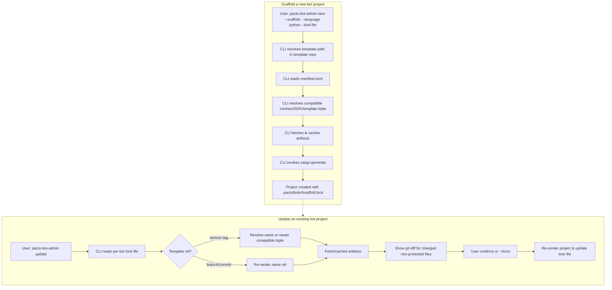

## Summary

Turn `pacto-bot-admin` into a compatibility-aware bootstrapper that resolves a versioned contract, a published SDK, and a `cargo-generate` template from a single versioned git template repository, then writes the chosen versions into `.pacto/scaffold.lock`. Add an `update` command that re-renders a project while protecting user-edited files by default. Existing projects generated before the lock file are unsupported by `update`; migration is handled by a standalone LLM skill file.

## Problem Frame

Today `pacto-bot-api` is one Rust crate (`0.4.1`) that ships the daemon, the admin CLI, the JSON-RPC contract (`schemas/jsonrpc.json`), the generated Python SDK (`python/`), and the bot project templates (`templates/python/`). The templates are embedded into the admin CLI binary at compile time via `include_dir!("templates")` (`src/scaffold/generate.rs`), so every template tweak, SDK fix, or scaffold behavior change requires a full daemon/admin CLI release. Version numbers are already inconsistent: crate `0.4.1`, schema `0.1.0`, Python SDK `0.1.0`. There is no independent SDK publishing pipeline or template update mechanism. This coupling slows iteration and makes it impossible to ship a new template or SDK fix without cutting a full crate release.

## Key Decisions

- **Per-template compatibility metadata, not a centralized registry.** Each template declares its required contract version range, SDK version range, and compatible daemon version range. The CLI reads that metadata after resolving the template ref. This lets new languages and bot kinds be added by adding templates to the repository, without central coordination.
- **Single template repository, multiple templates.** One repository hosts templates for each language and bot kind (e.g., `python-llm`, `python-governance`). The CLI selects a template by path within that repo, not by cloning a different repo per template.
- **`cargo-generate` as a subprocess.** The bespoke Liquid engine in `src/scaffold/template.rs` is replaced by an invocation of `cargo-generate`. This trades a runtime dependency for a community-standard engine and unlocks future template features.
- **Protected-by-default update.** `pacto-bot-admin update` skips files listed as protected by the template unless the user passes `--force`. No three-way merge or interactive file-by-file prompt is required for the first version.
- **Offline cache after initial sync.** Templates and SDKs are cached locally after first fetch. The CLI does not require network for subsequent `new` or `update` operations if the required artifacts are already cached. Network is only required for initial sync or an explicit refresh.
- **Migration via an LLM skill, not a CLI command.** Pre-lock projects are not migrated by `pacto-bot-admin`. Instead, a `SKILL.md` file gives an LLM the steps to rewrite an old project to the new lock-tracked structure. This is acceptable because the current user base is one person and the bots are AI-generated.

## Actors

- A1. **Bot author** — runs `pacto-bot-admin new` and `pacto-bot-admin update` to create and refresh bot projects.
- A2. **Daemon maintainer** — owns the daemon crate and ensures it consumes a published contract artifact.
- A3. **SDK maintainer** — owns the Python SDK release and its PyPI publishing workflow.
- A4. **Template author** — adds or edits templates in the template repository and keeps their compatibility metadata current.

## Requirements

### Contract and SDK decoupling

R1. The JSON-RPC contract (`schemas/jsonrpc.json`) is published as an independent versioned artifact with its own semver (e.g., `pacto-contract@0.1.0`).
R2. The daemon and the Python SDK consume the published contract artifact as the source of truth for generated types, not an in-repo path. The contract artifact is published from the `pacto-bot-api` artifacts repository; the SDK pulls it in at build time. The in-repo `schemas/jsonrpc.json` may remain as a compatibility snapshot or reference, but generated types must derive from the published artifact.
R3. The Python SDK is published to PyPI as an independent package with its own semver (e.g., `pacto-bot-sdk@0.2.0`).
R4. Generated bot projects declare a dependency on the published PyPI SDK package, not on a vendored local wheel built from `templates/python/sdk/`.

### Template delivery

R5. Templates move out of the daemon crate into a separate, versioned git repository.
R6. One template repository hosts multiple templates, organized by language and bot kind (e.g., `python-llm`, `python-governance`).
R7. Each template includes a `manifest.toml` declaring the required contract version range, SDK package name and version range, compatible daemon version range, and a list of protected files.
R8. `pacto-bot-admin` resolves a template by language, bot kind, and optional git ref (tag, branch, or commit) from the template repository; when no ref is supplied, it defaults to the latest semver tag.
R9. `pacto-bot-admin` fetches the selected template to a local cache and then invokes `cargo-generate` on that path to render the project.

### CLI bootstrapper behavior

R10. `pacto-bot-admin new --scaffold` remains the single entry point for creating a bot project.
R11. The CLI reads the selected template's compatibility metadata and selects a contract/SDK/template triple that satisfies the template's constraints, including the compatible daemon version range.
R12. The CLI aborts with a clear error if no compatible contract/SDK/template triple can be resolved.
R13. New languages and bot kinds are supported by adding templates to the template repository; no daemon changes are required. The CLI may need to accept new values for existing `--language` and `--kind` arguments.

### Project lifecycle and lock file

R14. After scaffolding, the CLI writes a per-bot `.pacto/bots/<bot-id>/scaffold.lock` file recording the template path (language and kind), template git ref, contract artifact name, contract version, SDK package name, SDK version, and admin CLI version.
R15. The per-bot lock file is the source of truth for `pacto-bot-admin update`.
R16. `pacto-bot-admin update` reads the per-bot lock file. For semver tags, it resolves the same or a newer compatible contract/SDK/template triple; for branch or commit refs, it re-renders the same ref. It then re-renders the project and updates the lock file with the newly resolved versions.

### Update behavior

R17. `pacto-bot-admin update` skips files listed as protected in the template metadata unless `--force` is passed. For files that are not protected but differ from the cached template, the CLI shows a `git diff` style preview before overwriting and requires confirmation.
R18. When `--force` is passed, the CLI overwrites protected files without prompting.
R19. `pacto-bot-admin update` does not require network access when the resolved contract/SDK/template triple is already present in the local cache.
R20. Projects generated before the per-bot lock file existed are not supported by `pacto-bot-admin update`.

### Offline and cache

R21. The CLI caches contract artifacts, SDKs, and templates locally after first fetch.
R22. The CLI provides a flag to refresh the cache from the remote template repository and re-resolve contract, SDK, and template versions.
R23. The CLI does not require a network connection for `new` or `update` once the needed contract artifacts, SDKs, and templates are cached.

### Migration

R24. A standalone LLM skill file at `skills/pacto-bot-migration/SKILL.md` documents the steps to migrate a pre-lock project to the new lock-tracked structure.
R25. The skill file is referenced from the `update` command's error message when a per-bot lock file is missing.

## Key Flows

F1. **Scaffold a new bot project**
   - **Trigger:** A1 runs `pacto-bot-admin new --scaffold <bot-id> --language python --kind llm`.
   - **Actors:** A1, A4 (via template metadata).
   - **Steps:**
     1. CLI selects the `python-llm` template from the configured template repository.
     2. CLI reads the template's compatibility metadata.
     3. CLI resolves a compatible contract/SDK/template triple using the template's metadata and the target daemon version.
     4. CLI fetches the template (or uses the local cache) and invokes `cargo-generate`.
     5. CLI renders the project and writes `.pacto/bots/<bot-id>/scaffold.lock`.
   - **Outcome:** A runnable bot project with a pinned, reproducible contract/SDK/template triple.

F2. **Update an existing bot project**
   - **Trigger:** A1 runs `pacto-bot-admin update` in a project directory that contains `.pacto/bots/<bot-id>/scaffold.lock`.
   - **Actors:** A1.
   - **Steps:**
     1. CLI reads the lock file.
     2. CLI resolves the latest compatible contract/SDK/template triple.
     3. CLI fetches the contract artifact, SDK, and template (or uses cache).
     4. CLI re-renders files, skipping protected files unless `--force` is passed, and shows a `git diff` preview for changed non-protected files before overwriting.
     5. CLI updates the lock file with the new resolved versions.
   - **Outcome:** The project is refreshed with the latest compatible contract/SDK/template triple without clobbering user edits.

F3. **Add a new language or bot kind**
   - **Trigger:** A4 adds a new directory to the template repository (e.g., `rust-llm`) with a `cargo-generate.toml` and a `manifest.toml` containing compatibility metadata.
   - **Actors:** A4.
   - **Steps:**
     1. A4 pushes the new template to the template repository and tags or commits it.
     2. A1 runs `pacto-bot-admin new --scaffold --language rust --kind llm`.
     3. CLI discovers the new template and resolves it like any other.
   - **Outcome:** A new language is supported without a daemon or CLI release.

## Acceptance Examples

AE1. **Scaffold creates a lock file**
   - **Covers:** R14, R10, R11.
   - **Given:** A1 runs `pacto-bot-admin new --scaffold echo-bot --language python --kind governance`.
   - **When:** The command succeeds.
   - **Then:** The project root contains `.pacto/bots/<bot-id>/scaffold.lock` with entries for `template_path`, `template_ref`, `contract_name`, `contract_version`, `sdk_package`, `sdk_version`, and `admin_version`.

AE2. **Update respects protected files**
   - **Covers:** R17, R18.
   - **Given:** A project has been scaffolded and the user edited `bot.py`.
   - **When:** A1 runs `pacto-bot-admin update` and the template lists `bot.py` as protected.
   - **Then:** `bot.py` is unchanged and the CLI reports it was skipped. Running with `--force` overwrites `bot.py` without prompting.

AE3. **Offline update succeeds from cache**
   - **Covers:** R19, R21.
   - **Given:** A project has been scaffolded and the contract artifact, SDK, and template are cached locally.
   - **When:** A1 disconnects from the network and runs `pacto-bot-admin update`.
   - **Then:** The update completes using the cached artifacts and exits successfully.

AE4. **New template language requires no CLI change**
   - **Covers:** R13, R6.
   - **Given:** A4 adds `rust-llm/` to the template repository with valid metadata.
   - **When:** A1 runs `pacto-bot-admin new --scaffold --language rust --kind llm`.
   - **Then:** The CLI discovers the template and scaffolds the project without any code change to the daemon or admin CLI.

## Scope Boundaries

- **Deferred for later:**
  - Runtime JSON-RPC contract handshake (`pacto.initialize` / `protocolVersion`) between daemon and handlers.
  - Fleet-wide or nightly auto-update of multiple bot projects.
  - Docker images as a template delivery mechanism.
  - Three-way merge or interactive file-by-file update prompts.
  - Separate template repositories per language or bot kind.

- **Outside this product's identity:**
  - Removing `pacto-bot-admin` as the single entry point for bot creation.
  - Making templates depend on a running daemon at scaffold time.

## Dependencies / Assumptions

- The template repository is accessible via git from the machine running `pacto-bot-admin`.
- `cargo-generate` is installed or bundled with the admin CLI.
- PyPI credentials and a release workflow exist for the Python SDK.
- The daemon crate can consume a published contract artifact instead of an in-repo path.
- The current user base is one person, so pre-lock migration is acceptable as an LLM skill rather than an automated CLI command.

## Outstanding Questions

- **Deferred to Planning:** What is the exact schema and key names inside the per-template `manifest.toml`? (The path `manifest.toml` is pinned; the internal schema is deferred.)
- **Deferred to Planning:** Should `cargo-generate` be a required external dependency, or bundled/shipped as a `cargo install` of the CLI itself?
- **Deferred to Planning:** What is the cache eviction and storage policy for downloaded contract artifacts, SDKs, and templates?

## Sources / Research

- Current coupled scaffold implementation: `src/scaffold/generate.rs` embeds templates via `include_dir!("templates")` and copies the vendored SDK from `templates/python/sdk/` into each project.
- Current bespoke template engine: `src/scaffold/template.rs` supports only `{{key}}`, ``, and ``.
- Existing Python skill: `pacto-bot-templates/python-llm/project/.agents/skills/python-pacto-bot/SKILL.md` shows the template's pattern for LLM-facing bot-authoring skills.
- Existing schema sync test: `tests/schema_sync.rs` asserts parity between `schemas/jsonrpc.json` and the daemon's `Method` enum, which currently forces the schema and daemon to move in lockstep.
- Source ideation document: `docs/ideation/2026-07-02-sdk-template-decoupling-ideation.html` documents the alternative ideas that were rejected in favor of this combined vision.
