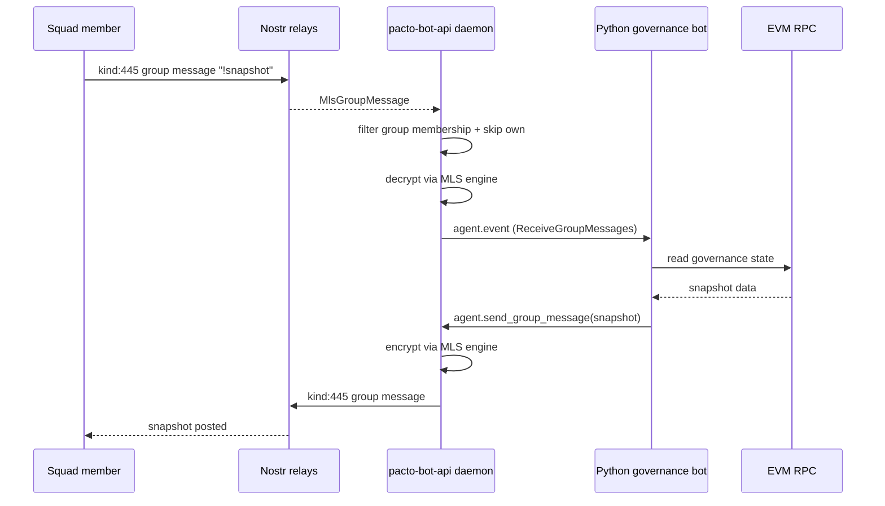

# U12: Inbound MLS message dispatch and `!snapshot` command

## Summary

Extend the daemon's MLS path from send-only to receive-only for group messages. The daemon subscribes to kind:445 group messages, decrypts them, and delivers plaintext to handlers with a new `ReceiveGroupMessages` capability. The Python governance bot then detects `!snapshot` and posts the current snapshot on demand. The feature also adds generic DM-triggered squad command support with daemon-side membership verification.

## Problem Frame

Phase 1 (U1–U10) proves the bot can post governance snapshots autonomously into a Squad. Squad members also want an on-demand trigger: type `!snapshot` and receive a fresh snapshot without waiting for the daily cadence. This requires the daemon to decrypt inbound MLS group messages, which advances the group key schedule and exposes the bot to private channel content. The existing TEE architecture brief (U11) is the long-term mitigation; Phase 2 accepts the same dev-only key custody regime as Phase 1 for the hackathon.

## Requirements

### Inbound MLS dispatch

- R1. The daemon subscribes to `Kind::MlsGroupMessage` (kind:445) per bot, alongside the existing GiftWrap subscription.
- R2. The daemon extracts the Squad wire ID from the `h` tag, drops messages for groups the bot is not a member of, and drops messages the bot itself published.
- R3. The daemon decrypts surviving messages using the per-bot MLS engine and delivers the plaintext to handlers.
- R4. The delivered notification includes the decrypted content, the Squad wire ID, the sender’s Nostr pubkey, the wrapper event id, and the event timestamp.
- R5. The daemon only delivers decrypted group messages to handlers registered with the `ReceiveGroupMessages` capability.

### Rate limiting and deduplication

- R6. The daemon rate-limits inbound group-message notifications per Squad, using a one-minute window, and signals the rate-limit condition to the handler so the bot can respond with a rate-limit message in the same Squad.
- R7. The daemon deduplicates notifications by wrapper event id for a configurable window so retries do not trigger duplicate handler runs.

### DM-triggered squad commands

- R8. The daemon exposes a generic membership verification call that any handler can use to confirm a DM sender is a member of a specified Squad before acting on a command.
- R9. The Python governance bot uses this call to verify `!snapshot` commands sent via DM, then posts the snapshot to the Squad the user specified.

### Handler behavior

- R10. The Python governance bot detects `!snapshot` in delivered plaintext and triggers the same read → format → send flow used by the cadence timer.
- R11. The Python bot ignores non-`!snapshot` plaintext by default.
- R12. When the daemon signals a rate-limit condition, the Python bot responds in the same Squad with a message explaining the one-minute limit.

### Security and tests

- R13. Tests cover: happy-path decrypt and delivery, membership filtering, skip-own-events, malformed-message handling, unauthorized handler rejection, rate-limit signaling, and deduplication.

## Key Decisions

- KTD-1. The daemon delivers raw plaintext and lets the handler parse commands. This keeps the daemon protocol-general and the `!snapshot` logic in the Python bot.
- KTD-2. `ReceiveGroupMessages` is a separate capability from `SendGroupMessages`, so a handler can receive without sending.
- KTD-3. Inbound decryption reuses the existing per-bot MLS engine. The current implementation serializes engine calls on a dedicated worker thread, so the inbound decrypt method is added to that same worker channel rather than introducing a second concurrency model.
- KTD-4. The Python governance bot is the real `!snapshot` consumer; the Rust example crate is out of scope unless it helps validate the daemon side.
- KTD-5. DM-triggered command membership is verified through a generic daemon call, not by parsing specific command text in the daemon. Any bot can use the same call for its own DM commands.
- KTD-6. Rich metadata such as the full wrapper event JSON is deferred for later; the initial notification uses the standard metadata set (content, group id, author, event id, timestamp).

## Key Flows

- F1. Inbound `!snapshot` round-trip
  - **Trigger:** A Squad member sends a kind:445 group message containing `!snapshot`.
  - **Actors:** Squad member, Nostr relays, daemon, Python bot, EVM RPC.
  - **Steps:** Daemon receives the message, filters by group membership and skip-own, decrypts, delivers plaintext to the Python bot. The bot reads on-chain state, formats the snapshot, and calls `agent.send_group_message`.
  - **Outcome:** A fresh snapshot appears in the Squad channel.
  - **Covers:** R1, R2, R3, R4, R5, R10.

- F2. DM-triggered `!snapshot` with membership verification
  - **Trigger:** A user sends the bot a DM with a command that references a Squad.
  - **Actors:** User, daemon, Python bot.
  - **Steps:** Daemon decrypts the DM and delivers it to the Python bot. The bot calls the daemon’s membership verification method for the referenced Squad and the DM sender. If verified, the bot reads state and posts the snapshot to that Squad.
  - **Outcome:** A user can trigger a snapshot from DM without being in the channel at that moment, but only if they are a verified member of the target Squad.
  - **Covers:** R8, R9.

## Acceptance Examples

- AE1. Authorized handler receives `!snapshot`
  - **Given:** A handler is registered for a bot with `ReceiveGroupMessages`, and the bot is a member of Squad G.
  - **When:** A member of G sends a kind:445 message with plaintext `!snapshot`.
  - **Then:** The daemon decrypts and delivers the plaintext; the handler posts a snapshot.
  - **Covers:** R1, R2, R3, R4, R5, R10.

- AE2. Unauthorized handler is excluded
  - **Given:** A handler is registered without `ReceiveGroupMessages`.
  - **When:** A group message is decrypted.
  - **Then:** The message is not delivered to that handler.
  - **Covers:** R5.

- AE3. Daemon skips its own messages
  - **Given:** The bot publishes a group message.
  - **When:** The daemon receives the same event from relays.
  - **Then:** The daemon skips it before decryption.
  - **Covers:** R2.

- AE4. Malformed message is handled safely
  - **Given:** A message with invalid MLS ciphertext.
  - **When:** The daemon attempts decryption.
  - **Then:** It records a diagnostic error, skips the event, and does not panic.
  - **Covers:** R3, R13.

- AE5. Rate limit is signaled and the bot responds
  - **Given:** Multiple members of Squad G send `!snapshot` within one minute.
  - **When:** The per-Squad rate limit is exceeded.
  - **Then:** The daemon signals the condition to the handler; the handler posts a group message in G explaining the one-minute limit instead of another snapshot.
  - **Covers:** R6, R12.

## Scope Boundaries

### Deferred for later

- Full MLS group management, re-keying, or decryption support beyond the `!snapshot` trigger.
- Interactive commands other than `!snapshot`.
- Backfill of historical group messages at daemon startup.
- Rich notification metadata such as the full wrapper event JSON or MLS message id.

### Outside this product's identity

- Updating the Rust `crates/governance-bot` example unless it is useful for daemon-side validation.
- TEE deployment as running code (U11 brief only).
- Cross-chain governance reads beyond Sepolia / anvil.
- A general-purpose AI assistant for Pacto users.

## Dependencies / Assumptions

- Phase 1 (U1–U10) must be implemented and demonstrated before U12 starts.
- `mdk-core` 0.5.2 remains pinned.
- The per-bot MLS engine already persists group membership and can decrypt messages.
- The Python governance bot is the primary handler target; it will be updated to consume the new notification and membership verification method.

## Outstanding Questions

- OQ1. What is the deduplication window? (e.g., 5 minutes.)
- OQ2. What is the exact method name and signature for the generic membership verification call?

## Sources / Research

- `docs/plans/2026-07-03-001-feat-governance-snapshot-mls-tee-bot-plan.md` — parent plan requirements R21–R25 and implementation unit U12.
- `src/events.rs` — current `EventType` enum.
- `src/mls.rs` — current per-bot MLS engine handle and worker-thread pattern.
- `src/dispatch.rs` — existing capability authorization pattern.
- `docs/tee-private-agent-architecture.md` — long-term mitigation for inbound MLS key custody.
- `pacto-app/src-tauri/src/lib.rs:1954-2512` — reference live dispatch loop for kind:445 messages.
