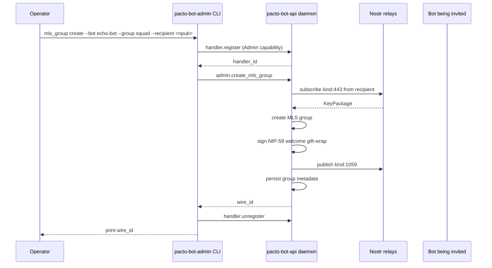

# Daemon-backed `mls_group` admin command

## Summary

Move the standalone `create-mls-group` utility into the daemon and expose it through a new `pacto-bot-admin mls_group` subcommand with two operations: `create` and `invite`. Group creation and member invitation are backed by the daemon's existing signer, relay pool, and per-bot MLS engine, eliminating the need for any tool outside the daemon to handle raw nsec.

## Problem Frame

The previous `pacto-bot-utils` crate shipped a headless `create-mls-group` binary that required the operator to pass a raw creator nsec. Because the binary was included in the production daemon Docker image, it expanded the secret-exposure surface of an otherwise hardened daemon. The binary was reverted, but the underlying need remains: developers and operators still need a way to bootstrap MLS groups and invite bots, and the only secure place for that operation is inside the daemon, where signing keys and relay connections already live.

## Key Decisions

- **KTD-1. Retire the standalone crate.** The `create-mls-group` logic moves into the daemon; no separate crate or binary is shipped.
- **KTD-2. Persist group metadata in the daemon's SQLite database.** Group name, wire ID, creator, invited bots, and relay are stored in `agent.db` rather than a separate JSON state file.
- **KTD-3. Reuse the daemon's signer and relay pool.** The daemon uses the bot's configured signing backend (nsec or bunker) and the shared relay pool to fetch KeyPackages and publish welcome gift-wraps.
- **KTD-4. Provide both admin and handler entry points.** The admin CLI is the primary human interface; handler methods let authorized bots or automation trigger creation and invitation programmatically.
- **KTD-5. Match existing NIP-59 gift-wrap behavior.** The welcome gift-wrap construction stays consistent with the daemon's current DM gift-wrap implementation. A cross-cutting NIP-59 compliance fix is out of scope for this feature.
- **KTD-6. Separate `create` and `invite` commands.** `create` bootstraps a new group; `invite` adds a member to an existing group. This makes intent explicit and simplifies error handling.
- **KTD-7. Fail fast on missing MLS engine.** If the bot is configured without an MLS engine (`mls_db_path`), `create` and `invite` return a clear error instead of auto-initializing state.
- **KTD-9. KeyPackage freshness window.** The daemon uses a 5-minute default freshness window and allows an optional per-bot override in `pacto-bot-api.toml`. KeyPackages older than the window are rejected.

- **KTD-10. Welcome publish target.** The daemon publishes the NIP-59 welcome gift-wrap to every configured relay in the daemon's relay pool, not only the relay that supplied the KeyPackage.

## Requirements

### Admin CLI and daemon entry points

- R1. The admin CLI supports `pacto-bot-admin mls_group create --bot <bot-id> --group <name> --recipient <npub>`.
- R2. The admin CLI supports `pacto-bot-admin mls_group invite --bot <bot-id> --group <name> --recipient <npub>`.
- R3. The admin CLI sends authenticated JSON-RPC requests to the daemon over the existing Unix socket admin session.
- R4. The daemon exposes `admin.create_mls_group` and requires the `Admin` capability.
- R5. The daemon exposes `admin.invite_to_mls_group` and requires the `Admin` capability.
- R6. The daemon exposes `agent.create_mls_group` for handlers and requires the `CreateMlsGroup` capability.
- R7. The daemon exposes `agent.invite_to_mls_group` for handlers and requires the `InviteToMlsGroup` capability.

### Group creation

- R8. When the group does not exist, `create` creates a new MLS group with the recipient bot as the initial member, publishes a NIP-59 welcome gift-wrap, and stores the group metadata.
- R9. When the group already exists, `create` fails with a clear error instead of silently returning the existing group.
- R10. If the bot is configured without an MLS engine (`mls_db_path`), `create` fails with a clear error instructing the operator to configure the bot for MLS.
- R11. `create` is idempotent only at the network/MLS layer for a single invocation; repeated calls with the same inputs fail because the group exists.

### Group invitation

- R12. When the group exists and the recipient bot is not yet invited, `invite` adds the bot to the existing group, publishes the welcome gift-wrap, and updates the invited-bots list.
- R13. When the group exists and the recipient bot is already invited, `invite` returns the existing wire ID without performing network operations or MLS mutations.
- R14. When the group does not exist, `invite` fails with a clear error instructing the operator to use `create` first.
- R15. If the bot is configured without an MLS engine (`mls_db_path`), `invite` fails with a clear error instructing the operator to configure the bot for MLS.
- R16. `invite` is idempotent at the daemon level: repeated calls with the same bot, group name, and recipient do not create duplicate invitations.

### KeyPackage and welcome handling

- R17. The daemon fetches a `kind:443` KeyPackage authored by the recipient bot from the configured relay pool before creating or adding to the group.
- R18. The daemon applies a configurable freshness window to fetched KeyPackages and rejects stale packages. The default window is 5 minutes and may be overridden per bot in `pacto-bot-api.toml`.
- R19. The daemon signs and publishes the NIP-59 welcome gift-wrap using the bot's configured signer; no raw nsec is passed to the admin CLI or any handler.

### State persistence

- R20. The daemon stores group metadata in `agent.db`: bot ID, group name, wire ID, creator npub, relay URL, and the list of invited-bot npubs.
- R21. Group metadata lookups use the `(bot_id, group_name)` composite key.
- R22. The daemon updates the invited-bots list atomically after a successful MLS mutation and welcome publish.

### Security and observability

- R23. The admin CLI and handler methods never accept a raw nsec; the daemon uses only the configured signer backend.
- R24. All errors returned to the admin CLI or handler must not include secret material or KeyPackage ciphertext.
- R25. The daemon emits structured tracing for group creation, invitation, and idempotent skip events.

### Python SDK

- R26. `schemas/jsonrpc.json` declares `agent.create_mls_group` and `agent.invite_to_mls_group` so that generated clients pick them up.
- R27. The Python SDK is regenerated and exposes the new methods; high-level `Bot.create_mls_group` and `Bot.invite_to_mls_group` convenience wrappers are added if the low-level generated methods are not ergonomic enough for bot authors.

### Tests

- R28. Unit tests cover the new MLS engine commands for group creation and member addition.
- R29. Integration tests cover `pacto-bot-admin mls_group create` and `invite` end-to-end against a mock relay and mock bunker.
- R30. Handler method tests cover capability authorization and idempotent re-invitation.

## Key Flows

- F1. Admin CLI creates a group
  - **Trigger:** Operator runs `pacto-bot-admin mls_group create`.
  - **Actors:** Operator, admin CLI, daemon, Nostr relays, invited bot.
  - **Steps:** Admin CLI registers a temporary admin handler, sends `admin.create_mls_group`, daemon fetches the recipient's KeyPackage, creates the group, publishes the welcome gift-wrap, persists metadata, and returns the wire ID.
  - **Outcome:** The operator receives the Squad wire ID; the invited bot can accept the welcome.
  - **Covers:** R1, R3, R4, R8, R10, R17, R19, R20.

- F2. Admin CLI invites a new member
  - **Trigger:** Operator runs `pacto-bot-admin mls_group invite` for an existing group.
  - **Actors:** Operator, admin CLI, daemon, Nostr relays, invited bot.
  - **Steps:** Admin CLI registers a temporary admin handler, sends `admin.invite_to_mls_group`, daemon fetches the recipient's KeyPackage, adds the bot to the group, publishes the welcome gift-wrap, updates the invited-bots list, and returns the wire ID.
  - **Outcome:** The new bot receives a welcome gift-wrap for the existing Squad.
  - **Covers:** R2, R3, R5, R12, R13, R15, R17, R19, R20.

- F3. Handler creates a group programmatically
  - **Trigger:** An authorized handler sends `agent.create_mls_group` for a registered bot.
  - **Actors:** Handler, daemon, Nostr relays, invited bot.
  - **Steps:** Daemon validates the handler's `CreateMlsGroup` capability, then follows the same fetch/create/publish/persist sequence as the admin path.
  - **Outcome:** The handler receives the wire ID and can use it for subsequent `agent.send_group_message` calls.
  - **Covers:** R6, R8, R10, R17, R19, R20.

- F4. Handler invites a member programmatically
  - **Trigger:** An authorized handler sends `agent.invite_to_mls_group`.
  - **Actors:** Handler, daemon, Nostr relays, invited bot.
  - **Steps:** Daemon validates the handler's `InviteToMlsGroup` capability, then follows the same fetch/add/publish/persist sequence as the admin invite path.
  - **Outcome:** The handler receives the wire ID for the existing group.
  - **Covers:** R7, R12, R13, R15, R17, R19, R20.

## Acceptance Examples

- AE1. Happy-path group creation
  - **Given:** A daemon is running with a bot configured with a valid signer, `mls_db_path`, and relays, and the recipient bot has published a KeyPackage.
  - **When:** The operator runs `pacto-bot-admin mls_group create --bot echo-bot --group my-squad --recipient <npub>`.
  - **Then:** The daemon creates the group, publishes a kind:1059 welcome gift-wrap, and prints the wire ID.
  - **Covers:** R1, R4, R8, R17, R19, R20.

- AE2. Creating a group that already exists fails
  - **Given:** The daemon already has a group `my-squad` for `echo-bot`.
  - **When:** The operator runs `pacto-bot-admin mls_group create` again with the same bot and group name.
  - **Then:** The daemon returns a clear error that the group already exists.
  - **Covers:** R9.

- AE3. Bot without MLS engine fails
  - **Given:** A bot is configured without `mls_db_path`.
  - **When:** The operator runs `pacto-bot-admin mls_group create` or `mls_group invite` for that bot.
  - **Then:** The daemon returns a clear error instructing the operator to configure `mls_db_path`.
  - **Covers:** R10, R15.

- AE4. Inviting a new member succeeds
  - **Given:** The daemon has a group `my-squad` for `echo-bot` with one invited bot, and the new recipient has published a KeyPackage.
  - **When:** The operator runs `pacto-bot-admin mls_group invite --bot echo-bot --group my-squad --recipient <new-npub>`.
  - **Then:** The daemon adds the new bot to the existing group, publishes a welcome gift-wrap, and returns the same wire ID.
  - **Covers:** R2, R5, R12, R20, R22.

- AE5. Idempotent re-invitation is a no-op
  - **Given:** The recipient bot is already recorded as invited to `my-squad`.
  - **When:** The operator runs `pacto-bot-admin mls_group invite` again with the same recipient.
  - **Then:** The daemon returns the existing wire ID without publishing a new welcome.
  - **Covers:** R13, R16.

- AE6. Inviting to a nonexistent group fails
  - **Given:** No group `my-squad` exists for `echo-bot`.
  - **When:** The operator runs `pacto-bot-admin mls_group invite`.
  - **Then:** The daemon returns a clear error instructing the operator to use `create` first.
  - **Covers:** R14.

- AE7. Unauthorized handler is rejected
  - **Given:** A handler is registered without the `CreateMlsGroup` capability for `create` or `InviteToMlsGroup` for `invite`.
  - **When:** The handler sends the corresponding method.
  - **Then:** The daemon returns an unauthorized error.
  - **Covers:** R6, R7.

- AE8. Stale KeyPackage is rejected
  - **Given:** The only available KeyPackage for the recipient is older than the configured freshness window.
  - **When:** The operator or handler requests group creation or invitation.
  - **Then:** The daemon returns a clear error indicating the KeyPackage is stale.
  - **Covers:** R18.

## Scope Boundaries

### Deferred for later

- Strict NIP-59 compliance using an unsigned rumor inside the seal.
- MLS group re-keying, deletion, or member removal.
- Rich group metadata beyond name, wire ID, creator, and invited bots.
- Multi-relay KeyPackage fallback and relay health checks specific to KeyPackage fetch.
- Web UI or persistent admin panel for group management.

### Outside this product's identity

- Reviving the standalone `create-mls-group` binary or `pacto-bot-utils` crate.
- Accepting raw nsec in the admin CLI or handler method.
- Group creation for identities not configured in the daemon.
- Auto-initializing an MLS engine when one is not configured.

## Dependencies / Assumptions

- The per-bot MLS engine in `src/mls.rs` supports adding `create_group` and `add_member` commands on the existing worker thread.
- The daemon's signer abstraction (`src/signer.rs`) can sign arbitrary events and encrypt NIP-44 payloads for both `LocalKey` and `Bunker` backends.
- The daemon's relay pool (`src/nostr.rs`) can fetch a specific KeyPackage and publish events.
- The existing SQLite database (`src/db.rs`) can be extended with a group metadata table.
- Bot configs that participate in MLS must set `mls_db_path`; the daemon will not create one on demand.
- The reverted commit `f25a2c2` provides the reference MDK API usage for group creation and member addition.

## Outstanding Questions

No outstanding questions. The requirements are ready for planning.

## Sources / Research

- `src/mls.rs` — existing per-bot MLS engine handle and worker-thread command pattern.
- `src/dispatch.rs` — JSON-RPC method dispatch, capability authorization, and `require_admin_or_self` helper.
- `src/admin.rs` — admin CLI, `with_admin_session` helper, and existing `admin.send_test_dm` flow.
- `src/nostr.rs` — NIP-59 gift-wrap construction and relay pool usage.
- `src/signer.rs` — abstract `Signer` and `SignerBackend` for nsec and bunker signing.
- `src/db.rs` — SQLite persistence schema and migration pattern.
- `docs/brainstorms/2026-07-08-u12-inbound-mls-snapshot-requirements.md` — adjacent MLS work that uses the same per-bot engine and capability model.
- Commit `f25a2c2` (reverted) — reference implementation of `create_group`, `add_member`, KeyPackage fetch, and welcome gift-wrap logic.
