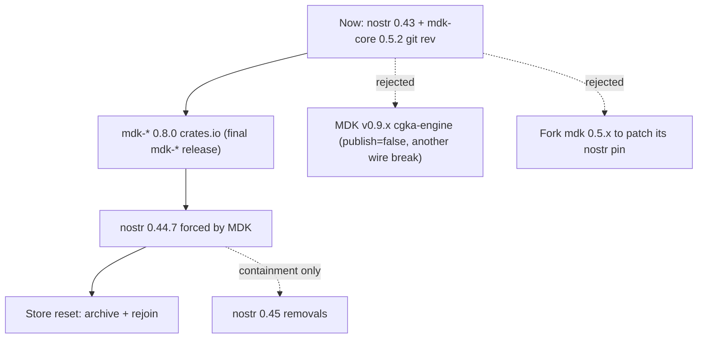

# Requirements: Nostr 0.44 / MDK 0.8.0 Parity with Pacto-app

## Summary

`pacto-app` shipped its move to `nostr` 0.44.7 and `mdk-*` 0.8.0 (branch merged as PR #198, `4603d75`; hardening in PR #199, `ea02eb4`). `pacto-bot-api` is still on `nostr` 0.43.1 and the `mdk-*` git rev `f46875ec` (0.5.2). The two are **wire-incompatible on the MLS join flow**, so every daemon-hosted bot is cut off from any Squad whose members have taken the app update, and will stay cut off until the daemon lands the same dependency move.

This document is the requirements/brainstorm pass for that move. It also corrects three claims in issue #28 that the source does not support, and surfaces two problems #28 never mentions: **MDK 0.8.0 makes the MLS store encryption key mandatory in a production build**, and **`admin.create_mls_group` creates sole-admin squads, which under pacto-app's new recovery model can never be restored**.

## Problem Frame

Issue #28 framed this as "a coordinated release of both repos." That framing is stale. `pacto-app` already shipped. The coordination window closed, and the daemon is now the lagging half of a live incompatibility:

- A bot on 0.5.2 publishes a hex-encoded KeyPackage with no `encoding` tag. An upgraded app rejects it, so the bot cannot be invited to a new or re-created Squad.
- An upgraded app publishes base64 Welcomes with a mandatory `encoding` tag. A 0.5.2 bot's `process_welcome` cannot parse them, so the bot cannot accept an invitation.
- Existing shared groups are not a refuge. `pacto-app`'s rollout **archives and recreates the MLS store on first launch after update** (`src-tauri/src/mls_store_reset.rs`), and recovery is remove-then-re-add by an admin who still holds group state (`src-tauri/src/mls.rs`, `MembershipAction::Restore`). Both halves of that recovery run through the KeyPackage/Welcome path the bot cannot speak.

So this is not "reach parity so future features work." It is "the bot is already broken in the field against updated clients."

The second half of the problem is that `nostr` 0.43 is a dead branch. Only 0.43.0 and 0.43.1 were ever published, and every advisory fix lands on 0.44.5+. The daemon's gift-wrap intake (`src/nostr.rs::process_gift_wrap`) sits directly on the NIP-44 v2 decrypt path that RUSTSEC-2026-0216 and RUSTSEC-2026-0227 target.

## Upstream Reality

Verified against local crate sources and both repositories on 2026-08-05.

| Fact | Evidence |
|---|---|
| `pacto-app` resolves `nostr` 0.44.7, `nostr-sdk` 0.44.1, `nostr-relay-pool` 0.44.3, `nostr-blossom` 0.44.0, `mdk-*` 0.8.0, `openmls` 0.8.1 | `~/src/covenant-gov/pacto-app/src-tauri/Cargo.lock` |
| `pacto-bot-api` resolves `nostr` 0.43.1, `nostr-sdk` 0.43.0, `nostr-connect` 0.43.0, `nostr-relay-pool` 0.43.1, `nostr-blossom` 0.43.0, `mdk-*` 0.5.2 (git rev), `openmls` 0.7.4 | `Cargo.lock` |
| `mdk-core` 0.8.0 emits **both** key-package tag sets and accepts **both** kinds | `mdk-core-0.8.0/src/key_packages.rs:21-36` (`KeyPackageEventData { content, tags_30443, tags_443 }`), `:331-333` (`event.kind != MLS_KEY_PACKAGE_KIND && != MLS_KEY_PACKAGE_KIND_LEGACY`) |
| Kind constants: `MLS_KEY_PACKAGE_KIND = 30443`, `MLS_KEY_PACKAGE_KIND_LEGACY = 443` | `mdk-core-0.8.0/src/constant.rs:13,19` |
| 0.5.2 hex-encodes the key package with no `encoding` tag; its four tags are `mls_protocol_version`, `mls_ciphersuite`, `mls_extensions`, `relays` | `mdk@f46875e/crates/mdk-core/src/key_packages.rs:60-66` (`Ok((hex::encode(..), tags))`) |
| 0.5.2 parses with `hex::decode` and rejects anything not `Kind::MlsKeyPackage` | `mdk@f46875e/crates/mdk-core/src/key_packages.rs:88-89,101-107` |
| 0.8.0 mandates base64 plus an explicit `encoding` tag per MIP-00/MIP-02 | `mdk-core-0.8.0/src/key_packages.rs:~206-236` |
| `mdk-sqlite-storage` 0.8.0 links `bundled-sqlcipher`; `new_unencrypted` is `#[cfg(any(test, feature = "test-utils"))]` | `mdk-sqlite-storage-0.8.0/Cargo.toml`, `src/lib.rs:516` |
| Production constructors are `new(path, service_id, db_key_id)` (platform keyring) and `new_with_key(path, EncryptionConfig)` | `mdk-sqlite-storage-0.8.0/src/lib.rs:392,476` |
| `new_with_key` refuses an existing **unencrypted** file with `Error::UnencryptedDatabaseWithEncryption` | `mdk-sqlite-storage-0.8.0/src/lib.rs:483-487` |
| `encryption::is_database_encrypted(path) -> Result<bool>` is public | `mdk-sqlite-storage-0.8.0/src/encryption.rs:204` |
| MDK renumbered its refinery series V100–V104 → V001–V005 under the unchanged table `_refinery_schema_history_nostr_mls`, with no bridging migration | `mdk-sqlite-storage-0.8.0/src/migrations.rs:22`; pacto-app plan, Sources table |
| MDK v0.9.x deleted the `mdk-*` crates and replaced them with `cgka-engine` et al., in a `publish = false` workspace against a forked OpenMLS | pacto-app plan §Scope Boundaries; MDK `release.md` |
| `mdk-sqlite-storage` 0.8.0 MSRV is 1.90; `pacto-bot-api` declares 1.96 | `mdk-sqlite-storage-0.8.0/Cargo.toml`, `Cargo.toml:9` |
| `mdk-sqlite-storage` 0.8.0 requires `rusqlite` 0.37 and `refinery` 0.9; `refinery-core` 0.9.2 accepts `rusqlite >= 0.23, <= 0.39` | published 0.8.0 manifest; pacto-app plan, Sources table |
| `Client::handle_notifications` and `ClientOptions` still exist on `nostr-sdk` 0.44 | `pacto-app/src-tauri/src/lib.rs:3406`, `:6077` — both compile on 0.44.1 |
| `nostr` 0.45.0 shipped 2026-08-05 and removes `NostrSigner`, `TagKind`, `TagStandard`, `JsonUtil`, `Timestamp::as_u64`, `EventBuilder::sign_with_keys`, `EventBuilder::pow`; MSRV 1.85 | rust-nostr `CHANGELOG.md` v0.45.0 |

### Corrections to issue #28

- **C1. The `kind:443` → `kind:30443` migration is not a blocker.** `mdk-core` 0.8.0 hands the caller `tags_443` explicitly for "the transition period," and `parse_key_package` accepts kind 443 alongside 30443. The stated cutoff (May 31 2026) has passed, but the `TODO: Remove MLS_KEY_PACKAGE_KIND_LEGACY acceptance` was never actioned and 0.8.0 is the final `mdk-*` release — so legacy-kind acceptance is permanent in the version we would ship. The daemon can keep publishing kind:443 and interoperate.
- **C2. The single real wire break is content encoding.** hex with no tag → base64 with a mandatory `encoding` tag, on both KeyPackage and Welcome. This is mutually exclusive in both directions, exactly as #28 says, but for one reason rather than three.
- **C3. #28's stated benefit "security fixes (RUSTSEC advisories addressed in 0.8.0)" is not the advisory that matters here.** The reachable exposure for this daemon is on the `nostr` side, not `hpke-rs`: RUSTSEC-2026-0216 (NIP-44 v2 decrypt panic, affects `>= 0.26.0, < 0.44.5`) and RUSTSEC-2026-0227 (NIP-44 v2 resource exhaustion, patched `>= 0.44.7`), both reachable from `process_gift_wrap`. *(Advisory IDs and ranges taken from pacto-app's verified Sources table, not independently re-derived here — see Q4.)*
- **C4. #28 omits store encryption entirely.** See KD3. This is the largest single design decision in the work and it has no counterpart in `pacto-app`'s solution, because the app has a session key and the daemon does not.
- **C5. "Coordinated release" is obsolete.** Only the daemon has to move.

## Actors

- **A1. Bot operator** — runs the daemon, owns `$DATA_DIR` and `pacto-bot-api.toml`, performs the upgrade.
- **A2. Bot handler process** — a Python/other SDK client. Sees the outage as "no more `mls_group_message_received` events," with no signal explaining why.
- **A3. Squad admin on pacto-app** — the only party who can restore a reset member's access, and only while they still hold group state.
- **A4. Squad members on pacto-app** — already through their own reset; see the bot as silently absent.
- **A5. The daemon itself as MLS group creator** — `admin.create_mls_group` makes the bot the sole admin of the groups it creates.

## Current daemon surface

Everything that moves lives behind one file plus one test double: the MLS worker in `src/mls.rs` (a dedicated single-threaded worker fed by `MlsCommand` over mpsc, each engine call already wrapped in `catch_unwind`) and `tests/support/mock_mls_peer.rs`. The Nostr surface is wider but shallower.

### MDK call-site delta (0.5.2 → 0.8.0)

| Call site | 0.5.2 | 0.8.0 | Change |
|---|---|---|---|
| `src/mls.rs:274` | `MdkSqliteStorage::new(&db_path)` | `new_with_key(&db_path, EncryptionConfig::new([u8;32]))` | **new required key** |
| `src/mls.rs:292` | `create_key_package_for_event(&pk, relays) -> (String, [Tag;4])` | `-> KeyPackageEventData { content, tags_30443, tags_443 }` | destructure; pick tag set |
| `src/mls.rs:385` | `get_pending_welcomes()` | `get_pending_welcomes(Option<Pagination>)` | pass `None` |
| `src/mls.rs:523` | `create_message(&gid, rumor)` | `create_message(&gid, rumor, Option<Vec<EventTag>>)` | pass `None` |
| `src/mls.rs:557-564` | 5 `MessageProcessingResult` arms | + `PendingProposal`, `IgnoredProposal { reason }`, `PreviouslyFailed` | non-exhaustive match breaks |
| `src/mls.rs:93-97` | `mdk_core::Error` variants | +15 typed variants (`NotAdmin`, `ProcessMessageWrongEpoch`, `ProcessMessageUseAfterEviction`, `WelcomePreviouslyFailed`, `CannotDecryptOwnMessage`, …) | `mdk_error_category` must classify them |
| `src/mls.rs:427-438` | `NostrGroupConfigData::new(7 args)` | unchanged | none |
| `src/mls.rs:463,657` | `get_groups() -> Vec<Group>`, `get_members() -> BTreeSet<PublicKey>`, `Group.nostr_group_id: [u8;32]`, `Group.admin_pubkeys: BTreeSet<PublicKey>` | unchanged | none — `pacto-app`'s U4 note about these shapes was against their own older mapping, not against 0.5.2 |
| new in 0.8.0 | — | `MdkBuilder` + `MdkConfig` (epoch retention, out-of-order tolerance, event-age bounds), `delete_group`, `delete_messages_for_group`, `test-utils` feature | optional; see R17, R18 |

### Nostr call-site delta (0.43 → 0.44)

Small. `nostr-sdk` 0.44.0's own breaking list is only "remove `lmdb`/`ndb`/`indexeddb` features" and "replace `ReceiverStream` with `BoxedStream`." The `nostr` 0.44.0 breaks that touch this crate:

| Symbol | Sites | Change |
|---|---|---|
| `Timestamp::as_u64` | `src/nostr.rs:1171` and others | deprecated → `as_secs()` |
| `EventBuilder::reaction_extended` | `src/nostr.rs:286-291`, called as `(target, recipient, Some(Kind::PrivateDirectMessage), emoji)` | **removed** → `EventBuilder::reaction(impl Into<nip25::ReactionTarget>)`; `src/nostr.rs::extract_reaction` decodes the tag layout this builder writes, so both halves move together |
| `ClientOptions` / gossip | none — the crate builds its pool with `Client::default()` (`src/nostr.rs:110`) | no action |
| `Filter::match_event` | `src/test_support/mock_relay.rs:161,262,264` — already passes `MatchEventOptions` on 0.43 | no action |
| `nostr::hex` module | crate already declares its own `hex = "0.4"` (`Cargo.toml:54`) | no action |

`nostr-connect` 0.44 keeps the NIP-46 client API; 0.44.0 fixed `NostrConnectRequest::Connect` handling and 0.44.1 fixed a `serve()` subscription race plus bunker signers that return the secret in the connect response — both relevant to `src/nip46.rs` and `src/signer.rs::BunkerRemote`. `nostr-blossom` 0.44.0 records no notable changes.

One behavioural change worth naming and dismissing: 0.44 makes `unwrap_gift` verify that the rumor author matches the seal author (`Error::SenderMismatch`). The daemon hand-rolls its unwrap and already attributes `author` from `seal_event.pubkey` (`src/nostr.rs:1153,1170`), never from `rumor.pubkey`, so it does not inherit the bug the fix addresses — and equally does not inherit the fix. R30 makes the check explicit anyway.

### Persisted state

- `$DATA_DIR/<bot>/…-mls.db` (+ `-wal`, `-shm`), path from `BotConfig::mls_db_path`, hardened by `src/mls_path.rs` and forced to `0o600` by `src/mls.rs::set_db_permissions`. This is the file that must be archived and recreated.
- `agent.db` tables `mls_groups` and `mls_group_members` (`migrations/V1__baseline.sql`, `V2__mls_groups_wire_id_per_bot.sql`). **The daemon stores no message history**, which is the single biggest simplification versus `pacto-app`: a reset costs group state and nothing else. There is no chat list to preserve, no participant roster to protect from an overwrite, no re-created-squad duplicate to explain in a UI.

## Key Decisions

- **KD1. Take `mdk-*` 0.8.0 from crates.io. Do not fork, do not chase 0.9.x.** 0.8.0 is the final release of this API; the eventual `cgka-engine` port costs the same whether or not 0.8.0 lands first, and 0.9.x is `publish = false` against a forked OpenMLS with its own wire break. Forking 0.5.x to patch its `nostr` pin strands us on `openmls` 0.7.4 with no security path. Mirrors `pacto-app` KTD1. Governs R1, R3.
- **KD2. Reset the MLS store; write no migration.** The daemon's MLS store holds only cryptographic group state. No handler-visible data lives there. Archive the file set for a bounded window for post-mortem, then prune. Mirrors `pacto-app` KTD2/KTD6/KTD15, minus all the history-preservation machinery they needed. Governs R19–R23.
- **KD3. Source the SQLCipher key from a per-bot key file in `$DATA_DIR`, not a platform keyring and not the bot's nsec.** `MdkSqliteStorage::new(path, service_id, db_key_id)` needs `keyring_core` with a platform store — absent on a headless Linux host or in a TEE. Deriving from the nsec is impossible for `bunker_remote` bots, which hold no local secret. A random 32-byte file at `0o600` beside the store mirrors the existing `$DATA_DIR/bot_secret_token` pattern, needs no new dependency, and works identically for both signing backends. Be honest about what it buys: the key sits next to the data it protects, so this is not a confidentiality gain over today's `0o600` file — it is the cost of using a library that no longer offers an unencrypted production store. Governs R24–R26.
- **KD4. Detect a legacy store by encryption state first, refinery version second.** `encryption::is_database_encrypted(path) == false` is a one-call, MDK-supported classification that exactly matches "written by the 0.5.2 pin." Fall back to reading `max(version)` from `_refinery_schema_history_nostr_mls` by direct SQL to distinguish an already-0.8.0 store (1–5) from something unrecognised. Fail closed on unrecognised rather than archiving. Mirrors `pacto-app` KTD8, using a cleaner primary signal. Governs R19, R20.
- **KD5. Contain the `nostr` 0.45 removals in this work, not as a follow-up.** 0.45 shipped 2026-08-05 and removes `NostrSigner` — the trait `src/signer.rs` and `nostr-connect` are built on. Unlike `pacto-app`, which contained a diffuse `TagKind` sprawl, this crate's exposure is concentrated in `src/signer.rs`, `src/nostr.rs`, and `src/nip46.rs`, so containment is cheap now and expensive later. Mirrors `pacto-app` KTD3. Governs R31, R32.
- **KD6. Declare `rusqlite` with `bundled-sqlcipher-vendored-openssl`.** Cargo unifies the crate's `bundled` with MDK's `bundled-sqlcipher` to the SQLCipher variant, which links system OpenSSL and needs Perl on Windows; the vendored superset removes both. Unkeyed databases open as stock SQLite, so `agent.db` is unaffected in format. **This is a materially larger risk here than in `pacto-app`** — see R37–R39 and the Risks table. Mirrors `pacto-app` KTD9. Governs R4, R37.
- **KD7. Stop creating sole-admin squads.** Under the new recovery model a group whose admin set holds one key can never be restored, only re-created (`pacto-app` KTD18, R22, R29; the admin set is fixed at `create_group` and no code path updates it). `src/mls.rs:434` passes `vec![creator]`, so every squad the daemon creates is exactly that trap, with the bot as the trapped admin. Governs R11, R12.
- **KD8. Do not invent a bot-side update gate.** `pacto-app`'s mandatory update gate is a desktop mechanism: a `minimumCompatibleVersion` field in the GitHub-Releases `latest.json`, checked at cold launch and unlock, plus a local `vector.db` refinery-history check. A daemon has no launch screen and no user to block. The equivalent is diagnostic, not obstructive: report the MLS wire generation in `agent.status` / `pacto-bot-admin diagnose`, and make an encoding-tag rejection produce a named, actionable error instead of a generic MLS failure. Governs R40–R42.
- **KD9. Order the work: containment and intake hardening first, then versions, then reset.** The seams and the intake bound are changes against the current dependency set and can each be proven green with nothing else in flight. Mirrors `pacto-app` KTD13.

## Requirements

### Dependency versions

- **R1.** `mdk-core`, `mdk-sqlite-storage`, and `mdk-storage-traits` resolve to `0.8.0` from crates.io, with no `git =` dependency on any MDK repository remaining in `Cargo.toml`.
- **R2.** `nostr` resolves to 0.44.7 or later and `nostr-sdk` to 0.44.1; `nostr-connect` and `nostr-relay-pool` to 0.44; `nostr-blossom` to 0.44.0.
- **R3.** `openmls` resolves to 0.8.1 and the dev-dependency `openmls_traits` moves off 0.4.1 to the matching line.
- **R4.** `rusqlite` resolves to a single version compatible with MDK 0.8.0 (0.37), declared with `bundled-sqlcipher-vendored-openssl`; the lock resolves one `rusqlite` and one `libsqlite3-sys`.
- **R5.** `refinery` resolves to a single version across the graph, collapsing the daemon's 0.8.16 against MDK's 0.9 requirement. The daemon's own `agent.db` migrations continue to apply unchanged under 0.9.
- **R6.** `cargo deny` passes on the regenerated lock, and no advisory affects the vendored OpenSSL or SQLCipher versions being shipped. The shipped vendored-crypto versions are recorded so a future advisory can be matched against a released binary.

### Wire format and interop

- **R7.** The daemon publishes KeyPackages whose content is base64 and whose tags include the mandatory `encoding` tag, by using the tag set MDK returns rather than reconstructing tags by hand.
- **R8.** The published KeyPackage event kind is decided explicitly and documented, not left implicit. Default: continue publishing `kind:443` using `KeyPackageEventData::tags_443`, because `pacto-app` fetches with a `Kind::MlsKeyPackage` filter and 0.8.0 accepts both kinds. Publishing `kind:30443` in addition is optional and gated on R43's interop result.
- **R9.** `src/mls.rs::validate_key_package` and `src/nostr.rs::fetch_key_package` accept an inbound KeyPackage of either `kind:443` or `kind:30443`, and reject one that carries no `encoding` tag with a distinct, named error rather than a generic parse failure.
- **R10.** The daemon accepts a base64 Welcome carrying an `encoding` tag and surfaces a distinct error for a Welcome that does not, so an operator can tell "peer is on the old build" apart from "decryption failed."
- **R11.** `admin.create_mls_group` no longer creates a group whose admin set holds only the bot. The invited recipient is added as a co-admin, or the method accepts an explicit admin list. Existing sole-admin groups created by the daemon are enumerated in diagnostics as unrestorable.
- **R12.** The daemon implements remove-then-re-add when adding a member who already holds a leaf in the group, so a restoration advances the epoch past the archived credential. A first-time invite is unchanged. A restoration is refused unless the bot is a group admin, and a failure between the remove and the add surfaces as a distinct error naming that the member is now outside the group. Mirrors `pacto-app` R23 / U11.
- **R13.** When the daemon restores a member it resolves that member's KeyPackage freshly from relays rather than from any cached reference, because a reset member republishes against a new store. Mirrors `pacto-app` R28's counterpart.

### MDK 0.8.0 API migration

- **R14.** Every `MlsCommand` arm in `src/mls.rs` compiles and behaves against the 0.8.0 signatures listed in the delta table above, with the `catch_unwind` boundary preserved on each.
- **R15.** The `MessageProcessingResult` match is exhaustive against the 0.8.0 enum. `PendingProposal` and `IgnoredProposal` yield no handler-visible event; `PreviouslyFailed` is logged and skipped without advancing anything that would suppress a legitimate retry.
- **R16.** `mdk_error_category` classifies the new typed error variants into stable, non-leaky category strings. No group ID, key material, or raw engine message reaches a log line or a JSON-RPC error.
- **R17.** `MdkConfig` is chosen explicitly rather than inherited by default, and the chosen epoch-retention and out-of-order-tolerance values are documented against the daemon's dispatch and cursor model.
- **R18.** `tests/support/mock_mls_peer.rs` is migrated to the 0.8.0 API and evaluated against MDK's new `test-utils` feature; if `test-utils` replaces hand-rolled scaffolding, the hand-rolled version is removed rather than left beside it.

### MLS store reset

- **R19.** The daemon detects a store written by the 0.5.2 pin before MDK 0.8.0 opens it, classifying by encryption state and, where that is ambiguous, by `max(version)` in `_refinery_schema_history_nostr_mls`. A version outside the known legacy (≥100) and current (1–5) ranges fails closed: the daemon refuses to hand back an engine and reports, rather than archiving a store it does not recognise.
- **R20.** Detection reads the legacy file as plain SQLite by direct query and never hands it to MDK 0.8.0.
- **R21.** A detected legacy store is moved aside as a complete file set — database, `-wal`, and `-shm` together — to a timestamped sibling, and a fresh store is created. The archive inherits `0o600` on the database and its parent stays `0o700`.
- **R22.** The whole archive set is removed on the first daemon start after a bounded retention window elapses. The window bounds disk exposure and does not revoke anything; the revocation is R12.
- **R23.** Reset runs once per bot identity, is serialised so concurrent callers cannot run it twice, and is re-enterable: a crash before the move re-harvests idempotently, and a crash after the move classifies the now-absent store as fresh. The completion marker is committed after the move, never before.
- **R24.** The MLS store is opened with `MdkSqliteStorage::new_with_key`. The key is 32 random bytes persisted per bot identity in `$DATA_DIR`, created with owner-only permissions at creation time — not chmod'd after a rename — per `docs/solutions/best-practices/secure-file-creation.md`.
- **R25.** The key file is represented in memory with `secrecy`/`zeroize` and never appears in logs, diagnostics, shutdown reports, config dumps, `pacto-bot-admin export`, or JSON-RPC errors. The secret-redaction suite covers it.
- **R26.** Losing or rotating the key is treated as a store reset, not a hard failure: the daemon detects the mismatch, archives the unreadable store under R21, and proceeds with a fresh one. An operator who deletes the key file gets a working daemon that needs re-invitation, not a wedged one.
- **R27.** After a reset the daemon republishes its KeyPackage before any restoration is attempted, so an admin's re-add targets a KeyPackage whose private init key lives in the new store. Mirrors `pacto-app` R28.
- **R28.** `agent.db`'s `mls_groups` and `mls_group_members` rows survive a reset. Groups whose engine state was lost are marked, and the daemon declines to send into them until a Welcome restores state rather than failing per-message with a generic engine error. The existing `reconcile_mls_groups` startup path is the natural home for the mark.
- **R29.** `pacto-bot-admin export` / `import` account for the new store shape and the key file: either both move together, or import refuses and says why. Silently importing a store without its key is prohibited.

### Nostr 0.44 migration and 0.45 containment

- **R30.** `process_gift_wrap` explicitly verifies that the rumor author matches the seal author and rejects a mismatch, rather than relying on the daemon's incidental use of `seal_event.pubkey` for attribution.
- **R31.** No `nostr` `Timestamp::as_u64` call site remains; `as_u64` on non-nostr types is untouched. The reaction send path builds its event without `EventBuilder::reaction_extended`.
- **R32.** The symbols `nostr` 0.45 removes — `NostrSigner`, `TagKind`, `TagStandard`, `JsonUtil`/`as_json`/`from_json` on nostr types, `sign_with_keys`, `EventBuilder::pow` — reach the crate through a bounded set of app-local seams rather than being referenced across it. A ratchet asserts zero occurrences outside the named seams, because the 0.44 compile-error sweep will otherwise refill files the containment pass drained.
- **R33.** A failure handling one inbound gift wrap costs one event, whether it unwinds or stalls. The per-event `tokio::spawn` in `src/nostr.rs:930,959` already contains an unwind; a per-event deadline is added so the resource-exhaustion class is bounded too, and the spawn is bounded so a burst cannot exhaust memory or file descriptors. *(Overlaps existing beads `pacto-bot-api-v7z9` and `pacto-bot-api-f9nc`.)*
- **R34.** NIP-46 bunker connections continue to work against `nostr-connect` 0.44, including bunker signers that return the secret in the connect response — the case 0.44.1 fixed.

### Handler and SDK contract

- **R35.** No JSON-RPC method name, parameter, or response field changes as a result of this work. `agent.publish_key_package`, `agent.send_group_message`, `agent.send_group_reaction`, `agent.send_group_attachment`, `admin.create_mls_group`, `admin.invite_to_mls_group`, and `admin.exit_mls_group` keep their shapes, except where R11 adds an optional admin list.
- **R36.** `schemas/jsonrpc.json` descriptions that name `kind:443` are corrected to describe the kind actually published under R8, and the generated Python SDK is regenerated. The Python test suite is run inside the venv, not inferred from `make validate`.
- **R37.** A bot whose group state was lost to a reset receives an explanatory signal rather than silence: a distinct daemon event or a documented field on registration telling the handler that this bot is awaiting re-invitation to a known group. The SDK surfaces it. This is the daemon's analogue of `pacto-app`'s in-channel reset notice, and without it A2 debugs an outage with no evidence.

### Packaging and cross-compilation

- **R38.** `make cross-compile-macos`, `-linux`, `-windows`, and `-freebsd` all succeed with the SQLCipher-linked `libsqlite3-sys`, or the failing targets are explicitly dropped from the release matrix with a recorded reason. This is a gate, not a formality: `cargo-zigbuild` against vendored OpenSSL for `aarch64-unknown-linux-musl` and FreeBSD is the least-travelled path in this whole change.
- **R39.** `scripts/package-release.sh` and the Docker image build against the new native dependency set, and the release artifacts still produce SHA-256 sums.
- **R40.** CI exercises the feature combination that ships, not only the default one, so a SQLCipher link failure does not first appear at tag time.

### Observability and documentation

- **R41.** `pacto-bot-admin diagnose` and `agent.status` report the MDK version, the MLS wire generation, whether the bot's store was reset and when, and whether the bot currently holds state for each group in `agent.db`.
- **R42.** A KeyPackage or Welcome rejected for a missing `encoding` tag produces a log line and diagnostic entry that names the cause as a peer-version mismatch, distinguishable from a decryption failure.
- **R43.** `CHANGELOG.md`, `AGENTS.md`, `README.md`, `docs/GETTING_STARTED.md`, and `docs/pacto-bot-admin-llms.txt` describe the post-upgrade dependency and storage reality, including the key file, the archive-and-recreate behaviour, and the retention window. Operators are told that bots need re-invitation after the upgrade and that `$DATA_DIR` now contains a store key that must be backed up with the store or not at all.
- **R44.** Issue #28 is updated with C1–C5 or closed in favour of the plan that supersedes it.

### Verification

- **R45.** `make validate` and the full test suite pass; the Python suite passes inside the venv.
- **R46.** An upgraded daemon and a current `pacto-app` build share one Squad, both directions verified: the app invites the bot and the bot decrypts group traffic; the bot invites a member and that member joins. This is the acceptance criterion the whole document exists for.
- **R47.** The reset path is exercised against a copy of a real pre-upgrade `$DATA_DIR`, including a leftover `-wal`, not only a synthetic fixture.
- **R48.** A hostile inbound gift wrap — malformed NIP-44 payload — is fed through intake; the intake loop survives, the next well-formed event is processed, and the offending wrapper is not retried every launch.

## Key Flows

### F1. Operator upgrades the daemon

- **Trigger:** A1 installs a build carrying MDK 0.8.0 over a `$DATA_DIR` written by the old pin.
- **Steps:** For each bot identity the daemon classifies the store, finds it unencrypted, moves the file set to a timestamped archive, generates and persists a store key at `0o600`, creates a fresh encrypted store, marks every `agent.db` group as state-lost, republishes the bot's KeyPackage, and starts. Archives past the retention window are pruned on the same path.
- **Covers:** R19–R28.

### F2. Bot is restored into an existing Squad

- **Trigger:** F1 completed; the bot holds no state for a Squad it is recorded as belonging to.
- **Steps:** A3, still holding group state, restores the bot. Because A3 is on the upgraded app, the restore is remove-then-re-add and the epoch advances past the bot's archived leaf. The bot receives the Welcome as a `kind:1059` gift wrap, `process_welcome` accepts the base64 payload, the state-lost mark clears, and group traffic decrypts.
- **Covers:** R10, R27, R28, R37.
- **Constraint inherited from `pacto-app` F3:** a Squad with two or more admins can hand restoration between them; a Squad with one admin cannot be restored at all and must be re-created. The bot is a member, not the arbiter, so it must tolerate never being restored.

### F3. Bot creates a Squad

- **Trigger:** `admin.create_mls_group`.
- **Steps:** The daemon creates the group with an admin set that is not just the bot (R11), fetches the recipient's KeyPackage accepting either kind and requiring the `encoding` tag, and gift-wraps the base64 Welcome.
- **Covers:** R7–R9, R11.

### F4. Peer is still on the old build

- **Trigger:** The daemon fetches a KeyPackage published by a client on `mdk-core` 0.5.2, or receives a hex Welcome.
- **Steps:** Parsing fails on the missing `encoding` tag. The daemon records a named peer-version-mismatch diagnostic and reports it to the caller, instead of a generic MLS error.
- **Covers:** R9, R10, R42.

## Scope Boundaries

- The port to `cgka-engine` / `marmot-app` is out of scope and is not a deferral of this work — it is a separate MLS-subsystem rewrite whose cost is unchanged by landing 0.8.0 first.
- Moving to the `nostr` 0.45 line is out of scope; only reducing its future cost is (R32).
- Forking MDK to patch its `nostr` pin is rejected, not deferred.
- Writing an on-disk migration for the existing MLS store is rejected, not deferred.
- No handler-facing protocol redesign. R37's reset signal is additive.
- No new admin CLI surface beyond what R11, R29, and R41 require.

## Open Questions

- **Q1. Where does the store key live, exactly?** Per-bot file beside the store, one file per bot under `$DATA_DIR`, or one daemon key with per-bot HKDF derivation? A single daemon key with domain-separated derivation is fewer files and one backup unit; per-bot files match the existing per-bot `mls_db_path` layout. Also: should an operator be able to supply the key by env var or external command, for TEE deployments where writing a key to disk is the thing you were trying to avoid?
- **Q2. Should the daemon archive at all, or just delete?** `pacto-app` archives because a bad reset costs a user their squad history. The daemon has no history in that store. Archiving buys post-mortem for exactly one release cycle and costs a window in which live key material sits on disk. A short window (or an opt-in flag defaulting to delete) may be the better trade here than copying the app's seven days.
- **Q3. `kind:443` only, or dual-publish 443 and 30443?** Dual-publishing costs one extra event and makes the daemon discoverable to any future client that filters on the addressable kind. It also doubles the surface where a stale key package can be resolved. R8 defaults to 443-only pending R46's interop result.
- **Q4. Advisory verification.** C3's advisory IDs and affected ranges are taken from `pacto-app`'s plan rather than re-derived. Confirm against the RUSTSEC advisory database directly, and separately confirm whether #28's claim about `hpke-rs` 0.6.1 / RUSTSEC-2026-0073 and -0074 applies to this crate's resolved graph.
- **Q5. Does anything in the daemon still need the legacy store's contents before archiving?** `pacto-app` harvests admin pubkeys because the app's own database never mirrored them. `agent.db` records `creator_npub` and `invited_bots` per group, so the daemon may already have what it needs — but it does not record the full MLS admin set, and R11's unrestorable-group diagnostic would be more accurate with it. Cheap to harvest while the file is open; decide before U-level planning.
- **Q6. Is a bot ever an admin worth restoring?** R12 gives the daemon the ability to restore a member. Whether an operator should ever run a Squad whose restoration authority is a bot is a product question, not a technical one.

## Risks

| Risk | Mitigation |
|---|---|
| Vendored OpenSSL + SQLCipher breaks `cargo-zigbuild` cross-compilation for musl aarch64, FreeBSD, or Windows — a bigger exposure than `pacto-app` faced, because this crate ships five target families | R38 makes all five a pre-tag gate; fallback is per-target feature selection, then dropping a target with a recorded reason — not abandoning KD6 |
| The store key becomes a new operational footgun: lost on restore, excluded from backups, or copied without the store | R26 makes key loss a reset rather than a wedge; R29 makes export/import handle both or refuse; R43 documents the backup unit |
| Bots stay silently cut off because no admin ever restores them | R37 surfaces the state to the handler; R41 surfaces it to the operator; R11 stops the daemon from manufacturing more unrestorable groups |
| The 0.44 compile-error sweep refills the seams the containment pass drained | R32's ratchet, run as a gate rather than a review note — this is exactly what `pacto-app`'s Verification Contract calls out |
| MDK 0.8.0 is terminal, so a future defect has no upstream fix | Accepted under KD1; the alternative is a fork, which is worse. Recorded so it is not re-litigated |
| `refinery` 0.9 changes behaviour for the daemon's own `agent.db` migrations | R5 requires the existing migration set to apply unchanged; verify against a populated pre-upgrade `agent.db` |
| The change is effectively irreversible per deployment: a downgraded build cannot read a 0.8.0 store, and the archive it would find is one it also cannot use | No rollback plan is pretended to. The controls are the pre-tag gates and the bounded archive |

## Suggested Sequencing

Not a plan, but the dependency order is forced and worth recording now:

1. **Containment and hardening, against the current dependency set** — R32's seams, R33's intake bound, R30's author check. Each provable green with nothing else in flight (KD9).
2. **Manifest move** — R1–R6. Expect a non-compiling tree; prove it by dependency resolution, not a green build.
3. **API migration** — R14–R16, R31, R34. Compiler-driven; resolve the semantic changes (`create_message` tags, `MessageProcessingResult` arms, reaction builder) before sweeping the mechanical ones.
4. **Store key and reset** — R19–R29. Depends on 3 for a compiling tree.
5. **Interop behaviour** — R7–R13, R42.
6. **Contract, packaging, docs** — R35–R44.
7. **Verification** — R45–R48, with R46 as the gate that decides whether any of it worked.

## References

- Issue: [covenant-gov/pacto-bot-api#28](https://github.com/covenant-gov/pacto-bot-api/issues/28)
- `pacto-app` upgrade plan: `~/src/covenant-gov/pacto-app/docs/plans/2026-08-03-001-chore-nostr-mdk-044-upgrade-plan.md`
- `pacto-app` update gate: `~/src/covenant-gov/pacto-app/docs/plans/2026-08-05-001-feat-mandatory-update-gate-plan.md`
- `pacto-app` MLS architecture: `~/src/covenant-gov/pacto-app/docs/mls/ARCHITECTURE.md`
- `pacto-app` upgrade commit: `09a568a`; reset machinery: `src-tauri/src/mls_store_reset.rs`, `mls_store_reset_state.rs`; seams: `src-tauri/src/nostr_tags.rs`, `nostr_sign.rs`
- MDK 0.8.0 sources consulted: `mdk-core-0.8.0/src/{key_packages.rs,constant.rs,groups.rs,welcomes.rs,messages/create.rs,messages/process.rs}`, `mdk-sqlite-storage-0.8.0/src/{lib.rs,encryption.rs,migrations.rs}`, `mdk-storage-traits-0.8.0/src/groups/types.rs`
- MDK 0.5.2 sources consulted: `mdk@f46875e/crates/mdk-core/src/{key_packages.rs,groups.rs,welcomes.rs,messages.rs}`
- rust-nostr changelogs: `nostr/CHANGELOG.md`, `nostr-sdk/CHANGELOG.md`, `signer/nostr-connect/CHANGELOG.md`, `nostr-blossom/CHANGELOG.md` (v0.44.0, v0.44.1, v0.45.0)
- Daemon surface: `src/mls.rs`, `src/mls_path.rs`, `src/nostr.rs`, `src/signer.rs`, `src/nip46.rs`, `src/dispatch.rs`, `src/client_manager.rs`, `migrations/V1__baseline.sql`, `migrations/V2__mls_groups_wire_id_per_bot.sql`, `schemas/jsonrpc.json`
- Related repo conventions: `docs/solutions/best-practices/secure-file-creation.md`, `docs/solutions/best-practices/json-rpc-error-codes.md`
