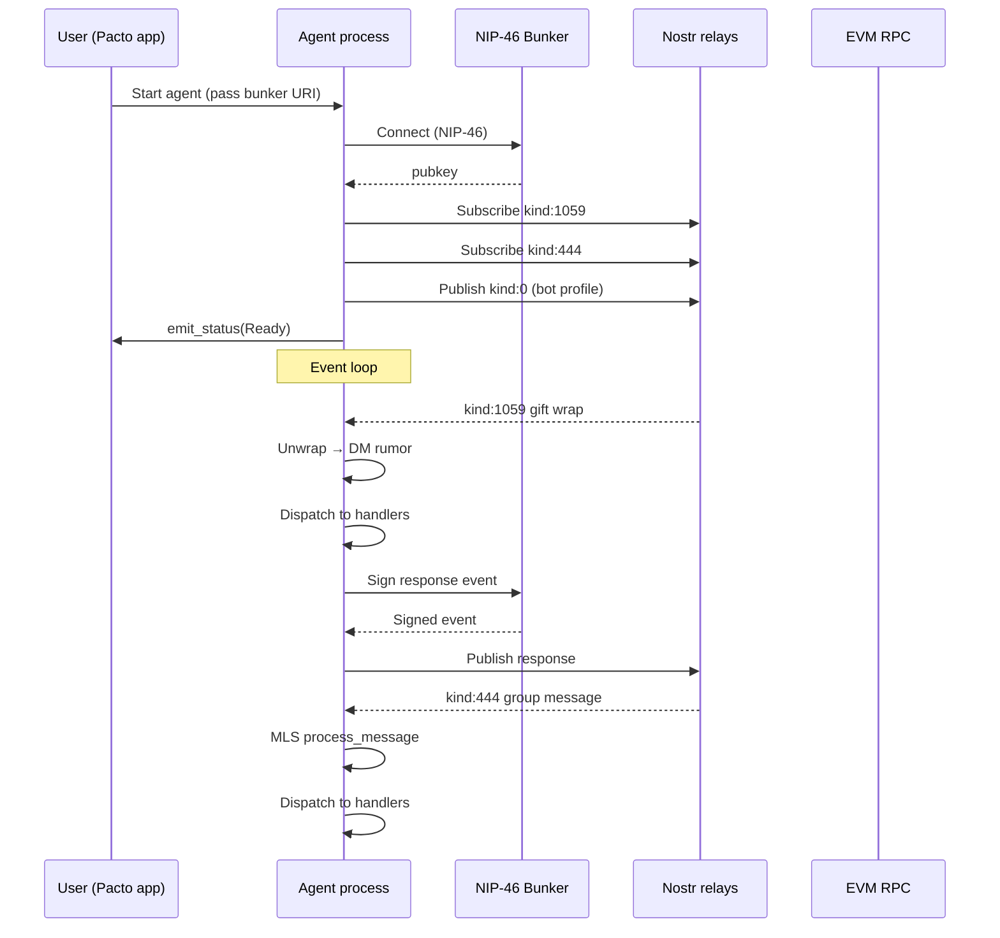
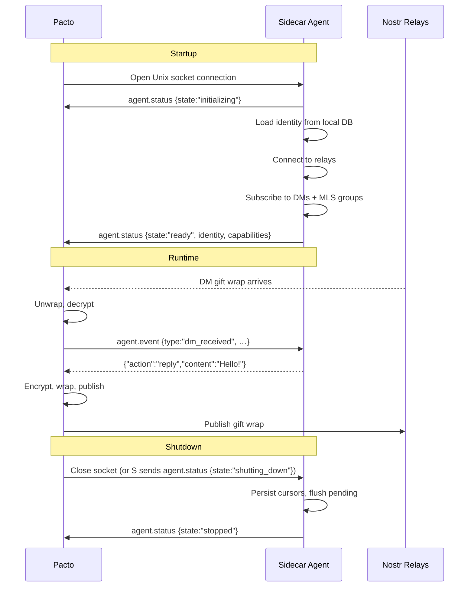
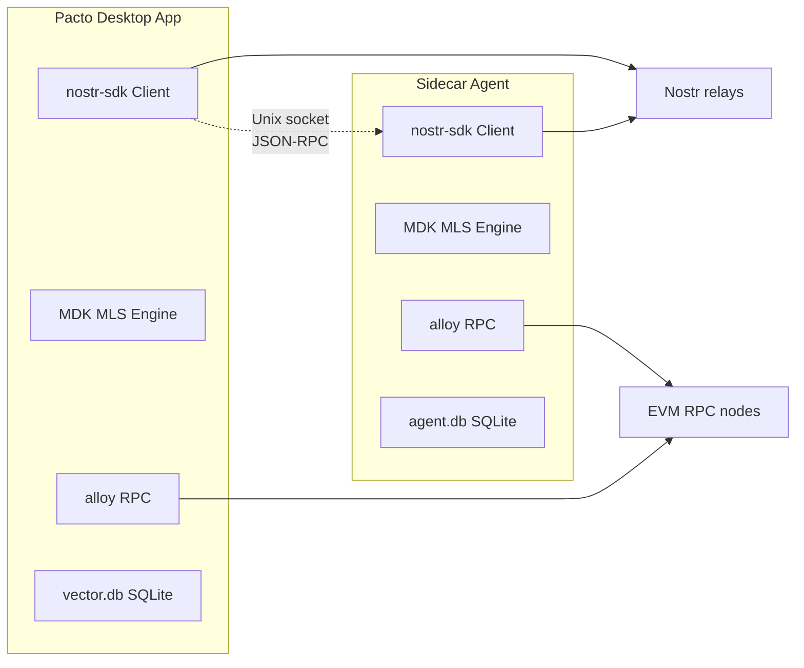
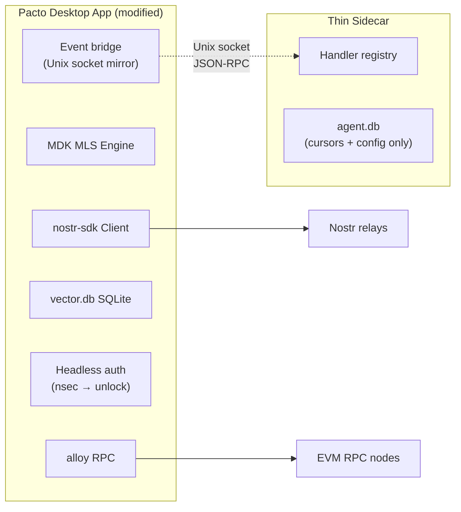
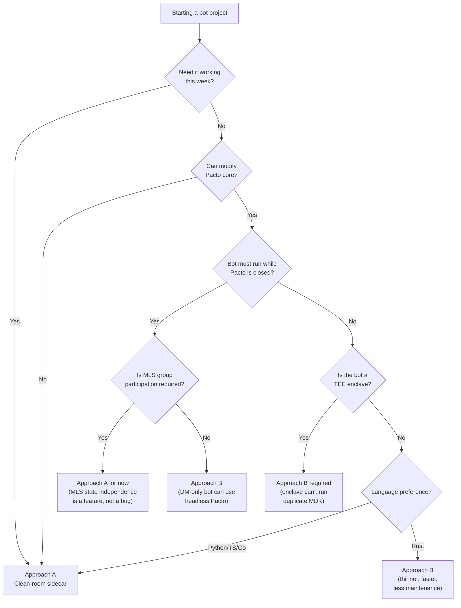
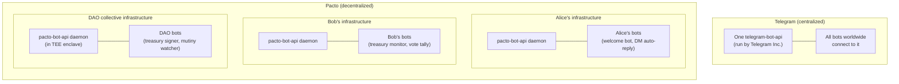
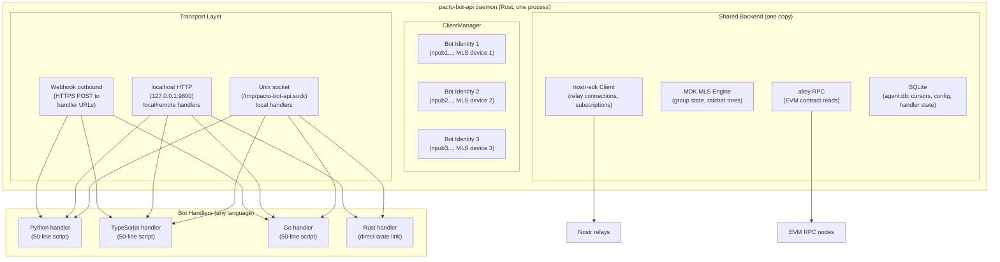
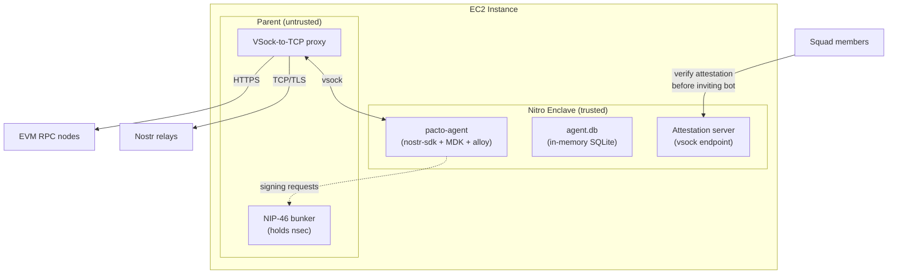
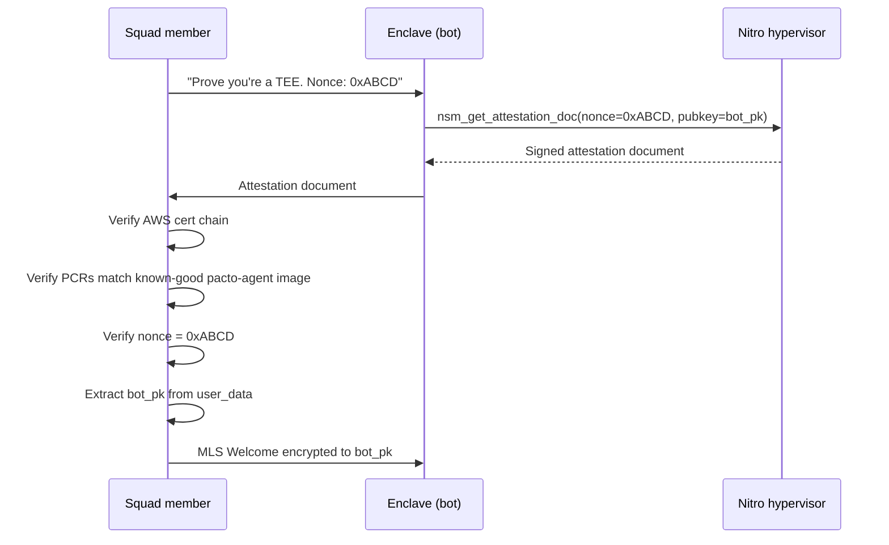

# Pacto Bot Architecture, Part 2: Implementation Roadmap & Deep Internals

> **Audience:** Developer who has read Part 1 (`pacto-bot-architecture-deep-dive.md`) and wants to build.  
> **Goal:** Go from "there is no bot API" to "here is exactly how to build one, what it costs, and what breaks."  
> **Scope:** Concrete implementation paths, the Vector fork lineage, Nostr bot ecosystem survey, governance/wallet bot surface, MLS-specific challenges, and a phased roadmap with effort estimates.  
> **Date:** June 2026

---

## Table of Contents

1. [TL;DR: What Part 2 Adds](#1-tldr-what-part-2-adds)
2. [The Vector Fork: What Was Kept, What Was Discarded, and Why](#2-the-vector-fork-what-was-kept-what-was-discarded-and-why)
3. [The Nostr Bot Ecosystem: What Exists Today](#3-the-nostr-bot-ecosystem-what-exists-today)
4. [MLS Bot Challenges: Why Groups Are Harder Than DMs](#4-mls-bot-challenges-why-groups-are-harder-than-dms)
5. [Governance & Wallet Bot Surface](#5-governance--wallet-bot-surface)
6. [The Commons Broadcast System as a Bot Discovery Channel](#6-the-commons-broadcast-system-as-a-bot-discovery-channel)
7. [Concrete Architecture: The `pacto-agent` Crate](#7-concrete-architecture-the-pacto-agent-crate)
8. [Privacy-Preserving Bot Design Patterns](#8-privacy-preserving-bot-design-patterns)
9. [Comparison: Discord, Slack, Telegram Bot Models vs Pacto](#9-comparison-discord-slack-telegram-bot-models-vs-pacto)
10. [Phased Implementation Roadmap](#10-phased-implementation-roadmap)
11. [Decision Matrix: Which Bot Shape for Which Use Case](#11-decision-matrix-which-bot-shape-for-which-use-case)
12. [Reference Library: Extended](#12-reference-library-extended)

---

## 1. TL;DR: What Part 2 Adds

Part 1 established that Pacto has **no productized bot API** and identified three bot shapes (in-process plugin, local sidecar, remote NIP-46 bunker). Part 2 goes further:

- **Traces the Vector fork lineage** to explain why `vector-sdk` and `vector-agent` are dead ends for Pacto bots.
- **Surveys the Nostr bot ecosystem** — NIP-46 bunkers, NIP-90 Data Vending Machines, `nostr-bot`, NDK — and maps what each can and cannot do for Pacto.
- **Explains why MLS groups are the hardest bot surface** — ephemeral events, non-Send engines, per-device state.
- **Maps the governance/wallet bot surface** — which `pacto-gov` contracts a bot could read/write, and how.
- **Proposes the Commons broadcast system** (`kind:30078`) as a bot discovery and command channel.
- **Designs a concrete `pacto-agent` crate** with module structure, trait definitions, and transport options.
- **Lays out privacy-preserving bot patterns** that respect Pacto's no-KYC, metadata-minimal philosophy.
- **Provides a phased roadmap** with effort estimates: Phase 1 (local sidecar, ~2-4 weeks), Phase 2 (remote bunker, ~4-8 weeks), Phase 3 (multi-tenant hosting, ~8-16 weeks).

---

## 2. The Vector Fork: What Was Kept, What Was Discarded, and Why

### 2.1 Fork origin

Pacto forked the **Rust backend** of [Vector](https://github.com/VectorPrivacy/Vector) (itself a fork of [JSKitty/Vector](https://github.com/JSKitty/Vector)). The fork point was the `src-tauri/` directory — the Tauri desktop app scaffolding, Nostr client integration, and UI shell.

Vector's README states: "Privacy is a basic human right." It is a Signal-style private messenger with mini-app support, built on Nostr. Pacto extends this into Discord-style **governable communities** with embedded blockchain primitives.

### 2.2 Vector's crate workspace

Vector is organized as a Cargo workspace under `crates/`:

| Crate | Purpose | Used by Pacto? |
|-------|---------|----------------|
| `vector-core` | Shared types, crypto, Nostr event handling, group membership model | **No** |
| `vector-sdk` | High-level API for building Vector clients and bots | **No** |
| `vector-agent` | Bot/automation framework — agent identity, command dispatch, invite policies | **No** |
| `vector-cli` | CLI tool for Vector operations | **No** |
| `concord-cli` | CLI for Concord community management (Vector's group protocol) | **No** |

**None of these crates appear in Pacto's `src-tauri/Cargo.toml`.** Searches for `vector_core::`, `vector_sdk::`, `VectorBot`, `InvitePolicy`, and `vector_agent` return zero matches in `pacto-app/src-tauri/src/`.

### 2.3 What Pacto kept from Vector

Pacto kept the **Tauri application shell** and **Nostr integration patterns**:

- Tauri 2.x project structure (`src-tauri/`, `build.rs`, `capabilities/`)
- Svelte frontend with Tauri `invoke`/`listen` patterns
- `nostr-sdk` as the Nostr client library (upgraded to 0.43)
- SQLite-backed local state (`vector.db` — note the name persists)
- NIP-17/44/59 DM stack (gift wraps, seals, rumors)
- The general shape of `lib.rs` as the command registration hub
- `account_manager.rs` patterns for per-npub profile directories

### 2.4 What Pacto discarded and replaced

| Vector concept | Replaced by | Why |
|---------------|-------------|-----|
| **Concord communities** (server-root keys, epoch rekeys) | **MLS groups** via `mdk_core` | Concord is Vector-specific; MLS is an IETF standard with broader ecosystem support |
| `vector-core` group model | `mls.rs` + `chat.rs` (`ChatType::MlsGroup`) | Different wire format (`kind:444` vs Vector's custom kinds) |
| `vector-sdk` client API | Direct `nostr-sdk` usage + Tauri commands | Pacto needed EVM/wallet integration that `vector-sdk` didn't provide |
| `vector-agent` bot framework | Nothing (gap) | Pacto hasn't built its own agent framework yet |
| Vector's mini-app system | Pacto's dashboard widgets + Commons broadcasts | Different product direction (governance vs app platform) |
| `vector-cli` | Nothing (gap) | No CLI exists for Pacto |

### 2.5 Why `vector-agent` is a dead end for Pacto

Vector's `vector-agent` crate was designed for **Concord communities** with:

- Server-root key cryptography (a central authority key per community)
- `InvitePolicy` trait for gating bot entry into communities
- Concord-specific event kinds and message formats
- A command model built on Vector's custom protocol, not Nostr NIPs

Pacto's groups are **MLS-based**, with no server-root key, no central authority, and a completely different wire format (`kind:444`/`kind:443`). The membership model, invite flow, and cryptographic state are incompatible.

**Verdict:** Do not reuse `vector-agent` or `vector-sdk`. Build a new `pacto-agent` crate that wraps Pacto's own backend — `nostr-sdk` for DMs, `mdk_core` for MLS, `alloy` for EVM.

### 2.6 What Vector's agent architecture teaches us

Even though the code is incompatible, Vector's agent design is instructive:

1. **Agent identity = Nostr keypair.** An agent is just a Nostr account with a profile. No separate "bot token" concept.
2. **Invite-gated entry.** Agents don't auto-join communities; they must be invited, respecting the same privacy model as human users.
3. **Command dispatch via DM.** Agents receive commands as Nostr DMs, not through a separate API.
4. **Local-first state.** Agent state lives in SQLite, same as the main app.

These patterns translate directly to Pacto: a Pacto bot is a Nostr identity that receives DMs, gets invited to MLS squads, and reads on-chain governance state.

---

## 3. The Nostr Bot Ecosystem: What Exists Today

### 3.1 `nostr-bot` (Rust)

[crates.io/crates/nostr-bot](https://crates.io/crates/nostr-bot)

A simple command-reaction framework built on `nostr-sdk`. It:

- Subscribes to `kind:1` (public text notes) mentioning the bot's pubkey
- Dispatches to handler functions based on command prefix
- Replies with `kind:1` notes

**Limitations for Pacto:**
- Only handles public `kind:1` events — no NIP-17/59 gift wrap support
- No MLS group awareness
- No on-chain governance integration
- Single-process, single-identity

**Verdict:** Useful as a reference pattern, but insufficient for Pacto's private DM + MLS + governance needs.

### 3.2 `nostr-sdk` 0.43 (Rust) — Pacto's own dependency

Pacto already uses `nostr-sdk` 0.43 with features `nip06`, `nip44`, `nip59`. The SDK provides:

- `Client` with relay pool management, auto-reconnect, subscription filters
- `EventBuilder` for constructing NIP-compliant events (including gift wraps)
- `Keys` for key generation, parsing, and signing
- NIP-17/44/59 support for private DMs
- NIP-46 support for remote signing (bunker client)
- NIP-EE support for MLS group messages (`kind:444`/`kind:443`)

**What's missing for a Pacto bot:**
- No MLS engine integration (the SDK handles wire format, not group state)
- No EVM/wallet integration
- No governance contract bindings
- No bot identity or permission model

**Verdict:** The foundation is solid. A Pacto bot crate would wrap `nostr-sdk` and add MLS, EVM, and governance layers.

### 3.3 NDK (TypeScript)

[github.com/nostr-dev-kit/ndk](https://github.com/nostr-dev-kit/ndk)

The most mature TypeScript Nostr library. Provides:

- `NDKRelay` pool with auto-reconnect
- `NDKSubscription` with filter merging
- `NDKUser` with profile caching
- NIP-46 signer support
- NIP-17 DM support (manual unwrap required)

**Limitations for Pacto:**
- No MLS support
- No EVM integration
- TypeScript-only (can't share code with Pacto's Rust backend)

**Verdict:** Good for building a TypeScript bot sidecar that speaks Nostr directly, but can't reuse Pacto's Rust backend.

### 3.4 NIP-46 Bunkers (Remote Signing)

NIP-46 allows a "bunker" (remote signer) to hold the private key while a client app requests signatures over a relay. Key implementations:

| Bunker | Language | Production-ready? | Notes |
|--------|----------|-------------------|-------|
| **nsecBunker** | TypeScript | Yes | Most widely used; hosted service at nsec.app |
| **Bunker46** | Rust/Docker | Yes | Self-hosted; PostgreSQL + encrypted storage |
| **nostr-bunker (LNbits)** | Python | Yes | LNbits extension; relay-based |
| **nostr-connect (Alby)** | TypeScript | Yes | Browser extension integration |
| **rust-nostr NIP-46** | Rust | Library | `nostr-sdk` includes bunker client support |

**How this applies to Pacto bots:**

A remote Pacto bot would:
1. Generate a Nostr keypair for the bot identity
2. Store the nsec in a self-hosted NIP-46 bunker
3. The bot process connects to the bunker as a NIP-46 client
4. All event signing is delegated to the bunker
5. The bot process never holds the raw nsec

This is the **recommended pattern** for 24/7 Pacto bots. The bunker holds the key; the bot process holds plaintext (necessary for message processing) but not the signing key.

### 3.5 NIP-90: Data Vending Machines

[NIP-90](https://github.com/nostr-protocol/nips/blob/master/90.md) defines a pattern for **public compute bots** on Nostr:

- A DVM publishes a `kind:31990` event announcing its capabilities
- Users send `kind:5xxx` request events with `#p` tags targeting the DVM
- The DVM responds with `kind:6xxx` result events, also `#p`-tagged to the requester
- Payment can be integrated via NIP-57 (zaps) or NIP-88 (job requests)

**Relevance to Pacto:**
- NIP-90 is designed for **public, non-private** interactions — all request/response events are visible on relays
- This conflicts with Pacto's privacy model for DMs and MLS groups
- However, NIP-90 could work for **public Pacto services**: Commons feed aggregation, tag search, public squad discovery
- A Pacto bot could register as a DVM for public services while using private DMs for sensitive operations

### 3.6 Existing Nostr bot hosting

No dedicated "Nostr bot hosting platform" exists comparable to Telegram's Bot API or Discord's bot infrastructure. The closest analogues:

- **nostr.band** — search/analytics, not bot hosting
- **nostr.build** — media hosting, not general-purpose bots
- **zap.store** — Nostr app directory, not bot hosting

**Implication:** Pacto bot hosting would be greenfield. A Pacto Bot API server (analogous to Telegram's `telegram-bot-api`) would be a new piece of infrastructure.

---

## 4. MLS Bot Challenges: Why Groups Are Harder Than DMs

### 4.1 The fundamental problem

MLS (Messaging Layer Security) is a **stateful group protocol**. Every member maintains a local ratchet tree. To process a group message, a bot must:

1. Be a member of the MLS group (have a leaf in the ratchet tree)
2. Have processed all prior Commit messages in order (no gaps)
3. Have the current epoch's encryption keys
4. Run the MDK engine's `process_message` on a **blocking thread** (the engine is not `Send`)

This is fundamentally different from DMs, where each message is independently decryptable with the conversation key.

### 4.2 Ephemeral events

`kind:444` (MlsGroupMessage) events are **ephemeral** — relays are not required to store them long-term. If a bot misses a Commit (the event that advances the group epoch), it **cannot decrypt subsequent messages** until it receives that Commit.

**Mitigations:**
- Run the bot on relays that guarantee `kind:444` persistence
- Maintain a local copy of all `kind:444` events (what Pacto's `mls_event_cursors` table does)
- Implement gap detection and re-fetch from multiple relays
- Consider a "bot relay" — a dedicated relay that stores all group traffic for bot consumption

### 4.3 Non-Send engine

Pacto's MDK engine (`mdk_core`) is **not `Send`**. All engine operations must run on a single blocking thread via `tokio::task::spawn_blocking`. This means:

- A bot cannot share an MLS engine across async tasks
- Engine state is tied to one thread
- Multi-group bots need careful engine lifecycle management

Pacto's own code documents this in `lib.rs` with a large comment block before `list_group_cursors`.

### 4.4 Per-device state

MLS state is **per-device**, not per-identity. Each device (phone, desktop, bot) has its own leaf in the ratchet tree. This means:

- A bot is a separate MLS "device" — it must be added to the group explicitly
- The bot's MLS state (`vector-mls.db`) is independent of the user's state
- If the bot's MLS database is lost, it must be re-invited to every group

### 4.5 Invite flow

A bot joins an MLS squad through the same flow as a human:

1. An existing member calls `invite_member_to_group` with the bot's npub
2. Pacto fetches the bot's KeyPackage from `kind:10051` events
3. A `kind:443` Welcome is constructed and gift-wrapped to the bot
4. The bot receives the gift wrap, unwraps it, and processes the Welcome
5. The bot is now a member and can send/receive `kind:444` messages

**There is no "add bot to group" shortcut.** The bot must go through the full MLS invite handshake.

### 4.6 Practical implications

| Concern | DM bot | MLS bot |
|---------|--------|---------|
| Join mechanism | Just start receiving gift wraps | Must be invited via MLS Welcome |
| State requirements | Conversation key only | Full ratchet tree + all prior Commits |
| Gap recovery | Re-query relays for missed gift wraps | May need re-invite if Commits are lost |
| Concurrency | Multiple DMs in parallel | One engine thread; serialize group operations |
| Storage | Lightweight | `vector-mls.db` per bot identity |

---

## 5. Governance & Wallet Bot Surface

### 5.1 What a bot can read (no key needed)

Pacto's governance contracts are on **public EVM chains**. Any bot with an RPC endpoint can read:

| Contract | Read method | What it returns |
|----------|------------|-----------------|
| `NavePirataRegistry` | `squadDeployments` | All deployed squad Safes |
| `Quartermaster` | `getCrewSnapshot`, `crewHat` | Current crew roster, crew hat ID |
| `MutinyModule` | `mutinyState`, `captainHat` | Active mutiny status, captain hat ID |
| `TreasuryAuthority` | `getProposal`, `proposalCount` | Proposal details, vote tallies |
| `SquadAdmin` | `getExecutorRow` | Authorized executor addresses and roles |
| `Hats` (external) | `isWearerOfHat`, `getWearer` | Role membership checks |
| `Safe` (external) | `getOwners`, `getThreshold` | Multisig configuration |

Pacto already has Alloy bindings for these in `src-tauri/src/evm/contracts/pacto_gov/`. A bot can reuse the same `sol!` macros and RPC provider setup.

### 5.2 What a bot can write (needs signing key)

Writing to governance contracts requires an EVM transaction signed by an authorized key:

| Action | Required role | Contract |
|--------|--------------|----------|
| Create proposal | Crew member | `TreasuryAuthority` |
| Vote on proposal | Crew member | `TreasuryAuthority` |
| Execute proposal | Captain + crew threshold | `TreasuryAuthority` |
| Initiate mutiny | Crew member | `MutinyModule` |
| Finalize mutiny | 51% crew vote | `MutinyModule` |
| Add/remove crew | Captain (via Quartermaster) | `Quartermaster` |
| Execute SquadAdmin action | Authorized executor | `SquadAdmin` |

A bot would need:
1. An EVM private key derived from its Nostr nsec (via `nostr-k-derivs`)
2. The appropriate on-chain role (crew member, captain, or authorized executor)
3. ETH for gas (or sponsorship via `pacto-squad-sponsor`)

### 5.3 The `nostr-k-derivs` bridge

Pacto's `nostr-k-derivs` crate derives Ethereum and Aztec keys from a Nostr nsec:

```
Nostr nsec → BIP-32 seed → m/44'/60'/0'/0/0 → Ethereum private key
Nostr nsec → BIP-32 seed → Aztec derivation path → Aztec private key
```

A bot with a Nostr identity automatically has EVM and Aztec addresses. No separate wallet setup. This is the same mechanism that powers Pacto's "embedded wallets."

### 5.4 Squad sponsor for gas

`pacto-squad-sponsor` lets squads subsidize gas for members. A bot could:

1. Be added to the squad sponsor's allowlist
2. Submit transactions through the sponsor contract
3. Have gas paid from the squad's sponsor deposit

This removes the "bot needs ETH" barrier — same as for human users.

### 5.5 Treasury proposal automation

A governance bot could automate:

- **Proposal creation:** "Create a proposal to send 0.1 ETH to address X if the treasury balance exceeds Y"
- **Vote tallying:** Monitor proposal votes and notify when quorum is reached
- **Execution triggers:** Execute passed proposals automatically (if authorized)
- **Treasury monitoring:** Alert on large withdrawals or low balances
- **Roster changes:** Notify when crew members are added/removed

All of these are read-only from the bot's perspective until it needs to sign a transaction.

---

## 6. The Commons Broadcast System as a Bot Discovery Channel

### 6.1 How Commons works

Pacto's **Commons** is a public discovery feed using `kind:30078` (NIP-33 parameterized replaceable events) on trusted relays. Users and public squads publish time-bounded broadcasts with tags, messages, and expiry.

Key properties:
- **Public by design** — visible to anyone on the trusted relays
- **Time-bounded** — 24h to 30d TTL
- **Tag-filterable** — up to 3 hashtags per broadcast
- **Cancelable** — author can retract with a tombstone event

### 6.2 Bot discovery via Commons

A bot could publish a Commons broadcast to announce its presence:

```json
{
  "schema": "pacto.commons.broadcast.v1",
  "subject": "user",
  "message": "Treasury monitor bot for Neo Builders. DM me to subscribe.",
  "durationHours": 720,
  "expiresAt": 1745000000,
  "tags": ["bot", "treasury", "governance"],
  "audience": "active_user"
}
```

Users discover the bot in the Commons feed, DM it to subscribe, and the bot joins their squad (via MLS invite).

### 6.3 Bot command channel via Commons

A more advanced pattern: bots could use Commons as a **public command channel**:

1. Bot publishes a broadcast with `tags: ["bot", "treasury"]` and a `d` tag like `pacto_bot/treasury_monitor`
2. Users send `kind:30078` events with `d: pacto_bot_command/treasury_monitor` containing JSON commands
3. Bot monitors for command events, processes them, and responds via DM or another `kind:30078`

**Privacy caveat:** Commons is public. Commands and responses are visible to anyone on the trusted relays. This pattern is only suitable for non-sensitive operations (e.g., "show me the squad treasury balance").

### 6.4 NIP-90 integration

A Pacto bot could also register as a NIP-90 DVM:

1. Publish `kind:31990` announcing capabilities (e.g., "pacto-treasury-monitor")
2. Accept `kind:5xxx` job requests
3. Return `kind:6xxx` results

This would make the bot discoverable by any NIP-90-aware Nostr client, not just Pacto.

---

## 7. Concrete Architecture: The `pacto-agent` Crate

### 7.1 Design principles

1. **Reuse Pacto's backend, don't reimplement it.** The agent wraps `nostr-sdk`, `mdk_core`, and `alloy` — the same crates Pacto already depends on.
2. **Bot identity = Nostr keypair.** No separate token system. A bot is a Nostr user with a `bot` profile flag.
3. **Privacy-first.** Default to local-only; remote operation requires explicit opt-in and NIP-46 bunker.
4. **Pluggable transports.** Support Tauri events (in-process), Unix socket / localhost HTTP (sidecar), and Nostr relay (remote).
5. **Capability-based permissions.** A bot declares what it can do; the user grants specific capabilities.

### 7.2 Crate structure

```text
crates/pacto-agent/
├── Cargo.toml
└── src/
    ├── lib.rs              # crate root, re-exports
    ├── agent.rs            # Agent struct, lifecycle
    ├── identity.rs         # Bot identity, key management, bot profile flag
    ├── capabilities.rs     # Capability declaration and permission model
    ├── transport/
    │   ├── mod.rs          # Transport trait
    │   ├── tauri.rs        # In-process Tauri event transport
    │   ├── local.rs         # Unix socket / localhost HTTP transport
    │   └── remote.rs       # Nostr relay transport (NIP-46 bunker)
    ├── messaging/
    │   ├── mod.rs          # Message dispatch
    │   ├── dm.rs           # NIP-17/59 DM send/receive
    │   └── mls.rs          # MLS group send/receive (wraps mdk_core)
    ├── governance/
    │   ├── mod.rs          # Governance operations
    │   ├── read.rs         # Read-only contract queries
    │   └── write.rs        # Signed transaction submission
    ├── commons/
    │   └── mod.rs          # Commons broadcast publish/subscribe
    └── handlers/
        ├── mod.rs          # Handler trait + registry
        ├── command.rs      # /command dispatch
        └── event.rs        # Event-driven handlers
```

### 7.3 Core traits

```rust
/// A transport layer for agent I/O.
#[async_trait]
pub trait Transport: Send + Sync {
    /// Send a message to a user (DM) or group (MLS).
    async fn send_message(&self, target: ChatTarget, content: MessageContent) -> Result<()>;

    /// Receive the next inbound event (message, invite, reaction, etc.).
    async fn recv_event(&self) -> Result<AgentEvent>;

    /// Emit a status/error event to the controlling frontend.
    async fn emit_status(&self, status: AgentStatus) -> Result<()>;
}

/// A capability that the agent can perform.
#[derive(Debug, Clone, Serialize, Deserialize)]
pub enum Capability {
    ReadMessages,
    SendMessages,
    ReadGovernance,
    SignTransactions,
    ManageMembers,
    PublishCommons,
}

/// A handler for a specific command or event.
#[async_trait]
pub trait Handler: Send + Sync {
    fn name(&self) -> &'static str;
    fn capabilities(&self) -> Vec<Capability>;
    async fn handle(&self, agent: &Agent, event: AgentEvent) -> Result<()>;
}
```

### 7.4 Agent lifecycle



### 7.5 Transport options

| Transport | Latency | Security | Use case |
|-----------|---------|----------|----------|
| **Tauri events** (in-process) | ~0ms | Same as app | Dev/debug, personal automation |
| **Unix socket** (localhost) | <1ms | Local only | Sidecar on same machine |
| **localhost HTTP** | <1ms | Local only | Sidecar, language-agnostic |
| **Nostr relay** (remote) | 100-500ms | Relay sees metadata | 24/7 hosted bot |

### 7.6 Integration with Pacto's existing code

The `pacto-agent` crate would be a **new workspace member** in Pacto's Cargo workspace, not a modification to the existing `src-tauri/src/` code. It would:

1. Depend on `nostr-sdk` 0.43 (same version as Pacto)
2. Depend on `mdk-core` and `mdk-sqlite-storage` (same git revisions)
3. Depend on `alloy` 1.x (same version as Pacto)
4. Reuse Pacto's `sol!` contract bindings from `src-tauri/src/evm/contracts/`
5. Define its own SQLite schema for agent state (separate from Pacto's `vector.db`)

The crate would be **optional** — gated behind a Cargo feature flag — so it doesn't bloat the main Pacto binary for users who don't need bots.

### 7.7 Sidecar Deep-Dive: The Local Bot API Server Pattern

The **local sidecar** is the recommended first-phase bot shape. It is a separate process running on the same machine as Pacto, communicating over a local-only transport. This section specifies the protocol, lifecycle, and security model in enough detail to implement.

#### 7.7.1 Why a sidecar?

| Concern | In-process plugin | Local sidecar | Remote bunker |
|---------|------------------|---------------|---------------|
| **Lifetime** | Dies with Pacto | Survives Pacto restart | Independent |
| **Language freedom** | Rust/Svelte only | Any language | Any language |
| **Plaintext exposure** | Device only | Device only | Server operator |
| **Key custody** | Shared with app | Own keypair | Bunker-held |
| **MLS state** | Shared engine | Own engine + DB | Own engine + DB |
| **Deployment** | Bundled in app | Separate binary/script | Server + bunker |
| **Debugging** | App logs | Independent logs | Remote logs |

The sidecar hits the sweet spot: always-on, language-agnostic, plaintext stays on device, and it can run while Pacto is closed (if the machine is on).

#### 7.7.2 Transport: Unix Domain Socket

The sidecar communicates with Pacto over a Unix domain socket at a well-known path:

```
$PACT_DATA_DIR/agent.sock
```

Where `$PACT_DATA_DIR` is Pacto's per-identity data directory (e.g., `~/.local/share/com.covenant-gov.pacto/<npub>/`).

**Why Unix sockets over localhost TCP:**
- Filesystem permissions provide access control (only the user running Pacto can connect)
- No port conflicts
- No risk of other local processes connecting
- Lower overhead than TCP loopback

**Fallback:** On Windows, use a named pipe at the same logical path. The transport trait abstracts this.

#### 7.7.3 Wire Protocol: JSON-RPC 2.0 over newline-delimited frames

Each message is a single JSON-RPC 2.0 request, response, or notification, terminated by `\n`. No length prefix — the newline is the frame delimiter.

**Request (Pacto → Agent):**
```json
{"jsonrpc":"2.0","id":1,"method":"agent.event","params":{"type":"dm_received","chat_id":"<npub>","content":"hello bot","rumor_id":"<hex>"}}
```

**Response (Agent → Pacto):**
```json
{"jsonrpc":"2.0","id":1,"result":{"action":"ack"}}
```

**Notification (Agent → Pacto, no id):**
```json
{"jsonrpc":"2.0","method":"agent.send_dm","params":{"recipient":"<npub>","content":"pong","reply_to":"<hex>"}}
```

**Notification (Agent → Pacto, status):**
```json
{"jsonrpc":"2.0","method":"agent.status","params":{"state":"ready","identity":"<npub>","capabilities":["ReadMessages","SendMessages"]}}
```

#### 7.7.4 Method Catalog

**Pacto → Agent (requests):**

| Method | Params | Semantics |
|--------|--------|-----------|
| `agent.event` | `type`, `chat_id`, `content`, `rumor_id`, `author` | A DM or group message was received. Agent should respond with `ack` or `error`. |
| `agent.invite` | `group_id`, `group_name`, `inviter` | Agent was invited to an MLS group. Agent should accept or decline. |
| `agent.member_join` | `group_id`, `member` | A new member joined a group the agent is in. |
| `agent.member_leave` | `group_id`, `member` | A member left or was removed. |
| `agent.reaction` | `chat_id`, `rumor_id`, `reaction`, `author` | A reaction was added to a message. |
| `agent.poll_created` | `group_id`, `poll_id`, `question`, `options` | A dashboard poll was created. |
| `agent.poll_vote` | `group_id`, `poll_id`, `option`, `voter` | A vote was cast. |
| `agent.governance.proposal` | `squad_id`, `proposal_id`, `action`, `proposer` | A treasury proposal was created on-chain. |
| `agent.governance.vote` | `squad_id`, `proposal_id`, `voter`, `support` | A vote was cast on-chain. |
| `agent.governance.executed` | `squad_id`, `proposal_id`, `tx_hash` | A proposal was executed. |
| `agent.commons.broadcast` | `broadcast_id`, `author`, `message`, `tags` | A Commons broadcast was published. |

**Agent → Pacto (notifications):**

| Method | Params | Semantics |
|--------|--------|-----------|
| `agent.send_dm` | `recipient`, `content`, `reply_to?` | Send a DM. Pacto encrypts, wraps, and publishes. |
| `agent.send_group_msg` | `group_id`, `content`, `reply_to?` | Send an MLS group message. |
| `agent.react` | `chat_id`, `rumor_id`, `reaction` | Add a reaction. |
| `agent.create_poll` | `group_id`, `question`, `options` | Create a dashboard poll. |
| `agent.vote_poll` | `group_id`, `poll_id`, `option` | Vote on a poll. |
| `agent.publish_commons` | `message`, `tags`, `duration_hours` | Publish a Commons broadcast. |
| `agent.set_profile` | `name?`, `about?`, `picture?` | Update the bot's Nostr profile. |
| `agent.status` | `state`, `identity`, `capabilities` | Agent lifecycle state change. |
| `agent.error` | `code`, `message`, `data?` | Agent encountered an error. |

**Agent → Pacto (responses to `agent.event`):**

| Result | Meaning |
|--------|---------|
| `{"action":"ack"}` | Event processed; no reply needed. |
| `{"action":"reply","content":"…"}` | Agent wants to reply to this message. |
| `{"action":"defer"}` | Agent will handle asynchronously; don't expect a reply. |
| `{"action":"ignore"}` | Agent explicitly ignores this event. |

#### 7.7.5 Agent Lifecycle Over the Socket



#### 7.7.6 Agent Identity & Key Management

The sidecar holds its **own Nostr keypair**, separate from the user's. Two options:

**Option A: Derived from user's mnemonic (recommended)**
- User's BIP-39 mnemonic → `m/44'/1237'/0'/0/0` → user's nsec
- Same mnemonic → `m/44'/1237'/0'/0/1` → agent's nsec
- Agent identity is deterministic; user can recover it from their seed phrase
- Agent's npub is predictable: `npub1…` derived from the child key

**Option B: Independent keypair**
- Agent generates its own nsec on first run
- Agent's npub is unrelated to the user's
- User must back up the agent's nsec separately
- More flexible (can share agent across users) but more complex

The agent's nsec is stored in a local SQLite database (`agent.db`) in the same data directory, encrypted with the same `ENCRYPTION_KEY` as Pacto's `vector.db`.

#### 7.7.7 MLS State for Sidecar Agents

The sidecar maintains its own MLS engine and `vector-mls.db`. This is **independent** of Pacto's MLS state because:

- The agent is a separate MLS device (its own leaf in the ratchet tree)
- The agent must be explicitly invited to each group
- The agent's MLS state evolves independently (its own epoch tracking, its own key packages)

**Implication:** If the user is in 10 squads, the agent must be invited to each one separately. There is no "clone my MLS state" shortcut — that would violate MLS's per-device security model.

#### 7.7.8 Comparison: Telegram's Local Bot API Server

Telegram's `telegram-bot-api --local` is the closest analogue to Pacto's sidecar:

| Dimension | Telegram Local Bot API | Pacto Sidecar |
|-----------|----------------------|---------------|
| **Transport** | HTTP on localhost | Unix socket (JSON-RPC) |
| **Auth** | Bot token in URL path | Filesystem permissions on socket |
| **File upload limit** | 2000 MB (vs 50 MB public) | No artificial limit (local) |
| **TLS required** | No | No (Unix socket) |
| **File path** | Absolute local path from `getFile` | Shared data directory |
| **Multi-bot** | One TDLib instance, many bots | One sidecar per agent identity |
| **State** | Per-bot in `ClientManager` | Per-agent in `agent.db` |

#### 7.7.9 Sidecar Implementation Sketch

```rust
// crates/pacto-agent/src/transport/local.rs

use tokio::net::UnixListener;
use tokio::io::{AsyncBufReadExt, AsyncWriteExt, BufReader};

pub struct LocalTransport {
    socket_path: PathBuf,
    listener: UnixListener,
}

impl LocalTransport {
    pub async fn bind(data_dir: &Path) -> Result<Self> {
        let socket_path = data_dir.join("agent.sock");
        // Remove stale socket if it exists
        let _ = tokio::fs::remove_file(&socket_path).await;
        let listener = UnixListener::bind(&socket_path)?;
        // Restrict to current user only
        #[cfg(unix)]
        {
            use std::os::unix::fs::PermissionsExt;
            tokio::fs::set_permissions(&socket_path,
                std::fs::Permissions::from_mode(0o600)).await?;
        }
        Ok(Self { socket_path, listener })
    }

    pub async fn accept(&self) -> Result<LocalConnection> {
        let (stream, _) = self.listener.accept().await?;
        let (reader, writer) = stream.into_split();
        Ok(LocalConnection {
            reader: BufReader::new(reader),
            writer,
        })
    }
}

pub struct LocalConnection {
    reader: BufReader<OwnedReadHalf>,
    writer: OwnedWriteHalf,
}

impl LocalConnection {
    /// Read one JSON-RPC message (newline-delimited).
    pub async fn read_message(&mut self) -> Result<JsonRpcMessage> {
        let mut line = String::new();
        self.reader.read_line(&mut line).await?;
        serde_json::from_str(&line)
    }

    /// Write one JSON-RPC message followed by newline.
    pub async fn write_message(&mut self, msg: &JsonRpcMessage) -> Result<()> {
        let mut json = serde_json::to_string(msg)?;
        json.push('\n');
        self.writer.write_all(json.as_bytes()).await?;
        Ok(())
    }
}
```

#### 7.7.10 Sidecar Security Model

| Threat | Mitigation |
|--------|------------|
| **Other local users reading the socket** | Unix socket permissions (`0o600` — owner only) |
| **Malicious process on same machine** | Socket path in user's private data directory; no port exposed |
| **Agent process compromised** | Agent holds its own nsec, not the user's; blast radius is the agent's identity only |
| **Agent crashes mid-operation** | Idempotent event processing; cursor-based recovery on restart |
| **Agent's `agent.db` stolen** | Encrypted with same `ENCRYPTION_KEY` as Pacto's DB; requires user's password |
| **Replay attacks** | Each event carries a `rumor_id`; agent deduplicates by ID |

#### 7.7.11 Language-Agnostic Sidecars

Because the wire protocol is JSON-RPC over a Unix socket, the sidecar can be written in **any language**:

| Language | Socket library | JSON-RPC library | Effort |
|----------|---------------|------------------|--------|
| **Rust** | `tokio::net::UnixListener` | `serde_json` | Low (native) |
| **Python** | `asyncio.start_unix_server` | `json` (stdlib) | Low |
| **TypeScript (Node)** | `net.createServer` with `PIPE` | `JSON.parse` (stdlib) | Low |
| **TypeScript (Bun)** | `Bun.listen({unix: …})` | `JSON.parse` (stdlib) | Low |
| **Go** | `net.Listen("unix", …)` | `encoding/json` (stdlib) | Low |

A Python sidecar example:

```python
import asyncio, json, os

SOCKET_PATH = os.path.expanduser("~/.local/share/com.covenant-gov.pacto/<npub>/agent.sock")

async def handle(reader, writer):
    while line := await reader.readline():
        msg = json.loads(line.decode())
        if msg.get("method") == "agent.event":
            # Process the event
            reply = {"jsonrpc": "2.0", "id": msg["id"], "result": {"action": "ack"}}
            writer.write((json.dumps(reply) + "\n").encode())
            await writer.drain()

async def main():
    try:
        os.unlink(SOCKET_PATH)
    except FileNotFoundError:
        pass
    server = await asyncio.start_unix_server(handle, SOCKET_PATH)
    os.chmod(SOCKET_PATH, 0o600)
    async with server:
        await server.serve_forever()

asyncio.run(main())
```

#### 7.7.12 Sidecar Discovery

Pacto discovers the sidecar by checking for the socket file:

1. On startup, Pacto checks `$PACT_DATA_DIR/agent.sock`
2. If present, Pacto connects and waits for `agent.status {state:"ready"}`
3. If absent, Pacto shows "No agent running" in the UI
4. Pacto can start the agent process itself (spawn a child process) or expect the user to start it separately

The agent's capabilities are declared in the `agent.status` notification. Pacto's UI can show which capabilities are available and let the user enable/disable them.

#### 7.7.13 Sidecar vs. In-Process Plugin: When to Use Which

| Scenario | Use sidecar | Use in-process |
|----------|-------------|----------------|
| Bot must run while Pacto is closed | **Yes** | No |
| Bot is written in Python/TS/Go | **Yes** | No (Rust/Svelte only) |
| Bot needs independent MLS state | **Yes** | Shares engine |
| Bot is simple (auto-reply, keyword trigger) | Overkill | **Yes** |
| User wants zero setup | Overkill | **Yes** |
| Bot needs to survive Pacto crashes | **Yes** | No |
| Bot is a personal script, not shared | Either | **Yes** |
| Bot is shared with other squad members | **Yes** (own identity) | No (tied to user) |


### 7.8 Core Modification vs. Clean-Room Sidecar: Two Approaches

The architecture described in §7.1–7.7 assumes the sidecar runs its own `nostr-sdk` client, its own MDK MLS engine, its own `alloy` RPC connections, and its own SQLite database — a **clean-room reimplementation** of Pacto's backend. This section examines whether modifying Pacto's core instead would produce a better result, and when each approach is appropriate.

#### 7.8.1 Approach A: Clean-Room Sidecar (No Core Changes)

The sidecar is a fully independent process. It duplicates every subsystem Pacto uses:



**What the sidecar does itself:**
- Opens its own WebSocket connections to Nostr relays
- Subscribes to `kind:1059` gift wraps and `kind:444` group messages independently
- Runs its own MDK engine to decrypt MLS messages
- Maintains its own `agent.db` with event cursors, profiles, and MLS state
- Connects to EVM RPC nodes for governance reads
- Derives or generates its own Nostr keypair

**What Pacto sends over the socket:**
- Already-decrypted DM and MLS message events (Pacto unwraps, decrypts, then forwards)
- Group lifecycle events (invites, member joins/leaves)
- Governance events (proposals, votes, executions)
- Commons broadcast events

**Pros:**

| Pro | Why it matters |
|-----|----------------|
| **Zero core changes** | Ships immediately; no need to convince Pacto maintainers or wait for a release cycle. |
| **Language-agnostic** | Sidecar can be Python, TypeScript, Go — anything that speaks JSON-RPC over a Unix socket. |
| **Independent lifecycle** | Sidecar can be restarted, upgraded, or crashed without affecting Pacto. |
| **Separate relay footprint** | Sidecar's relay connections don't reveal the user's IP or connection pattern. |
| **Clean failure domain** | A buggy bot handler can't corrupt Pacto's `vector.db` or crash the main app. |
| **No drift risk for Pacto** | Pacto's codebase stays untouched; no merge conflicts, no regression risk. |

**Cons:**

| Con | Why it hurts |
|-----|-------------|
| **2x dependency weight** | Two copies of `nostr-sdk`, `mdk_core`, `mdk_sqlite_storage`, `alloy`, `tokio`, and `rusqlite` in memory. On a laptop, this is ~200–400 MB extra RSS. |
| **MLS state divergence** | Pacto and the sidecar maintain independent ratchet trees. If Pacto processes a Commit that the sidecar misses (or vice versa), they desynchronize. The sidecar must be re-invited. |
| **Two relay connections per identity** | The user's npub has two WebSocket connections to each relay — one from Pacto, one from the sidecar. Some relays rate-limit by IP or connection count. |
| **Double the relay bandwidth** | Both processes subscribe to the same `kind:1059` and `kind:444` events. Every gift wrap is downloaded twice. |
| **Cursor drift** | Pacto and the sidecar track separate `since` cursors. If the sidecar's cursor falls behind, it re-fetches events Pacto already processed. |
| **Key management fragmentation** | If using Option A (derived from user mnemonic), both processes need the seed. If using Option B (independent keypair), the sidecar's nsec must be backed up separately. |
| **Governance read duplication** | Both processes query the same EVM RPC endpoints for the same contract state. |

#### 7.8.2 Approach B: Core-Modified Pacto (Thin Sidecar)

Pacto's core is modified to expose a headless auth path and an external event stream. The sidecar becomes a **thin handler** — it receives already-decrypted, already-processed events and only runs business logic.



**What Pacto does (new):**
- Accepts `--headless` mode: unlock with nsec hex directly, no password, no webview
- Mirrors all internal events (`message_new`, `mls_message_new`, `mls_invite_received`, `dashboard_poll_replica_updated`, `wallet_tx_request`, etc.) over a Unix socket as JSON-RPC notifications
- Accepts response instructions from the sidecar (`agent.send_dm`, `agent.send_group_msg`, `agent.react`, etc.) and executes them using its own Nostr client and MLS engine
- Optionally: reads the `bot` profile flag to restrict sensitive operations (mutiny, squad deploy, treasury sign)

**What the sidecar does (reduced):**
- Connects to the Unix socket
- Receives already-decrypted events
- Runs handler logic (command dispatch, auto-reply, governance monitoring)
- Sends response instructions back over the socket
- Stores only handler-specific state (conversation context, user preferences) in `agent.db`

**What the sidecar no longer does:**
- No `nostr-sdk` dependency
- No MDK engine
- No `alloy` RPC connections
- No relay WebSocket subscriptions
- No gift wrap unwrapping or seal decryption
- No MLS ratchet tree maintenance

**Pros:**

| Pro | Why it matters |
|-----|----------------|
| **No subsystem duplication** | One `nostr-sdk` Client, one MDK engine, one set of relay connections. Memory savings: ~200–400 MB. |
| **Shared MLS state** | Pacto and the sidecar use the same ratchet tree. No divergence, no re-invites. The sidecar is not a separate MLS device — it's a handler attached to the user's existing device. |
| **Single relay footprint** | One WebSocket connection per relay. No double-subscription, no double-bandwidth. |
| **Unified cursors** | One `since` cursor tracked by Pacto. The sidecar never misses events that Pacto received. |
| **Simpler sidecar** | The sidecar binary is ~100 lines of handler logic + a JSON-RPC client. It can be a 50-line Python script. |
| **Governance reads are free** | The sidecar receives governance events from Pacto's existing RPC polling. No separate RPC connections. |
| **Key management is unified** | The sidecar doesn't hold keys. Pacto signs everything. One seed, one backup. |
| **Enables TEE bots** | A TEE enclave can't run two MDK engines (memory + complexity). Approach B means the enclave runs only handler logic. |

**Cons:**

| Con | Why it hurts |
|-----|-------------|
| **Requires core changes to Pacto** | Must convince maintainers, pass code review, and ship a release. Timeline: weeks to months, not days. |
| **Sidecar is Rust-only (or FFI-bound)** | The sidecar must link against Pacto's crates or communicate via a well-defined protocol. Python/TS sidecars still work over the socket, but they can't call Pacto functions directly. |
| **Sidecar lifecycle coupled to Pacto** | If Pacto crashes, the sidecar loses its event stream. The sidecar cannot run independently while Pacto is closed. |
| **Regression risk** | Every core change is a potential bug in Pacto's main code path. Headless auth that corrupts `vector.db` affects all users, not just bot users. |
| **Permission boundary is fuzzy** | The sidecar sends instructions, Pacto executes them. If the sidecar is compromised, it can send arbitrary `agent.send_dm` instructions. Pacto must validate that the sidecar is authorized for each capability. |
| **Release cycle coupling** | Bot features ship at Pacto's release cadence. A bot developer can't iterate faster than Pacto's main branch. |

#### 7.8.3 The Specific Core Changes (by Phase and Effort)

These are the concrete modifications to Pacto's `src-tauri/src/` that Approach B requires, ordered by implementation effort.

**Tier 1 — Unlocks Phase 1 (local sidecar): ~150 lines total**

| # | Change | File(s) | Lines | Description |
|---|--------|---------|-------|-------------|
| 1 | **Headless nsec auth** | `lib.rs` | ~50 | New `Builder::setup_headless(nsec_hex)` path that derives keys, opens `vector.db`, initializes `ChatState`, and starts the Nostr client — all without Tauri webview. Activated via `--headless` CLI flag in `main.rs`. |
| 2 | **External event bridge** | `lib.rs` | ~100 | A `UnixListener` on `$PACT_DATA_DIR/agent.sock` that mirrors every `app_handle.emit()` call as a JSON-RPC notification. Reuses existing event payloads; no new serialization. |
| 3 | **Bot flag enforcement** | `message.rs`, `mls.rs`, `evm/` | ~10 | If `profiles.bot = 1`, reject `initiate_mutiny`, `deploy_squad`, `sign_treasury_tx`. Read-only guard; not a full permission system. |

**Tier 2 — Unlocks Phase 2 (remote bunker + MLS concurrency): ~450 lines total**

| # | Change | File(s) | Lines | Description |
|---|--------|---------|-------|-------------|
| 4 | **NIP-46 bunker client** | new `nip46.rs` | ~200 | `connect_bunker(uri)` command, `NostrConnectSigner` wrapper in the signer chain. Lets Pacto delegate signing to a remote bunker for bot identities. |
| 5 | **SendMlsService wrapper** | `mls.rs` | ~150 | Owns a dedicated `std::thread` with the MDK engine, communicates via `mpsc` channels. Makes the engine usable from multiple async tasks. |
| 6 | **Pre-authorized KeyPackage** | `mls.rs`, `commons.rs` | ~100 | New Commons schema: `kind:30078` with `d: pacto_bot_preauth/<bot_npub>`. Squad members publish this to mean "auto-accept this bot's next KeyPackage." Eliminates manual re-invite for rebooting TEE bots. |

**Tier 3 — Unlocks Phase 3 (multi-tenant hosting): ~800 lines total**

| # | Change | File(s) | Lines | Description |
|---|--------|---------|-------|-------------|
| 7 | **PactoPlugin trait** | new `plugin.rs` | ~300 | `trait PactoPlugin { fn handlers(&self) -> Vec<Handler>; fn capabilities(&self) -> Vec<Capability>; }` with a registry in `ChatState`. Refactor existing handlers to implement it. |
| 8 | **`pacto-bot-api` workspace crate** | new `crates/pacto-bot-api/` | ~500 | Multi-tenant server binary sharing Pacto's `nostr-sdk`, `mdk_core`, `alloy`, and `sol!` bindings. `ClientManager` multiplexes many bot identities onto one TDLib-like instance. |
| 9 | **Bot DM relay list** | `message.rs` | ~20 | When sending to a known bot npub, also check that bot's `kind:10050` relay list for delivery. |

**Tier 4 — Ecosystem (spec + community): effort TBD**

| # | Change | Scope | Description |
|---|--------|-------|-------------|
| 10 | **NIP-EE stabilization** | Community | Help stabilize the MLS NIP so `nostr-sdk` gets first-class MLS support, reducing Pacto's hand-rolled `mls.rs` surface. |
| 11 | **Commons bot profile schema** | Spec + `commons.rs` | Standardized `kind:30078` with `d: pacto_bot_profile/<npub>` containing capabilities, rate limits, attestation proof, and relay preferences. |

#### 7.8.4 Decision Framework: When to Use Which Approach



**Rule of thumb:**
- **Start with A.** It works today, requires zero coordination, and proves the bot concept.
- **Switch to B when:** (a) MLS state divergence causes real problems, (b) memory/bandwidth duplication matters at scale, (c) you're building a TEE bot, or (d) the core changes (Tier 1) have been merged upstream.
- **Stay on A indefinitely if:** the bot must run while Pacto is closed and needs independent MLS group membership, or the bot is written in a non-Rust language and FFI overhead isn't worth it.

#### 7.8.5 Pros/Cons Summary

| Dimension | Approach A (Clean-Room) | Approach B (Core-Modified) |
|-----------|------------------------|---------------------------|
| **Time to first working bot** | Days | Weeks–months (depends on upstream merge) |
| **Core code changes** | Zero | ~150 lines (Tier 1), ~600 lines (Tier 1+2), ~1,400 lines (all tiers) |
| **Sidecar complexity** | Full Pacto backend (~5 crates, ~50 MB binary) | Thin handler (~1 crate, ~5 MB binary) |
| **Memory overhead** | 2x (Pacto + sidecar each run full stack) | 1x (sidecar is negligible) |
| **Relay connections** | 2x per relay | 1x |
| **MLS state** | Independent; can diverge | Shared; always synchronized |
| **Bot runs without Pacto** | Yes (if sidecar has own keys + relays) | No (sidecar depends on Pacto's event stream) |
| **Language freedom** | Any language over JSON-RPC | Any language over JSON-RPC, but Rust for direct API calls |
| **TEE compatibility** | Hard (duplicate MDK in enclave) | Natural (enclave runs handler only) |
| **Regression risk to Pacto** | None | Low (Tier 1), moderate (Tier 2), significant (Tier 3) |
| **Maintenance burden** | Sidecar must track Pacto's dependency versions | Sidecar tracks only the socket protocol |
| **Multi-bot hosting** | One sidecar process per bot identity | One `pacto-bot-api` server multiplexes many bots |
| **Upstream coordination** | None | Must convince Pacto maintainers |

#### 7.8.6 Recommendation: The Daemon-First Approach

After weighing the tradeoffs, the recommended path is **neither A nor B alone** — it's a third approach that combines the best of both: a standalone `pacto-bot-api` daemon.

**Phase 1 (now):** Build the daemon. Not a per-bot sidecar, not a core modification to Pacto. A single Rust binary — `crates/pacto-bot-api` in Pacto's workspace — that links `nostr-sdk`, `mdk_core`, `mdk_sqlite_storage`, `alloy`, and `rusqlite`. It exposes the JSON-RPC protocol from §7.7.3–7.7.4 over a Unix socket. Bot developers write handlers in any language. The daemon amortizes one copy of the backend stack over all bots.

**Phase 1.5 (parallel track):** Submit Tier 1 core changes (headless auth + event bridge + bot flag enforcement) as a separate PR to Pacto. These are ~150 lines, low-risk, and useful even without bots. When merged, the daemon can optionally use Pacto's headless mode instead of its own Nostr client — but this is an optimization, not a requirement.

**Phase 2:** Add NIP-46 bunker support, MLS group participation, and remote HTTPS transport to the daemon. At this point the daemon can run on a VPS, serve multiple bot identities, and participate in MLS squads.

**Phase 3+:** Multi-tenant `ClientManager`, webhook delivery, wallet signing, TEE enclave support. The daemon is the production runtime for all bot shapes.

Approach A (per-bot sidecar) remains a **documented fallback** for when you literally can't run the daemon — embedded devices, WASM, or a quick one-off script that doesn't justify installing the daemon. Approach B (core-modified Pacto) becomes an optimization path for users who want the thinnest possible handler and are willing to couple to Pacto's process lifecycle.


### 7.9 The Daemon-First Architecture: `pacto-bot-api`

#### 7.9.1 Why a Daemon, Not a Sidecar

The per-bot sidecar (Approach A) duplicates the entire Pacto backend for every bot. Three bots = three `nostr-sdk` Clients, three MDK engines, three SQLite databases, three sets of relay connections. The core-modified approach (Approach B) eliminates duplication but locks handlers into Pacto's process lifecycle and Rust/FFI.

A **daemon** — a standalone `pacto-bot-api` process — solves both problems:

- **One copy of the backend**, amortized over all bots the operator runs
- **Language-agnostic handlers** over the same JSON-RPC protocol
- **Independent lifecycle** — runs without Pacto, survives Pacto crashes, can run on a headless VPS
- **Zero core changes to Pacto** — the daemon is a separate binary in the same workspace, sharing crates but not code

This is the Telegram model adapted for decentralization: Telegram runs one `telegram-bot-api` for everyone; Pacto's model is **each bot operator runs their own daemon**.

#### 7.9.2 Decentralized Daemons: Why This Is Correct



There is no "Pacto Inc." to run a shared daemon. The protocol is Nostr relays — anyone can run one, no one controls them all. A shared daemon would be a centralized surveillance point, exactly what Pacto is designed to avoid. Self-hosted daemons mean plaintext stays with the bot operator, who the squad already trusts (they invited the bot).

This is the same model as everything else in the Nostr ecosystem: you run your own relay if you want guaranteed persistence, you run your own bunker if you want key custody, you run your own daemon if you want bots.

#### 7.9.3 Daemon Architecture



**Key properties:**

- The daemon owns all heavy infrastructure: relay connections, MLS engine, RPC connections, SQLite
- `ClientManager` multiplexes multiple bot identities onto the shared backend — each bot is a separate Nostr identity with its own MLS device leaf
- Handlers are thin: they receive already-decrypted events as JSON-RPC, run business logic, and send response instructions back
- Handlers can be written in any language that speaks JSON-RPC over a Unix socket or HTTP
- The daemon can run on a laptop (alongside Pacto), a VPS, or inside a TEE enclave

#### 7.9.4 Daemon vs. Sidecar vs. Core-Modified: Final Comparison

| Dimension | Per-Bot Sidecar (A) | Core-Modified (B) | Daemon (recommended) |
|-----------|--------------------|--------------------|----------------------|
| **Backend copies** | N (one per bot) | 0 (uses Pacto's) | **1** (amortized over N bots) |
| **Core changes to Pacto** | Zero | ~150–1,400 lines | **Zero** |
| **Language freedom** | Any (JSON-RPC) | Any (JSON-RPC), Rust for direct calls | **Any (JSON-RPC)** |
| **Runs without Pacto** | Yes | No | **Yes** |
| **MLS state model** | Independent per bot | Shared with user | **Independent per bot** (correct: bot is separate MLS device) |
| **Memory for 3 bots** | ~600–1,200 MB | ~200 MB | **~230 MB** (200 daemon + 10×3 handlers) |
| **Time to first bot** | Days | Weeks–months | **~1–2 weeks** |
| **TEE compatible** | Hard (duplicate MDK) | Natural | **Natural** (daemon in enclave, handlers outside or inside) |
| **Multi-bot hosting** | One process per bot | One Pacto instance | **One daemon, many bots** |
| **Maintenance** | Track Pacto's dep versions | Track Pacto's releases | **Track Pacto's dep versions** (same as A, but once) |

#### 7.9.5 Daemon Implementation Sketch

```rust
// crates/pacto-bot-api/src/main.rs

use nostr_sdk::Client;
use mdk_core::MDK;
use mdk_sqlite_storage::MdkSqliteStorage;
use alloy::providers::ProviderBuilder;

#[tokio::main]
async fn main() -> Result<()> {
    // Shared backend — one copy for all bots
    let nostr_client = Client::builder()
        .relays(vec!["wss://relay.pacto.chat", "wss://relay.damus.io"])
        .build();
    let rpc_provider = ProviderBuilder::new()
        .connect("https://eth-mainnet.g.alchemy.com/v2/...")
        .await?;
    let db = rusqlite::Connection::open("agent.db")?;

    // ClientManager — multiplexes bot identities
    let manager = ClientManager::new(nostr_client, rpc_provider, db);

    // Register bot identities
    manager.register_bot(BotIdentity {
        npub: "npub1welcomebot...",
        nsec: load_from_bunker("bunker://..."),
        mls_db_path: "welcome-bot-mls.db",
        capabilities: vec![Capability::ReadMessages, Capability::SendMessages],
    }).await?;

    manager.register_bot(BotIdentity {
        npub: "npub1treasurybot...",
        nsec: load_from_bunker("bunker://..."),
        mls_db_path: "treasury-bot-mls.db",
        capabilities: vec![Capability::ReadGovernance, Capability::SignTransactions],
    }).await?;

    // Transport layer — expose JSON-RPC to handlers
    let transport = TransportLayer::new()
        .unix_socket("/tmp/pacto-bot-api.sock")
        .localhost_http("127.0.0.1:9800")
        .build();

    // Event loop: relay events → ClientManager → Transport → handlers
    manager.run_event_loop(transport).await
}
```

#### 7.9.6 What a Handler Looks Like (Python)

```python
# my_bot.py — a 50-line Python handler
import asyncio, json, os

SOCKET = "/tmp/pacto-bot-api.sock"

async def handle_dm(event):
    """Auto-reply to DMs with a greeting."""
    content = event["params"]["content"]
    chat_id = event["params"]["chat_id"]

    if "hello" in content.lower():
        # Send a reply through the daemon
        reply = {
            "jsonrpc": "2.0",
            "method": "agent.send_dm",
            "params": {
                "recipient": chat_id,
                "content": f"Hello! I'm a Pacto bot. You said: {content}",
                "reply_to": event["params"]["rumor_id"]
            }
        }
        return reply

    return {"jsonrpc": "2.0", "id": event["id"], "result": {"action": "ack"}}

async def main():
    reader, writer = await asyncio.open_unix_connection(SOCKET)

    # Register as a handler for DM events
    register = {
        "jsonrpc": "2.0", "id": 1,
        "method": "handler.register",
        "params": {"events": ["dm_received"], "bot_id": "npub1welcomebot..."}
    }
    writer.write((json.dumps(register) + "\n").encode())
    await writer.drain()

    # Event loop
    while line := await reader.readline():
        event = json.loads(line.decode())
        if event.get("method") == "agent.event":
            reply = await handle_dm(event)
            writer.write((json.dumps(reply) + "\n").encode())
            await writer.drain()

asyncio.run(main())
```

#### 7.9.7 Deployment Scenarios

| Scenario | Daemon location | Handler location | Transport |
|----------|---------------|-----------------|-----------|
| **Developer laptop** | Same machine as Pacto | Same machine | Unix socket |
| **Personal VPS** | $5/month VPS (Hetzner, DigitalOcean) | Same VPS or developer laptop | localhost HTTP or Unix socket |
| **DAO collective** | DAO-funded VPS, ideally TEE enclave | Same VPS | localhost HTTP |
| **Raspberry Pi at home** | Pi on home network | Same Pi | Unix socket |
| **Multi-handler** | One daemon on VPS | Multiple handlers on different machines | localhost HTTP + webhook outbound |

#### 7.9.8 Daemon Security Model

| Threat | Mitigation |
|--------|------------|
| **Handler process compromised** | Handler never sees nsec; only sends instructions. Daemon validates capabilities before executing. |
| **Daemon process compromised** | Daemon holds bot nsecs (or connects to bunker). Blast radius is the operator's bots, not the user's identity. |
| **Unix socket accessed by other local users** | Socket permissions `0o600`; socket path in daemon's private data directory. |
| **localhost HTTP accessed by other machines** | Bind to `127.0.0.1` only; never `0.0.0.0`. Use TLS if handlers are remote. |
| **Webhook endpoint spoofed** | Daemon verifies webhook TLS certificate; optional `secret_token` header (Telegram pattern). |
| **Daemon `agent.db` stolen** | Encrypted at rest. nsecs stored in bunker, not in DB. |

---

## 8. Privacy-Preserving Bot Design Patterns

### 8.1 The privacy spectrum

```
Most private ←————————————————————————————→ Least private

In-process plugin     Local sidecar     Self-hosted bunker     Cloud-hosted bunker
(plaintext on device) (plaintext on device) (plaintext on your server) (plaintext on third-party)
```

### 8.2 Pattern 1: In-process plugin (maximum privacy)

- Bot runs as a Svelte component or Tauri plugin inside the Pacto app
- Shares the app's Nostr client, MLS engine, and wallet
- Plaintext never leaves the user's device
- Only works while the app is open
- **Best for:** Personal automation (e.g., auto-reply, message filtering, notification routing)

### 8.3 Pattern 2: Local sidecar (high privacy)

- Bot runs as a separate process on the same machine
- Communicates via Unix socket or localhost HTTP
- Holds its own Nostr keypair (derived from the user's mnemonic or independently generated)
- Plaintext stays on the device
- Can run while the app is closed (if the machine is on)
- **Best for:** Always-on personal bots (e.g., inbox triage, scheduled messages, price alerts)

### 8.4 Pattern 3: Self-hosted NIP-46 bunker (moderate privacy)

- Bot runs on a server you control (VPS, home server, Raspberry Pi)
- Signing key lives in a NIP-46 bunker on the same server
- Bot process sees plaintext (necessary for message processing)
- Relay sees the server's IP and connection pattern
- **Best for:** Squad bots that need 24/7 availability (e.g., welcome bot, governance monitor, treasury alert)

### 8.5 Pattern 4: Cloud-hosted (lowest privacy)

- Bot runs on a third-party hosting service
- Signing key in a hosted bunker (e.g., nsec.app)
- Plaintext visible to the hosting provider
- Relay sees the hosting provider's IP
- **Best for:** Public services that don't handle private messages (e.g., Commons feed aggregator, public squad directory)

### 8.6 Metadata considerations

Even with E2EE content, a bot leaks metadata:

| Metadata | DM bot | MLS bot |
|----------|--------|---------|
| Bot is online | Relay sees subscription | Relay sees subscription |
| Who the bot talks to | `#p` tag on gift wraps (recipient only) | `#h` tag on `kind:444` (group id visible) |
| When the bot is active | Event timestamps | Event timestamps |
| Bot's IP address | Relay connection | Relay connection |

**Mitigations:**
- Use Tor for relay connections (`nostr-sdk` supports `.onion` relays and embedded Tor)
- Jitter subscription timing
- Batch operations to reduce event frequency
- Use dedicated bot relays separate from user relays

### 8.7 The "bot sees plaintext" problem

This is the fundamental tension: a bot that processes messages must decrypt them. There is no way around this — the bot needs plaintext to understand commands, filter content, or take actions.

**Design principle:** Make this tradeoff explicit. The user must consciously invite a bot to a squad or DM, understanding that the bot operator can read the messages. This is the same model as adding a human member — trust is required.

**Solution:** Run the bot inside a **Trusted Execution Environment (TEE)** — hardware-enforced isolated compute where even the server operator cannot see memory or modify execution. This section is a concrete implementation guide.

### 8.8 TEE Bot Implementation Guide

#### 8.8.1 Which TEE: AWS Nitro Enclaves

Three production TEEs exist. For a Pacto bot, the choice is clear:

| TEE | Isolation model | Memory limit | Networking | Pacto fit |
|-----|----------------|-------------|------------|-----------|
| **Intel SGX** | Process-level enclave | 128–256 MB EPC (512 MB with TDX) | No direct I/O; all syscalls cross untrusted boundary | Too small for MLS engine + SQLite + nostr-sdk |
| **AMD SEV-SNP** | Full VM encryption | VM-sized | Full networking | Overkill; harder to attest at application granularity |
| **AWS Nitro Enclaves** | Dedicated VM with no network, no persistent storage, no shell | Full VM resources | **No outbound network** — only a local vsock to the parent instance | **Best fit**: Rust-friendly, attestation built-in, KMS integration, and the vsock constraint is solvable |

Nitro Enclaves run as a separate VM alongside your EC2 instance. The enclave has:
- Its own vCPUs and memory, cryptographically isolated from the parent
- **No network interface** — no TCP/IP, no DNS, no outbound connections
- **No persistent storage** — RAM only; reboots wipe everything
- A single `vsock` (VM socket) channel to the parent instance
- Cryptographic attestation signed by the Nitro hypervisor

#### 8.8.2 Architecture: Parent + Enclave + VSock Proxy



The enclave runs the bot logic (nostr-sdk, MDK, alloy, SQLite). The parent runs two things only:
1. A **vsock-to-TCP proxy** — forwards the enclave's outbound WebSocket/HTTPS requests to the internet
2. A **NIP-46 bunker** — holds the nsec, signs events when the enclave requests it

The parent **never sees plaintext**. The enclave decrypts messages internally, processes them, and only sends already-encrypted responses back through the proxy.

#### 8.8.3 The VSock Proxy: Solving the No-Network Constraint

Nitro Enclaves have no TCP/IP stack. All I/O goes through a single `vsock` channel to the parent. The proxy is a thin Rust binary on the parent that:

```rust
// Parent side: vsock-to-TCP proxy (runs on EC2 host, NOT in enclave)
use tokio::net::{TcpStream, UnixListener};
use vsock::{VsockStream, VsockAddr};

// Enclave connects via vsock CID 3 (parent) on port 8080
// Proxy accepts, reads a CONNECT request, opens a TCP socket, and pipes bytes

struct Proxy {
    listener: VsockListener,
}

impl Proxy {
    async fn run(&self) {
        loop {
            let (enclave_stream, _) = self.listener.accept().await?;
            tokio::spawn(async move {
                // Read target from enclave: "wss://relay.pacto.chat\n"
                let mut buf = [0u8; 1024];
                let n = enclave_stream.read(&mut buf).await?;
                let target = std::str::from_utf8(&buf[..n])?.trim();

                // Open TCP/TLS to target
                let tcp = TcpStream::connect(target).await?;
                // If WSS, wrap in TLS
                let tls = tokio_native_tls::connect(target, tcp).await?;

                // Bidirectional pipe: enclave ↔ internet
                tokio::join!(
                    io::copy(&mut enclave_stream, &mut tls),
                    io::copy(&mut tls, &mut enclave_stream),
                );
            });
        }
    }
}
```

The enclave's `nostr-sdk` is configured to connect to `vsock://3:8080` instead of `wss://relay.example.com`. The proxy reads the target address from the first line of the vsock connection and bridges it. The proxy sees **only ciphertext** — the enclave already TLS-wraps its WebSocket traffic before sending it through vsock.

**What the proxy can see:**
- Connection timing and duration
- Byte counts (encrypted)
- Target relay hostnames

**What the proxy cannot see:**
- Nostr event content (TLS-encrypted to relay)
- Decrypted message plaintext (never leaves enclave)
- MLS group keys (in enclave memory only)
- The bot's derived EVM keys (in enclave memory only)

#### 8.8.4 Attestation: Proving the Bot Runs in a TEE

Before a squad invites a TEE bot, members need proof that the bot is actually running inside an enclave — not just a regular process pretending. Nitro Enclaves provide **cryptographic attestation**:

1. The enclave calls `nsm_get_attestation_doc()` with a user-provided nonce and its public key
2. The Nitro hypervisor returns a signed **attestation document** containing:
   - **PCR0**: SHA-384 hash of the enclave image (the exact binary + kernel)
   - **PCR1**: SHA-384 hash of the Linux kernel+bootstrap
   - **PCR2**: SHA-384 hash of the application code
   - **User data**: the nonce + enclave's public key
   - **AWS root certificate chain** proving the document came from genuine Nitro hardware
3. The squad verifies the attestation document:
   - Validate the AWS certificate chain → confirms it's real Nitro hardware
   - Check PCR0/PCR1/PCR2 against known-good hashes of the `pacto-agent` enclave image → confirms the exact bot code is running
   - Verify the nonce matches → confirms freshness (not a replay)
   - Extract the enclave's public key → use it to encrypt the MLS Welcome



**Key property:** The squad member can verify, without trusting the bot operator, that:
- The bot is running on genuine AWS Nitro hardware
- The exact `pacto-agent` binary (hash published in the repo) is executing
- The bot operator cannot see the plaintext inside the enclave

#### 8.8.5 Key Management Inside the Enclave

The enclave has no persistent storage. On every boot, it must re-derive or re-receive its keys:

**Option A: Derive from a seed injected at boot (recommended)**

1. Bot operator starts the enclave with a `SEED` environment variable passed through the parent
2. Enclave derives Nostr nsec from seed via BIP-32: `m/44'/1237'/0'/0/0`
3. Enclave derives EVM key from same seed via `nostr-k-derivs`
4. Enclave publishes its KeyPackage (`kind:10051`) to relays
5. Enclave requests a NIP-46 bunker (on the parent) to sign using the derived pubkey

The seed is visible to the parent during boot injection only. After boot, it exists only in enclave memory. A reboot wipes it; the operator must re-inject.

**Option B: NIP-46 bunker on the parent (simpler, less private)**

1. Enclave generates a keypair on boot
2. Enclave connects to a NIP-46 bunker running on the parent via vsock
3. Bunker holds the nsec; enclave requests signatures
4. Bunker never sees plaintext (only signing requests)

This is simpler but the bunker operator (same as parent operator) holds the root key. The attestation still proves the bot code is unmodified, but the operator could sign arbitrary events with the bot's key if they bypass the enclave.

**Option C: AWS KMS + Nitro attestation (strongest)**

1. Enclave generates a keypair on boot
2. Enclave calls `nsm_get_attestation_doc()` and sends it to AWS KMS
3. KMS validates the attestation and releases a decryption key
4. Enclave decrypts its nsec from a KMS-encrypted blob

This ensures the nsec is only accessible inside a verified enclave. The operator cannot extract it even with root access to the parent.

#### 8.8.6 Enclave Image Build

The enclave runs a minimal Linux kernel + your Rust binary. Build with the Nitro CLI:

```bash
# Build the enclave image
cargo build --release --bin pacto-agent-enclave
nitro-cli build-enclave \
    --docker-dir ./enclave-docker \
    --output-file pacto-agent.eif

# Publish PCR hashes so squad members can verify
nitro-cli describe-eif --eif-path pacto-agent.eif
# Output:
# PCR0: a1b2c3d4...
# PCR1: e5f6g7h8...
# PCR2: i9j0k1l2...
```

The PCR hashes are published in the `pacto-agent` repo's releases. Squad members verify against these published hashes during attestation.

#### 8.8.7 MLS State in an Ephemeral Enclave

The enclave has no disk. On every boot:

1. Enclave derives/receives its keys
2. Enclave publishes a fresh KeyPackage (`kind:10051`)
3. Enclave subscribes to `kind:443` Welcomes `#p`-tagged to itself
4. When a Welcome arrives, the enclave processes it and joins the group
5. The enclave must re-join every group on every boot

**This is the biggest operational challenge.** Every reboot means:
- The bot loses all MLS group state
- Squad members must re-invite the bot to every group
- The bot must re-sync all `kind:444` messages from relays

**Mitigations:**
- **Sealed storage**: Before shutdown, the enclave encrypts its MLS state with a key derived from its attestation and sends the blob to the parent for storage. On next boot, the enclave re-attests, derives the same key, and decrypts the blob. The parent stores ciphertext it cannot decrypt.
- **Long-running enclaves**: Nitro Enclaves can run for months. Reboots are rare in practice.
- **Group re-invite automation**: Squad members can pre-authorize the bot's KeyPackage so re-invites are automatic.

#### 8.8.8 What Changes in the Trust Model

| Without TEE | With TEE |
|------------|----------|
| Bot operator can read all DMs and group messages | Operator cannot read plaintext (enclave memory is encrypted) |
| Operator can modify bot behavior arbitrarily | Operator cannot modify code (PCR hashes are verified) |
| Operator can extract the bot's nsec | Operator cannot extract keys (with KMS integration) |
| Trust is purely social ("I trust Alice to run this bot honestly") | Trust is cryptographic ("I verified the attestation; the code is exactly what was published") |
| Squad members must trust the operator | Squad members only need to trust AWS Nitro's root of trust + the published source code |

#### 8.8.9 Limitations and Unsolved Problems

| Problem | Status |
|---------|--------|
| **Enclave reboots wipe state** | Mitigated by sealed storage; still adds complexity |
| **VSock proxy sees connection metadata** | Inherent; proxy must know target addresses to route. Mitigated by using Tor in the proxy layer. |
| **AWS is the root of trust** | You trust AWS not to backdoor the Nitro hypervisor. For activists/dissidents, this may be unacceptable. |
| **No Aztec ZK inside enclave** | Noir proving is CPU-intensive; may fit in an enclave but hasn't been tested |
| **Attestation verification UX** | Squad members need tooling to verify PCR hashes and cert chains. Not built yet. |
| **Enclave build reproducibility** | PCR hashes must be deterministic. Requires pinned dependencies and reproducible builds. |
| **Cost** | EC2 instances with Nitro Enclaves start at ~$0.50/hr (c5.large). 24/7 operation = ~$360/month. |

#### 8.8.10 When to Use a TEE Bot

| Use case | TEE justified? |
|----------|---------------|
| Personal auto-reply bot | No — run in-process or as local sidecar |
| Squad welcome bot for a public community | No — trust the operator |
| Treasury auto-signer for a high-value DAO | **Yes** — prevents operator from stealing funds |
| Private voting tally bot | **Yes** — prevents operator from seeing individual votes |
| Cross-squad coordination bot handling sensitive proposals | **Yes** — prevents operator from leaking cross-squad intelligence |
| Any bot where the operator is unknown or untrusted by squad members | **Yes** — attestation replaces social trust |

#### 8.8.11 Implementation Effort

| Component | Effort | Dependencies |
|-----------|--------|-------------|
| VSock proxy (parent side) | 1–2 days | `tokio`, `vsock` crate, `tokio-native-tls` |
| Enclave build pipeline (Docker + EIF) | 2–3 days | Nitro CLI, Docker, reproducible Rust builds |
| Attestation verification library | 3–5 days | `aws-nitro-enclaves-nsm-api`, X.509 cert validation, PCR verification |
| Sealed storage for MLS state | 3–5 days | AES-256-GCM, attestation-derived key |
| KMS integration for key release | 2–3 days | `aws-nitro-enclaves-kms` crate |
| End-to-end integration + testing | 5–10 days | EC2 instance, test squad, attestation verification tooling |
| **Total** | **~3–5 weeks** | Assumes `pacto-agent` crate already exists (Phase 1–2) |

This is a **Phase 4** effort — after the sidecar (Phase 1), remote bunker (Phase 2), and multi-tenant hosting (Phase 3) are stable.

---

## 9. Comparison: Discord, Slack, Telegram Bot Models vs Pacto

### 9.1 Architectural comparison

| Dimension | Discord / Slack | Telegram | Pacto (proposed) |
|-----------|----------------|----------|-------------------|
| **Bot identity** | Separate bot account + token | Bot token from @BotFather | Nostr keypair — either derived from user's mnemonic or independent; see §7.7.6 |
| **API transport** | WebSocket + REST | HTTPS + JSON (Bot API) | JSON-RPC over Unix socket or localhost HTTP to self-hosted daemon |
| **Auth model** | Bearer token in header | Token in URL path | NIP-46 bunker or local key held by daemon |
| **Event delivery** | Gateway WebSocket | Webhook or long-poll | Daemon subscribes to relays; forwards decrypted events to handlers |
| **Message privacy** | Server-readable | Server-readable (cloud chats) | E2EE; bot must be invited; daemon decrypts, handlers see plaintext |
| **Group join** | OAuth2 `bot` scope | Add to group as member | MLS Welcome invite |
| **Command system** | Slash commands (registered) | Bot commands (`/command`) | DM-based or Commons broadcast |
| **Rate limiting** | Gateway identify + per-route | 30 msg/sec per chat | Relay-level; no central limiter |
| **Hosting** | No self-hosting | One `telegram-bot-api` run by Telegram Inc. | **Each operator runs their own daemon** — decentralized, self-hosted |

### 9.2 What Discord/Slack got right (that Pacto should copy)

1. **Slash command registration** — commands are declared to the platform, not discovered ad-hoc. Pacto could use `kind:30078` Commons broadcasts or `kind:0` profile metadata for bot capability declaration.
2. **OAuth2 bot scope** — users grant specific permissions when adding a bot. Pacto's equivalent: the MLS invite + on-chain role assignment.
3. **Gateway WebSocket** — a single persistent connection for all events. Pacto's equivalent: a Nostr relay WebSocket subscription.
4. **Interaction webhooks** — the platform POSTs to your URL. Pacto's equivalent: relay subscription (push, not pull).

### 9.3 What Telegram got right (that Pacto should copy)

1. **Bot API as a translator** — Telegram's `telegram-bot-api` server converts REST to MTProto. Pacto's equivalent: the `pacto-bot-api` daemon converts JSON-RPC to Nostr relay operations. Same pattern, decentralized deployment.
2. **Dual update model** — long-polling for dev, webhooks for prod. Pacto's equivalent: Unix socket for local dev, webhook outbound for production handlers.
3. **Local API server** — `--local` mode for higher limits and no TLS. Pacto's equivalent: Unix socket daemon on the same machine.
4. **`secret_token` header** — webhook origin verification. Pacto's equivalent: NIP-42 AUTH on relay subscriptions + `secret_token` on webhook delivery.
5. **One daemon, many bots** — Telegram's `ClientManager` multiplexes 24,000+ bots on one TDLib instance. Pacto's equivalent: the daemon's `ClientManager` multiplexes N bot identities on one shared backend.

### 9.4 What Pacto must do differently

1. **No central server** — there is no "Pacto HQ" to register bots with. Bot discovery must be decentralized (Commons, NIP-90, profile metadata).
2. **No server-readable messages** — bots must be explicitly invited to groups; they can't just "join" a server.
3. **No global rate limiting** — each relay has its own policies. Bots must handle per-relay rate limits.
4. **No built-in payments** — Pacto has on-chain treasury, not Telegram Stars. Bot monetization would use EVM/Aztec payments.
5. **No user database** — Pacto has no central user registry. Bots discover users through Nostr profile events and on-chain hat wearers.

---

## 10. Phased Implementation Roadmap (Daemon-First)

### Phase 1: `pacto-bot-api` Daemon + DM Handlers (2–4 weeks)

**Goal:** A standalone daemon that handles DM send/receive for one bot identity, with language-agnostic handlers over a Unix socket.

**Deliverables:**
- `crates/pacto-bot-api/` workspace member in Pacto's repo — a single Rust binary linking `nostr-sdk`, `mdk_core`, `mdk_sqlite_storage`, `alloy`, `rusqlite`
- `ClientManager` for one bot identity (single-bot MVP; multi-bot in Phase 3)
- Unix socket transport at `$PACT_DATA_DIR/pacto-bot-api.sock` with `0o600` permissions
- JSON-RPC 2.0 protocol as specified in §7.7.3–7.7.4
- DM send/receive via `nostr-sdk` (NIP-17/44/59 gift wrap pipeline)
- `agent.db` SQLite database for bot identity, event cursors, and handler state
- Reference handler implementations: Python (50 lines), TypeScript (50 lines), Rust (50 lines)
- `handler.register` RPC method for handler capability declaration
- Bot profile with `bot: true` flag in `kind:0` metadata

**What it can do:**
- Auto-reply to DMs
- Forward messages between chats
- Scheduled messages
- Simple keyword-triggered responses
- Run independently of Pacto (on the same machine or a VPS)
- Support handlers in any language over the Unix socket

**What it cannot do:**
- MLS group participation (Phase 2)
- On-chain governance actions (Phase 2 reads, Phase 3 writes)
- Multi-bot hosting (Phase 3)
- Webhook delivery (Phase 3)

**Key design decision:** The daemon is the MVP, not a per-bot sidecar. This amortizes the backend stack from day one and establishes the JSON-RPC protocol as the stable API surface. The per-bot sidecar (Approach A) is documented as a fallback for constrained environments.

### Phase 2: Remote Bunker + MLS + Governance Reads (4–8 weeks)

**Goal:** A 24/7 daemon that can participate in MLS squads, read on-chain governance state, and use remote signing.

**Deliverables:**
- NIP-46 bunker integration in the daemon (connect, sign, disconnect)
- MLS group send/receive via `mdk_core` (wrap the MDK engine in the daemon)
- MLS invite accept flow (process `kind:443` Welcomes)
- Governance read handlers: treasury balance, proposals, hat wearers, squad roster
- Commons broadcast publish for bot discovery (`kind:30078`)
- Remote HTTPS transport for handlers on different machines
- `handler.register` extended with MLS and governance capability declarations
- Bot profile with `bot: true` flag and capability list in `kind:0` metadata

**What it can do:**
- Welcome new squad members
- Monitor treasury proposals and notify on changes
- Post governance summaries to squad channels
- Auto-vote on proposals (if authorized — read-only vote tracking; signing in Phase 3)
- Publish Commons broadcasts for discovery
- Run on a $5/month VPS, independent of any Pacto desktop app

**What it cannot do:**
- Sign EVM transactions (Phase 3)
- Multi-bot hosting (Phase 3)
- Webhook-style event delivery (Phase 3)

### Phase 3: Multi-Bot `ClientManager` + Wallet + Webhooks (8–16 weeks)

**Goal:** A production daemon hosting multiple bot identities, with EVM transaction signing and webhook delivery.

**Deliverables:**
- Multi-bot `ClientManager` — one daemon multiplexes N bot identities onto the shared backend
- Bot registration and lifecycle management (add, remove, pause, resume bots at runtime)
- Wallet integration: sign EVM transactions via `nostr-k-derivs` derived keys
- Governance write handlers: create proposal, vote on-chain, execute passed proposals
- Webhook delivery: daemon POSTs events to handler URLs; `secret_token` header verification
- Dashboard for bot management (Svelte component in Pacto, or standalone web UI)
- Rate limiting and abuse prevention (per-bot, per-relay)
- `agent.db` schema for multi-bot state isolation

**What it can do:**
- Full governance automation (create/vote/execute proposals)
- Treasury management (sweep, rebalance, alert)
- Multi-squad bots (one bot identity, many squads)
- Webhook-based event delivery to external services
- One daemon serving all of an operator's bots

**What it still cannot do:**
- Aztec private voting/payments (requires Noir ZK circuit integration)
- Cross-squad coordination (Networks — not yet implemented in Pacto)

### Phase 4: Ecosystem (ongoing)

- TEE enclave support (daemon runs inside AWS Nitro Enclaves; see §8.8)
- Bot SDK for TypeScript/Python (thin client libraries wrapping the JSON-RPC protocol)
- Bot marketplace in Pacto's Commons (discoverable via standardized `kind:30078` schema)
- Aztec private voting bot
- Cross-squad Network coordination bots
- Formal verification of bot security model
- Upstream NIP-EE stabilization to reduce Pacto's hand-rolled MLS surface

### Phase 1.5 (Parallel Track): Core Changes to Pacto

While the daemon is being built, submit these low-risk changes to Pacto as a separate PR:

| # | Change | Lines | Benefit to daemon |
|---|--------|-------|-------------------|
| 1 | Headless nsec auth (`--headless` mode) | ~50 | Daemon can optionally use Pacto's binary instead of its own Nostr client |
| 2 | External event bridge (Unix socket mirror) | ~100 | Daemon can receive events from Pacto instead of subscribing to relays directly |
| 3 | Bot flag enforcement (reject mutiny/deploy/sign for bot profiles) | ~10 | Safety net for bot identities |

These are not required for the daemon to work — the daemon is fully self-contained. They are optimizations that reduce duplication when both Pacto and the daemon run on the same machine.

### Effort Summary

| Phase | Calendar time | Core changes to Pacto | New code | Key risk |
|-------|--------------|----------------------|----------|----------|
| Phase 1 | 2–4 weeks | Zero | ~500 lines Rust + 3×50 line handlers | None (separate binary) |
| Phase 1.5 | Parallel | ~150 lines | Zero | Low (headless mode is new code path) |
| Phase 2 | 4–8 weeks | Zero | ~800 lines Rust | MLS engine integration complexity |
| Phase 3 | 8–16 weeks | Zero | ~1,500 lines Rust + Svelte dashboard | Multi-bot state isolation, wallet signing security |
| Phase 4 | Ongoing | TBD | TBD | Ecosystem adoption |
---

## 11. Decision Matrix: Which Bot Shape for Which Use Case

All shapes below use the `pacto-bot-api` daemon as the runtime. The "shape" refers to where the daemon runs and how handlers connect.

| Use case | Daemon location | Handler location | Why |
|----------|---------------|-----------------|-----|
| **Personal auto-reply** | Same laptop as Pacto | Same laptop (Unix socket) | No plaintext leaves device; daemon runs alongside Pacto |
| **Message filtering/routing** | Same laptop or home server | Same machine (Unix socket) | Always-on; plaintext stays on device |
| **Squad welcome bot** | $5/month VPS | Same VPS (localhost HTTP) | 24/7; squad trusts the operator running the daemon |
| **Governance monitor** | $5/month VPS | Same VPS (localhost HTTP) | Reads public chain data; sends DM alerts |
| **Treasury auto-signer** | VPS in TEE enclave | Same VPS (localhost HTTP) | Holds EVM key; attestation proves operator can't steal |
| **Commons feed aggregator** | Cloud VPS | Cloud VPS (localhost HTTP) | Public data only; no private messages |
| **Public squad directory** | Cloud VPS | Cloud VPS (localhost HTTP) | Public data only; no keys needed |
| **Cross-squad coordinator** | VPS | Same VPS (localhost HTTP) | Needs MLS membership in multiple squads |
| **Privacy-maximal automation** | Same laptop as Pacto | In-process (Tauri plugin) | Nothing leaves the device; daemon not needed |
| **Quick experiment / one-off script** | None (per-bot sidecar) | Same machine (Unix socket) | Approach A fallback; no daemon install required |

---

## 12. Reference Library: Extended

### Pacto source files (key internals)

| File | Lines | Purpose |
|------|-------|---------|
| `src-tauri/src/lib.rs` | ~282K | Main app: command registration, event loop, state management |
| `src-tauri/src/message.rs` | ~117K | DM/MLS send routing, rumor construction, gift wrap |
| `src-tauri/src/mls.rs` | ~91K | MLS engine facade, group lifecycle, key packages |
| `src-tauri/src/db.rs` | ~156K | SQLite operations: events, chats, profiles, settings |
| `src-tauri/src/account_manager.rs` | ~52K | Account CRUD, profile directories, `bot` flag schema |
| `src-tauri/src/crypto.rs` | ~7.5K | Encryption key derivation, AES-GCM, argon2 |
| `src-tauri/src/commons.rs` | ~31K | Commons broadcast publish/fetch/validate |
| `src-tauri/src/dashboard_poll.rs` | ~17K | Poll create/vote/sync via MLS |
| `src-tauri/src/evm/wallet_ops.rs` | ~15K | Transaction building and signing |
| `src-tauri/src/evm/nave_pirata_deploy.rs` | ~8K | One-shot squad deployment |
| `src-tauri/src/evm/treasury_proposals_read.rs` | ~5K | Read treasury proposals from chain |
| `src-tauri/src/evm/hats_read.rs` | ~5K | Read Hats Protocol state |
| `src-tauri/src/profile.rs` | ~29K | Profile parsing, including `bot` custom field |

### Vector crates (reference only)

| Crate | Path | Relevance |
|-------|------|-----------|
| `vector-agent` | `crates/vector-agent/` | Bot framework design reference; incompatible protocol |
| `vector-sdk` | `crates/vector-sdk/` | Client API design reference; incompatible protocol |
| `vector-core` | `crates/vector-core/` | Shared types; Concord-specific |
| `vector-cli` | `crates/vector-cli/` | CLI design reference |
| `concord-cli` | `crates/concord-cli/` | Group management CLI; Concord-specific |

### NIPs (extended)

| NIP | Topic | Bot relevance |
|-----|-------|---------------|
| [NIP-17](https://github.com/nostr-protocol/nips/blob/master/17.md) | Private DMs | Bot DM transport |
| [NIP-44](https://github.com/nostr-protocol/nips/blob/master/44.md) | Encrypted payloads | Seal encryption |
| [NIP-59](https://github.com/nostr-protocol/nips/blob/master/59.md) | Gift wraps | Metadata protection for bot DMs |
| [NIP-46](https://github.com/nostr-protocol/nips/blob/master/46.md) | Nostr Connect | Remote signing for bot keys |
| [NIP-EE](https://github.com/nostr-protocol/nips/blob/master/EE.md) | MLS groups | Bot group participation |
| [NIP-42](https://github.com/nostr-protocol/nips/blob/master/42.md) | AUTH | Relay access control for bot relays |
| [NIP-90](https://github.com/nostr-protocol/nips/blob/master/90.md) | Data Vending Machines | Public bot service pattern |
| [NIP-33](https://github.com/nostr-protocol/nips/blob/master/33.md) | Parameterized replaceable events | Commons broadcasts, bot profiles |
| [NIP-06](https://github.com/nostr-protocol/nips/blob/master/06.md) | Key derivation | Bot key generation from mnemonic |

### External references

| Resource | URL | Relevance |
|----------|-----|-----------|
| `nostr-sdk` 0.43 docs | https://docs.rs/nostr-sdk/0.43.0/ | Core library for bot Nostr operations |
| `mdk` (MLS engine) | https://github.com/parres-hq/mdk | MLS engine used by Pacto |
| `alloy` 1.x | https://docs.rs/alloy/ | EVM contract interaction |
| `nsecBunker` | https://nsec.app/ | Hosted NIP-46 bunker |
| `Bunker46` | https://bunker46.github.io/ | Self-hosted NIP-46 bunker |
| `NDK` | https://github.com/nostr-dev-kit/ndk | TypeScript Nostr library |
| `nostr-bot` | https://crates.io/crates/nostr-bot | Simple Rust bot framework |
| `nostr-connect` | https://github.com/nostr-connect/nostr-connect | NIP-46 reference implementation |
| Hats Protocol | https://docs.hatsprotocol.xyz/ | On-chain role management |
| Safe (Gnosis Safe) | https://docs.safe.global/ | Multisig wallet |
| Aztec | https://docs.aztec.network/ | ZK privacy blockchain |

---

## Appendix A: Comprehensive Terminology & Acronym Reference

### A.1 Nostr Protocol

| Term | Expansion | Meaning |
|------|-----------|---------|
| **Nostr** | Notes and Other Stuff Transmitted by Relays | Decentralized, censorship-resistant social protocol. No central server; clients publish signed events to relays. |
| **NIP** | Nostr Implementation Possibility | A numbered specification document defining a protocol feature (e.g., NIP-17 for private DMs). |
| **nsec** | Nostr Secret Key | Private key in bech32 format (`nsec1…`). Used to sign events. Never shared. |
| **npub** | Nostr Public Key | Public key in bech32 format (`npub1…`). Used as a user's identity/address. |
| **Relay** | — | A WebSocket server that stores and forwards Nostr events. Anyone can run one. |
| **Event** | — | A signed JSON object with `kind`, `pubkey`, `content`, `tags`, `sig`. The fundamental unit of Nostr data. |
| **Kind** | — | An integer classifying an event's purpose (e.g., `kind:0` = profile metadata, `kind:1` = public note, `kind:1059` = gift wrap). |
| **Tag** | — | A key-value pair in an event's `tags` array (e.g., `["p", "<pubkey>"]` tags a recipient). |
| **Subscription** | — | A client's request to a relay for events matching a filter (kinds, authors, time range). |
| **Gift wrap** | NIP-59 | An outer event (`kind:1059`) that encrypts an inner event, hiding sender, recipient, and content metadata from relays. |
| **Seal** | NIP-44 | AES-256-GCM encrypted payload inside a gift wrap. Protects message content. |
| **Rumor** | — | An inner event (kinds 14/15/7/30078) inside a gift wrap. The actual message payload before wrapping. |
| **AUTH** | NIP-42 | Relay authentication. A client proves ownership of a pubkey to a relay for access control. |
| **DVM** | Data Vending Machine (NIP-90) | A public compute bot on Nostr. Publishes capabilities (`kind:31990`), accepts jobs (`kind:5xxx`), returns results (`kind:6xxx`). |
| **Bunker** | NIP-46 Remote Signer | A service that holds a Nostr nsec and signs events on behalf of a client. The client never sees the raw key. |
| **Nostr Connect** | NIP-46 | The protocol for remote signing between a client and a bunker. |
| **Zap** | NIP-57 | A Lightning Network payment attached to a Nostr event (like a "tip" or "like" with money). |
| **Parameterized Replaceable Event** | NIP-33 | An event identified by `(kind, pubkey, d-tag)` where newer events replace older ones with the same `d` tag. Used for Commons broadcasts. |
| **KeyPackage** | NIP-EE | An MLS credential published as `kind:10051`. Contains the public key material needed to add a member to an MLS group. |

### A.2 MLS (Messaging Layer Security)

| Term | Expansion | Meaning |
|------|-----------|---------|
| **MLS** | Messaging Layer Security | IETF standard (RFC 9420) for end-to-end encrypted group messaging. Replaces Signal's Sender Key protocol for groups. |
| **Ratchet Tree** | — | The core MLS data structure. A binary tree where each leaf is a member's key and each node is a derived key. Every member maintains a local copy. |
| **Epoch** | — | A version of the group state. Increments on every Commit. All members in the same epoch share the same encryption keys. |
| **Commit** | — | An MLS message that changes group state: adding/removing members, updating keys. Advances the epoch. |
| **Welcome** | — | An MLS message (`kind:443`) sent to a new member containing the current ratchet tree and epoch secrets. Encrypted to the new member's KeyPackage. |
| **Application Message** | — | An MLS message (`kind:444`) containing actual chat content. Can only be decrypted by current epoch members. |
| **Proposal** | — | A request to change group state (add, remove, update). Must be committed by another member to take effect. |
| **Leaf** | — | A position in the ratchet tree assigned to one member/device. Each device gets its own leaf. |
| **Leaf Index** | — | The numeric position of a member's leaf in the ratchet tree. |
| **Group ID** | — | A unique identifier for an MLS group. In Pacto, derived from the squad's on-chain identity and represented as a hex string in `#h` tags. |
| **MDK** | — | The Rust crate (`mdk_core` + `mdk_sqlite_storage`) that implements the MLS protocol. Pacto wraps this in `mls.rs`. |
| **Non-Send Engine** | — | MDK's engine is not `Send` (Rust trait). All operations must run on a single blocking thread via `spawn_blocking`. |
| **KeyPackage Rotation** | — | Periodically publishing a new `kind:10051` event so other members can add you to groups with fresh key material. |

### A.3 Blockchain & Governance

| Term | Expansion | Meaning |
|------|-----------|---------|
| **EVM** | Ethereum Virtual Machine | The runtime for smart contracts on Ethereum and compatible chains. Pacto's governance contracts run on EVM. |
| **Aztec** | — | A privacy-focused blockchain using zero-knowledge proofs. Pacto uses it for private voting and payments. |
| **ZK / ZKP** | Zero-Knowledge Proof | A cryptographic method to prove a statement is true without revealing the underlying data. Used by Aztec for private transactions. |
| **Noir** | — | A domain-specific language for writing ZK circuits. Pacto's `pacto-aztec` contracts are written in Noir. |
| **Hats Protocol** | — | An on-chain role management system. "Hats" are roles (NFTs) that can be worn, transferred, and revoked. Pacto uses Hats for squad role trees. |
| **Hat** | — | A role token in Hats Protocol. Each hat has an ID, an admin (parent hat), and wearers (addresses). |
| **Safe** | Gnosis Safe (now Safe) | A multi-signature smart contract wallet. Pacto squads deploy a Safe as their treasury. |
| **Zodiac** | — | A modular framework for adding governance modules (like Pacto's TreasuryAuthority) to Safe wallets. |
| **Nave Pirata** | "Pirate Ship" (Spanish) | Pacto's governance system. A Hats-governed mesh of role contracts atop a Safe, deployed atomically by `NavePirataFactory`. |
| **Quartermaster** | — | Pacto contract managing the timelocked crew roster. Admin of the crew hat. |
| **MutinyModule** | — | Pacto contract enabling a 51% crew vote to replace the captain. |
| **TreasuryAuthority** | — | Pacto contract implementing two-body democracy: crew vote + captain approval required for spending. |
| **SquadAdmin** | — | Pacto contract for captain-gated on-chain executor roles. |
| **NavePirataFactory** | — | Pacto contract that atomically deploys a full squad: Safe + hat tree + governance modules + wiring. |
| **AssetRescuer** | — | Pacto contract for permissionless sweep of accidentally-received assets from squad contracts. |
| **Squad Sponsor** | `pacto-squad-sponsor` | Pacto contract that lets squads subsidize gas fees for members. |
| **Gas** | — | The fee paid in ETH to execute a transaction on an EVM chain. |
| **RPC** | Remote Procedure Call | The interface for querying and submitting transactions to a blockchain node (e.g., via `eth_call`, `eth_sendTransaction`). |
| **Alloy** | — | Rust library for EVM interaction. Pacto uses it for contract calls, transaction building, and ABI encoding. |
| **sol!** | — | Alloy macro that generates Rust bindings from Solidity ABI/bytecode at compile time. |
| **nostr-k-derivs** | — | Pacto crate that derives Ethereum and Aztec keys from a Nostr nsec using BIP-32. |
| **BIP-32** | Bitcoin Improvement Proposal 32 | Hierarchical deterministic key derivation. Used to derive child keys from a master seed. |
| **BIP-39** | Bitcoin Improvement Proposal 39 | Mnemonic seed phrase standard. 12/24 words → master seed. |
| **KYC** | Know Your Customer | Identity verification (passport, ID). Pacto deliberately avoids this. |
| **DAO** | Decentralized Autonomous Organization | A group governed by smart contract code instead of traditional hierarchy. |

### A.4 Pacto Application

| Term | Expansion | Meaning |
|------|-----------|---------|
| **Pacto** | — | The application: a private, censorship-resistant, governable community platform. |
| **Squad** | — | A private community hub in Pacto (like a Discord server). Backed by an MLS group + on-chain governance. |
| **Network** | — | A group of squads that coordinate across organizational boundaries. Not yet implemented. |
| **Commons** | — | Pacto's public discovery feed. Uses `kind:30078` parameterized replaceable events with time-bounded broadcasts. |
| **Dashboard Poll** | — | A poll created inside an MLS squad, synced via `kind:30078` events. |
| **Tauri** | — | Framework for building desktop apps with Rust backends and web frontends. Pacto uses Tauri 2.x. |
| **Svelte** | — | Pacto's frontend framework. A compiled UI framework (not a runtime library like React). |
| **lib.rs** | — | Pacto's main Rust file (~282K lines). Registers all Tauri commands, manages the Nostr client, and runs the event loop. |
| **ChatState** | — | Pacto's global application state struct. Holds the Nostr client, MLS service, DB pool, and account manager. |
| **Account Manager** | — | Pacto module (`account_manager.rs`) that manages multiple Nostr identities, each with its own SQLite database and profile directory. |
| **vector.db** | — | Pacto's SQLite database file (name inherited from Vector). Stores chats, messages, profiles, MLS state, and EVM accounts. |
| **vector-mls.db** | — | Per-identity SQLite database for MLS group state (ratchet tree, epochs, key packages). |
| **ENCRYPTION_KEY** | — | A `OnceCell` in `lib.rs` holding the derived encryption key for local data. Derived from the user's password via Argon2. |
| **Bot Profile Flag** | — | An `INTEGER` column (`profiles.bot`) in Pacto's SQLite schema. Set to `1` for bot identities. Read at `db.rs:101`, set at `db.rs:128`, synced from `kind:0` metadata at `profile.rs:187`. |

### A.5 Bot Architecture

| Term | Expansion | Meaning |
|------|-----------|---------|
| **Agent** | — | A Pacto bot. A Nostr identity that receives DMs, joins MLS squads, and performs automated actions. |
| **Sidecar** | — | A separate process running alongside Pacto on the same machine. Communicates via Unix socket or localhost HTTP. |
| **Transport** | — | The I/O layer between a bot and the outside world. Options: Tauri events (in-process), Unix socket (local), Nostr relay (remote). |
| **Capability** | — | A declared permission that a bot can perform (e.g., `ReadMessages`, `SignTransactions`). Users grant capabilities explicitly. |
| **Handler** | — | A function or struct that processes a specific type of event or command. Registered with the agent's dispatcher. |
| **MCP** | Model Context Protocol | A protocol for AI agents to interact with external tools. Vector's `vector-agent` is an MCP server. |
| **ClientManager** | — | A component that multiplexes multiple bot identities onto a single `nostr-sdk` Client or TDLib instance. |
| **Webhook** | — | An HTTP callback: the platform POSTs events to a URL you control. Used by Telegram and Discord; proposed for Pacto Phase 3. |
| **Long-polling** | — | A client repeatedly requests updates from a server, which holds the connection open until data is available. Used by Telegram's `getUpdates`. |
| **Idempotency** | — | The property that processing the same event twice produces the same result. Critical for bot reliability since relays may redeliver events. |
| **Cursor** | — | A position marker in an event stream. Used to track which events have been processed and detect gaps. |
| **Gap Recovery** | — | Detecting and filling missing events in a sequence. For MLS, may require re-fetching Commits or re-invite if gaps are too large. |

### A.6 Cryptography & Security

| Term | Expansion | Meaning |
|------|-----------|---------|
| **E2EE** | End-to-End Encryption | Only the sender and intended recipient(s) can read the message. The server/relay cannot decrypt. |
| **PFS** | Perfect Forward Secrecy | Compromising a long-term key does not compromise past session keys. MLS provides PFS via epoch rekeys. |
| **AES-256-GCM** | Advanced Encryption Standard (256-bit, Galois/Counter Mode) | Authenticated encryption used for Pacto's attachment encryption and NIP-44 seals. |
| **Argon2** | — | Memory-hard password hashing function. Pacto uses Argon2 to derive the `ENCRYPTION_KEY` from the user's password. |
| **DH** | Diffie-Hellman | Key exchange protocol. Used in MLS for initial key agreement and in MTProto for Telegram's auth keys. |
| **Bech32** | — | A human-readable encoding for binary data. Nostr keys use bech32 with prefixes `nsec` (private) and `npub` (public). |
| **TLS 1.3** | Transport Layer Security 1.3 | Standard protocol for encrypted network connections. Used for relay WebSocket connections and webhook HTTPS. |
| **TEE** | Trusted Execution Environment | Hardware-enforced isolated compute (e.g., Intel SGX, AWS Nitro). Future possibility for bots to process data without the operator seeing plaintext. |
| **Homomorphic Encryption** | — | Computation on encrypted data without decryption. Research-grade; not practical for Pacto bots today. |

### A.7 Platform Comparisons

| Term | Expansion | Meaning |
|------|-----------|---------|
| **MTProto** | Mobile Telegram Protocol | Telegram's custom binary protocol for client-server communication. Bots don't use it directly; the Bot API server translates REST to MTProto. |
| **TDLib** | Telegram Database Library | C++ library that implements MTProto. Used by Telegram's Bot API server to act as a Telegram client. |
| **BotFather** | — | Telegram's bot creation and management bot. Generates bot tokens. |
| **Gateway** | Discord Gateway | Discord's WebSocket API for real-time event delivery to bots. |
| **OAuth2** | Open Authorization 2.0 | Standard for delegated authorization. Discord/Slack use it for bot permission scopes. |
| **Slash Command** | — | A registered command (e.g., `/poll`) that users invoke in chat. Discord/Slack register these globally; Pacto would use Commons or profile metadata. |
| **Concord** | — | Vector's custom group protocol. Server-root key cryptography, per-channel keys, signed rosters. Replaced by MLS in Pacto. |
| **WebXDC** | — | Vector's mini-app runtime. In-chat HTML5 apps with peer-to-peer real-time channels via Iroh. Not present in Pacto. |

### A.8 General Software

| Term | Expansion | Meaning |
|------|-----------|---------|
| **Crate** | — | A Rust package. The unit of compilation and dependency in Cargo. |
| **Cargo** | — | Rust's build system and package manager. |
| **Workspace** | — | A Cargo feature for managing multiple related crates together. Pacto and Vector both use workspaces. |
| **FFI** | Foreign Function Interface | Calling code written in one language from another. Proposed for TypeScript/Python bot SDKs wrapping the Rust core. |
| **SQLite** | — | Embedded relational database. Pacto uses it for local state (chats, messages, profiles, MLS, EVM accounts). |
| **Tokio** | — | Rust's async runtime. Pacto uses it for all async I/O (Nostr relay connections, RPC calls, file operations). |
| **spawn_blocking** | — | Tokio function that runs CPU-bound or blocking code on a dedicated thread pool. Required for MDK engine operations. |
| **Arc** | Atomically Reference Counted | Rust smart pointer for shared ownership across threads. Pacto wraps the MDK engine in `Arc<MDK<...>>`. |
| **Mutex** | Mutual Exclusion | Synchronization primitive ensuring only one thread accesses data at a time. Used for shared state in bot handlers. |
| **axum / actix-web** | — | Rust HTTP frameworks. Proposed for the `pacto-bot-api` server in Phase 3. |
| **VPS** | Virtual Private Server | A rented virtual machine. Common hosting option for self-hosted bots. |
| **CI** | Continuous Integration | Automated build/test on every commit. Pacto uses GitHub Actions. |
| **CD** | Continuous Deployment | Automated release on every merge. |

---

## Appendix B: NIP Quick Reference

| NIP | Name | Kind(s) | Bot Relevance |
|-----|------|---------|---------------|
| NIP-01 | Basic Protocol | 0, 1 | Foundation; all bots use this |
| NIP-06 | Key Derivation | — | Bot key generation from mnemonic |
| NIP-17 | Private DMs | 14, 15, 1059 | Bot DM transport |
| NIP-33 | Parameterized Replaceable Events | 30078 | Commons broadcasts, bot profiles |
| NIP-42 | AUTH | 22242 | Relay access control for bot relays |
| NIP-44 | Encrypted Payloads | — | Seal encryption for DMs |
| NIP-46 | Nostr Connect | 24133 | Remote signing for bot keys |
| NIP-57 | Zaps | 9734, 9735 | Bot monetization (optional) |
| NIP-59 | Gift Wraps | 1059 | Metadata protection for bot DMs |
| NIP-EE | MLS Groups | 443, 444, 10051 | Bot group participation |
| NIP-90 | Data Vending Machines | 31990, 5xxx, 6xxx | Public bot services |

---

## Appendix C: Pacto Contract Quick Reference

| Contract | Repo | Role |
|----------|------|------|
| `Quartermaster` | `pacto-gov` | Timelocked crew roster; admin of crew hat |
| `MutinyModule` | `pacto-gov` | 51% crew vote to replace captain |
| `TreasuryAuthority` | `pacto-gov` | Two-body democracy: crew vote + captain approval for spending |
| `SquadAdmin` | `pacto-gov` | Captain-gated on-chain executor roles |
| `NavePirataFactory` | `pacto-gov` | Atomic one-shot squad deployment |
| `AssetRescuer` | `pacto-gov` | Permissionless sweep of accidental assets |
| `SquadSponsor` | `pacto-squad-sponsor` | Gas fee sponsorship for squad members |
| `DelegatedSecurityManager` | `delegated-security-manager` | Multi-layer role-based access control |
| `PrivateVoting` | `pacto-aztec` | ZK private voting (Noir) |
| `PrivatePayments` | `pacto-aztec` | ZK shielded transfers (Noir) |
| `ContributorPool` | `contributor-pool` (ARCHIVED) | Staking pool for OSS development payouts |

---

## Appendix D: Key File Reference

| File | Size | Purpose |
|------|------|---------|
| `src-tauri/Cargo.toml` | — | All Rust dependencies; entry point for understanding the crate graph |
| `src-tauri/src/lib.rs` | ~282K | Main app: Tauri command registration, Nostr client, event loop |
| `src-tauri/src/mls.rs` | ~91K | MLS engine facade: `MlsService`, group lifecycle, key packages |
| `src-tauri/src/message.rs` | ~117K | DM/MLS send routing, rumor construction, gift wrap pipeline |
| `src-tauri/src/db.rs` | ~156K | SQLite operations: events, chats, profiles, MLS, EVM |
| `src-tauri/src/account_manager.rs` | ~52K | Multi-account management; `bot` flag schema |
| `src-tauri/src/commons.rs` | ~31K | Commons broadcast publish/fetch/validate |
| `src-tauri/src/crypto.rs` | ~7.5K | Encryption key derivation, AES-256-GCM, Argon2 |
| `src-tauri/src/rumor.rs` | — | Rumor event processing pipeline |
| `src-tauri/src/evm/mod.rs` | — | EVM module root; re-exports all submodules |
| `src-tauri/src/evm/wallet_ops.rs` | ~15K | Transaction building and signing |
| `src-tauri/src/evm/nave_pirata_deploy.rs` | ~8K | One-shot squad deployment |
| `src-tauri/src/evm/treasury_proposals_read.rs` | ~5K | Read treasury proposals from chain |
| `src-tauri/src/evm/hats_read.rs` | ~5K | Read Hats Protocol state |
| `src-tauri/src/profile.rs` | ~29K | Profile parsing; `bot` custom field extraction |
| `src-tauri/src/dashboard_poll.rs` | ~17K | Poll create/vote/sync via MLS |
| `docs/messaging/OVERVIEW.md` | — | High-level messaging architecture |
| `docs/mls/ARCHITECTURE.md` | — | MLS integration design |
| `docs/nostr/ARCHITECTURE.md` | — | Nostr relay and event architecture |
| `docs/wallet/PACTO_GOV.md` | — | Governance contract integration |
| `docs/storage-layout/SQLITE_AND_FILES.md` | — | Database schema and file layout |
---

*Document version: 2026-06-24. Complements `pacto-bot-architecture-deep-dive.md` with implementation roadmap, Vector fork analysis, Nostr ecosystem survey, MLS challenges, governance surface, and concrete architecture design.*
