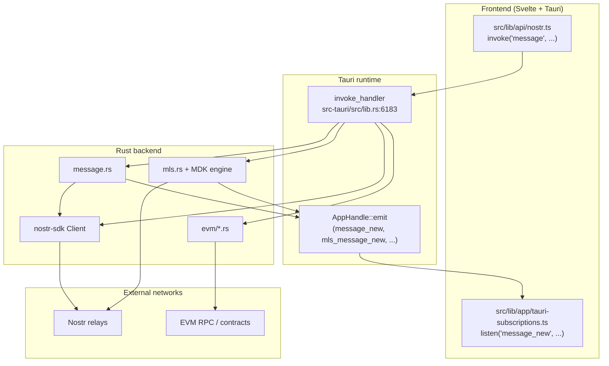
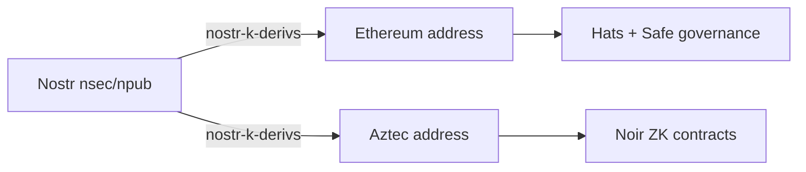
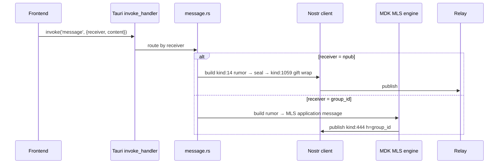

# Pacto Bot Architecture: A Deep, Practical Field Guide

> **Audience:** Developer / SRE / DevOps who wants to understand whether Pacto has a bot API today, and how one could be built without breaking its privacy model.  
> **Goal:** Map Pacto’s actual automation surfaces, explain why a Telegram-style Bot API does not exist, and give a concrete design path for a privacy-preserving Pacto bot.  
> **Scope:** Based on read-only inspection of `github.com/covenant-gov/pacto-app` and its subprojects, plus the upstream `VectorPrivacy/Vector` fork lineage, as of June 2026. Facts are cited to concrete files and NIPs; gaps are explicitly labeled as gaps.

---

## Table of Contents

1. [TL;DR: The Big Picture](#1-tldr-the-big-picture)
2. [Why Pacto Bot Architecture Is Relevant to Your App](#2-why-pacto-bot-architecture-is-relevant-to-your-app)
3. [Pacto’s Three Automation Surfaces (and What Is Missing)](#3-pactos-three-automation-surfaces-and-what-is-missing)
4. [Nostr & MLS: The Secret Sauce](#4-nostr--mls-the-secret-sauce)
5. [How Tauri Commands Map to Nostr/MLS](#5-how-tauri-commands-map-to-nostrmls)
6. [Receiving Updates: WebSocket Subscriptions vs Polling vs Tauri Events](#6-receiving-updates-websocket-subscriptions-vs-polling-vs-tauri-events)
7. [High-Level Pacto Architecture](#7-high-level-pacto-architecture)
8. [Data Directories, Identity, and Multi-Account Routing](#8-data-directories-identity-and-multi-account-routing)
9. [Chat Types: DMs vs MLS Squads](#9-chat-types-dms-vs-mls-squads)
10. [Updates, Sync, and Message Sequences](#10-updates-sync-and-message-sequences)
11. [Files, Media, and Blossom](#11-files-media-and-blossom)
12. [Push Notifications and Backend Events](#12-push-notifications-and-backend-events)
13. [Private DMs vs Group Chats](#13-private-dms-vs-group-chats)
14. [Bot Frameworks and Client Libraries](#14-bot-frameworks-and-client-libraries)
15. [Bot/Automation Feature List](#15-botautomation-feature-list)
16. [Scaling, Reliability, and SRE Patterns](#16-scaling-reliability-and-sre-patterns)
17. [Security Architecture and Threat Model](#17-security-architecture-and-threat-model)
18. [Known Gaps and What Not to Do](#18-known-gaps-and-what-not-to-do)
19. [Decision Matrix: What to Borrow for Your App](#19-decision-matrix-what-to-borrow-for-your-app)
20. [Reference Library: Repos, NIPs, and Concrete Files](#20-reference-library-repos-nips-and-concrete-files)

---

## 1. TL;DR: The Big Picture

Pacto is a **Tauri desktop/mobile app** with a Rust backend. It has **no productized bot API** today. All backend functions are exposed to the frontend webview as Tauri `invoke` commands, and backend-to-frontend events are emitted over Tauri’s event bus.



A bot therefore has three realistic shapes in Pacto:

| Shape | Where it runs | Key exposure | Availability |
|-------|---------------|--------------|--------------|
| **In-process plugin** | Inside the Pacto frontend | Same as user app | Only while app is open |
| **Local sidecar** | Separate process on the user’s machine | Daemon sees plaintext; no third-party server | While device is on |
| **Remote NIP-46 signer** *(NIP-46: Nostr Connect — remote signing protocol where a "bunker" holds the nsec and signs events on behalf of a client)* | Self-hosted bunker + bot server | Bunker holds key; bot sees plaintext; server IP visible | 24/7 if hosted |

> **Key takeaway:** Pacto’s “API” is the same surface its own UI uses. A first-class bot would need a headless authentication model, a public command/event transport, and a bot identity model — none of which exist in release builds today.

---

## 2. Why Pacto Bot Architecture Is Relevant to Your App

Pacto is interesting as a **reference architecture** because it combines three hard problems:

- **Metadata-minimal messaging** via Nostr NIP-59 gift wraps *(NIP-59: Gift Wraps — outer events that hide sender/recipient metadata from relays)* and NIP-44 encryption *(NIP-44: Encrypted Payloads — AES-256-GCM encryption for private message content)*.
- **End-to-end encrypted groups** via MLS over Nostr (NIP-EE-style `kind:444`/`kind:443`) *(NIP-EE: MLS Groups — Nostr adaptation of the IETF MLS standard for end-to-end encrypted group messaging)*.
- **On-chain, privacy-preserving governance and treasury** via EVM/Hats Protocol and Aztec Noir.

If you are building any of the following, Pacto’s choices are directly applicable:

- A privacy-first messenger with automation needs.
- A DAO/community tool where bots must read roles, proposals, or treasuries.
- An app that wants one identity root (one Nostr key → multiple chain addresses).
- A Nostr client that needs group chat with more than ~10 participants.

> **Evidence grade:** Public repo inspection and official NIPs. Pacto is pre-release; there are no published MAU/message-volume numbers.

---

## 3. Pacto’s Three Automation Surfaces (and What Is Missing)

### 3.1 Tauri command surface — the only production API

All Rust-to-frontend functionality is registered in one block:

- `src-tauri/src/lib.rs:6183–6387` — `invoke_handler(tauri::generate_handler![...])` lists ~100 commands.
- Frontend wrappers: `src/lib/api/nostr.ts`, `src/lib/wallet/backend-wallet.ts`.

These commands are **only reachable from the frontend webview**. There is no public HTTP, CLI, or WebSocket server for them in release builds.

### 3.2 Nostr relay subscription — the only external push channel

Because Pacto is a Nostr client, any bot can also act as a Nostr client:

- Subscribe to `kind:1059` gift wraps `#p`-tagged to the bot.
- Publish gift wraps, MLS group messages (`kind:444`), and Commons broadcasts.
- This bypasses Pacto’s Rust backend entirely, but it must speak the same protocols.

### 3.3 MCP bridge — debug-only, not a product API

Pacto includes `tauri-plugin-mcp-bridge = "0.7"` in `src-tauri/Cargo.toml:100`, but it is loaded only in debug desktop builds:

```rust
#[cfg(all(debug_assertions, desktop))]
{
    builder = builder.plugin(tauri_plugin_mcp_bridge::init());
}
```

Source: `src-tauri/src/lib.rs:6074–6078`.

The plugin exposes AI-debugging tools such as `execute_command`, `emit_event`, and `capture_native_screenshot`. It is **not permissioned** in `capabilities/default.json` and is compiled out of mobile and release builds. It is not a stable bot API.

### 3.4 What is missing

| Missing surface | Why it matters |
|-----------------|----------------|
| Public HTTP / WebSocket / CLI API | External bots cannot call Pacto functions. |
| Headless authentication | Unlock requires a password-derived `ENCRYPTION_KEY` or in-memory mnemonic. |
| External event stream | `message_new`, `mls_message_new`, etc. are emitted only into the webview. |
| Bot identity / permissions | The `bot` profile flag is read-only and behaviorally inert. |
| Dashboard/widget plugin model | Dashboard tabs are hardcoded Svelte components. |

Source: `PactoInternalsSpecialist` research fragment; concrete file references in §18.

---

## 4. Nostr & MLS: The Secret Sauce

### 4.1 DM stack

Pacto DMs use **NIP-59 gift wraps** over **NIP-44** encryption, following **NIP-17** semantics *(NIP-17: Private Direct Messages — the Nostr standard for end-to-end encrypted 1:1 messaging using gift wraps and seals)*:

| Layer | Kind | Content |
|-------|------|---------|
| **Rumor** | 14 (text), 15 (file), 7 (reaction), 30078 (typing) | Unsigned inner event. |
| **Seal** | 13 | Rumor encrypted with sender→recipient conversation key, signed by sender. |
| **Gift wrap** | 1059 | Seal encrypted with a fresh random wrapper key, `#p`-tagged to recipient, signed by one-time key. |

Key implications for bots:

- A bot must subscribe to `kind:1059` events whose `#p` equals its own pubkey.
- It must unwrap the outer gift wrap → decrypt the seal → read the unsigned rumor.
- The true author is hidden from relays; pubkey-based anti-spam does not work on the wrapper.
- Each recipient gets a separate gift wrap.

Sources: NIP-17; NIP-59; `docs/nostr/ARCHITECTURE.md`; `docs/messaging/OVERVIEW.md`.

### 4.2 Squad / MLS stack

Pacto squads are **MLS groups** over Nostr:

| Kind | Purpose |
|------|---------|
| 443 (`MlsWelcome`) | Delivered inside a `kind:1059` gift wrap; hands an MLS Welcome to the engine. |
| 444 (`MlsGroupMessage`) | Ephemeral group message; `h` tag = public wire group id. |
| 10051 | KeyPackage relay list (NIP-EE pattern). |

The MLS engine is `mdk_core` + `mdk_sqlite_storage`, facaded by `MlsService` in `src-tauri/src/mls.rs`. Group state is persisted in `vector-mls.db` per npub.

Sources: NIP-EE; `docs/mls/ARCHITECTURE.md`; `docs/messaging/OVERVIEW.md`.

### 4.3 Identity and key derivation

Pacto uses `nostr-k-derivs` to derive Ethereum and Aztec keys from a single Nostr nsec. This gives the app its embedded-wallet experience:

- One recovery phrase → one Nostr identity → multiple chain addresses.
- No separate wallet setup.

Source: `pacto_ecosystem_research.md`; `github.com/covenant-gov/nostr-k-derivs`.



---

## 5. How Tauri Commands Map to Nostr/MLS

The core send path is `message(receiver, content)` in `src-tauri/src/message.rs`:

1. If `receiver` starts with `npub1` → DM branch.
2. Otherwise `receiver` is a hex `group_id` → MLS branch.



Other relevant commands mapped to protocols:

| Command | Protocol action | Source file |
|---------|---------------|-------------|
| `fetch_messages` | Subscribe to `kind:1059` for self, unwrap, emit `message_new` | `lib.rs` |
| `create_mls_group` / `create_group_chat` | MLS group creation + publish group metadata | `mls.rs` |
| `accept_mls_welcome` | Process `kind:443` Welcome from gift wrap | `mls.rs`, `lib.rs` |
| `invite_member_to_group` | Fetch KeyPackage, build Welcome | `mls.rs` |
| `commons_publish_broadcast` | Publish `kind:30078` public broadcast | `commons.rs` |
| `wallet_build_and_send_transaction` | Sign and send EVM tx via alloy | `evm/wallet_ops.rs` |
| `list_treasury_proposals` | Read `pacto-gov` contracts via RPC | `evm/treasury_proposals_read.rs` |

Sources: `docs/messaging/OVERVIEW.md`; `docs/nostr/ARCHITECTURE.md`; `docs/mls/ARCHITECTURE.md`.

---

## 6. Receiving Updates: WebSocket Subscriptions vs Polling vs Tauri Events

### 6.1 Relay WebSocket subscription (dominant)

Pacto's `nostr-sdk` client opens WebSocket connections to relays and sends NIP-01 `REQ` filters *(NIP-01: Basic Protocol — the foundational Nostr spec defining event structure, relay communication, and subscription filters)*:

- DM: `kind:1059` `#p` = self pubkey.
- MLS: `kind:444` `#h` = joined group ids.

This is the same pattern `nostr-bot`, `rust-nostr`, and NDK use.

### 6.2 Polling / differential sync

A bot that cannot keep a WebSocket open can periodically query relays with `since` filters. For DMs this works; for MLS it is risky because `kind:444` events are **ephemeral** and relays may not store them. A pure polling bot can miss group state changes.

### 6.3 Tauri events (frontend-only)

Backend emits events such as:

- `message_new`
- `mls_message_new`
- `mls_invite_received`
- `dashboard_poll_replica_updated`
- `wallet_tx_request`

These are consumed only by the Svelte frontend via `src/lib/app/tauri-subscriptions.ts`. There is no external event stream.

### 6.4 Webhooks

Nostr relays do not natively push to HTTP webhooks. A webhook-style bot requires an intermediary watcher service that subscribes to relays and forwards events to an HTTP endpoint. That intermediary sees metadata and becomes a trusted party.

Source: `NostrBotPatternsSpecialist` research fragment; `docs/messaging/OVERVIEW.md`.

---

## 7. High-Level Pacto Architecture

```mermaid
flowchart TB
    subgraph Layer1["Layer 1: UI & Distribution"]
        A1["pacto-app (Svelte + Tauri)"]
        A2["pacto-download (JS portal)"]
    end

    subgraph Layer2["Layer 2: Runtime & Rust Backend"]
        B1["Tauri runtime"]
        B2["src-tauri/src/lib.rs\ninvoke_handler + events"]
        B3["message.rs, mls.rs, evm/*.rs"]
    end

    subgraph Layer3["Layer 3: Messaging Networks"]
        C1["Nostr relays"]
        C2["NIP-59 gift wraps (DMs)"]
        C3["NIP-EE / MLS kind:444 (squads)"]
        C4["Blossom media servers"]
    end

    subgraph Layer4["Layer 4: Governance & Security"]
        D1["pacto-gov / Nave Pirata\nHats + Safe"]
        D2["delegated-security-manager"]
        D3["pacto-squad-sponsor"]
    end

    subgraph Layer5["Layer 5: Privacy"]
        E1["pacto-aztec (Noir ZK)"]
    end

    subgraph Layer6["Layer 6: Bot runtime options"]
        F1["Local sidecar"]
        F2["Remote NIP-46 bunker"]
        F3["In-process plugin"]
    end

    A1 --> B1 --> B2 --> B3
    B3 --> C2 & C3 & C4 --> C1
    B3 --> D1 & D2 & D3
    D1 --> E1
    F1 & F2 & F3 -.-> C1
    F1 -.-> B2
```



---

## 8. Data Directories, Identity, and Multi-Account Routing

Pacto’s local state is **scoped to one active Nostr account** at a time:

```text
<app_data_dir>/<npub>/
  ├── vector.db          # app SQLite
  └── mls/
      └── vector-mls.db  # MDK MLS engine DB
```

Source: `docs/storage-layout/SQLITE_AND_FILES.md`; `docs/mls/ARCHITECTURE.md`.

Key globals in `src-tauri/src/lib.rs`:

- `MNEMONIC_SEED` (line ~114)
- `ENCRYPTION_KEY` (line ~111)
- `NOSTR_CLIENT` (line ~131)

`CURRENT_ACCOUNT` is a global `RwLock` in `src-tauri/src/account_manager.rs:372–411`. Switching accounts re-points the app but still supports only one active identity.

**Consequences for bots:**

- No concurrent multi-bot runtime on the same app instance.
- Headless operation requires a password-derived key or mnemonic in memory; there is no API-token path.
- MLS state is tied to the active account; switching does not fully re-point the MLS directory yet (`account_manager.rs:1299–1332` TODO).

---

## 9. Chat Types: DMs vs MLS Squads

The unified chat model is defined in `src-tauri/src/chat.rs`:

```rust
enum ChatType {
    DirectMessage,
    MlsGroup,
}
```

| Dimension | DM | MLS Squad |
|-----------|----|-----------|
| **Conversation id** | Other user’s `npub1…` | `group_id` hex |
| **Wire kind** | `1059` gift wrap | `444` group message |
| **Invite** | Direct gift wrap | `443` Welcome inside gift wrap |
| **Max practical size** | 1:1 (NIP-17 warns >10 is awkward) | Squad scale; MLS handles larger groups |
| **Metadata leak** | Minimal: only recipient `#p` visible | Public `h` tag reveals group existence |

Source: `docs/messaging/OVERVIEW.md`; `docs/nostr/ARCHITECTURE.md`.

---

## 10. Updates, Sync, and Message Sequences

### 10.1 DM sync

- `fetch_messages` requests `kind:1059` events for self since a stored cursor.
- Each gift wrap is unwrapped; inner DM rumor or `MlsWelcome` is routed.
- Dedup relies on DB + `wrapper_event_id`.

### 10.2 MLS sync

- Per-group cursor stored in `mls_event_cursors` (`docs/mls/ARCHITECTURE.md`).
- `sync_mls_groups_now` backfills `kind:444` history per group.
- `process_message` runs on a blocking thread because the MDK engine is not `Send`.

### 10.3 Ordering and gaps

Nostr does not provide a global sequence number. Clients must:

- Deduplicate by event `id`.
- Order by `created_at` + `id` tie-breaker.
- Close gaps by re-querying relays.

For MLS, NIP-EE specifies resolving Commit races by `created_at` then `id`. Group state is local; missing ephemeral `kind:444` events can leave a bot permanently out of sync.

Source: `docs/mls/ARCHITECTURE.md`; NIP-EE; `docs/messaging/OVERVIEW.md`.

---

## 11. Files, Media, and Blossom

Pacto uses **Blossom** for file upload/download, via the `nostr-blossom = "0.43.0"` crate declared in `src-tauri/Cargo.toml:26`.

- Attachments are referenced in rumors (`kind:15` for files).
- Blossom servers are separate from Nostr relays.
- Large files are chunked; thumbnails and blurhashes are generated locally.

Source: `src-tauri/Cargo.toml`; `src-tauri/src/blossom.rs` (per research fragment).

---

## 12. Push Notifications and Backend Events

- The app uses `tauri-plugin-notification = "2.3.1"` (`src-tauri/Cargo.toml`).
- Backend events are emitted with `AppHandle::emit` and consumed only by the frontend.
- There is **no external event stream** for a bot process.

To act on events, a bot must either:

1. Run inside the frontend process and listen to the same Tauri events.
2. Run as a separate Nostr client and subscribe to the same relays.

---

## 13. Private DMs vs Group Chats

### 13.1 DMs — strongest metadata privacy

NIP-59 gift wraps hide the true author and recipient metadata from relays:

- Random wrapper keys per event.
- Per-recipient fan-out.
- Jittered outer timestamps.
- No public group identifier.

Trade-off: **spam mitigation is hard**. Relays cannot rate-limit by pubkey on the wrapper. NIP-17 points to NIP-42 `AUTH` *(NIP-42: Relay Authentication — a client proves ownership of a pubkey to a relay, enabling access control for private relays)* as the mitigation.

### 13.2 MLS squads — strong content privacy, weaker metadata privacy

- Content is encrypted end-to-end inside the MLS group.
- But the public `h` tag on `kind:444` leaks that the group exists and which participants are subscribed.
- Welcome messages inside gift wraps share the DM’s metadata protections.

Source: NIP-17; NIP-59; NIP-EE; `NostrBotPatternsSpecialist` fragment.

---

## 14. Bot Frameworks and Client Libraries

### 14.1 Does Pacto reuse Vector’s `vector-sdk`?

**No.**

Pacto forked Vector’s repository scaffolding, but `src-tauri/Cargo.toml` does not depend on `vector-core`, `vector-sdk`, `vector-agent`, or `vector-cli`. Searches for `VectorBot`, `vector_sdk::`, `vector_core::`, and `InvitePolicy` returned no matches in `pacto-app/src-tauri/src`.

Vector’s groups are **Concord communities** with server-root keys and epoch rekeys; Pacto’s groups are **MLS squads**. The membership model, wire format, and governance differ.

Source: `VectorBotDeepDive` research fragment; `src-tauri/Cargo.toml`.

### 14.2 Existing Nostr bot libraries

| Library | Language | Notes |
|---------|----------|-------|
| `rust-nostr` / `nostr-sdk` | Rust | Full NIP-17/44/46/59/EE support. Pacto already uses `nostr-sdk 0.43`. |
| `nostr-bot` | Rust | Simple command-reaction framework; built for public `kind:1` bots. |
| NDK | TypeScript | Relay-pool subscriptions; NIP-17 would need manual unwrap. |

Source: `NostrBotPatternsSpecialist` fragment.

### 14.3 Recommended Pacto bot approach

Build a new crate/module (e.g. `crates/pacto-agent` or `src-tauri/src/agent/`) that wraps Pacto’s own backend, not Vector’s. Expose an MCP tool surface for local automation, or a NIP-46 bunker interface for remote signing.

---

## 15. Bot/Automation Feature List

Commands in `src-tauri/src/lib.rs:6183–6387` that are most relevant to automation:

| Area | Commands |
|------|----------|
| **Identity** | `login`, `login_with_recovery_phrase`, `create_account`, `get_current_account`, `list_all_accounts` |
| **DMs** | `message`, `file_message`, `react_to_message`, `edit_message`, `fetch_messages`, `get_chat_messages_paginated` |
| **MLS squads** | `create_group_chat`, `create_mls_group`, `list_mls_groups`, `list_pending_mls_welcomes`, `accept_mls_welcome`, `invite_member_to_group`, `get_mls_group_members` |
| **Polls** | `send_dashboard_poll_create`, `send_dashboard_poll_vote`, `list_dashboard_polls` |
| **Commons** | `commons_publish_broadcast`, `commons_fetch_broadcasts`, `commons_list_cached_broadcasts` |
| **Wallet** | `get_wallet_summary`, `wallet_build_and_send_transaction`, `sign_evm_hash`, `list_evm_accounts` |
| **Governance** | `list_treasury_proposals`, `treasury_proposal_has_voted`, `get_hats_tree`, `get_member_hat_wearers`, `deploy_nave_pirata_for_parent`, `deploy_squad_admin_for_parent` |

> All of these are currently reachable only through the Tauri frontend in release builds.

---

## 16. Scaling, Reliability, and SRE Patterns

### 16.1 Scale anchors

Pacto has no published production scale metrics. Treat the following as architectural constraints, not benchmarks:

- Single-tenant globals: one active account per process.
- SQLite-backed local state.
- Relay-dependent availability.

### 16.2 Reliability for bots

| Concern | Pattern |
|---------|---------|
| **Availability** | For 24/7 bots, use a self-hosted NIP-46 bunker or a local sidecar on an always-on device. |
| **Persistence** | MLS state must be backed up; losing `vector-mls.db` loses group membership. |
| **Replay / gaps** | Re-query relays with `since` cursors; dedup by event `id`. |
| **Multi-instance** | Not supported by the current global state model. |

---

## 17. Security Architecture and Threat Model

### 17.1 Design goals

- **No KYC**: pseudonymous by design.
- **No central server**: relays are untrusted infrastructure.
- **E2EE DMs and MLS groups**.
- **On-chain governance** for roles and treasury.

### 17.2 Bot-specific threats

| Threat | Server-side bot | Client-side / local sidecar |
|--------|-----------------|-------------------------------|
| **Key material** | Holds or can request signing via NIP-46; bunker still holds root key. | Key stays on user device. |
| **Plaintext exposure** | Server decrypts DMs/MLS messages to act. | Plaintext stays on device. |
| **Network metadata** | Relay sees server IP and uptime pattern. | Relay sees user IP only. |
| **Timing/presence leak** | Always-on server leaks activity patterns. | Activity tied to user device. |

### 17.3 Signing models

- **Hold nsec directly**: highest convenience, highest risk.
- **NIP-46 bunker**: root key never in bot process, but bunker operator is trusted.
- **NIP-26 delegation** *(NIP-26: Delegated Event Signing — allows one key to sign on behalf of another; explicitly "unrecommended" by the NIP authors)*: explicitly `unrecommended`; avoid for new Pacto work.

Source: NIP-46; NIP-26; `NostrBotPatternsSpecialist` fragment.

---

## 18. Known Gaps and What Not to Do

| Gap | Evidence | Consequence |
|-----|----------|-------------|
| **No external/authenticated API in release** | `src-tauri/src/main.rs` is one line; no server crates in `Cargo.toml`. | Bots cannot call Pacto from another process or network. |
| **MCP bridge is debug-only and unpermissioned** | `lib.rs:6074–6078`, `Cargo.toml:100`, `capabilities/default.json`. | Cannot be shipped as a product API. |
| **`bot` profile flag is passive** | `account_manager.rs:43` schema has `bot INTEGER`; `profile.rs:169–186` parses it; nothing consumes it. | No bot identity model, permissions, or UI treatment. |
| **No headless auth / API tokens** | `crypto.rs:85–122`, `lib.rs:111–128`. | Unattended automation requires password/mnemonic in memory. |
| **No external event stream** | Events emitted only to webview (`src/lib/app/tauri-subscriptions.ts`). | External bots cannot react to new messages. |
| **Global account singleton blocks multi-bot** | `account_manager.rs:371–411`, `lib.rs:114–147`. | One process = one active identity. |
| **No dashboard/widget plugin model** | `ParentDashboard.svelte:62–68` hardcodes views. | New automation UI requires editing Svelte. |
| **Wallet/EVM actions assume UI context** | `evm/wallet_ops.rs`, `backend-wallet.ts`. | No headless raw-tx or per-bot signer API. |
| **Ad-hoc automation event schemas** | `dashboard_poll.rs`, `commons.rs`, `lib/announcements.ts`. | No machine-readable contract or versioning. |

### What not to do

1. **Do not reuse `vector-sdk` or `vector-core` directly.** Protocol mismatch and global-state collision make it unsafe.
2. **Do not use NIP-26 delegation** for new work; the NIP is `unrecommended`.
3. **Do not run a pure relay-polling remote bot** for private-message or MLS automation; it maximizes plaintext and metadata exposure.
4. **Do not expose the debug MCP bridge in release builds** without redesigning authentication and permissions.

---

## 19. Decision Matrix: What to Borrow for Your App

| If your app needs… | Borrow from Pacto | Avoid |
|--------------------|-------------------|-------|
| Metadata-minimal 1:1 DMs | NIP-59 gift wraps + NIP-44 + `kind:10050` DM relay list. | Plain `kind:1` public mentions for private bot commands. |
| Private group chat | MLS over Nostr (`kind:444`/`443`) with local per-device state. | Trying to scale NIP-17 beyond ~10 participants. |
| One identity, many chains | BIP32/SLIP derivation from a Nostr seed (`nostr-k-derivs` pattern). | Separate wallet onboarding per network. |
| Governable treasury | Hats Protocol + Gnosis Safe + Zodiac modules (`pacto-gov`). | Admin-only multisigs without role separation. |
| Private voting/payments | Aztec Noir ZK contracts (`pacto-aztec`). | Public on-chain voting for sensitive decisions. |
| Bot automation | Local sidecar + NIP-46 self-hosted bunker. | Shared SaaS bunkers or NIP-26 delegation. |
| Desktop app with Rust backend | Tauri 2 + `nostr-sdk` + SQLite. | Shipping debug-only plugins as product APIs. |

---

## 20. Reference Library: Repos, NIPs, and Concrete Files

### Repositories

| Repository | Language | Role |
|------------|----------|------|
| `github.com/covenant-gov/pacto-app` | Rust / Tauri | Main desktop/mobile app. |
| `github.com/covenant-gov/pacto-gov` | Solidity | Nave Pirata governance (Hats + Safe). |
| `github.com/covenant-gov/pacto-aztec` | Noir / TypeScript | Private voting/payments on Aztec. |
| `github.com/covenant-gov/nostr-k-derivs` | Rust | Nostr → Ethereum/Aztec key derivation. |
| `github.com/covenant-gov/pacto-squad-sponsor` | Solidity | Gas fee sponsorship for squads. |
| `github.com/covenant-gov/delegated-security-manager` | Solidity | Multi-layer Hats security module. |
| `github.com/VectorPrivacy/Vector` | Rust | Upstream fork; `vector-sdk`/`vector-agent` reference only. |

### NIPs

| NIP | Topic | Relevance |
|-----|-------|-----------|
| [NIP-17](https://github.com/nostr-protocol/nips/blob/master/17.md) | Private direct messages | DM rumor/gift-wrap mechanics. |
| [NIP-44](https://github.com/nostr-protocol/nips/blob/master/44.md) | Encrypted payloads | Conversation-key encryption for seals. |
| [NIP-59](https://github.com/nostr-protocol/nips/blob/master/59.md) | Gift wraps | Metadata hiding, random wrapper keys, spam mitigations. |
| [NIP-46](https://github.com/nostr-protocol/nips/blob/master/46.md) | Nostr Connect / bunker | Remote signing without holding root nsec. |
| [NIP-26](https://github.com/nostr-protocol/nips/blob/master/26.md) | Delegated signing | Explicitly `unrecommended`; do not use. |
| [NIP-EE](https://github.com/nostr-protocol/nips/blob/master/EE.md) | MLS groups | `kind:444` group messages, `kind:443` welcomes. |
| [NIP-42](https://github.com/nostr-protocol/nips/blob/master/42.md) | Relay authentication | Recommended for gift-wrap access control. |
| [NIP-90](https://github.com/nostr-protocol/nips/blob/master/90.md) | Data Vending Machines | Pattern for public compute bots, not used by Pacto today. |

### Concrete files in Pacto

| File | Why it matters |
|------|----------------|
| `src-tauri/src/lib.rs:6183–6387` | Tauri `invoke_handler`; the only production command surface. |
| `src-tauri/src/lib.rs:6074–6078` | Debug-only MCP bridge loading. |
| `src-tauri/src/message.rs` | DM/MLS send routing. |
| `src-tauri/src/mls.rs` | MLS engine facade (`MlsService`). |
| `src-tauri/src/account_manager.rs:43` | `profiles.bot` schema field. |
| `src-tauri/src/profile.rs:169–186` | Parsing of the `bot` custom metadata field. |
| `src-tauri/src/chat.rs` | `ChatType::DirectMessage` / `MlsGroup`. |
| `src-tauri/Cargo.toml:25–27,100` | `nostr-sdk 0.43`, `nostr-blossom`, `tauri-plugin-mcp-bridge 0.7`. |
| `docs/messaging/OVERVIEW.md` | DM vs MLS command/event mapping. |
| `docs/nostr/ARCHITECTURE.md` | Nostr transport and kinds. |
| `docs/mls/ARCHITECTURE.md` | MLS engine and storage layout. |
| `docs/wallet/PACTO_GOV.md` | Governance contract source location. |

---

## Appendix A: Comprehensive Terminology & Acronym Reference

### A.1 Nostr Protocol

| Term | Expansion | Meaning |
|------|-----------|---------|
| **Nostr** | Notes and Other Stuff Transmitted by Relays | Decentralized, censorship-resistant social protocol. No central server; clients publish signed events to relays. |
| **NIP** | Nostr Implementation Possibility | A numbered specification document defining a protocol feature (e.g., NIP-17 for private DMs). |
| **nsec** | Nostr Secret Key | Private key in bech32 format (`nsec1…`). Used to sign events. Never shared. |
| **npub** | Nostr Public Key | Public key in bech32 format (`npub1…`). Used as a user's identity/address. |
| **Relay** | — | A WebSocket server that stores and forwards Nostr events. Anyone can run one. |
| **Event** | — | A signed JSON object with `kind`, `pubkey`, `content`, `tags`, `sig`. The fundamental unit of Nostr data. |
| **Kind** | — | An integer classifying an event's purpose (e.g., `kind:0` = profile metadata, `kind:1` = public note, `kind:1059` = gift wrap). |
| **Tag** | — | A key-value pair in an event's `tags` array (e.g., `["p", "<pubkey>"]` tags a recipient). |
| **Subscription** | — | A client's request to a relay for events matching a filter (kinds, authors, time range). |
| **Gift wrap** | NIP-59 | An outer event (`kind:1059`) that encrypts an inner event, hiding sender, recipient, and content metadata from relays. |
| **Seal** | NIP-44 | AES-256-GCM encrypted payload inside a gift wrap. Protects message content. |
| **Rumor** | — | An inner event (kinds 14/15/7/30078) inside a gift wrap. The actual message payload before wrapping. |
| **AUTH** | NIP-42 | Relay authentication. A client proves ownership of a pubkey to a relay for access control. |
| **DVM** | Data Vending Machine (NIP-90) | A public compute bot on Nostr. Publishes capabilities (`kind:31990`), accepts jobs (`kind:5xxx`), returns results (`kind:6xxx`). |
| **Bunker** | NIP-46 Remote Signer | A service that holds a Nostr nsec and signs events on behalf of a client. The client never sees the raw key. |
| **Nostr Connect** | NIP-46 | The protocol for remote signing between a client and a bunker. |
| **Zap** | NIP-57 | A Lightning Network payment attached to a Nostr event (like a "tip" or "like" with money). |
| **Parameterized Replaceable Event** | NIP-33 | An event identified by `(kind, pubkey, d-tag)` where newer events replace older ones with the same `d` tag. Used for Commons broadcasts. |
| **KeyPackage** | NIP-EE | An MLS credential published as `kind:10051`. Contains the public key material needed to add a member to an MLS group. |

### A.2 MLS (Messaging Layer Security)

| Term | Expansion | Meaning |
|------|-----------|---------|
| **MLS** | Messaging Layer Security | IETF standard (RFC 9420) for end-to-end encrypted group messaging. Replaces Signal's Sender Key protocol for groups. |
| **Ratchet Tree** | — | The core MLS data structure. A binary tree where each leaf is a member's key and each node is a derived key. Every member maintains a local copy. |
| **Epoch** | — | A version of the group state. Increments on every Commit. All members in the same epoch share the same encryption keys. |
| **Commit** | — | An MLS message that changes group state: adding/removing members, updating keys. Advances the epoch. |
| **Welcome** | — | An MLS message (`kind:443`) sent to a new member containing the current ratchet tree and epoch secrets. Encrypted to the new member's KeyPackage. |
| **Application Message** | — | An MLS message (`kind:444`) containing actual chat content. Can only be decrypted by current epoch members. |
| **Proposal** | — | A request to change group state (add, remove, update). Must be committed by another member to take effect. |
| **Leaf** | — | A position in the ratchet tree assigned to one member/device. Each device gets its own leaf. |
| **Leaf Index** | — | The numeric position of a member's leaf in the ratchet tree. |
| **Group ID** | — | A unique identifier for an MLS group. In Pacto, derived from the squad's on-chain identity and represented as a hex string in `#h` tags. |
| **MDK** | — | The Rust crate (`mdk_core` + `mdk_sqlite_storage`) that implements the MLS protocol. Pacto wraps this in `mls.rs`. |
| **Non-Send Engine** | — | MDK's engine is not `Send` (Rust trait). All operations must run on a single blocking thread via `spawn_blocking`. |
| **KeyPackage Rotation** | — | Periodically publishing a new `kind:10051` event so other members can add you to groups with fresh key material. |

### A.3 Blockchain & Governance

| Term | Expansion | Meaning |
|------|-----------|---------|
| **EVM** | Ethereum Virtual Machine | The runtime for smart contracts on Ethereum and compatible chains. Pacto's governance contracts run on EVM. |
| **Aztec** | — | A privacy-focused blockchain using zero-knowledge proofs. Pacto uses it for private voting and payments. |
| **ZK / ZKP** | Zero-Knowledge Proof | A cryptographic method to prove a statement is true without revealing the underlying data. Used by Aztec for private transactions. |
| **Noir** | — | A domain-specific language for writing ZK circuits. Pacto's `pacto-aztec` contracts are written in Noir. |
| **Hats Protocol** | — | An on-chain role management system. "Hats" are roles (NFTs) that can be worn, transferred, and revoked. Pacto uses Hats for squad role trees. |
| **Hat** | — | A role token in Hats Protocol. Each hat has an ID, an admin (parent hat), and wearers (addresses). |
| **Safe** | Gnosis Safe (now Safe) | A multi-signature smart contract wallet. Pacto squads deploy a Safe as their treasury. |
| **Zodiac** | — | A modular framework for adding governance modules (like Pacto's TreasuryAuthority) to Safe wallets. |
| **Nave Pirata** | "Pirate Ship" (Spanish) | Pacto's governance system. A Hats-governed mesh of role contracts atop a Safe, deployed atomically by `NavePirataFactory`. |
| **Quartermaster** | — | Pacto contract managing the timelocked crew roster. Admin of the crew hat. |
| **MutinyModule** | — | Pacto contract enabling a 51% crew vote to replace the captain. |
| **TreasuryAuthority** | — | Pacto contract implementing two-body democracy: crew vote + captain approval required for spending. |
| **SquadAdmin** | — | Pacto contract for captain-gated on-chain executor roles. |
| **NavePirataFactory** | — | Pacto contract that atomically deploys a full squad: Safe + hat tree + governance modules + wiring. |
| **AssetRescuer** | — | Pacto contract for permissionless sweep of accidentally-received assets from squad contracts. |
| **Squad Sponsor** | `pacto-squad-sponsor` | Pacto contract that lets squads subsidize gas fees for members. |
| **Gas** | — | The fee paid in ETH to execute a transaction on an EVM chain. |
| **RPC** | Remote Procedure Call | The interface for querying and submitting transactions to a blockchain node (e.g., via `eth_call`, `eth_sendTransaction`). |
| **Alloy** | — | Rust library for EVM interaction. Pacto uses it for contract calls, transaction building, and ABI encoding. |
| **sol!** | — | Alloy macro that generates Rust bindings from Solidity ABI/bytecode at compile time. |
| **nostr-k-derivs** | — | Pacto crate that derives Ethereum and Aztec keys from a Nostr nsec using BIP-32. |
| **BIP-32** | Bitcoin Improvement Proposal 32 | Hierarchical deterministic key derivation. Used to derive child keys from a master seed. |
| **BIP-39** | Bitcoin Improvement Proposal 39 | Mnemonic seed phrase standard. 12/24 words → master seed. |
| **KYC** | Know Your Customer | Identity verification (passport, ID). Pacto deliberately avoids this. |
| **DAO** | Decentralized Autonomous Organization | A group governed by smart contract code instead of traditional hierarchy. |

### A.4 Pacto Application

| Term | Expansion | Meaning |
|------|-----------|---------|
| **Pacto** | — | The application: a private, censorship-resistant, governable community platform. |
| **Squad** | — | A private community hub in Pacto (like a Discord server). Backed by an MLS group + on-chain governance. |
| **Network** | — | A group of squads that coordinate across organizational boundaries. Not yet implemented. |
| **Commons** | — | Pacto's public discovery feed. Uses `kind:30078` parameterized replaceable events with time-bounded broadcasts. |
| **Dashboard Poll** | — | A poll created inside an MLS squad, synced via `kind:30078` events. |
| **Tauri** | — | Framework for building desktop apps with Rust backends and web frontends. Pacto uses Tauri 2.x. |
| **Svelte** | — | Pacto's frontend framework. A compiled UI framework (not a runtime library like React). |
| **lib.rs** | — | Pacto's main Rust file (~282K lines). Registers all Tauri commands, manages the Nostr client, and runs the event loop. |
| **ChatState** | — | Pacto's global application state struct. Holds the Nostr client, MLS service, DB pool, and account manager. |
| **Account Manager** | — | Pacto module (`account_manager.rs`) that manages multiple Nostr identities, each with its own SQLite database and profile directory. |
| **vector.db** | — | Pacto's SQLite database file (name inherited from Vector). Stores chats, messages, profiles, MLS state, and EVM accounts. |
| **vector-mls.db** | — | Per-identity SQLite database for MLS group state (ratchet tree, epochs, key packages). |
| **ENCRYPTION_KEY** | — | A `OnceCell` in `lib.rs` holding the derived encryption key for local data. Derived from the user's password via Argon2. |
| **Bot Profile Flag** | — | An `INTEGER` column (`profiles.bot`) in Pacto's SQLite schema. Set to `1` for bot identities. Read at `db.rs:101`, set at `db.rs:128`, synced from `kind:0` metadata at `profile.rs:187`. |

### A.5 Bot Architecture

| Term | Expansion | Meaning |
|------|-----------|---------|
| **Agent** | — | A Pacto bot. A Nostr identity that receives DMs, joins MLS squads, and performs automated actions. |
| **Sidecar** | — | A separate process running alongside Pacto on the same machine. Communicates via Unix socket or localhost HTTP. |
| **Transport** | — | The I/O layer between a bot and the outside world. Options: Tauri events (in-process), Unix socket (local), Nostr relay (remote). |
| **Capability** | — | A declared permission that a bot can perform (e.g., `ReadMessages`, `SignTransactions`). Users grant capabilities explicitly. |
| **Handler** | — | A function or struct that processes a specific type of event or command. Registered with the agent's dispatcher. |
| **MCP** | Model Context Protocol | A protocol for AI agents to interact with external tools. Vector's `vector-agent` is an MCP server. |
| **ClientManager** | — | A component that multiplexes multiple bot identities onto a single `nostr-sdk` Client or TDLib instance. |
| **Webhook** | — | An HTTP callback: the platform POSTs events to a URL you control. Used by Telegram and Discord; proposed for Pacto Phase 3. |
| **Long-polling** | — | A client repeatedly requests updates from a server, which holds the connection open until data is available. Used by Telegram's `getUpdates`. |
| **Idempotency** | — | The property that processing the same event twice produces the same result. Critical for bot reliability since relays may redeliver events. |
| **Cursor** | — | A position marker in an event stream. Used to track which events have been processed and detect gaps. |
| **Gap Recovery** | — | Detecting and filling missing events in a sequence. For MLS, may require re-fetching Commits or re-invite if gaps are too large. |

### A.6 Cryptography & Security

| Term | Expansion | Meaning |
|------|-----------|---------|
| **E2EE** | End-to-End Encryption | Only the sender and intended recipient(s) can read the message. The server/relay cannot decrypt. |
| **PFS** | Perfect Forward Secrecy | Compromising a long-term key does not compromise past session keys. MLS provides PFS via epoch rekeys. |
| **AES-256-GCM** | Advanced Encryption Standard (256-bit, Galois/Counter Mode) | Authenticated encryption used for Pacto's attachment encryption and NIP-44 seals. |
| **Argon2** | — | Memory-hard password hashing function. Pacto uses Argon2 to derive the `ENCRYPTION_KEY` from the user's password. |
| **DH** | Diffie-Hellman | Key exchange protocol. Used in MLS for initial key agreement and in MTProto for Telegram's auth keys. |
| **Bech32** | — | A human-readable encoding for binary data. Nostr keys use bech32 with prefixes `nsec` (private) and `npub` (public). |
| **TLS 1.3** | Transport Layer Security 1.3 | Standard protocol for encrypted network connections. Used for relay WebSocket connections and webhook HTTPS. |
| **TEE** | Trusted Execution Environment | Hardware-enforced isolated compute (e.g., Intel SGX, AWS Nitro). Future possibility for bots to process data without the operator seeing plaintext. |
| **Homomorphic Encryption** | — | Computation on encrypted data without decryption. Research-grade; not practical for Pacto bots today. |

### A.7 Platform Comparisons

| Term | Expansion | Meaning |
|------|-----------|---------|
| **MTProto** | Mobile Telegram Protocol | Telegram's custom binary protocol for client-server communication. Bots don't use it directly; the Bot API server translates REST to MTProto. |
| **TDLib** | Telegram Database Library | C++ library that implements MTProto. Used by Telegram's Bot API server to act as a Telegram client. |
| **BotFather** | — | Telegram's bot creation and management bot. Generates bot tokens. |
| **Gateway** | Discord Gateway | Discord's WebSocket API for real-time event delivery to bots. |
| **OAuth2** | Open Authorization 2.0 | Standard for delegated authorization. Discord/Slack use it for bot permission scopes. |
| **Slash Command** | — | A registered command (e.g., `/poll`) that users invoke in chat. Discord/Slack register these globally; Pacto would use Commons or profile metadata. |
| **Concord** | — | Vector's custom group protocol. Server-root key cryptography, per-channel keys, signed rosters. Replaced by MLS in Pacto. |
| **WebXDC** | — | Vector's mini-app runtime. In-chat HTML5 apps with peer-to-peer real-time channels via Iroh. Not present in Pacto. |

### A.8 General Software

| Term | Expansion | Meaning |
|------|-----------|---------|
| **Crate** | — | A Rust package. The unit of compilation and dependency in Cargo. |
| **Cargo** | — | Rust's build system and package manager. |
| **Workspace** | — | A Cargo feature for managing multiple related crates together. Pacto and Vector both use workspaces. |
| **FFI** | Foreign Function Interface | Calling code written in one language from another. Proposed for TypeScript/Python bot SDKs wrapping the Rust core. |
| **SQLite** | — | Embedded relational database. Pacto uses it for local state (chats, messages, profiles, MLS, EVM accounts). |
| **Tokio** | — | Rust's async runtime. Pacto uses it for all async I/O (Nostr relay connections, RPC calls, file operations). |
| **spawn_blocking** | — | Tokio function that runs CPU-bound or blocking code on a dedicated thread pool. Required for MDK engine operations. |
| **Arc** | Atomically Reference Counted | Rust smart pointer for shared ownership across threads. Pacto wraps the MDK engine in `Arc<MDK<...>>`. |
| **Mutex** | Mutual Exclusion | Synchronization primitive ensuring only one thread accesses data at a time. Used for shared state in bot handlers. |
| **axum / actix-web** | — | Rust HTTP frameworks. Proposed for the `pacto-bot-api` server in Phase 3. |
| **VPS** | Virtual Private Server | A rented virtual machine. Common hosting option for self-hosted bots. |
| **CI** | Continuous Integration | Automated build/test on every commit. Pacto uses GitHub Actions. |
| **CD** | Continuous Deployment | Automated release on every merge. |

---

## Appendix B: NIP Quick Reference

| NIP | Name | Kind(s) | Bot Relevance |
|-----|------|---------|---------------|
| NIP-01 | Basic Protocol | 0, 1 | Foundation; all bots use this |
| NIP-06 | Key Derivation | — | Bot key generation from mnemonic |
| NIP-17 | Private DMs | 14, 15, 1059 | Bot DM transport |
| NIP-33 | Parameterized Replaceable Events | 30078 | Commons broadcasts, bot profiles |
| NIP-42 | AUTH | 22242 | Relay access control for bot relays |
| NIP-44 | Encrypted Payloads | — | Seal encryption for DMs |
| NIP-46 | Nostr Connect | 24133 | Remote signing for bot keys |
| NIP-57 | Zaps | 9734, 9735 | Bot monetization (optional) |
| NIP-59 | Gift Wraps | 1059 | Metadata protection for bot DMs |
| NIP-EE | MLS Groups | 443, 444, 10051 | Bot group participation |
| NIP-90 | Data Vending Machines | 31990, 5xxx, 6xxx | Public bot services |

---

## Appendix C: Pacto Contract Quick Reference

| Contract | Repo | Role |
|----------|------|------|
| `Quartermaster` | `pacto-gov` | Timelocked crew roster; admin of crew hat |
| `MutinyModule` | `pacto-gov` | 51% crew vote to replace captain |
| `TreasuryAuthority` | `pacto-gov` | Two-body democracy: crew vote + captain approval for spending |
| `SquadAdmin` | `pacto-gov` | Captain-gated on-chain executor roles |
| `NavePirataFactory` | `pacto-gov` | Atomic one-shot squad deployment |
| `AssetRescuer` | `pacto-gov` | Permissionless sweep of accidental assets |
| `SquadSponsor` | `pacto-squad-sponsor` | Gas fee sponsorship for squad members |
| `DelegatedSecurityManager` | `delegated-security-manager` | Multi-layer role-based access control |
| `PrivateVoting` | `pacto-aztec` | ZK private voting (Noir) |
| `PrivatePayments` | `pacto-aztec` | ZK shielded transfers (Noir) |
| `ContributorPool` | `contributor-pool` (ARCHIVED) | Staking pool for OSS development payouts |

---

## Appendix D: Key File Reference

| File | Size | Purpose |
|------|------|---------|
| `src-tauri/Cargo.toml` | — | All Rust dependencies; entry point for understanding the crate graph |
| `src-tauri/src/lib.rs` | ~282K | Main app: Tauri command registration, Nostr client, event loop |
| `src-tauri/src/mls.rs` | ~91K | MLS engine facade: `MlsService`, group lifecycle, key packages |
| `src-tauri/src/message.rs` | ~117K | DM/MLS send routing, rumor construction, gift wrap pipeline |
| `src-tauri/src/db.rs` | ~156K | SQLite operations: events, chats, profiles, MLS, EVM |
| `src-tauri/src/account_manager.rs` | ~52K | Multi-account management; `bot` flag schema |
| `src-tauri/src/commons.rs` | ~31K | Commons broadcast publish/fetch/validate |
| `src-tauri/src/crypto.rs` | ~7.5K | Encryption key derivation, AES-256-GCM, Argon2 |
| `src-tauri/src/rumor.rs` | — | Rumor event processing pipeline |
| `src-tauri/src/evm/mod.rs` | — | EVM module root; re-exports all submodules |
| `src-tauri/src/evm/wallet_ops.rs` | ~15K | Transaction building and signing |
| `src-tauri/src/evm/nave_pirata_deploy.rs` | ~8K | One-shot squad deployment |
| `src-tauri/src/evm/treasury_proposals_read.rs` | ~5K | Read treasury proposals from chain |
| `src-tauri/src/evm/hats_read.rs` | ~5K | Read Hats Protocol state |
| `src-tauri/src/profile.rs` | ~29K | Profile parsing; `bot` custom field extraction |
| `src-tauri/src/dashboard_poll.rs` | ~17K | Poll create/vote/sync via MLS |
| `docs/messaging/OVERVIEW.md` | — | High-level messaging architecture |
| `docs/mls/ARCHITECTURE.md` | — | MLS integration design |
| `docs/nostr/ARCHITECTURE.md` | — | Nostr relay and event architecture |
| `docs/wallet/PACTO_GOV.md` | — | Governance contract integration |
| `docs/storage-layout/SQLITE_AND_FILES.md` | — | Database schema and file layout |
---

*Document version: 2026-06-24. Synthesized from `pacto_ecosystem_research.md`, the `PactoInternalsSpecialist`, `VectorBotDeepDive`, and `NostrBotPatternsSpecialist` research fragments, plus direct reads of `github.com/covenant-gov/pacto-app`.*
