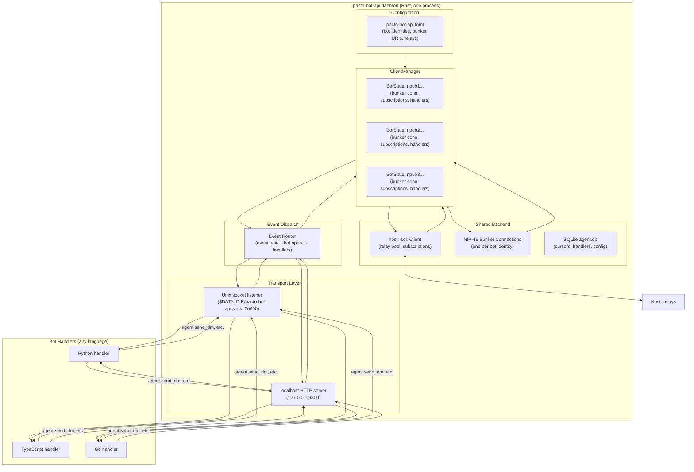
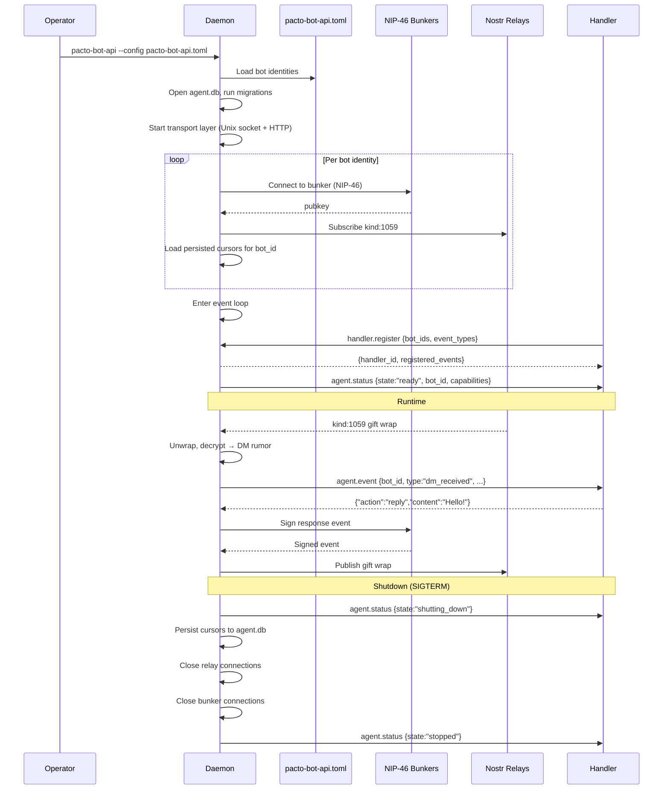

## Summary

Build `pacto-bot-api` — a standalone Rust daemon that multiplexes multiple Pacto bot identities onto a single shared backend (nostr-sdk, MDK MLS engine, alloy RPC, SQLite) and exposes a language-agnostic JSON-RPC 2.0 API over Unix socket and localhost HTTP. Bot developers write handlers in any language; the daemon owns all heavy infrastructure.

## Problem Frame

Pacto has no bot API. The three bot shapes identified in the architecture research (in-process plugin, local sidecar, remote NIP-46 bunker) all require each bot to duplicate the entire Pacto backend — nostr-sdk Client, MDK MLS engine, alloy RPC connections, SQLite database. Three bots = three copies of the stack (~600–1,200 MB). The core-modified approach eliminates duplication but locks handlers into Pacto's process lifecycle and Rust/FFI.

The daemon-first approach (architecture doc §7.9) solves both: one copy of the backend amortized over all bots, language-agnostic handlers over JSON-RPC, independent lifecycle, zero core changes to Pacto. This is the Telegram `telegram-bot-api` model adapted for decentralization — each bot operator runs their own daemon.

## Requirements

### API surface

- R1. The daemon exposes a JSON-RPC 2.0 API over a Unix domain socket (`$PACT_DATA_DIR/pacto-bot-api.sock`) with `0o600` permissions.
- R2. The daemon exposes the same JSON-RPC 2.0 API over localhost HTTP (`127.0.0.1:9800`), bound to loopback only. The HTTP transport requires an `X-Pacto-Bot-Secret` header on every request, generated on first run and stored with `0o600` permissions. The HTTP transport is disabled by default; enable with `--enable-http`.
- R3. The API uses newline-delimited JSON frames (one JSON-RPC message per line, `\n` terminated). No length prefix. Maximum frame size is 1 MB; connections sending larger frames are dropped.
- R4. The API supports the full method catalog defined in the architecture doc §7.7.4, adapted for daemon→handler direction (see High-Level Technical Design).

### Bot identity and key management

- R5. The daemon manages multiple bot identities via a `ClientManager`. Each bot is a separate Nostr identity with its own npub, MLS device leaf, and capability set. The `ClientManager` maintains a bidirectional `bot_id` ↔ `npub` mapping for routing.
- R6. The daemon supports three signing backends per bot identity: (a) **local test key** — nsec hex in config or `PACT_BOT_NSEC` env var, for early iteration; (b) **local NIP-46 bunker** — a bunker on the same machine, to prove the remote-signing path; (c) **production NIP-46 bunker** — a remote bunker. The daemon logs a warning when a local test key is in use. For bunker backends, the daemon verifies the bunker's pubkey matches the configured npub at connection time and fails hard on mismatch. The `nsec` backend uses `zeroize` to clear key material from memory on drop. Production bunker URIs must use `wss://` (not `ws://`).
- R7. Bot identities are configured via a TOML config file (`pacto-bot-api.toml`) listing each bot's npub, signing backend (one of `nsec`, `bunker_local`, `bunker_remote`), relay list, and capabilities. `bot_id` values must be unique within the config; duplicate `bot_id` is a validation error.

### Bot lifecycle: creation, identification, and reuse

- R10. Bot state (event cursors, handler registrations, capability grants) is exportable as a JSON file via `pacto-bot-admin export <bot_id>`. A bot can be moved to a new daemon instance by copying the config entry and importing the state file via `pacto-bot-admin import <bot_id> <state.json>`. The nsec stays with the bunker; only daemon-local state travels. The admin CLI refuses to operate if the daemon is running (detected via lock file).
- R11. The daemon never creates or deletes bot identities. It only manages bots that already exist in its config file. Bot creation and deletion are admin operations, not runtime operations.

### Messaging

- R12. The daemon sends and receives NIP-17/44/59 DMs (gift wrap pipeline) for each registered bot identity.
- R13. The daemon subscribes to `kind:1059` gift wraps `#p`-tagged to each bot's npub, unwraps and decrypts them, and forwards the decrypted rumor to registered handlers as `agent.event` notifications.
- R14. Handlers send DM replies via `agent.send_dm` notifications to the daemon. The daemon encrypts, wraps, and publishes the gift wrap. The daemon verifies that the calling handler is authorized for the specified `bot_id` on every `agent.send_dm`, `agent.set_profile`, and `agent.error` call — not just at registration time.

### Handler model

- R15. Handlers connect to the daemon and register via a `handler.register` JSON-RPC request, declaring which event types they handle and which bot identities they serve. The daemon assigns a server-generated `handler_id` (UUIDv4) on successful registration; the handler_id is not client-provided.
- R16. The daemon dispatches events to registered handlers based on event type and bot identity. A handler receives only events for bot identities it registered for. The daemon enforces per-call capability checks: every mutating notification (`agent.send_dm`, `agent.set_profile`, `agent.error`) is rejected if the handler's registration does not include the required capability for the target bot.
- R17. Multiple handlers can register for the same bot identity and event type. The daemon fans out events to all matching handlers.
- R18. Handlers respond to `agent.event` notifications with one of: `ack`, `reply`, `defer`, or `ignore` (see API spec). The daemon enforces a per-handler rate limit of 10 mutating operations per second (burst 20) to prevent relay spam; over-limit calls receive error code `-32005`.

### Persistence

- R19. The daemon persists event cursors, handler registrations, and bot configuration in a SQLite database (`agent.db`) using WAL journal mode (`PRAGMA journal_mode=WAL; PRAGMA synchronous=NORMAL`). The `cursors` table includes an `npub` column to detect identity mismatch on restart.
- R20. The daemon recovers state on restart: validates that stored npub values match the config, resets cursors for mismatched identities, and resumes event subscriptions from the last persisted cursor. Handler registrations are remembered for verification when handlers reconnect; dead connections are not held open.

### Lifecycle

- R21. The daemon runs as a long-lived process. It starts, acquires an exclusive file lock on `$DATA_DIR/daemon.lock`, validates config (including `bot_id` uniqueness), connects to relays and bunkers for all configured bots (verifying each bunker's pubkey matches the configured npub), opens the transport layer, and enters an event loop. If the lock is held, the daemon exits immediately with a clear error.
- R22. The daemon handles graceful shutdown: persists cursors, notifies handlers via `agent.status {state:"shutting_down"}`, closes relay and bunker connections, releases the lock file.
- R23. The daemon emits `agent.status` notifications to handlers on state transitions: `initializing`, `ready`, `shutting_down`, `stopped`.

### Non-goals for this plan

- MLS group participation (Phase 2)
- On-chain governance reads or writes (Phase 2 reads, Phase 3 writes)
- Webhook outbound delivery (Phase 3)
- TEE enclave support (Phase 4)
- Bot SDK libraries for specific languages (Phase 4)
- Core changes to Pacto (Phase 1.5 parallel track)

## Key Technical Decisions

- **KTD-1. Standalone repo, not a fork of pacto-app.** The daemon depends on published crates (nostr-sdk, mdk_core, alloy) via Cargo. No fork maintenance burden. If upstream Pacto later accepts the daemon as a workspace member, migration is a `Cargo.toml` path change. Rationale: zero coordination with Pacto maintainers; ships immediately.

- **KTD-2. Multi-bot ClientManager from day one.** The architecture doc shows this shape and the user explicitly chose it. A `BotIdentity` struct holds npub, bunker URI, relay list, and capabilities. The `ClientManager` owns a `HashMap<npub, BotState>` and routes events by npub. Rationale: avoids a migration from single-bot to multi-bot later; the design is well-understood from Telegram's `ClientManager`.

- **KTD-3. Progressive trust signing model.** The daemon supports three signing backends, ordered by security posture: (1) **local test key** — nsec hex in config or `PACT_BOT_NSEC` env var, for early iteration when you're debugging bot logic, not bunker auth; (2) **local NIP-46 bunker** — a bunker running on the same machine, to prove the remote-signing path before going to production; (3) **production NIP-46 bunker** — a remote bunker, for real deployments. The daemon never holds a raw nsec in production config. The local test key is explicitly a dev mode, logged with a warning on startup, and uses `zeroize` to clear key material from memory on drop. For bunker backends, the daemon verifies the bunker's pubkey matches the configured npub at connection time and fails hard on mismatch. Production bunker URIs must use `wss://`. Rationale: decouples "does my bot logic work?" from "does my bunker auth work?" — the two hardest debugging surfaces should not be tackled simultaneously.

- **KTD-4. JSON-RPC 2.0 as the stable API contract.** The wire protocol is exactly JSON-RPC 2.0 over newline-delimited frames. This is the same protocol designed for the sidecar in §7.7.3, adapted for daemon→handler direction. Rationale: JSON-RPC is universally supported, has clear request/response/notification semantics, and needs no custom parser in any language.

- **KTD-5. Handler registration, not auto-discovery.** Handlers explicitly register with the daemon, declaring which event types and bot identities they serve. The daemon does not scan for handlers or auto-discover them. Rationale: explicit registration gives the daemon a clear picture of routing; handlers can come and go without the daemon guessing.

- **KTD-6. Fan-out dispatch model.** When multiple handlers register for the same bot+event, the daemon sends the event to all of them. No handler "claims" an event exclusively. Rationale: enables composable bots (one handler for logging, one for auto-reply, one for analytics — all receiving the same events).

- **KTD-7. SQLite for persistence, not an external database.** The daemon uses SQLite via `rusqlite` for `agent.db`. Rationale: zero external dependencies; matches Pacto's own storage model; sufficient for the scale of a self-hosted daemon (hundreds of bots, not millions).

- **KTD-8. Daemon manages bots; admin CLI creates them.** The daemon never creates or deletes bot identities — it only manages bots that already exist in its config file. Bot creation (key generation, bunker registration, profile publishing) is handled by a separate `pacto-bot-admin` CLI tool. Bot state (cursors, handler registrations) is exportable/importable as JSON, enabling migration between daemon instances. Rationale: separates lifecycle management (admin) from runtime (daemon), avoids privilege escalation on the handler socket, and keeps the daemon's event loop free of multi-step creation workflows that can fail partially.

## High-Level Technical Design

### Architecture



### API Specification

The daemon exposes JSON-RPC 2.0 over two transports. The method catalog is adapted from the sidecar protocol (§7.7.4) for the daemon→handler direction.

**Transport:** Unix socket at `$PACT_DATA_DIR/pacto-bot-api.sock` (permissions `0o600`) and localhost HTTP at `127.0.0.1:9800`. Both use newline-delimited JSON frames.

#### Daemon → Handler (notifications, no `id`)

| Method | Params | Semantics |
|--------|--------|-----------|
| `agent.event` | `bot_id`, `event_id`, `type`, `chat_id`, `content`, `rumor_id`, `author`, `timestamp` | A DM was received for the specified bot. The daemon includes a server-generated `event_id` in every `agent.event`; the handler echoes it in `handler.response` so the daemon can correlate responses. |
| `agent.status` | `bot_id`, `state`, `identity`, `capabilities` | Daemon lifecycle state change for a specific bot. States: `initializing`, `ready`, `shutting_down`, `stopped`. |

**`agent.event` type values (Phase 1):**
- `dm_received` — a DM was received

**`agent.event` type values (Phase 2, documented for forward compatibility):**
- `mls_message_received` — an MLS group message was received
- `mls_invite_received` — the bot was invited to an MLS group
- `member_joined` — a member joined a group the bot is in
- `member_left` — a member left or was removed
- `reaction_added` — a reaction was added to a message
- `poll_created` — a dashboard poll was created
- `poll_voted` — a vote was cast on a poll
- `governance_proposal_created` — a treasury proposal was created on-chain
- `governance_vote_cast` — a vote was cast on-chain
- `governance_proposal_executed` — a proposal was executed
- `commons_broadcast` — a Commons broadcast was published

#### Handler → Daemon (requests, with `id`)

| Method | Params | Semantics |
|--------|--------|-----------|
| `handler.register` | `bot_ids`, `event_types`, `capabilities` | Register this handler connection for the specified bot identities and event types. Returns `{handler_id, registered_events}` where `handler_id` is a server-generated UUIDv4. |
| `handler.unregister` | _(none — handler_id derived from connection)_ | Unregister this handler. The daemon identifies the handler by its connection, not a client-supplied ID. Returns `{unregistered: true}`. |

#### Handler → Daemon (notifications, no `id`)

| Method | Params | Semantics |
|--------|--------|-----------|
| `agent.send_dm` | `bot_id`, `recipient`, `content`, `reply_to?` | Send a DM from the specified bot. Daemon encrypts, wraps, and publishes. |
| `agent.set_profile` | `bot_id`, `name?`, `about?`, `picture?` | Update the bot's Nostr profile (kind:0). |
| `agent.error` | `bot_id`, `code`, `message`, `data?` | Handler encountered an error processing an event. |

#### Handler → Daemon (responses to `agent.event`)

Handlers respond to `agent.event` by sending a `handler.response` notification containing the `event_id` echoed from the event and one of these result shapes:

| Result | Meaning |
|--------|---------|
| `{"event_id":"…","action":"ack"}` | Event processed successfully; no reply needed. |
| `{"event_id":"…","action":"reply","content":"…"}` | Handler wants to reply to this message. Daemon sends the reply as a DM from the bot. |
| `{"event_id":"…","action":"defer"}` | Handler will process asynchronously; daemon should not expect a synchronous reply. |
| `{"event_id":"…","action":"ignore"}` | Handler explicitly ignores this event. |

#### Error Codes

| Code | Meaning |
|------|---------|
| `-32000` | Unknown bot_id — the specified bot is not configured |
| `-32001` | Handler not registered — the handler is unknown |
| `-32002` | Invalid event type — the event type is not recognized |
| `-32003` | Bunker error — the NIP-46 bunker returned an error |
| `-32004` | Relay error — the Nostr relay returned an error |
| `-32005` | Rate limited — the handler exceeded the per-connection rate limit |
| `-32006` | Unauthorized bot_id — the handler is not authorized to act as the specified bot |
| `-32600` | Invalid request — the JSON-RPC request is malformed |
| `-32601` | Method not found — the method is not recognized |
| `-32602` | Invalid params — the params are malformed or missing required fields |

### Daemon Lifecycle



### Configuration File Format

```toml
# pacto-bot-api.toml

[daemon]
data_dir = "~/.local/share/pacto-bot-api"
socket_path = "~/.local/share/pacto-bot-api/pacto-bot-api.sock"
http_bind = "127.0.0.1:9800"

# Bot 1: local test key for early iteration (dev mode)
[[bots]]
id = "echo-bot"
npub = "npub1echobot..."
signing = { backend = "nsec", nsec = "${PACT_BOT_NSEC}" }
relays = ["wss://relay.pacto.chat", "wss://relay.damus.io"]
capabilities = ["ReadMessages", "SendMessages"]

# Bot 2: local NIP-46 bunker to prove remote-signing path
[[bots]]
id = "welcome-bot"
npub = "npub1welcomebot..."
signing = { backend = "bunker_local", uri = "bunker://abcd1234...?relay=ws://127.0.0.1:4848" }
relays = ["wss://relay.pacto.chat"]
capabilities = ["ReadMessages", "SendMessages"]

# Bot 3: production NIP-46 bunker
[[bots]]
id = "treasury-bot"
npub = "npub1treasurybot..."
signing = { backend = "bunker_remote", uri = "bunker://efgh5678...?relay=wss://relay.nsec.app" }
relays = ["wss://relay.pacto.chat"]
capabilities = ["ReadMessages", "SendMessages"]
```

**Signing backend semantics:**

| Backend | Config field | Daemon behavior | Use case |
|---------|-------------|-----------------|----------|
| `nsec` | `nsec` — raw nsec hex, or `${ENV_VAR}` to read from environment | Daemon holds nsec in memory. Logs `WARN local test key in use — not for production` on startup. | Early iteration: debug bot logic without bunker complexity |
| `bunker_local` | `uri` — bunker URI pointing to `ws://127.0.0.1` or `ws://localhost` | Daemon connects to bunker via NIP-46. Same code path as production, but bunker is on the same machine. | Prove remote-signing path before going to production |
| `bunker_remote` | `uri` — bunker URI pointing to a remote relay (`wss://...`) | Daemon connects to bunker via NIP-46. Production path. | Real deployments |
### Crate Structure

```text
pacto-bot-api/
├── Cargo.toml
├── pacto-bot-api.toml.example
├── README.md
├── src/
│   ├── main.rs              # Daemon CLI entry point, lifecycle
│   ├── admin.rs             # Admin CLI entry point (pacto-bot-admin)
│   ├── config.rs            # TOML config parsing, BotConfig struct
│   ├── client_manager.rs    # ClientManager: HashMap<npub, BotState>
│   ├── bot_state.rs         # BotState: signer, subscriptions, handlers
│   ├── signer.rs             # Signer trait + SignerBackend enum
│   ├── bunker.rs            # NIP-46 bunker client wrapper
│   ├── nostr.rs             # nostr-sdk Client setup, relay pool, subscriptions
│   ├── dispatch.rs          # Event router: event type + bot npub → handlers
│   ├── transport/
│   │   ├── mod.rs           # TransportLayer: Unix socket + HTTP
│   │   ├── unix.rs          # Unix socket listener, connection management
│   │   ├── http.rs          # localhost HTTP server (axum)
│   │   └── protocol.rs      # JSON-RPC 2.0 parsing, validation, serialization
│   ├── handlers.rs          # Handler registry: register, unregister, lookup
│   ├── db.rs                # SQLite: migrations, cursors, handler state
│   ├── events.rs            # Event types, AgentEvent struct
│   └── errors.rs            # Error types, JSON-RPC error codes
├── examples/
│   ├── echo_bot.py          # Reference Python handler
│   ├── conftest.py          # pytest fixtures (daemon, handler_client, DaemonClient)
│   ├── test_echo_bot.py     # Example test using fixtures
│   ├── test-config.toml     # Test daemon config
│   └── README.md            # Handler + test setup instructions
└── docs/
    └── bot-creation.md      # Manual bot creation guide (4 steps)
```

## Implementation Units

### U1. Crate scaffolding and workspace setup

- **Goal:** Create the `pacto-bot-api` crate with Cargo.toml, module structure, and build configuration.
- **Requirements:** R1, R2
- **Dependencies:** None
- **Files:**
  - `Cargo.toml` — dependencies: `nostr-sdk` 0.43 (features: `nip06`, `nip44`, `nip46`, `nip59`), `tokio` (full), `serde` + `serde_json`, `rusqlite` (bundled), `toml`, `axum`, `tokio-util`, `tracing` + `tracing-subscriber`, `clap` (derive). Declares `[[bin]]` entries for `pacto-bot-api` (`src/main.rs`) and `pacto-bot-admin` (`src/admin.rs`).
  - `src/main.rs` — CLI entry point with `clap`: `--config <path>` flag, `--data-dir <path>` flag. Initializes tracing, loads config, starts daemon.
  - `src/config.rs` — `DaemonConfig` and `BotConfig` structs with `serde::Deserialize` for TOML. `DaemonConfig::load(path) -> Result<Self>`.
  - `src/errors.rs` — `DaemonError` enum wrapping io, config, nostr, bunker, sqlite, and JSON-RPC errors. Implements `Into<JsonRpcError>` for JSON-RPC error codes.
  - `pacto-bot-api.toml.example` — documented example config with two bot identities.
- **Approach:** Standard Rust binary crate. Use `clap` for CLI, `toml` + `serde` for config, `tracing` for structured logging. The crate is standalone — it depends on published crates, not on Pacto's workspace.
- **Patterns to follow:** Standard Rust project layout. `main.rs` is thin; real logic lives in modules.
- **Test scenarios:**
  - Config file with one bot identity parses correctly.
  - Config file with multiple bot identities parses correctly.
  - Config with duplicate `bot_id` returns a validation error.
  - Missing config file returns a clear error.
  - Invalid TOML returns a parse error with line number.
  - Missing required fields (`npub`, `signing`) returns a validation error.
  - `bunker_remote` backend with `ws://` URI returns a validation error (must be `wss://`).
  - Config paths containing `~` or `$HOME` are expanded before use.
  - CLI `--config` flag overrides default path.
  - CLI `--help` prints usage.

### U2. Signing backends (local test key + NIP-46 bunker)

- **Goal:** Implement the progressive trust signing model: local test key for early iteration, local NIP-46 bunker for proving the remote-signing path, production NIP-46 bunker for real deployments. All three backends implement a common `Signer` trait so the rest of the daemon is agnostic to which backend is in use.
- **Requirements:** R5, R6, R7
- **Dependencies:** U1
- **Files:**
  - `src/signer.rs` — `Signer` trait: `async fn get_public_key(&self) -> Result<PublicKey>`, `async fn sign_event(&self, event: UnsignedEvent) -> Result<Event>`. `SignerBackend` enum: `LocalKey { keys: Keys }`, `BunkerLocal { connection: BunkerConnection }`, `BunkerRemote { connection: BunkerConnection }`. `SignerBackend::from_config(config: &SigningConfig) -> Result<Self>` dispatches to the correct variant based on `config.backend`.
  - `src/bunker.rs` — `BunkerConnection` struct wrapping `nostr_sdk::nips::nip46::NostrConnectSigner`. `BunkerConnection::connect(bunker_uri: &str) -> Result<Self>`. Implements `Signer` trait. Used by both `BunkerLocal` and `BunkerRemote` variants (same code path, different URI).
  - `src/config.rs` — `SigningConfig` struct: `backend: SigningBackend` enum (`Nsec`, `BunkerLocal`, `BunkerRemote`), `nsec: Option<String>` (supports `${ENV_VAR}` expansion), `uri: Option<String>`. Validation: `Nsec` requires `nsec` field; `BunkerLocal` and `BunkerRemote` require `uri` field.
- **Approach:** The `Signer` trait abstracts over all three backends. `SignerBackend::from_config` reads `signing.backend` and constructs the appropriate variant. For `Nsec`: parse the nsec hex (expanding `${ENV_VAR}` references), create `nostr_sdk::Keys`, wrap in `SignerBackend::LocalKey`. The `LocalKey` variant wraps keys in a `Zeroizing` wrapper (`zeroize` crate) so the nsec bytes are cleared from memory on drop. Log `WARN local test key in use for bot <id> — not for production`. For `BunkerLocal` and `BunkerRemote`: connect via `BunkerConnection::connect(uri)`, then immediately call `get_public_key()` and assert the returned pubkey matches the bot's configured `npub`. Fail hard on mismatch — signing with the wrong identity is worse than not signing at all. The only difference between local and remote bunker is the URI (local uses `ws://127.0.0.1`, remote uses `wss://...`). The daemon startup logs which backend each bot is using.
- **Patterns to follow:** Strategy pattern — `Signer` trait with three implementations. `nostr-sdk` 0.43 `Keys` for local signing, `NostrConnectSigner` for bunker signing. `zeroize` crate for secure memory clearing.
- **Test scenarios:**
  - `SignerBackend::from_config` with `backend = "nsec"` and valid nsec hex returns `LocalKey` variant.
  - `SignerBackend::from_config` with `backend = "nsec"` and `${ENV_VAR}` reference resolves the env var correctly.
  - `SignerBackend::from_config` with `backend = "nsec"` and missing nsec field returns validation error.
  - `SignerBackend::from_config` with `backend = "bunker_local"` and valid bunker URI returns `BunkerLocal` variant.
  - `SignerBackend::from_config` with `backend = "bunker_remote"` and valid bunker URI returns `BunkerRemote` variant.
  - `SignerBackend::from_config` with unknown backend returns validation error.
  - `LocalKey::sign_event` produces a valid signed event with correct pubkey.
  - `LocalKey` nsec bytes are zeroized on drop (verify with `zeroize`'s `assert_is_zeroized` in test).
  - `BunkerConnection::connect` with valid bunker URI returns a connected signer.
  - `BunkerConnection::connect` with valid URI but wrong pubkey (mismatch with configured npub) returns an error.
  - `BunkerConnection::connect` with invalid URI returns an error.
  - Daemon startup with `nsec` backend logs a warning.
  - Daemon startup with `bunker_local` or `bunker_remote` backend does not log a warning.
  - `BotState` is created from `BotConfig` with any of the three signing backends.
- **Verification:** Unit tests for `SignerBackend::from_config` with all three backends. Unit tests for `LocalKey` signing and zeroization. Integration test with a real bunker for `BunkerLocal`/`BunkerRemote` including pubkey mismatch. `cargo test` passes.

### U3. ClientManager (multi-bot multiplexer)

- **Goal:** Manage multiple bot identities, routing events and handler registrations by npub.
- **Requirements:** R5, R7
- **Dependencies:** U1, U2
- **Files:**
  - `src/client_manager.rs` — `ClientManager` struct: `bots: HashMap<PublicKey, BotState>`, `bot_id_map: HashMap<String, PublicKey>` (bidirectional `bot_id` ↔ `npub` mapping), `nostr_client: Client`. Methods: `new(config: DaemonConfig, nostr_client: Client) -> Result<Self>`, `get_bot(&self, npub: &PublicKey) -> Option<&BotState>`, `get_bot_by_id(&self, bot_id: &str) -> Option<&BotState>`, `get_bot_mut(&mut self, npub: &PublicKey) -> Option<&mut BotState>`, `register_handler(&mut self, npub: &PublicKey, handler: HandlerRef)`, `unregister_handler(&mut self, npub: &PublicKey, handler_id: &str)`, `handlers_for(&self, npub: &PublicKey, event_type: &str) -> Vec<&HandlerRef>`, `is_authorized(&self, handler_id: &str, bot_id: &str) -> bool`.
- **Approach:** `ClientManager::new` iterates over `DaemonConfig::bots`, creates a `BotState` for each (connecting to bunker with pubkey verification, subscribing to relays), and stores them in the HashMap. The `bot_id_map` provides O(1) lookup from `bot_id` to `npub` for routing. The `nostr_client` is shared across all bots — one relay pool, multiple subscriptions filtered by `#p` tag per bot npub. `is_authorized` checks whether a handler is registered for a given `bot_id` — used by the dispatch layer for per-call authorization.
- **Patterns to follow:** Telegram's `ClientManager` pattern (one TDLib instance, many bot users). HashMap keyed by `PublicKey` for O(1) lookup. Bidirectional mapping for `bot_id` ↔ `npub` routing.
- **Test scenarios:**
  - `ClientManager::new` with two bots creates two `BotState` entries and populates `bot_id_map`.
  - `get_bot` with known npub returns `Some`. Unknown npub returns `None`.
  - `get_bot_by_id` with known bot_id returns `Some`. Unknown bot_id returns `None`.
  - `register_handler` adds a handler to the correct bot's handler list.
  - `unregister_handler` removes the handler.
  - `handlers_for` returns only handlers registered for the given npub and event type.
  - Handler registered for bot A does not appear in `handlers_for` bot B.
  - `is_authorized` returns true for a handler registered for the given bot_id, false otherwise.
- **Verification:** Unit tests with mock `BotState`. `cargo test` passes.

### U4. Nostr relay integration (DM send/receive)

- **Goal:** Subscribe to Nostr relays for each bot, receive and decrypt DMs, and send DM replies.
- **Requirements:** R12, R13, R14
- **Dependencies:** U1, U2, U3
- **Files:**
  - `src/nostr.rs` — `NostrClient` wrapper: `new(relays: Vec<String>) -> Result<Self>`, `subscribe_bot(&self, npub: &PublicKey) -> Result<SubscriptionId>`, `unsubscribe_bot(&self, sub_id: SubscriptionId)`, `send_dm(&self, sender_npub: &PublicKey, recipient: &str, content: &str, reply_to: Option<&str>, signer: &BunkerConnection) -> Result<EventId>`, `stream_events(&self) -> impl Stream<Item = NostrEvent>`.
  - `src/events.rs` — `AgentEvent` struct: `bot_id: String`, `event_type: EventType`, `chat_id: String`, `content: String`, `rumor_id: String`, `author: String`, `timestamp: i64`. `EventType` enum: `DmReceived`, with variants for future event types.
- **Approach:** Use `nostr_sdk::Client` with `Client::builder().relays(relays).build()`. Subscribe to `kind:1059` with `#p` tag per bot npub. Incoming events are unwrapped (NIP-59 gift wrap → NIP-44 seal → rumor), converted to `AgentEvent`, and pushed to the dispatch layer. Outgoing DMs are built as rumors, sealed, gift-wrapped, signed via the bunker, and published.
- **Patterns to follow:** Pacto's own DM pipeline in `src-tauri/src/message.rs` and `src-tauri/src/lib.rs` (gift_wrap_to, handle_notifications). The daemon replicates this pipeline, not the full Pacto backend.
- **Test scenarios:**
  - `subscribe_bot` returns a valid subscription ID.
  - A `kind:1059` event `#p`-tagged to the bot is received and decrypted.
  - A `kind:1059` event `#p`-tagged to a different npub is ignored.
  - `send_dm` builds a valid gift wrap pipeline (rumor → seal → gift wrap).
  - `send_dm` with `reply_to` includes the reply tag in the rumor.
  - Gift wrap decryption failure is logged, not propagated as an error.
  - Relay disconnection triggers automatic reconnect.
- **Verification:** Integration test with a local Nostr relay (e.g., `nostr-rs-relay` in Docker). Send a DM from one keypair to the bot's npub, verify the daemon receives and decrypts it. `cargo test -- --ignored` for integration tests.

### U5. JSON-RPC transport layer (Unix socket + localhost HTTP)

- **Goal:** Expose the JSON-RPC 2.0 API over Unix socket and localhost HTTP. Parse incoming messages, validate them, route to dispatch, serialize responses.
- **Requirements:** R1, R2, R3, R4
- **Dependencies:** U1, U3
- **Files:**
  - `src/transport/mod.rs` — `TransportLayer` struct: `new(config: &DaemonConfig) -> Self`, `run(&self, dispatch: Arc<Dispatch>) -> Result<()>`. Starts both listeners concurrently via `tokio::join!`.
  - `src/transport/unix.rs` — `UnixTransport`: binds to socket path, removes stale socket on startup, sets `0o600` permissions. Accepts connections, spawns per-connection read loops. Each connection is a handler.
  - `src/transport/http.rs` — `HttpTransport`: axum server on `127.0.0.1:9800`. Single POST endpoint `/` accepting newline-delimited JSON-RPC. Returns JSON-RPC responses. Binds to loopback only. Requires `X-Pacto-Bot-Secret: <token>` header on every request; rejects with 401 if missing or wrong. Token is generated on first run, stored in `$DATA_DIR/bot_secret_token` with `0o600` permissions. HTTP transport is disabled by default; enable with `--enable-http`.
  - `src/transport/protocol.rs` — `JsonRpcMessage` enum: `Request { id, method, params }`, `Response { id, result }`, `Error { id, error }`, `Notification { method, params }`. `parse_message(line: &str) -> Result<JsonRpcMessage>`. `serialize_message(msg: &JsonRpcMessage) -> String`. Validation: method must be in the known catalog, params must match the expected schema. Enforces 1 MB maximum frame size; connections exceeding the limit are dropped.
- **Approach:** Unix socket uses `tokio::net::UnixListener`. HTTP uses `axum` with a single route and `X-Pacto-Bot-Secret` middleware. Both parse newline-delimited JSON frames with a 1 MB size cap. The protocol module is shared between both transports. Each connection is tracked as a handler connection; when the connection drops, the handler is unregistered.
- **Patterns to follow:** The sidecar protocol from architecture doc §7.7.3–7.7.4. JSON-RPC 2.0 spec (jsonrpc.org). Telegram's bot API secret-token pattern.
- **Test scenarios:**
  - Unix socket binds and accepts connections.
  - Unix socket permissions are `0o600`.
  - Stale socket file from previous run is removed on startup.
  - HTTP server binds to `127.0.0.1:9800` only (not `0.0.0.0`).
  - HTTP request without `X-Pacto-Bot-Secret` header returns 401.
  - HTTP request with wrong `X-Pacto-Bot-Secret` returns 401.
  - HTTP request with correct `X-Pacto-Bot-Secret` processes normally.
  - HTTP transport is not started when `--enable-http` is not passed.
  - Valid JSON-RPC request parses correctly.
  - Malformed JSON returns `-32600` (Invalid Request).
  - Unknown method returns `-32601` (Method not found).
  - Missing required params returns `-32602` (Invalid params).
  - Notification (no `id`) is processed without a response.
  - Request (with `id`) returns a response with matching `id`.
  - Multiple newline-delimited messages in one read are parsed individually.
  - Frame exceeding 1 MB is rejected and connection is dropped.
  - Handler disconnection triggers unregistration.

### U6. Handler registration and capability model

- **Goal:** Handlers register with the daemon, declaring which bot identities and event types they serve. The daemon validates capabilities against bot configuration.
- **Requirements:** R15, R16, R17, R18
- **Dependencies:** U1, U3, U5
- **Files:**
  - `src/handlers.rs` — `HandlerRegistry` struct: `register(handler: HandlerRef) -> Result<HandlerRef>`, `unregister(handler_id: &str) -> Result<()>`, `find(bot_id: &str, event_type: &str) -> Vec<HandlerRef>`, `get_handler(handler_id: &str) -> Option<&HandlerRef>`. `HandlerRef` struct: `id: String` (server-assigned UUIDv4), `connection: ConnectionHandle`, `bot_ids: Vec<String>`, `event_types: Vec<String>`, `capabilities: Vec<Capability>`, `registered_at: DateTime<Utc>`.
  - `src/transport/protocol.rs` — add `handle_register` and `handle_unregister` methods that validate the request against `ClientManager` and `HandlerRegistry`, then return the appropriate JSON-RPC response. `handle_register` generates a UUIDv4 `handler_id` server-side; the client does not supply one. `handle_unregister` identifies the handler by its connection, not a client-supplied ID.
- **Approach:** When a handler sends `handler.register`, the daemon validates: (1) all `bot_ids` exist in the config, (2) all `event_types` are recognized, (3) the handler's declared capabilities are a subset of each bot's configured capabilities. On success, the daemon generates a UUIDv4 `handler_id`, adds the handler to `HandlerRegistry`, and returns the ID in the response. On connection drop, the handler is automatically unregistered. The `handler_id` is never client-supplied — it is always server-assigned and tied to the connection.
- **Patterns to follow:** Discord's Gateway identify + ready handshake. Telegram's `setWebhook` registration. Server-assigned IDs (not client-supplied) to prevent ID spoofing.
- **Test scenarios:**
  - `handler.register` with valid bot_ids and event_types returns success with a server-generated handler_id.
  - `handler.register` with unknown bot_id returns `-32000` (Unknown bot_id).
  - `handler.register` with capability not in bot's config returns error.
  - `handler.unregister` (by connection, not ID) removes the handler from the registry.
  - Handler disconnection (socket close) triggers automatic unregistration.
  - Two handlers can register for the same bot_id and event_type.
  - `get_handler` returns the handler for a given server-assigned ID.
- **Verification:** Unit tests for `HandlerRegistry`. Integration test: connect two handlers, register both for the same bot, verify both receive events. `cargo test`.

### U7. Event dispatch pipeline

- **Goal:** Route incoming Nostr events to registered handlers based on event type and bot identity. Handle handler responses (ack, reply, defer, ignore).
- **Requirements:** R13, R14, R16, R17, R18
- **Dependencies:** U3, U4, U5, U6
- **Files:**
  - `src/dispatch.rs` — `Dispatch` struct: `new(client_manager: Arc<RwLock<ClientManager>>, handler_registry: Arc<RwLock<HandlerRegistry>>) -> Self`. `dispatch_event(&self, event: AgentEvent) -> Result<()>`: looks up handlers for `(event.bot_id, event.event_type)`, fans out the event to all matching handlers, collects responses. `handle_response(&self, response: JsonRpcMessage, handler_id: &str) -> Result<()>`: processes `ack`, `reply`, `defer`, `ignore` actions. `handle_send_dm(&self, handler_id: &str, bot_id: &str, params: SendDmParams) -> Result<()>`: validates the handler is authorized for the bot, checks rate limit, then calls `NostrClient::send_dm`. `handle_set_profile(&self, handler_id: &str, bot_id: &str, params: SetProfileParams) -> Result<()>`: validates authorization and updates the bot profile. `handle_error(&self, handler_id: &str, bot_id: &str, params: ErrorParams) -> Result<()>`: validates the handler is authorized for the bot before accepting the error report.
- **Approach:** `dispatch_event` is called from the Nostr event stream (U4). It finds handlers via `HandlerRegistry::find`, serializes the event as a JSON-RPC notification, and sends it to each handler's connection. Responses are collected asynchronously. `handle_response` processes the action: `ack` → log, `reply` → call `handle_send_dm` (which validates authorization + rate limit), `defer` → log and track for timeout, `ignore` → log. Every mutating handler→daemon notification (`agent.send_dm`, `agent.set_profile`) goes through a three-step gate: (1) look up the handler by connection, (2) verify the handler is authorized for the specified `bot_id` via `ClientManager::is_authorized`, (3) check the rate limiter. Reject with `-32006` (Unauthorized bot_id) or `-32005` (Rate limited) as appropriate.
- **Patterns to follow:** Event-driven dispatch with fan-out. Telegram's update delivery model. Per-call authorization (not just registration-time). Token-bucket rate limiting.
- **Test scenarios:**
  - Event for bot A with one registered handler: handler receives the event.
  - Event for bot A with two registered handlers: both receive the event.
  - Event for bot A: handlers registered for bot B do not receive it.
  - Handler responds with `ack`: daemon logs success, no DM sent.
  - Handler responds with `reply`: daemon validates authorization, checks rate limit, calls `send_dm`.
  - Handler responds with `defer`: daemon logs, no immediate action.
  - Handler responds with `ignore`: daemon logs, no action.
  - Handler does not respond within timeout: daemon logs warning.
  - Event for unknown event type: logged, not dispatched.
  - `agent.send_dm` from handler registered for `echo-bot` targeting `treasury-bot` returns `-32006`.
  - `agent.send_dm` from handler registered for `echo-bot` targeting `echo-bot` succeeds.
  - Handler exceeding 10 ops/sec receives `-32005` on the 11th call within one second.
  - Rate limiter allows burst of 20 before throttling.

- **Approach:** `dispatch_event` is called from the Nostr event stream (U4). It finds handlers via `HandlerRegistry::find`, serializes the event as a JSON-RPC notification, and sends it to each handler's connection. Responses are collected asynchronously. `handle_response` processes the action: `ack` → log, `reply` → call `handle_send_dm` (which validates authorization + rate limit), `defer` → log and track for timeout, `ignore` → log. Every mutating handler→daemon notification (`agent.send_dm`, `agent.set_profile`, `agent.error`) goes through a three-step gate: (1) look up the handler by connection, (2) verify the handler is authorized for the specified `bot_id` via `ClientManager::is_authorized`, (3) check the rate limiter. Reject with `-32006` (Unauthorized bot_id) or `-32005` (Rate limited) as appropriate.
- **Verification:** Integration test: register a handler, inject a mock Nostr event, verify the handler receives the correct JSON-RPC notification. Test per-call authorization and rate limiting. `cargo test`.

### U8. SQLite persistence (agent.db)

- **Goal:** Persist event cursors, handler registrations, and bot configuration in SQLite. Recover state on daemon restart.
- **Requirements:** R19, R20
- **Dependencies:** U1, U3, U6
- **Files:**
  - `src/db.rs` — `Database` struct: `open(path: &Path) -> Result<Self>`, `run_migrations(&self) -> Result<()>`, `save_cursor(&self, bot_id: &str, npub: &str, cursor: i64) -> Result<()>`, `load_cursor(&self, bot_id: &str) -> Result<Option<(String, i64)>>` (returns npub + cursor), `validate_npub(&self, bot_id: &str, npub: &str) -> Result<bool>`, `save_handler(&self, handler: &HandlerRef) -> Result<()>`, `load_handlers(&self) -> Result<Vec<HandlerRef>>`, `delete_handler(&self, handler_id: &str) -> Result<()>`.
  - SQL migrations: `cursors` table (bot_id TEXT PRIMARY KEY, npub TEXT NOT NULL, last_event_id TEXT, updated_at INTEGER), `handlers` table (handler_id TEXT PRIMARY KEY, bot_ids TEXT, event_types TEXT, capabilities TEXT, registered_at INTEGER).
- **Approach:** Use `rusqlite` with bundled SQLite. On `Database::open`, execute `PRAGMA journal_mode=WAL; PRAGMA synchronous=NORMAL;` before running migrations. Cursors are updated after each successfully processed event, including the npub for identity validation. On daemon restart, `validate_npub` checks that the stored npub matches the config's npub for each bot_id; mismatched cursors are reset. Handler registrations are persisted for audit/recovery but connections must be re-established.
- **Patterns to follow:** Pacto's own SQLite usage in `src-tauri/src/db.rs`. WAL mode for crash safety. npub column for identity drift detection.
- **Test scenarios:**
  - `open` creates the database file if it doesn't exist and sets WAL mode.
  - `run_migrations` creates tables on first run.
  - `run_migrations` is idempotent (safe to run on existing DB).
  - `save_cursor` + `load_cursor` round-trips correctly, including npub.
  - `load_cursor` for unknown bot_id returns `None`.
  - `validate_npub` returns true when stored npub matches config, false on mismatch.
  - `save_handler` + `load_handlers` round-trips correctly.
  - `delete_handler` removes the row.
  - Multiple handlers for the same bot are all persisted and loaded.
  - Database survives process kill without corruption (WAL recovery).
- **Verification:** Unit tests with an in-memory SQLite database. `cargo test`.

### U9. Daemon lifecycle and CLI

- **Goal:** Wire all components together into a runnable daemon with proper startup, event loop, and graceful shutdown.
- **Requirements:** R21, R22, R23
- **Dependencies:** U1–U8
- **Files:**
  - `src/main.rs` — full daemon lifecycle: parse CLI args → acquire exclusive file lock on `$DATA_DIR/daemon.lock` (exit if held) → load config (validate `bot_id` uniqueness) → open DB (WAL mode, run migrations, validate stored npub values) → create `NostrClient` → create `ClientManager` (connects bunkers with pubkey verification, subscribes relays) → create `HandlerRegistry` → create `Dispatch` → start `TransportLayer` (Unix socket always; HTTP only if `--enable-http`) → enter event loop. Handle SIGTERM/SIGINT for graceful shutdown.
- **Approach:** `main.rs` orchestrates the startup sequence with clear failure modes: lock held → exit immediately, config invalid → exit with error, bunker pubkey mismatch → exit with error, relay unreachable → log warning and continue. The event loop is a `tokio::select!` over: (1) Nostr event stream → `dispatch.dispatch_event()`, (2) transport layer incoming messages → route to `handler.register`/`handler.unregister`/`agent.send_dm`/etc. with per-call authorization, (3) shutdown signal → graceful shutdown. On SIGTERM: notify handlers, persist cursors, close connections, release lock file, exit.
- **Patterns to follow:** Standard Rust daemon pattern with `tokio::signal::ctrl_c()` for shutdown. `tracing` spans for each major operation. File lock via `fs2` crate or `flock` syscall.
- **Test scenarios:**
  - Daemon starts with valid config, acquires lock, connects to bunkers, opens transport.
  - Daemon with lock already held exits immediately with clear error.
  - Daemon logs `agent.status {state:"ready"}` to handlers on startup.
  - Daemon handles SIGTERM: notifies handlers, persists state, releases lock, exits cleanly.
  - Daemon with invalid config exits with error message and non-zero code.
  - Daemon with duplicate `bot_id` in config exits with validation error.
  - Daemon with bunker pubkey mismatch exits with error (does not continue).
  - Daemon with unreachable relay logs warning, retries with backoff.
  - Daemon with `--enable-http` starts HTTP transport; without it, only Unix socket.
- **Verification:** Manual integration test: start daemon with test config, connect a handler, send a DM to the bot, verify handler receives it. `cargo run -- --config test-config.toml`.

### U10. Reference handler + test fixtures (Python)

- **Goal:** Provide a working Python handler that demonstrates the full API surface, plus a reusable `pytest` fixture so bot developers can test their own handlers against a real daemon.
- **Requirements:** R15, R18
- **Dependencies:** U5, U9
- **Files:**
  - `examples/echo_bot.py` — Python handler using only stdlib (`asyncio`, `json`). Connects to Unix socket, registers for `dm_received` events, echoes back any message prefixed with `/echo`. Demonstrates `ack`, `reply`, and `ignore` actions.
  - `examples/conftest.py` — `pytest` fixtures: `daemon` (spawns daemon with test config, waits for `agent.status {state:"ready"}`, yields, sends SIGTERM on teardown), `handler_client` (connects to daemon socket, registers as a test handler, yields a `DaemonClient` helper, unregisters on teardown). `DaemonClient` helper class: `send_dm(bot_id, recipient, content)`, `wait_for_event(bot_id, event_type, timeout=5)`, `assert_reply_contains(bot_id, text, timeout=5)`.
  - `examples/test_echo_bot.py` — example test using the fixtures: spawn daemon, connect echo handler, inject a DM, assert the echo reply arrives.
  - `examples/test-config.toml` — test daemon config with a single bot using `nsec` backend and a local test relay.
  - `examples/README.md` — setup instructions: install Python 3.10+ and pytest, start daemon, run `python echo_bot.py`, run `pytest test_echo_bot.py`.
- **Approach:** The daemon *is* the test harness. Tests spawn the real daemon with a test config (`nsec` backend, test relay), connect over the Unix socket, and exercise the real JSON-RPC API. No mocks needed — the daemon is fast enough for unit-test-style iteration (cold start < 1s). The `conftest.py` fixtures are copy-pasteable into any bot developer's project. The `DaemonClient` helper wraps the JSON-RPC protocol so tests read as intent (`assert_reply_contains("hello")`) rather than raw socket I/O.
- **Patterns to follow:** pytest fixture pattern (setup → yield → teardown). Integration-test-against-real-infrastructure pattern (same as testing against local postgres or redis).
- **Test scenarios:**
  - Handler starts, connects to daemon, registers successfully.
  - Handler receives `agent.status {state:"ready"}` after registration.
  - Handler receives `agent.event` for a DM, responds with `ack`.
  - Handler receives `/echo hello`, responds with `reply` containing "hello".
  - Handler receives a non-`/echo` message, responds with `ignore`.
  - Handler handles daemon disconnection gracefully (logs, exits).
  - `daemon` fixture spawns daemon, waits for ready, tears down cleanly.
  - `handler_client` fixture connects, registers, and unregisters on teardown.
  - `DaemonClient.send_dm` injects a DM and returns the event ID.
  - `DaemonClient.wait_for_event` blocks until the expected event arrives or times out.
  - `DaemonClient.assert_reply_contains` verifies a reply with expected content.
  - Full test: `test_echo_bot.py` passes with `pytest` — daemon starts, echo handler processes a DM, reply is verified.
- **Verification:** `pytest examples/test_echo_bot.py` passes. `python examples/echo_bot.py` runs without errors.

### U11. Integration tests

- **Goal:** End-to-end tests verifying the daemon, handler, and Nostr relay work together correctly.
- **Requirements:** R1–R23 (integration coverage)
- **Dependencies:** U1–U10
- **Files:**
  - `tests/integration_test.rs` — spawns daemon with test config, connects a test handler, sends DMs via a test Nostr client, verifies handler receives events and can reply.
  - `tests/test-config.toml` — test configuration with a single bot identity using a test bunker and test relay.
- **Approach:** Use a local `nostr-rs-relay` in Docker for the test relay. Use a test NIP-46 bunker (or mock). The test: (1) start relay, (2) start daemon with test config, (3) connect test handler via Unix socket, (4) send a DM from a test keypair to the bot's npub, (5) assert the handler receives the `agent.event` notification, (6) handler sends `reply`, (7) assert the reply appears on the relay as a gift wrap to the original sender.
- **Patterns to follow:** Standard Rust integration tests with `#[tokio::test]`. Docker for external dependencies.
- **Test scenarios:**
  - Full DM round-trip: send → daemon receives → handler gets event → handler replies → reply appears on relay.
  - Handler registration and unregistration lifecycle.
  - Daemon restart: cursors are persisted, handler re-registers, no duplicate events.
  - Multiple handlers for the same bot: both receive events.
  - Handler disconnection: daemon removes handler, subsequent events are not dispatched to it.
- **Verification:** `cargo test -- --ignored` (integration tests are `#[ignore]` by default since they require Docker). CI runs them with `cargo test -- --include-ignored`.

### U12. Admin CLI (`pacto-bot-admin`)

- **Goal:** A separate CLI binary that automates bot lifecycle operations: creation, state export/import, and bunker connectivity testing. The daemon never creates bots; the admin CLI does.
- **Requirements:** R8, R9, R10, R11
- **Dependencies:** U1 (config module), U2 (signer module)
- **Files:**
  - `src/admin.rs` — CLI entry point using `clap` with subcommands:
    - `pacto-bot-admin new <bot_id>` — generates a Nostr keypair, outputs the nsec (for bunker registration) and npub, prints a `[[bots]]` config snippet ready to paste into `pacto-bot-api.toml`. Interactive: prompts for signing backend choice (`nsec`/`bunker_local`/`bunker_remote`), relay list, and capabilities.
    - `pacto-bot-admin test-bunker <bot_id>` — reads the daemon config, connects to the bot's bunker, requests `get_public_key`, verifies the pubkey matches the config. Exits 0 on success, non-zero on failure.
    - `pacto-bot-admin export <bot_id>` — checks that the daemon is not running (lock file absent), reads `agent.db`, extracts all state for the given bot (cursors, handler registrations), writes to stdout as JSON. The nsec is never exported (it lives in the bunker). Refuses to run if the daemon lock file is held.
    - `pacto-bot-admin import <bot_id> <state.json>` — checks that the daemon is not running, reads a state JSON file, inserts cursors and handler registrations into `agent.db`. Validates that the bot exists in the config before importing. Refuses to run if the daemon lock file is held.
    - `pacto-bot-admin publish-profile <bot_id>` — publishes a `kind:0` profile event with `bot: true` and the bot's capabilities to the configured relays. Uses the bot's signing backend.
    - `pacto-bot-admin validate-config` — cross-references the config file with `agent.db` state, reports any npub mismatches, duplicate bot_ids, or missing bunker URIs.
  - `docs/bot-creation.md` — step-by-step guide: (1) run `pacto-bot-admin new echo-bot`, (2) register the nsec with a bunker (or use `nsec` backend for dev), (3) run `pacto-bot-admin publish-profile echo-bot`, (4) add the config snippet to `pacto-bot-api.toml`, (5) run `pacto-bot-admin test-bunker echo-bot` to verify, (6) start the daemon.
- **Approach:** The admin CLI is a separate binary in the same crate (`src/admin.rs` with its own `main()`). It shares the `config`, `signer`, `bunker`, and `db` modules with the daemon. It does not start the event loop or transport layer — it's a one-shot tool. The `new` subcommand is interactive (prompts for choices) but can also accept flags for scripting (`pacto-bot-admin new echo-bot --backend nsec --relays wss://relay.pacto.chat`). The `export` and `import` subcommands check for the daemon's lock file and refuse to operate if the daemon is running, preventing concurrent SQLite access.
- **Patterns to follow:** Standard Rust CLI with `clap` derive. `git`-style subcommands (`pacto-bot-admin <subcommand>`). Interactive prompts via `dialoguer` crate or simple stdin reads.
- **Test scenarios:**
  - `pacto-bot-admin new echo-bot --backend nsec` generates a valid keypair and outputs a config snippet.
  - `pacto-bot-admin new echo-bot --backend bunker_local` prompts for bunker URI and outputs a config snippet with `signing.backend = "bunker_local"`.
  - `pacto-bot-admin test-bunker` with valid bunker URI exits 0.
  - `pacto-bot-admin test-bunker` with unreachable bunker exits non-zero with error message.
  - `pacto-bot-admin export echo-bot` outputs valid JSON with cursors and handler registrations.
  - `pacto-bot-admin export echo-bot` does not include nsec or bunker URI in output.
  - `pacto-bot-admin export` refuses to run when daemon lock file is held.
  - `pacto-bot-admin import echo-bot state.json` restores cursors correctly.
  - `pacto-bot-admin import` refuses to run when daemon lock file is held.
  - `pacto-bot-admin import` for a bot not in config returns an error.
  - `pacto-bot-admin publish-profile echo-bot` publishes a `kind:0` event with `bot: true`.
  - `pacto-bot-admin validate-config` reports npub mismatches between config and agent.db.
  - `pacto-bot-admin --help` prints usage with all subcommands.
- **Verification:** `cargo run --bin pacto-bot-admin -- new test-bot --backend nsec` generates a keypair. `cargo run --bin pacto-bot-admin -- export test-bot` outputs JSON. Manual test: follow the `docs/bot-creation.md` guide end-to-end.

## Scope Boundaries

### Deferred to Phase 2

- MLS group send/receive (requires `mdk_core` + `mdk_sqlite_storage` dependencies)
- MLS invite accept flow
- On-chain governance reads (requires `alloy` dependency)
- Commons broadcast publish
- Remote HTTPS transport for handlers on different machines
- `agent.event` types beyond `dm_received`

### Deferred to Phase 3

- Multi-bot `ClientManager` with runtime bot add/remove (Phase 1 supports static config only)
- EVM transaction signing via `nostr-k-derivs`
- Governance write handlers
- Webhook outbound delivery
- Dashboard UI for bot management

### Deferred to Phase 4

- TEE enclave support
- Bot SDK libraries (Python, TypeScript, Go)
- Bot marketplace / Commons discovery schema
- Aztec private voting integration
- Cross-squad Network coordination

### Outside this product's identity

- A centralized/shared daemon run by a third party (Pacto is decentralized; each operator runs their own daemon)
- A graphical bot builder or no-code bot creation tool
- Bot monetization or payment processing

---

## Open Questions

- **OQ1. NIP-46 bunker availability for testing.** Is there a lightweight, scriptable NIP-46 bunker suitable for integration tests? Options: `nostr-connect` in Docker, a mock bunker, or `nsecbunker` with a test account. Resolution needed before U11 integration tests.
- **OQ3. Handler authentication.** Currently the Unix socket permissions (`0o600`) are the only auth for the Unix transport in Phase 1. The HTTP transport (when enabled with `--enable-http`) requires the `X-Pacto-Bot-Secret` header in Phase 1. Add stronger handler authentication for the Unix socket or remote handlers in Phase 2.

---

## Risks & Dependencies

| Risk | Likelihood | Impact | Mitigation |
|------|-----------|--------|------------|
| **NIP-46 bunker reliability** | Medium | High — daemon can't sign events if bunker is down | Daemon logs warning, retries with backoff. Document bunker availability as a prerequisite. |
| **`nostr-sdk` API changes** | Low | Medium — breaking changes in the SDK would require daemon updates | Pin exact version in Cargo.toml. Monitor nostr-sdk releases. |
| **Relay rate limiting** | Medium | Low — some relays limit connections per IP | Daemon uses a relay pool. Document relay selection guidance. |
| **Gift wrap decryption failures** | Low | Low — malformed or tampered events | Log and skip. Do not crash the daemon. |
| **Handler connection storms** | Low | Medium — many handlers connecting simultaneously | Accept loop with bounded backlog. Log connection rate. |
| **SQLite corruption on crash** | Low | High — loss of cursors means event replay | WAL mode. Periodic cursor flushes. Document backup strategy. |

---

## Sources & Research

- **Architecture doc Part 1:** `pacto-bot-architecture-deep-dive.md` — Pacto's automation surfaces, Nostr/MLS protocol stack, Tauri command mapping, known gaps (§3, §4, §5, §18)
- **Architecture doc Part 2:** `pacto-bot-architecture-deep-dive-2.md` — daemon-first architecture (§7.9), sidecar protocol spec (§7.7.3–7.7.4), core modification analysis (§7.8), phased roadmap (§10), comparison table (§9.1)
- **Ecosystem research:** `pacto_ecosystem_research.md` — Pacto's subprojects, integration architecture, glossary
- **Telegram reference:** `telegram-bot-architecture-deep-dive.md` — `telegram-bot-api` server architecture (§5), `ClientManager` pattern, webhook delivery model
- **Pacto source:** `github.com/covenant-gov/pacto-app` — `src-tauri/src/message.rs` (DM pipeline), `src-tauri/src/lib.rs` (Nostr client setup, gift_wrap_to), `src-tauri/Cargo.toml` (dependency versions)
- **nostr-sdk 0.43:** `docs.rs/nostr-sdk/0.43.0/` — `Client`, `EventBuilder`, NIP-46 client, NIP-59 gift wrap support
- **NIP-46:** `github.com/nostr-protocol/nips/blob/master/46.md` — Nostr Connect remote signing protocol
- **JSON-RPC 2.0:** `jsonrpc.org/specification` — request/response/notification/error semantics
