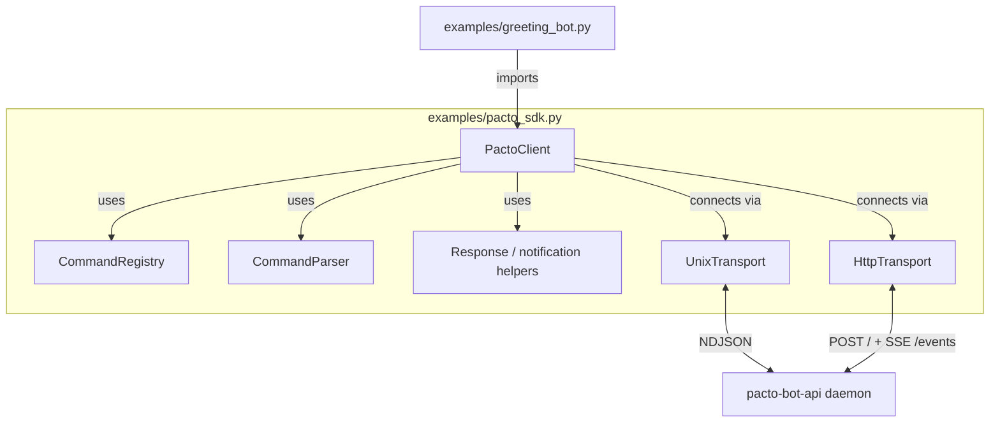

# Python SDK Seed and Greeting Bot Template

## Summary

Create a single-file, standard-library-only Python SDK at `examples/pacto_sdk.py` that abstracts JSON-RPC framing, registration, lifecycle, command dispatch, and response helpers for the `pacto-bot-api` daemon. Ship `examples/greeting_bot.py` and its manifest as a ~30-line demonstration that passes the existing example contract-test harness. Keep `examples/echo_bot.py` unchanged.

## Problem Frame

`examples/echo_bot.py` is the only copy-pasteable Python reference. It is ~290 lines of standard-library code, with roughly the first 150 lines re-implementing JSON-RPC framing, connection management, registration, write/read loops, shutdown, and response dispatch. New bot authors copy that plumbing before writing behavior, which raises the barrier for non-Rust developers and makes every subsequent example harder to review. A small SDK helper would let examples focus on bot logic rather than protocol wiring.

## Requirements

### SDK surface and API

- R1. `examples/pacto_sdk.py` provides a callback-based client class that authors instantiate and import into their bot files. (origin: R1)
- R2. The client exposes a command registry: `client.on('/hello', handler)` registers an async callback for messages whose first whitespace-delimited token is `/hello` (after stripping the leading slash, `/hello` and `hello` are equivalent registry keys). (origin: R2)
- R3. The SDK parses a command into a command name, positional arguments, and flags. (origin: R3)
- R4. The SDK handles JSON-RPC framing, `handler.register`, connection lifecycle, shutdown signals, and the outbound write loop automatically. (origin: R4)
- R5. The SDK provides helper functions or methods that return plain dicts for `handler.response` actions (`ack`, `reply`, `defer`, `ignore`) and for `agent.send_dm` and `agent.set_profile` notifications. (origin: R5)

### Transport support

- R6. The SDK supports Unix socket transport by default, deriving the socket path from `$PACTO_SOCKET`, `$PACTO_DATA_DIR`, or a constructor argument. (origin: R6)
- R7. The SDK supports HTTP+SSE transport via a constructor flag or environment variable, including `X-Pacto-Handler-Id` header management for mutating methods and SSE event parsing for inbound `agent.event` notifications. (origin: R7)

### Example bot and tests

- R8. `examples/greeting_bot.py` demonstrates a complete bot in approximately 30 lines of business logic, responding to `/hello` with a friendly message. (origin: R8)
- R9. `examples/greeting_bot.py` includes a matching `examples/greeting_bot.manifest.json` and passes the existing contract-test harness. (origin: R9)
- R10. `examples/echo_bot.py` remains unchanged as the stdlib-only reference implementation and continues to pass its existing contract test. (origin: R10)

### Documentation and compatibility

- R11. `examples/pacto_sdk.py` uses only the Python standard library, matching `examples/echo_bot.py`. (origin: R11)
- R12. A short README section or inline docstring explains that `pacto_sdk.py` is a manual seed, not the eventual generated client, and points to the generated-client plan. (origin: R12)

## Key Technical Decisions

- **KTD-1. Zero dependencies for `pacto_sdk.py` and bot files.** The SDK and every example bot use only the Python standard library. This preserves copy-paste friendliness and keeps `echo_bot.py`'s stdlib-only contract intact. HTTP+SSE is implemented with `asyncio.open_connection` and manual HTTP/1.1 + SSE parsing rather than `aiohttp` or `httpx`.
- **KTD-2. Transport adapter pattern.** The client delegates connection open/read/write to a small transport object. The Unix adapter uses `asyncio.open_unix_connection`; the HTTP adapter uses `asyncio.open_connection` to a configurable host:port (default `127.0.0.1:9800`), sends `X-Pacto-Bot-Secret`, and manages the SSE stream plus `X-Pacto-Handler-Id` header for mutating calls. This keeps the rest of the SDK transport-agnostic.
- **KTD-3. Command syntax: `/command arg1 arg2 --flag value --bool`.** Content is split on whitespace with small defensive limits (e.g., max 256 tokens, max 1024 bytes per token, max 50 args/flags). Tokens beginning with `--` are flags; if the next token does not start with `--`, it is the flag's value. Remaining positional tokens are arguments. The leading slash is stripped before registry lookup, so `client.on('/hello', handler)` and `client.on('hello', handler)` are equivalent. This is a deliberately small grammar; authors needing richer parsing can drop to the raw `agent.event` callback.
- **KTD-4. Callback registry returns response dicts; the client sends them.** A registered handler receives `(event, client)` and returns a dict suitable for `handler.response`. The client enforces that the returned dict contains `event_id` and `action`, then sends it. This matches the brainstorm's plain-dict contract.
- **KTD-5. `greeting_bot.py` supplements `echo_bot.py`.** The greeting bot is the SDK demonstration; `echo_bot.py` stays as the stdlib-only reference and contract-test anchor.

## High-Level Technical Design

The SDK exposes one `PactoClient` class. A bot registers command handlers with `client.on('/hello', handler)` and calls `await client.run()`. At runtime the client opens the selected transport, sends `handler.register`, starts a read loop, and dispatches `agent.event` notifications through the command registry. Registered callbacks return a response dict that the client forwards as a `handler.response` notification. Mutating notifications (`agent.send_dm`, `agent.set_profile`, `agent.error`) reuse the same outbound path; over HTTP they include the `X-Pacto-Handler-Id` header.

## Implementation Units

### U1. Transport adapters in `examples/pacto_sdk.py`

**Goal:** Provide Unix socket and HTTP+SSE transport objects behind a common async interface.

**Requirements:** R6, R7, R11

**Dependencies:** none

**Files:**
- `examples/pacto_sdk.py` (create)

**Approach:**
Define a small transport protocol: `connect()`, `readline()`, `write_frame(dict)`, `close()`. Implement two adapters:
- `UnixTransport`: uses `asyncio.open_unix_connection`; derives the socket path from `--socket` / `$PACTO_SOCKET`, `--data-dir` / `$PACTO_DATA_DIR`, or a constructor argument; frames are NDJSON lines.
- `HttpTransport`: uses `asyncio.open_connection` to a configurable host:port (default `127.0.0.1:9800`, set via `--http-bind` / `$PACTO_HTTP_BIND`). Outbound frames are sent as `POST /` with `X-Pacto-Bot-Secret` and, for mutating methods (`agent.send_dm`, `agent.set_profile`, `agent.error`), `X-Pacto-Handler-Id`. Inbound frames are consumed from `GET /events?handler_id=<id>` as a text/event-stream, parsing `data:` lines as NDJSON frames and ignoring `event:` lines.

Store the `handler_id` returned by `handler.register` so the HTTP transport can supply it on mutating calls and the SSE request.

**Patterns to follow:** Mirror `examples/echo_bot.py` line framing (`json.dumps(msg, separators=(',', ':')) + '\n'`). HTTP request/response parsing can follow the shape in `src/transport/http.rs` but implemented in Python stdlib.

**Test scenarios:**
- Unix adapter connects to a daemon socket, writes a frame, and reads a frame.
- HTTP adapter opens an SSE stream and writes a frame with the correct secret and handler-id headers.
- HTTP adapter rejects a missing secret with a clear error.

**Verification:** Unit-style tests for each adapter connect to mock endpoints and assert correct wire format.

### U2. Core client lifecycle in `examples/pacto_sdk.py`

**Goal:** Implement `PactoClient` registration, read loop, dispatch, graceful shutdown, and the JSON-RPC request/response correlation table.

**Requirements:** R1, R4, R5 (response sending only)

**Dependencies:** U1

**Files:**
- `examples/pacto_sdk.py` (modify)

**Approach:**
`PactoClient` accepts `socket_path`, `data_dir`, `bot_id`, `event_types`, `capabilities`, transport selection, and an optional `secret` for HTTP mode. `run()` installs `SIGINT`/`SIGTERM` handlers, opens the transport, sends `handler.register`, stores `handler_id`, then enters a read loop. Incoming frames are dispatched:
- `agent.event` → the command registry (initialized in this unit; populated via `client.on` in U3) or a default catch-all callback if registered.
- `agent.status` → optional user-supplied status callback; default logs to stderr without including secrets or wire contents.
- responses to our requests → resolve futures by `id`.
- return values from registered command callbacks are sent as `handler.response` notifications.

If `handler.register` returns an error or omits `handler_id`, `run()` logs the error and exits cleanly.

**Patterns to follow:** Match `examples/echo_bot.py` signal handling, stderr logging prefix `[bot-id]`, and `async def main(argv=None)` entry shape.

**Test scenarios:**
- Client registers on startup and the returned `handler_id` is stored.
- Client dispatches an `agent.event` to the matching command callback and sends the returned `handler.response`.
- Client shuts down cleanly on SIGINT without leaking tasks.
- Client handles `agent.status` by logging to stderr by default.

**Verification:** A test handler driven against a mock daemon verifies registration, dispatch, and shutdown.

### U3. Command registry and parser in `examples/pacto_sdk.py`

**Goal:** Implement `client.on('/hello', handler)` and the small command parser.

**Requirements:** R2, R3

**Dependencies:** U2

**Files:**
- `examples/pacto_sdk.py` (modify)

**Approach:**
Maintain a dict mapping command string prefixes to async callbacks. On `agent.event`, strip the leading `/`, parse the first whitespace-delimited token as the command name, and look it up. If no callback matches and a fallback handler was registered via `client.on_default(handler)`, route to the fallback.

Parser output: a dict with `command`, `args` (list of positional strings), and `flags` (dict of `--key` to value or `True`). Syntax: `/cmd arg1 arg2 --flag value --bool`.

**Patterns to follow:** Keep parser behavior deterministic and document the exact syntax in the SDK docstring.

**Test scenarios:**
- Exact command match invokes the registered callback.
- Command with positional args and flags passes parsed values to the callback.
- Unknown command routes to the default handler if one is registered.
- Unknown command without a default handler returns `ignore`.
- Malformed input (e.g., empty content) returns `ignore`.
- Oversized input (too many tokens or too-long tokens) is rejected or truncated rather than exhausting memory.

**Verification:** Direct unit tests for `parse_command` and registry dispatch.

### U4. Response and notification helpers in `examples/pacto_sdk.py`

**Goal:** Provide dict builders for `handler.response` actions and mutating notifications.

**Requirements:** R5, R7

**Dependencies:** U2

**Files:**
- `examples/pacto_sdk.py` (modify)

**Approach:**
Add helper methods on `PactoClient` that return plain dicts:
- `ack(event_id)`, `reply(event_id, content)`, `defer(event_id)`, `ignore(event_id)` for `handler.response`.
- `send_dm(bot_id, recipient, content, reply_to=None)` and `set_profile(bot_id, **fields)` for notifications.

These helpers only build dicts; the client sends them. For HTTP transport, the client attaches `X-Pacto-Handler-Id` automatically when sending a notification whose method is mutating (`agent.send_dm`, `agent.set_profile`, `agent.error`).

**Patterns to follow:** Field names must match `schemas/jsonrpc.json` (`event_id`, `action`, `content`, `bot_id`, `recipient`, `reply_to`, `name`, `about`, `picture`).

**Test scenarios:**
- Each helper returns a dict matching the JSON-RPC schema shape.
- Sending `agent.send_dm` over HTTP includes `X-Pacto-Handler-Id`.
- Sending `handler.response` over HTTP is non-mutating and does not require the header.

**Verification:** Schema-shape assertions and HTTP header assertions.

### U5. Greeting bot example and manifest

**Goal:** Demonstrate the SDK with a ~30-line bot that replies to `/hello` and passes the contract harness.

**Requirements:** R8, R9, R10

**Dependencies:** U1, U2, U3, U4

**Files:**
- `examples/greeting_bot.py` (create)
- `examples/greeting_bot.manifest.json` (create)

**Approach:**
`greeting_bot.py` imports `PactoClient` from `pacto_sdk`, registers `/hello`, registers a default handler that ignores unknown commands, and runs. The handler returns a friendly reply. Accept `--socket`, `--data-dir`, `--bot-id`, `--transport`, and `--secret` flags with env fallbacks matching `echo_bot.py` conventions. Default `--bot-id` to `echo-bot` so the existing parameterized contract harness continues to work.

`greeting_bot.manifest.json` declares `manifest_version: "1"`, `bot_file: "greeting_bot.py"`, and contract pieces for:
- `handler.register` (implicit via harness; may be explicit if useful).
- `event_response` for `/hello` → `action: reply`.
- `event_response` for an unknown command → `action: ignore`.

**Patterns to follow:** Copy the structure of `examples/echo_bot.manifest.json`. Use the same env-var fallback order as `echo_bot.py`.

**Test scenarios:**
- `pytest examples/test_examples_contract.py::test_example_contract[greeting_bot.py]` passes.
- `/hello` produces a reply containing a greeting.
- Unknown command produces `action: ignore`.
- `echo_bot.py` and its manifest remain unchanged and still pass.

**Verification:** Run the full examples contract test suite and confirm both bots pass.

### U6. Documentation

**Goal:** Explain the SDK's purpose, scope, and usage so authors know when to use it.

**Requirements:** R12

**Dependencies:** U5

**Files:**
- `examples/pacto_sdk.py` (modify)
- `examples/README.md` (modify)

**Approach:**
Add a module-level docstring in `examples/pacto_sdk.py` stating it is a manual helper, not the eventual generated client, and pointing to the contract-test harness plan that defers the generated Python client.

Add a short section in `examples/README.md` titled "SDK seed (`pacto_sdk.py`)" that:
- States it is a manual helper, not the eventual generated client.
- Shows a 30-line `greeting_bot.py`-style snippet.
- Documents the command syntax and transport selection.
- Links to `docs/plans/2026-06-28-001-feat-python-examples-ci-contract-tests-plan.md` as the plan that defers the generated Python client.

**Patterns to follow:** Keep prose concise; match the tone of the existing `examples/README.md`.

**Test scenarios:**
- Documentation renders without broken links.
- Snippet in README matches the actual `greeting_bot.py` API.

**Verification:** Manual review; docstring present at the top of `examples/pacto_sdk.py`; README section renders without broken links.

## Scope Boundaries

### Deferred for later

- Generated Python client derived from `schemas/jsonrpc.json`.
- Typed dataclasses or Pydantic models for events and responses.
- Decorator-based routing sugar on top of the callback registry.
- Additional example bots (poll, multi-persona receptionist, profile mood ring).
- HTTP transport contract tests beyond the greeting bot.

### Outside this product's identity

- Publishing the SDK as a standalone PyPI package.
- Replacing `examples/echo_bot.py` as the stdlib-only reference.

## Risks & Dependencies

- **HTTP+SSE complexity in stdlib.** Implementing correct HTTP/1.1 keep-alive, chunked transfer, and SSE parsing without third-party libraries is error-prone. Mitigation: limit HTTP support to localhost, add focused unit tests for the SSE parser, and keep the HTTP adapter's surface small.
- **Plaintext HTTP on localhost.** The daemon's HTTP transport is localhost-only and sends the bearer token in plaintext. This matches the existing daemon threat model (any local process with the secret can impersonate the handler). Mitigation: keep HTTP opt-in, document that the secret must not be logged or committed, and read it from `$PACTO_SECRET_TOKEN`, `--secret`, or the `bot_secret_token` file in `$PACTO_DATA_DIR`.
- **Schema drift.** `pacto_sdk.py` is manually maintained until a generated client arrives. Mitigation: document that it is a seed, keep helpers thin, and verify contract tests catch drift.
- **Contract-test harness dependency.** The greeting bot must include a valid manifest; a malformed manifest breaks `pytest examples/`. Mitigation: follow `echo_bot.manifest.json` closely and run the harness before finishing.
- **AE2 not covered by the Unix-socket contract harness.** The existing parameterized harness starts bots with `--socket` and does not enable HTTP transport. AE2 must be verified via separate HTTP-focused tests or by extending the harness; this is additional work beyond the Unix contract-test pass.

## Acceptance Examples

- AE1. Unix socket greeting (covers R8, R9)
  - **Given:** a daemon with bot id `greeting-bot` over a Unix socket.
  - **When:** the harness injects `agent.event` with `content: "/hello"`.
  - **Then:** `greeting_bot.py` sends `handler.response` with `action: "reply"` and content containing a friendly greeting.

- AE2. HTTP+SSE greeting (covers R7, R8, R9)
  - **Given:** a daemon configured for HTTP transport and a valid `$PACTO_SECRET_TOKEN`.
  - **When:** `greeting_bot.py` starts with HTTP transport and the harness injects `/hello`.
  - **Then:** the bot registers via HTTP POST, consumes `/events` via SSE, replies with a `handler.response`, and includes the correct `X-Pacto-Handler-Id` header on any mutating notification such as `agent.send_dm` or `agent.set_profile`.
  - **Verification note:** AE2 is not covered by the existing Unix-socket contract harness; verify via a separate HTTP-focused test or a harness extension.

- AE3. `echo_bot.py` remains intact (covers R10)
  - **Given:** the current `examples/echo_bot.py` and `examples/echo_bot.manifest.json`.
  - **When:** `pytest examples/test_examples_contract.py` runs.
  - **Then:** the echo bot contract test passes with no modifications.

## Documentation / Operational Notes

- Update `examples/README.md` with the SDK seed section.
- No CI changes are required; the existing examples contract-test harness will automatically discover `greeting_bot.py` once its manifest exists.
- **Success signal:** future example bots should prefer importing `pacto_sdk.py` over copying `echo_bot.py`'s plumbing; the team reviews new examples for SDK reuse before approving the generated-client plan.

## Sources / Research

- `examples/echo_bot.py` — stdlib-only reference for framing, registration, lifecycle, and shutdown.
- `examples/conftest.py` — contract-test fixtures, daemon lifecycle, and `SocketProxy` behavior.
- `examples/test_examples_contract.py` — manifest-driven contract execution.
- `schemas/jsonrpc.json` — canonical JSON-RPC method and notification shapes.
- `schemas/example-manifest.json` — manifest schema for example bots.
- `src/transport/http.rs` — HTTP transport routes, secret header, `X-Pacto-Handler-Id`, and SSE endpoint behavior.
- `docs/plans/2026-06-28-001-feat-python-examples-ci-contract-tests-plan.md` — contract-test harness plan that defers the generated Python client.
- `docs/brainstorms/2026-06-29-python-sdk-seed-requirements.md` — upstream requirements doc with R-IDs, flows, and acceptance examples.
