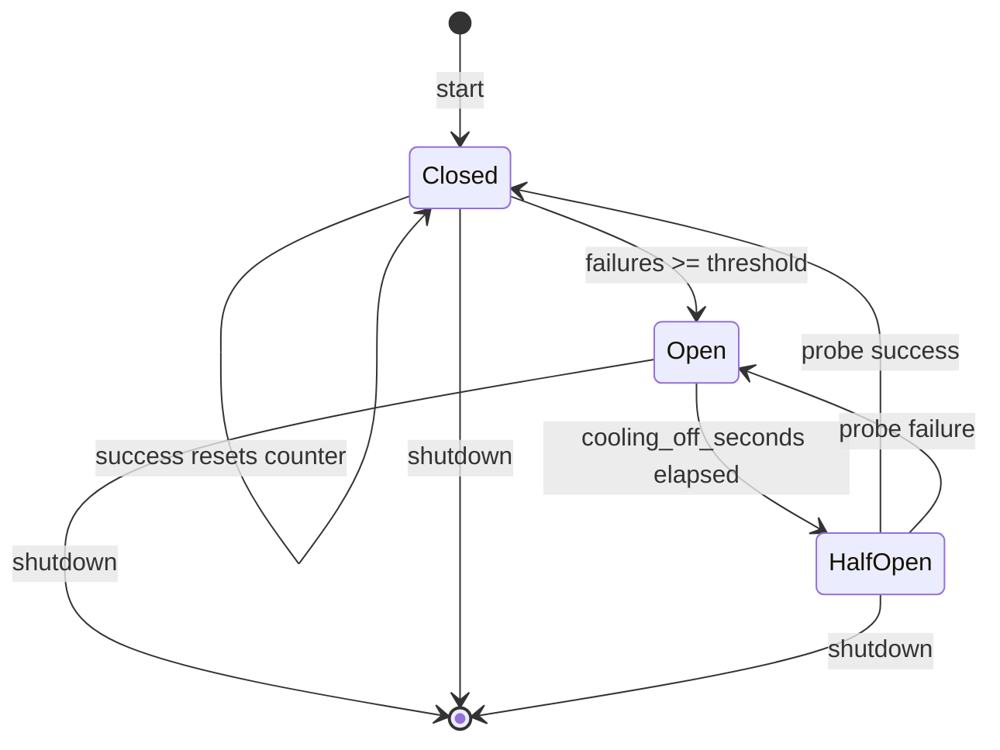

## Summary

Add a retry/circuit-breaker helper to the Python SDK so bot handlers survive daemon restarts and network blips with exponential backoff, jitter, a failure ceiling, and a visible degraded state.

---

## Problem Frame

`Bot._run` in `python/src/pacto_bot_api/bot.py` currently reconnects after transport disconnects with a fixed exponential backoff capped at 8 seconds, but it has no jitter, no failure ceiling, and no circuit breaker. The initial registration attempt also fails fast on startup errors, while the post-startup reconnect loop retries. A restarting daemon or flapping network can produce a tight sequence of reconnection attempts that hammers the Unix socket or HTTP endpoint and fills logs with repetitive failure noise. The scaffolded `docker-compose.yml` and `systemd.service` already include `restart: on-failure` / `Restart=on-failure`, but in-process resilience is faster and gives operators a clear degraded-state signal.

---

## Requirements

### Retry and backoff

- R1. The SDK retry logic applies to both the initial registration call and the read-loop reconnect path in `python/src/pacto_bot_api/bot.py`.
- R2. Retry backoff is exponential with a configurable initial value and cap, plus randomized jitter bounded by a configurable ratio of the current backoff.
- R3. Backoff and jitter are reset to defaults after any successful connection and registration.
- R4. The retry loop sleeps on `asyncio.Event` / `asyncio.wait_for` so a shutdown signal can interrupt the sleep immediately.

### Circuit breaker

- R5. A configurable `failure_threshold` counts consecutive failed connection or registration attempts. When the threshold is reached, the circuit breaker opens.
- R6. While the circuit is open, the bot skips reconnection attempts and logs a clear degraded-state message at a reduced cadence.
- R7. After a configurable `cooling_off_seconds` period, the circuit enters a half-open state and makes one probe attempt.
- R8. If the probe succeeds, the circuit closes and normal operation resumes; if it fails, the circuit reopens and the cooling-off period repeats.
- R9. A successful connection or registration at any time resets the failure counter and closes the circuit.

### Observability and state

- R10. When the circuit opens, the bot logs a single message naming the daemon transport, the failure count, and the cooling-off duration.
- R11. While the circuit remains open, the bot logs a short status line no more than once per minute (configurable) so operators can see it is alive but degraded.
- R12. When the circuit closes, the bot logs a recovery message.
- R13. The degraded state is exposed via a simple property on `Bot` so handler code can inspect it (`bot.is_degraded`).

### Configuration

- R14. The bot accepts retry/circuit-breaker settings via `Bot` constructor keyword arguments and standard CLI flags (`--retry-initial-backoff`, `--retry-max-backoff`, `--retry-jitter-ratio`, `--circuit-failure-threshold`, `--circuit-cooling-off-seconds`, `--degraded-log-interval`).
- R15. Defaults are chosen for developer convenience: initial backoff ~1s, max backoff ~30s, jitter ratio ~0.2, failure threshold ~5, cooling-off ~60s, degraded log interval ~60s.
- R16. The scaffold templates continue to include `restart: on-failure` / `Restart=on-failure` as a safety net, but the primary recovery path is now in-process.

### Shutdown behavior

- R17. SIGINT and SIGTERM set the shutdown event, which breaks any active retry sleep and bypasses the circuit breaker so the bot exits cleanly.
- R18. During shutdown, the bot closes the transport and client even if the circuit breaker is open.

---

## Key Technical Decisions

- **Extract retry/circuit logic into a standalone `RetryCircuit` class.** This keeps `Bot._run` readable, makes the state machine unit-testable, and avoids duplicating backoff/circuit logic across the initial registration and reconnect paths (see origin: Key Decisions; resolves M3 in flow analysis).
- **Initial registration enters the same retry/circuit path as runtime reconnect.** This satisfies R1 and removes the current fail-fast startup behavior. The existing `test_run_exits_cleanly_when_socket_missing` is updated to verify the retry path and responsive shutdown instead of a hard exit (see origin: R1; resolves C1 in flow analysis).
- **Half-open probe runs immediately after the cooling-off sleep and attempts a full connect+register cycle.** On success the circuit closes; on failure it reopens and cooling-off restarts. The probe counts as a normal attempt for the failure counter (resolves I1 in flow analysis).
- **Degraded logging uses a separate cadence timer capped at `degraded_log_interval`.** The status line is emitted at most once per `degraded_log_interval` while the circuit is open, independent of the cooling-off period (resolves I3 in flow analysis).
- **`is_degraded` is exposed as a read-only property.** This is the simplest contract that satisfies R13 without committing to event callbacks (resolves I5 in flow analysis).
- **Failures count connect, `handler_register`, and `start_sse` errors.** A graceful EOF from the daemon or a `PactoClientError` from registration increments the counter. Handler exceptions and outbound `agent.*` calls do not (resolves I2 in flow analysis).
- **Add `retry_initial_backoff` and use `retry_jitter_ratio` for the jitter flag.** R2 requires a configurable initial value; R14’s suggested `--retry-jitter` name is clarified to `--retry-jitter-ratio` to avoid looking like an absolute duration (resolves I4 and I6 in flow analysis).
- **Built-in transports are recreated on each reconnect; custom transport instances are reused and must be reconnectable after `close()`.** This fixes the bug where `HttpTransport.readline` returns `""` immediately after `close()` because `_closed` is true, by making `HttpTransport` reconnectable. Custom transports passed to the constructor are reused across reconnects; they are closed between attempts and reopened on the next connect, so their `connect()` must be idempotent after `close()` (resolves C5 in flow analysis).

---

## High-Level Technical Design

The circuit breaker has three states. The normal running state is **closed**: every connection/registration success resets the failure counter to zero. After `failure_threshold` consecutive failures the breaker moves to **open**, logs the degraded state, and suppresses reconnection attempts for `cooling_off_seconds`. When that interval elapses the breaker becomes **half-open** and makes one probe attempt. A successful probe closes the circuit; a failed probe reopens it and restarts cooling-off.

The retry loop wraps `connect` + `handler_register` + optional `start_sse` as one attempt. On failure it asks `RetryCircuit` for the next backoff; on success it resets the circuit. The sleep is done with `asyncio.wait_for(self._shutdown.wait(), timeout=backoff)`, so a shutdown signal aborts the wait immediately. When the circuit is open, the loop skips the attempt entirely and waits for either the cooling-off timer to expire or a shutdown signal.

---

## Implementation Units

### U1. Add `RetryCircuit` helper class and unit tests

- **Goal:** Provide a reusable state machine for exponential backoff and circuit-breaker behavior.
- **Requirements:** R2, R5, R7, R8, R9.
- **Dependencies:** None.
- **Files:** `python/src/pacto_bot_api/retry_circuit.py`, `python/tests/test_retry_circuit.py`.
- **Approach:** Implement a small class with `Closed`, `Open`, `HalfOpen` states. It exposes `record_success()`, `record_failure()`, and `next_action()`. `next_action()` returns a tuple `(should_attempt: bool, wait_seconds: float)`: `should_attempt=False` while the circuit is open, `True` when half-open or closed; `wait_seconds` is the remaining cooling-off period when open, zero when half-open, and a jittered backoff when closed. Backoff doubles from `retry_initial_backoff` up to `retry_max_backoff`; jitter is a random value bounded by `retry_jitter_ratio * current_backoff`. The class tracks the timestamp when the circuit opened so the caller can wait the correct interval. No asyncio or I/O lives in this class; it is pure state arithmetic. Negative configuration values are rejected at construction; zero is allowed with documented semantics (`cooling_off_seconds=0` means immediate half-open probe; `degraded_log_interval=0` means no periodic status logging; `failure_threshold` must be positive).
- **Patterns to follow:** Keep the module dependency-free; match the package’s `from __future__ import annotations` style and type hints.
- **Test scenarios:**
  - Happy path: successive failures double the backoff; a success resets the counter and backoff.
  - Edge cases: backoff is capped at `retry_max_backoff`; jitter is bounded by the configured ratio; zero `failure_threshold` is rejected; zero `cooling_off_seconds` triggers an immediate half-open probe; zero `degraded_log_interval` suppresses periodic status logging.
  - Error/failure paths: reaching `failure_threshold` opens the circuit; after `cooling_off_seconds` the state becomes half-open; a failed probe returns to open and restarts cooling-off; a successful probe closes the circuit.
  - Integration scenario: state transitions match the sequence required by the `Bot` retry loop.
- **Verification:** `pytest python/tests/test_retry_circuit.py` passes.

### U2. Add retry/circuit configuration to `Bot` constructor and CLI

- **Goal:** Make the retry/circuit settings configurable via constructor kwargs and CLI flags.
- **Requirements:** R14, R15.
- **Dependencies:** None.
- **Files:** `python/src/pacto_bot_api/bot.py`.
- **Approach:** Add constructor kwargs `retry_initial_backoff`, `retry_max_backoff`, `retry_jitter_ratio`, `circuit_failure_threshold`, `circuit_cooling_off_seconds`, and `degraded_log_interval`. Store them with the same precedence pattern used for transport settings: CLI arg overrides constructor arg, which overrides the default. (Environment variables are not required for these settings.) Add matching CLI flags in `_parse_args`. Defaults: `retry_initial_backoff=1.0`, `retry_max_backoff=30.0`, `retry_jitter_ratio=0.2`, `circuit_failure_threshold=5`, `circuit_cooling_off_seconds=60.0`, `degraded_log_interval=60.0`.
- **Patterns to follow:** Mirror the existing `_transport_arg` / `_socket_path_arg` stash-and-override pattern. Add CLI help text consistent with the existing `--socket`, `--transport`, etc.
- **Test scenarios:**
  - Happy path: constructor kwargs are stored and used by `RetryCircuit`.
  - Edge cases: CLI flags override constructor kwargs; invalid values (negative thresholds, jitter ratio > 1, `failure_threshold` <= 0) are rejected at construction or parse time.
- **Verification:** `pytest python/tests/test_bot.py -k configuration` passes.

### U3. Refactor `Bot._run` to use `RetryCircuit` for registration and reconnect

- **Goal:** Unify initial registration and read-loop reconnect under the same retry/circuit path.
- **Requirements:** R1, R3, R4, R17, R18.
- **Dependencies:** U1, U2.
- **Files:** `python/src/pacto_bot_api/bot.py`, `python/src/pacto_bot_api/transports.py` (minor).
- **Approach:** Replace the existing fail-fast startup try/except and the simple post-startup reconnect loop with a single loop that calls `_run_once` under `RetryCircuit` control. Before each attempt, check `self._shutdown`. Ask the circuit for `next_action()`; if it returns `should_attempt=False`, wait for the returned `wait_seconds` or a shutdown signal. If it returns `should_attempt=True`, perform the attempt. After a successful attempt, call `record_success()` to reset the circuit. After a failed attempt, call `record_failure()` and wait for the returned jittered backoff or a shutdown signal. On shutdown, break out of the loop and close the client/transport. For built-in transports, recreate the transport object on each reconnect so state is fresh; for a custom `Transport` instance passed to the constructor, preserve the same instance across reconnects (it is closed/reopened between attempts and must be reconnectable after `close()`). Update `HttpTransport` so that `close()` clears the SSE streams without permanently disabling the instance, and `readline()` relies on the stream being `None` rather than a `_closed` flag. Make `_run_once` detect a dispatch-loop EOF (daemon disconnect) versus a shutdown signal and raise a dedicated `TransportDisconnected` exception so the retry loop records a failure; a shutdown signal should exit the loop cleanly without recording a failure. `run()` exits with code 0 when shutdown is requested during the retry loop.
- **Patterns to follow:** Use the existing `asyncio.wait_for(self._shutdown.wait(), timeout=backoff)` pattern for interruptible sleeps. Reuse `_resolve_client` for transport re-resolution when the transport is not a custom instance.
- **Test scenarios:**
  - Happy path: a transient disconnect is followed by a successful reconnect.
  - Edge cases: backoff doubles after each failure and resets after success; shutdown during a backoff sleep exits immediately.
  - Error paths: repeated failures eventually trip the circuit; a shutdown signal during a connection attempt is honored as soon as the attempt completes or times out; an EOF from the daemon is recorded as a failure and triggers retry, while a shutdown signal is not recorded as a failure.
  - Integration scenario: the initial registration attempt retries like a runtime reconnect instead of failing fast; `run()` exits with code 0 when shutdown is requested during initial retry.
- **Verification:** `pytest python/tests/test_bot.py` passes, including the updated startup test.

### U4. Add degraded-state logging and `is_degraded` property

- **Goal:** Give operators and handler code a clear signal when the circuit is open.
- **Requirements:** R10, R11, R12, R13.
- **Dependencies:** U1, U2, U3.
- **Files:** `python/src/pacto_bot_api/bot.py`.
- **Approach:** When the circuit opens, log a single message naming `self._transport.name`, the failure count, and the cooling-off duration. While the circuit stays open, log a short status line at most once per `degraded_log_interval`. When the circuit closes, log a recovery message. Expose `is_degraded` as a property that delegates to the circuit state. Track the last degraded log timestamp to enforce the cadence.
- **Patterns to follow:** Use the existing `self._log()` helper. Keep log messages concise and human-readable.
- **Test scenarios:**
  - Happy path: recovery is logged when the circuit closes.
  - Edge cases: the status line is emitted at most once per `degraded_log_interval` even when `cooling_off_seconds` is shorter.
  - Error paths: `bot.is_degraded` returns `True` while the circuit is open and `False` otherwise.
- **Verification:** `pytest python/tests/test_bot.py -k degraded` passes.

### U5. Verify scaffold templates retain safety-net restart policies

- **Goal:** Confirm the scaffold templates still include Docker/systemd restart policies as a secondary safety net.
- **Requirements:** R16.
- **Dependencies:** None.
- **Files:** `templates/python/docker-compose.yml`, `templates/python/systemd.service`.
- **Approach:** Inspect the templates. No changes are expected; if either template is missing `restart: on-failure` or `Restart=on-failure`, add it. Optionally add a comment in the generated README reminding operators that the bot now retries in-process. Add a small test or assertion that the scaffold generation output includes the restart policy.
- **Patterns to follow:** Keep the existing template structure intact; do not add new environment variables or service definitions.
- **Test scenarios:**
  - Happy path: `docker-compose.yml` contains `restart: on-failure` for the bot service.
  - Happy path: `systemd.service` contains `Restart=on-failure`.
- **Verification:** Scaffold generation test asserts the restart policy is present, or manual inspection confirms it.

### U6. Add `Bot` integration tests for reconnect and degraded behavior

- **Goal:** Prove the end-to-end retry/circuit behavior in `Bot._run` with deterministic mocks.
- **Requirements:** R1, R2, R5, R6, R7, R8, R9, R10, R11, R12, R13, R17, R18.
- **Dependencies:** U1, U2, U3, U4.
- **Files:** `python/tests/test_bot.py`.
- **Approach:** Extend the existing `MockTransport` test harness to support controlled failures. Drive `Bot._run` in a background task, fail a configurable number of `connect()` calls, then allow success and verify the circuit closes. Verify shutdown responsiveness during backoff, during cooling-off, and during a connection attempt. Verify degraded log messages and `is_degraded`. Update the existing `test_run_exits_cleanly_when_socket_missing` to reflect the new retry behavior: it should now demonstrate that the bot retries and shuts down cleanly rather than exiting immediately. Where possible, use `is_degraded` and the logged state to observe transitions directly rather than relying solely on wall-clock sleeps.
- **Patterns to follow:** Follow the existing task-based test pattern in `python/tests/test_bot.py`: create `asyncio.create_task(bot._run(...))`, use short `asyncio.sleep` waits to observe frames, and call `bot._request_shutdown()` to terminate.
- **Test scenarios:**
  - Covers AE1: backoff increases exponentially and is jittered; shutdown cancels the wait immediately.
  - Covers AE2: repeated failures trip the circuit, degraded state is logged, and cooling-off restarts after a failed probe.
  - Covers AE3: a successful probe closes the circuit and resumes dispatch.
  - Covers AE4: shutdown during cooling-off exits immediately and closes the transport.
  - Covers AE5: `bot.is_degraded` returns `True` when the circuit is open.
- **Verification:** `pytest python/tests/test_bot.py` passes.

---

## Scope Boundaries

### Deferred for later

- Metrics endpoint or Prometheus-style metrics for reconnection counts and circuit state.
- Per-attempt hooks or pluggable retry strategies for custom bot logic.
- Advanced jitter strategies beyond simple ratio-based jitter.
- Backpressure or rate-limit coordination across multiple bots sharing a host.

### Outside this product's identity

- Changes to the daemon transport protocol, admin CLI, or JSON-RPC contract.
- Replacing Docker/systemd restart policies; they remain as safety nets.
- Non-Python language SDKs.

---

## Risks & Dependencies

- **Behavior change at startup.** Removing the fail-fast startup path changes the operator experience when the daemon is down. Mitigation: the new behavior is explicitly required by R1 and is documented in the updated acceptance tests.
- **Custom transport lifecycle change.** Reusing a custom `Transport` instance across reconnects requires its `connect()` to be idempotent after `close()`, because the instance is closed between attempts. Mitigation: document the behavior in `Bot` docstrings and tests.
- **`HttpTransport` reconnect change.** `HttpTransport` is updated so it can be reconnected after `close()`. This must not break existing tests or the normal shutdown path. Mitigation: add a dedicated test for reconnect after close and verify existing transport tests still pass.
- **Test timing sensitivity.** The existing `test_bot.py` uses short `asyncio.sleep` waits that can be flaky on slow runners. Mitigation: use small, deterministic intervals in tests and avoid wall-clock sleeps where possible.

---

## Sources / Research

- `docs/brainstorms/2026-07-02-sdk-reconnection-resilience-requirements.md` — origin requirements document.
- `python/src/pacto_bot_api/bot.py` — existing `Bot._run` reconnect loop and signal handling.
- `python/src/pacto_bot_api/transports.py` — transport failure modes and `HttpTransport._closed` reconnect issue.
- `python/tests/test_bot.py` — existing `MockTransport` test harness and task-based test patterns.
- `templates/python/docker-compose.yml` and `templates/python/systemd.service` — scaffold restart safety nets.
