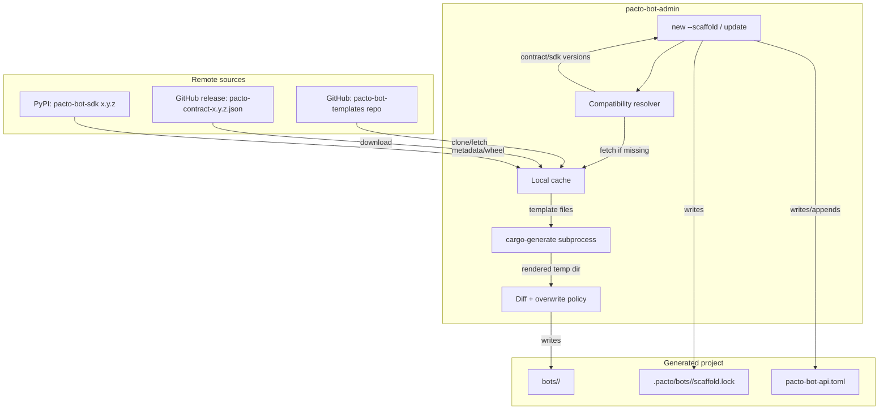

# feat: Decouple bot SDK and templates from the pacto-bot-api release cycle

> **Historical note:** The root `examples/` directory was consolidated into `python/` after this document was written. The legacy standard-library seed SDK (`examples/pacto_sdk.py`) and the associated example bots were removed; the generated Python SDK is now published to PyPI as `pacto-bot-sdk`. The contract-test harness lives in `python/tests/`. See `CHANGELOG.md` [Unreleased] for the consolidation details.

## Summary

Turn `pacto-bot-admin` into a compatibility-aware bootstrapper that resolves a versioned contract artifact, a published PyPI SDK, and a `cargo-generate` template from a single versioned git template repository, then writes the resolved triple into a per-bot `.pacto/bots/<bot-id>/scaffold.lock`. Add `pacto-bot-admin update` to re-render projects while protecting user-edited files, and provide a standalone LLM skill for migrating pre-lock projects.

---

## Problem Frame

Today `pacto-bot-api` is one Rust crate (`0.4.1`) that ships the daemon, the admin CLI, the JSON-RPC contract (`schemas/jsonrpc.json`), the generated Python SDK (`python/`), and the bot project templates (`templates/python/`). The templates are embedded in the admin CLI binary at compile time via `include_dir!("templates")` (`src/scaffold/generate.rs`), and every scaffolded project receives a vendored copy of the SDK from `templates/python/sdk/` that is built into a local wheel. A template tweak, SDK fix, or scaffold behavior change therefore requires a full daemon/admin CLI release. Version numbers are already inconsistent: crate `0.4.1`, schema `0.1.0`, Python SDK `0.1.0`. There is no independent SDK publishing pipeline or template update mechanism.

This plan decouples the three moving parts — contract, SDK, and templates — so each can release on its own cadence while the admin CLI resolves a compatible triple and records it in a lock file.

---

## Requirements

### Contract and SDK decoupling

- R1. The JSON-RPC contract (`schemas/jsonrpc.json`) is published as an independent versioned artifact with its own semver (e.g., `pacto-contract@0.1.0`).
- R2. The daemon and the Python SDK consume the published contract artifact as the source of truth for generated types, not an in-repo path. The in-repo `schemas/jsonrpc.json` may remain as a compatibility snapshot or reference, but generated types must derive from the published artifact.
- R3. The Python SDK is published to PyPI as an independent package with its own semver (e.g., `pacto-bot-sdk@0.2.0`).
- R4. Generated bot projects declare a dependency on the published PyPI SDK package, not on a vendored local wheel built from `templates/python/sdk/`.

### Template delivery

- R5. Templates move out of the daemon crate into a separate, versioned git repository.
- R6. One template repository hosts multiple templates, organized by language and bot kind (e.g., `python-llm`, `python-governance`).
- R7. Each template includes a `manifest.toml` declaring the required contract version range, SDK package name and version range, compatible daemon version range, and a list of protected files.
- R8. `pacto-bot-admin` resolves a template by language, bot kind, and optional git ref (tag, branch, or commit) from the template repository; when no ref is supplied, it defaults to the latest semver tag.
- R9. `pacto-bot-admin` fetches the selected template to a local cache and then invokes `cargo-generate` on that path to render the project.

### CLI bootstrapper behavior

- R10. `pacto-bot-admin new --scaffold` remains the single entry point for creating a bot project.
- R11. The CLI reads the selected template's compatibility metadata and selects a contract/SDK/template triple that satisfies the template's constraints, including the compatible daemon version range.
- R12. The CLI aborts with a clear error if no compatible contract/SDK/template triple can be resolved.
- R13. New languages and bot kinds are supported by adding templates to the template repository; no daemon changes are required. The CLI may need to accept new values for existing `--language` and `--kind` arguments.

### Project lifecycle and lock file

- R14. After scaffolding, the CLI writes a per-bot `.pacto/bots/<bot-id>/scaffold.lock` file recording the template path (language and kind), template git ref, contract artifact name, contract version, SDK package name, SDK version, and admin CLI version.
- R15. The per-bot lock file is the source of truth for `pacto-bot-admin update`.
- R16. `pacto-bot-admin update` reads the per-bot lock file. For semver tags, it resolves the same or a newer compatible contract/SDK/template triple; for branch or commit refs, it re-renders the same ref. It then re-renders the project and updates the lock file with the newly resolved versions.

### Update behavior

- R17. `pacto-bot-admin update` skips files listed as protected in the template metadata unless `--force` is passed. For files that are not protected but differ from the cached template, the CLI shows a `git diff` style preview before overwriting and requires confirmation.
- R18. When `--force` is passed, the CLI overwrites protected files without prompting.
- R19. `pacto-bot-admin update` does not require network access when the resolved contract/SDK/template triple is already present in the local cache.
- R20. Projects generated before the per-bot lock file existed are not supported by `pacto-bot-admin update`.

### Offline and cache

- R21. The CLI caches contract artifacts, SDKs, and templates locally after first fetch.
- R22. The CLI provides a flag to refresh the cache from the remote template repository and re-resolve contract, SDK, and template versions.
- R23. The CLI does not require a network connection for `new` or `update` once the needed contract artifacts, SDKs, and templates are cached.

### Migration

- R24. A standalone LLM skill file at `skills/pacto-bot-migration/SKILL.md` documents the steps to migrate a pre-lock project to the new lock-tracked structure.
- R25. The skill file is referenced from the `update` command's error message when a per-bot lock file is missing.

---

## Key Technical Decisions

- **Contract artifact published as a GitHub release asset.** The in-repo `schemas/jsonrpc.json` remains the development snapshot. The release workflow uploads the same file as `pacto-contract-<version>.json`. Release builds of the daemon and SDK fetch the artifact by version and generate types from it; local development uses the in-repo snapshot. This reuses the existing release pipeline and avoids introducing a separate artifacts repository at this stage (see origin: R1, R2).
- **PyPI package renamed from `pacto-bot-api` to `pacto-bot-sdk`.** The new name removes the collision with the Rust crate and makes the published SDK identity explicit. Generated `pyproject.toml` files will depend on `pacto-bot-sdk` (see origin: R3, R4).
- **Templates move to a separate `pacto-bot-templates` git repository.** One repository hosts multiple templates organized by language and kind (e.g., `python-llm/`, `python-governance/`). The admin CLI clones or fetches that repo and selects a template by path (see origin: R5, R6, R8).
- **Per-template `manifest.toml` declares compatibility and protected files.** The manifest contains a `[compatibility]` table with nested contract, SDK, and daemon version ranges, plus a `protected_files` array. The CLI parses this to resolve a compatible triple and to decide which files to skip during update (see origin: R7, R17).
- **`cargo-generate` is a required external binary.** It is invoked as a subprocess on the cached template directory. The CLI checks for its presence at runtime and emits an install hint if it is missing. Bundling it as a library or workspace binary would add significant dependency and compile-time bloat (see origin: Key Decisions, R9).
- **Cache lives in the platform cache directory with a TTL-based eviction policy.** The default location is the OS cache directory under a `pacto-bot-api` subdirectory. Entries older than a configurable TTL are evicted automatically; `--prune-cache` is the manual override. The cache directory is created with restrictive permissions (`0o700` on Unix, equivalent ACLs on Windows) to avoid leaking contract artifacts, SDK wheels, or git clones.
- **Update renders into a temporary directory and merges selectively.** `cargo-generate` writes to a temp directory; the CLI compares each rendered file against the existing project, shows a diff for changed non-protected files, and applies the user's overwrite decision. This preserves the existing safety model (deny-list for config/signing material, prompt by default, `--force` override) and avoids relying on `cargo-generate`'s own overwrite behavior (see origin: R17, R18).
- **Pre-lock migration is handled by an LLM skill, not a CLI command.** This matches the existing repo pattern for LLM-facing skills (`pacto-bot-templates/python-llm/project/.agents/skills/python-pacto-bot/SKILL.md`) and is acceptable because the current user base is small (see origin: R24, R25).
- **Lock file uses nested TOML tables with a `lock_version` and `template.resolved_commit`.** The fields from R14 are grouped as `[template]`, `[contract]`, `[sdk]`, and `[admin]` tables. A `lock_version` field supports future schema migration, and the resolved commit hash makes lock files reproducible even when tags move (see origin: R14, R16).
- **Per-template `manifest.toml` includes a `manifest_version` field.** This lets older CLIs detect template repositories they cannot parse, and lets template authors evolve the schema safely (see origin: R7).
- **CLI surface gains `--kind`, `--template-repo`, `--template-ref`, `--refresh`, and `--prune-cache` flags.** `--kind` selects the template kind (e.g., `llm`, `governance`). `--template-repo` defaults to the upstream `pacto-bot-templates` repository and can be overridden via `PACTO_TEMPLATE_REPO`. `--template-ref` pins a tag, branch, or commit. `--refresh` bypasses the cache; `--prune-cache` removes cached entries (see origin: R8, R13, R22).
- **The published contract artifact is the source of truth for generated types; the in-repo `schemas/jsonrpc.json` remains the development snapshot.** Local development uses the in-repo snapshot. Release builds of the daemon and SDK fetch the published artifact by version and generate types from it. The release workflow uploads the artifact before building the daemon and SDK binaries. The existing `tests/schema_sync.rs` gate continues to compare local generated types against the in-repo snapshot, and CI also verifies that the published artifact matches the snapshot (see origin: R2).

---

## High-Level Technical Design

The bootstrapper flow has four stages:

1. **Resolve.** The CLI reads the selected template's `manifest.toml`, queries the template repository for available refs, and selects a contract/SDK/template triple that satisfies all declared version ranges. For `update`, the lock file provides the starting template ref and previously resolved versions.
2. **Fetch.** The CLI downloads the template repository (shallow clone or sparse fetch), the contract artifact, and SDK metadata into the local cache. Cached entries are reused when they already satisfy the resolved version.
3. **Render.** The CLI invokes `cargo-generate` on the cached template path with a values file built from the bot context. For `update`, the output lands in a temporary directory so the CLI can compare files individually.
4. **Merge.** For each rendered file, the CLI applies the existing safety model: deny-list for config and secret-bearing files, protected-file list from `manifest.toml`, prompt-by-default for changed non-protected files, and `--force` override. After merging, the CLI updates the lock file.

---

## System-Wide Impact

This plan turns `pacto-bot-admin` from a self-contained binary that embeds templates and vendors the SDK into a network-aware resolver, cache manager, and subprocess orchestrator. The following cross-boundary effects must be addressed before implementation.

### Admin CLI becomes a remote-artifact bootstrapper

`src/scaffold/generate.rs` currently embeds `templates/` at compile time via `include_dir!("templates")` and copies `templates/python/sdk/` into every project, then builds a local wheel. After this plan, the CLI resolves a contract/SDK/template triple from remote sources, caches them, invokes `cargo-generate`, and writes a per-bot lock file. The new `src/scaffold/{resolve,cache,lock,update,render,merge,diff}.rs` modules take on network resolution, git/cargo-generate subprocess orchestration, cache management, lock-file I/O, diff/merge logic, and error handling. `cargo-generate` becomes a required external tool; its absence must be caught early with a clear install hint.

### New CLI surface and documentation

The plan introduces new operator-facing interfaces that must be reflected in every help surface: `pacto-bot-admin update`; `--kind`, `--template-repo`, `--template-ref`, and `--refresh` on `new` and `update`; `--prune-cache`; and `--force` semantics for `update`. These must be documented in `src/admin.rs` after-help, `src/guide.rs`, and the generated `docs/pacto-bot-admin-llms.txt`. The missing-lock error from `update` must reference the migration skill.

### Contract artifact boundary

`schemas/jsonrpc.json` remains the in-repo development snapshot. The release workflow uploads it as `pacto-contract-<version>.json` before building the daemon and SDK binaries. The published artifact is the source of truth for generated types: release builds of the daemon and SDK fetch the artifact by version and generate types from it. `tests/schema_sync.rs` continues to gate the in-repo generated files against the local schema, and CI verifies that the published artifact matches the snapshot. Until the runtime JSON-RPC handshake is implemented (deferred), version-range matching in `manifest.toml` is the only protection against silent protocol mismatch.

### Python SDK rename and dependency chain

Renaming the package from `pacto-bot-api` to `pacto-bot-sdk` is a breaking, repo-wide change: `python/src/pacto_bot_api/` must move to `pacto_bot_sdk/`, imports in generated handler templates must change, and all examples, READMEs, and skills must be updated. The generated `templates/python/pyproject.toml` and `Dockerfile` must stop referencing the local `sdk/` wheel and instead depend on the PyPI package; otherwise generated projects will not build. The release workflow must add a PyPI publish job that runs after the contract artifact is available.

### External template repository

Templates move to a separate `pacto-bot-templates` repository. Its directory layout (`python-llm/`, `python-governance/`) and `manifest.toml` schema become a cross-repo contract. The default template-repository URL should be hard-coded with an override via `--template-repo` or `PACTO_TEMPLATE_REPO`. Git refs are mutable; the lock file records the resolved commit hash in addition to the requested ref. Because `cargo-generate` may execute pre/post-generation hooks on a template, the documentation should warn operators to only render templates from trusted, pinned sources.

### Local cache and offline behavior

The cache lives in the platform cache directory (e.g., `~/.cache/pacto-bot-api/` on Unix) and should be created with restrictive permissions (`0o700`) to avoid leaking contract artifacts, SDK wheels, or git clones. Cached entries need metadata (resolved version, source URL, commit hash, fetched-at) so the CLI can detect stale or corrupt entries and satisfy offline requirements. No automatic eviction means the cache can grow; `--prune-cache` is the manual escape hatch. Offline `update` is only safe when the resolved triple is fully cached; the resolver must not silently fall back to a different version when offline.

### Per-bot lock file and update merge

`.pacto/bots/<bot-id>/scaffold.lock` is a new project-level source of truth that should be checked into version control. The lock file schema must be versioned so future CLI changes can detect and migrate old locks. Update must merge rendered files into the existing project without losing user edits: protected files declared in `manifest.toml` are skipped unless `--force` is passed; `pacto-bot-api.toml` is already protected. All file writes are staged into a temporary directory first; the lock file is updated only after every change is applied successfully, so a failure mid-merge leaves the project unchanged. Pre-lock projects are explicitly unsupported; the `update` error must reference the migration skill and must not silently attempt a best-effort upgrade.

### Failure propagation and error surfaces

A failure in any of the resolver's three remote queries (template tags, GitHub releases, PyPI) aborts the whole scaffold/update. Error messages must identify which boundary failed, show the requested version ranges, and list available versions. Network unavailability on first use is a hard failure; there is no fallback to embedded templates. `cargo-generate` rendering failures must be surfaced with the template path and values-file path to aid debugging. The release workflow now produces binaries, Docker images, a contract asset, and a PyPI package; partial releases can break the resolver, so the release job ordering and failure handling must be explicit.

### Testing and documentation blast radius

`tests/admin_cli_scaffold.rs` currently asserts on embedded templates, vendored SDK, and `pacto-bot-api` package references. The new tests will need a local fixture template repository or a pinned clone, and CI must install `cargo-generate`. `tests/schema_sync.rs` must be extended or CI must generate the SDK from the artifact URL and compare outputs. `examples/` and `python/examples/` must be updated for the package rename. The LLM guide and skill files must mention the new `update` command, the `cargo-generate` prerequisite, and the migration skill.

### Prerequisites checklist

- A `cargo-generate` binary is installed in CI and documented for operators. The minimum supported version is pinned in the code and help text.
- Git credentials for the template repository are configured out-of-band (SSH key, HTTPS token, or public repo). The CLI does not manage credentials beyond using the ambient git configuration.
- PyPI publishing credentials are configured for the release workflow (trusted publisher or API token).
- The `pacto-bot-templates` repository exists and has at least one semver tag and one template directory before the first release that consumes it.
- The contract artifact upload step is in place before any release that builds the daemon and SDK from the artifact.

---

## Scope Boundaries

### Deferred for later

- Runtime JSON-RPC contract handshake (`pacto.initialize` / `protocolVersion`) between daemon and handlers.
- Fleet-wide or nightly auto-update of multiple bot projects.
- Docker images as a template delivery mechanism.
- Three-way merge or interactive file-by-file update prompts.
- Separate template repositories per language or bot kind.
- Automatic installation of `cargo-generate` by the CLI.

### Outside this product's identity

- Removing `pacto-bot-admin` as the single entry point for bot creation.
- Making templates depend on a running daemon at scaffold time.
- Adding a CLI command to migrate pre-lock projects (handled by the LLM skill).

---

## Implementation Units

### U1. Publish the JSON-RPC contract as a versioned artifact

- **Goal:** Make the JSON-RPC contract an independent, versioned artifact that both the daemon and the Python SDK can consume at build time.
- **Requirements:** R1, R2.
- **Dependencies:** None.
- **Files:** `schemas/jsonrpc.json`, `.github/workflows/release.yml`, `.github/workflows/ci.yml`, `xtask/src/codegen.rs`, `python/scripts/generate.py`, `tests/schema_sync.rs`.
- **Approach:** Update the release workflow to attach `pacto-contract-<version>.json` to each GitHub release, where the version comes from `schemas/jsonrpc.json` `info.version`. The published artifact is the source of truth for generated types: release builds of the daemon and SDK fetch the artifact by version and generate types from it. In development, `cargo xtask codegen` continues to use the in-repo snapshot. Keep `tests/schema_sync.rs` as the in-repo parity gate. Add a CI step that verifies the published artifact matches the in-repo snapshot and that the SDK can be generated from the artifact URL. Publish a SHA-256 checksum file alongside the artifact so consumers can verify integrity. Order the release jobs so the contract artifact is uploaded before the daemon and SDK builds consume it, and before the PyPI publish step; block the release if any artifact upload fails.
- **Patterns to follow:** The existing release workflow already packages binaries and a Docker image; add an artifact-upload step. The existing `xtask/src/codegen.rs` already shells out to Python for SDK generation; extend it to accept a contract source argument.
- **Test scenarios:**
  - Release workflow produces a `pacto-contract-<version>.json` asset whose version matches `schemas/jsonrpc.json`.
  - The release workflow also publishes a SHA-256 checksum for the contract artifact.
  - `python/scripts/generate.py` can generate SDK files from a local file path and from a URL.
  - `cargo xtask codegen` still passes `tests/schema_sync.rs` when using the local schema.
  - Generated Rust and Python types match the consumed contract.
  - Release job ordering aborts the release if the contract artifact upload fails.
- **Verification:** A draft release contains the contract artifact; SDK generation succeeds against the artifact URL.

### U2. Rename and publish the Python SDK independently

- **Goal:** Give the Python SDK its own package identity and release pipeline, and stop vendoring it into generated projects.
- **Requirements:** R3, R4.
- **Dependencies:** U1 (contract artifact publishing).
- **Files:** `python/pyproject.toml`, `python/src/pacto_bot_api/` → `python/src/pacto_bot_sdk/`, `python/README.md`, `python/scripts/generate.py`, `python/tests/`, `python/examples/greeting_bot.py`, `python/examples/joke_bot.py`, `examples/*.py`, `examples/conftest.py`, `examples/test_examples_contract.py`, `examples/test_echo_bot.py`, `examples/pacto_sdk.py`, `examples/requirements.txt`, `.github/workflows/release.yml`, `.github/workflows/ci.yml`, `Cargo.toml`.
- **Approach:** Rename the package to `pacto-bot-sdk` and bump the version to `0.2.0`. Move `python/src/pacto_bot_api/` to `python/src/pacto_bot_sdk/`, update imports, and update the README. Add a PyPI publish job to the release workflow that runs after the contract artifact is uploaded; block the release if the contract upload or PyPI publish fails. Update all examples, their requirements, and CI install commands to use the new package name. The package rename in generated projects is handled by U3, which ports the templates to the external repository.
- **Patterns to follow:** The existing release workflow uses `softprops/action-gh-release`; add a PyPI publish step using `pypa/gh-action-pypi-publish` or a trusted publisher. The existing Python SDK tests run in CI; keep them running against the renamed package.
- **Test scenarios:**
  - The wheel built from `python/` has package name `pacto-bot-sdk` and imports succeed.
  - All examples import from `pacto_bot_sdk` and pass their contract tests.
  - The generated template `pyproject.toml` contains `pacto-bot-sdk>=0.2.0` and no local wheel path.
  - The template `Dockerfile` and `README.md` no longer reference a vendored `sdk/dist/` wheel.
- **Verification:** `python -m build python/` produces `pacto_bot_sdk-*.whl`; `pip install` and import succeed; CI examples contract tests pass.

### U3. Create the external template repository

- **Goal:** Move templates out of the daemon crate and establish the repository that the admin CLI will fetch from.
- **Requirements:** R5, R6, R7.
- **Dependencies:** None (can be done in parallel with U1 and U2).
- **Files:** New repository `pacto-bot-templates` (outside this repo). For each initial template (e.g., `python-llm/`, `python-governance/`): `cargo-generate.toml`, `manifest.toml`, template files, and a `project/` subdirectory for shared project-level files. This repo's `templates/python/` is removed once the external repository is ready.
- **Approach:** Create a new git repository with one directory per language/kind. Each directory is a `cargo-generate` template with a `cargo-generate.toml` defining placeholders (`bot_id`, `commands`, `http`, etc.) and a `manifest.toml` declaring compatibility ranges and protected files. The `manifest.toml` includes a top-level `manifest_version` and a `[compatibility]` table with nested `contract`, `sdk`, and `daemon` entries. Port the current `templates/python/` files into the new directories, removing the vendored `sdk/` and `skills/` copies. Update the ported templates to depend on `pacto-bot-sdk>=0.2.0` from PyPI and remove any references to a vendored local `sdk/` wheel. Tag releases with semver.
- **Patterns to follow:** The current `templates/python/manifest.toml` already declares `protected_files`; extend it with the new `[compatibility]` table. The existing template files use `{{bot_id}}`, ``, and `` syntax; `cargo-generate` uses Liquid, so most placeholders will transfer directly. Complex snippets (e.g., the contract manifest JSON pieces) must be pre-rendered by the Rust driver and passed as single values, not computed inside `cargo-generate`.
- **Test scenarios:**
  - `cargo-generate generate --path python-llm/ --name test --template-values-file values.json` succeeds and produces the expected files.
  - Each `manifest.toml` parses and contains `manifest_version`, `[compatibility]` with contract/sdk/daemon ranges, and `protected_files`.
  - The template repository has at least one semver tag.
  - The vendored `sdk/` directory is removed from the template.
  - The ported `pyproject.toml` depends on `pacto-bot-sdk>=0.2.0` and the `Dockerfile`/`README.md` no longer reference a local `sdk/` wheel.
  - All Liquid constructs from the old bespoke engine (`{{bot_id}}`, ``, ``) render correctly through `cargo-generate` with the provided values file.
- **Verification:** The external repository is cloneable and `cargo-generate` can render a project from each template directory.

### U4. Add compatibility resolution and local cache to the scaffold module

- **Goal:** Resolve a compatible contract/SDK/template triple from the template repository and cache artifacts locally for offline reuse.
- **Requirements:** R8, R11, R12, R21, R22, R23.
- **Dependencies:** U1 (published contract artifact), U2 (published SDK metadata), U3 (template repository exists and its manifest schema is known).
- **Files:** `src/scaffold/resolve.rs` (new), `src/scaffold/cache.rs` (new), `src/scaffold/mod.rs`, `src/admin.rs`, `Cargo.toml`.
- **Approach:** Add a `Resolver` that reads `manifest.toml` and queries template tags, GitHub releases for contract versions, and PyPI for SDK versions. Select the latest semver triple that satisfies all declared ranges. Add a `Cache` that stores bare/shallow git clones of the template repo, contract JSON files, and SDK metadata under the platform cache directory (e.g., via the `dirs` crate). The cache directory is created with `0o700` permissions on Unix and equivalent restrictive ACLs on Windows. Cache entries store metadata (resolved version, source URL, commit hash, fetched-at) and a content checksum so the CLI can detect stale or corrupt entries. Evict entries older than a configurable TTL (e.g., 90 days) automatically, and keep `--prune-cache` as a manual override. Provide `--template-repo`/`PACTO_TEMPLATE_REPO` defaults, `--template-ref`, `--refresh`, and `--prune-cache` flags on `new` and `update`. Handle GitHub unauthenticated rate-limiting by falling back to the latest cached version when available.
- **Patterns to follow:** Use the existing `std::process::Command` pattern for git and subprocess calls. Follow the existing `DaemonError` propagation and secret-redaction rules. Use `toml` for lock/manifest parsing and `serde` for metadata files. The daemon version check in `manifest.toml` is compared against the admin CLI's compile-time `CARGO_PKG_VERSION` because both binaries are released together from the same crate; document this as a release invariant. Network calls in tests can be mocked by pointing `--template-repo` to a local fixture repository and using environment overrides for the GitHub/PyPI endpoints. in `manifest.toml` is compared against the admin CLI's compile-time `CARGO_PKG_VERSION` because both binaries are built from the same crate.
- **Test scenarios:**
  - A template requiring contract `>=0.1.0, <0.2.0` and SDK `>=0.2.0, <0.3.0` resolves to the latest matching versions.
  - An incompatible template (e.g., requires SDK `>=99.0.0`) aborts with a clear error message listing requested ranges and available versions.
  - A second run with the same inputs uses the cache and does not hit the network.
  - `--refresh` re-fetches the template repository and re-resolves versions.
  - `--prune-cache` removes stale cached entries older than the TTL.
  - Corrupt cache entries are detected by checksum and re-fetched on the next run.
  - The resolver can be tested with mock environment overrides and a local fixture repository.
- **Verification:** Unit tests for `Resolver` with mock metadata pass; scaffold tests run offline after the first cache population.

### U5. Replace the bespoke template engine with `cargo-generate`

- **Goal:** Retire the internal Liquid engine and render templates through the community-standard `cargo-generate` tool.
- **Requirements:** R9.
- **Dependencies:** U3, U4.
- **Files:** `src/scaffold/template.rs` (remove), `src/scaffold/render.rs` (new), `src/scaffold/generate.rs`, `src/scaffold/mod.rs`, `src/scaffold/safety.rs`, `Cargo.toml`.
- **Approach:** Delete the bespoke engine in `src/scaffold/template.rs` and remove `pub mod template` from `src/scaffold/mod.rs`. Add a `render` module that writes the template values to a JSON file and invokes `cargo-generate generate --path <cached-template-dir> --name <temp-project> --template-values-file <values.json> --silent`. Pass `--allow-hooks` only when the user explicitly passes a new `--allow-hooks` flag; otherwise `cargo-generate` runs without hooks, preventing remote code execution by default. For `new --scaffold`, render into a temporary directory and merge the output into the project using the existing safety rules. For `update`, the merge is handled by U9. Add a runtime check for `cargo-generate` with a minimum version and an install hint if missing.
- **Patterns to follow:** Preserve the existing `ScaffoldRequest`/`ScaffoldMode` interface so the admin CLI entry points change minimally. Reuse `OverwritePolicy`, `WriteDecision`, and `decide_write()` from `src/scaffold/safety.rs`. Model subprocess invocation on `build_wheel()` in `src/scaffold/generate.rs`.
- **Test scenarios:**
  - `cargo-generate` is invoked with the correct template path and values file.
  - Hooks are disabled by default; passing `--allow-hooks` adds the `--allow-hooks` flag to `cargo-generate`.
  - A `ScaffoldRequest` with `force: true` skips prompts and overwrites non-denylisted files.
  - A `ScaffoldRequest` without `force` prompts before overwriting existing files.
  - Rendering fails gracefully when `cargo-generate` is not installed or is too old, with an install hint.
- **Verification:** `cargo test --test admin_cli_scaffold` passes against the new rendering path.

### U6. Write per-bot `scaffold.lock`

- **Goal:** Record the resolved contract/SDK/template triple so each generated project is reproducible and refreshable.
- **Requirements:** R10, R14, R15.
- **Dependencies:** U4.
- **Files:** `src/scaffold/lock.rs` (new), `src/scaffold/generate.rs`, `src/admin.rs`, `Cargo.toml`.
- **Approach:** Define a `ScaffoldLock` type with TOML serialization. After `new --scaffold` succeeds, write the lock file to `.pacto/bots/<bot-id>/scaffold.lock`. The lock file uses nested tables: `lock_version`, `[template]` with `path`, `ref`, and `resolved_commit`, `[contract]` with `name` and `version`, `[sdk]` with `name` and `version`, and `[admin]` with `version`. The lock file should be checked into version control.
- **Patterns to follow:** Use TOML for the lock file, matching the existing config format. Keep the lock file path under `.pacto/bots/<bot-id>/` so it sits alongside other per-bot state.
- **Test scenarios:**
  - Covers AE1: `new --scaffold` creates `.pacto/bots/<bot-id>/scaffold.lock` with the expected fields, including `lock_version` and `template.resolved_commit`.
  - The lock file contains the resolved commit hash, not just the requested tag.
- **Verification:** `cargo test --test admin_cli_scaffold` asserts the lock file contents and schema.

### U7. Create the pre-lock migration skill

- **Goal:** Provide LLM-facing guidance for migrating projects created before the lock file existed.
- **Requirements:** R24, R25.
- **Dependencies:** U6 (lock file format is stable).
- **Files:** `.claude/skills/pacto-bot-migration/SKILL.md` (new), mirrored to `.agents/skills/pacto-bot-migration/SKILL.md` and `.omp/skills/pacto-bot-migration/SKILL.md`; `skills-lock.json`.
- **Approach:** Write a skill file that explains the lock file location, the required fields, and a step-by-step migration path (e.g., back up the project, re-run `pacto-bot-admin new --scaffold` into a fresh directory, copy the lock file into the existing project, and run `update --force` if the user accepts overwrite risk). Update `skills-lock.json` if the project tracks local skills there. Reference the skill from the `update` error when a lock file is missing.
- **Patterns to follow:** Mirror the structure of `pacto-bot-templates/python-llm/project/.agents/skills/python-pacto-bot/SKILL.md`. Keep it concise and action-oriented. Do not include secrets or project-specific values.
- **Test scenarios:**
  - The skill file is valid markdown and renders without errors.
  - The `update` error for a missing lock file references `.claude/skills/pacto-bot-migration/SKILL.md` or the skill name.
- **Verification:** A manual review confirms the skill covers backup, lock-file creation, and safe update invocation.

### U9. Implement `pacto-bot-admin update`

- **Goal:** Re-render an existing project from its lock file while protecting user edits.
- **Requirements:** R16, R17, R18, R19, R20, R25.
- **Dependencies:** U5, U6.
- **Files:** `src/scaffold/update.rs` (new), `src/scaffold/diff.rs` (new), `src/scaffold/merge.rs` (new), `src/scaffold/generate.rs`, `src/scaffold/lock.rs`, `src/admin.rs`, `tests/admin_cli_update.rs`, `src/scaffold/safety.rs`, `Cargo.toml`.
- **Approach:** Add `Command::Update` with `bot_id`, `--force`, `--refresh`, and `--project-dir` flags. Read the lock file. Resolve the triple: for semver tags, use the latest cached compatible version or re-resolve with `--refresh`; for branch/commit refs, re-render the resolved commit stored in the lock. Render the template into a temporary directory. For each changed file, apply the existing safety rules: deny-list for config and secret-bearing files; protected files from `manifest.toml` are skipped unless `--force`; non-protected files show a diff preview and require confirmation. Factor the diff/merge/prompt logic into `src/scaffold/diff.rs` and `src/scaffold/merge.rs` so it can be shared with `new --scaffold`. Perform all file writes into a temporary directory first, then move the changes into the project and update the lock file only after every file is written successfully; on failure, leave the project and lock file unchanged. Update the lock file after a successful merge. Missing lock files produce an error referencing the migration skill. Clean up the temporary directory and any generated values file on success or failure.
- **Patterns to follow:** Follow the existing `Command`/`cmd_*` pattern in `src/admin.rs`. Reuse the safety and deny-list rules. Use the existing `std::process::Command` pattern for `cargo-generate`. Model the diff preview on a text-diff library or a `git diff --no-index` subprocess.
- **Test scenarios:**
  - Covers AE2: `update` skips a protected file when the template changes it; `--force` overwrites it.
  - Covers AE3: `update` succeeds with no network when the cache contains the resolved triple.
  - `update` without a lock file errors and references `.claude/skills/pacto-bot-migration/SKILL.md`.
  - `update` prompts before overwriting a changed non-protected file and aborts if the user declines.
  - Running `update` on a branch-locked template re-renders the same commit and does not advance versions.
  - A failed update leaves the project and lock file unchanged.
- **Verification:** `cargo test --test admin_cli_update` passes; manual end-to-end test scaffolds and updates a project.
### U8. Update tests and documentation

- **Goal:** Adapt the existing test suite and operator docs to the decoupled scaffold and new `update` command.
- **Requirements:** All, via verification.
- **Dependencies:** U1–U7, U9.
- **Files:** `tests/admin_cli_scaffold.rs`, `tests/admin_cli_update.rs`, `tests/admin_cli_help.rs`, `tests/admin_cli_llms_txt_sync.rs`, `tests/fixtures/templates/` (new), `src/admin.rs` (after-help strings and `--kind` flags), `src/guide.rs`, `xtask/src/docs.rs`, `docs/pacto-bot-admin-llms.txt`, `README.md`, `docs/GETTING_STARTED.md`, `Cargo.toml`.
- **Approach:** Rewrite `tests/admin_cli_scaffold.rs` to use a local fixture template repository and assert on the new lock file, package name, and cache behavior. Add `tests/admin_cli_update.rs` for the update flow. Update `tests/admin_cli_help.rs` to assert `update --help` examples. Add `update` after-help and examples to `src/admin.rs`. Update `src/guide.rs` and `xtask/src/docs.rs` so the LLM guide mentions the `update` command, `cargo-generate` prerequisite, and migration skill. Update `README.md` and `docs/GETTING_STARTED.md` to mention `cargo-generate`, `pacto-bot-sdk`, and the new template repository. Add `--kind` to `Command::New` and `Command::Scaffold` and update `validate_language` (or add `validate_language_kind`) to accept new `(language, kind)` pairs.
- **Patterns to follow:** The existing scaffold tests use `assert_cmd`, `tempfile`, and `predicates`. The existing help tests assert that `after_help` examples are present. The `docs` xtask regenerates the LLM guide.
- **Test scenarios:**
  - Covers AE4: adding a new language template to the fixture repo is discovered by `new --scaffold --language <new> --kind <new>` without code changes.
  - `pacto-bot-admin new --scaffold --help` and `pacto-bot-admin scaffold --help` show `--kind` and `--template-repo` flags.
  - `pacto-bot-admin update --help` shows examples and flags.
  - `pacto-bot-admin --llm-help` mentions the update and migration workflows.
  - `make validate` (format + clippy) and `cargo test` are green.
- **Verification:** `cargo test` and `make validate` are green; `docs/pacto-bot-admin-llms.txt` is regenerated.

---

## Risks & Dependencies

- **External tool dependency on `cargo-generate`.** If users do not have it installed, scaffold fails. Mitigation: runtime check with a clear install command; document the requirement in README and after-help.
- **Template repository availability.** Scaffold and update require network access to the template repository on first use. Mitigation: local cache and `--refresh` flag; document offline workflow.
- **Version range resolution failure.** A template may declare a contract or SDK range that has no matching published version. Mitigation: abort with a descriptive error listing the requested ranges and available versions.
- **PyPI package rename breaks existing examples.** All examples and docs must be updated in the same change. Mitigation: rename the package everywhere in this repo, update CI, and run the examples contract tests.
- **Lock file format churn.** Once projects are written, changing the lock schema forces migration. Mitigation: keep the schema simple and version it (e.g., a `lock_version` field in the lock file) so future changes can be detected.
- **In-repo schema vs. published artifact drift.** Release builds consume the published artifact, which must stay equivalent to the in-repo snapshot. Mitigation: release workflow uploads the in-repo file as the artifact after the in-repo `tests/schema_sync.rs` gate passes; CI verifies the published artifact matches the snapshot; release job ordering prevents building the daemon and SDK from a stale or missing artifact.
- **Protected-file list too aggressive or too permissive.** If the template lists too many protected files, updates are ineffective; if too few, user edits are clobbered. Mitigation: default the list to user-editable files (e.g., `bot.py`) and let the template author tune it.
- **Remote template execution via `cargo-generate` hooks.** An untrusted template can execute arbitrary code during rendering. Mitigation: disable hooks by default; only pass `--allow-hooks` when the user explicitly opts in; document a trust model that requires pinned, signed tags from a trusted source and warns against templates with hooks.
- **Partial release leaves the resolver without a complete triple.** If the contract asset is uploaded but the matching PyPI package is not, scaffold/update can fail. Mitigation: make the release workflow order explicit (contract asset before PyPI publish) and block the release on publish failure.
- **Runtime protocol mismatch between daemon and SDK.** Independent release cycles can cause the SDK to emit JSON-RPC calls the daemon does not understand. Mitigation: version ranges in `manifest.toml` enforce compatibility; the deferred runtime handshake will eventually catch mismatches at runtime.

---

## Acceptance Examples

- AE1. Covers R14, R10, R11.
  - **Given:** A1 runs `pacto-bot-admin new --scaffold echo-bot --language python --kind governance`.
  - **When:** The command succeeds.
  - **Then:** The project root contains `.pacto/bots/echo-bot/scaffold.lock` with `lock_version`, `[template]` (`path`, `ref`, `resolved_commit`), `[contract]` (`name`, `version`), `[sdk]` (`name`, `version`), and `[admin]` (`version`).

- AE2. Covers R17, R18.
  - **Given:** A project has been scaffolded and the user edited `bots/echo-bot/echo_bot.py`.
  - **When:** A1 runs `pacto-bot-admin update` and the template lists `echo_bot.py` as protected.
  - **Then:** `echo_bot.py` is unchanged and the CLI reports it was skipped. Running with `--force` overwrites `echo_bot.py` without prompting.

- AE3. Covers R19, R21.
  - **Given:** A project has been scaffolded and the contract artifact, SDK, and template are cached locally.
  - **When:** A1 disconnects from the network and runs `pacto-bot-admin update`.
  - **Then:** The update completes using the cached artifacts and exits successfully.

- AE4. Covers R13, R6.
  - **Given:** A4 adds `rust-llm/` to the template repository with valid metadata.
  - **When:** A1 runs `pacto-bot-admin new --scaffold --language rust --kind llm`.
  - **Then:** The CLI discovers the template and scaffolds the project without any code change to the daemon or admin CLI.

---

## Sources / Research

- Origin requirements: `docs/brainstorms/2026-07-02-sdk-template-decoupling-requirements.md`.
- Rejected alternative ideas: `docs/ideation/2026-07-02-sdk-template-decoupling-ideation.html`.
- Current scaffold generator: `src/scaffold/generate.rs` (embeds `templates/` via `include_dir!` and copies the vendored SDK).
- Current bespoke template engine: `src/scaffold/template.rs`.
- Current scaffold safety model: `src/scaffold/safety.rs`.
- Current admin CLI command structure: `src/admin.rs`.
- Current schema/codegen pipeline: `xtask/src/codegen.rs`, `tests/schema_sync.rs`, `python/scripts/generate.py`.
- Current Python SDK package: `python/pyproject.toml`.
- Existing scaffold plan: `docs/plans/2026-06-30-001-feat-bot-scaffold-plan.md`.
- Migration skill path: `.claude/skills/pacto-bot-migration/SKILL.md` (the origin requirement names the top-level `skills/` directory, which is mirrored into `.claude/skills/` per repo skill-provider layout).
- Existing LLM skill pattern: `pacto-bot-templates/python-llm/project/.agents/skills/python-pacto-bot/SKILL.md`.
