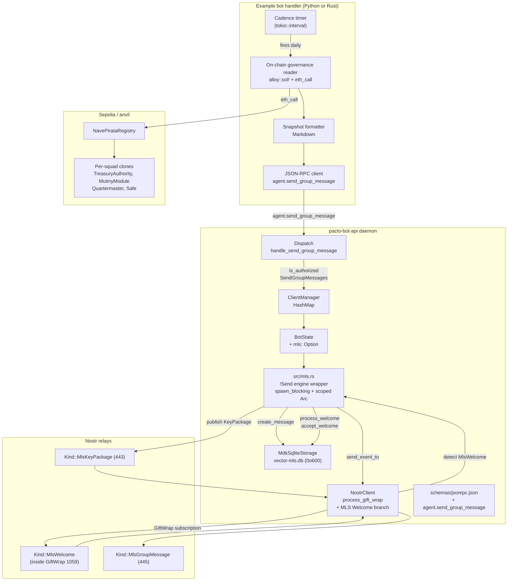
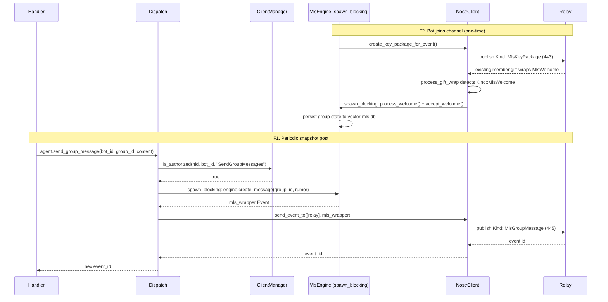
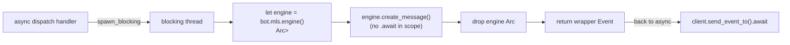

# Plan: Governance Snapshot Bot + Daemon MLS Extension + TEE Architecture Brief

## Summary

Extend `pacto-bot-api` with minimal MLS group participation (send-only) by depending on `mdk-core` 0.5.2, add a `SendGroupMessages` capability and `agent.send_group_message` JSON-RPC method, build an on-chain governance reader (Sepolia `pacto-gov` contracts) and Markdown snapshot formatter in an example bot handler, and produce a standalone TEE-hosted private-agent architecture brief. Phase 2 stretch (`!snapshot` interactive command) is planned but gated on Phase 1 success.

## Problem Frame

The `pacto-bot-api` daemon multiplexes Nostr relay pools, encrypted DM handling, key custody, and persistence for DM-based bots, but Squad channels (MLS group messaging) and on-chain governance reads are unbuilt. The Chones hackathon is a multi-day window to prove a concrete bot pattern — a dedicated identity that reads public governance/treasury state and posts encrypted snapshots into a Pacto Squad channel — while framing the longer-term TEE-hosted private-agent destination. The daemon already has a `ReadMessages` capability that references group messages, but no MLS implementation backs it (see origin: Key Decisions). This plan brings the implementation in line with that claim and lays the architecture path for privacy-sensitive work later.

---

## Requirements

### Governance snapshot bot

- R1. The bot has a dedicated Nostr identity created via `pacto-bot-admin` and configured in `pacto-bot-api.toml`.
- R2. The bot reads public on-chain governance and treasury state from a configurable RPC endpoint. Target chain: Sepolia (chain ID 11155111); local development uses anvil (chain ID 31337) with the same `pacto-gov` contracts. Per-squad clone addresses discovered via `NavePirataRegistry.deploymentCount()` / `deploymentAt(i)` / `deployment(topHatId)`.
- R3. The bot formats a Markdown snapshot covering: active proposals (`TreasuryAuthority.proposal(id)` + `openProposalOf`), upcoming deadlines (`proposal.deadline`, `Quartermaster.pendingCrewAddAt/RemoveAt`), treasury/Safe balance (`eth_getBalance` + ERC-20 `balanceOf`), active mutinies (`MutinyModule.activeMutinyId` + `mutiny(id)`), captain/crew state (Hats `wearerStatus`), and suggested discussion prompts.
- R4. The bot posts the formatted snapshot into a Pacto Squad channel as an encrypted MLS group message.
- R5. Snapshot cadence is configurable (default daily). The handler owns the cadence timer and RPC endpoint config; these are not part of the daemon config schema (see review-questions: Q6 resolution).
- R6. Phase 1 reads public state only; it does not decrypt private Squad messages. Phase 2 stretch adds inbound MLS decryption for `!snapshot`.
- R7. The bot must post autonomously via the daemon's MLS group send capability. Human-paste fallback is not acceptable (see review-questions: Q4 resolution).

### Daemon MLS extension

- R8. The daemon gains MLS group participation by depending on `mdk-core` 0.5.2 at git rev `f46875ec6fbe1cd616e9dfb4d2aa10f56044e58c` (plus `mdk-sqlite-storage` and `mdk-storage-traits` at the same rev). Scoped to three orchestration steps: (a) publish a KeyPackage (kind:443, hex-encoded) and receive + process a Welcome for one group, (b) persist MLS group state + key material per bot identity, (c) encrypt + publish group messages via `engine.create_message()` + `client.send_event_to()`. The `mdk` engine is `!Send`; all engine calls run on `spawn_blocking` with scoped `Arc`s.
- R9. MLS group state and key material are scoped to the bot identity, never logged or returned in JSON-RPC errors. The daemon owns all MLS keys and the `vector-mls.db` SQLite file (created `0o600`). The handler never touches MLS private material. MLS keys are local-only (Ed25519/X25519); a remote NIP-46 bunker cannot service them.
- R9a. Threat model: the hackathon MLS send-only path holds group encryption keys with no re-keying. Compromise of the bot's `vector-mls.db` exposes the current epoch's encryption key, which decrypts both already-posted and future channel messages until an external re-key, because the send-only path performs no epoch advancement or re-keying. The TEE architecture (R14) is the production mitigation path.
- R10. The MLS extension is exposed through a new `SendGroupMessages` capability distinct from `SendMessages`, and a new `agent.send_group_message` JSON-RPC method in `schemas/jsonrpc.json`. The daemon enforces `is_authorized(handler_id, bot_id, "SendGroupMessages")` before any group send.
- R11. Generated Rust types (`src/*_generated.rs`) and the Python SDK (`python/`) are regenerated from the updated schema via `cargo xtask codegen`, not hand-edited.
- R12. The MLS extension works for handlers connecting over both Unix socket and HTTP transports.

### TEE architecture

- R13. A standalone brief covers: appropriate TEE platforms (AWS Nitro Enclaves, Azure Confidential VMs, SGX), packaging the daemon + bunker + handler stack for each, how sealed storage protects MLS group state and key material at rest, how attestation works (`!verify` concept with challenge-response, root of trust, measurement hash), and deployment instructions / reference architecture.
- R14. The brief explains how the bot's Nostr/MLS keys and group state are protected by sealed storage and isolation. The daemon, bunker, and handler run unchanged inside the TEE — the TEE is a deployment target, not a code redesign.
- R15. The brief is written so a follow-up sprint can implement it without re-architecting the governance bot. The follow-up work is packaging, deployment tooling, and attestation integration.
- R16. The brief includes a `!verify`-style attestation concept: freshness via challenge-response (nonce tied to the request), root of trust / attestation verification service, and the measurement/hash the user compares against.

### Hackathon artifact and process

- R17. The hackathon delivers a working demo: the bot joins a real or local anvil Squad channel via MLS Welcome and posts an encrypted group message autonomously with no human intervention. A Sepolia demo is the preferred target if a squad is bootstrapped via `DeployNavePirata.s.sol` before the demo window; anvil with deployed contracts is the accepted fallback.
- R19. Code changes follow repo conventions: `cargo xtask codegen` regenerates types, `cargo test` passes, and `make validate` passes. Tests cover new JSON-RPC methods, MLS redaction, and the actual MLS encryption path via a mock MLS group peer in `tests/support/mock_mls_peer.rs` adapted from the pacto-app smoke test, using real `mdk-core` with ephemeral in-memory SQLite (`MdkSqliteStorage::new(":memory:")`), no Docker/disk/network. Real-MLS integration tests gated behind `#[ignore]` + `PACTO_DEV_ENV=1`.
- R20. No production secrets (real `nsec`, bunker URI, HTTP token, or MLS group state/key material) are committed or logged.

### Phase 2 stretch: `!snapshot` interactive command

- R21. Phase 2 adds a `!snapshot` command handler: the bot receives inbound MLS group messages, decrypts via `engine.process_message()`, detects `!snapshot`, and posts the current snapshot on demand.
- R22. Phase 2 requires a new `Kind::MlsGroupMessage` (kind:445) subscription, separate from the GiftWrap subscription that carries Welcomes. The daemon runs a live-event dispatch loop with h-tag extraction, membership filtering, skip-own-events guard, and `spawn_blocking` for `engine.process_message()`.
- R23. Phase 2 adds a `ReceiveGroupMessages` capability alongside `SendGroupMessages`, enforced via `is_authorized` before the daemon delivers decrypted group messages to the handler.
- R24. Phase 2 expands the R9a threat model: receiving messages means processing other members' MLS commits, which can advance the group key schedule (inbound ratchet). The daemon holds the engine across an inbound event loop, not just outbound send moments.
- R25. Phase 2 is gated on Phase 1 success: R8's send-only orchestration must land and be demonstrated first. If R8 slips, Phase 2 is dropped, not layered on top.

---

## Scope Boundaries

### Deferred to Follow-Up Work

- Phase 2 (`!snapshot` interactive command, R21-R25) is planned as implementation unit U12 but explicitly gated — if R8 slips, Phase 2 is dropped from this sprint.
- Full MLS group management, re-keying, or decryption support beyond what is needed to send the snapshot.
- TEE deployment as running code during the hackathon (design brief only).
- Upgrading `mdk-core` to 0.8.0 (wire-format incompatible with 0.5.2; requires coordinating a pacto-app release).
- Running the handler in a WASM container to further protect the MLS key file.
- Cross-chain governance reads beyond Sepolia / anvil.
- A daemon-side scheduler for snapshot cadence (the handler owns the timer per R5).

### Outside this product's identity

- A general-purpose AI assistant for Pacto users.
- Non-Pacto chat integrations (Discord, Telegram, etc.).
- A no-code bot builder UI.

---

## Key Technical Decisions

- KTD-1. **Extend the daemon, not bolt on a sidecar.** Add MLS group participation to `pacto-bot-api` by depending on `mdk-core` (the same library `pacto-app` uses) and reimplementing the ~300-line orchestration layer, swapping Tauri coupling for daemon-native storage. Reuses the same crypto engine as the existing Pacto client and matches the planned Phase 2+ track in `STRATEGY.md`. (see origin: Key Decisions)

- KTD-2. **Pin `mdk-core` 0.5.2 at git rev `f46875ec6fbe1cd616e9dfb4d2aa10f56044e58c`.** mdk-core 0.8.0 on crates.io is wire-format incompatible (hex→base64 content encoding, kind:443→kind:30443 key packages). A 0.8.0 bot cannot be invited to a 0.5.2 Squad. The daemon must pin the same rev as pacto-app for interop. Dependency lines copied from `pacto-app/src-tauri/Cargo.toml:27-29`.

- KTD-3. **`!Send` engine via `spawn_blocking` with scoped `Arc`s.** The `MDK<MdkSqliteStorage>` engine is `!Send`. Every engine call runs inside `tokio::task::spawn_blocking`; the `Arc<MDK<...>>` is cloned into the blocking closure and dropped before any `.await`. This follows the pattern demonstrated in `pacto-app/src-tauri/src/mls.rs:346-397` (engine scope ends before await) and `mls.rs:1756-1795` (send via `spawn_blocking`). The daemon has no existing `spawn_blocking` usage for crypto engines — this is a new pattern for the codebase. The `!Send` property must be verified at implementation start with a static assertion (`const _: () = { fn assert_not_send<T>() where T: ?Sized {} };` against a `Send` bound) before building the wrapper around it; if `MDK<MdkSqliteStorage>` is actually `Send+Sync`, the `spawn_blocking` ceremony is unnecessary.

- KTD-4. **Per-bot MLS state in `BotState`, `vector-mls.db` owned by `MdkSqliteStorage`.** Add an `mls: Option<MlsEngineHandle>` field to `BotState` (`src/bot_state.rs:11`); `MlsEngineHandle` is `Clone` (cloning the inner `Arc<MDK<MdkSqliteStorage>>`) so `spawn_blocking` closures can clone it. No separate `MlsDatabase` struct — `MdkSqliteStorage::new(&db_path)` already creates and manages the `vector-mls.db` file and its schema (`mls_groups`, `mls_keypackage_index`, `mls_event_cursors`). A second `Connection` to the same file would risk schema conflicts with mdk's own migrations. The file lives under `$DATA_DIR/<bot_id>/vector-mls.db`; the parent dir is created with `0o700` and the db file is chmod'd to `0o600` after first open (SQLite creates the file via the process umask, so `std::fs::set_permissions` is called explicitly post-open, plus the `-wal` and `-shm` sidecar files). The existing `agent.db` continues to hold cursors/handlers/config. The `MlsEngineHandle` inner field is non-optional (`Arc<MDK<...>>`) — only the `BotState.mls` outer `Option` encodes "bot has MLS."

- KTD-5. **`SendGroupMessages` as a new capability string, `agent.send_group_message` as a new JSON-RPC method.** The capability is distinct from `SendMessages` (DM) and `ManageProfile`. The method takes `bot_id`, `group_id`, `content` and returns a hex event ID. Authorization enforced via `cm.is_authorized(hid, bot_id, "SendGroupMessages")` at the dispatch handler, mirroring the `SendMessages` check at `src/dispatch.rs:656`. Added to `is_mutating_method` (`src/transport/http.rs:410`) so HTTP requires the `x-pacto-handler-id` header.

- KTD-6. **Governance reader uses inline `alloy::sol!` bindings, not JSON ABIs.** pacto-app uses inline Solidity interface bindings generated by `alloy::sol!` (see `pacto-app/src-tauri/src/evm/contracts/pacto_gov/read_bindings.rs`). The bot mirrors this pattern: define `sol!` interfaces for `INavePirataRegistry`, `ITreasuryAuthority`, `IMutinyModule`, `IQuartermaster`, ERC-20, and Hats `wearerStatus`, then call via `eth_call` + `Provider`. No JSON ABI vendoring. Sepolia addresses resolved from `pacto-gov/deployments/11155111/full-system.json` (13 verified addresses). The bot discovers per-squad clone addresses dynamically via the registry rather than hardcoding.

- KTD-7. **MLS Welcome detection branches in the gift-wrap unwrap path.** `NostrClient::process_gift_wrap` (`src/nostr.rs:284`) currently always produces `EventType::DmReceived`. The MLS extension inspects the unwrapped rumor's `kind`: if `Kind::MlsWelcome`, it tags the `AgentEvent` with `EventType::MlsWelcomeReceived`. The existing `AgentEvent` struct (`src/events.rs:12`) is a lossy projection — it carries `content` (the rumor plaintext) but not the serialized `UnsignedEvent` that `engine.process_welcome()` requires. The seam must either (a) add a `welcome_payload: Option<serde_json::Value>` field to `AgentEvent` carrying the serialized rumor JSON for MLS Welcomes, or (b) re-serialize the rumor from `AgentEvent` fields at Stage 2. Option (a) is cleaner because `process_welcome` needs the full `UnsignedEvent` JSON (see `pacto-app/src-tauri/src/lib.rs:1341-1358`). Non-MLS rumor kinds inside a GiftWrap that are not DMs (e.g., kind:445 group messages accidentally gift-wrapped) are skipped with a diagnostics warning, not routed as `dm_received`.

- KTD-8. **TEE is a deployment target, not a runtime redesign.** The daemon, NIP-46 bunker, and bot handler run unchanged inside the TEE. The TEE provides sealed storage for MLS state, attestation for environment verification, and isolation from the host OS. The brief is a written document, not code changes to the daemon or handler. (see origin: Key Decisions, R14, R15)

- KTD-9. **Handler owns cadence and RPC config, not the daemon.** The snapshot cadence timer (`tokio::time::interval` or external cron) and the RPC endpoint URL live in the example bot handler's configuration, not in `pacto-bot-api.toml` or `schemas/config.json`. This avoids adding a daemon-side scheduler subsystem that is outside the hackathon's core scope. (see review-questions: Q6 resolution)

---

## High-Level Technical Design

### Component topology

### MLS send-only orchestration sequence

### `!Send` engine scope pattern

The `Arc<MDK<...>>` is cloned into the blocking closure, used synchronously, and dropped before control returns to the async context. No `.await` runs while the engine is in scope. This is the invariant that keeps `!Send` engine state off the async runtime.

---

## Implementation Units

### U1. Add `mdk-core` dependency and `MlsEngineHandle` wrapper

**Goal:** Bring the `mdk-core` / `mdk-sqlite-storage` / `mdk-storage-traits` dependencies into `Cargo.toml` and create the daemon-native `!Send` engine wrapper module.

**Requirements:** R8

**Dependencies:** none

**Files:**
- `Cargo.toml` — add three git deps at rev `f46875ec6fbe1cd616e9dfb4d2aa10f56044e58c` (mirror `pacto-app/src-tauri/Cargo.toml:27-29`); pin via `git = "https://github.com/marmot-protocol/mdk"` (the canonical repo; `parres-hq/mdk` is a redirect)
- `deny.toml` — add `https://github.com/marmot-protocol/mdk` to `[sources] allow-git` so `cargo deny check` does not warn/block the new git deps; note that `[bans] multiple-versions = "warn"` will fire for OpenMLS transitive deps — flag as expected for the hackathon
- `src/mls.rs` — new module: `MlsEngineHandle` struct wrapping `Arc<MDK<MdkSqliteStorage>>` (non-optional inner field), constructed from a `vector-mls.db` path; `MlsError` enum (mirror `pacto-app/src-tauri/src/mls.rs:35-63`); implement `Clone` via `Arc::clone`
- `src/lib.rs` — declare `mod mls;`

**Approach:** `MlsEngineHandle` holds `Arc<MDK<MdkSqliteStorage>>` (non-optional) and is `Clone`. Constructor `MlsEngineHandle::new_persistent(db_path)` builds `MdkSqliteStorage::new(&db_path)` then `MDK::new(storage)`, mirroring `pacto-app/src-tauri/src/mls.rs:128-147`. After `MdkSqliteStorage::new`, the constructor calls `std::fs::set_permissions(&db_path, 0o600)` because SQLite creates the file via the process umask, not the main file's mode — the existing `Database::open` (`src/db.rs:16`) does not enforce permissions on creation, only WAL mode. All public methods on `MlsEngineHandle` take `&self` and run engine calls inside `spawn_blocking`, returning results to the async caller. No `Tauri::AppHandle` coupling. At implementation start, verify the `!Send` property with a static assertion before building the `spawn_blocking` wrapper (see KTD-3).

**Memory hygiene note:** MLS introduces a new key class (Ed25519/X25519, epoch secrets) held in-process by OpenMLS. The daemon's existing `nsec` backend wraps key bytes in `zeroize`; the plan does not assume OpenMLS zeroizes internal key material on drop. At implementation start, verify whether `mdk-core`/OpenMLS zeroizes key buffers on `Drop` — if not, document the gap and note that TEE sealed storage (U11) is the production mitigation. For the hackathon, keys are held locally under the dev-only regime and the `spawn_blocking` closure's heap lifetime is short (engine Arc dropped before returning to async).

**Patterns to follow:** `pacto-app/src-tauri/src/mls.rs:107-152` (MlsService struct, engine access), `src/signer.rs` (error enum style).

**Test scenarios:**
- **Happy path:** `MlsEngineHandle::new_persistent` with a tempfile path succeeds; engine is initialized.
- **Edge case:** `MlsEngineHandle::new_persistent` with a path whose parent doesn't exist returns `MlsError::StorageError`.
- **Edge case:** The `vector-mls.db` file is created with `0o600` permissions (assert via `std::fs::metadata`) — this test must run with a permissive umask to prove the `set_permissions` call overrides umask.
- **Error path:** `cargo build` succeeds and `cargo deny check` does not warn for the mdk git source after `deny.toml` is updated.

**Verification:** `cargo build` compiles with the new deps. `cargo deny check` passes without unknown-git warnings. The `MlsEngineHandle` struct exists, is `Clone`, and its constructor creates a `0o600` db file. A static assertion confirms `MDK<MdkSqliteStorage>` is `!Send` (or the `spawn_blocking` ceremony is dropped if it is `Send`).

---

### U2. Per-bot MLS state in `BotState` + vector-mls.db wiring

**Goal:** Wire per-bot MLS state into the daemon's bot identity lifecycle; ensure `vector-mls.db` is created with `0o600` permissions including WAL sidecar files.

**Requirements:** R8, R9

**Dependencies:** U1

**Files:**
- `src/bot_state.rs` — add `mls: Option<MlsEngineHandle>` field to `BotState`; add `BotState::new_with_mls(config, mls_db_path)` constructor alongside the existing `BotState::new(config)` (preserves the 4 existing call sites: `src/client_manager.rs:39`, `src/bot_state.rs:93`, `src/bot_state.rs:101`, `tests/diagnostics.rs:253`)
- `src/client_manager.rs` — `ClientManager::new` gains a `data_dir` parameter so the MLS db path (`$DATA_DIR/<bot_id>/vector-mls.db`) can be derived per bot; pass to `BotState::new_with_mls` for MLS-configured bots, `BotState::new` for non-MLS bots
- `src/main.rs` — pass `data_dir` into `ClientManager::new` (near `src/main.rs:234`); create the per-bot `$DATA_DIR/<bot_id>/` parent dir with `0o700` before constructing `MlsEngineHandle`

**Approach:** `BotState` gains an `mls: Option<MlsEngineHandle>` field. The `vector-mls.db` path is derived from the daemon's `data_dir` + `bot_id`. `MdkSqliteStorage::new(&db_path)` (from U1) creates and manages the file and its schema — no separate `MlsDatabase` struct or migrations. After `MdkSqliteStorage::new`, the wrapper calls `std::fs::set_permissions(&db_path, 0o600)` and the same for `vector-mls.db-wal` and `vector-mls.db-shm` if they exist, because SQLite creates files via the process umask, not the main file's mode. The existing `agent.db` continues to hold cursors/handlers/config. The `mls` field is `Option` so non-MLS bots (existing DM-only bots) use `BotState::new` unchanged.

**Patterns to follow:** `src/bot_state.rs:11-26` (BotState struct, new), `src/config.rs:172` (permission validation — note: this only validates existing files; creation enforcement is new).

**Test scenarios:**
- **Happy path:** A `BotState` with an MLS db path initializes `mls: Some(...)` via `new_with_mls`.
- **Happy path:** A `BotState` without MLS config initializes `mls: None` via `new` (backward compat for existing DM-only bots — no call-site changes).
- **Edge case:** Two bots with different `bot_id`s get different `vector-mls.db` paths.
- **Integration:** `vector-mls.db` is created with `0o600` permissions including `-wal` and `-shm` sidecar files (assert via `std::fs::metadata` after a write triggers WAL creation) (Covers R9).
 - **Error path:** The parent `$DATA_DIR/<bot_id>/` dir is created with `0o700` before the db; if creation fails (e.g., permission denied), returns `MlsError::StorageError`.

**Verification:** Existing `cargo test` still passes (no regression for DM-only bots — `BotState::new` signature unchanged). New `BotState::new_with_mls` tests pass. `vector-mls.db` and sidecar files are `0o600`.

---

### U3. MLS send-only orchestration: KeyPackage publish, Welcome accept, create_message + send

**Goal:** Implement the three R8 orchestration steps on the daemon side: publish a KeyPackage, receive + accept a Welcome, encrypt + publish a group message.

**Requirements:** R8

**Dependencies:** U1, U2

**Files:**
- `src/mls.rs` — add methods to `MlsEngineHandle`:
  - `publish_key_package(&self, pubkey, relay_urls) -> (encoded_kp, tags)` wrapping `engine.create_key_package_for_event()`
  - `process_welcome(&self, wrapper_id, welcome_rumor) -> ()` wrapping `engine.process_welcome()`
  - `accept_pending_welcome(&self) -> GroupInfo` wrapping `engine.get_pending_welcomes()` + `engine.accept_welcome()`
  - `create_group_message(&self, group_id, rumor) -> Event` wrapping `engine.create_message()`
- `src/nostr.rs` — add `publish_key_package(&self, signer, pubkey, relay_urls)` and `send_group_message(&self, signer, group_msg_event, relay_urls)` methods to `NostrClient`, using `client.send_event_to()`

**Approach:** Each method clones the `Arc<MDK<...>>` into a `spawn_blocking` closure, runs the engine call synchronously, drops the Arc, and returns the result. The `publish_key_package` method builds and signs the kind:443 event with the bot's `Signer` (the same `sign_unsigned_event` helper at `src/nostr.rs:354` is reused). The `send_group_message` method takes the MLS wrapper event produced by `create_message` and publishes it via `client.send_event_to([relay], &event)`. Welcome acceptance persists group state to the `MlsDatabase` from U2.

**Patterns to follow:** `pacto-app/src-tauri/src/mls.rs:1608-1622` (KeyPackage publish), `mls.rs:1665-1676` (Welcome accept), `mls.rs:1690-1694` (create_message + send_event_to), `src/nostr.rs:132-190` (send_dm gift-wrap publish pattern).

**Test scenarios:**
- **Happy path:** `publish_key_package` produces a kind:443 event with hex-encoded content and tags; the event is signed by the bot's signer.
- **Happy path:** `process_welcome` + `accept_pending_welcome` on a mock welcome produces a `GroupInfo` with a valid `engine_group_id`.
- **Happy path:** `create_group_message` produces a kind:445 MLS wrapper event with an `h` tag containing the group wire ID.
- **Error path:** `create_group_message` with an unknown `group_id` returns `MlsError::GroupNotFound`.
- **Error path:** `create_group_message` before any Welcome is accepted returns `MlsError::NotInitialized`.
- **Error path:** `create_group_message` after a fatal MLS engine error (corrupted group state) returns `MlsError::GroupPoisoned` — the daemon marks the group as poisoned in `agent.db` (not `vector-mls.db`, which may be corrupt), logs the error, and skips future sends to that group. Recovery requires deleting `vector-mls.db` and re-inviting the bot (fresh KeyPackage + Welcome).
- **Integration:** A test simulates a corrupted group state (e.g., truncate `vector-mls.db` mid-write) and verifies the daemon returns `GroupPoisoned` rather than retrying indefinitely or panicking.

**Verification:** Methods exist and compile. Unit tests with in-memory `MdkSqliteStorage::new(":memory:")` exercise the engine calls. The poisoned-group test returns a clean error, not a panic.

---

### U4. MLS Welcome detection in the gift-wrap unwrap path

**Goal:** Branch the gift-wrap receive path so MLS Welcomes are routed to the MLS engine instead of being dispatched as `dm_received` events.

**Requirements:** R8, R9

**Dependencies:** U2, U3

**Files:**
- `src/nostr.rs` — modify `process_gift_wrap` (`src/nostr.rs:284`) to inspect the unwrapped rumor's `kind` after the seal decrypt; if `Kind::MlsWelcome`, return an `AgentEvent` tagged with `EventType::MlsWelcomeReceived` instead of `EventType::DmReceived`. `process_gift_wrap` is a static method with access only to the `signers` map, not to `BotState`/`MlsEngineHandle`, so it tags the event and returns — it does not invoke the MLS engine itself.
- `src/events.rs` — add `EventType::MlsWelcomeReceived` variant so the dispatch layer can route it
- `src/dispatch.rs` — in `dispatch_event`, branch on `EventType::MlsWelcomeReceived`: look up the bot's `MlsEngineHandle` via `ClientManager` (which `Dispatch` holds as `Arc<RwLock<ClientManager>>`), call `process_welcome` + `accept_pending_welcome` on `spawn_blocking`, and skip the handler fan-out. Non-MLS events (`DmReceived`) follow the existing path unchanged.

**Approach:** The seam is two-stage because `process_gift_wrap` (`src/nostr.rs:284`) is a static method with no access to `BotState` or `ClientManager`, while `Dispatch::dispatch_event` holds the `ClientManager` and therefore the bot's `MlsEngineHandle`. Stage 1: `process_gift_wrap` inspects `rumor.kind` after the seal decrypt (`src/nostr.rs:332`); if `Kind::MlsWelcome`, it tags the `AgentEvent` with `EventType::MlsWelcomeReceived` and returns it. Stage 2: the notification consumer loop in `src/main.rs:342-352` receives this `AgentEvent` and calls `dispatch.dispatch_event(event)`; `dispatch_event` branches on the event type — MLS Welcomes go to `MlsEngineHandle::process_welcome` + `accept_pending_welcome` on `spawn_blocking`, DMs fan out to handlers as before. Because any Nostr user can craft and gift-wrap a `Kind::MlsWelcome` to the bot, `process_welcome`/`accept_pending_welcome` run inside `std::panic::catch_unwind` within the `spawn_blocking` closure — a caught panic is converted to `MlsError::CryptoError` with a generic message (the panic payload is discarded, never logged, since it may contain key material from the already-initialized engine). Non-MLS rumor kinds inside a GiftWrap that are not DMs are skipped with a diagnostics warning, not routed as `dm_received`. This keeps a single GiftWrap subscription carrying both DMs and MLS Welcomes, matching F2.

**Test scenarios:**
- **Happy path:** A gift-wrapped MLS Welcome addressed to a bot with an `MlsEngineHandle` is processed: `process_welcome` succeeds, group state is persisted, no `dm_received` event is dispatched to handlers.
- **Happy path:** A gift-wrapped DM (non-MLS) addressed to the same bot is processed: `dm_received` event is dispatched as before (no regression).
- **Edge case:** A gift-wrapped MLS Welcome addressed to a bot with `mls: None` (non-MLS bot) returns an error and is logged, not crashed.
- **Error path:** A malformed MLS Welcome content fails `process_welcome`; the error is recorded in diagnostics and the event is skipped (no panic).
- **Adversarial input:** A truncated/corrupted Welcome blob from an untrusted Nostr sender triggers a panic inside `process_welcome`; `catch_unwind` converts it to `MlsError::CryptoError` with a generic message — the panic payload does not appear in logs or errors (Covers R9, R20).
- **Integration:** `process_gift_wrap` with a real MLS Welcome round-trips through `MlsEngineHandle` and persists group state to `vector-mls.db`.

**Verification:** Existing DM tests pass (no regression). New test exercises MLS Welcome detection with a mock MLS peer Welcome.

---

### U5. Schema: `SendGroupMessages` capability + `agent.send_group_message` method

**Goal:** Add the new capability and JSON-RPC method to the schema, regenerate types, and wire the method into the dispatch and transport layers.

**Requirements:** R10, R11, R12

**Dependencies:** U3

**Files:**
- `schemas/jsonrpc.json` — add `agent.send_group_message` method entry with params (`bot_id`, `group_id`, `content`) and result (hex event id string); add `agent.publish_key_package` method entry with params (`bot_id`) and result (hex event id string) — the handler calls this on startup so the bot can be invited to a Squad (F2 step 1)
- `src/transport/protocol.rs` — add `Method::AgentSendGroupMessage` and `Method::AgentPublishKeyPackage` variants (`:157`), `FromStr` arms (`:208`), `Method::all()` entries (`:186`)
- `src/dispatch.rs` — add `Method::AgentSendGroupMessage` and `Method::AgentPublishKeyPackage` match arms (`:489`); implement `handle_send_group_message` and `handle_publish_key_package`; enforce `cm.is_authorized(hid, bot_id, "SendGroupMessages")` mirroring `src/dispatch.rs:656`
- `src/transport/http.rs` — add `AgentSendGroupMessage` to `is_mutating_method` (`:410`)
- `src/admin.rs` — add `SendGroupMessages` to the valid capability list (`:1072`)
- `src/config.rs` — add `SendGroupMessages` to capability validation
- `python/` — regenerated via `cargo xtask codegen`

**Approach:** The schema is the source of truth. After adding both methods to `schemas/jsonrpc.json`, run `cargo xtask codegen` to regenerate `src/transport/protocol_generated.rs` and the Python SDK. The `handle_send_group_message` method validates authorization, rate-limits (reusing the existing `RateLimiter` at `src/dispatch.rs:663`), then calls `MlsEngineHandle::create_group_message` on `spawn_blocking` and `NostrClient::send_group_message` to publish. The `handle_publish_key_package` method validates `SendGroupMessages` authorization, then calls `MlsEngineHandle::publish_key_package` on `spawn_blocking` and `NostrClient::publish_key_package` to publish the kind:443 event. The capability string `SendGroupMessages` is added to the admin CLI's valid-capability list so `pacto-bot-admin new --capabilities SendGroupMessages` works.

**Patterns to follow:** `src/dispatch.rs:618-677` (handle_send_dm_msg + handle_send_dm), `src/transport/protocol.rs:157-224` (Method enum, FromStr, all()), `tests/schema_sync.rs` (sync gate).

**Test scenarios:**
- **Happy path:** A handler registered with `SendGroupMessages` calls `agent.send_group_message` and receives a hex event id.
- **Error path:** A handler registered without `SendGroupMessages` gets `UnauthorizedBot` error (Covers R10).
- **Error path:** An unknown `bot_id` returns `UnknownBot` error.
- **Error path:** An unknown `group_id` returns an MLS error (not a panic).
- **Integration:** The method works over both Unix socket and HTTP transports (Covers R12).
- **Integration:** `tests/schema_sync.rs` passes — the `Method` enum, schema, and generated Python are in sync (Covers R11).

**Verification:** `cargo xtask codegen` succeeds. `tests/schema_sync.rs` passes. `cargo test` passes with new method tests.

---

### U6. MLS secret redaction coverage

**Goal:** Ensure MLS group state, key material, and `vector-mls.db` content never appear in logs or JSON-RPC errors.

**Requirements:** R9, R20

**Dependencies:** U1, U2, U5

**Files:**
- `src/diagnostics.rs` — extend `redact_secrets` (`src/diagnostics.rs:402`) to redact MLS-specific patterns (e.g., `vector-mls.db` path content, hex-encoded key package payloads, MLS epoch secret material)
- `tests/secret_redaction.rs` — add MLS secret markers to the synthetic secret fixture and assert no leakage through log sinks, error paths, and binary strings
- `tests/dispatch_integration.rs` — add a test that an MLS error (e.g., `GroupNotFound`) returned via JSON-RPC does not contain `vector-mls.db` content or key material

**Approach:** The existing `redact_secrets` function redacts `nsec1...`, `secret=...`, `token=...`. Add patterns for MLS key material: hex blobs that look like MLS key packages (long hex strings in error messages), and `vector-mls.db` file content. The `MlsError` enum's `Display` impl (`src/mls.rs`) must not include key material in error strings — it uses generic messages like "storage error" without echoing the db content. The secret-redaction test suite injects synthetic MLS markers and asserts they don't leak.

**Patterns to follow:** `src/diagnostics.rs:402-430` (redact_secrets), `tests/secret_redaction.rs`, `tests/support/secret_scan.rs` (SecretScanner fixture), `tests/dispatch_integration.rs:1152-1219` (redaction in dispatch error path).

**Test scenarios:**
- **Happy path:** An `MlsError::StorageError` containing a synthetic MLS secret marker is redacted in diagnostics — the marker does not appear in the flushed report (Covers R9, R20).
- **Happy path:** An MLS error returned via `agent.send_group_message` JSON-RPC response does not contain `vector-mls.db` content.
- **Edge case:** A log line emitted during MLS Welcome processing does not contain the Welcome payload or key material.
- **Integration:** `tests/secret_redaction.rs` passes with MLS markers added to the fixture.

**Verification:** `cargo test --test secret_redaction` passes. `cargo test --test dispatch_integration` passes. No MLS secret markers leak.

---

### U7. Mock MLS group peer test (default suite, real `mdk-core`)

**Goal:** Prove the MLS encryption path works end-to-end in the Docker-free default test suite using real `mdk-core` with ephemeral in-memory SQLite.

**Requirements:** R19

**Dependencies:** U3, U4, U5

**Files:**
- `tests/support/mock_mls_peer.rs` — new mock MLS peer: creates an in-memory `MDK<MdkSqliteStorage::new(":memory:")>`, publishes a KeyPackage, accepts a Welcome, and validates an encrypted application message. Adapted from `pacto-app/src-tauri/src/mls.rs:1578-1740` smoke test (~100 lines: ~70 MLS logic + ~30 wrapper).
- `tests/support/mod.rs` — declare `mod mock_mls_peer;`
- `tests/mls_integration.rs` — new integration test: two in-memory MLS engines (bot + peer), KeyPackage publish → group create → Welcome accept → `create_message` → `process_message` round-trip. Asserts the decrypted plaintext matches the sent content. No Docker, no disk, no network.

**Approach:** The mock peer creates its own `MDK<MdkSqliteStorage::new(":memory:")>` engine. The test creates the bot's `MlsEngineHandle` with a `:memory:` db, publishes a KeyPackage, the mock peer creates a group with the bot's KeyPackage, the bot processes the Welcome and accepts it, the bot calls `create_group_message` with a test rumor, the mock peer calls `process_message` on the wrapper and asserts the decrypted content matches. This is a real MLS crypto round-trip — Welcome processing, key-schedule derivation, and encryption all execute. The test is in the default `cargo test` suite (no `#[ignore]`).

**Patterns to follow:** `pacto-app/src-tauri/src/mls.rs:1578-1740` (smoke test structure: two ephemeral Keys, two in-memory engines, KeyPackage→group→welcome→message→process).

**Test scenarios:**
- **Happy path:** Bot publishes KeyPackage; mock peer creates group with bot as member; bot accepts Welcome; bot sends encrypted message; mock peer decrypts and asserts plaintext matches (Covers R19).
- **Happy path:** The MLS wrapper event has `kind:445` and an `h` tag.
- **Edge case:** Bot sends a message before accepting any Welcome — returns `MlsError::NotInitialized` (no panic).
- **Integration:** Real-MLS relay test gated behind `#[ignore]` + `PACTO_DEV_ENV=1` — bot and peer exchange via a mock relay (reuse `tests/support/mock_relay.rs`), not in-memory handoff.

**Verification:** `cargo test` (default suite) passes with the MLS round-trip test. `cargo test -- --ignored` requires `PACTO_DEV_ENV=1`.

---

### U8. On-chain governance reader (Sepolia `pacto-gov` contracts)

**Goal:** Build the module that reads public governance and treasury state from Sepolia/anvil and returns structured data for the snapshot formatter.

**Requirements:** R2, R3

**Dependencies:** none (independent of daemon MLS work; can proceed in parallel)

**Files:**
- `Cargo.toml` (root workspace) — add `crates/governance-bot` to `[workspace] members` so `cargo test --workspace` includes it; Python examples live under `python/examples/` and Rust example crates live under `crates/`
- `crates/governance-bot/Cargo.toml` — new example crate manifest with `alloy`, `tokio`, `serde`, `reqwest`; note that `deny.toml [sources] allow-git` may need updating for alloy's git deps if any
- `crates/governance-bot/src/evm/mod.rs` — new EVM reader module
- `crates/governance-bot/src/evm/bindings.rs` — inline `alloy::sol!` bindings for `INavePirataRegistry` (Deployment struct, `deploymentCount`, `deploymentAt`, `deployment`), `ITreasuryAuthority` (`proposal`, `openProposalOf`), `IMutinyModule` (`activeMutinyId`, `mutiny`), `IQuartermaster` (`pendingCrewAddAt`, `pendingCrewRemoveAt`, `crewChangeDelay`), ERC-20 (`balanceOf`), Hats (`wearerStatus`). Mirror `pacto-app/src-tauri/src/evm/contracts/pacto_gov/read_bindings.rs`.
- `crates/governance-bot/src/evm/addresses.rs` — Sepolia infrastructure addresses from `pacto-gov/deployments/11155111/full-system.json` (NavePirataRegistry: `0x45127C1c92741C0dA38e1A73fbb97a8a2C46770f`, etc.) + anvil override via env var
- `crates/governance-bot/src/evm/reader.rs` — `GovernanceReader` struct with a `Provider`; methods: `discover_squads()` (registry → deploymentCount → deploymentAt → deployment), `read_proposals(treasury_authority)`, `read_mutiny(mutiny_module)`, `read_crew_deadlines(quartermaster)`, `read_treasury_balance(safe)`, `read_crew_state(hats, captain_hat, crew_hat)`
- `crates/governance-bot/src/evm/snapshot.rs` — `SnapshotData` struct aggregating all R3 fields; `GovernanceReader::snapshot(squad_index)` orchestrates the reads

**Approach:** The reader uses `alloy` with a `reqwest`-backed HTTP provider pointing at the configurable RPC endpoint (Sepolia public RPC or anvil localhost). Per-squad clone addresses are discovered dynamically via `NavePirataRegistry.deploymentCount()` → `deploymentAt(i)` → `deployment(topHatId)`, returning the 14-field `Deployment` tuple (safe, quartermaster, mutinyModule, treasuryAuthority, squadAdminProxy, hat IDs, deployedAt, deployer). Each R3 field maps to a contract read:
- Proposals: `TreasuryAuthority.proposal(id)` returns (proposer, to, value, op, data, deadline, snapshot, yeas, nays, captainApproved, captainDefeated, executed); iterate via `openProposalOf(proposer)` to find active proposal IDs.
- Mutinies: `MutinyModule.activeMutinyId()` → `mutiny(id)` returns (proposedNewCaptain, startedAt, snapshot, yeas, executed).
- Deadlines: `Quartermaster.pendingCrewAddAt(candidate)` / `pendingCrewRemoveAt(crew)` return executableAt timestamps.
- Treasury: `eth_getBalance(safe)` + ERC-20 `balanceOf(safe)` for known tokens.
- Crew: Hats `wearerStatus(hatId, wearer)` returns active/inactive.

**Patterns to follow:** `pacto-app/src-tauri/src/evm/contracts/pacto_gov/read_bindings.rs` (alloy::sol! inline bindings), `pacto-app/src-tauri/src/evm/nave_pirata_read.rs` (registry read pattern), `pacto-app/src-tauri/src/evm/gov_read.rs` (provider connection).

**Test scenarios:**
- **Happy path:** `discover_squads()` against an anvil node with a deployed squad returns a non-empty list with valid clone addresses.
- **Happy path:** `read_proposals` against a TreasuryAuthority with one open proposal returns the proposal struct with correct deadline and vote counts.
- **Happy path:** `read_treasury_balance` against a Safe with ETH and one ERC-20 returns both balances.
- **Edge case:** `discover_squads` when `deploymentCount()` returns 0 returns an empty list (current Sepolia state — no squads bootstrapped yet).
- **Edge case:** `read_proposals` with no open proposals returns an empty list (not an error).
- **Error path:** RPC endpoint unreachable returns a provider error (not a panic); the reader surfaces it to the handler for retry/backoff.
- **Integration:** A squad deployed via `DeployNavePirata.s.sol` on anvil produces readable state for all R3 fields.

**Verification:** Anvil-based integration test passes (requires local anvil + deployed contracts, gated behind `PACTO_DEV_ENV=1`). Unit tests with mock provider responses pass in the default suite.

---

### U9. Snapshot formatter (Markdown)

**Goal:** Format the structured governance data into a Markdown summary suitable for posting to a Squad channel.

**Requirements:** R3

**Dependencies:** U8

**Files:**
- `crates/governance-bot/src/snapshot/format.rs` — `format_snapshot(SnapshotData) -> String` producing Markdown with sections for proposals, deadlines, treasury, mutinies, crew state, and discussion prompts
- `crates/governance-bot/src/snapshot/mod.rs` — module declaration

**Approach:** The formatter takes the `SnapshotData` from U8 and produces a Markdown document with headers per R3 section: active proposals (with deadline, vote counts, captain status), upcoming deadlines (crew add/remove timelocks), treasury balance summary (ETH + ERC-20s), active mutinies (proposed new captain, yeas), captain/crew state (active/inactive via Hats), and suggested discussion prompts derived from the data (e.g., "Proposal #3 deadline is in 2 days — discuss"). The exact template shape emerges from the contracts (see origin: Q4) — this unit defines the structure, the implementer refines prompts based on real data.

**Patterns to follow:** No existing Markdown formatter in the repo; this is greenfield but simple string formatting.

**Test scenarios:**
- **Happy path:** A `SnapshotData` with one open proposal, one pending crew add, treasury balance, and no active mutiny produces a Markdown string containing all sections.
- **Happy path:** The Markdown contains the proposal deadline, vote counts (yeas/nays), and captain approval status.
- **Edge case:** A `SnapshotData` with zero proposals produces a snapshot with an "No active proposals" line, not an empty section.
- **Edge case:** A `SnapshotData` with an active mutiny includes the mutiny section; without one, the section is omitted or says "No active mutiny."

**Verification:** Unit tests assert the Markdown output contains expected sections and field values for a constructed `SnapshotData`.

---

### U10. Example governance bot handler (cadence + read + format + send)

**Goal:** Wire the on-chain reader, snapshot formatter, and daemon MLS send into a runnable example bot that posts snapshots autonomously on a configurable cadence.

**Requirements:** R1, R4, R5, R7, R17

**Dependencies:** U5, U8, U9

**Files:**
- `crates/governance-bot/src/main.rs` — bot entrypoint: loads config (RPC endpoint, squad index, cadence, bot_id, group_id), connects to the daemon via JSON-RPC (Unix socket or HTTP), registers with `SendGroupMessages` capability, runs a `tokio::time::interval` loop that reads → formats → sends
- `crates/governance-bot/src/config.rs` — handler-local config (RPC URL, squad index, cadence interval, daemon socket path, bot_id, group_id); loaded from env vars or a local config file (not `pacto-bot-api.toml`)
- `crates/governance-bot/Cargo.toml` — example crate manifest with `alloy`, `tokio`, `serde`, `reqwest`, and a dependency on the generated Python SDK or direct JSON-RPC client
- `crates/governance-bot/README.md` — setup instructions (create bot identity, configure, deploy squad on anvil/Sepolia, run)

**Approach:** The handler is a standalone process that connects to the daemon over JSON-RPC. It registers for the bot with `SendGroupMessages` capability. On a configurable interval (default daily per R5), it calls the governance reader (U8), formats the snapshot (U9), and calls `agent.send_group_message` on the daemon. Failed posts are retried with backoff (see origin: Q5) — the handler owns retry logic, not the daemon. No human-paste fallback (R7). The bot identity is created via `pacto-bot-admin new` (R1) and the bot must have published a KeyPackage and accepted a Welcome before it can send (the handler triggers KeyPackage publish on startup via a daemon method or a one-time setup step).

**Patterns to follow:** `examples/` existing Python bots for JSON-RPC client patterns, `src/dispatch.rs:618-677` (send_dm flow the handler invokes).

**Test scenarios:**
- **Happy path:** The handler connects to a running daemon, registers with `SendGroupMessages`, and a `agent.send_group_message` call returns a hex event id.
- **Happy path:** On cadence fire, the handler reads governance state (mock or anvil), formats a snapshot, and sends it via the daemon.
- **Error path:** If the daemon returns an MLS error (e.g., bot hasn't accepted a Welcome), the handler logs the error and retries on the next cadence (no crash).
- **Error path:** If the RPC endpoint is unreachable, the handler logs and retries with backoff (no crash, no human-paste fallback).
- **Integration:** End-to-end demo (gated `#[ignore]`): bot identity created, KeyPackage published, Welcome accepted from a real Squad, handler posts a snapshot into the channel autonomously (Covers R17).

**Verification:** The example compiles. `cargo test` in the example crate passes unit tests. The `#[ignore]` integration test requires `PACTO_DEV_ENV=1` + a running daemon + deployed squad.

---

### U11. TEE-hosted private agent architecture brief

**Goal:** Produce a standalone written brief covering TEE platform selection, packaging, sealed storage, attestation, and deployment for the daemon + bunker + handler stack.

**Requirements:** R13, R14, R15, R16

**Dependencies:** none (documentation; can proceed in parallel with all other units)

**Files:**
- `docs/tee-private-agent-architecture.md` — standalone brief

**Approach:** The brief covers (per R13):
1. **Platform comparison:** AWS Nitro Enclaves, Azure Confidential VMs, Intel SGX — compare isolation model, sealed storage mechanism, attestation flow, memory/CPU constraints, and packaging complexity. Recommend a primary platform for the Pacto stack with rationale.
2. **Packaging the stack:** How to package the daemon (`pacto-bot-api`), the NIP-46 bunker, and the bot handler for each platform. The daemon is a Rust binary; the bunker may be a separate process; the handler is a separate process. All three run unchanged inside the TEE (R14, R15).
3. **Sealed storage for MLS state:** How `vector-mls.db` and MLS key material are protected at rest by the TEE's sealed storage (e.g., Nitro Enclave's parent-to-enclave vsock + EBS attach, SGX's sealed key via `sgx_seal_data`, Azure CVM's OS-level encryption-at-rest with confidential-disk). The `0o600` file permission is preserved; the TEE adds the sealing layer.
4. **Attestation (`!verify` concept per R16):** Challenge-response flow — a user's client sends a nonce, the TEE produces an attestation report containing the nonce + measurement hash, the client verifies the report against the platform's root of trust (e.g., Nitro Enclave's AWS KMS attestation, SGX's IAS/DCAP, Azure's HCL attest). The user compares the measurement hash against a published expected value to confirm the expected daemon code is running.
5. **Deployment / reference architecture:** Step-by-step deployment for the recommended platform. The follow-up sprint implements this without re-architecting the governance bot (R15) — the daemon, mdk MLS integration, bot identity, handler contract, and signing model all run unchanged.

**Patterns to follow:** `signal-bot-tee` repository (reference TEE bot pattern, per origin: Sources), `docs/security-overview.md` (existing security model doc style), `docs/key-and-secret-security.md` (key hygiene doc style).

**Test expectation:** none — documentation deliverable.

**Verification:** The brief exists at `docs/tee-private-agent-architecture.md` and addresses all R13-R16 sub-points (platforms, packaging, sealed storage, attestation, deployment).

---

### U12. Phase 2 stretch: `!snapshot` inbound MLS message dispatch

**Goal:** Add inbound MLS group message decryption and the `!snapshot` command handler. GATED on Phase 1 success (R25) — if U1-U10 slip, this unit is dropped.

**Requirements:** R21, R22, R23, R24

**Dependencies:** U3, U4, U5, U7, U10 (all Phase 1 must land first)

**Files:**
- `src/nostr.rs` — add `Kind::MlsGroupMessage` (kind:445) subscription alongside the GiftWrap subscription in `subscribe_bots`; add a notification stream for group messages
- `src/mls.rs` — add `process_group_message(&self, event) -> PlaintextResult` wrapping `engine.process_message()` on `spawn_blocking`
- `src/events.rs` — add `EventType::MlsGroupMessageReceived`
- `src/dispatch.rs` — live-event dispatch loop for kind:445: extract `h` tag (group wire ID), check membership against the bot's known groups, skip own events (compare `event.pubkey` with bot's signer pubkey), `spawn_blocking` for `process_message`, deliver plaintext to handlers with `ReceiveGroupMessages` capability
- `src/handlers.rs` / `src/transport/protocol.rs` — add `ReceiveGroupMessages` capability string
- `src/admin.rs` — add `ReceiveGroupMessages` to the valid capability list (`:1072`)
- `src/config.rs` — add `ReceiveGroupMessages` to capability validation
- `schemas/jsonrpc.json` — add `ReceiveGroupMessages` capability reference to `agent.event` notification params
- `python/` — regenerated via `cargo xtask codegen`
- `crates/governance-bot/src/main.rs` — detect `!snapshot` in delivered plaintext and trigger the same read + format + send flow as F1

**Approach:** The daemon subscribes to `Kind::MlsGroupMessage` (kind:445) per bot, in addition to the existing GiftWrap subscription. On receipt, it extracts the group wire ID from the `h` tag, checks whether the bot is a member of that group (via persisted group state), skips events the bot itself published, and calls `engine.process_message()` on `spawn_blocking` to decrypt. The decrypted plaintext is delivered to handlers registered with `ReceiveGroupMessages` via a new `agent.event` notification type. The handler checks for `!snapshot` in the plaintext and responds by posting the current snapshot. This expands the R9a threat model (R24): the daemon now holds the engine across an inbound event loop, processing other members' MLS commits which can advance the group key schedule.

**Patterns to follow:** `pacto-app/src-tauri/src/lib.rs:1954-2512` (live dispatch handler: kind:445 subscription, h-tag extraction, membership filter, skip-own-events, `spawn_blocking` process_message), `src/nostr.rs:239-283` (receive_events stream pattern).

**Test scenarios:**
- **Happy path:** Mock peer sends an encrypted group message; daemon decrypts via `process_message`, delivers plaintext to handler with `ReceiveGroupMessages` capability (Covers R21, R23).
- **Happy path:** Handler detects `!snapshot` in plaintext and posts a snapshot on demand (Covers R21).
- **Edge case:** Daemon skips group messages it published itself (skip-own-events guard).
- **Edge case:** Daemon ignores group messages for groups the bot isn't a member of (membership filter).
- **Error path:** `process_message` fails on a malformed message; error is recorded, event skipped (no panic).
- **Error path:** Handler without `ReceiveGroupMessages` capability does not receive the decrypted message.
- **Integration:** `!snapshot` round-trip in the default test suite via mock MLS peer (Covers R22).

**Verification:** `cargo test` passes with inbound MLS dispatch tests. The `!snapshot` command works end-to-end in the mock peer test.

---

## System-Wide Impact

- **New cryptographic subsystem.** MLS group messaging is unrelated to the existing NIP-44/59 gift-wrap DM path. It introduces a new key class (Ed25519/X25519), a new SQLite file (`vector-mls.db`), and the `!Send`/`spawn_blocking` engine pattern. Existing DM-only bots are unaffected — the `mls` field on `BotState` is `Option`.
- **Schema-first contract evolution.** Adding `agent.send_group_message` to `schemas/jsonrpc.json` triggers codegen regeneration and the `tests/schema_sync.rs` gate. The Python SDK gains a new method. Any handler using the SDK can call it.
- **Capability model extension.** `SendGroupMessages` (and `ReceiveGroupMessages` in Phase 2) join `ReadMessages`, `SendMessages`, `ManageProfile` as authorization strings. The admin CLI, config validation, and dispatch authorization all gain new entries. No existing capability is renamed or removed.
- **Secret surface expansion.** MLS key material (key packages, epoch secrets, group state) is a new secret class that must not leak through logs, errors, or diagnostics. The redaction suite extends to cover it.
- **Dependency footprint.** Three new git dependencies (`mdk-core`, `mdk-sqlite-storage`, `mdk-storage-traits`) at a pinned rev. These bring OpenMLS and its transitive deps into the build. Build times and binary size increase. The pin must not drift from pacto-app's rev or wire-format interop breaks.
- **Failure propagation for `spawn_blocking` (new pattern).** The daemon has no existing `spawn_blocking` usage for crypto engines. Event dispatch errors are isolated — `src/main.rs:342-352` spawns each event into its own task and logs failures with `warn!` (the daemon does not crash on a single event error). But `spawn_blocking` returns a `JoinResult` that must be handled: a panic inside the MLS engine (corrupted `vector-mls.db`, OpenMLS internal error) surfaces as a `JoinError`. The MLS wrapper must convert `JoinError` to a `DaemonError` (e.g., `MlsError::StorageError`) and return it to the caller — never `unwrap` the join result. A corrupted `vector-mls.db` at startup crashes the daemon (the existing `Database::open` error propagation at `src/main.rs:189` is fatal); at runtime, an MLS engine error degrades the single bot (the handler gets a JSON-RPC error) without affecting other bots or crashing the daemon, matching the isolation pattern for DM dispatch errors.
---

## Risks & Dependencies

- **Wire-format interop (critical).** mdk-core 0.5.2 and 0.8.0 are incompatible. The daemon must pin `f46875ec` exactly as pacto-app does. A pacto-app upgrade to 0.8.0 requires a coordinated daemon release. Risk: silent interop failure if the pin drifts. Mitigation: pin in `Cargo.toml` with a comment explaining the interop constraint.

- **`!Send` engine correctness.** The `MDK<MdkSqliteStorage>` engine is `!Send` (must be verified at implementation start — see KTD-3). If an engine `Arc` is held across an `.await`, the build fails (good) or the runtime panics (bad). Risk: subtle async/sync boundary errors. Mitigation: every engine call is inside `spawn_blocking` with a scoped `Arc` clone; the engine is dropped before returning to async. Code review focuses on this invariant.

- **No squads bootstrapped on Sepolia.** `NavePirataRegistry.deploymentCount()` returns 0 on Sepolia. A squad must be deployed via `DeployNavePirata.s.sol` before the bot has real governance state. Risk: the demo has nothing to snapshot. Mitigation: anvil with deployed contracts is the local demo path; Sepolia squad bootstrapping is a prerequisite flagged in the origin doc.

- **MLS key custody (security).** MLS keys are local-only; a remote NIP-46 bunker cannot service them. Compromise of `vector-mls.db` exposes future channel message encryption keys until an external re-key. The TEE brief (U11) is the production mitigation. For the hackathon, keys are held locally under the dev-only regime.

- **mdk-core supply-chain resilience.** The mdk-core 0.5.2 pin is a git rev with no crates.io fallback (0.8.0 is wire-incompatible). Risk: if `marmot-protocol/mdk` is deleted, renamed, or GitHub suspends the account, `cargo build` fails for every developer and CI run from scratch. Mitigation: the rev is a commit hash (immune to force-push); for production, vendor the crate via `cargo vendor` or mirror to a controlled repo. For the hackathon, the live GitHub source is acceptable.

- **External dependency: pacto-gov contracts.** The governance reader depends on `pacto-gov` contract ABIs and deployment addresses. The inline `alloy::sol!` bindings are manually transcribed from the Solidity interfaces — if field order or types drift, `eth_call` decodes silently wrong values. Risk: ABI transcription error. Mitigation: add a test in U8 that compares the `sol!`-generated ABI against the foundry `out/` artifacts' ABI JSON for field order and types.
- **`spawn_blocking` panic handling (operational).** The daemon has no existing `spawn_blocking` usage. A panic inside the MLS engine closure surfaces as a `JoinError`, not a `DaemonError`. If unwrapped, it crashes the task. Mitigation: every `spawn_blocking` result is matched — `Ok(Ok(result))` proceeds, `Ok(Err(mls_err))` returns `DaemonError`, `Err(join_err)` returns `DaemonError` with a generic "MLS engine failure" message. The `JoinError` panic payload is discarded, never formatted into a `warn!`/`error!` log line (an OpenMLS panic message could contain key material). The `deny = "unwrap_used"` and `deny = "expect_used"` lints prevent the most common footguns but do not enforce `JoinError` matching — code review and a targeted panic-injection test (U6/U7) are the real enforcement.
- **Engine panic corrupts group state (operational).** OpenMLS mutations (`process_welcome`, `accept_welcome`, `create_message`) write to `vector-mls.db` during the blocking call. If the engine panics mid-operation — after writing partial epoch secrets but before committing — the group state is left corrupt. The next `create_message` fails with an indeterminate-epoch error. Risk: the bot is permanently unable to send to that group until `vector-mls.db` is deleted and the bot is re-invited. Mitigation: on a fatal MLS error, the daemon marks the group as poisoned (logs the error, skips future sends to that group) and requires a fresh KeyPackage + re-Invite to recover. This is a manual recovery operation for the hackathon; the TEE brief (U11) is the production path.

---

## Open Questions

- Q4 (snapshot template shape): The exact Markdown snapshot template emerges from the chosen contracts and what the Squad cares about. Resolved during implementation of U9 with real anvil data.
- Q7 (TEE platform): The brief (U11) covers a comparative analysis of AWS Nitro Enclaves, Azure Confidential VMs, and SGX with a recommended primary. The platform choice is a brief deliverable, not a pre-plan decision.
- Q8 (RPC endpoint integrity): The governance reader trusts the configured RPC endpoint as a governance oracle. Non-localhost endpoints should use HTTPS; a compromised or malicious RPC can feed forged governance state into snapshots. For the hackathon, the trust assumption is documented in the handler config (warn when `http://` is used for a non-loopback URL). Multi-source verification or block-hash anchoring is a follow-up hardening outside hackathon scope. (Deferred to implementation — the handler config validation lives in U10.)

---

## Sources & Research

- **Origin requirements doc:** `docs/brainstorms/2026-07-03-pacto-tee-bot-hackathon-requirements.md`
- **Review questions doc:** `docs/brainstorms/2026-07-03-pacto-tee-bot-hackathon-review-questions.md` (Q1-Q8 resolutions)
- **STRATEGY.md** — Phase 2+ tracks: MLS group participation, on-chain governance reads/writes.
- **CONCEPTS.md** — bot identity, handler, capability, transport definitions the governance bot extends.
- **Daemon architecture seams:** `src/bot_state.rs:11` (BotState), `src/client_manager.rs:18` (ClientManager), `src/handlers.rs:258` (is_authorized), `src/dispatch.rs:489-500` (handle_message method dispatch), `src/dispatch.rs:656` (SendMessages authz), `src/nostr.rs:284-350` (process_gift_wrap), `src/events.rs:6` (EventType), `src/db.rs:9-45` (Database, migrations), `src/transport/protocol.rs:157-224` (Method enum), `src/transport/http.rs:410` (is_mutating_method), `src/diagnostics.rs:402` (redact_secrets).
- **Schema/codegen workflow:** `schemas/jsonrpc.json` (source of truth), `xtask/src/codegen.rs:18-130` (run, generate_protocol), `tests/schema_sync.rs` (sync gate), `python/scripts/generate.py` (Python SDK generator).
- **MLS reference implementation:** `pacto-app/src-tauri/src/mls.rs` — `MlsService` struct (`:107-152`), engine scope pattern (`:346-397`), smoke test (`:1578-1740`), `send_mls_message` (`:1745-1885`). Dependency pin: `pacto-app/src-tauri/Cargo.toml:27-29`.
- **MLS live dispatch reference:** `pacto-app/src-tauri/src/lib.rs:1339-1362` (Welcome detection), `:1954-2512` (live dispatch loop), `:5742-5761` (accept_welcome).
- **Governance contracts:** `pacto-gov/src/interfaces/factory/INavePirataRegistry.sol` (`deploymentCount`, `deploymentAt`, `deployment`), `pacto-gov/src/interfaces/core/ITreasuryAuthority.sol` (`proposal`, `openProposalOf`), `pacto-gov/src/interfaces/core/IMutinyModule.sol` (`activeMutinyId`, `mutiny`), `pacto-gov/src/interfaces/core/IQuartermaster.sol` (`pendingCrewAddAt`, `pendingCrewRemoveAt`, `crewChangeDelay`).
- **Existing Rust EVM reader pattern:** `pacto-app/src-tauri/src/evm/contracts/pacto_gov/read_bindings.rs` (inline `alloy::sol!` bindings), `pacto-app/src-tauri/src/evm/nave_pirata_read.rs` (registry read), `pacto-app/src-tauri/src/evm/gov_read.rs` (provider connection).
- **Sepolia deployment addresses:** `pacto-gov/deployments/11155111/full-system.json` (13 verified addresses), `pacto-app/src/lib/evm/pacto-protocol-addresses.json` (canonical address book).
- **NostrBotKit research:** `docs/research/nostrbotkit-features-deep-dive.md` — §7 Marmot/MLS group chat (effort: high, Phase 2 gated, `mdk-core` availability and DB encryption as risks).
- **Security docs:** `docs/security-overview.md`, `docs/key-and-secret-security.md`, `docs/plans/2026-06-24-001-security-review-findings.md`.
- **TEE reference:** `signal-bot-tee` repository (reference TEE bot pattern for the architecture brief).