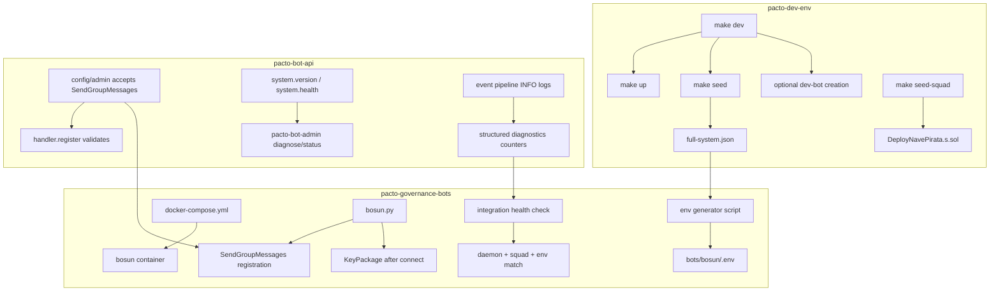

# Pacto Integration Hardening — Dev-Env, Daemon, and Governance Bot

## Summary

Harden the end-to-end path from `git clone` to a registered, event-receiving governance bot. The work spans `pacto-bot-api` (capability + observability), `pacto-governance-bots` (setup + wiring), and `pacto-dev-env` (onboarding targets and shared-network contract).

---

## Problem Frame

The local stack runs, but several gaps make setup fragile and debugging opaque:

- The daemon authorizes `agent.send_group_message` and `agent.publish_key_package` under `SendGroupMessages`, but `pacto-bot-admin` and the config schema do not recognize `SendGroupMessages` as a valid bot capability.
- There is no runtime health or version HTTP endpoint; `pacto-bot-admin diagnose` reports received/dispatched counts but cannot confirm which pipeline stage dropped an event.
- The governance bot requests `SendMessages`, publishes its KeyPackage before connecting, and ships a Compose default socket path that does not match dev-env.
- `pacto-dev-env` has no single target that pulls images, seeds contracts, creates a dev bot, and prints next steps; squad creation is manual and undocumented.
- Cross-repo setup steps and the shared network/volume/socket contract are not documented in one place.

---

## Requirements

### Daemon capability and authorization

R1. `pacto-bot-api` recognizes `SendGroupMessages` as a valid bot capability in config validation, `pacto-bot-admin --capabilities`, and interactive capability prompts.

R2. Handlers registered with `SendGroupMessages` may call `agent.send_group_message` and `agent.publish_key_package` (authorization already gated on the capability; this requirement makes the capability reachable).

R3. `SendMessages` continues to authorize only `agent.send_dm` and reply actions; group-message methods remain separate.

### Daemon observability and runtime contract

R4. The daemon exposes `system.version` as a JSON-RPC method returning `{version, git_sha}` and serves the same payload at `GET /version` when HTTP transport is enabled.

R5. The daemon exposes `system.health` as a JSON-RPC method returning config validity, relay connection state, registered handler count, and recent event counts.

R6. `pacto-bot-admin diagnose` and `pacto-bot-admin status` reflect accurate recent counts: events received, decrypted, dispatched, and handler responses collected.

R7. The daemon logs the event pipeline at INFO level with structured spans for: received from relay, decrypted, dispatched to handler, and handler response.

R8. The daemon honors the configured `socket_path` exactly; when the path uses an XDG-style parent directory, the daemon creates parent directories with safe permissions (`0o700` on Unix) before binding the socket. The default `pacto-dev-env` config and the governance bot Compose default agree on one path: `/var/lib/pacto-bot-api/pacto-bot-api.sock`.

R9. `main`-tagged Docker images embed a real short git SHA in `--version` output and in `GET /version`, replacing the current `0.6.0 (unknown)` fallback.

### Governance bot setup and wiring

R10. The scaffolded governance bot requests `SendGroupMessages` after the daemon supports it as a config capability.

R11. `pacto-governance-bots/docker-compose.yml` removes misleading empty-string defaults and aligns the default socket path with dev-env (`/var/lib/pacto-bot-api/pacto-bot-api.sock`).

R12. `pacto-governance-bots` includes a root `.env.example` documenting the load order and the shared contract from `pacto-dev-env`.

R13. The bot publishes its MLS KeyPackage only after the transport is connected, not before.

R14. The “no deployments in registry” error includes a hint pointing to `make seed-squad` in `pacto-dev-env`.

R15. `pacto-governance-bots` includes a script that reads `../pacto-dev-env/data/deployments/31337/full-system.json` and writes `bots/bosun/.env` with registry/Hats addresses, socket path, RPC URL, and optional placeholders.

### Dev-env onboarding

R16. `pacto-dev-env/make up` can optionally create a dev bot identity when none exists, gated by `PACTO_CREATE_DEV_BOT=1` and an env-provided `nsec`/`npub` pair.

R17. `pacto-dev-env` adds `make seed-squad` that checks for required captain/candidate identities and, when present, executes `DeployNavePirata.s.sol` against the local Anvil node; when missing, it prints explicit `pacto-bot-admin new` instructions.

R18. `pacto-dev-env` adds `make dev` that pulls images, starts the default stack, optionally creates a dev bot, seeds governance contracts, and prints next steps for the sibling repo.

R19. `pacto-dev-env/README.md` documents the shared network/volume/socket contract and points to the cross-repo setup guide.

R20. The image tag strategy is pinned or documented: `main` is the development default with `pull_policy: always` where desired; `latest` maps to releases.

### Cross-repo integration

R21. A single `SETUP.md` spans `pacto-dev-env` and `pacto-governance-bots`, walking through clone, start, identity creation, contract seeding, squad creation, `.env` generation, bot start, and verification.

R22. `pacto-governance-bots` includes an integration health check that verifies: daemon reachable via socket, bot identity present in daemon config, handler registered, Anvil has at least one squad, and registry/Hats addresses in `bots/bosun/.env` match the deployment artifact.

---

## Key Technical Decisions

- **Add `SendGroupMessages` to the daemon capability set.** The daemon already authorizes group-message calls under this capability; the missing piece is making it valid in config and admin flows. `SendMessages` remains DM-only. (see origin: Key Decisions)

- **Extend diagnostics rather than invent a new subsystem.** R6/R7 are satisfied by adding counters and structured INFO logs inside the existing `Diagnostics` and `Dispatch` paths. No new database schema or external service is introduced.

- **Generate `.env` in the bot repo from the deployment artifact.** `pacto-governance-bots` owns per-consumer dotenv generation; `pacto-dev-env` owns the deployment artifact. This keeps sibling-specific config out of the orchestration repo. (see origin: Key Decisions)

- **Keep squad creation identity-aware.** `make seed-squad` requires real captain/candidate identities created with `pacto-bot-admin`; it does not fabricate a dummy single-user squad. (see origin: Key Decisions)

- **Keep socket-path agreement explicit.** Both repos use `/var/lib/pacto-bot-api/pacto-bot-api.sock` as the single default inside the shared `pacto-bot-api-data` volume. The daemon already creates parent directories with `0o700` permissions.

- **Use `system.version` and `system.health` aliases for clarity.** `agent.version` already exists; `system.version` is added as an alias or additional method so the “system” namespace matches operator expectations. `system.health` reuses the live `HealthSnapshot` plumbing.

- **Embed git SHA in release images via build arg.** The existing `Dockerfile` and CI workflow already accept `GIT_COMMIT_SHORT`; the plan adds a CI smoke check to ensure the fallback `unknown` does not ship on `main` images.

---

## Scope Boundaries

### Deferred for later

- Phase 2 inbound `!snapshot` command for the governance bot. See `docs/brainstorms/2026-07-05-python-governance-snapshot-bot-requirements.md`.
- TEE deployment architecture. See `pacto-bot-api/docs/plans/2026-07-03-001-feat-governance-snapshot-mls-tee-bot-plan.md`.
- A custom cross-protocol debug dashboard. Observability in this plan is logs + diagnostics.

### Outside this product's identity

- Removing the Rust governance crate (`pacto-bot-api/crates/governance-bot/`). The Python bot is a sibling implementation.
- Modifying the daemon's MLS extension or JSON-RPC contract beyond the `SendGroupMessages` capability and the version/health endpoints described here.
- A general-purpose no-code bot builder.

### Deferred to follow-up work

- Auto-creating real `nsec`-based dev bot identities without an env-provided secret. The current scope requires the operator to supply signing material.
- Automatic cross-repo git cloning in `make dev`; the target assumes sibling repos are already cloned.

---

## High-Level Technical Design

---

## Implementation Units

### U1. Recognize `SendGroupMessages` in daemon config and admin CLI

**Goal:** Allow bot configs and `pacto-bot-admin new` to grant `SendGroupMessages` so group-message handlers can register and call MLS methods.

**Requirements:** R1, R2, R3.

**Dependencies:** None.

**Files:**
- `pacto-bot-api/src/admin.rs`
- `pacto-bot-api/src/config.rs` (example snippets and defaults)
- `pacto-bot-api/AGENTS.md` (capability list in conventions if referenced)
- Tests: `pacto-bot-api/tests/` covering `handler.register` with `SendGroupMessages`

**Approach:**
1. Add `SendGroupMessages` to `validate_capability` in `src/admin.rs`.
2. Update help text, `after_help`, and interactive prompts to list `SendGroupMessages` alongside the other three capabilities.
3. Update default config snippets in `src/config.rs` tests/examples to show `SendGroupMessages` where appropriate.
4. Regenerate `docs/pacto-bot-admin-llms.txt` via `cargo xtask docs`.

**Patterns to follow:** Keep the coarse bot-level capability model; registration-time validation already checks `bot.capabilities.contains(cap)` in `src/handlers.rs`. No dispatch change is needed because `handle_send_group_message_inner` and `handle_publish_key_package_inner` already call `cm.is_authorized(..., "SendGroupMessages")`.

**Test scenarios:**
- `pacto-bot-admin new bosun --capabilities SendGroupMessages` succeeds and writes a config with `capabilities = ["SendGroupMessages"]`.
- `pacto-bot-admin new bosun` without `--capabilities` still defaults to `ReadMessages,SendMessages`.
- `pacto-bot-admin validate-config` accepts a config containing `SendGroupMessages`.
- `handler.register` with `capabilities: ["SendGroupMessages"]` succeeds when the bot config grants it.
- `agent.send_group_message` and `agent.publish_key_package` return `UnauthorizedBot` when the handler registered only `SendMessages`.

**Verification:** Run `make validate` and `make test-fast` in `pacto-bot-api`. Manual: create a bot with `SendGroupMessages`, register a Python handler, and call `agent.publish_key_package`.

---

### U2. Add `system.version` JSON-RPC method and `GET /version` HTTP endpoint

**Goal:** Give operators a clear version probe that works over both transports and matches the CLI `--version` output.

**Requirements:** R4.

**Dependencies:** None.

**Files:**
- `pacto-bot-api/schemas/jsonrpc.json`
- `pacto-bot-api/src/transport/protocol.rs`
- `pacto-bot-api/src/transport/protocol_generated.rs` (regenerate)
- `pacto-bot-api/src/dispatch.rs`
- `pacto-bot-api/src/transport/http.rs`
- `pacto-bot-api/src/errors.rs`
- `pacto-bot-api/docs/plans/2026-06-24-001-feat-pacto-bot-api-daemon-plan.md` (error-code table)
- Tests: `pacto-bot-api/tests/transport_http.rs`, in-process dispatch tests

**Approach:**
1. Add `system.version` to `schemas/jsonrpc.json` with the same result schema as `agent.version`.
2. Add `Method::SystemVersion` and route `"system.version"` to the existing `handle_version` logic (or refactor both aliases to a shared helper).
3. In `src/transport/http.rs`, add `GET /version` returning `{version, git_sha}` as JSON with `Content-Type: application/json; charset=utf-8`.
4. If a new JSON-RPC error code is needed, pick the next unused Pacto-specific code in `-32000..-32099` per `docs/solutions/best-practices/json-rpc-error-codes.md` and update the daemon plan's error-code table.
5. Run `cargo xtask codegen` to regenerate generated types.

**Patterns to follow:** Use exact `Content-Type` assertions in HTTP tests (see `docs/solutions/best-practices/exact-test-assertions.md`). Reuse `AgentVersionResponse`/`version::VERSION`/`GIT_COMMIT_SHORT`.

**Test scenarios:**
- `system.version` via JSON-RPC returns `version` and `git_sha` fields.
- `GET /version` returns HTTP 200 and the same JSON shape.
- When built from a git checkout or CI with `GIT_COMMIT_SHORT`, `git_sha` is not `"unknown"`.
- HTTP `GET /version` does not require the secret header.
- Unknown method `system.notamethod` returns `-32601`.

**Verification:** Run `make test-fast`; manually curl `GET /version` against a daemon started with `--enable-http`.

---

### U3. Add `system.health` JSON-RPC method and accurate diagnostics

**Goal:** Surface config validity, relay state, handler count, and recent event counts in one request, and fix `pacto-bot-admin diagnose` to report decrypted/response counts.

**Requirements:** R5, R6.

**Dependencies:** U2 (only for shared schema generation convenience; counter/logic work is independent of U2).

**Files:**
- `pacto-bot-api/schemas/jsonrpc.json`
- `pacto-bot-api/src/transport/protocol.rs` and generated files
- `pacto-bot-api/src/diagnostics.rs`
- `pacto-bot-api/src/dispatch.rs`
- `pacto-bot-api/src/nostr.rs`
- `pacto-bot-api/src/admin.rs`
- Tests: `pacto-bot-api/tests/` covering `agent.metrics`, `diagnose`, `status`

**Approach:**
1. Add counters to `Diagnostics`:
   - `events_decrypted_total` and rolling `decrypted` bucket.
   - `handler_responses_total` and rolling `handler_responses` bucket.
2. Increment `record_event_decrypted` after successful gift-wrap/MLS decryption in the Nostr ingestion path; increment `record_handler_response` when a valid `handler.response` is accepted.
3. Extend `HealthSnapshot.recent_counts` with `events_decrypted` and `handler_responses`.
4. Add `Method::SystemHealth` and a `handle_system_health` that returns the snapshot plus a `config_valid` boolean and relay state summary.
5. Update `pacto-bot-admin diagnose` and `status` text/JSON reports to include the new counters.

**Patterns to follow:** Use the existing `RecentBuckets` windowing. Amortize any new cleanup (see `docs/solutions/best-practices/opportunistic-cleanup.md`).

**Test scenarios:**
- After a DM gift-wrap lands on the relay, `system.health` shows `events_received`, `events_decrypted`, `events_dispatched`, and `handler_responses` all ≥ 1 in `recent_counts`.
- `events_decrypted` is zero when a gift-wrap fails signature verification.
- `handler_responses` is zero when a handler sends no `handler.response` within the dispatch timeout.
- `pacto-bot-admin diagnose --format json` includes the new fields.

**Verification:** Run `make test-fast`; manual end-to-end with a mock relay and a registered echo handler.

---

### U4. Add structured INFO logging for the event pipeline

**Goal:** Make it possible to trace an event from relay receipt through decryption, dispatch, and handler response without enabling debug logging.

**Requirements:** R7.

**Dependencies:** U3.

**Files:**
- `pacto-bot-api/src/dispatch.rs`
- `pacto-bot-api/src/nostr.rs`
- `pacto-bot-api/src/diagnostics.rs` (redaction pattern updates)
- Tests: log-capture tests in `pacto-bot-api/tests/`

**Approach:**
1. Add `info!` spans in the hot path:
   - Relay receipt: `event_id`, `bot_id`, `event_type`.
   - Successful decryption: `event_id`, `bot_id`, `rumor_id`, `author`.
   - Dispatch: `event_id`, `handler_id`, `bot_id`.
   - Handler response accepted: `event_id`, `handler_id`, `action`.
2. Keep existing `debug!` and `warn!` logs; do not log decrypted content or secrets.
3. Ensure redaction patterns in `src/diagnostics.rs` cover any new log fields that might contain user content.

**Patterns to follow:** Use `tracing` field syntax; do not allocate large strings for previews. Follow `content_preview` precedent for any content preview.

**Test scenarios:**
- A gift-wrap that is decrypted and dispatched produces an INFO line for each stage.
- A gift-wrap that fails verification produces an INFO `event_received` line and a WARN verification-failure line, but no `event_decrypted` line.
- No INFO log contains decrypted message content; a redaction test injects synthetic secrets into log fields and asserts none leak.

**Verification:** Run `make test-fast`; manual `RUST_LOG=info cargo run --bin pacto-bot-api` with a test DM.

---

### U5. Fix governance bot capability, socket path, and KeyPackage ordering

**Goal:** Make the scaffolded bot compatible with the daemon's group-message path and remove the "transport not connected" startup warning.

**Requirements:** R10, R11, R13.

**Dependencies:** None (U1 enables `SendGroupMessages` config support, but the bot code can change its requested capability independently; the daemon will accept the registration once U1 lands).

**Files:**
- `pacto-governance-bots/docker-compose.yml`
- `pacto-governance-bots/bots/bosun/src/bosun/bosun.py`
- `pacto-governance-bots/bots/bosun/.env.example`
- `pacto-governance-bots/bots/bosun/tests/test_bosun.py`

**Approach:**
1. Change `BosunBot.__init__` to request `capabilities=["SendGroupMessages"]`.
2. Update `docker-compose.yml`:
   - Fix `PACTO_GOVERNANCE_DAEMON_SOCKET` default to `/var/lib/pacto-bot-api/pacto-bot-api.sock`.
   - Remove empty-string defaults and keep only meaningful defaults (`PACTO_GOVERNANCE_RPC_URL`, `PACTO_GOVERNANCE_BOT_ID`, `PACTO_GOVERNANCE_GROUP_ID`, cadence, squad index). Move `CAPTAIN`, `CREW_CANDIDATES`, `PROPOSER_CANDIDATES`, `REGISTRY`, `HATS` out of Compose into `.env`.
3. Move `setup()` (KeyPackage publish) into the `_run_once` path after `await self._client.connect()` succeeds, or call it from a post-registration hook so it runs after transport is connected.
4. Update `.env.example` to document the correct socket path and the shared contract.
5. Update tests that mock `agent_publish_key_package` to reflect the new ordering.

**Patterns to follow:** Match the SDK `Bot` lifecycle: `connect()` → `handler_register()` → post-registration setup. Keep the existing `trigger_once` behavior but ensure it also connects first.

**Test scenarios:**
- `BosunBot` registers with `capabilities=["SendGroupMessages"]`.
- The default socket path in Compose matches the dev-env socket path.
- `setup()` is called only after `_client.connect()` succeeds.
- `trigger_once` connects, publishes KeyPackage, posts snapshot, and exits successfully.
- When KeyPackage publish fails, the bot logs the error and continues.

**Verification:** Run `make test` in `pacto-governance-bots`. Manual: `docker compose up -d` after a dev-env stack is running.

---

### U6. Add governance bot env generator and root `.env.example`

**Goal:** Remove manual copy/paste of registry/Hats addresses from the deployment artifact.

**Requirements:** R12, R15.

**Dependencies:** None.

**Files:**
- `pacto-governance-bots/scripts/generate-env.sh` (new)
- `pacto-governance-bots/.env.example` (new)
- `pacto-governance-bots/Makefile`
- `pacto-governance-bots/README.md`
- Tests: add a small test or Makefile target that verifies the script runs

**Approach:**
1. Create `scripts/generate-env.sh` that:
   - Accepts an optional `PACTO_DEV_ENV_DIR` defaulting to `../pacto-dev-env`.
   - Reads `data/deployments/31337/full-system.json`.
   - Writes `bots/bosun/.env` with `PACTO_GOVERNANCE_REGISTRY`, `PACTO_GOVERNANCE_HATS`, `PACTO_GOVERNANCE_RPC_URL`, `PACTO_GOVERNANCE_DAEMON_SOCKET`, and placeholders for `GROUP_ID`, `BOT_ID`, etc.
   - Fails with a clear message if the artifact is missing.
2. Add a root `.env.example` that documents load order (`bots/bosun/.env` first, then root `.env`) and points to the generator.
3. Add a `make env` target that runs the generator.
4. Update `README.md` to instruct users to run `make env` after `make seed-squad`.

**Patterns to follow:** Keep generated `.env` as the single source of truth; do not duplicate addresses back into Compose. Use `jq` for JSON extraction.

**Test scenarios:**
- The generator exits with a clear error when `../pacto-dev-env/data/deployments/31337/full-system.json` is missing.
- The generator writes `bots/bosun/.env` whose `PACTO_GOVERNANCE_REGISTRY` and `PACTO_GOVERNANCE_HATS` match the artifact.
- The generator preserves existing `GROUP_ID`/`BOT_ID` values if `PRESERVE_ENV=1` is set.
- `make env` invokes the generator and prints the output path.

**Verification:** Manual: run `make env` after `make seed` in dev-env, then inspect `bots/bosun/.env`.

---

### U7. Add dev-env onboarding targets (`make dev`, `make seed-squad`, optional dev bot)

**Goal:** Reduce the new-contributor path to a single documented command and a clear next-step printout.

**Requirements:** R16, R17, R18, R20.

**Dependencies:** None.

**Files:**
- `pacto-dev-env/Makefile`
- `pacto-dev-env/scripts/init-pacto-bot-api-config.sh`
- `pacto-dev-env/scripts/seed-squad.sh` (new)
- `pacto-dev-env/README.md`
- `pacto-dev-env/ARCHITECTURE.md`

**Approach:**
1. Extend `scripts/init-pacto-bot-api-config.sh`:
   - If `PACTO_CREATE_DEV_BOT=1` and `PACTO_BOT_NSEC`/`PACTO_BOT_NPUB` are set, append a dev bot identity with `capabilities = ["ReadMessages", "SendMessages", "SendGroupMessages"]` to `pacto-bot-api.toml`.
   - Print a warning if `PACTO_CREATE_DEV_BOT=1` but secrets are missing.
2. Add `scripts/seed-squad.sh`:
   - Check for required env vars (`CAPTAIN`, `SQUAD_METADATA_URI`, optional candidate lists).
   - When identities are missing, print `pacto-bot-admin new captain --backend nsec --relays ws://localhost:7000` style instructions and exit non-zero.
   - When present, run `forge script script/DeployNavePirata.s.sol` via the `seed` service or a dedicated one-shot container against Anvil.
   - Write the squad artifact to `data/deployments/31337/squad.json` next to `full-system.json`.
3. Add Makefile targets:
   - `make dev`: `make pull` (optional), `make up`, conditional dev-bot creation, `make seed`, print next-step banner pointing to `make env` and `docker compose up -d` in `pacto-governance-bots`.
   - `make seed-squad`: invoke `scripts/seed-squad.sh`.
4. Update `README.md` and `ARCHITECTURE.md` with the shared network/volume/socket contract.

**Patterns to follow:** Use the existing `ensure-sibling-repos.sh` pattern for `pacto-gov` availability. Keep targets idempotent where safe (`make seed` already checks for existing artifact).

**Test scenarios:**
- `make up` with `PACTO_CREATE_DEV_BOT=1` and valid secrets creates `pacto-bot-api.toml` containing a dev bot with all three capabilities.
- `make up` with `PACTO_CREATE_DEV_BOT=1` and missing secrets prints a clear warning and creates a daemon-only config.
- `make seed-squad` with missing captain prints the required `pacto-bot-admin new` commands and exits non-zero.
- `make seed-squad` with valid env vars deploys a squad and writes `data/deployments/31337/squad.json`.
- `make dev` prints a next-step banner that names `make env` and `docker compose up -d` in `pacto-governance-bots`.

**Verification:** Manual end-to-end on a fresh clone. There is no automated test suite in `pacto-dev-env`.

---

### U8. Write cross-repo `SETUP.md` and add integration health check

**Goal:** Document the full path in one place and give operators an automated check that the integration is alive.

**Requirements:** R21, R22.

**Dependencies:** U6, U7.

**Files:**
- `pacto-governance-bots/SETUP.md` (new)
- `pacto-governance-bots/scripts/health-check.sh` (new)
- `pacto-governance-bots/Makefile`
- `pacto-governance-bots/bots/bosun/src/bosun/reader.py`
- `pacto-dev-env/README.md`

**Approach:**
1. Write `SETUP.md` covering:
   - Clone `pacto-dev-env` and `pacto-governance-bots` side by side.
   - Run `make dev` in `pacto-dev-env`.
   - Create dev bot and squad identities with `pacto-bot-admin`.
   - Run `make seed-squad`.
   - Run `make env` in `pacto-governance-bots`.
   - Run `docker compose up -d` and `make health-check`.
2. Add `scripts/health-check.sh` that verifies:
   - Daemon socket exists and responds to `system.health`.
   - Bot identity is in daemon config (or `agent.list_handlers` shows the handler).
   - Anvil `deploymentCount()` via cast is ≥ 1.
   - `bots/bosun/.env` registry/Hats addresses match `../pacto-dev-env/data/deployments/31337/full-system.json`.
3. Add `make health-check` target.
4. Update `reader.py` to append the `make seed-squad` hint to the “no deployments in registry” error.

**Patterns to follow:** Use `cast` and `socat` (already installed by dev-env setup scripts). Keep the health check read-only.

**Test scenarios:**
- `make health-check` passes when the stack, bot, and squad are fully configured.
- `make health-check` fails with a clear message when the daemon socket is missing.
- `make health-check` fails when `bots/bosun/.env` registry address does not match the deployment artifact.
- The “no deployments in registry” error contains the `make seed-squad` hint.

**Verification:** Manual run of `make health-check` against a configured local stack.

---

## Risks & Dependencies

| Risk | Mitigation |
|---|---|
| `SendGroupMessages` is a breaking capability change for existing DM-only bots. | Keep `SendMessages` behavior unchanged; only group-message bots need the new capability. |
| Docker `main` images still embed `unknown` git SHA if CI build arg is not passed. | Verify the GHCR workflow passes `GIT_COMMIT_SHORT`; add a CI smoke test for `/version`. |
| `make dev` and `make seed-squad` assume sibling repo locations (`../pacto-gov`, and `make env` assumes `../pacto-dev-env`). | Make both paths overridable via env vars (`PACTO_GOV_DIR`, `PACTO_DEV_ENV_DIR`) and fail with clear messages when missing. |
| `make dev` depends on env-provided secrets for dev-bot creation. | Print clear remediation steps on failure; do not fabricate signing material. |
| Governance bot `.env` generator assumes relative path `../pacto-dev-env`. | Make `PACTO_DEV_ENV_DIR` overridable and fail loudly if the artifact is missing. |
| Adding `system.health` fields may break existing `agent.metrics` consumers. | Add fields only to `system.health`; keep `agent.metrics` schema backward-compatible. |

---

## Open Questions

- Should `system.version` replace `agent.version` or coexist as an alias? Decision: coexist as an alias; `agent.version` remains for backward compatibility.
- Should `system.health` reuse `MetricsResponse` or define a new schema? Decision: define a small `SystemHealthResponse` that includes `HealthSnapshot` fields plus `config_valid` and relay state.
- Should the env generator overwrite an existing `bots/bosun/.env` or merge with it? Decision: overwrite unless a `PRESERVE_ENV=1` flag is set, and back up the old file.
- Should `make dev` default `PACTO_CREATE_DEV_BOT=0` or `1`? Decision: default to `0`; creating a bot requires real secrets and should be opt-in.

---

## Sources & Research

- `docs/brainstorms/2026-07-07-pacto-integration-hardening-requirements.md` — origin requirements and acceptance examples.
- `pacto-bot-api/src/admin.rs`, `src/handlers.rs`, `src/dispatch.rs`, `src/diagnostics.rs`, `src/transport/http.rs` — existing capability, authorization, diagnostics, and HTTP surfaces.
- `pacto-bot-api/docs/solutions/best-practices/json-rpc-error-codes.md`, `secure-file-creation.md`, `opportunistic-cleanup.md`, `regex-caching.md`, `exact-test-assertions.md` — patterns to follow.
- `pacto-bot-api/docs/plans/2026-06-24-001-feat-pacto-bot-api-daemon-plan.md` and `2026-07-03-001-feat-governance-snapshot-mls-tee-bot-plan.md` — prior daemon and MLS extension plans.
- `pacto-dev-env/INTEGRATION_REFLECTION.md`, `README.md`, `ARCHITECTURE.md`, `docker-compose.yml`, `Makefile`, `scripts/seed-anvil.sh` — dev-env orchestration and shared contracts.
- `pacto-governance-bots/bots/bosun/src/bosun/bosun.py`, `docker-compose.yml`, `Makefile`, `bots/bosun/.env.example` — current bot wiring and defaults.
- `pacto-gov/script/DeployNavePirata.s.sol` — squad creation script used by `make seed-squad`.
