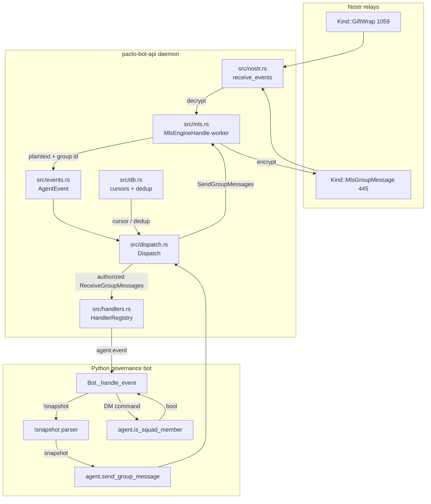
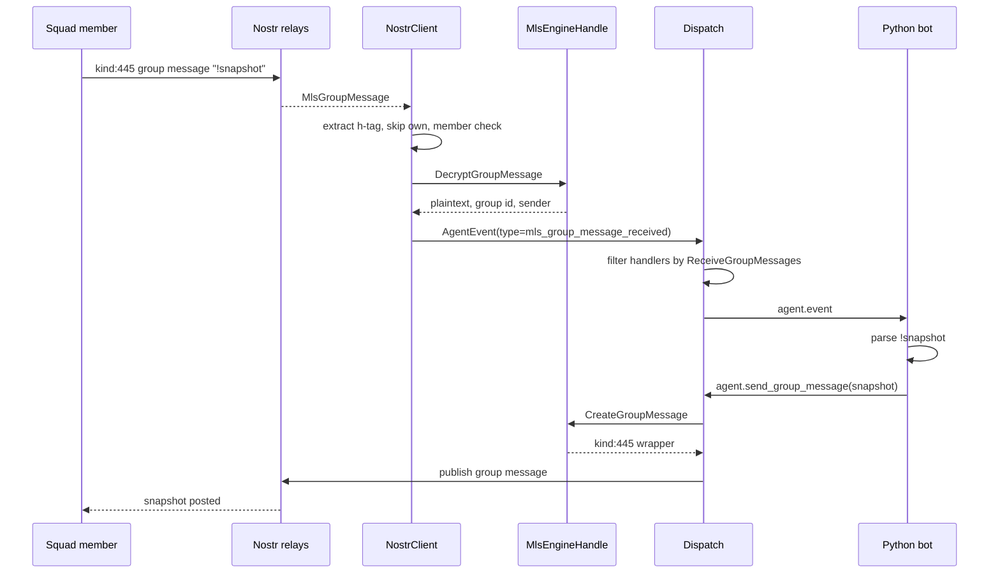
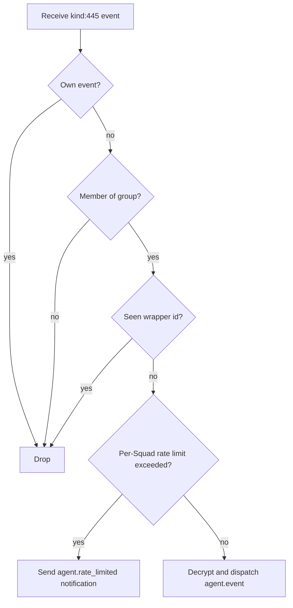

# Plan: Inbound MLS group message dispatch and `!snapshot` command

## Summary

Extend the daemon's MLS path from send-only to receive-only for group messages. The daemon subscribes to `kind:445` group messages per bot, decrypts them, and delivers plaintext to handlers with a new `ReceiveGroupMessages` capability. A separate `agent.rate_limited` notification tells the handler when a per-Squad rate limit has been exceeded, so the bot can reply in the same Squad. A generic `agent.is_squad_member` membership verification call lets handlers validate DM-triggered squad commands before acting. The Python SDK and JSON-RPC schema are regenerated in this repo; the governance bot example itself lives outside this repo.

## Problem Frame

Phase 1 proved the bot can post governance snapshots autonomously into a Squad. Squad members also want an on-demand trigger: type `!snapshot` and receive a fresh snapshot without waiting for the daily cadence. This requires the daemon to decrypt inbound MLS group messages, which advances the group key schedule and exposes the bot to private channel content. The existing TEE architecture brief is the long-term mitigation; Phase 2 accepts the same dev-only key custody regime as Phase 1 for the hackathon.

## Requirements

### Inbound MLS dispatch

- R1. The daemon subscribes to `Kind::MlsGroupMessage` (kind:445) per bot, alongside the existing GiftWrap subscription.
- R2. The daemon extracts the Squad wire ID from the `h` tag, drops messages for groups the bot is not a member of, and drops messages the bot itself published.
- R3. The daemon decrypts surviving messages using the per-bot MLS engine and delivers the plaintext to handlers.
- R4. The delivered notification includes the decrypted content, the Squad wire ID, the sender's Nostr pubkey, the wrapper event id, and the event timestamp.
- R5. The daemon only delivers decrypted group messages to handlers registered with the `ReceiveGroupMessages` capability.

### Rate limiting and deduplication

- R6. The daemon rate-limits inbound group-message notifications per Squad, using a one-minute window, and signals the rate-limit condition to the handler so the bot can respond with a rate-limit message in the same Squad.
- R7. The daemon deduplicates notifications by wrapper event id for a configurable window so retries do not trigger duplicate handler runs. The default window is 15 minutes and is configurable per bot.

### DM-triggered squad commands

- R8. The daemon exposes a generic membership verification call that any handler can use to confirm a DM sender is a member of a specified Squad before acting on a command.
- R9. The Python governance bot uses this call to verify `!snapshot` commands sent via DM, then posts the snapshot to the Squad the user specified.

### Handler behavior

- R10. The Python governance bot detects `!snapshot` in delivered plaintext and triggers the same read → format → send flow used by the cadence timer.
- R11. The Python bot ignores non-`!snapshot` plaintext by default.
- R12. When the daemon signals a rate-limit condition, the Python bot responds in the same Squad with a message explaining the one-minute limit.

### Security and tests

- R13. Tests cover: happy-path decrypt and delivery, membership filtering, skip-own-events, malformed-message handling, unauthorized handler rejection, rate-limit signaling, and deduplication.

## Key Technical Decisions

- KTD-1. The daemon delivers raw plaintext and lets the handler parse commands. This keeps the daemon protocol-general and the `!snapshot` logic in the Python bot.
- KTD-2. `ReceiveGroupMessages` is a separate capability from `SendGroupMessages`, so a handler can receive without sending.
- KTD-3. Inbound decryption reuses the existing per-bot MLS engine worker thread. The new decrypt operation is added as an `MlsCommand` variant to the same channel, not a second concurrency model.
- KTD-4. The Python governance bot is the real `!snapshot` consumer; the Rust example crate is out of scope for this repo.
- KTD-5. DM-triggered command membership is verified through a generic daemon call, not by parsing specific command text in the daemon. Any bot can use the same call for its own DM commands.
- KTD-6. Rich metadata such as the full wrapper event JSON is deferred for later; the initial notification uses the standard metadata set (content, group id, author, event id, timestamp).
- KTD-7. Rate-limit conditions are signaled to the handler via a separate `agent.rate_limited` notification, not a flag on the inbound event. This keeps the event shape stable and lets the handler decide whether to respond.
- KTD-8. The deduplication window is configurable per bot with a default of 15 minutes, matching the resolved outstanding question from the origin requirements.
- KTD-9. The generic membership verification call is named `agent.is_squad_member(bot_id, group_id, member_pubkey) → bool`.

## Scope Boundaries

### Deferred for later

- Full MLS group management, re-keying, or decryption support beyond the `!snapshot` trigger.
- Interactive commands other than `!snapshot`.
- Backfill of historical group messages at daemon startup.
- Rich notification metadata such as the full wrapper event JSON or MLS message id.

### Outside this product's identity

- Updating the Rust `crates/governance-bot` example unless it is useful for daemon-side validation.
- TEE deployment as running code (U11 brief only).
- Cross-chain governance reads beyond Sepolia / anvil.
- A general-purpose AI assistant for Pacto users.
- The Python governance bot example implementation (it lives in a separate repo; this plan covers the daemon and SDK support it needs).

## High-Level Technical Design

### Component topology

### Inbound group message flow

### Rate-limit and dedup gate

## Implementation Units

### U1. Add kind:445 subscription and inbound MLS decrypt method

**Goal:** Enable the daemon to receive kind:445 MLS group messages and decrypt them on the existing MLS worker thread.

**Requirements:** R1, R2, R3

**Dependencies:** none

**Files:**
- `src/nostr.rs` — add `subscribe_group_messages_with_since` and `subscribe_group_messages`, extend `receive_events` to branch on `Kind::MlsGroupMessage`, add `process_group_message` helper.
- `src/mls.rs` — add `MlsCommand::DecryptGroupMessage`, `MlsEngineHandle::decrypt_group_message`, and a `DecryptedMessage` result struct.
- `src/client_manager.rs` — subscribe bots to kind:445 in `subscribe_bots_with_client` when the bot has `ReceiveGroupMessages`.

**Covers flow:** F1. Inbound `!snapshot` round-trip (the receive and decrypt portion).

**Approach:** The kind:445 subscription uses a filter similar to the existing GiftWrap filter but with `Filter::new().kind(Kind::MlsGroupMessage).pubkey(*npub)`. In `receive_events`, branch on `event.kind == Kind::MlsGroupMessage` and route to a new `process_group_message` helper. That helper extracts the `h` tag, performs skip-own and membership checks, then calls `MlsEngineHandle::decrypt_group_message`. The worker thread calls `engine.process_message(&event)`; on `MessageProcessingResult::ApplicationMessage`, return the plaintext content and the group id. On protocol-only results (Proposal, Commit, ExternalJoinProposal, Unprocessable), return `Ok(None)` so the key schedule advances without delivering to handlers. On error, return `MlsError::Engine` with a redacted message and record diagnostics.

**Patterns to follow:** The existing `MlsCommand` / `MlsEngineHandle` worker-thread pattern in `src/mls.rs`; the `subscribe_bot_with_since` and `subscribe_bots_with_client` pattern in `src/client_manager.rs` and `src/nostr.rs`.

**Test scenarios:**
- **Happy path:** Covers AE1. A mock relay injects a kind:445 message; the daemon decrypts it and emits an `AgentEvent` with the correct plaintext, group id, author, event id, and timestamp.
- **Edge case:** A protocol-only MLS message (Proposal/Commit) advances the engine state but emits no `AgentEvent`.
- **Error path:** Covers AE4. An invalid MLS ciphertext records a diagnostic error, drops the event, and does not panic.
- **Integration:** The `MlsEngineHandle` decrypt command runs on the worker thread and does not block the async runtime.

**Verification:** `cargo test` passes for new `src/mls.rs` and `src/nostr.rs` unit tests. A mock relay integration test shows a decrypted `AgentEvent` is produced.

---

### U2. Add `MlsGroupMessageReceived` event type and `ReceiveGroupMessages` capability

**Goal:** Route inbound group messages only to handlers that have explicitly requested them.

**Requirements:** R4, R5

**Dependencies:** U1

**Files:**
- `src/events.rs` — add `EventType::MlsGroupMessageReceived` and its wire name.
- `src/handlers.rs` — add parsing for the new wire name in `parse_event_type`.
- `src/config.rs` — add `ReceiveGroupMessages` to `VALID_CAPABILITIES`.
- `src/admin.rs` — add `ReceiveGroupMessages` to `validate_capability` and help text.
- `src/dispatch.rs` — filter `HandlerRegistry::find` results by `handler.is_authorized(bot_id, "ReceiveGroupMessages")` before fan-out for `MlsGroupMessageReceived` events.

**Covers flow:** F1. Inbound `!snapshot` round-trip (the delivery portion).

**Approach:** The `AgentEvent` produced by U1 carries `event_type: MlsGroupMessageReceived`. In `dispatch_event`, after finding matching handlers, drop any handler that is not authorized for `ReceiveGroupMessages`. The existing `HandlerRef::is_authorized` helper is reused; add a `HandlerRegistry::find_authorized` helper if it makes the dispatch code cleaner. The `chat_id` field in `AgentEvent` carries the Squad wire ID from the `h` tag; `content` carries the plaintext; `author` carries the sender's pubkey; `event_id` carries the wrapper event id; `timestamp` carries the wrapper event timestamp.

**Patterns to follow:** The existing `HandlerRef::is_authorized` and `HandlerRegistry::is_authorized` patterns in `src/handlers.rs`; the existing `EventType` and `as_wire_name` pattern in `src/events.rs`.

**Test scenarios:**
- **Happy path:** Covers AE1. A handler registered with `ReceiveGroupMessages` receives the `mls_group_message_received` event.
- **Error path:** Covers AE2. A handler registered without `ReceiveGroupMessages` does not receive the event, and the daemon records no error because the exclusion is intentional.
- **Edge case:** A handler registered for `dm_received` but not `mls_group_message_received` is excluded.
- **Integration:** The `agent.event` notification sent to the handler has `type: "mls_group_message_received"` and includes the correct `chat_id`, `content`, `author`, `event_id`, and `timestamp`.

**Verification:** Unit tests in `src/handlers.rs` and `src/dispatch.rs` verify authorization filtering. An integration test confirms the handler receives the correct event shape.

---

### U3. Implement membership filtering, skip-own-events, and deduplication

**Goal:** Drop messages the bot should not act on and avoid duplicate handler runs for retries.

**Requirements:** R2, R7

**Dependencies:** U1, U2

**Files:**
- `src/nostr.rs` — add `h`-tag extraction, skip-own check, and membership check before calling `decrypt_group_message`.
- `src/mls.rs` — expose a method to query the engine's known groups (e.g., `engine.get_groups()`) so the daemon can check membership by group id.
- `src/config.rs` — add optional `mls_dedup_window_secs` to `BotConfig` with a default of 900 seconds.
- `src/dispatch.rs` — add a bounded, TTL-based deduplication cache keyed by wrapper event id.

**Approach:** The `h` tag on a kind:445 event contains the Squad wire ID. Before decrypting, compare the event's author pubkey to the bot's pubkey and drop if they match. Then check whether the `h` tag value corresponds to a group the bot is a member of by comparing against the engine's known groups. If not a member, drop the event without decrypting. Deduplication happens after the membership check but before dispatch: a `HashMap<String, Instant>` (or `HashMap<EventId, Instant>`) tracks seen wrapper event ids and is swept opportunistically when size or age thresholds are reached, following the `BucketMap` cleanup pattern. The window is configurable per bot; the default is 15 minutes.

**Patterns to follow:** The opportunistic cleanup pattern in `src/dispatch.rs` (`BucketMap::needs_sweep` / `sweep`); the secure file creation and permission patterns in `docs/solutions/best-practices/secure-file-creation.md` if persisting dedup state (prefer in-memory to avoid disk state).

**Test scenarios:**
- **Happy path:** Covers AE1. A message for a group the bot is a member of is decrypted and dispatched.
- **Edge case:** Covers AE2 / AE3. A message for a group the bot is not a member of is dropped before decryption.
- **Edge case:** Covers AE3. A message published by the bot itself is dropped before decryption.
- **Edge case:** A duplicate wrapper event id within the dedup window is dropped.
- **Edge case:** A duplicate wrapper event id outside the dedup window is allowed.
- **Error path:** A malformed `h` tag is logged and dropped.
- **Integration:** The dedup cache respects the per-bot configurable window.

**Verification:** Unit tests in `src/nostr.rs` and `src/dispatch.rs` cover each branch. Integration tests verify end-to-end filtering and dedup behavior.

---

### U4. Implement per-Squad rate limiting and `agent.rate_limited` notification

**Goal:** Prevent spam in a Squad and tell the handler when a rate limit has been exceeded.

**Requirements:** R6, R12

**Dependencies:** U2

**Files:**
- `src/dispatch.rs` — add a per-Squad token bucket inside `RateLimiter` (or a separate `SquadRateLimiter`) keyed by `bot_id:group_id`.
- `src/diagnostics.rs` — add counters for group-message rate-limited events.
- `src/handlers.rs` — add a `send_rate_limited` method on `HandlerRef` to emit the `agent.rate_limited` notification.
- `schemas/jsonrpc.json` — declare the `agent.rate_limited` notification shape.

**Approach:** Use a one-minute token bucket per Squad with a burst of 1, allowing one snapshot per Squad per minute. When a group message passes membership and dedup checks but exceeds the rate limit, do not dispatch an `agent.event`. Instead, send an `agent.rate_limited` notification to all handlers authorized for `ReceiveGroupMessages` on that bot. The notification includes `bot_id`, `group_id`, and `window_seconds: 60`. The handler can then call `agent.send_group_message` with a rate-limit explanation. The rate limit is checked on the inbound path, not on handler replies, because the requirement is to limit inbound notifications per Squad.

**Patterns to follow:** The existing `BucketMap` token-bucket implementation in `src/dispatch.rs`; the existing `send_event`, `send_status`, `send_metrics` notification helpers in `src/handlers.rs`.

**Test scenarios:**
- **Happy path:** Covers AE1. Two `!snapshot` messages in the same Squad more than one minute apart both result in `agent.event` notifications.
- **Edge case:** Covers AE5. Two `!snapshot` messages in the same Squad within one minute result in one `agent.event` and one `agent.rate_limited` notification.
- **Edge case:** Messages in different Squads are rate-limited independently.
- **Error path:** A malformed rate-limit configuration falls back to the one-minute default.
- **Integration:** The handler receives `agent.rate_limited` with `bot_id`, `group_id`, and `window_seconds`.

**Verification:** Unit tests for the per-Squad token bucket. Integration tests verify the notification is emitted and that the handler can respond with a group message.

---

### U5. Add generic membership verification JSON-RPC method

**Goal:** Let handlers verify that a DM sender is a member of a specific Squad before acting on a command.

**Requirements:** R8, R9

**Dependencies:** U1

**Files:**
- `schemas/jsonrpc.json` — add `agent.is_squad_member` method with params `bot_id`, `group_id`, `member_pubkey` and result `boolean`.
- `src/transport/protocol.rs` — add `Method::AgentIsSquadMember` and `AgentIsSquadMemberParams` / `AgentIsSquadMemberResult` generated types.
- `src/dispatch.rs` — implement `handle_is_squad_member` and route it through `handle_message`.
- `src/mls.rs` — add `MlsCommand::GetGroupMembers` and `MlsEngineHandle::is_group_member(group_id, member_pubkey)` to query the engine's membership.

**Approach:** The method is read-only from the handler's perspective. The handler supplies `bot_id`, `group_id` (the Squad wire ID from a previous `mls_group_message_received` event or a DM), and `member_pubkey`. The daemon looks up the bot's MLS engine, queries the group membership, and returns `true` only if the member is in the group. Authorization requires the handler to be registered for the bot and to have at least one of `ReceiveGroupMessages` or `SendGroupMessages` for that bot.

**Covers flow:** F2. DM-triggered `!snapshot` with membership verification.

**Test scenarios:**
- **Happy path:** Covers AE2 / F2. A handler calls `agent.is_squad_member` for a member of the Squad and receives `true`.
- **Happy path:** Covers AE2 / F2. A handler calls it for a non-member and receives `false`.
- **Error path:** An unknown `group_id` returns `false` without error.
- **Error path:** A handler not registered for the bot receives `UnauthorizedBot`.
- **Error path:** A bot without an MLS engine returns an error indicating MLS is not enabled.

**Verification:** Unit tests for the dispatch handler and MLS engine query. Integration tests verify the JSON-RPC method returns the expected boolean.

---

### U6. Update JSON-RPC schema and regenerate Python SDK

**Goal:** Keep the handler-facing contract and generated code in sync with the new event type, capability, notification, and method.

**Requirements:** R4, R5, R6, R8, R9

**Dependencies:** U2, U4, U5

**Files:**
- `schemas/jsonrpc.json` — update `agent.event` type enum to include `mls_group_message_received`; document `ReceiveGroupMessages` in `handler.register` capabilities; add `agent.rate_limited` notification; add `agent.is_squad_member` method.
- `src/transport/protocol.rs` — add generated/ hand-written types for the new method, notification, and params.
- `python/src/pacto_bot_sdk/_generated/` — regenerate `client.py` and `models.py`.
- `tests/schema_sync.rs` — ensure the regenerated files match the committed snapshots.

**Approach:** All JSON-RPC changes are schema-first. Update `schemas/jsonrpc.json`, then run `cargo xtask codegen` to regenerate Rust types in `src/transport/protocol.rs` and the Python SDK. Do not hand-edit generated files. Update `tests/schema_sync.rs` if the tracked generated file list changes. The `agent.event` schema should document the `chat_id` field as the Squad wire ID for `mls_group_message_received` events.

**Patterns to follow:** The schema-first workflow in `AGENTS.md` and the existing `tests/schema_sync.rs` harness.

**Test scenarios:**
- **Happy path:** `cargo xtask codegen` produces files that pass `tests/schema_sync.rs`.
- **Happy path:** The generated Python SDK has a method for `agent.is_squad_member` and a model for `agent.rate_limited`.
- **Error path:** A hand-edit to a generated file is caught by `tests/schema_sync.rs`.

**Verification:** `make validate` passes, including `cargo xtask codegen` and `cargo test`.

---

### U7. Integration tests for inbound MLS dispatch

**Goal:** Prove the end-to-end inbound MLS flow, including error and edge cases.

**Requirements:** R13

**Dependencies:** U1, U2, U3, U4, U5

**Files:**
- `tests/mls_inbound.rs` — new file with mock relay and mock MLS peer integration tests.
- `tests/support/mock_mls_peer.rs` — extend the existing mock MLS peer to produce group messages the daemon can decrypt.
- `tests/transport_http.rs` — add HTTP transport tests for `agent.is_squad_member` and `agent.rate_limited` if not already covered by the generic integration test.

**Approach:** Reuse the existing `tests/support/mock_mls_peer.rs` and `MockRelay` fixtures. Set up a bot with an MLS engine, have the mock peer create a group and invite the bot, then publish a kind:445 message. Assert the daemon delivers the decrypted plaintext to a registered handler. Add tests for each branch: membership filtering, skip-own, malformed message, unauthorized handler, rate-limit signaling, and deduplication. The tests should use the in-memory or ephemeral `vector-mls.db` pattern already used in `tests/mls_send_only.rs`.

**Patterns to follow:** The existing `tests/mls_send_only.rs` and `tests/transport_http.rs` patterns; the `MockRelay` and `mock_mls_peer` fixtures in `tests/support/`.

**Test scenarios:**
- **Happy path:** Covers AE1. Authorized handler receives `!snapshot` and can reply with `agent.send_group_message`.
- **Edge case:** Covers AE2. Unauthorized handler is excluded from `mls_group_message_received`.
- **Edge case:** Covers AE3. Daemon skips its own kind:445 messages.
- **Edge case:** Covers AE4. Malformed MLS ciphertext is handled safely and records diagnostics.
- **Edge case:** Duplicate wrapper event id is deduplicated within the configured window.
- **Edge case:** Covers AE5. Per-Squad rate limit is enforced and `agent.rate_limited` is emitted.
- **Integration:** Covers F2. DM-triggered `!snapshot` with membership verification succeeds for a member and fails for a non-member.

**Verification:** `cargo test` passes, including the new `tests/mls_inbound.rs` file. `make validate` passes.

## Risks & Dependencies

- **Risk:** The `mdk-core` engine may advance the group key schedule on protocol messages that are not application messages. The implementation must call `engine.process_message` on all inbound kind:445 events so the engine stays in sync, but only emit `AgentEvent` for application messages.
- **Risk:** Inbound MLS decryption introduces a new class of private channel content into daemon memory. The existing TEE architecture is the production mitigation; this plan accepts dev-only key custody.
- **Risk:** The mock MLS peer may not support all message types needed for tests. Verify the fixture can produce application messages that the daemon decrypts correctly before committing to test deadlines.
- **Dependency:** The parent Phase 1 MLS send-only implementation (U1-U4 of the parent plan) must already be merged and working, because inbound decryption builds on the same `MlsEngineHandle` and group state.

## Acceptance Examples

- AE1. Authorized handler receives `!snapshot`
  - **Given:** A handler is registered for a bot with `ReceiveGroupMessages`, and the bot is a member of Squad G.
  - **When:** A member of G sends a kind:445 message with plaintext `!snapshot`.
  - **Then:** The daemon decrypts and delivers the plaintext; the handler posts a snapshot.
  - **Covers:** R1, R2, R3, R4, R5, R10.

- AE2. Unauthorized handler is excluded
  - **Given:** A handler is registered without `ReceiveGroupMessages`.
  - **When:** A group message is decrypted.
  - **Then:** The message is not delivered to that handler.
  - **Covers:** R5.

- AE3. Daemon skips its own messages
  - **Given:** The bot publishes a group message.
  - **When:** The daemon receives the same event from relays.
  - **Then:** The daemon skips it before decryption.
  - **Covers:** R2.

- AE4. Malformed message is handled safely
  - **Given:** A message with invalid MLS ciphertext.
  - **When:** The daemon attempts decryption.
  - **Then:** It records a diagnostic error, skips the event, and does not panic.
  - **Covers:** R3, R13.

- AE5. Rate limit is signaled and the bot responds
  - **Given:** Multiple members of Squad G send `!snapshot` within one minute.
  - **When:** The per-Squad rate limit is exceeded.
  - **Then:** The daemon signals the condition via `agent.rate_limited`; the handler posts a group message in G explaining the one-minute limit instead of another snapshot.
  - **Covers:** R6, R12.

## Open Questions

- None resolved into decisions. The deduplication window default and membership verification method name were resolved during planning (15 minutes per bot, `agent.is_squad_member`). The Python governance bot example and rate-limit signaling mechanism were resolved by call-out (daemon/SDK support only, separate `agent.rate_limited` notification).

## Sources / Research

- `docs/brainstorms/2026-07-08-u12-inbound-mls-snapshot-requirements.md` — origin requirements, including R1–R13 and KTD-1–KTD-6.
- `docs/plans/2026-07-03-001-feat-governance-snapshot-mls-tee-bot-plan.md` — parent plan for Phase 1 MLS send-only and governance snapshot bot.
- `src/events.rs` — current `EventType` enum and `AgentEvent` shape.
- `src/mls.rs` — existing per-bot MLS engine handle and worker-thread command pattern.
- `src/dispatch.rs` — existing dispatch, rate limiting, and authorization patterns.
- `src/handlers.rs` — handler registration, authorization, and event matching.
- `src/nostr.rs` — relay subscription and GiftWrap processing.
- `schemas/jsonrpc.json` — canonical JSON-RPC contract.
- `docs/solutions/best-practices/opportunistic-cleanup.md` — deduplication and rate-limiter cleanup pattern.
- `docs/solutions/best-practices/json-rpc-error-codes.md` — error-code allocation rules.
- `docs/solutions/best-practices/secure-file-creation.md` — sensitive file permission rules.
- `docs/solutions/best-practices/exact-test-assertions.md` — contract-test assertion rules.
