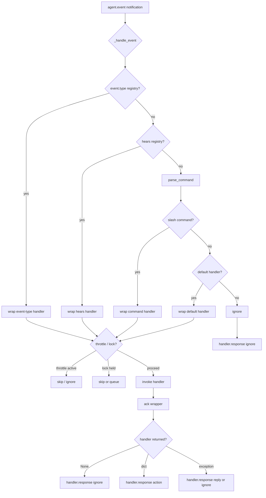

# SDK Usability Improvements — Bosun Phase 2 Review

## Summary

Make the Python SDK a safer, more complete facade for bot authors by adding first-class decorators for non-slash and event-type inbound events, guaranteed daemon acknowledgement, per-request timeouts, throttling/concurrency helpers, and small operational helpers. The changes are mostly additive; the only intentional behavioral change is that decorated handlers returning `None` now send `handler_response(action="ignore")` instead of leaving the event unacknowledged. A `Bot(..., auto_acknowledge=True)` default enables this behavior; existing bots can set `auto_acknowledge=False` to preserve the prior no-response semantics during a transition.

## Problem Frame

The Bosun Phase 2 review showed that the high-level `Bot` class covers slash commands, status, and rate-limit notifications well, but leaves bot authors to subclass and override `_handle_event` for plain-text group/DM triggers, to remember daemon acknowledgements manually, and to reimplement timeouts, throttling, and concurrency guards. The goal is to close those gaps so bot authors can stay in the decorator API and write less fragile, better-observed handlers.

## Requirements

- R1. Add decorators that register handlers for specific `agent.event` subtypes without requiring subclasses to override `_handle_event` (origin R1, AC1).
- R2. Add a decorator for plain-text command triggers that is symmetric with `@bot.command` for slash commands (origin R2, AC2).
- R3. Automatically send a terminal `handler_response` for every decorated handler return path, including `None` returns, and provide `bot.ignore` / `bot.reply` helpers for explicit responses (origin R3, AC3).
- R4. Expose the bot's own public key as `bot.own_pubkey`, populated from the daemon's registration response (origin R4, AC4).
- R5. Add optional per-request timeouts to generated client methods and a default timeout on `PactoClient` construction (origin R5, AC5).
- R6. Provide a per-key throttling decorator (origin R6, AC6).
- R7. Provide a per-name concurrency-lock decorator (origin R7, AC6).
- R8. Add a high-level `send_group_message` helper on `Bot` (origin R8).
- R9. Add a high-level `is_squad_member` helper on `Bot` (origin R9).
- R10. Provide input-validation helpers for common wire types (origin R10).
- R11. Log unknown notification types at warning level instead of silently dropping them (origin R11, AC7).
- R12. Document the handler-response contract clearly in the SDK README with examples for `ignore` and `reply` (origin R12, AC8).

## Acceptance Criteria

- AC1. A bot can register a plain-text command handler without overriding `_handle_event`.
- AC2. A bot can register a handler for a specific `agent.event` type without overriding `_handle_event`.
- AC3. The SDK automatically sends `handler_response` for all registered handlers when they return `None` or a valid response dict.
- AC4. `Bot` exposes `own_pubkey` populated from the daemon or registration response.
- AC5. Generated client methods accept an optional `timeout` parameter.
- AC6. The SDK provides a throttling decorator and a concurrency-lock decorator.
- AC7. The SDK logs unknown notification types at warning level instead of silently dropping them.
- AC8. SDK documentation includes a clear handler-response contract and examples for `ignore` and `reply`.

## Key Technical Decisions

- KTD1. **Event-type routing lives in `Bot._handle_event`, not in subclasses.** Inspect `event.type` before command parsing so `@bot.event` and `@bot.dm` can route `mls_group_message_received` and `dm_received` without subclass overrides.
- KTD2. **Plain-text matching is exact first-token matching.** `@bot.hears("!snapshot")` matches the trimmed first token only; a regex variant is deferred. This keeps the parser consistent with the existing small-command grammar and avoids importing `re` in the default path.
- KTD3. **Guaranteed acknowledgement via a single wrapper, gated by `auto_acknowledge`.** A `Bot` constructor flag `auto_acknowledge` defaults to `True`. When enabled, every decorated handler is wrapped so that a `None` return becomes `action="ignore"`, an exception respects the existing `reply_on_error` constructor flag (default `True`), and a valid dict is forwarded unchanged. This gives guaranteed acknowledgement without forcing users to change handlers that already return valid dicts. When `auto_acknowledge=False`, decorated handlers preserve the prior no-response semantics for `None` returns.
- KTD4. **Timeouts are implemented in the generated client with a conservative default.** The codegen template adds `timeout: float | None = None` to `PactoClient.__init__` and `_request`, defaulting to a global value (e.g., 30 seconds). Each generated method forwards its own `timeout` argument; `None` disables the timeout for that call. `asyncio.wait_for` wraps the response future. This keeps transport logic unchanged and makes timeouts available to every method. Notification methods are fire-and-forget (no response future), so timeouts are not applicable.
- KTD5. **Throttle and lock state is in-memory per `Bot` instance.** Reset on restart is acceptable for these use cases; persistent state would require a daemon contract change and is out of scope.
- KTD6. **Own-pubkeys are returned as a map in the `HandlerRegisterResponse` result for both `handler.register` and `handler.reconnect`.** The daemon returns `own_pubkeys: dict[str, str]` mapping each registered `bot_id` to its npub. The SDK looks up `own_pubkeys[bot_id]` to populate `bot.own_pubkey`. This avoids ambiguity when a handler registers for multiple bots and keeps the response additive.
- KTD7. **Validation helpers live in a new `validate` module.** This keeps the public API discoverable (`from pacto_bot_sdk import validate`) and avoids bloating `Bot` with wire-format specifics.

## High-Level Technical Design

The flowchart shows the precedence order: event-type decorators beat `hears` beat slash commands beat the default handler. Each selected handler may be wrapped by `@bot.throttle` and/or `@bot.lock` before invocation; a throttled or skipped-locked call returns early and the acknowledgement wrapper sends `handler.response ignore`. A handler that proceeds is then wrapped for guaranteed acknowledgement, which turns `None` into `ignore`, forwards explicit dicts, and handles exceptions based on `reply_on_error`.

## Implementation Units

### U1. Event-type decorators

**Priority:** P1

**Goal:** Add `@bot.event(type)` and `@bot.dm` decorators that route `agent.event` notifications by `event.type` without subclassing `Bot`.

**Requirements:** R1, AC1.

**Dependencies:** None.

**Files:**
- `python/src/pacto_bot_sdk/bot.py` (decorators, `_handle_event` routing)
- `python/tests/test_bot.py`

**Approach:**
- Add `self._event_handlers: dict[str, CommandHandler]` in `Bot.__init__`.
- Add `Bot.event(self, type: str)` decorator that registers under the event type.
- Add `Bot.dm` as a convenience decorator registering `dm_received`.
- In `_handle_event`, inspect `event.type` first; if a registered event-type handler exists, route to it and bypass command parsing. Because event-type decorators take precedence, bot authors should use `@bot.dm` only when they want to handle every DM event; for plain-text DM commands, use `@bot.hears` with `event_types=["dm_received"]` in the `Bot` constructor.
- Event-type handlers return the same response contract as command handlers.

**Patterns to follow:** Mirror the existing `@bot.command` registry and decorator shape in `python/src/pacto_bot_sdk/bot.py`.

**Test scenarios:**
- Covers AC1. `@bot.event("mls_group_message_received")` handler receives the event when `event.type` matches and the bot constructor includes `event_types=["mls_group_message_received"]`.
- `@bot.dm` handler receives `dm_received` events when the bot constructor includes `event_types=["dm_received"]`.
- An unmatched `event.type` falls through to slash-command parsing and default handler behavior.
- Multiple event types can be registered on the same bot.
- Returning `None` from an event-type handler triggers auto-acknowledgement after U3 lands.

**Verification:** Unit tests in `python/tests/test_bot.py` show event-type routing and backwards-compatible fall-through.

---

### U2. Plain-text command decorator

**Priority:** P1

**Goal:** Add `@bot.hears("!snapshot")` for literal plain-text command triggers, matching the first token exactly after trimming.

**Requirements:** R2, AC2.

**Dependencies:** U1.

**Files:**
- `python/src/pacto_bot_sdk/bot.py`
- `python/src/pacto_bot_sdk/parser.py` (optional helper for tokenization)
- `python/tests/test_bot.py`

**Approach:**
- Add `self._hears: dict[str, CommandHandler]` in `Bot.__init__`.
- Add `Bot.hears(self, token: str)` decorator that stores the handler keyed by the trimmed token.
- In `_handle_event`, after checking event-type registries and before calling `parse_command`, if `event.content` is non-empty split the first token and look it up in `_hears`.
- If matched, invoke the handler; if not, proceed to slash-command parsing.
- Keep token matching whitespace-trimmed and case-sensitive.

**Patterns to follow:** Reuse the defensive token limits from `parse_command` (`MAX_TOKENS`, `MAX_TOKEN_BYTES`).

**Test scenarios:**
- Covers AC2. `@bot.hears("!snapshot")` triggers on `!snapshot` and `!snapshot   extra`.
- A leading slash command `/snapshot` does not match `@bot.hears("!snapshot")` and routes normally.
- Unknown plain text falls through to `@bot.default` or `ignore`.
- Multiple hears decorators can coexist.
- Decorator stacking with `@bot.throttle` and `@bot.lock` works after U6 and U7 land.

**Verification:** `python/tests/test_bot.py` asserts exact routing and fall-through behavior.

---

### U3. Auto-acknowledge and response helpers

**Priority:** P1

**Goal:** Make it impossible for a bot author to forget the daemon acknowledgement by always sending `handler_response` and providing explicit helpers.

**Requirements:** R3, AC3.

**Dependencies:** U1, U2.

**Files:**
- `python/src/pacto_bot_sdk/bot.py`
- `python/tests/test_bot.py`

**Approach:**
- Add `Bot.ignore(event)` and `Bot.reply(event, content)` helpers that return the canonical response dict. `bot.reply` validates that `content` is a `str` and within a reasonable length bound; callers remain responsible for sanitizing user-derived content.
- Add an `auto_acknowledge: bool = True` constructor argument to `Bot`.
- Refactor `_handle_event` so all decorated handlers are invoked through a single `_invoke_handler` wrapper when `auto_acknowledge` is enabled. The wrapper:
  - Catches exceptions and sends `reply` or `ignore` based on the existing `reply_on_error` constructor flag. The `reply` path uses the pre-configured `error_message`, not the raw exception text or stack trace, so internal details are not leaked to the chat.
  - Sends `ignore` when the handler returns `None`.
  - Validates explicit dict returns contain `event_id` and `action`; otherwise logs a warning and sends `ignore`.
- When `auto_acknowledge=False`, preserve the existing behavior: `None` returns send no `handler_response`.
- Preserve the existing behavior for malformed/non-slash events when no handlers match.
- Status and rate-limited handlers are not event-response handlers and stay unchanged.

**Patterns to follow:** Use the same exception logging pattern (`traceback` at debug, concise message at error) as the current `_handle_event`.

**Test scenarios:**
- Covers AC3. With `auto_acknowledge=True`, a command handler returning `None` results in `handler_response(action="ignore", event_id=...)`.
- With `auto_acknowledge=False`, a command handler returning `None` results in no `handler.response` frame (preserves legacy behavior).
- A handler returning `bot.reply(event, "text")` results in `action="reply"` with content, regardless of `auto_acknowledge`.
- A handler raising an exception with `reply_on_error=True` results in `action="reply"` with `error_message`.
- A handler raising with `reply_on_error=False` results in `action="ignore"`.
- A handler returning an invalid dict shape results in `action="ignore"` and a warning log.
- `Bot.ignore` and `Bot.reply` return the expected dict shape.

**Verification:** `python/tests/test_bot.py` asserts outgoing `handler.response` frames for every return and error path.

---

### U4. Extend daemon registration response with bot pubkeys

**Priority:** P2

**Goal:** Give the Python SDK access to the bot's own public key by returning it in the handler registration response.

**Requirements:** R4, AC4.

**Dependencies:** None.

**Files:**
- `schemas/jsonrpc.json` (extend `HandlerRegisterResponse` and `HandlerReconnectResponse` results)
- `src/transport/protocol.rs` (extend both response structs)
- `src/dispatch.rs` (populate field from `ClientManager` / bot identities)
- `python/src/pacto_bot_sdk/_generated/models.py` (regenerated)
- `tests/schema_sync.rs` (regenerated snapshot)
- `python/tests/test_generated_models.py`
- `python/tests/test_bot.py`

**Approach:**
- Add `own_pubkeys: dict[str, str]` to both response schemas in `schemas/jsonrpc.json`, making it optional with a default of `{}` so older daemons are compatible.
- Mark the corresponding Rust struct fields with `serde(default)` so older daemon binaries that omit the field still deserialize correctly on the SDK side.
- Update the `handler_register` and `handler_reconnect` dispatch handlers to populate the map from the registered bot identities.
- Regenerate `python/src/pacto_bot_sdk/_generated/models.py` and `src/*_generated.rs` with `cargo xtask codegen`.
- Update schema sync snapshots.
- Bump `info.version` in `schemas/jsonrpc.json` to signal the contract change.

**Patterns to follow:** Schema-first evolution; `schemas/jsonrpc.json` is the source of truth. See `docs/plans/2026-06-29-003-feat-generated-python-client-plan.md`.

**Test scenarios:**
- `handler.register` returns a response containing `own_pubkeys` mapping each registered `bot_id` to its npub.
- `handler.reconnect` returns the same map.
- For a single-bot Python `Bot`, `bot.own_pubkey` equals the npub of `bot.bot_id`.
- Generated Pydantic models accept both missing `own_pubkeys` (default `{}`) and populated maps.
- Rust schema sync test passes after regeneration.

**Verification:** Rust tests (`cargo test`) and Python model tests (`python/tests/test_generated_models.py`) pass after regeneration; `python/tests/test_bot.py` asserts the SDK property is populated.

---

### U5. Bot helpers: own pubkey, send group message, squad membership

**Priority:** P2 (R4), P3 (R8, R9)

**Goal:** Expose `bot.own_pubkey`, `bot.send_group_message`, and `bot.is_squad_member` on the high-level `Bot` class.

**Requirements:** R4, R8, R9, AC4.

**Dependencies:** U4.

**Files:**
- `python/src/pacto_bot_sdk/bot.py`
- `python/src/pacto_bot_sdk/__init__.py` (export if needed)
- `python/tests/test_bot.py`

**Approach:**
- In `_run_once`, after successful registration or reconnect, store the `result.own_pubkeys` map in a `Bot` instance attribute.
- Expose `bot.own_pubkey` as a property returning `str | None` by looking up `self.bot_id` in the map.
- Add `async def send_group_message(self, group_id: str, content: str) -> str` that calls `self._client.agent_send_group_message` with `bot_id` filled in.
- Add `async def is_squad_member(self, group_id: str, member_pubkey: str) -> bool` that calls `self._client.agent_is_squad_member` and returns `response.is_member`.
- Document that `own_pubkey` is `None` until registration completes and `None` when the daemon omits the map or the bot's entry. The SDK trusts the daemon and transport for identity; the self-message guard is only reliable when that trust assumption holds.

**Patterns to follow:** Mirror the existing `send_dm` and `set_profile` helpers in `bot.py`.

**Test scenarios:**
- Covers AC4. After registration, `bot.own_pubkey` equals the npub returned for `bot.bot_id` in the `own_pubkeys` map.
- `send_group_message` emits the correct `agent.send_group_message` frame with `bot_id` pre-filled.
- `is_squad_member` returns `True`/`False` from the daemon response and pre-fills `bot_id`.
- `own_pubkey` is `None` before registration completes and `None` when the daemon omits the map.

**Verification:** `python/tests/test_bot.py` asserts property values and outgoing frames.

---

### U6. Generated client timeouts

**Priority:** P2

**Goal:** Add optional per-request timeouts and a default timeout to the generated `PactoClient`.

**Requirements:** R5, AC5.

**Dependencies:** None.

**Files:**
- `python/scripts/generate.py` (codegen template changes)
- `python/src/pacto_bot_sdk/_generated/client.py` (regenerated)
- `python/tests/test_client.py`
- `python/tests/test_generator.py`
- `tests/schema_sync.rs` (no schema change, but generated client must be in sync)

**Approach:**
- Modify the generator to emit:
  - `def __init__(self, transport: Any, timeout: float | None = None)` storing `self._default_timeout` with a default of 30.0 seconds when not provided.
  - `async def _request(self, method, params, timeout: float | None = None)` that uses `asyncio.wait_for(future, timeout)` when the effective timeout is not `None`.
  - Each request method signature includes `timeout: float | None = None` and passes the effective timeout (`timeout if timeout is not None else self._default_timeout`) to `_request`.
- Notification methods do not need timeouts.
- Convert `asyncio.TimeoutError` into `PactoClientError` with a clear message when the timeout fires, so callers get a consistent exception type.
- Regenerate the client and run generator tests.

**Patterns to follow:** Use `asyncio.wait_for` as already used in `bot.py` for shutdown/backoff waits.

**Test scenarios:**
- Covers AC5. A request with a short `timeout` raises `PactoClientError` when the response is delayed.
- `PactoClient(timeout=5.0)` uses 5.0 seconds as the default for all methods unless overridden.
- `PactoClient()` uses the default 30.0-second timeout.
- A per-call `timeout=None` overrides the constructor default and disables the timeout (preserves legacy indefinite wait).
- The generator emits the `timeout` parameter on `_request` and every request method.
- Regenerated `client.py` is byte-for-byte reproducible.
- Existing generator snapshots in `python/tests/test_generator.py` are updated for the new method signatures.

**Verification:** `python/tests/test_client.py` and `python/tests/test_generator.py` pass; `cargo test` schema sync passes.

---

### U7. Throttle and lock decorators

**Priority:** P2

**Goal:** Provide `@bot.throttle(key=..., window_seconds=...)` and `@bot.lock(name=...)` decorators for in-memory per-key throttling and serialized handler execution.

**Requirements:** R6, R7, AC6.

**Dependencies:** U3 (so throttled/locked handlers still get auto-acknowledgement).

**Files:**
- `python/src/pacto_bot_sdk/bot.py`
- `python/tests/test_bot.py`

**Approach:**
- Add `self._throttle_last_seen: dict[str, float]` and `self._locks: dict[str, asyncio.Lock]` in `Bot.__init__`. Guard all access to these dicts with a dedicated `self._decorator_state_lock` (an `asyncio.Lock`) to prevent races when handlers run concurrently.
- Add `Bot.throttle(key: Callable[[AgentEventParams], str], window_seconds: float)` decorator. When the decorated handler is invoked:
  - Compute `key(event)` inside a try/except; if the key callable raises, log the error and treat the event as not throttled (allow it through).
  - If the last invocation for that key was within `window_seconds`, skip the handler (return `None`, which U3 turns into `ignore`).
  - Otherwise update the timestamp and invoke the handler.
  - Prune entries older than the largest active window to bound memory growth, or cap the dict at a documented maximum size (e.g., 4096 entries) with LRU eviction.
- Add `Bot.lock(name: str, *, on_conflict: str = "queue", max_waiters: int | None = None)` decorator. When the decorated handler is invoked:
  - Acquire the named `asyncio.Lock`.
  - If `on_conflict="skip"` and the lock is held, skip the invocation.
  - If `on_conflict="queue"` (default), wait for the lock and then invoke. If `max_waiters` is set and the queue of waiters would exceed it, drop the new invocation and return `None`.
- Document that `asyncio.Lock` is non-reentrant; nested handlers sharing a lock name can deadlock.
- Decorators compose with each other and with `@bot.command`, `@bot.hears`, `@bot.event`. Document the recommended stacking order: throttle outermost, then lock, then event/hears/command innermost.

**Patterns to follow:** Use `asyncio.get_running_loop().time()` for monotonic timing, as used in `retry_circuit.py`.

**Test scenarios:**
- Covers AC6. Two rapid invocations of a `@bot.throttle(key=lambda e: e.chat_id, window_seconds=60)` handler result in only one handler call and one `ignore` for the second.
- Throttling across different keys is independent.
- A `@bot.lock(name="snapshot")` handler serializes overlapping calls; with the default `on_conflict="queue"`, the second call waits and runs after the first finishes.
- A `@bot.lock(name="snapshot", on_conflict="skip")` handler skips the second call while the first is running.
- Combined `@bot.throttle` + `@bot.lock` stacking applies throttle first, then lock.
- Throttle state resets on bot restart (in-memory only, acceptable per KTD5).
- Lock acquisition is non-reentrant; document and test that nested handlers sharing a lock name deadlock.

**Verification:** `python/tests/test_bot.py` asserts handler call counts, outgoing frame counts, and timing behavior.

---

### U8. Validation helpers, unknown notification logging, and documentation

**Priority:** P3

**Goal:** Add input-validation helpers, warn on unknown notification types, and document the handler-response contract.

**Requirements:** R10, R11, R12, AC7, AC8.

**Dependencies:** None.

**Files:**
- `python/src/pacto_bot_sdk/validate.py` (new)
- `python/src/pacto_bot_sdk/__init__.py` (export `validate`)
- `python/src/pacto_bot_sdk/bot.py` (unknown notification logging)
- `python/README.md`
- `python/tests/test_bot.py` (unknown notification logging)
- `python/tests/test_generated_models.py` or new `python/tests/test_validate.py`

**Approach:**
- Create `python/src/pacto_bot_sdk/validate.py` with small validators and defensive bounds:
  - `squad_id(value: str) -> str` — validates non-empty string, length ≤ 256, and returns it stripped.
  - `pubkey(value: str) -> str` — accepts bech32 `npub1...` (validates prefix and character set) or 64-hex-char lowercase pubkey; returns the input unchanged; raises `ValueError` otherwise.
  - `event_id(value: str) -> str` — validates non-empty string, length ≤ 128, and returns it.
- Add a `content` validator or helper used by `bot.reply` to enforce that reply content is a `str` with length ≤ some daemon-allowed maximum (e.g., 8192 bytes), raising `ValueError` on oversized or non-string content. Document that callers are still responsible for sanitizing user-derived content.
- Export `validate` from `python/src/pacto_bot_sdk/__init__.py`.
- In `_dispatch_loop`, add an `else` branch that logs unexpected notification types at warning level, but only once per distinct type per `Bot` instance (track seen types in a set) to avoid spam when the daemon introduces a new notification the bot legitimately ignores.
- Update `python/README.md` with a section on the handler-response contract:
  - Explain `ignore` and `reply` actions.
  - Show examples using `@bot.command`, `@bot.hears`, `@bot.event`, and the response helpers.
  - Document that `None` is treated as `ignore`.

**Patterns to follow:** Keep validators pure and side-effect-free; raise `ValueError` on invalid input. Use the existing logger (`self._logger.warn`) for unknown notifications.

**Test scenarios:**
- Covers AC7. An unknown notification type (e.g., a synthetic `BaseModel` subclass not dispatched) results in a warning log.
- Validators accept valid inputs and reject invalid inputs with clear `ValueError` messages.
- `validate` is importable from `pacto_bot_sdk`.
- README examples compile and match the new API.

**Verification:** `python/tests/test_bot.py` asserts the warning log; validator tests pass; README examples are copy-paste checked and at least one example in `python/examples/` uses the new helpers so the contract-test harness can exercise it.

## Scope Boundaries

### In scope
- Additive changes to the Python SDK (`python/src/pacto_bot_sdk/`).
- Generated-client changes via the Python codegen script (`python/scripts/generate.py`).
- The daemon-side `HandlerRegisterResponse` extension needed to populate `bot.own_pubkey`.
- Corresponding tests and README updates.

### Out of scope
- Breaking changes to existing `@bot.command`, `@bot.default`, `@bot.status`, or `@bot.rate_limited` behavior.
- Regex-based `@bot.hears` matching; exact first-token matching is the scope.
- Persistent throttle or lock state across restarts.
- New daemon notification types beyond logging unknown ones.
- Changes to the Rust daemon's dispatch logic beyond the registration response field.

### Deferred to follow-up work
- Regex variant of `@bot.hears` for more complex plain-text patterns.
- Per-bot persistent rate-limit state in the daemon.
- Additional validation helpers beyond `squad_id`, `pubkey`, and `event_id`.
- Type-safe notification dispatch for future daemon notification types.

## Risks & Dependencies

- **Schema-first workflow risk:** Extending `HandlerRegisterResponse` requires updating `schemas/jsonrpc.json`, the Rust daemon structs, and the generated Python models, then running `cargo xtask codegen`. A missed file will fail `tests/schema_sync.rs`. Mitigation: follow the existing schema sync checklist and run the full test gate.
- **Behavioral change risk:** U3 changes the meaning of a handler returning `None` from "no response" to `"ignore" response when `auto_acknowledge=True`. Existing bots that relied on the old no-response behavior can set `auto_acknowledge=False` to preserve the prior semantics during a transition. Mitigation: document the flag and the migration path in the release notes.
- **Codegen determinism risk:** Changes to `python/scripts/generate.py` must remain deterministic and idempotent. Mitigation: extend `python/tests/test_generator.py` to cover the new timeout emission.
- **Cross-language contract risk:** Adding `own_pubkeys` to `HandlerRegisterResponse` and `HandlerReconnectResponse` changes the JSON-RPC contract consumed by any language. Mitigation: the field is optional with a default empty map; older daemons that omit it and older handlers that ignore it continue to work.

## Sources & Research

- Origin recommendations: `docs/2026-07-08-002-sdk-usability-recommendations.md` (R1-R12, AC1-AC8).
- Python SDK design and codegen plan: `docs/plans/2026-06-29-003-feat-generated-python-client-plan.md`.
- Seed SDK plan (parser, decorators, response contract): `docs/plans/2026-06-29-002-feat-python-sdk-seed-plan.md`.
- Reconnection/circuit-breaker pattern: `docs/plans/2026-07-02-001-feat-sdk-reconnection-resilience-plan.md`.
- Handler response contract and daemon dispatch: `docs/plans/2026-06-24-001-feat-pacto-bot-api-daemon-plan.md` (R18, R26, R27).
- Current implementation: `python/src/pacto_bot_sdk/bot.py`, `python/src/pacto_bot_sdk/_generated/client.py`, `python/src/pacto_bot_sdk/parser.py`, `python/src/pacto_bot_sdk/retry_circuit.py`, `python/scripts/generate.py`.

## Open Questions

- None. The daemon-side change to include `own_pubkey` in `HandlerRegisterResponse` was confirmed as in-scope during the scoping synthesis.
