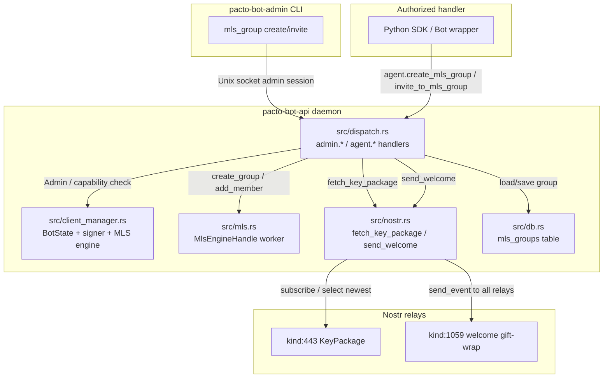
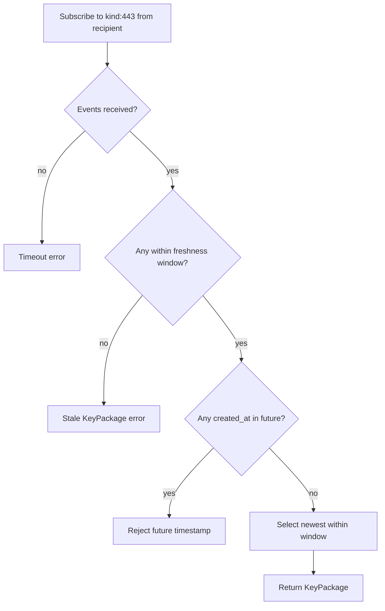

# Plan: Daemon-backed `mls_group` admin command

## Summary

Move the standalone `create-mls-group` utility into the `pacto-bot-api` daemon and expose it as a new `pacto-bot-admin mls_group` subcommand with `create` and `invite` operations. The daemon uses the bot's configured signer, the shared relay pool, and the per-bot MLS engine to fetch KeyPackages, create or extend MLS groups, and publish NIP-59 welcome gift-wraps. Group metadata lives in the daemon's `agent.db`; no raw nsec ever reaches the admin CLI or a handler.

## Problem Frame

The previous `pacto-bot-utils` crate shipped a headless `create-mls-group` binary that required operators to pass a raw creator nsec. Because the binary was included in the production daemon Docker image, it expanded the secret-exposure surface of an otherwise hardened daemon. The binary was reverted, but developers and operators still need a way to bootstrap MLS groups and invite bots. The only secure place for that operation is inside the daemon, where signing keys and relay connections already live.

## Requirements

### Admin CLI and daemon entry points

- R1. The admin CLI supports `pacto-bot-admin mls_group create --bot <bot-id> --group <name> --recipient <npub>`.
- R2. The admin CLI supports `pacto-bot-admin mls_group invite --bot <bot-id> --group <name> --recipient <npub>`.
- R3. The admin CLI sends authenticated JSON-RPC requests to the daemon over the existing Unix socket admin session.
- R4. The daemon exposes `admin.create_mls_group` and requires the `Admin` capability.
- R5. The daemon exposes `admin.invite_to_mls_group` and requires the `Admin` capability.
- R6. The daemon exposes `agent.create_mls_group` for handlers and requires the `CreateMlsGroup` capability.
- R7. The daemon exposes `agent.invite_to_mls_group` for handlers and requires the `InviteToMlsGroup` capability.

### Group creation

- R8. When the group does not exist, `create` creates a new MLS group with the recipient bot as the initial member, publishes a NIP-59 welcome gift-wrap, and stores the group metadata.
- R9. When the group already exists, `create` fails with a clear error instead of silently returning the existing group.
- R10. If the bot is configured without an MLS engine (`mls_db_path`), `create` fails with a clear error instructing the operator to configure the bot for MLS.
- R11. `create` is idempotent only at the network/MLS layer for a single invocation; repeated calls with the same inputs fail because the group exists.

### Group invitation

- R12. When the group exists and the recipient bot is not yet invited, `invite` adds the bot to the existing group, publishes the welcome gift-wrap, and updates the invited-bots list.
- R13. When the group exists and the recipient bot is already invited, `invite` returns the existing wire ID without performing network operations or MLS mutations.
- R14. When the group does not exist, `invite` fails with a clear error instructing the operator to use `create` first.
- R15. If the bot is configured without an MLS engine (`mls_db_path`), `invite` fails with a clear error instructing the operator to configure the bot for MLS.
- R16. `invite` is idempotent at the daemon level: repeated calls with the same bot, group name, and recipient do not create duplicate invitations.

### KeyPackage and welcome handling

- R17. The daemon fetches a `kind:443` KeyPackage authored by the recipient bot from the configured relay pool before creating or adding to the group. The daemon verifies the event signature, confirms the event kind is `443`, and confirms the author pubkey matches the requested recipient before using the KeyPackage; events that fail these checks are treated as absent.
- R18. The daemon applies a configurable freshness window to fetched KeyPackages and rejects stale packages. The default window is 5 minutes and may be overridden per bot in `pacto-bot-api.toml`.
- R19. The daemon signs and publishes the NIP-59 welcome gift-wrap using the bot's configured signer; no raw nsec is passed to the admin CLI or any handler.

### State persistence

- R20. The daemon stores group metadata in `agent.db`: bot ID, group name, wire ID, creator npub, relay URL (the first configured relay for the bot, stored for reference), and the list of invited-bot npubs.
- R21. Group metadata lookups use the `(bot_id, group_name)` composite key.
- R22. The daemon updates the invited-bots list in a single SQLite transaction after a successful MLS mutation and welcome publish. The transaction itself is atomic; the broader sequence (mutation, publish, persist) is not atomic because it spans network and MLS engine operations.

### Security and observability

- R23. The admin CLI and handler methods never accept a raw nsec; the daemon uses only the configured signer backend.
- R24. All errors returned to the admin CLI or handler must not include secret material or KeyPackage ciphertext.
- R25. The daemon emits structured tracing for group creation, invitation, and idempotent skip events.

### Python SDK

- R26. `schemas/jsonrpc.json` declares `agent.create_mls_group` and `agent.invite_to_mls_group` so that generated clients pick them up.
- R27. The Python SDK is regenerated and exposes the new methods; high-level `Bot.create_mls_group` and `Bot.invite_to_mls_group` convenience wrappers are added if the low-level generated methods are not ergonomic enough for bot authors.

### Tests

- R28. Unit tests cover the new MLS engine commands for group creation and member addition.
- R29. Integration tests cover `pacto-bot-admin mls_group create` and `invite` end-to-end against a mock relay and mock bunker.
- R30. Handler method tests cover capability authorization and idempotent re-invitation.
- R31. If `mls_db_path` is configured, it must resolve to a path inside the bot's data directory after canonicalization; paths that escape the data directory, symlinks, or paths under `/tmp` or `/dev/shm` are rejected at config load. The MLS database file and its parent directory are enforced to `0o600` and `0o700` permissions respectively on every open.
- R32. Group names are validated at the dispatch boundary: empty names, names longer than 128 characters, and names containing control characters or filesystem path separators are rejected. Surrounding ASCII whitespace is trimmed before validation; internal whitespace and case are significant after trimming.
- R33. A bot config that lists `SendGroupMessages`, `ReceiveGroupMessages`, `CreateMlsGroup`, or `InviteToMlsGroup` must also set `mls_db_path`; otherwise `validate_config` fails with a clear error.
- R34. The unsigned/signed welcome rumor, seal ciphertext, and gift-wrap ciphertext are never logged, stored, or returned in responses. MLS engine error strings are classified and rewritten before leaving the worker thread; raw MDK strings must not reach `DaemonError`, logs at `INFO` or above, or diagnostics.
- R35. The admin CLI unregisters the temporary `Admin` handler in a cleanup path that runs even if the command fails or is interrupted; the handler is also subject to the daemon's existing handler stale-timeout reap policy.
- R36. `fetch_key_package` waits a bounded timeout (default 10 seconds) for a fresh KeyPackage; if no fresh KeyPackage arrives, the daemon returns a distinct timeout error.

## Key Technical Decisions

- KTD-1. Retire the standalone crate. The `create-mls-group` logic moves into the daemon; no separate crate or binary is shipped. (see origin)
- KTD-2. Persist group metadata in `agent.db` rather than a separate JSON state file. (see origin)
- KTD-3. Reuse the daemon's signer and relay pool. The daemon uses the bot's configured signing backend and the shared relay pool to fetch KeyPackages and publish welcome gift-wraps. (see origin)
- KTD-4. Provide both admin and handler entry points. The admin CLI is the primary human interface; handler methods let authorized bots or automation trigger creation and invitation programmatically. (see origin)
- KTD-5. Match existing NIP-59 gift-wrap behavior. The welcome gift-wrap construction follows the same sign-rumor → seal → ephemeral gift-wrap sequence used by `send_dm`. A cross-cutting NIP-59 compliance fix is out of scope. (see origin)
- KTD-6. Separate `create` and `invite` commands. `create` bootstraps a new group; `invite` adds a member to an existing group. (see origin)
- KTD-7. Fail fast on missing MLS engine. If the bot is configured without `mls_db_path`, `create` and `invite` return a clear error instead of auto-initializing state. (see origin)
- KTD-8. Add explicit MLS config fields. `BotConfig` gains `mls_db_path: Option<PathBuf>` and `mls_key_package_freshness_secs: Option<u64>`. The daemon no longer derives an MLS database path from capabilities; it only initializes an engine when `mls_db_path` is set. At config load, `mls_db_path` is canonicalized and validated to stay inside the bot's data directory; the parent directory is created with `0o700` permissions if missing and the MLS database file is enforced to `0o600` on every open.
- KTD-9. KeyPackage freshness window. The default window is 5 minutes (`300` seconds), overridable per bot via `mls_key_package_freshness_secs`. The daemon fetches KeyPackages from the relay pool, selects the newest within the window by `created_at`, and rejects packages with `created_at` in the future (allowing a 60-second tolerance for relay clock drift) or outside the window. Future-dated and out-of-window packages are both treated as `StaleKeyPackage` (`-32016`). (see origin)
- KTD-10. Welcome publish target. The daemon publishes the NIP-59 welcome gift-wrap to every configured relay in the daemon's relay pool, not only the relay that supplied the KeyPackage. (see origin)
- KTD-11. New handler capabilities. `CreateMlsGroup` and `InviteToMlsGroup` are distinct capabilities, separate from `SendGroupMessages` and `ReceiveGroupMessages`.
- KTD-12. New error variants for new failure modes. `DaemonError` gains `MlsEngineNotConfigured`, `MlsGroupAlreadyExists`, `MlsGroupNotFound`, and `StaleKeyPackage`, each mapped to a dedicated JSON-RPC code in the `-32000` range.
- KTD-13. Group name semantics. Group names are validated at the dispatch boundary and then used as-is: surrounding ASCII whitespace is trimmed, internal whitespace and case are significant, and the `(bot_id, group_name)` composite key uses the trimmed value. Empty names, names longer than 128 characters, and names containing control characters or filesystem path separators are rejected.
- KTD-14. Store invited bots as a JSON array. The `invited_bots` column in `agent.db` stores a JSON array of npubs, matching the existing `handlers` table pattern for capability lists.
- KTD-15. Result shape is a structured object. `admin.create_mls_group`, `admin.invite_to_mls_group`, `agent.create_mls_group`, and `agent.invite_to_mls_group` return `{ "wire_id": string }`, leaving room for future fields without changing the response type.
- KTD-16. KeyPackage fetch timeout. `fetch_key_package` waits a bounded time for a fresh KeyPackage. The default timeout is 10 seconds and is not configurable per bot in this scope; a future KTD may make it configurable.
- KTD-17. Concurrency serialization for create and invite. The dispatch layer holds a per-`(bot_id, group_name)` async lock (e.g., `tokio::sync::Mutex`) for the duration of the check-fetch-mutate-publish-persist sequence, so concurrent calls for the same group serialize rather than racing through the MLS engine or publishing duplicate welcomes. Calls for different groups proceed concurrently.
- KTD-18. Publish the MLS evolution event for `invite`. When `add_member` mutates an existing group, the MLS engine produces both a welcome rumor for the new member and a signed group evolution event (kind:445) for existing members. The daemon publishes both: the welcome gift-wrap to the new member and the pre-signed evolution event to the relay pool without re-signing it.

## Scope Boundaries

### Deferred for later

- Strict NIP-59 compliance using an unsigned rumor inside the seal.
- MLS group re-keying, deletion, or member removal.
- Rich group metadata beyond name, wire ID, creator, and invited bots.
- Multi-relay KeyPackage fallback and relay health checks specific to KeyPackage fetch.
- Web UI or persistent admin panel for group management.
- Reconciling daemon restarts after a crash between the MLS engine mutation and the `agent.db` update.

### Outside this product's identity

- Reviving the standalone `create-mls-group` binary or `pacto-bot-utils` crate.
- Accepting raw nsec in the admin CLI or handler method.
- Group creation for identities not configured in the daemon.
- Auto-initializing an MLS engine when one is not configured.

## High-Level Technical Design

### Component topology



### Create and invite flow

```mermaid
sequenceDiagram
  participant O as Operator / Handler
  participant A as pacto-bot-admin CLI
  participant D as pacto-bot-api daemon
  participant R as Nostr relays
  participant B as Bot being invited

  O->>A: mls_group create --bot echo-bot --group squad --recipient <npub>
  A->>D: handler.register (Admin capability)
  D-->>A: handler_id
  A->>D: admin.create_mls_group {bot_id, group, recipient}
  D->>D: require Admin capability; lookup bot
  D->>D: fail if bot.mls is None
  D->>D: fail if (bot_id, group) already exists in agent.db
  D->>R: subscribe kind:443 from recipient
  R-->>D: KeyPackage events
  D->>D: select newest KeyPackage within freshness window
  D->>D: MlsEngineHandle.create_group
  D->>D: sign + publish NIP-59 welcome gift-wrap
  D->>D: insert mls_groups row
  D-->>A: {wire_id}
  A->>D: handler.unregister
  A-->>O: print wire_id
```

### KeyPackage freshness gate



## System-Wide Impact

### Entry points and interfaces

- **Admin CLI.** `src/admin.rs` gains a new `Command::MlsGroup` subcommand with `Create` and `Invite` variants. The commands are Unix-only and run through `with_admin_session`, registering a temporary admin handler for the duration of the request. The CLI is the primary human entry point for operations R1 and R2.
- **JSON-RPC surface.** `src/transport/protocol.rs` adds `admin.create_mls_group`, `admin.invite_to_mls_group`, `agent.create_mls_group`, and `agent.invite_to_mls_group`. All four methods share the same params shape (`{bot_id, group_name, recipient}`) and return `{wire_id: string}`.
- **Capability model.** `src/config.rs` adds `CreateMlsGroup` and `InviteToMlsGroup` to `VALID_CAPABILITIES`. Admin methods require the `Admin` capability through `require_admin_or_self`; agent methods require the corresponding new capability through `is_authorized`. Agent methods are subject to rate limiting; admin methods are not because they are already protected by an authenticated Unix-socket session.
- **Config schema.** `schemas/config.json` and the generated `src/config_generated.rs` gain `mls_db_path` and `mls_key_package_freshness_secs` per bot. The daemon stops inferring the MLS engine from `SendGroupMessages` and only initializes it when `mls_db_path` is set.
- **Python SDK.** `schemas/jsonrpc.json` declares the new methods, `cargo xtask codegen` regenerates the low-level client, and `python/src/pacto_bot_sdk/bot.py` adds `Bot.create_mls_group` and `Bot.invite_to_mls_group` wrappers.

### Internal components affected

- **`src/client_manager.rs` and `src/bot_state.rs`.** `BotState` is constructed with an optional `MlsEngineHandle`. The `ClientManager` exposes the engine to dispatch, and dispatch must fail with `MlsEngineNotConfigured` when the engine is absent.
- **`src/mls.rs`.** The per-bot MLS engine worker gains `CreateGroup` and `AddMember` commands. It parses KeyPackage events, mutates the MLS engine state, and returns the wire ID and unsigned welcome rumor.
- **`src/nostr.rs`.** `NostrClient` gains `fetch_key_package` and `send_welcome`. `fetch_key_package` uses a live relay subscription and enforces the freshness window; `send_welcome` reuses the existing NIP-59 gift-wrap pipeline.
- **`src/db.rs`.** The `agent.db` schema gains the `mls_groups` table. New `load_mls_group`, `save_mls_group`, and `is_bot_invited` helpers are used by dispatch.
- **`src/dispatch.rs`.** New admin and handler method handlers plus a shared inner helper orchestrate the full check-fetch-mutate-publish-persist sequence. `src/errors.rs` gains the new `DaemonError` variants mapped to JSON-RPC codes.

### Failure propagation

- A missing bot or missing MLS engine is caught at the top of the dispatch handler and returned as a JSON-RPC error before any network or MLS operation.
- A stale or missing KeyPackage is returned as `InvalidKeyPackage` (`-32017`), `StaleKeyPackage` (`-32016`), or a timeout error after the `NostrClient` fetch completes; no MLS mutation occurs.
- An MLS engine error is wrapped in `DaemonError::Mls` and sanitized at the dispatch boundary before the JSON-RPC response is sent.
- A DB error during the final persistence step is returned to the caller. Because the MLS mutation and welcome publish have already happened, the caller sees an error even though the Nostr side effects are durable. This is the crash-between-mutation-and-DB-update risk described in the Risks section.

### Data lifecycle risks

- **MLS engine state vs. `agent.db`.** The MLS engine persists its own state in the `mls_db_path` database. `agent.db` stores the mapping from `(bot_id, group_name)` to `wire_id`, `creator`, `relay`, and `invited_bots`. A crash after the engine mutation but before the DB update leaves the group usable in the MLS engine but unrecorded in the daemon. The deferred reconciliation item covers this.
- **KeyPackage freshness.** KeyPackages are consumed by reference; the daemon does not store or mark them as used. Reliance on the freshness window limits replay of old packages but does not prevent a fresh KeyPackage from being reused in a concurrent race.
- **Welcome gift-wrap durability.** The daemon publishes the welcome to every configured relay before persisting the group. If the DB write fails, the welcome is already on the network and may be accepted by the recipient even though the daemon does not know about the group.
- **Idempotency boundaries.** `create` is idempotent only within a single call (the network layer may retry the publish); repeated calls fail because the `(bot_id, group_name)` key exists. `invite` is idempotent at the daemon level for already-invited recipients; the check is performed before the KeyPackage fetch and MLS mutation. A per-`(bot_id, group_name)` async lock serializes both operations to prevent duplicate groups and duplicate welcomes.

### Security-sensitive surfaces

- **KeyPackage validation surface.** The daemon now fetches arbitrary `kind:443` events from public relays and feeds them into the per-bot MLS engine. A malicious or buggy relay can return malformed, replayed, or misattributed KeyPackages. The implementation must verify the event signature and author before any MLS parse, and must validate that the event is actually `kind:443`.
- **NIP-59 welcome gift-wraps.** The welcome path reuses the daemon's existing gift-wrap pipeline, which signs the rumor before sealing it. This is consistent with the current DM behavior and is accepted as a known non-compliance with NIP-59 for this feature. Implementers must ensure the signed rumor, seal content, and gift-wrap ciphertext are never written to logs or returned in errors.
- **Admin session expansion.** The admin CLI registers a temporary handler with the `Admin` capability for the duration of each `mls_group` command. This handler can invoke any admin method, so R35 requires the CLI to unregister it in a cleanup path and the daemon to reap stale handlers via the existing handler timeout policy.
- **New capabilities and config fields.** `CreateMlsGroup` and `InviteToMlsGroup` are added to the capability allow-list, and `mls_db_path` / `mls_key_package_freshness_secs` are added to the bot config. Existing bot configs will not have these capabilities, so they cannot be used until the config is updated.
- **Group metadata persistence.** The `mls_groups` table in `agent.db` stores group names, wire IDs, creator npubs, relay URLs, and invited-bot npubs. This table is protected by the same `0o600` permission model as the rest of `agent.db`, but backups and file copies must preserve those permissions.
- **Error surface expansion.** The new `-32013` through `-32017` error codes and the KeyPackage/MLS error paths introduce new opportunities to leak cryptographic material or filesystem paths. Redaction must be applied to all new paths.

## Implementation Units

### U1. Add MLS config fields and conditional engine initialization

**Goal:** Make the MLS engine explicit per bot and configurable via `pacto-bot-api.toml`.

**Requirements:** R10, R15, R31, R33, KTD-8

**Dependencies:** none

**Files:**
- `schemas/config.json` — add `mls_db_path` and `mls_key_package_freshness_secs` to the bot item schema.
- `src/config.rs` — extend `BotConfig` with the two fields; add `CreateMlsGroup` and `InviteToMlsGroup` to `VALID_CAPABILITIES`; validate that any MLS-related capability is accompanied by `mls_db_path`.
- `src/config_generated.rs` — regenerated by `cargo xtask codegen`.
- `src/client_manager.rs` — initialize `BotState::new_with_mls` only when `mls_db_path` is set; otherwise leave `mls` as `None`. Canonicalize the path, validate it stays inside the bot's data directory, and create the parent directory with `0o700` before opening the engine.
- `src/bot_state.rs` — verify `new_with_mls` handles the provided path and enforces permissions.

**Approach:** The daemon stops inferring the MLS engine from `SendGroupMessages`. The engine exists only when `mls_db_path` is explicitly configured. The path is canonicalized and sandboxed to the bot's data directory. The `mls_key_package_freshness_secs` default is applied at call sites when the field is `None`. Capability validation is updated so bot configs can list the new capabilities, and configs that list any MLS capability without `mls_db_path` fail validation.

**Patterns to follow:** Existing config schema and code generation in `schemas/config.json` and `xtask/src/codegen.rs`; existing `VALID_CAPABILITIES` allow-list in `src/config.rs`; existing `ClientManager::new` initialization logic in `src/client_manager.rs`.

**Test scenarios:**
- **Happy path:** Bot with `mls_db_path` and `mls_key_package_freshness_secs: 60` initializes an MLS engine and reports it in health.
- **Edge case:** Bot without `mls_db_path` initializes with `mls: None` even when `SendGroupMessages` is present.
- **Error path:** Config with `CreateMlsGroup` or `InviteToMlsGroup` capability but no `mls_db_path` fails `validate_config`.
- **Error path:** Config with an `mls_db_path` that escapes the bot data directory or points to `/tmp` or `/dev/shm` is rejected at load.
- **Integration:** `pacto-bot-api.toml` with the new fields loads successfully and round-trips through `DaemonConfig::load`.

**Verification:** `make validate` passes; config unit tests verify the new fields; daemon startup tests confirm the engine is initialized conditionally.

---

### U2. Add MLS engine worker commands for group creation and member addition

**Goal:** Extend the per-bot MLS engine with `create_group` and `add_member` operations that return the wire ID and unsigned welcome rumor (and, for `add_member`, the signed evolution event).

**Requirements:** R8, R12, R28, R34, KTD-3, KTD-18

**Dependencies:** U1

**Files:**
- `src/mls.rs` — add `MlsCommand::CreateGroup` and `MlsCommand::AddMember`; add `MlsEngineHandle::create_group` and `add_member` public async methods; return the wire ID and unsigned welcome rumor (and the signed evolution event for `add_member`).
- `src/errors.rs` — map new `MlsError` outcomes to `DaemonError` when needed.

**Approach:** The worker thread receives the recipient's KeyPackage event, the creator's public key, and the group name. It validates the KeyPackage structure (non-empty content, correct kind, valid author) before calling the engine, then calls `engine.parse_key_package`, builds `NostrGroupConfigData` with random `image_hash`, `image_key`, and `image_nonce`, and calls `engine.create_group`. It returns `hex::encode(group.nostr_group_id)` and the first welcome rumor. For `add_member`, it looks up the group by wire ID, calls `engine.add_members`, calls `engine.merge_pending_commit`, and returns the welcome rumor plus the signed group evolution event (kind:445). Errors are mapped to `MlsError` variants without leaking key material; the fallback `MlsError::Engine` uses a fixed generic message and logs the original MDK string only at `DEBUG` after redaction.

**Technical design (directional guidance):** The `CreateGroup` command takes `{ creator: PublicKey, key_package: Event, group_name: String, tx: oneshot::Sender<Result<(String, UnsignedEvent), MlsError>> }`. The `AddMember` command takes `{ wire_id: String, key_package: Event, tx: oneshot::Sender<Result<(UnsignedEvent, Event), MlsError>> }`.

**Patterns to follow:** Existing `MlsCommand` / `MlsEngineHandle` worker-thread pattern in `src/mls.rs`; reference MDK API usage from commit `f25a2c2` (`crates/pacto-bot-utils/src/mls.rs`).

**Test scenarios:**
- **Happy path:** `create_group` returns a 64-character hex wire ID and a non-empty welcome rumor.
- **Happy path:** `add_member` to an existing group returns a non-empty welcome rumor and a non-empty signed evolution event.
- **Error path:** `add_member` with an unknown wire ID returns `MlsError::GroupNotFound`.
- **Error path:** Invalid KeyPackage content (e.g., empty, wrong kind, wrong author) returns `MlsError::Engine` with a safe, fixed message and no raw MDK string.
- **Integration:** Commands run on the worker thread without blocking the async runtime.

**Verification:** `cargo test` passes for the new `src/mls.rs` unit tests.

---

### U3. Add Nostr KeyPackage fetch and welcome gift-wrap methods

**Goal:** Give the daemon the ability to fetch a recipient's KeyPackage from the relay pool and publish a NIP-59 welcome gift-wrap for the welcome rumor produced by the MLS engine.

**Requirements:** R17, R18, R19, R34, R36, KTD-5, KTD-9, KTD-10, KTD-16, KTD-18

**Dependencies:** U2

**Files:**
- `src/nostr.rs` — add `NostrClient::fetch_key_package(recipient, timeout, freshness)` and `NostrClient::send_welcome(signer, recipient, welcome_rumor)` and `NostrClient::send_evolution_event(event)`.

**Approach:** `fetch_key_package` subscribes to `Kind::MlsKeyPackage` from the recipient, waits for a bounded timeout (default 10 seconds), collects all matching events, filters out events that fail signature verification, kind check, or author match, and selects the newest one whose `created_at` is within `freshness` of now and not in the future (allowing a 60-second tolerance). `send_welcome` follows the existing `send_dm` NIP-59 sequence: sign the `Kind::MlsWelcome` rumor with the bot signer, NIP-44 encrypt the seal to the recipient, sign the seal, generate an ephemeral key pair, NIP-44 encrypt the gift-wrap content to the recipient, sign the `Kind::GiftWrap` wrapper, and publish via `client.send_event` to every relay. `send_evolution_event` publishes a pre-signed kind:445 event to every relay without re-signing it.

**Technical design (directional guidance):** The fetch method returns `Result<(Event, Duration), DaemonError>` where the duration is the age of the selected KeyPackage, or an error if no fresh KeyPackage is found. The welcome method returns `Result<EventId, DaemonError>`.

**Patterns to follow:** Existing `send_dm` and `send_group_message` in `src/nostr.rs`; existing `NostrClient` notification handling in `receive_events`.

**Test scenarios:**
- **Happy path:** Covers AE1. A fresh KeyPackage injected into the mock relay is fetched and selected.
- **Edge case:** Covers AE8. A KeyPackage older than the freshness window is rejected with a distinct error.
- **Edge case:** Multiple KeyPackages exist; the newest within the window is selected.
- **Edge case:** A KeyPackage with a future `created_at` is rejected.
- **Error path:** A forged or misattributed KeyPackage (wrong signature, kind, or author) is treated as absent and yields a timeout or not-found error.
- **Error path:** No KeyPackage arrives within the 10-second timeout; a distinct timeout error is returned.
- **Multi-relay publish:** With `NostrClient` connected to two `MockRelay` instances, `send_welcome` publishes the same `kind:1059` gift-wrap to both relays (KTD-10).
- **Secret-redaction:** When `fetch_key_package` or `send_welcome` fails, assert that the returned `DaemonError` message and any captured logs do not contain the KeyPackage ciphertext, nsec, or bunker URI. Use `SensitiveFixture` markers embedded in the KeyPackage content and signer config.
- **Integration:** Covers AE1. The published welcome gift-wrap is kind:1059, addressed to the recipient, and decryptable by the recipient's NIP-59 flow.

**Verification:** Unit tests in `src/nostr.rs` for fetch and welcome construction; mock relay integration tests verify end-to-end publish.

---

### U4. Add `mls_groups` SQLite schema and access helpers

**Goal:** Persist group metadata in `agent.db` with lookups by `(bot_id, group_name)` and a unique wire ID constraint.

**Requirements:** R20, R21, R22, R31, R32, KTD-2, KTD-14

**Dependencies:** none

**Files:**
- `src/db.rs` — add the `mls_groups` table to `run_migrations`; add `Database::load_mls_group`, `Database::insert_mls_group`, `Database::update_mls_group_invite`, and `Database::is_bot_invited` helpers; expose async `Db` wrappers.

**Approach:** The migration creates:

```sql
CREATE TABLE IF NOT EXISTS mls_groups (
    bot_id TEXT NOT NULL,
    group_name TEXT NOT NULL,
    wire_id TEXT NOT NULL UNIQUE,
    creator_npub TEXT NOT NULL,
    relay TEXT NOT NULL,
    invited_bots TEXT NOT NULL,
    PRIMARY KEY (bot_id, group_name)
);
```

`invited_bots` is a JSON array string. `insert_mls_group` performs a strict `INSERT`; a duplicate `(bot_id, group_name)` raises the primary-key constraint error, and a duplicate `wire_id` raises the unique constraint error. `update_mls_group_invite` appends the recipient to the `invited_bots` JSON array (only if not already present) inside a `BEGIN IMMEDIATE` transaction. Load helpers return the row or `None`.

**Patterns to follow:** Existing idempotent migration style in `src/db.rs`; existing JSON-array serialization for `handlers` capability lists; existing `Db` async wrapper pattern.

**Test scenarios:**
- **Happy path:** `insert_mls_group` inserts a row; `load_mls_group` returns it.
- **Happy path:** `update_mls_group_invite` appends a new recipient to the invited-bots list without duplicates.
- **Error path:** Inserting a duplicate `(bot_id, group_name)` fails with a SQLite primary-key constraint error (which the dispatch layer maps to `MlsGroupAlreadyExists`).
- **Error path:** Inserting a duplicate `wire_id` fails with a SQLite unique constraint error.
- **Crash-recovery:** `save_mls_group` runs inside a `BEGIN IMMEDIATE` transaction so that a panic or abort after the MLS mutation but before commit leaves `agent.db` unchanged; a subsequent `load_mls_group` returns `None` and the daemon can retry safely once the engine state is reconciled.
- **Integration:** Migrations are idempotent; existing `agent.db` files upgrade cleanly.

**Verification:** `cargo test` passes for new `src/db.rs` unit tests; `tests/db_corruption.rs` or equivalent migration tests pass.

---

### U5. Add daemon JSON-RPC methods for admin and handler

**Goal:** Implement `admin.create_mls_group`, `admin.invite_to_mls_group`, `agent.create_mls_group`, and `agent.invite_to_mls_group` with correct authorization and error handling.

**Requirements:** R4, R5, R6, R7, R8, R9, R11, R12, R13, R14, R16, R22, R23, R24, R25, R32, R34, R35, KTD-11, KTD-12, KTD-15, KTD-17, KTD-18

**Dependencies:** U1, U2, U3, U4

**Files:**
- `src/dispatch.rs` — add `handle_admin_create_mls_group`, `handle_admin_invite_to_mls_group`, `handle_agent_create_mls_group`, `handle_agent_invite_to_mls_group`, and shared inner helpers.
- `src/transport/protocol.rs` — add `Method` variants, `FromStr` arms, `Method::all()`, and response/params structs.
- `src/transport/http.rs` — add new agent methods to `is_mutating_method` if they should be callable over HTTP; this plan keeps them off the HTTP transport.
- `src/errors.rs` — add new `DaemonError` variants and map them to JSON-RPC codes.

**Approach:** Admin methods use `require_admin_or_self`; agent methods use `is_authorized` with `CreateMlsGroup` or `InviteToMlsGroup`. Both paths share an inner helper that:

1. Looks up the bot; fails with `UnknownBot` if missing.
2. Fails with `MlsEngineNotConfigured` if `bot.mls` is `None`.
3. Validates `group_name` at the dispatch boundary; fails with a clear `InvalidRequest` if it is empty, too long, or contains invalid characters.
4. Acquires a per-`(bot_id, group_name)` async lock to serialize the remainder of the sequence (KTD-17).
5. For `create`, checks `agent.db` for the `(bot_id, group_name)` key; fails with `MlsGroupAlreadyExists` if present.
6. For `invite`, loads the group; fails with `MlsGroupNotFound` if absent; returns the existing wire ID if the recipient is already in `invited_bots`.
7. Fetches the recipient's KeyPackage with the configured freshness window; fails with `StaleKeyPackage` if no fresh package is found or if the selected package fails structural validation.
8. Calls `MlsEngineHandle::create_group` or `add_member`.
9. Signs and publishes the NIP-59 welcome gift-wrap; for `invite`, also publishes the pre-signed group evolution event.
10. Inserts or updates the `mls_groups` row.
11. Returns `{wire_id}`.

The `ClientManager` lock is acquired for lookups and authorization, then released before DB and MLS operations. When both locks are needed, `ClientManager` is taken first. A rate-limit check is applied to the agent methods but not the admin methods (admin methods require an authenticated session).

**Patterns to follow:** Existing `handle_admin_send_test_dm` / `send_test_dm` for admin pattern; existing `handle_send_group_message` / `handle_send_group_message_inner` for capability/rate-limit pattern; existing `require_admin_or_self` in `src/dispatch.rs`; existing `JsonRpcError` mapping in `src/errors.rs`.

**Test scenarios:**
- **Happy path:** Covers AE1. Admin `create` returns a wire ID and publishes a welcome gift-wrap.
- **Happy path:** Covers AE4. Admin `invite` adds a member and returns the same wire ID.
- **Happy path:** Covers AE5. Repeated `invite` returns the existing wire ID and publishes no new welcome.
- **Error path:** Covers AE2. `create` for an existing group returns `MlsGroupAlreadyExists` with code `-32014`.
- **Error path:** Covers AE6. `invite` for a nonexistent group returns `MlsGroupNotFound` with code `-32015`.
- **Error path:** Covers AE3. Bot without `mls_db_path` returns `MlsEngineNotConfigured` with code `-32013`.
- **Error path:** Covers AE7. Handler without the required capability returns `UnauthorizedBot` with code `-32006`.
- **Error path:** Covers AE8. Stale KeyPackage returns `StaleKeyPackage` with code `-32016`.
- **Race — concurrent `create`:** Using `tokio::join!` or `futures::future::join_all`, fire two `dispatch.handle_message` calls for the same `admin.create_mls_group` params with a fresh `kind:443` KeyPackage already injected on `MockRelay`. One call should return `{wire_id}`; the other must return `MlsGroupAlreadyExists` (`-32014`). Use `MockRelay::events()` or `wait_for_event` with a `kind:1059` predicate to assert that exactly one welcome gift-wrap is published.
- **Race — concurrent `invite`:** With the group already persisted and a fresh KeyPackage for the new recipient injected via `MockRelay::inject_event`, fire two simultaneous `admin.invite_to_mls_group` calls for the same recipient. One call should add the member and publish a welcome; the other must return the existing wire idempotently with no new `kind:1059` event. Assert `relay.events()` contains exactly one welcome for that recipient.
- **Crash-recovery boundary:** Manually create the MLS group in the engine (via `MlsEngineHandle` in a test fixture) without inserting the `mls_groups` row, then call `admin.create_mls_group` with the same `(bot_id, group_name)`. Verify the daemon returns a consistent error (`MlsGroupAlreadyExists` or `MlsGroupNotFound`) and does not crash or publish a second welcome. (This documents the current behavior until the deferred startup-reconciliation item is implemented.)
- **Secret-redaction:** Extend `tests/secret_redaction.rs` to call the new methods with synthetic `SensitiveFixture` markers embedded in KeyPackage content, error data, and the nsec-backed config. Assert `assert_no_leak` passes on the JSON-RPC error response, the daemon logs captured by `capture_logs_during`, and the CLI stdout/stderr.

**Verification:** `cargo test` passes for new `src/dispatch.rs` unit tests; `tests/dispatch_integration.rs` (or a new `tests/mls_group_dispatch.rs`) covers the methods; race tests run deterministically under `tokio::test` with `#[tokio::test(flavor = "multi_thread", worker_threads = 2)]` to exercise real concurrency. Secret-redaction tests run under `cargo test --test secret_redaction`.

---

### U6. Add `pacto-bot-admin mls_group` CLI subcommand

**Goal:** Provide the operator-facing `create` and `invite` commands.

**Requirements:** R1, R2, R3, R25

**Dependencies:** U5

**Files:**
- `src/admin.rs` — add `Command::MlsGroup` with `Create` and `Invite` subcommands; add `cmd_mls_group_create` and `cmd_mls_group_invite`; add `MLS_GROUP_AFTER_HELP`.
- `docs/pacto-bot-admin-llms.txt` — regenerate via `cargo xtask docs` after the new command is added.

**Approach:** The command mirrors `cmd_send_test_dm`: load config, resolve data dir and socket path, build a `JsonRpcMessage::request` for `admin.create_mls_group` or `admin.invite_to_mls_group` with `bot_id`, `group_name`, and `recipient`, call `with_admin_session`, deserialize the response into `AdminCreateMlsGroupResponse` / `AdminInviteToMlsGroupResponse`, and print the `wire_id`. The command is Unix-only; a `#[cfg(not(unix))]` arm returns a clear error. The recipient string is validated as a parseable npub or hex public key before the request is sent, but the daemon performs the canonical validation.

**Patterns to follow:** Existing `SendTestDm` command and `cmd_send_test_dm` in `src/admin.rs`; existing `with_admin_session` admin-session helper.

**Test scenarios:**
- **Happy path:** Covers AE1. `pacto-bot-admin mls_group create` prints the wire ID.
- **Happy path:** Covers AE4. `pacto-bot-admin mls_group invite` prints the existing wire ID.
- **Error path:** Covers AE2. `create` for an existing group prints a clear error and exits non-zero.
- **Error path:** Covers AE6. `invite` for a nonexistent group prints a clear error and exits non-zero.
- **Error path:** Non-Unix platform returns a clear "not available" error.
- **Integration:** The temporary admin handler is registered and unregistered around the request; if the CLI is interrupted, cleanup still runs.

**Verification:** `assert_cmd` integration tests in a new or existing `tests/admin_cli_*.rs` file verify the CLI output and exit codes against a mock daemon setup. Run `cargo xtask docs` to regenerate `docs/pacto-bot-admin-llms.txt`.

---

### U7. Update JSON-RPC and config schemas and regenerate types/SDK

**Goal:** Keep the schema-driven contracts and generated code in sync.

**Requirements:** R26, R27

**Dependencies:** U1, U5

**Files:**
- `schemas/jsonrpc.json` — add `admin.create_mls_group`, `admin.invite_to_mls_group`, `agent.create_mls_group`, and `agent.invite_to_mls_group` with their params and result schemas; update the `handler.register` capabilities description to include `CreateMlsGroup` and `InviteToMlsGroup`.
- `schemas/config.json` — already updated in U1.
- `src/transport/protocol_generated.rs` — regenerated by `cargo xtask codegen`.
- `python/src/pacto_bot_sdk/_generated/client.py` — regenerated.
- `python/src/pacto_bot_sdk/_generated/models.py` — regenerated.
- `python/src/pacto_bot_sdk/bot.py` — add `Bot.create_mls_group` and `Bot.invite_to_mls_group` convenience wrappers.
- `tests/schema_sync.rs` — add all four new methods to the `expects_result` list so the schema-sync CI gate passes.

**Approach:** All methods take params `{bot_id, group_name, recipient}` and return `{wire_id: string}`. The schema is updated first; `cargo xtask codegen` regenerates the Rust catalog types and the Python SDK. The Python `Bot` wrappers accept the same arguments and return the `wire_id` string, mirroring the existing high-level method style.

**Patterns to follow:** Schema-first workflow in `AGENTS.md` and the existing `tests/schema_sync.rs` harness; existing Python `Bot` wrapper style in `python/src/pacto_bot_sdk/bot.py`.

**Test scenarios:**
- **Happy path:** `cargo xtask codegen` produces files that pass `tests/schema_sync.rs`.
- **Happy path:** The generated Python SDK exposes the four new methods.
- **Happy path:** The `Bot` wrapper exposes `create_mls_group` and `invite_to_mls_group`.
- **Error path:** A hand-edit to a generated file is caught by `tests/schema_sync.rs`.
- **Mechanical:** `src/transport/http.rs` does not add the new agent methods to `is_mutating_method`; they are callable only over handler WebSocket/unix-socket connections in this scope.

**Verification:** `cargo xtask codegen` followed by `make validate` passes.

---

### U8. Add tests

**Goal:** Prove the feature works end-to-end and covers the requirements.

**Requirements:** R28, R29, R30

**Dependencies:** U1, U2, U3, U4, U5, U6, U7

**Files:**
- `tests/mls_group.rs` — new integration tests for admin CLI and handler methods against mock relay and mock bunker.
- `tests/support/mock_mls_peer.rs` — extend if needed to produce KeyPackage events the daemon can consume.
- `tests/secret_redaction.rs` — extend with synthetic secrets in the new error paths.

**Approach:** Integration tests use `tests/support/mock_relay.rs` to publish KeyPackages and capture welcome gift-wraps, and `tests/support/mock_bunker.rs` for the NIP-46 signer path where desired. Unit tests are added inside `src/mls.rs`, `src/nostr.rs`, `src/db.rs`, and `src/dispatch.rs` as each unit is implemented. Tests are annotated with `/// req(Rx)` comments so the requirement-coverage harness picks them up.

**Patterns to follow:** Existing `tests/mls_send_only.rs` and `tests/mls_inbound.rs` for MLS engine setup; existing `tests/dispatch_integration.rs` for JSON-RPC method testing; existing `tests/admin_cli_bunker.rs` for admin CLI patterns; existing `tests/support/secret_scan.rs` for redaction coverage.

**Test scenarios:**
- **Happy path:** Covers AE1. Admin `mls_group create` with a fresh KeyPackage published by `MockMlsPeer::create_key_package_event` and injected via `MockRelay::inject_event` returns the wire ID and publishes a `kind:1059` welcome.
- **Happy path:** Covers AE4. Admin `mls_group invite` to an existing group returns the same wire ID and publishes a welcome.
- **Happy path:** Covers AE5. Repeated `invite` returns the existing wire ID without a second welcome; assert `relay.events().iter().filter(|e| e.kind == Kind::GiftWrap && ...).count() == 1`.
- **Happy path:** Covers F3 / F4. Handler with `CreateMlsGroup` / `InviteToMlsGroup` capability registered via `handler.register` can call `agent.create_mls_group` and `agent.invite_to_mls_group`.
- **Error path:** Covers AE2. `create` for an existing group returns `MlsGroupAlreadyExists` with code `-32014`.
- **Error path:** Covers AE3. Bot without `mls_db_path` returns `MlsEngineNotConfigured` with code `-32013`.
- **Error path:** Covers AE6. `invite` to a nonexistent group returns `MlsGroupNotFound` with code `-32015`.
- **Error path:** Covers AE7. Handler without `CreateMlsGroup` / `InviteToMlsGroup` returns `UnauthorizedBot` with code `-32006`.
- **Error path:** Covers AE8. Stale KeyPackage returns `StaleKeyPackage` with code `-32016` (future-dated KeyPackages also map here).
- **Error path:** Forged or misattributed KeyPackage (wrong signature, kind, or author) is treated as absent and returns a timeout/not-found error.
- **Error path:** Invalid `group_name` (empty, too long, control/path characters) returns `InvalidRequest` with a clear message.
- **Error path:** Bot config with MLS capabilities but no `mls_db_path` fails `validate_config`.
- **KeyPackage freshness:** Inject three `kind:443` KeyPackages: one future-dated, one stale, one fresh. Verify `fetch_key_package` selects the fresh one and that future/stale/forged ones are ignored.
- **Race — concurrent `create`:** Using two `tokio::spawn` tasks or `tokio::join!`, call `dispatch.handle_message` for `admin.create_mls_group` with the same params simultaneously. Assert one `JsonRpcMessage::Response` with `wire_id` and one `JsonRpcMessage::Error` with code `-32014`, and exactly one `kind:1059` welcome on the mock relay.
- **Race — concurrent `invite`:** With the group persisted and a fresh recipient KeyPackage injected, call `admin.invite_to_mls_group` concurrently. Assert one `kind:1059` welcome and one idempotent `{wire_id}` response with no duplicate welcome.
- **Crash-recovery boundary:** Pre-create the group in the per-bot MLS engine (using `MlsEngineHandle::create_group` directly in the test fixture) but leave `agent.db` empty, then issue `create` and `invite` calls. Verify deterministic error codes without duplicate welcomes, and that the daemon does not overwrite the existing engine group or publish a conflicting welcome.
- **Secret redaction:** Use `tests/support/secret_scan.rs` (`SensitiveFixture`, `assert_no_leak`, `capture_logs_during`) to embed synthetic markers in KeyPackage events, `MlsError` payloads, the nsec config, group names, `mls_db_path`, and welcome rumor/seal/gift-wrap content. Assert no marker appears in JSON-RPC responses, daemon logs, or the stdout/stderr of `pacto-bot-admin mls_group create/invite`. Exercise the new error codes (`-32013`, `-32014`, `-32015`, `-32016`) as well as the MDK engine error path. Note that group names and wire IDs are operational metadata and may appear in error messages; only cryptographic material, filesystem paths, and sealed content are treated as secrets.

**Verification:** `cargo test mls_group` passes for unit tests; `cargo test --test mls_group` passes for the new integration file; `cargo test --test secret_redaction` passes for redaction tests; `cargo test --test admin_cli_mls_group` (or additions to the existing `admin_cli_bunker.rs` style) passes for CLI tests; `make test` and `make validate` pass; the requirement-coverage report shows R1–R30 covered or explicitly deferred.

## Error Codes

The following Pacto-specific JSON-RPC codes are added or reused by this plan:

| Code | Meaning |
|------|---------|
| `-32000` | Unknown bot_id — reused |
| `-32005` | Rate limited — reused for agent methods |
| `-32006` | Unauthorized bot — reused for capability failures |
| `-32013` | MLS engine not configured — new |
| `-32014` | MLS group already exists — new |
| `-32015` | MLS group not found — new |
| `-32016` | Stale KeyPackage — new (also used for future-dated packages) |
| `-32017` | Invalid KeyPackage — new (signature, kind, or author mismatch) |

## Risks & Dependencies

- **Risk:** The MDK engine may return error strings that contain key material.
  - **Mitigation:** The `From<mdk_core::Error>` mapping in `src/mls.rs` classifies errors by variant and substring. For any unclassified error, the `MlsError::Engine` variant carries a fixed, generic message rather than the raw MDK display string. The original MDK string is logged only at `DEBUG` or lower after redaction and never reaches `DaemonError`, `INFO`/`WARN`/`ERROR` logs, or JSON-RPC responses. `tests/secret_redaction.rs` is extended to exercise the new MLS error paths with synthetic KeyPackage ciphertext and nsec values, asserting that none appear in the response body or in `INFO`/`WARN`/`ERROR` logs. In addition, KeyPackage events are never logged at `INFO` or above; only the event id, recipient npub, and age are logged.
- **Risk:** Concurrent `create` or `invite` calls can race between the DB check and the MLS mutation.
  - **Mitigation:** Dispatch acquires a per-`(bot_id, group_name)` async lock for the duration of the check-fetch-mutate-publish-persist sequence (KTD-17). The DB helpers then serialize the final persistence step: `insert_mls_group` performs a strict `INSERT` that fails on the primary key if a concurrent call already inserted the row; `update_mls_group_invite` reads and writes the invited-bots list inside a `BEGIN IMMEDIATE` transaction. The lock prevents duplicate MLS mutations and duplicate welcomes; the DB transaction prevents duplicate rows.
- **Risk:** If the daemon crashes after the MLS mutation but before the DB update, the engine state and `agent.db` diverge.
  - **Mitigation:** The plan accepts this as a deferred hardening item. For the initial release, operators can recover by running `pacto-bot-admin mls_group create` again: the daemon will detect the existing group via the `UNIQUE` `(bot_id, group_name)` constraint and return `MlsGroupAlreadyExists`, at which point the operator can verify the wire ID against the MLS engine or proceed with `invite`. A follow-up work item is added to run a startup reconciliation pass that scans the per-bot MLS engine databases and inserts any groups found there but missing from `agent.db`, using the wire ID as the primary key. Until that item is implemented, the MLS engine database is treated as the source of truth for group existence and `agent.db` as the daemon's index over it.
- **Risk:** KeyPackage fetch relies on a live subscription to the relay pool. If the recipient has not published a KeyPackage or the relay is slow, the operation times out.
  - **Mitigation:** `fetch_key_package` uses a bounded timeout (default 10 seconds, configurable if the pool already supports it) and returns a distinct timeout error. The error message instructs the operator to verify that the recipient bot has published a `kind:443` KeyPackage to a relay in the daemon's relay pool. Tracing records the recipient, the number of relays queried, and whether any events were returned, so slow-relay problems can be diagnosed without exposing KeyPackage contents.
- **Dependency:** This work builds on the existing per-bot MLS engine and the NIP-59 gift-wrap pipeline. The inbound MLS snapshot work (`docs/plans/2026-07-08-001-feat-inbound-mls-snapshot-plan.md`) is adjacent but not a prerequisite.
- **Dependency:** Commit `f25a2c2` provides the reference MDK API usage for `create_group`, `add_member`, KeyPackage fetch, and welcome gift-wrap logic, but that code is not merged and must be reimplemented inside the daemon.
- **Risk:** A malicious or compromised relay can serve a replayed, forged, or misattributed KeyPackage within the freshness window.
  - **Mitigation:** R17 requires that `fetch_key_package` verify the event signature, confirm the event kind is `443`, and confirm the event author's `pubkey` matches the requested recipient before any MLS parse. Events that fail these checks are treated as absent. The freshness window limits replay of old packages but cannot prevent replay of a package still within the window; operators should treat KeyPackage publication as a one-time bootstrap event and avoid publishing multiple packages concurrently. The daemon logs only the event id, author npub, and age, never the KeyPackage content or tags.
- **Risk:** A stale or invalid KeyPackage passed to `mdk-core` may produce error strings that contain group secrets or key material.
  - **Mitigation:** R17 requires structural validation before the engine is invoked, and R34 requires that all MLS engine error strings be classified and rewritten with fixed, non-secret messages. The original MDK string is discarded from `INFO`+ logs and never returned to callers.
- **Risk:** The welcome gift-wrap construction follows the existing DM pipeline, which signs the rumor. This expands the surface area of the daemon's known NIP-59 non-compliance.
  - **Mitigation:** Document the behavior in the plan and in the code. The signed rumor, seal ciphertext, and gift-wrap ciphertext must not appear in logs, error messages, or JSON-RPC responses. If strict NIP-59 compliance is required later, it should be fixed cross-cuttingly for both DM and MLS welcome gift-wraps.
- **Risk:** A temporary admin handler registered for `mls_group create/invite` may persist if the admin CLI is killed or the connection drops before `handler.unregister`.
  - **Mitigation:** R35 requires the CLI to unregister the handler in a cleanup path that runs even on failure or interruption. The handler is also subject to the daemon's existing handler stale-timeout reap policy (`handler_stale_timeout_secs` / `handler_reap_interval_secs`), which removes the handler after the configured timeout. Future hardening could bind the handler to the registering Unix socket connection.
- **Risk:** The `mls_db_path` config field allows an operator to point the MLS database outside the bot's data directory, potentially to a shared or world-readable location.
- **Risk:** The `mls_db_path` config field allows an operator to point the MLS database outside the bot's data directory, potentially to a shared or world-readable location.
  - **Mitigation:** R31 requires that `mls_db_path` be canonicalized and validated to stay inside the bot's data directory at config load; paths that escape, use symlinks, or point to `/tmp` or `/dev/shm` are rejected. The MLS database file is enforced to `0o600` and its parent directory to `0o700` on every open, not just at creation.
- **Risk:** KeyPackage freshness decisions depend on the daemon host's system clock. Clock skew can cause fresh packages to be rejected or stale packages to be accepted.
  - **Mitigation:** Add an operational control: the daemon host must run NTP or an equivalent time-sync service. If the daemon detects significant clock skew (e.g., by comparing `created_at` to UTC with a tolerance), it should log a warning and fail closed on KeyPackage freshness.
- **Risk:** Publishing the welcome gift-wrap to every configured relay leaks group membership metadata (creator and recipient identities) to all relays.
  - **Mitigation:** This is accepted as a privacy trade-off for reliability, matching KTD-10. Document that operators should configure relays they trust, because any relay in the pool learns that the creator bot invited the recipient bot to a group. Future work can add per-recipient relay selection.
- **Risk:** New JSON-RPC error codes (`-32013` to `-32017`) and MLS error messages may leak group names, wire IDs, or filesystem paths.
  - **Mitigation:** R34 requires that error messages not include the welcome rumor/seal/gift-wrap content, KeyPackage ciphertext, nsec, bunker URI, or `mls_db_path`. Group names and wire IDs are operational metadata and may appear in error messages for clarity (e.g., "group my-squad already exists"). `DaemonError::Mls`, `DaemonError::Nostr`, and `DaemonError::Config` messages produced by this feature are reviewed for redaction. Add secret-scan tests that place synthetic markers in `mls_db_path`, KeyPackage ciphertext, and sealed content and assert they do not appear in JSON-RPC responses or `INFO`+ logs.
- **Risk:** Rate limiting is intentionally not applied to admin methods, but a compromised local process with access to the Unix socket could flood group creation or invitation requests.
  - **Mitigation:** The Unix socket must have owner-only permissions (`0o600` or tighter). Document that only the daemon owner should have access to the admin socket. If future hardening is desired, add a per-bot rate limit on admin `create`/`invite` methods.
- **Risk:** Group names are used as a database key and may appear in logs or error messages. Unvalidated user input could include control characters, path separators, or extremely long strings that break log formatting or cross-site log viewers.
  - **Mitigation:** R32 requires validation at the dispatch boundary: empty names, names longer than 128 characters, and names containing control characters or filesystem path separators are rejected. Surrounding ASCII whitespace is trimmed; internal whitespace and case are significant. The validated name is treated as opaque and never used as a filesystem path component.
- **Dependency:** This work introduces a breaking config change: existing bot configs and tests that rely on `SendGroupMessages` to auto-initialize the MLS engine will need to add `mls_db_path`. This is accepted by KTD-7 and KTD-8; the implementation must enumerate and update affected tests (`tests/mls_send_only.rs`, `tests/mls_inbound.rs`, and any fixture config) and add a migration note to the operator-facing changelog.

## Acceptance Examples

- AE1. Happy-path group creation
  - **Given:** A daemon is running with a bot configured with a valid signer, `mls_db_path`, and relays, and the recipient bot has published a KeyPackage.
  - **When:** The operator runs `pacto-bot-admin mls_group create --bot echo-bot --group my-squad --recipient <npub>`.
  - **Then:** The daemon creates the group, publishes a kind:1059 welcome gift-wrap, and prints the wire ID.
  - **Covers:** R1, R4, R8, R17, R19, R20.

- AE2. Creating a group that already exists fails
  - **Given:** The daemon already has a group `my-squad` for `echo-bot`.
  - **When:** The operator runs `pacto-bot-admin mls_group create` again with the same bot and group name.
  - **Then:** The daemon returns a clear error that the group already exists.
  - **Covers:** R9.

- AE3. Bot without MLS engine fails
  - **Given:** A bot is configured without `mls_db_path`.
  - **When:** The operator runs `pacto-bot-admin mls_group create` or `mls_group invite` for that bot.
  - **Then:** The daemon returns a clear error instructing the operator to configure `mls_db_path`.
  - **Covers:** R10, R15.

- AE4. Inviting a new member succeeds
  - **Given:** The daemon has a group `my-squad` for `echo-bot` with one invited bot, and the new recipient has published a KeyPackage.
  - **When:** The operator runs `pacto-bot-admin mls_group invite --bot echo-bot --group my-squad --recipient <new-npub>`.
  - **Then:** The daemon adds the new bot to the existing group, publishes a welcome gift-wrap, and returns the same wire ID.
  - **Covers:** R2, R5, R12, R20, R22.

- AE5. Idempotent re-invitation is a no-op
  - **Given:** The recipient bot is already recorded as invited to `my-squad`.
  - **When:** The operator runs `pacto-bot-admin mls_group invite` again with the same recipient.
  - **Then:** The daemon returns the existing wire ID without publishing a new welcome.
  - **Covers:** R13, R16.

- AE6. Inviting to a nonexistent group fails
  - **Given:** No group `my-squad` exists for `echo-bot`.
  - **When:** The operator runs `pacto-bot-admin mls_group invite`.
  - **Then:** The daemon returns a clear error instructing the operator to use `create` first.
  - **Covers:** R14.

- AE7. Unauthorized handler is rejected
  - **Given:** A handler is registered without the `CreateMlsGroup` capability for `create` or `InviteToMlsGroup` for `invite`.
  - **When:** The handler sends the corresponding method.
  - **Then:** The daemon returns an unauthorized error.
  - **Covers:** R6, R7.

- AE8. Stale KeyPackage is rejected
  - **Given:** The only available KeyPackage for the recipient is older than the configured freshness window.
  - **When:** The operator or handler requests group creation or invitation.
  - **Then:** The daemon returns a clear error indicating the KeyPackage is stale.
  - **Covers:** R18.

## Open Questions

- None remaining. The plan resolves the configuration field names, freshness semantics, error codes, result shape, group-name key semantics, and KeyPackage fetch strategy identified during research.

## Sources / Research

- `docs/brainstorms/2026-07-09-create-mls-group-daemon-requirements.md` — origin requirements and key decisions.
- `src/mls.rs` — existing per-bot MLS engine handle and worker-thread command pattern.
- `src/dispatch.rs` — JSON-RPC method dispatch, capability authorization, and `require_admin_or_self` helper.
- `src/admin.rs` — admin CLI, `with_admin_session` helper, and existing `cmd_send_test_dm` flow.
- `src/nostr.rs` — NIP-59 gift-wrap construction and relay pool usage.
- `src/signer.rs` — abstract `Signer` and `SignerBackend` for nsec and bunker signing.
- `src/db.rs` — SQLite persistence schema and migration pattern.
- `src/config.rs` — `BotConfig`, `VALID_CAPABILITIES`, and config validation.
- `src/transport/protocol.rs` — hand-written `Method` enum and JSON-RPC types.
- `src/errors.rs` — JSON-RPC error code mapping.
- `docs/brainstorms/2026-07-08-u12-inbound-mls-snapshot-requirements.md` — adjacent MLS work that uses the same per-bot engine and capability model.
- Commit `f25a2c2` (reverted) — reference implementation of `create_group`, `add_member`, KeyPackage fetch, and welcome gift-wrap logic.
- `docs/solutions/best-practices/json-rpc-error-codes.md` — error-code allocation rules.
- `docs/solutions/best-practices/secure-file-creation.md` — sensitive file permission rules.
- `docs/solutions/best-practices/opportunistic-cleanup.md` — deduplication and rate-limiter cleanup pattern.
- `docs/solutions/best-practices/exact-test-assertions.md` — contract-test assertion rules.
