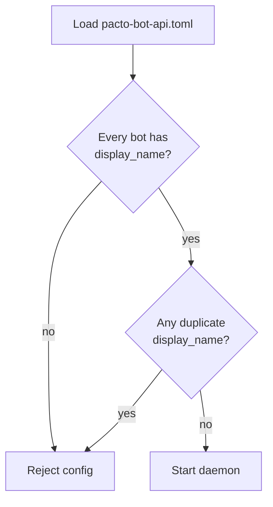
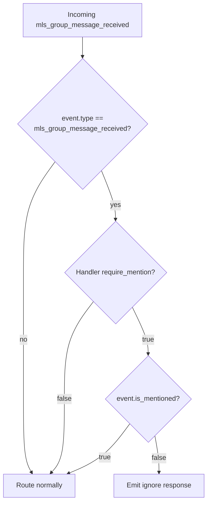

# Plan: Bot @ mentions in Squad channels

## Summary

Add daemon-side parsing of the Pacto-app structured mention envelope so bot handlers can tell when they were directly addressed in a Squad. The daemon forwards `mls_group_message_received` with `content` (the message body), `mentions` (target npubs), `is_mentioned`, and `mentioned_bot_ids`. The Python SDK gates `@bot.command` and `@bot.hears` by default in squads with a `require_mention` opt-out, supported per-decorator and as a Bot constructor default. The daemon also requires every bot identity to have a unique `display_name`.

## Problem Frame

Squad channels are shared by multiple bots. Today every bot receives every decrypted group message and routes on content, so common commands like `/help` collide. Users expect to type `@Joke Bot /help` and have only the joke bot respond. The Pacto-app UI already produces a structured `{ body, mentions }` envelope; the daemon needs to interpret it and expose the metadata to handlers so bot authors can decide whether to act.

## Requirements

### Wire format and parsing

- R1. The daemon parses the decrypted MLS group message content as a JSON envelope `{kind, body, mentions, pacto_virtual_bucket}` when the shape is valid. `kind` must equal `"pacto.mentions.envelope.v1"`. `body` is a string, `mentions` is an array of objects with `npub` and `alias` fields, and `pacto_virtual_bucket` is an optional string.
- R2. If the decrypted content is not valid JSON, lacks the envelope shape, or has a `kind` other than `"pacto.mentions.envelope.v1"`, the daemon treats the entire content as the message body and sets the mention list to empty.
- R3. The daemon extracts the `npub` value from each entry in `mentions` and maps it to configured bot identities.

### Event metadata for handlers

- R4. The daemon forwards the `body` string as the `content` field of the `mls_group_message_received` event and forwards `pacto_virtual_bucket` when it is present in the envelope.
- R5. The daemon forwards the list of mentioned `npub` values (without aliases) to the bot handler as a new `mentions` field on the event.
- R6. The daemon sets `is_mentioned` to `true` on the event if the receiving bot's npub appears in the mention list, otherwise `false`.
- R7. The daemon sets `mentioned_bot_ids` to the list of `bot_id` values whose npubs appear in the mention list. The list may be empty and may include bots other than the receiver.

### SDK behavior

- R8. The SDK exposes `event.is_mentioned`, `event.mentioned_bot_ids`, and `event.pacto_virtual_bucket` to bot handlers.
- R9. In squad channels, the SDK's `@bot.command` and `@bot.hears` decorators only fire when `is_mentioned` is `true`. Bot authors opt out with an explicit `require_mention=False` flag.
- R10. The SDK continues to give bot authors full control over the reply text and does not auto-prefix outbound squad messages.
- R11. Outgoing `agent.send_group_message` and the Python SDK's `bot.send_group_message(..., pacto_virtual_bucket=...)` accept an optional `pacto_virtual_bucket`. When provided, the daemon wraps the content in the mention envelope before MLS encryption so the receiving bot can correlate the response via the same virtual bucket.

### Operational constraints

- R12. The daemon validates that no two configured bots share the same `display_name` and rejects the config at load time. `display_name` is required for every bot identity.
- R13. The new mention metadata is added in a backward-compatible way: existing `dm_received` events are unchanged, and legacy group messages without a JSON envelope or with the wrong `kind` are handled by R2.

## Key Technical Decisions

- KTD-1. **Envelope parsing belongs in the Nostr/MLS layer.** `src/nostr.rs` already produces `AgentEvent` from decrypted plaintext; it will parse the `{kind, body, mentions, pacto_virtual_bucket}` envelope, verify that `kind` equals `"pacto.mentions.envelope.v1"`, and place the body in `content`, the npub list in `mentions`, and the virtual bucket in `pacto_virtual_bucket`. This keeps the dispatch layer focused on routing, not format detection. (see origin: `docs/brainstorms/2026-07-20-bot-mentions-in-squad-channels-requirements.md`, Key Decisions)
- KTD-2. **`is_mentioned` and `mentioned_bot_ids` are computed in dispatch.** The receiving bot is known per `AgentEvent`, but the npub-to-bot_id mapping needs the full `ClientManager` configuration. `src/dispatch.rs` will compute these fields after MLS preflight checks and before fan-out. (see origin)
- KTD-3. **New fields are optional-with-defaults on the wire for backward compatibility.** `schemas/jsonrpc.json` will list `mentions`, `is_mentioned`, `mentioned_bot_ids`, and `pacto_virtual_bucket` as optional with documented defaults; the Rust `AgentEvent` struct will use `serde(default)` so tests and older handlers do not break. The daemon always populates them for new events. (see R13)
- KTD-4. **`display_name` is required and unique.** `schemas/config.json` will mark `display_name` as required; `src/config.rs` will reject configs with missing or duplicate display names. This matches the UI's need for deterministic alias-to-npub resolution. (see R12, confirmed in synthesis)
- KTD-5. **`require_mention` is supported as a decorator parameter and a Bot constructor default.** The decorator flag is the explicit opt-out; the constructor default sets the policy for every decorator on that bot. Decorator-level values override the constructor default. (see origin, confirmed in synthesis)
- KTD-6. **Legacy plaintext is handled by R2.** Non-JSON squad messages, JSON without the envelope shape, and JSON with the wrong `kind` are treated as the body with empty mention metadata. Existing handlers continue to receive content unchanged. (see R2)

## High-Level Technical Design

### Data flow for a bot mention

```mermaid
flowchart TB
  A[User sends Squad message with @Joke Bot /help]
  B[UI encrypts JSON envelope\n{ kind, body, mentions, pacto_virtual_bucket }]
  C[Daemon receives kind:445]
  D[src/nostr.rs\nDecrypt + parse envelope\ncheck kind]
  E[AgentEvent\ncontent=body\nmentions=[npub1joke...]\npacto_virtual_bucket=<bucket>]
  F[src/dispatch.rs\nCompute is_mentioned\nmentioned_bot_ids]
  G[Fan-out to all handlers\nfor receiving bot]
  H[Python SDK @bot.command\nrequire_mention check]
  I[Bot handler replies]

  A --> B --> C --> D --> E --> F --> G --> H --> I
```

### Config validation gate



### SDK routing gate



## Implementation Units

### U1. Update JSON-RPC schema and generated types for mention metadata

**Goal:** Add the new mention fields to the canonical contract so generated Python models and schema-sync tests stay consistent.

**Requirements:** R5, R6, R7, R12

**Dependencies:** none

**Files:**
- `schemas/jsonrpc.json` — add `mentions`, `is_mentioned`, and `mentioned_bot_ids` to the `agent.event` params schema as optional fields with default descriptions.
- `python/src/pacto_bot_sdk/_generated/models.py` — regenerated by `cargo xtask codegen`.
- `src/events.rs` — add the same fields to the hand-written `AgentEvent` struct with `serde(default)` and `serde(rename)` where needed.
- `tests/schema_sync.rs` — existing schema sync harness will enforce that generated files are updated.

**Approach:** The schema-first workflow is the source of truth: edit `schemas/jsonrpc.json`, run `cargo xtask codegen`, then update the hand-written `AgentEvent` to match. The new fields are optional-with-defaults to keep existing tests and older handlers working. The `mentions` field is a list of npub strings; `is_mentioned` is a boolean; `mentioned_bot_ids` is a list of bot_id strings.

**Patterns to follow:** The schema-first evolution pattern described in `CONCEPTS.md` and enforced by `tests/schema_sync.rs`. The existing `agent.event` schema in `schemas/jsonrpc.json:275-316`.

**Test scenarios:**
- **Happy path:** `cargo xtask codegen` produces Python models that include the new fields, and `tests/schema_sync.rs` passes.
- **Edge case:** Hand-written `AgentEvent` in `src/events.rs` deserializes correctly whether the new fields are present or absent.
- **Integration:** The generated `__all__` in `python/src/pacto_bot_sdk/_generated/models.py` still exports `AgentEventParams`.

**Verification:** `make validate` passes; `cargo test schema_sync` passes; `cargo xtask codegen` produces no diff.

---

### U2. Parse mention envelope in inbound MLS group messages

**Goal:** Convert the decrypted MLS group message into a normalized `AgentEvent` with the message body in `content` and target npubs in `mentions`.

**Requirements:** R1, R2, R4, R11

**Dependencies:** U1

**Files:**
- `src/nostr.rs` — update `process_mls_group_message` or the helper that creates the `AgentEvent` to parse the JSON envelope.
- `src/events.rs` — `AgentEvent` (already updated in U1).
- `tests/mls_inbound.rs` — add envelope parsing cases.

**Approach:** After decrypting the kind:445 payload, attempt to parse it as JSON. If the top-level object has `kind` equal to `"pacto.mentions.envelope.v1"`, a string `body`, an array `mentions` where each element has an `npub` string, and an optional `pacto_virtual_bucket` string, set `content = body`, `mentions = [npub, ...]`, and `pacto_virtual_bucket = <bucket>`. On any parse failure or shape mismatch, including a `kind` other than the expected value, fall back to `content = raw_plaintext` and empty mention metadata. This logic is isolated in the Nostr layer so dispatch does not need to know about the UI envelope format.

**Patterns to follow:** The existing `process_mls_group_message` error handling in `src/nostr.rs:923-1030` (malformed messages are dropped with diagnostics); the fallback for legacy content should not drop the message, just normalize it.

**Test scenarios:**
- **Happy path:** Covers AE1. A valid JSON envelope `{ "kind": "pacto.mentions.envelope.v1", "body": "@Joke Bot /help", "mentions": [{"npub": "npub1joke...", "alias": "Joke Bot"}], "pacto_virtual_bucket": "bucket-123" }` is parsed into `content = "@Joke Bot /help"`, `mentions = ["npub1joke..."]`, and `pacto_virtual_bucket = "bucket-123"`.
- **Edge case:** A valid envelope without `pacto_virtual_bucket` is parsed with `pacto_virtual_bucket` omitted.
- **Edge case:** A JSON envelope with the wrong `kind` falls back to `content = full JSON` and empty mention metadata.
- **Edge case:** Covers AE2. A legacy plaintext message `"!snapshot"` is treated as `content = "!snapshot"` with empty mention metadata.
- **Edge case:** A JSON object without `kind`, `body`, or `mentions` is treated as legacy content.
- **Edge case:** An envelope with a `mentions` entry missing `npub` is ignored for that entry (or the whole envelope falls back to legacy).
- **Error path:** A malformed UTF-8 or invalid JSON payload is treated as legacy content, not dropped.
- **Integration:** The envelope parsing happens before the existing deduplication and rate-limit gates so those checks operate on the same wrapper event id regardless of format.

**Verification:** New `tests/mls_inbound.rs` tests cover valid envelope, legacy plaintext, and invalid JSON; existing tests still pass.

---

### U3. Compute `is_mentioned` and `mentioned_bot_ids` in dispatch

**Goal:** Enrich the `mls_group_message_received` event with per-bot mention metadata before fan-out.

**Requirements:** R3, R6, R7

**Dependencies:** U1, U2

**Files:**
- `src/dispatch.rs` — update `process_mls_group_message` to compute `is_mentioned` and `mentioned_bot_ids` using the configured bot identities.
- `src/client_manager.rs` — expose or reuse a helper to map npub to `bot_id` across all configured bots.
- `src/events.rs` — `AgentEvent` (already updated in U1).

**Approach:** After U2, the `AgentEvent` already contains `mentions` (the list of target npubs) and `pacto_virtual_bucket` (if present). In `src/dispatch.rs`, before fan-out, build a map from configured bot npubs to `bot_id`s. Set `mentioned_bot_ids` to the `bot_id`s whose npubs appear in `mentions`. Set `is_mentioned` to `true` if the receiving bot's own npub is in `mentions`, otherwise `false`. Leave `pacto_virtual_bucket` untouched. This preserves the hybrid dispatch model: all bots still receive the message, but each knows whether it was addressed.

**Patterns to follow:** The existing `process_mls_group_message` preflight in `src/dispatch.rs:2153-2192`; the `collect_own_pubkeys` helper pattern; the `ClientManager` read-lock pattern in `dispatch_event`.

**Test scenarios:**
- **Happy path:** Covers AE1. When `joke-bot` is mentioned, it receives `is_mentioned: true` and `mentioned_bot_ids: ["joke-bot"]`. When `snapshot-bot` receives the same event, it gets `is_mentioned: false` and `mentioned_bot_ids: ["joke-bot"]`.
- **Edge case:** A message mentioning multiple bots produces `mentioned_bot_ids` in the same order as the `mentions` array, omitting unknown npubs.
- **Edge case:** An unknown npub in `mentions` is ignored and does not appear in `mentioned_bot_ids`.
- **Edge case:** For a `dm_received` event, `is_mentioned`, `mentions`, and `mentioned_bot_ids` remain at their default empty/false values.
- **Error path:** A config with no bots (edge case) leaves `mentioned_bot_ids` empty.
- **Integration:** The computed event is what handlers receive; the raw envelope is never exposed to handlers or relays.

**Verification:** Unit tests in `src/dispatch.rs` for the mapping logic; integration tests in `tests/mls_inbound.rs` for multi-bot scenarios.

---

### U4. Require and validate unique `display_name` for bot identities

**Goal:** Prevent ambiguous alias-to-npub resolution in the UI and guarantee deterministic mention targets.

**Requirements:** R11

**Dependencies:** none

**Files:**
- `schemas/config.json` — mark `display_name` as required under `bots.items.required`.
- `src/config.rs` — extend `validate_bots` to require `display_name` and reject duplicates.
- `src/admin.rs` — update help text or validation if `pacto-bot-admin` creates/configures bots.
- `tests/` config tests — add missing/duplicate display_name cases.
- `pacto-bot-api.toml` example files in docs or repo root — update examples to include `display_name`.

**Approach:** At config load time, after validating `bot_id` uniqueness, iterate the bots and check that `display_name` is present and non-empty, then check that no two bots share the same display name (case-sensitive or case-insensitive; document the chosen rule). If either check fails, return a `DaemonError::Config` with a clear message and no secrets.

**Patterns to follow:** The existing `validate_bots` pattern in `src/config.rs:356-433`; the `VALID_CAPABILITIES` and `MLS_CAPABILITIES` validation loops; the error message style in `src/errors.rs`.

**Test scenarios:**
- **Happy path:** A config with two bots having distinct `display_name` values loads successfully.
- **Error path:** Covers AE4. A config with two bots sharing `display_name = "Joke Bot"` is rejected at load time.
- **Error path:** A config with a bot missing `display_name` is rejected at load time.
- **Edge case:** A bot with an empty or whitespace-only `display_name` is rejected.
- **Integration:** Existing integration tests that construct `BotConfig` directly must be updated to include `display_name`, and daemon startup tests reflect the new validation.

**Verification:** `cargo test` config tests pass; `make validate` passes; example configs include `display_name`.

---

### U5. Add `require_mention` gating to Python SDK decorators and Bot constructor

**Goal:** Make `@bot.command` and `@bot.hears` mention-gated by default in squads, with a decorator opt-out and a Bot constructor default.

**Requirements:** R8, R9, R10

**Dependencies:** U1

**Files:**
- `python/src/pacto_bot_sdk/bot.py` — add `require_mention` parameter to `command()` and `hears()` decorators; add `require_mention` constructor default; update `_handle_event` to enforce gating for `mls_group_message_received` events.
- `python/tests/test_bot.py` — add mention-gating tests.
- `python/examples/` — update examples that use squad commands if they break.

**Approach:** The `Bot` constructor accepts `require_mention: bool = True`. Each `@bot.command(name, require_mention=...)` and `@bot.hears(token, require_mention=...)` decorator stores its own flag; if omitted, it inherits the constructor default. When `_handle_event` receives an `mls_group_message_received` event and the selected handler is gated, it checks `event.is_mentioned`. If false, it emits an `ignore` response and skips the handler. For other event types (e.g., `dm_received`), the flag is ignored. The SDK does not modify the reply content; the bot author constructs the outbound message as before.

**Patterns to follow:** The existing decorator storage pattern in `python/src/pacto_bot_sdk/bot.py:277-363`; the auto-acknowledge/ignore response path in `_invoke_handler`; the `event.type` routing in `_handle_event`.

**Test scenarios:**
- **Happy path:** Covers AE3. A `@bot.command("/help")` handler with default gating does not fire on a bare `/help` squad message but does fire on `@Joke Bot /help`.
- **Edge case:** A decorator with `require_mention=False` fires on a bare squad message even when the constructor default is `True`.
- **Edge case:** A Bot constructed with `require_mention=False` defaults all decorators to ungated; a decorator with `require_mention=True` overrides that.
- **Edge case:** A `dm_received` event routes normally regardless of `require_mention`.
- **Error path:** A handler that returns `None` on a non-mentioned gated event still triggers auto-acknowledge `ignore`.
- **Integration:** The generated `AgentEventParams` model carries the new fields, and `_handle_event` reads them correctly.

**Verification:** `python/tests/test_bot.py` passes; full Python test suite in `python/` passes (`pytest tests/` in the venv).

---

### U6. Add integration tests for end-to-end bot mention behavior

**Goal:** Prove the full path from UI envelope to handler response, including multi-bot scenarios and legacy compatibility.

**Requirements:** R1-R13

**Dependencies:** U1, U2, U3, U4, U5

**Files:**
- `tests/mls_inbound.rs` — add multi-bot mention tests.
- `python/tests/test_bot.py` — add decorator and constructor gating tests (also covers U5).
- `python/tests/` contract tests — update any snapshots that include `AgentEventParams` instantiation.
- `tests/support/mock_mls_peer.rs` — extend if needed to send envelopes with structured content.

**Approach:** Use the existing mock relay and mock MLS peer to inject a kind:445 message whose payload is the JSON envelope. Register two handlers for two bots in the same Squad. Assert that the target bot receives `is_mentioned: true`, the non-target receives `is_mentioned: false`, and both see the correct `mentioned_bot_ids`. Also test the legacy plaintext path and the duplicate `display_name` config rejection.

**Patterns to follow:** The existing `setup_mls_dispatch`, `peer_group_setup`, `register_handler`, and `parse_agent_event` helpers in `tests/mls_inbound.rs`; the mock transport pattern in `python/tests/test_bot.py`.

**Test scenarios:**
- **Happy path:** Covers AE1. `@Joke Bot /help` reaches only `joke-bot` with `is_mentioned: true` and `mentioned_bot_ids: ["joke-bot"]`, and includes the original `pacto_virtual_bucket`; `snapshot-bot` receives `is_mentioned: false` and the same `mentioned_bot_ids`.
- **Happy path:** Covers AE3. A `/help` command with `require_mention=True` is ignored; the same command with `@Joke Bot` prefix triggers the handler.
- **Happy path:** A bot sends a squad message with `pacto_virtual_bucket` and the receiving bot sees the same bucket on the inbound event.
- **Edge case:** Covers AE2. A legacy plaintext squad message produces `content` equal to the full text and empty mention metadata.
- **Edge case:** A squad message with a JSON envelope whose `kind` is not `"pacto.mentions.envelope.v1"` falls back to `content = full text` and empty mention metadata.
- **Edge case:** A squad message with no `@` mention produces `is_mentioned: false` for all bots.
- **Error path:** A config with duplicate `display_name` is rejected before the daemon starts.
- **Integration:** The Python SDK's `require_mention` gating emits the correct `handler.response` action for both mentioned and non-mentioned events, and `bot.send_group_message(..., pacto_virtual_bucket=...)` wraps the content in the envelope.

**Verification:** `cargo test` and `pytest tests/` pass; `make validate` passes.

## Scope Boundaries

### Deferred for later

- DMs with `@` mentions.
- `@all`, `@here`, or role-based squad mentions.
- Native OS push notifications for bot mentions.
- Message editing that preserves or updates mention lists.
- Server-side indexing, search, or analytics based on mentions.
- UI-side autocomplete implementation (the daemon relies on the UI providing the envelope).

### Outside this product's identity

- Backend parsing of human mentions for notification routing.
- Exposing mention metadata outside the MLS ciphertext.
- Supporting mentions that target users or bots outside the squad.

## System-Wide Impact

- **Bot operators:** Must add a unique `display_name` to every bot identity in `pacto-bot-api.toml`. Existing configs without `display_name` will fail to load.
- **Bot authors:** Existing squad handlers continue to receive `content` unchanged for legacy messages, but `@bot.command` and `@bot.hears` now gate squad commands by default. Authors who want bare-word triggers must add `require_mention=False`.
- **UI/UX:** The daemon assumes the UI sends the structured `{ kind, body, mentions, pacto_virtual_bucket }` envelope with `kind = "pacto.mentions.envelope.v1"`. The UI must include the target bot npub in `mentions` and may include a `pacto_virtual_bucket` for correlation.
- **Tests:** Both Rust and Python test suites need updates to include `display_name`, the `kind` discriminator, and the new event fields.

## Risks & Dependencies

- **Dependency:** The Pacto-app UI implements the JSON envelope `{ kind, body, mentions, pacto_virtual_bucket }` with `kind = "pacto.mentions.envelope.v1"` for squad messages and includes bot npubs as mention targets. If the UI envelope shape diverges, the daemon fallback treats the whole payload as the body, which degrades mention behavior but does not break the channel.
- **Dependency:** The daemon can decrypt MLS group messages and access the plaintext content. This is already true for the inbound MLS feature.
- **Risk:** Requiring `display_name` is a breaking config change for existing daemon deployments. Mitigation: the error message clearly identifies the missing field; operators can add it without code changes.
- **Risk:** Older Python SDK handlers that manually instantiate `AgentEventParams` with positional arguments will break when the generated model changes. Mitigation: new fields are optional-with-defaults in the generated Pydantic model, and the daemon always sends them as keyword-equivalent values.
- **Risk:** Display-name collisions are rejected at startup, which could block a deployment if two bots legitimately share a name. Mitigation: this is the intended behavior; operators must choose distinct names.

## Open Questions

None. The two questions deferred from the brainstorm were resolved during the synthesis:
- `display_name` is required and unique.
- `require_mention` is supported as a decorator parameter and as a Bot constructor default.

## Sources & Research

- Origin requirements: `docs/brainstorms/2026-07-20-bot-mentions-in-squad-channels-requirements.md`
- Inbound MLS plan for context: `docs/plans/2026-07-08-001-feat-inbound-mls-snapshot-plan.md`
- Schema-first evolution convention: `CONCEPTS.md` and `tests/schema_sync.rs`
- JSON-RPC error code guidance: `docs/solutions/best-practices/json-rpc-error-codes.md`
- Python SDK routing: `python/src/pacto_bot_sdk/bot.py`
- Daemon dispatch: `src/dispatch.rs`
- Daemon config validation: `src/config.rs`
- Inbound MLS tests: `tests/mls_inbound.rs`
- Python SDK tests: `python/tests/test_bot.py`
