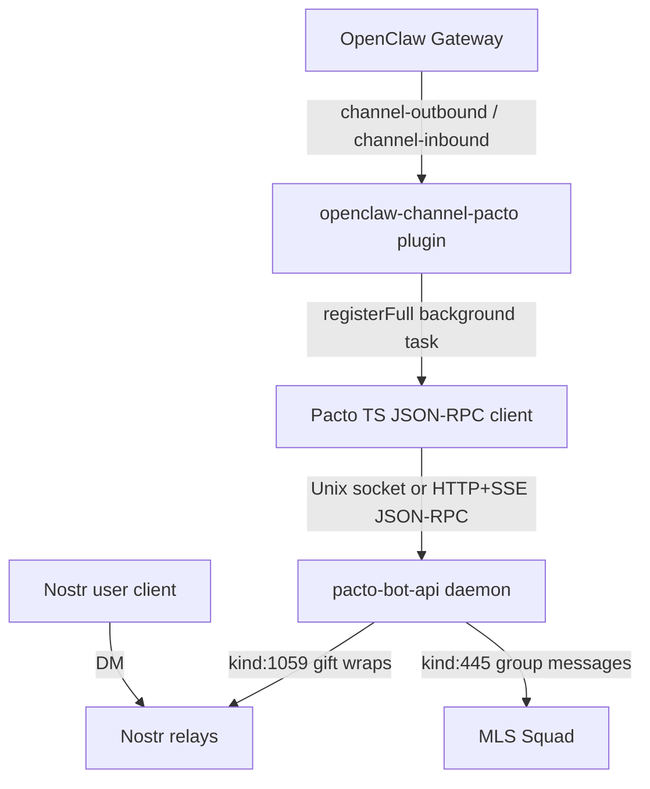
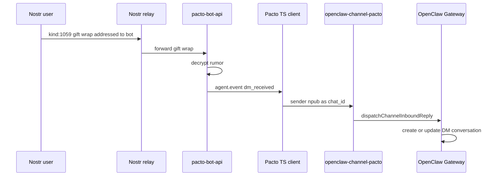
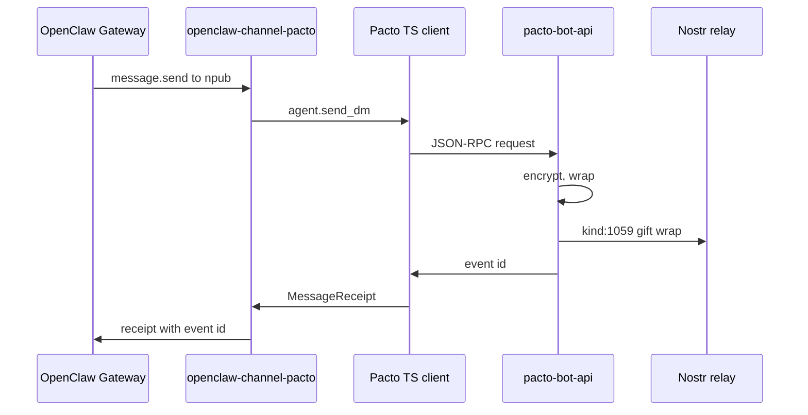
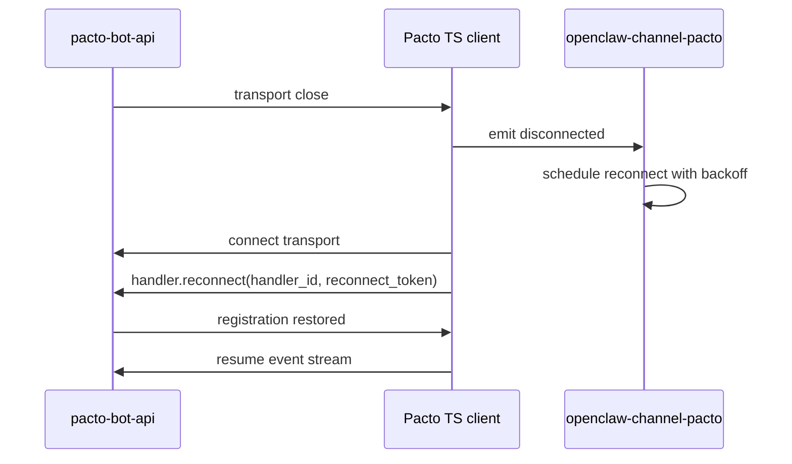
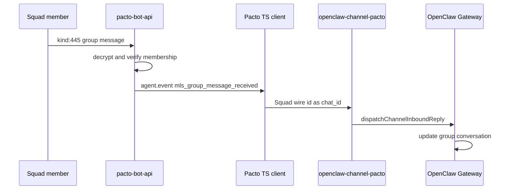

# OpenClaw Pacto Nostr Channel Plugin

**Target repo:** `openclaw-channel-pacto` (new TypeScript/Node.js repository).  
**Prerequisite repo:** `pacto-bot-api` (this repository, for the daemon profile endpoint).

## Summary

Build an OpenClaw channel plugin that treats Nostr as a messaging platform by proxying through `pacto-bot-api`. One OpenClaw channel account maps to one Pacto bot identity; the plugin supports text DMs and text MLS group messages for Squads the bot already belongs to. The plugin is implemented as a new TypeScript package using `openclaw/plugin-sdk/channel-outbound` and contains a built-in Pacto JSON-RPC client.

---

## Problem Frame

OpenClaw connects to many chat apps but not Nostr. Running a Nostr bot requires relay management, NIP-17/44/59 DM encryption, NIP-46 signing, and key hygiene. The Pacto daemon already owns all of that. A channel plugin that registers as a Pacto handler lets OpenClaw users message Nostr pubkeys and existing Squads without duplicating Nostr infrastructure inside OpenClaw.

The origin document decided to implement the plugin as a native OpenClaw channel plugin against `openclaw/plugin-sdk/channel-outbound` rather than a Python SDK bridge, because a bridge would sit outside OpenClaw's channel abstractions. (see origin: `docs/brainstorms/2026-07-20-openclaw-channel-requirements.md`)

---

## Requirements

### Channel identity and registration

- R1. The plugin must be installable as an OpenClaw channel plugin using the `openclaw/plugin-sdk/channel-outbound` adapter surface.
- R2. The plugin must allow exactly one OpenClaw channel account to map to exactly one Pacto bot identity.
- R3. The plugin must register with the Pacto daemon via `handler.register`, requesting the event types and capabilities required for the configured bot (`dm_received`, `mls_group_message_received`, `ReadMessages`, `SendMessages`, `SendGroupMessages`, `ReceiveGroupMessages`).
- R4. The plugin must store and reuse the server-generated `handler_id` and `reconnect_token` to reconnect after a restart.
- R5. The plugin must display the bot identity's name and picture from the daemon-managed `kind:0` profile.

### Direct messages

- R6. The plugin must support receiving plain-text DMs and presenting them as OpenClaw conversations keyed by the sender npub.
- R7. The plugin must support sending plain-text DMs to a recipient npub via `agent.send_dm`.
- R8. The plugin should map NIP-17 `reply_to` threading to OpenClaw's reply model where the platform supports it; otherwise it may flatten conversations.

### Group messages

- R9. The plugin must support receiving plain-text MLS group messages for Squads where the bot identity is already a member.
- R10. The plugin must support sending plain-text MLS group messages to those Squads.
- R11. The plugin must not create, invite to, or leave Squads; membership is configured out-of-band via `pacto-bot-admin`.

### Transport and security

- R12. The plugin must use the Unix socket transport when co-located with the daemon and the HTTP transport when configured for a remote daemon.
- R13. For HTTP, the plugin must authenticate requests with the `X-Pacto-Bot-Secret` header and include `X-Pacto-Handler-Id` on mutating calls.
- R14. The plugin must reconnect and re-register after daemon restarts or transport failures, and it must not leak secrets, nsec, bunker URIs, or tokens in logs or error messages.

---

## Key Technical Decisions

- KTD1. **New TypeScript repository.** The plugin is a standalone Node.js package rather than a subdirectory of the Rust `pacto-bot-api` repository. Mixing Cargo and pnpm workspaces in one repository would complicate CI, releases, and dependency management. The plan therefore spans two repositories: the new plugin package and a small prerequisite change in `pacto-bot-api`.
- KTD2. **Daemon exposes profile via `agent.get_profile`, fetched asynchronously at runtime.** The plugin reads the bot's display name and picture from the daemon, not directly from relays. The daemon already stores `display_name`, `about`, and `picture` in `BotConfig`, so the plan adds a small read-only `agent.get_profile` JSON-RPC method. The plugin fetches this during `registerFull` and caches it for channel-owned display surfaces. The exact OpenClaw hook for account profile display will be determined during implementation; if no synchronous hook exists, the profile is surfaced through the channel's own setup/runtime metadata.
- KTD3. **Built-in TypeScript Pacto JSON-RPC client.** No shared TypeScript Pacto client exists, so the plugin implements its own. It mirrors the Python SDK's transport patterns: NDJSON framing over a Unix socket, HTTP + SSE for event streaming, request/response correlation, and auto-reconnect with exponential backoff. The client is internal to the plugin package, not published as a separate library.
- KTD4. **Conversation keys are raw platform ids.** OpenClaw DM conversations are keyed by the Nostr npub; group conversations are keyed by the Squad wire id. This lets the outbound `message` adapter distinguish DMs from group messages by id format (`npub1...` vs. hex) and route to `agent.send_dm` or `agent.send_group_message` without maintaining a local conversation-type map.
- KTD5. **Flatten NIP-17 `reply_to` for v1.** The daemon's `dm_received` event does not currently carry `reply_to`, so v1 presents each DM as a top-level message in the sender's conversation. OpenClaw's native reply model can still be used inside the conversation, but NIP-17 thread chains are not preserved across messages. Requiring threaded DMs would first require extending the daemon event shape.
- KTD6. **Use `createChatChannelPlugin` with a background handler task.** The plugin uses the high-level OpenClaw `createChatChannelPlugin` builder for DM security, setup, outbound messaging, and threading. Persistent Pacto handler connection and event ingress run in a background task spawned from `registerFull`.

---

## High-Level Technical Design

### Inbound DM flow

### Outbound DM flow

### Daemon restart recovery

### Inbound group message flow

---

## Implementation Units

- U1. **Extend Pacto daemon with `agent.get_profile`**

**Goal:** Expose the configured `display_name`, `about`, and `picture` fields for a bot identity so the plugin can read the channel account's name and picture.

**Requirements:** R5.

**Dependencies:** None.

**Files:** `schemas/jsonrpc.json`, `src/transport/protocol.rs`, `src/dispatch.rs`, `src/*_generated.rs` (via `cargo xtask codegen`), `tests/schema_sync.rs`, `tests/transport_http.rs`, `tests/transport_unix.rs`.

**Approach:** Add `agent.get_profile` to `schemas/jsonrpc.json` with a `bot_id` parameter and a result object containing `name`, `about`, and `picture`. Add the matching variant to the hand-written `Method` enum and its `all()` and `FromStr` lists. Implement `handle_get_profile` in `src/dispatch.rs` by reading the profile fields from the matching `BotConfig`. Regenerate Rust types. This method is read-only and non-mutating, so it does not require a handler capability check beyond the normal handler registration for that bot.

**Patterns to follow:** Model the new endpoint on `agent.version` and `agent.metrics`. Use the existing schema-first workflow (`cargo xtask codegen`, `tests/schema_sync.rs`). Add the method to the `Method` enum and `all()` list the same way the plan notes in `AGENTS.md` for new mutating methods, but mark it non-mutating in HTTP transport because it only reads config.

**Test scenarios:**
- Happy path: registered handler calls `agent.get_profile` for its bot and receives the configured `name`, `about`, and `picture`.
- Unknown bot: `agent.get_profile` for a `bot_id` not served by the handler returns a JSON-RPC error.
- Unregistered caller: an HTTP request without a registered handler identity for the target bot is rejected.
- Schema sync: `cargo xtask codegen` and `tests/schema_sync.rs` pass.

**Verification:** `make validate` passes; the new method is present in the regenerated `Method` enum and the schema.

---

### U2. Implement TypeScript Pacto JSON-RPC client

**Goal:** Provide a reusable client for the plugin to connect to the daemon over Unix socket or HTTP+SSE and call JSON-RPC methods.

**Requirements:** R12, R13, R14.

**Dependencies:** U1 (for `agent.get_profile` support).

**Files:** `openclaw-channel-pacto/src/pacto/client.ts`, `openclaw-channel-pacto/src/pacto/transports.ts`, `openclaw-channel-pacto/src/pacto/types.ts`, `openclaw-channel-pacto/src/pacto/client.test.ts`.

**Approach:** Implement a TypeScript client that mirrors the Python SDK's transport patterns from `python/src/pacto_bot_sdk/transports.py` and `python/src/pacto_bot_sdk/bot.py`. Provide three transport classes: `UnixTransport` (NDJSON over a Unix domain socket), `HttpTransport` (HTTP POST for requests and SSE for server-to-client notifications), and `AutoTransport` (Unix first, then HTTP fallback). The client correlates request/response ids, emits `agent.event` notifications, and exposes methods: `handler.register`, `handler.reconnect`, `handler.unregister`, `agent.send_dm`, `agent.send_group_message`, `agent.get_profile`, and `handler.response`.

**Patterns to follow:** Mirror the Python SDK's `AutoTransport` fallback logic, `HttpTransport` SSE framing, and `UnixTransport` newline-delimited JSON. Use the same reconnect resilience patterns (backoff, jitter, circuit breaker) from `python/src/pacto_bot_sdk/retry_circuit.py`. Secrets must never be logged; accept them as opaque strings and store them in closures, not in debug output.

**Test scenarios:**
- Connect to a local Pacto daemon over a Unix socket and register a handler.
- Receive an `agent.event` notification over the connection and emit it to the caller.
- Reconnect after a transport disconnect and call `handler.reconnect` with stored credentials.
- HTTP transport sends `X-Pacto-Bot-Secret` on every request and `X-Pacto-Handler-Id` on mutating requests.
- Request/response correlation: a JSON-RPC id sent in the request matches the id in the returned result.

**Verification:** `pnpm test` passes for the client unit tests; a local daemon can be reached over both Unix and HTTP transports.

---

### U3. Implement Pacto handler background task and inbound event mapping

**Goal:** Run a persistent Pacto handler inside the OpenClaw plugin and map daemon events to OpenClaw inbound messages.

**Requirements:** R2, R3, R4, R6, R9, R14.

**Dependencies:** U2.

**Files:** `openclaw-channel-pacto/src/pacto/handler.ts`, `openclaw-channel-pacto/src/inbound/dispatch.ts`, `openclaw-channel-pacto/src/inbound/dispatch.test.ts`.

**Approach:** In `registerFull`, spawn a background task that resolves the account's Pacto config (`bot_id`, `data_dir`, `socket_path`, `http_bind`, `secret`), creates a `PactoClient`, connects, and calls `handler.register`. Persist the returned `handler_id` and `reconnect_token` in the plugin's runtime state. On disconnect, reconnect and call `handler.reconnect`. For each incoming `agent.event`:

- `dm_received`: use the sender npub (`chat_id`) as the OpenClaw conversation key and dispatch a text inbound message.
- `mls_group_message_received`: use the Squad wire id (`chat_id`) as the OpenClaw conversation key and dispatch a text inbound message.

For v1, do not thread by NIP-17 `reply_to`; present each message as a top-level message in the conversation.

**Patterns to follow:** Use `dispatchChannelInboundReply` from `openclaw/plugin-sdk/channel-inbound` for the OpenClaw dispatch side. Because the Pacto transport is a persistent socket (not a webhook), the plugin dispatches events directly; durable ingress via `createChannelIngressMonitor` is not required for v1. If the OpenClaw SDK requires a specific inbound dispatch helper for streaming channels, use that helper instead.

**Test scenarios:**
- Covers AE1: first DM from a new Nostr user creates an OpenClaw DM conversation keyed by the sender npub.
- Covers AE3: an MLS group message is routed to the existing Squad conversation keyed by the wire id.
- Covers AE4: daemon restart closes the transport; the plugin reconnects and calls `handler.reconnect` with the stored token, then resumes receiving events.
- Unknown event type is ignored and acked so the daemon cursor advances.
- Account with missing `bot_id` config fails at startup with a clear, redacted error.

**Verification:** Inbound dispatch tests pass; integration with a local Pacto daemon shows DMs and group messages reaching the OpenClaw mock gateway.

---

### U4. Implement OpenClaw channel plugin configuration and setup

**Goal:** Define the OpenClaw channel plugin object, config schema, and setup entry so OpenClaw can discover and configure the channel.

**Requirements:** R1, R2, R5.

**Dependencies:** U1, U3.

**Files:** `openclaw-channel-pacto/package.json`, `openclaw-channel-pacto/openclaw.plugin.json`, `openclaw-channel-pacto/src/channel.ts`, `openclaw-channel-pacto/src/setup-entry.ts`, `openclaw-channel-pacto/src/index.ts`, `openclaw-channel-pacto/src/channel.test.ts`.

**Approach:** Use `createChatChannelPlugin` from `openclaw/plugin-sdk/channel-core`. Define a `ResolvedAccount` type containing `bot_id`, `data_dir`, `socket_path`, `http_bind`, `secret`, and `profile`. Resolve the account from OpenClaw config under `channels["pacto-nostr"]`. Implement `config.listAccountIds`, `config.resolveAccount`, and `config.inspectAccount`. Keep `inspectAccount` synchronous and cheap; do not call the daemon from it. Implement `setup.applyAccountConfig` for onboarding writes.

In `registerFull`, create a `PactoClient`, connect to the daemon, and call `agent.get_profile` to populate the cached profile for the account. Start the Pacto handler background task (U3) and stop it on Gateway shutdown. If OpenClaw exposes an async account-profile hook, use the cached profile there; otherwise, surface the name and picture through channel-owned runtime metadata or setup surfaces.

In `index.ts`, export `defineChannelPluginEntry` with `registerFull` and `registerCliMetadata` if any CLI commands are needed. In `setup-entry.ts`, export `defineSetupPluginEntry` with the same channel object so setup flows do not load the full runtime.

**Patterns to follow:** Follow the OpenClaw acme-chat walkthrough (`package.json` with `openclaw.channel`, `openclaw.plugin.json` with `channelConfigs`, `index.ts`, `setup-entry.ts`). Keep heavy runtime imports out of `setup-entry.ts`. Do not perform network I/O from synchronous `inspectAccount`.

**Test scenarios:**
- Account config is resolved from `channels.pacto-nostr.accounts.default` or `channels.pacto-nostr`.
- `inspectAccount` returns `enabled`/`configured` status without materializing the secret token or making network calls.
- `registerFull` calls `agent.get_profile` and caches the profile.
- Setup entry loads without importing the Pacto client or socket code.
- `registerFull` starts the handler task; Gateway shutdown stops the task cleanly.

**Verification:** `pnpm test` passes; `openclaw plugins inspect pacto-nostr --runtime --json` shows the channel plugin object.

---

### U5. Implement outbound DM and group message sending

**Goal:** Send text DMs and MLS group messages from OpenClaw to Nostr via the daemon.

**Requirements:** R7, R10.

**Dependencies:** U2, U4.

**Files:** `openclaw-channel-pacto/src/outbound/message.ts`, `openclaw-channel-pacto/src/outbound/message.test.ts`.

**Approach:** Define a `message` adapter with `defineChannelMessageAdapter` from `openclaw/plugin-sdk/channel-outbound`. Declare `durableFinal` capabilities: `text: true`, `replyTo: false` (v1 flattens threading). In `send.text`, inspect the `to` target: if it starts with `npub1`, call `agent.send_dm`; if it is a hex Squad wire id, call `agent.send_group_message`. Return a `MessageReceipt` via `createMessageReceiptFromOutboundResults` containing the returned event id as the platform message id.

**Patterns to follow:** Follow the OpenClaw `demoMessageAdapter` example. Use `sanitizeForPlainText` from `openclaw/plugin-sdk/channel-outbound` if Nostr should receive lightweight text markup. Throw `PlatformMessageNotDispatchedError` from `openclaw/plugin-sdk/error-runtime` only when the adapter can prove the platform will not duplicate the message on retry.

**Test scenarios:**
- Covers AE2: sending text to an npub calls `agent.send_dm` and returns a receipt with the event id.
- Sending text to a Squad wire id calls `agent.send_group_message` and returns a receipt with the event id.
- Invalid `to` target (neither npub nor hex) returns a permanent rejection with a clear error.
- Send failure from the daemon propagates as a failed receipt without leaking the secret token or bunker URI.

**Verification:** Outbound unit tests pass; integration with a local daemon publishes the expected Nostr events.

---

### U6. Implement DM security and allowlist

**Goal:** Gate inbound DMs from unknown Nostr users based on OpenClaw's DM security model.

**Requirements:** R6, R14.

**Dependencies:** U3, U4.

**Files:** `openclaw-channel-pacto/src/security/dm.ts`, `openclaw-channel-pacto/src/security/dm.test.ts`.

**Approach:** Configure `security.dm` on `createChatChannelPlugin` with `channelKey: "pacto-nostr"`, `resolvePolicy`, `resolveAllowFrom`, and `defaultPolicy: "allowlist"`. The allowlist is the `allowFrom` array in the OpenClaw channel config, expected to contain npubs. If `allowFrom` is omitted, default to `block` so the bot does not receive unsolicited DMs. This is consistent with the Pacto daemon's security-first defaults and the origin document's decision that DM security is plugin-owned.

**Patterns to follow:** Follow the acme-chat DM security example from the OpenClaw channel plugin guide. Use `resolveInboundMentionDecision` from `openclaw/plugin-sdk/channel-mention-gating` if mention-style gating is needed later.

**Test scenarios:**
- Inbound DM from an npub in `allowFrom` is admitted.
- Inbound DM from an npub not in `allowFrom` is rejected when the default policy is `allowlist`.
- Inbound DM is admitted when the policy is explicitly set to `allow`.
- Group messages are not gated by the DM allowlist.

**Verification:** DM security unit tests pass; contract tests verify the allowed/blocked behavior.

---

### U7. End-to-end contract tests and packaging

**Goal:** Prove the plugin works against a real Pacto daemon and is packageable for distribution.

**Requirements:** R1-R14, AE1-AE4.

**Dependencies:** U1-U6.

**Files:** `openclaw-channel-pacto/tests/e2e/dm.test.ts`, `openclaw-channel-pacto/tests/e2e/group.test.ts`, `openclaw-channel-pacto/tests/e2e/reconnect.test.ts`, `openclaw-channel-pacto/package.json` (scripts), `openclaw-channel-pacto/.github/workflows/ci.yml`.

**Approach:** Build an E2E harness that spins up the Pacto daemon from the prerequisite repository with a temporary data directory and the mock relay/bunker fixtures from `pacto-bot-api/tests/support`. The harness configures one bot identity, starts the plugin against the OpenClaw plugin test runtime, and exercises the four acceptance examples. Add an `npm pack` CI step to verify the package shape and that runtime dependencies are in `dependencies` rather than `devDependencies`.

**Patterns to follow:** Mirror the Pacto daemon's Docker-free mock tests (`tests/support/mock_relay.rs`, `tests/support/mock_bunker.rs`). Use OpenClaw SDK contract test helpers (`verifyChannelMessageDurableFinalAdapterProofs`, etc.) where applicable. Use `tempfile` or the platform equivalent for isolated test data directories.

**Test scenarios:**
- Covers AE1: first DM from a new Nostr user creates a conversation and displays the message.
- Covers AE2: replying in an existing DM thread publishes the message and shows the sent receipt.
- Covers AE3: a message in an existing Squad reaches OpenClaw's group conversation.
- Covers AE4: stopping and restarting the Pacto daemon while the plugin is running causes a reconnect and re-register, and events resume.
- `npm pack` produces a tarball with `dist/` output and all runtime dependencies.

**Verification:** `pnpm test` passes including E2E tests; CI passes; `npm pack` succeeds.

---

## Scope Boundaries

### Deferred for later

- Media, attachments, reactions, zaps, long-form notes, and other non-DM Nostr event types.
- Creating or inviting the bot into Squads from OpenClaw.
- Admin operations such as profile updates, key rotation, relay configuration, or bot identity creation.
- Mapping more than one Pacto bot identity to a single OpenClaw channel account.
- Auto-discovery of Nostr contacts beyond the first inbound or outbound message.
- A setup wizard for NIP-46 bunker configuration; the operator must configure the daemon and bot identity first.
- Operator overrides for the bot's display name or picture.
- NIP-17 `reply_to` threading; v1 flattens conversations.
- Publishing the plugin to ClawHub; this plan covers package-ready build and CI, not the actual publish step.

### Outside this product's identity

- The plugin is not a standalone Nostr client; it is an OpenClaw channel.
- It does not expose raw Nostr event publishing or signing to the OpenClaw end user.
- It does not replace `pacto-bot-admin` or the Pacto daemon's lifecycle responsibilities.

---

## Open Questions

### Resolved during planning

- **NIP-17 `reply_to` mapping:** Flatten for v1. Preserving NIP-17 threads would require extending the daemon's `dm_received` event to carry `reply_to`, which is out of scope for this plan.
- **Conversation metadata caching:** No caching in the plugin. OpenClaw conversation keys are raw platform ids (npub for DMs, Squad wire id for groups), so the plugin derives the route from each daemon event.
- **Profile source:** The daemon exposes `agent.get_profile` and returns the configured `display_name`, `about`, and `picture`. This satisfies the "daemon-managed profile" requirement.

### Deferred to implementation

- Exact OpenClaw SDK version pin and any breaking API changes in `openclaw/plugin-sdk/channel-outbound` between now and implementation.
- Exact TypeScript package manager and lockfile (pnpm is recommended to match OpenClaw's bundled plugin workflow).
- Final error-code mapping for Pacto JSON-RPC errors surfaced to OpenClaw users.
- Exact OpenClaw surface used to expose the daemon-fetched profile (name/picture) for channel account display. OpenClaw's `inspectAccount` is synchronous, so the profile is fetched asynchronously in `registerFull` and surfaced through whatever runtime or metadata hook is available.

---

## System-Wide Impact

- **Cross-repo dependency:** The plugin depends on a small new JSON-RPC method in `pacto-bot-api`. The daemon change must ship before or alongside the plugin release.
- **OpenClaw plugin runtime:** The plugin adds a background handler connection to the OpenClaw Gateway. A Gateway shutdown must cleanly stop the Pacto client and release the Unix socket.
- **Secret surface:** The plugin handles the HTTP secret token and reconnect token. It must follow the same secret hygiene as the daemon: no logging, no error messages, no heap dumps in test output.
- **Conversation model:** OpenClaw DM conversations will be keyed by Nostr npubs; group conversations by Squad wire ids. This affects how OpenClaw users search and organize conversations for this channel.
- **Pacto daemon load:** Each OpenClaw channel account is one Pacto handler registration. Multiple OpenClaw accounts for the same bot identity would create multiple handler registrations, increasing fan-out load. The plan restricts this to one account per bot identity.

---

## Risks & Dependencies

- **OpenClaw SDK churn.** The channel-outbound SDK is still evolving. A version pin and a scheduled upgrade path should be documented. Risk: API changes between planning and implementation. Mitigation: pin to a known OpenClaw SDK version and add contract tests that fail on behavioral drift.
- **Pacto daemon API change.** Adding `agent.get_profile` changes the daemon's JSON-RPC catalog. Risk: schema sync or generated-code drift. Mitigation: run `cargo xtask codegen` and `make validate` before merging the daemon change.
- **E2E test complexity.** The plugin needs a running Pacto daemon and OpenClaw runtime for full contract tests. Risk: flaky or slow tests. Mitigation: keep the E2E harness Docker-free, use the daemon's mock relay/bunker support, and run E2E tests only in CI or on explicit request.
- **Secret leakage in TypeScript logs.** The TypeScript runtime has fewer enforced secret hygiene mechanisms than the Rust daemon. Risk: tokens or bunker URIs in stack traces or debug logs. Mitigation: wrap secrets in a small `Secret` class that redacts in `toString`, `console.log`, and `JSON.stringify`; add a dedicated secret-redaction test.
- **Unix socket permissions.** The plugin must not relax the daemon's `0o600` socket permissions. Risk: permission denied on connect. Mitigation: resolve the socket path from the daemon's data directory and document that the plugin must run as the same user as the daemon.

---

## Acceptance Examples

- **AE1. First DM from a new Nostr user.** Covers R6.
  - **Given:** the channel account is registered and running.
  - **When:** a Nostr user sends a DM to the bot identity.
  - **Then:** OpenClaw creates a new conversation keyed by the sender's npub and displays the message.

- **AE2. Reply to an existing DM thread.** Covers R7.
  - **Given:** an existing conversation with a Nostr user.
  - **When:** an OpenClaw user sends a text message in that conversation.
  - **Then:** the daemon publishes the DM and OpenClaw shows the sent message.

- **AE3. Group message in an existing Squad.** Covers R9.
  - **Given:** the bot identity is a member of Squad S.
  - **When:** a member posts a message in Squad S.
  - **Then:** OpenClaw shows the message in the corresponding group conversation.

- **AE4. Daemon restart recovery.** Covers R4 and R14.
  - **Given:** the plugin is registered and connected over the Unix socket.
  - **When:** the Pacto daemon restarts.
  - **Then:** the plugin reconnects, re-registers with the stored token, and resumes receiving events.

---

## Documentation / Operational Notes

- **Operator setup:** The operator must run `pacto-bot-admin new <bot>` and `pacto-bot-admin publish-profile <bot>` before adding the OpenClaw channel account. The OpenClaw channel config only needs the `bot_id` and optionally `data_dir`, `socket_path`, `http_bind`, and `secret`.
- **File permissions:** The plugin must run as the same user as the daemon to access the `0o600` Unix socket. If the daemon runs as a different user, the operator must use HTTP with a rotated secret.
- **Packaging:** The plugin package must be built with `npm run build` before `npm pack`. Runtime dependencies must be in `dependencies`, not `devDependencies`. The `openclaw.extensions` entry in `package.json` must point at the built JavaScript file for production installs.
- **CI:** The new repository should run unit tests, contract tests, `npm pack`, and a secret-redaction scan on every PR. The E2E test that starts the Pacto daemon should be gated to a single CI job to avoid cross-test port conflicts.
- **Upgrade path:** When the Pacto daemon adds `reply_to` to `dm_received` events, the plugin can add `replyTo: true` to its message adapter capabilities and preserve NIP-17 threading without breaking existing conversations.

---

## Sources / Research

- Origin requirements: `docs/brainstorms/2026-07-20-openclaw-channel-requirements.md`
- Pacto JSON-RPC contract: `schemas/jsonrpc.json`
- Pacto transport implementations: `src/transport/protocol.rs`, `src/transport/http.rs`, `src/transport/unix.rs`
- Pacto handler registry and dispatch: `src/handlers.rs`, `src/dispatch.rs`
- Pacto event model: `src/events.rs`
- Pacto config and bot profile fields: `src/config.rs`, `schemas/config.json`
- Python SDK transport patterns: `python/src/pacto_bot_sdk/transports.py`, `python/src/pacto_bot_sdk/bot.py`, `python/src/pacto_bot_sdk/retry_circuit.py`
- OpenClaw channel plugin guide: `https://docs.openclaw.ai/plugins/sdk-channel-plugins`
- OpenClaw channel outbound API: `https://docs.openclaw.ai/plugins/sdk-channel-outbound`
- OpenClaw plugin getting started: `https://docs.openclaw.ai/plugins/building-plugins`
