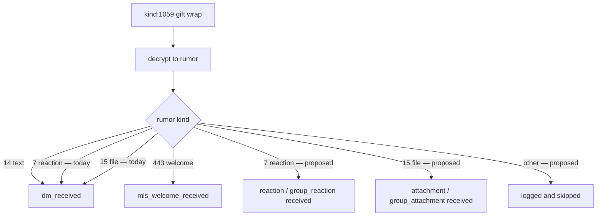
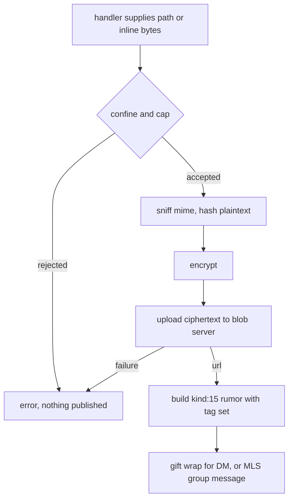
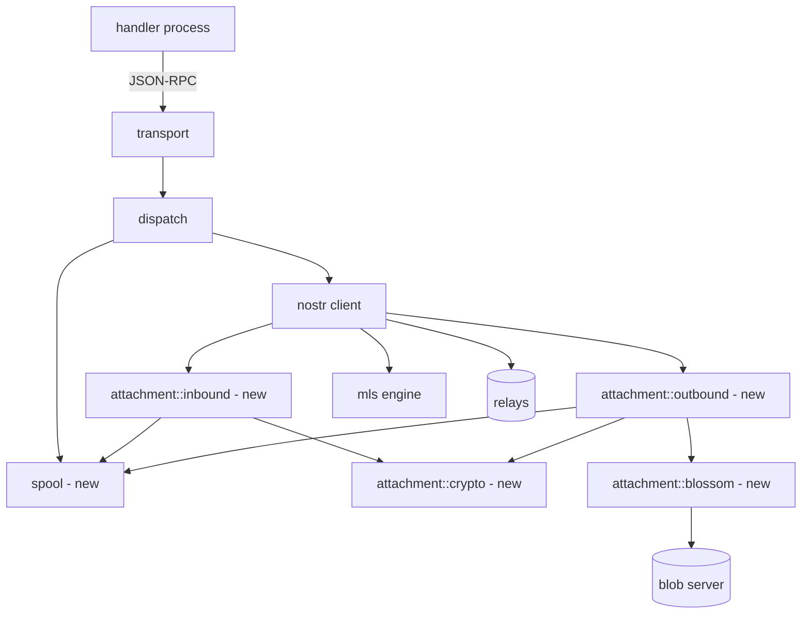
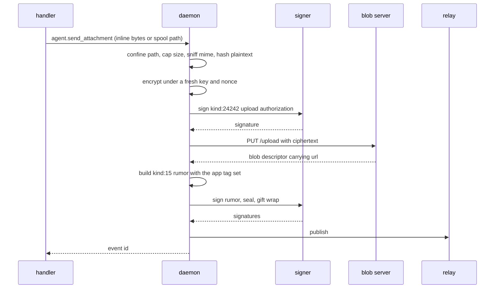
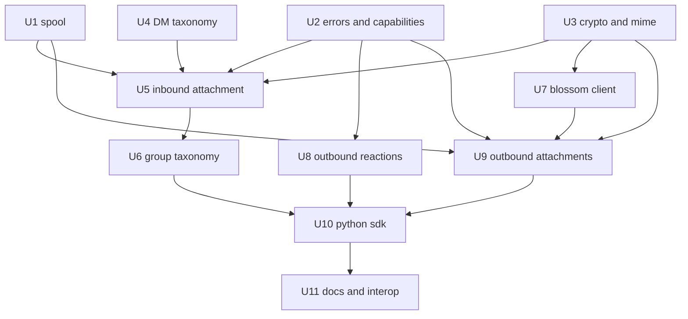

# Reactions and Attachments Parity - Plan

## Goal Capsule

- **Objective:** Give `pacto-bot-api` and its generated SDKs wire parity with `pacto-app` for message reactions (Nostr kind:7) and encrypted file attachments (Nostr kind:15), in both directions, on both the DM and MLS squad-channel surfaces.
- **Product authority:** This document. `pacto-app` is the authority on wire format only — tag names, encodings, and crypto parameters are matched to it, not renegotiated.
- **Implementation authority:** The Planning Contract below. Where a Key Technical Decision and an implementation unit disagree, the KTD wins on mechanism and the governing R-ID wins on behavior.
- **Execution profile:** Eleven dependency-ordered units. Units that change the JSON-RPC wire also edit `schemas/jsonrpc.json` and run `cargo xtask codegen` in the same change; there is no trailing codegen unit.
- **Stop conditions:** Stop and surface rather than guess if a `pacto-app` wire detail contradicts a Key Technical Decision, if the frame-size cap would need to change, or if a new JSON-RPC error code would collide with an allocated one.
- **Tail ownership:** The executor owns the tail — validation, changelog, and the interop check in U11.
- **Open blockers:** None.

---

## Product Contract

### Summary

Add typed inbound events so a handler can tell a reaction and a file attachment apart from ordinary text, and add outbound methods so a bot can send both. The daemon owns encryption and blob transport; file bytes cross the JSON-RPC boundary through a spool directory, with an inline shortcut for small payloads.

### Problem Frame

`pacto-app` shipped reactions and attachments in its messaging v0.5 epic. This daemon has neither, and the way it currently handles them is worse than absence.

Inbound gift-wrap processing reads the decrypted rumor's `kind` only to separate MLS welcomes; every other kind becomes a `dm_received` event carrying the rumor's raw content (`src/nostr.rs:869-873`). A kind:7 reaction therefore reaches a handler as a text DM whose body is a bare emoji, with no reference to the message it targets and nothing distinguishing it from a person typing that emoji. A kind:15 attachment reaches a handler as a text DM whose body is a bare Blossom URL, with the mime type, size, and the `decryption-key`/`decryption-nonce` needed to read the file all discarded. A handler that forwards message text to a model will attempt to answer the URL.

So every bot in the ecosystem is already mishandling traffic that real app users generate today, and no bot can react or send a file at all. The cost lands on bot authors as inexplicable behavior they cannot fix from outside the daemon, because the information they need never crosses the RPC boundary.

### Key Decisions

- K1. **One plan covers both features.** (session-settled: user-directed — chosen over splitting into reactions-first or attachments-first: the shared inbound taxonomy and capability spine gets designed once instead of being set by one feature and revisited by the other.) Governs R1, R2, R3.
- K2. **Full parity in both directions on both surfaces.** (session-settled: user-directed — chosen over receive-only and DM-only cuts: the platform should not lag the client it serves.) Governs R14, R15, R18, R21.
- K3. **File bytes cross the RPC boundary through a spool directory, with an inline shortcut for small payloads.** (session-settled: user-directed — chosen over inline-only, spool-only, and chunked transfer: it reaches parity file sizes without weakening the frame-size cap, and small payloads still avoid the filesystem.) Governs R18, R19, R20.
- K4. **A project-operated blob server is the assumed deployment.** (session-settled: user-directed — chosen over per-upload ephemeral keys: we run the host, so attributing uploads to the bot's npub carries no meaningful exposure.) Governs R22.
- K5. **New event types are split by surface rather than carrying a surface discriminator.** The existing taxonomy already encodes surface in the variant name, and handler registration already filters on `event_types`, so splitting gives opt-in subscription with no new mechanism. Governs R2, R3.
- K6. **Encryption and blob I/O live in the daemon, never in an SDK.** The wire format uses a nonstandard 16-byte AES-GCM nonce; reimplementing that per language would silently produce undecryptable files. Governs R8, R21.
- K7. **Inbound file naming derives from the trusted `file-type` tag, never from the sender-supplied `filename`.** `pacto-app` already treats `filename` as untrusted (`src-tauri/src/rumor.rs:338`); because this daemon writes inbound payloads to disk, an unsanitized sender-controlled name is a path-traversal vector rather than a cosmetic issue. Governs R10.
- K8. **Reactions are add-only.** `pacto-app` has no retract path, so parity means none here either. Governs the Scope Boundaries entry on reaction removal.
- K9. **The size cap is configurable and defaults to 10 MB, below the app's 25 MB interface ceiling.** (session-settled: user-directed — chosen over a 25 MB default and a fixed cap: a daemon serving many bots concurrently should default to bounding its own disk and memory exposure, leaving operators to raise it deliberately.) Governs R11, R23.
- K10. **The inline-bytes threshold is derived from the frame cap rather than set as its own constant.** (session-settled: user-directed — chosen over fixed 512 KB, 256 KB, and 128 KB thresholds: a hand-tied second constant can silently drift out of agreement with the frame cap it depends on.) Governs R19.
- K11. **Inbound and outbound spool entries expire on different schedules.** (session-settled: user-directed — chosen over a single shared TTL: the two directions have genuinely different lifecycles, and the asymmetry minimizes how long decrypted plaintext sits on disk.) Governs R12, R26.
- K12. **Four new send capabilities are added, split DM and group per the existing convention; receiving needs none.** (session-settled: user-directed — chosen over two surface-spanning caps, attachment-only caps, and reusing the message send caps: least privilege without introducing a second capability-naming convention, and an operator can grant reaction-send without granting text-send or blob upload.) Governs R17, R24, R27, R28.

### Actors

- A1. **Bot author** — writes a handler against the SDK and decides what the bot does with a reaction or a file.
- A2. **Handler process** — the running bot; registers for event types, receives events, calls outbound methods. Guaranteed same-host as the daemon.
- A3. **Daemon** — owns signing keys, relay connections, rumor construction, encryption, and blob transport.
- A4. **App user** — a human on `pacto-app` who reacts to a bot's message or sends the bot a photo.
- A5. **Blob server** — the project-operated Blossom host that stores attachment ciphertext.

### Requirements

**Inbound event taxonomy**

- R1. The decrypted rumor's kind determines the delivered event type. Kind:14 continues to deliver as today; kind:7 and kind:15 deliver as their own event types.
- R2. Four event types are added, split by surface: reaction received and attachment received on the DM surface, and the group equivalents on the MLS surface.
- R3. Handlers opt in through the existing `event_types` list at registration. A handler that has not subscribed to an event type does not receive it.
- R4. A rumor kind that this daemon does not represent is logged and skipped rather than delivered as a text message. This applies to every unrepresented kind, not only the two this work adds.
- R5. A delivered reaction event carries the target rumor id, the emoji, the reacting author, and the conversation identifier.
- R6. A delivered attachment event carries the mime type, payload size, original-plaintext hash, the sender-supplied filename as metadata only, image blurhash and dimensions when the sender provided them, the local path of the decrypted payload, and the deadline after which that path expires.
- R7. Cursor advancement does not stall when an inbound rumor has no subscribed handler.

**Attachment inbound handling**

- R8. The daemon fetches the ciphertext, decrypts it with the key and nonce carried in the rumor, and verifies the decrypted plaintext against the rumor's `ox` (original-plaintext hash) tag before delivering the event.
- R9. Decrypted plaintext is written to a spool file created with owner-only permissions in the same operation that creates it, never tightened afterward.
- R10. The spool filename and extension derive from the rumor's mime-type tag. Per K7, the sender-supplied filename never contributes to the path.
- R11. An inbound payload whose declared or actual size exceeds the configured cap is rejected without being written to the spool. The cap defaults to 10 MB per K9.
- R12. Inbound spool entries expire after one hour. The sweep enforcing this is amortized rather than paid on every inbound event.
- R13. An attachment rumor missing any tag required to decrypt it does not produce an event and is recorded as an invalid event.

**Outbound reactions**

- R14. A handler can send a reaction to a DM target and to an MLS group target.
- R15. A DM reaction is gift-wrapped per NIP-59; a group reaction is published as an MLS group message. The two use the rumor construction the app uses for each surface.
- R16. Reaction content is a single emoji. Empty or multi-emoji content is rejected.
- R17. Sending a reaction is authorized per call against the handler's registration, not only at connection time.

**Outbound attachments**

- R18. A handler supplies the payload either as a spool path or as inline bytes. The two are mutually exclusive.
- R19. Inline bytes are accepted only below a threshold derived from the frame-size cap, reserving headroom for envelope overhead. The frame-size cap itself does not change.
- R20. A supplied path is canonicalized and confined to the spool root. A path resolving outside that root — including by symlink — is rejected before any read.
- R21. The daemon determines the mime type from the payload bytes, hashes the plaintext, encrypts it, uploads the ciphertext to the configured blob server, and publishes a kind:15 rumor carrying the full tag set the app expects. Each attachment is encrypted under a freshly generated random key and nonce, never reused across attachments.
- R22. The blob server is configuration, accepting an ordered list with failover across entries.
- R23. An outbound payload exceeding the configured cap is rejected before encryption, using the same cap as R11.
- R24. Sending an attachment is authorized per call against the handler's registration.
- R25. A failed upload returns a distinct error and publishes no rumor. A partially completed send never produces a rumor pointing at absent or corrupt ciphertext.
- R26. An outbound spool entry is removed once its send succeeds. Abandoned entries — those whose send failed or never completed — expire on the retention sweep after a configured period.

**Capabilities and configuration**

- R27. Four capability strings are added, one per content kind per surface, gating reaction send and attachment send on the DM and group surfaces. Receiving the new event types requires no new capability; the `event_types` opt-in at registration is the gate, so existing bot configurations keep receiving without edits.
- R28. Every new capability string is added to each location that validates, prompts for, or documents capabilities, so no location can drift.
- R29. Blob server list, size cap, and spool settings are expressed in the daemon config and its schema.
- R30. The spool root lives under the daemon data directory with owner-only permissions.

**Compatibility**

- R31. The release notes state that handlers subscribed only to the text-DM event type stop receiving reaction and attachment traffic, that unrepresented rumor kinds are now skipped rather than delivered, and that this replaces today's behavior of delivering all of them as text.
- R32. Schema-derived Rust types and the generated Python SDK are regenerated so the sync check passes, and the generated SDK exports the new models and methods.

**Secret hygiene**

- R33. Decryption keys, nonces, and decrypted plaintext are never written to logs or included in error messages. An invalid attachment event is recorded with its identifier and error category only.

#### Inbound dispatch, before and after

#### Outbound attachment path

### Key Flows

- F1. Bot receives a reaction
  - **Trigger:** A4 reacts to a message the bot sent.
  - **Actors:** A4, A3, A2
  - **Steps:** A3 decrypts the gift wrap, recognizes the reaction kind, and delivers a reaction event naming the target message and emoji to every subscribed handler.
  - **Outcome:** A2 can attribute the reaction to a specific message it sent.
  - **Covers:** R1, R2, R3, R5

- F2. Bot receives a photo
  - **Trigger:** A4 sends the bot a photo.
  - **Actors:** A4, A3, A5, A2
  - **Steps:** A3 decrypts the rumor, fetches the ciphertext from A5, decrypts and hash-verifies the payload, writes it to the spool, and delivers an attachment event carrying the path and metadata.
  - **Outcome:** A2 reads a verified local file.
  - **Covers:** R6, R8, R9, R10, R11

- F3. Bot sends a generated file
  - **Trigger:** A2 has produced a report to deliver.
  - **Actors:** A2, A3, A5, A4
  - **Steps:** A2 supplies the payload inline or by spool path; A3 confines and caps it, encrypts, uploads to A5, and publishes the kind:15 rumor on the requested surface.
  - **Outcome:** A4 sees a file in the conversation and can open it.
  - **Covers:** R18, R19, R20, R21, R25

- F4. Bot acknowledges with a reaction
  - **Trigger:** A2 has finished handling a command and wants to acknowledge without adding a message.
  - **Actors:** A2, A3, A4
  - **Steps:** A3 authorizes the call, builds the reaction for the requested surface, and publishes it.
  - **Outcome:** A4 sees a reaction chip rather than another text message.
  - **Covers:** R14, R15, R16, R17

### Acceptance Examples

- AE1. **Reaction is distinguishable from typed text.** **Covers R1, R2, R5.** **Given** a bot subscribed to the reaction event type, **when** an app user reacts with a thumbs-up to one of its messages, **then** the bot receives a reaction event naming the target message, and does not receive a text event whose body is the emoji.
- AE2. **Inbound photo is verified and readable.** **Covers R6, R8, R9.** **Given** an app user sends a 4 MB photo, **when** the daemon delivers the attachment event, **then** the spool file opens as a valid image, its hash matches the rumor's `ox` tag, and its permissions are owner-only.
- AE3. **Small payload needs no filesystem.** **Covers R18, R19.** **Given** a bot with a small generated file in memory, **when** it sends the payload inline, **then** the app displays a file with the correct mime type and name, and the request stays within the frame-size cap.
- AE4. **Large payload reaches parity size.** **Covers R18, R21.** **Given** a payload far larger than the frame-size cap, **when** the bot sends it by spool path, **then** the app downloads and decrypts it successfully.
- AE5. **Path confinement holds.** **Covers R20.** **Given** a handler supplies a path outside the spool root, whether directly or through a symlink, **when** the send is attempted, **then** it is rejected, nothing is read, and nothing is uploaded.
- AE6. **Undecryptable attachment is not delivered.** **Covers R13.** **Given** an inbound attachment rumor missing a tag required to decrypt it, **when** it is processed, **then** no event is delivered and the event is recorded as invalid.
- AE7. **Group surface works.** **Covers R14, R15.** **Given** a bot in a squad channel, **when** it reacts to a channel message, **then** the reaction is published as a group message and the app shows it on that message.
- AE8. **Unsubscribed handler receives nothing rather than garbage.** **Covers R3, R31.** **Given** a handler subscribed only to the text-DM event type, **when** an app user sends it a photo, **then** the handler receives no event for it — in particular, not a text event containing the blob URL.
- AE9. **Upload failure is atomic.** **Covers R25.** **Given** the blob server rejects an upload, **when** the send fails, **then** the error identifies the upload as the cause and no rumor is published.

### Success Criteria

- Round-trip interop with `pacto-app` in both directions: a reaction and a file sent by a bot render correctly in the app, and a reaction and a photo sent from the app are correctly typed and readable by a bot.
- A bot author can send and receive both content kinds without writing any cryptography.
- No handler can cause the daemon to read a file outside the spool root.
- The frame-size cap is unchanged by this work.

### Scope Boundaries

- Reaction removal or retraction. `pacto-app` has no retract path, so there is nothing to be compatible with.
- Other rumor kinds the app ships and this daemon still cannot represent: message edits, polls, and typing indicators. Per R4 these are skipped rather than delivered as text, which changes their current handling; representing them properly is later work the taxonomy is meant to accommodate without rework.
- Generating image derivatives. The app computes blurhash and dimensions when it sends an image; this daemon passes through what a sender provided and does not compute its own. Bot-sent images will render with less preview fidelity in the app until a bot supplies them.
- Image recompression. The app applies a savings-threshold rule before sending; bots send what they send.
- Operating the blob server. Its deployment is assumed, not built here.
- Raising the frame-size cap.

#### Deferred to Follow-Up Work

- Reconciling `scripts/generate_requirement_coverage.py` with this plan's R-ID namespace. The script parses R1–R37 out of `docs/plans/2026-06-24-001-feat-pacto-bot-api-daemon-plan.md` and matches any `req(R\d+)` tag in `tests/` against that list, so a `#[req(R5)]` tag written for this plan would be silently credited to the daemon plan's R5. This plan's tests carry U-ID comments instead and leave the script untouched.
- The pre-existing double allocation of `-32012`. `DaemonError::OperationTimedOut` (`src/errors.rs:149`) and `HTTP_PAYLOAD_TOO_LARGE_CODE` (`src/transport/http.rs:50`) both use it. Found while allocating the codes in KTD12; correcting it changes a code clients may already match on, so it is a separate decision.
- A daemon feature-capability field in `schemas/service-compatibility.json` so a handler can negotiate reaction and attachment support rather than inferring it from `system.version`. That schema covers external services today (relay, bunker, EVM), and adding a daemon-feature dimension is a protocol design of its own.

### Dependencies / Assumptions

- The demand for this work is platform parity rather than an observed bot need. No specific bot is currently blocked on it, which is why scope is bounded to matching the app rather than exceeding it.
- The default size cap sits below what the app permits, so an app user can send a photo a bot rejects until an operator raises the cap. This is accepted deliberately per K9; operators running bots that receive large media should expect to tune it.
- A project-operated blob server is available. Public Blossom hosts reject attachment ciphertext because they whitelist sniffed media types, so a third-party host is a discouraged configuration rather than a supported default.
- Every handler is on the same host as the daemon. This is enforced today: the HTTP transport refuses any non-loopback bind, and the other transport is a Unix socket. The spool handoff depends on this and would need revisiting if a remote transport were ever introduced.
- Attachment support adds an AES-GCM implementation and base64 encoding to the dependency set. Reactions add none — the relay SDK already provides the reaction rumor builder the app uses.
- Every outbound attachment requires a signed authorization event for the blob upload, so an upload consumes a signing operation in addition to the two a message already costs. With a remote signing backend this places bunker latency and availability in the attachment send path.
- The 16-byte AES-GCM nonce is a compatibility constraint, not a choice. Using the more common 12-byte nonce produces files the app cannot open.

### Sources / Research

External references below are paths within the `pacto-app` repository, not this one.

- `src/nostr.rs:869-873` — inbound rumor kind is read for logging and MLS-welcome detection only; every other kind becomes a text-DM event. The origin of the current mishandling.
- `src/events.rs:5-35` — the three existing event types and the flat event payload the new types must extend.
- `src/handlers.rs:100-102`, `src/handlers.rs:351-357` — existing event-type subscription filtering and wire-name parsing, which supply opt-in subscription for the new types at no cost.
- `src/transport/protocol.rs:82`, `src/transport/unix.rs:322`, `src/transport/http.rs:344` — the 1 MiB frame limit and its enforcement on both transports. The constraint that rules out inline-only byte transfer.
- `src/transport/http.rs:117-122`, `src/transport/http.rs:142-147` — loopback-only enforcement, which is what makes a filesystem handoff sound.
- `src/config.rs:257-267`, `src/admin.rs:1255-1268`, `src/admin.rs:1365-1390` — the capability list and its duplicate validation and prompt sites, all of which R28 covers.
- `src/nostr.rs:195-217`, `src/nostr.rs:223-289` — existing rumor construction and gift-wrap publication, the seam both new send paths follow.
- `src/transport/protocol.rs` `Method` enum and `src/transport/http.rs:592-598` — the hand-written method catalog and the mutating-method gate that new mutating methods must join. The Python SDK carries its own copy of the mutating set.
- `tests/schema_sync.rs` — enforces that schema-derived Rust and Python artifacts stay in sync, so R32 is checked by CI rather than by review.
- `pacto-app` `src-tauri/src/message.rs:831-836`, `:909-914` — the exact kind:15 tag set: mime, size, algorithm literal, decryption key, decryption nonce, original hash, and optional filename, blurhash, and dimensions.
- `pacto-app` `src-tauri/src/crypto.rs:58-63` — AES-256-GCM with a 16-byte nonce, with key and nonce hex-encoded into the tags.
- `pacto-app` `src-tauri/src/rumor.rs:267-341` — the receive side treats missing decrypt tags as fatal, and derives the extension from the mime tag rather than the sender-supplied filename.
- `pacto-app` `src-tauri/src/message.rs:2921`, `:2977` — the two reaction constructions: an extended reaction builder for DMs, and a plain reaction event tagged with the target for groups.
- `pacto-app` `src-tauri/src/blossom.rs:84-92`, `:167`, `:205` — blob upload requires a signed authorization event, which is why an SDK without key material cannot perform its own uploads.
- `pacto-app` `src-tauri/src/lib.rs:119-133` — separate server lists for attachment ciphertext and plaintext profile media, with the ciphertext list currently a single host.
- `pacto-app` `docs/messaging/ATTACHMENTS.md` — why public Blossom hosts reject ciphertext, what the host observes, and the mitigations the app has not implemented.
- `pacto-app` `docs/plans/2026-07-24-001-feat-messaging-v0.5-enhancements-plan.md` — the app-side plan these features shipped under, including its client-side reaction-toggle limitation.

---

## Planning Contract

### Product Contract preservation

Product Contract unchanged in scope. The `Outstanding Questions` subsection was removed because planning resolved all six; each resolution is recorded as a numbered Key Technical Decision — Q1 to KTD4, Q2 to KTD12, Q3 to KTD14, Q4 to KTD6, Q5 to KTD3, Q6 to KTD2. A `Deferred to Follow-Up Work` subsection was added under Scope Boundaries for three plan-local items research surfaced. All R, A, F, AE, and K identifiers and their wording are unchanged, including K12's settlement that receiving needs no new capability — the deepening pass surfaced a consequence of that decision, recorded under System-Wide Impact rather than reopening it.

### Key Technical Decisions

- KTD1. **Reaction and attachment detail ride in two typed sub-objects on the event.** `AgentEvent` gains `reaction: Option<ReactionPayload>` and `attachment: Option<AttachmentPayload>`, mutually exclusive by event type, both `skip_serializing_if`. Rejected: nine flat optional fields, which would render as nulls on every text DM; and a discriminated union, which neither generator can express. The two sides behave differently and both are fine here. Rust is unconstrained — `generate_protocol` (`xtask/src/codegen.rs:72-112`) emits only catalog wrappers carrying raw JSON Schema as `serde_json::Value`, and never a struct per method, so `AgentEvent` in `src/events.rs` is hand-written and carries real typed structs. Python is constrained but favorable — `_type_annotation` (`python/scripts/generate.py:146-164`) turns a nested object with properties into a real Pydantic model named `{Parent}{Prop}Model`, so the SDK gets `AgentEventParamsReactionModel` and `AgentEventParamsAttachmentModel` rather than `dict[str, Any]`. Governs R5, R6.
- KTD2. **Wire names follow the existing surface split.** Event types `reaction_received`, `attachment_received`, `mls_group_reaction_received`, `mls_group_attachment_received`. Methods `agent.send_reaction`, `agent.send_attachment`, `agent.send_group_reaction`, `agent.send_group_attachment`. Capabilities `SendReactions`, `SendAttachments`, `SendGroupReactions`, `SendGroupAttachments`. Group event types take the `mls_group_` prefix `mls_group_message_received` already carries. Governs R2, R27.
- KTD3. **The inline threshold is computed from the frame cap.** `MAX_INLINE_ATTACHMENT_BYTES = (MAX_FRAME_BYTES - INLINE_ENVELOPE_RESERVE) * 3 / 4`, with `INLINE_ENVELOPE_RESERVE = 8192`, yielding 780_288 bytes against today's 1 MiB cap. The three-quarters factor inverts base64 expansion; the reserve covers the JSON-RPC envelope and the remaining params. Both constants sit beside `MAX_FRAME_BYTES` in `src/transport/protocol.rs:83` so the dependency is visible. The reserve is a chosen bound, not a measured one, so U9 carries the test that proves it: a maximum-size inline payload with every optional param populated must serialize under the frame cap, and one byte more must be rejected. If that test fails, the reserve is wrong and moves — the frame cap does not. Instantiates K10, governs R19.
- KTD4. **One shared spool root with two direction subdirectories.** `$DATA_DIR/spool/inbound/` and `$DATA_DIR/spool/outbound/`, both `0o700`. No per-handler partitioning: handlers already run as the daemon's user (the Unix socket is `0o600`, the HTTP transport refuses non-loopback binds at `src/transport/http.rs:117-123`), so filesystem permissions cannot separate handlers, and one inbound file serves every subscribed handler. Governs R9, R30.
- KTD5. **Confinement canonicalizes, prefix-checks by path component, and re-verifies through the opened handle.** Join the supplied path onto the outbound root, `canonicalize()`, then require the result to be a strict component-wise descendant of the canonicalized root — a string `starts_with` would accept a sibling directory whose name shares the root's prefix. `canonicalize()` resolves symlinks, so a symlinked escape fails the check, but it also requires the path to exist and leaves a TOCTOU window before the read: open the confined path and verify through the opened handle's metadata that it is a regular file, rather than re-resolving the path a second time. Adopt the remaining guards `secure_ensure_mls_parent_dir` (`src/mls_path.rs:56-92`) already applies for the MLS database — reject a symlinked component anywhere in the parent chain, and reject a spool root resolving under `/tmp` or `/dev/shm`. Governs R20.
- KTD6. **Inbound attachments are fetched eagerly on receipt.** R6 delivers a local path and R8 verifies the hash before delivery; lazy fetch cannot satisfy either. Governs R6, R8.
- KTD7. **The `ox` hash is verified when present and not required when absent.** `pacto-app` writes it optionally (`src-tauri/src/message.rs:836`) and does not verify it on receive (`src-tauri/src/rumor.rs:320-380`), so requiring it would reject real app traffic. Missing `decryption-key`, `decryption-nonce`, or `file-type` stays fatal per R13 — the same fatal set the app enforces. An absent `ox` is narrower than it looks: GCM's authentication tag already rejects any blob the host corrupted or substituted, so what `ox` adds is only a check that the plaintext matches what the *sender* claimed to send, which a sender who chose the plaintext cannot meaningfully violate. Governs R8, R13.
- KTD8. **Attachment crypto uses `aes-gcm 0.10.3` as `AesGcm<Aes256, U16>`.** That version is already resolved in `Cargo.lock` transitively and is exactly what `pacto-app` pins, so promoting it to a direct dependency adds no tree. `sha2 0.10.9` and `base64 0.22.1` are likewise already present. Encrypt with `encrypt_in_place_detached` and append the 16-byte tag, reproducing the byte layout at `pacto-app/src-tauri/src/crypto.rs:68-93`. Rejected `aes-gcm 0.11`: its `aead 0.6` / `crypto-common 0.2` chain is a different API surface for no compatibility gain. Keys and nonces are drawn from OS entropy through the `getrandom` dependency already in `Cargo.toml`, never from a seeded or reused RNG. Random nonces are safe at this width: a 128-bit nonce reaches a 50% collision probability near 2^64 encryptions, four orders of magnitude past the 2^48 birthday bound of GCM's standard 96-bit nonce, so the app's nonstandard width helps here rather than hurting. Nonce reuse under a fixed key is still catastrophic for GCM, which is why R21 requires a fresh key *and* nonce per attachment rather than a fresh nonce alone. Governs R21.
- KTD9. **Adopt `nostr-blossom 0.43` for the authorization types; hand-roll the upload.** `BlossomClient::upload_blob` requires `T: AsyncGetPublicKey + AsyncSignEvent`, and the daemon's `Signer` (`src/signer.rs:29-47`) is a custom trait over nsec and NIP-46 backends that satisfies neither. Build the kind:24242 event with `EventBuilder::blossom_auth(...).build(bot_pubkey)`, sign it through the existing `sign_unsigned_event` (`src/nostr.rs:1070-1093`), and `PUT /upload` with the already-present `reqwest` — the same split `pacto-app/src-tauri/src/blossom.rs:74-103` uses. Authorization expires 300 seconds after issue and the header carries standard base64, both matching `pacto-app/src-tauri/src/blossom.rs:83` and `:98` — the app encodes with `general_purpose::STANDARD`, not the base64url BUD-11 specifies, and that is what the deployed host accepts. The daemon does the encoding itself, so `nostr-blossom`'s own client conventions never apply. Governs R21, R22.
- KTD10. **Schema and codegen changes land inside each wire-touching unit.** `handler.register` validates `event_types` against the schema enum at runtime, and `tests/schema_sync.rs:192-240` asserts the hand-written `Method` enum matches the catalog, so a unit adding an event type or method without its schema entry is not independently green. Every such unit edits `schemas/jsonrpc.json` and runs `cargo xtask codegen`. Because `tests/schema_sync.rs` compares generated files byte-for-byte, a later unit regenerates over the earlier unit's committed output rather than against a pristine tree — U6 in particular runs codegen after U5's schema entries have landed, not beside them. Governs R32.
- KTD11. **`DecryptedMessage` carries the inner rumor's kind and tags.** `src/mls.rs:975-986` exposes only content, group id, author, event id, and timestamp, so the group surface cannot see a kind:7 or kind:15 inner rumor at all. The data is already available: `MessageProcessingResult::ApplicationMessage(msg)` at `src/mls.rs:545` carries an `mdk_storage_traits::messages::types::Message`, whose fields include `kind: Kind`, `tags: Tags`, and the full `event: UnsignedEvent`. Correspondingly `send_group_message` (`src/nostr.rs:587-637`) hard-codes a kind:1 inner rumor and must accept a caller-supplied `UnsignedEvent`. That signature change has one call site today (`src/dispatch.rs:1882`), so the blast radius is small, but it shifts an API contract silently: the kind moves from callee-owned to caller-owned. The function's doc comment must say so, and U8 carries a regression test that the pre-existing text-message path still produces kind:1. Governs R2, R15.
- KTD12. **Error codes -32019 through -32024.** Next unused after `InvalidKeyPackage` at -32018. `AttachmentTooLarge` -32019, `AttachmentPathRejected` -32020, `AttachmentInvalid` -32021, `BlobUploadFailed` -32022, `InvalidReaction` -32023, `SpoolEntryMissing` -32024. Governs R11, R16, R20, R23, R25.
- KTD13. **The outbound spool root reaches the handler through the `handler.register` response.** An additive field on a response the handler already reads once, for a value that never changes; a dedicated method would be a second round trip for a constant. Governs R18.
- KTD14. **Blurhash and dimensions are outbound passthrough.** Optional `blurhash` and `dim` params, validated for shape only, copied into the rumor tags. The daemon computes neither, per the scope boundary; a bot that can compute them closes the preview-fidelity gap without the daemon growing an image pipeline. Governs R21.
- KTD15. **Retention is one hour inbound, twenty-four hours outbound, plus a sweep at graceful shutdown.** R12 fixes inbound. Outbound holds the bot's own generated plaintext rather than a counterparty's decrypted file, and a handler may stage a payload well before sending, so a longer window costs less exposure than it buys in usability. Both periodic sweeps use the amortized cadence pattern at `src/dispatch.rs:139-179`. A graceful shutdown also runs one final inbound sweep, because the alternative is decrypted counterparty plaintext sitting on disk from the moment the daemon stops until whenever it next starts. An unclean shutdown cannot run it, which the Risks section records. Instantiates K11, governs R12, R26.
- KTD16. **The `size` rumor tag carries ciphertext length; the delivered event field carries plaintext length.** `pacto-app` writes the encrypted blob's byte count into the tag (`src-tauri/src/message.rs:834`), which is plaintext length plus the 16-byte GCM tag, so wire parity requires the same. R6's "payload size" is the handler-facing number and is the plaintext length — the size of the file at the delivered spool path, which is what a handler allocates and range-checks against. R11's inbound cap and R23's pre-encryption check both apply to plaintext. Three numbers, one name; the schema description for the event field says which one it is. Governs R6, R11, R23.
- KTD17. **R28 absorbs the capability-list drift already present.** `validate_capability` (`src/admin.rs:1256-1264`) omits `Admin`, and `prompt_capabilities` (`src/admin.rs:1366-1369`) lists three of nine. Adding four strings to a list that already drifts guarantees it drifts again, so the correction lands with the addition and a derived-set test replaces the retyped list. Governs R28.
- KTD18. **The inbound blob fetch is hardened against a counterparty-controlled URL.** The URL in a kind:15 rumor's content is attacker-supplied, and the daemon runs a loopback HTTP transport on `127.0.0.1:9800` plus a Unix socket, so an unhardened fetch is an SSRF primitive against the daemon's own control plane. The existing `reqwest` usage at `src/dev_env_probe.rs:104-164` and `src/scaffold/cache.rs:331-335` sets neither a timeout nor a redirect policy and is not a safe template here. The attachment fetch uses a dedicated client that accepts only `https`, refuses to follow redirects, sets an explicit total timeout, rejects a resolved address that is loopback, link-local, or private, and streams the body against the R11 byte budget so a decompression bomb or an unbounded response cannot exhaust memory. Those four constraints are values on a fetch-policy struct rather than inline conditions, because the mock blob server the tests need is itself plain HTTP on loopback; the permissive policy is constructible only under `cfg(test)`, and a test asserts the production constructor denies both.
- KTD19. **An attachment send costs one rate-limit token, the same as a DM.** Size-proportional bucket cost would be a second rate-limiting mechanism beside the token buckets at `src/dispatch.rs:143-286`, and the payload is already bounded by `attachment_max_bytes` and by the blob host's own limits, so the marginal protection does not pay for the new mechanism. The real asymmetry an operator should know about is signer load, not bandwidth: a DM costs two signing operations and an attachment costs four. Governs R24.

### High-Level Technical Design

#### Module topology

Three new modules under `src/attachment/` plus `src/spool.rs`; everything else is an extension of an existing seam.

#### Outbound attachment sequence

A DM attachment costs four signer round trips: the upload authorization, then the rumor, seal, and gift wrap a message already pays. With a NIP-46 backend that puts bunker latency in the send path.

#### Unit dependency graph

### Implementation constraints

- The clippy gate in `Cargo.toml` denies `unwrap_used`, `expect_used`, and `panic` outside tests. Every crypto, path, and HTTP failure returns a `DaemonError`.
- `src/*_generated.rs` and `python/src/pacto_bot_sdk/_generated/` are never hand-edited; `tests/schema_sync.rs` compares them byte-for-byte against a fresh `cargo xtask codegen`.
- Integration tests use `common::tempdir()` from `tests/common/mod.rs`, not `tempfile::tempdir()`, so the daemon's permission checks pass.
- The repository has no `proptest` usage today despite the dependency being present. New tests are table-driven and integration-style, matching the existing suite.

---

## System-Wide Impact

### New persistent plaintext surface

The spool is the first place the daemon writes counterparty-decrypted content to disk. `$DATA_DIR` previously held only `agent.db`, the lock, the HTTP token, reports, and per-bot MLS databases — all daemon-authored. Two consequences follow. Backup and file-sync tooling pointed at `$DATA_DIR` will now copy decrypted attachments outside the daemon's permission model, which belongs in operator documentation (U11). And `$DATA_DIR/daemon.lock` (`src/main.rs:223-228`) is what keeps two daemons off one spool; the spool inherits that guarantee and adds no locking of its own.

### Inbound latency and blast radius

U5 adds a network fetch and a disk write to inbound processing, before the event reaches dispatch. `receive_events` (`src/nostr.rs:723-797`) spawns a task per gift wrap and per group message, so a slow blob host stalls that one event's dispatch and its cursor advance — not the inbound loop, not other bots, not other events. The KTD18 request timeout bounds how long a single event can hang. This is the acceptable shape, but it is new: before this change, no inbound event could block on a third party.

### Signer load

A DM costs two signing operations; an attachment costs four, because the Blossom authorization event is signed before the rumor, seal, and gift wrap. With a NIP-46 bunker backend that is four round trips to a remote signer per attachment, so bunker latency and availability are now in the attachment send path. Reactions add no signing beyond what a DM already costs.

### Metrics and diagnostics

`HealthSnapshot` (`src/diagnostics.rs:74-135`) has `send_dm_total` and `send_dm_failed_total` but nothing for attachments or the spool, so an operator would have no way to see the spool growing or uploads failing. Add, following the existing counter shape: `attachment_send_total`, `attachment_send_failed_total`, `blob_upload_failed_total`, `attachment_receive_total`, `attachment_receive_failed_total`, and a spool gauge pair for inbound and outbound entry counts. These surface through `agent.metrics` and `pacto-bot-admin status` / `diagnose` with no new plumbing. U5 and U9 own the counters they increment.

### Capability asymmetry on receive

K12 settles that receiving needs no new capability, so existing bots keep receiving without config edits. The consequence worth naming: subscribing to `attachment_received` now causes the daemon to make outbound HTTPS requests and write files on that bot's behalf, which no capability gated. The `event_types` opt-in at registration is the only gate, and KTD18 plus the R11 cap are what bound the resulting exposure. This is accepted, not overlooked; a `ReceiveAttachments` capability would be a breaking change for every bot that would otherwise have received nothing.

### Surfaces this change does not touch

No database migration: the spool is filesystem state and no `agent.db` table changes, so `src/db.rs` and the `refinery` migration set are untouched. No change to the frame-size cap, the rate-limiter algorithm, the handler-reaper, or the MLS group lifecycle. `schemas/service-compatibility.json` covers external services (relay, bunker, EVM) and gains no daemon feature field; handlers detect support through the existing `system.version` method, not through a new negotiation mechanism.

---

## Risks & Dependencies

| Risk | Mitigation |
|---|---|
| An unclean daemon shutdown leaves decrypted plaintext in the inbound spool until the next start. | The startup path sweeps before entering the event loop, so the exposure window is bounded by downtime rather than being unbounded. KTD15's graceful-shutdown sweep covers the clean case; nothing can cover a `SIGKILL`. Operator docs (U11) name the spool as plaintext-at-rest. |
| Backup or file-sync tooling copies decrypted attachments out of `$DATA_DIR`. | Documented in U11 with an explicit recommendation to exclude `$DATA_DIR/spool` from backups. The daemon cannot enforce this. |
| A disk-full condition during an inbound write leaves a partial spool file. | U1's `create_inbound` removes the file on any write failure, and the partial never reaches an event because the hash verification in U5 runs before delivery. |
| The blob host observes the uploading bot's npub, the ciphertext and its exact size, the ciphertext SHA-256, the upload timestamp, and the client IP — per `pacto-app docs/messaging/ATTACHMENTS.md`. Encryption protects content, not the fact or pattern of upload. | K4 accepts this on the basis that we operate the host. If the host is ever compromised or operated by a third party, an adversary can correlate bot identity with upload timing and volume. Recorded here rather than mitigated; per-upload ephemeral keys were the rejected alternative in K4. |
| A NIP-46 bunker outage or slowdown now blocks attachment sends four signatures deep rather than two. | No mitigation in this plan beyond the existing signer timeout. Operators running attachment-sending bots on a remote bunker should expect the send path to be latency-sensitive. |
| `nostr-blossom 0.43` is an alpha-status crate whose version tracks the `nostr` release train. | Only its BUD-11 authorization types are used (KTD9), not its HTTP client, so the surface exposed to a breaking change is a handful of value types. A `nostr` version bump will force a coordinated `nostr-blossom` bump. |
| Public Blossom hosts reject opaque ciphertext with 415 because they whitelist sniffed media types, so a misconfigured `blob_servers` list fails every send. | U7 fails over across the list and returns `BlobUploadFailed` naming the status; the default is the one host known to accept ciphertext. Documented in U11 as a discouraged configuration rather than a supported one. |
| Existing bots subscribed only to `dm_received` silently stop receiving reaction and attachment traffic. | R31 requires the release note. U11 pairs it with the minor version bump so the change is visible in the version string, not only the changelog. |
| A handler subscribed to an attachment event type carries elevated authority it never requested: it makes the daemon fetch HTTPS URLs and write files on its bot's behalf. Compromising such a handler yields those primitives. | K12 settles that receiving needs no capability, and adding one would break every bot that would otherwise receive nothing. KTD18 bounds the fetch and R11 bounds the write. U11 documents that attachment-subscribed handlers carry elevated privilege and should be isolated when they run untrusted code. |

---

## Implementation Units

### Unit Index

| U-ID | Title | Key files | Depends on |
|---|---|---|---|
| U1 | Spool root, confinement, and retention sweep | `src/spool.rs`, `tests/spool.rs` | — |
| U2 | Error codes and capability strings | `src/errors.rs`, `src/config.rs`, `src/admin.rs` | — |
| U3 | Attachment crypto and media primitives | `src/attachment/crypto.rs`, `src/attachment/mime.rs` | — |
| U4 | Inbound rumor-kind taxonomy on the DM surface | `src/events.rs`, `src/nostr.rs` | — |
| U5 | Inbound attachment pipeline | `src/attachment/inbound.rs`, `src/config.rs` | U1, U2, U3, U4 |
| U6 | Group-surface inbound taxonomy | `src/mls.rs`, `src/nostr.rs` | U5 |
| U7 | Blossom upload client | `src/attachment/blossom.rs`, `src/config.rs` | U3 |
| U8 | Outbound reactions on both surfaces | `src/transport/protocol.rs`, `src/dispatch.rs`, `src/nostr.rs` | U2 |
| U9 | Outbound attachments on both surfaces | `src/attachment/outbound.rs`, `src/dispatch.rs`, `src/handlers.rs` | U1, U2, U3, U7 |
| U10 | Python SDK surface and example contracts | `python/src/pacto_bot_sdk/bot.py`, `python/examples/` | U6, U8, U9 |
| U11 | Documentation, operator guide, and app interop | `CHANGELOG.md`, `src/guide.rs`, `tests/secret_redaction.rs` | U10 |

### U1. Spool root, confinement, and retention sweep

**Goal:** Create the spool tree with owner-only permissions, provide the path-confinement helper, and provide the amortized retention sweep both directions use.

**Requirements:** R9, R12, R20, R26, R30 — via KTD4, KTD5, KTD15.

**Dependencies:** none.

**Files:** `src/spool.rs` (new), `src/lib.rs`, `src/main.rs`, `tests/spool.rs` (new).

**Approach:**

1. `Spool::open(data_dir)` creates `spool/inbound` and `spool/outbound` with `DirBuilder::new().recursive(true).mode(0o700)`, rejects a symlinked component anywhere in the chain, and rejects a root resolving under `/tmp` or `/dev/shm` — the guard set `secure_ensure_mls_parent_dir` at `src/mls_path.rs:56-92` already applies to the MLS database.
2. `Spool::create_inbound(extension)` opens with `OpenOptions::new().write(true).create_new(true).mode(0o600)` under a random hex stem, and removes the file on any subsequent failure, including a disk-full write.
3. `Spool::resolve_outbound(supplied)` implements KTD5 — join, canonicalize, component-wise descendant check, then open and confirm through the handle's metadata that the target is a regular file. Any failure returns `AttachmentPathRejected`.
4. `Spool::sweep()` deletes inbound entries older than one hour and outbound entries older than the configured retention, gated by a `last_sweep` instant plus an entry-count threshold held in the struct, following `BucketMap::needs_sweep` and `sweep` at `src/dispatch.rs:139-179`. `Spool::sweep_inbound_now()` forces one unconditionally.
5. Wire `Spool::open` into daemon startup beside the existing data-directory setup at `src/main.rs:195-228`, before the event loop, and fail startup if it errors — a daemon that cannot spool would otherwise accept attachment traffic it silently cannot deliver. Run `sweep_inbound_now()` once at startup to clear anything an unclean shutdown left, and once again on graceful shutdown per KTD15.
6. Expose entry counts for the two directories so U5 and U9 can feed the `HealthSnapshot` gauges named under System-Wide Impact.

**Patterns to follow:** `src/mls_path.rs:56-92` for secure directory creation; `src/transport/http.rs:665-668` for atomic `0o600` file creation; `src/dispatch.rs:139-179` for amortized sweeps; `docs/solutions/best-practices/secure-file-creation.md` and `docs/solutions/best-practices/opportunistic-cleanup.md`.

**Execution note:** Confinement is the security seam of this whole plan — write its rejection cases before the happy path.

**Test scenarios:**

- Opening the spool on a fresh data directory creates both subdirectories at mode `0o700`.
- Opening the spool twice is idempotent and does not loosen permissions on an existing directory.
- A file returned by `create_inbound` has mode `0o600` before any bytes are written.
- A write failure after `create_inbound` leaves no file behind.
- `resolve_outbound` accepts a plain relative name inside the outbound root.
- `resolve_outbound` accepts an absolute path that genuinely resolves inside the outbound root.
- `resolve_outbound` rejects a `../` traversal with `AttachmentPathRejected` and performs no read.
- `resolve_outbound` rejects an absolute path outside the root.
- `resolve_outbound` rejects a symlink placed inside the root that points outside it.
- `resolve_outbound` rejects a path that does not exist rather than reporting confinement success.
- `resolve_outbound` rejects a sibling directory whose name merely shares the root's string prefix, proving the check is component-wise rather than a `starts_with` on the rendered path.
- `resolve_outbound` rejects a path inside the root that resolves to a directory rather than a regular file.
- `Spool::open` rejects a data directory whose spool path traverses a symlinked component.
- A sweep deletes an inbound entry with an mtime older than one hour and keeps a fresher one.
- A sweep deletes an outbound entry past the configured retention and keeps one inside it.
- `needs_sweep()` returns false immediately after a sweep and true once the cadence has elapsed, proving the sweep is not paid per call.
- A forced inbound sweep at startup removes an entry left behind from a previous run regardless of the cadence gate.

**Verification:** `cargo test --test spool` passes, and every file the module creates is `0o600` and every directory `0o700`.

### U2. Error codes and capability strings

**Goal:** Allocate the six new JSON-RPC error codes and add the four new capability strings at every site that defines, validates, prompts for, or documents them.

**Requirements:** R16, R20, R23, R25, R27, R28 — via KTD2, KTD12, KTD17.

**Dependencies:** none.

**Files:** `src/errors.rs`, `src/config.rs`, `src/admin.rs`, `src/guide.rs`, `schemas/jsonrpc.json`, `src/transport/protocol_generated.rs`, `python/README.md`, `python/src/pacto_bot_sdk/bot.py`, `docs/pacto-bot-admin-llms.txt`, `tests/admin_cli_creation.rs`.

**Approach:**

1. Add `AttachmentTooLarge`, `AttachmentPathRejected`, `AttachmentInvalid`, `BlobUploadFailed`, `InvalidReaction`, and `SpoolEntryMissing` to `DaemonError` and map them to -32019 through -32024 in `to_json_rpc_code` (`src/errors.rs:140-170`). No `#[error(...)]` string interpolates a key, nonce, path, or payload byte.
2. Extend `VALID_CAPABILITIES` (`src/config.rs:258-268`) with the four names from KTD2.
3. Bring `validate_capability` (`src/admin.rs:1256-1264`) and `prompt_capabilities` (`src/admin.rs:1366-1369`) back into agreement with `VALID_CAPABILITIES`, which both already trail.
4. Update the capability descriptions at `schemas/jsonrpc.json:31`, `src/guide.rs:53`, and `python/README.md:407-413`, then run `cargo xtask codegen` and `cargo xtask docs`.
5. Add a test whose expected set is derived from `VALID_CAPABILITIES` rather than retyped, so a future addition cannot pass while a site stays stale.

**Patterns to follow:** `docs/solutions/best-practices/json-rpc-error-codes.md`; the existing `to_json_rpc_code` mapping shape.

**Test scenarios:**

- Each new `DaemonError` variant maps to its exact assigned integer code; assert the literal, not a range.
- No two `DaemonError` variants share a code across the whole enum.
- `validate_capability` accepts every string in `VALID_CAPABILITIES`, with the accepted set derived from the constant.
- `validate_capability` rejects an unknown capability string.
- The `prompt_capabilities` help text mentions every string in `VALID_CAPABILITIES`.
- The capabilities description in `schemas/jsonrpc.json` mentions every string in `VALID_CAPABILITIES`.
- A bot configured with each of the four new capabilities loads without a validation error.

**Verification:** `cargo test --test admin_cli_creation --test schema_sync --test admin_cli_llms_txt_sync` passes, and `cargo xtask docs` leaves no diff.

### U3. Attachment crypto and media primitives

**Goal:** Provide AES-256-GCM with the app's 16-byte nonce, plaintext hashing, and mime-to-extension mapping.

**Requirements:** R8, R10, R21 — via KTD7, KTD8.

**Dependencies:** none.

**Files:** `Cargo.toml`, `src/attachment/mod.rs` (new), `src/attachment/crypto.rs` (new), `src/attachment/mime.rs` (new), `src/lib.rs`, `tests/attachment_crypto.rs` (new), `tests/fixtures/attachment/` (new — the app-produced ciphertext vector with its key and nonce).

**Approach:**

1. Promote `aes-gcm = "0.10.3"`, `aes = "0.8"`, `sha2 = "0.10"`, and `base64 = "0.22"` to `[dependencies]` — all four already resolve in `Cargo.lock` — and add `infer = "0.19"`, the sniffer `pacto-app` uses.
2. `encrypt(plaintext)` builds `AesGcm::<Aes256, U16>`, calls `encrypt_in_place_detached`, appends the 16-byte tag, and returns the ciphertext with a freshly generated key and nonce.
3. `decrypt(ciphertext, key_hex, nonce_hex)` splits the trailing tag and reverses the operation; a failed tag check returns `AttachmentInvalid` with no plaintext in the message.
4. Key and nonce are held in `Zeroizing`, and their `Debug` rendering does not emit the bytes.
5. `sha256_hex(bytes)` serves both the `ox` rumor tag and the Blossom `x` authorization tag.
6. `extension_for_mime` covers the map `pacto-app`'s `extension_from_mime` covers, falling back to `bin`.

**Patterns to follow:** `pacto-app/src-tauri/src/crypto.rs:68-93` is the byte-compatibility reference; `secrecy` and `zeroize` usage in `src/signer.rs`.

**Execution note:** Start from a fixed-vector round trip built with the app's parameters — a 12-byte-nonce regression produces files the app silently cannot open.

**Test scenarios:**

- Encrypt then decrypt round-trips an arbitrary payload.
- A ciphertext fixture produced by `pacto-app`'s own encrypt path, committed alongside its key and nonce, decrypts to the expected plaintext. This is the cross-implementation check; a same-implementation round trip cannot catch a layout divergence.
- Encrypting that fixture's plaintext under the same key and nonce reproduces the committed ciphertext byte for byte.
- A ciphertext produced with a 16-byte nonce fails to decrypt under a 12-byte-nonce cipher, proving the nonce width is genuinely 16.
- Ciphertext length equals plaintext length plus exactly 16.
- Flipping one ciphertext byte fails decryption with `AttachmentInvalid`.
- Flipping one authentication-tag byte fails decryption with `AttachmentInvalid`.
- Decrypting under the wrong key fails rather than returning garbage.
- Two encryptions of identical plaintext produce different keys and different nonces.
- Malformed hex for the key or the nonce returns `AttachmentInvalid` rather than panicking.
- `sha256_hex` matches a known vector.
- `extension_for_mime` returns `png` for `image/png`, `pdf` for `application/pdf`, and `bin` for an unrecognized type.
- The `Debug` rendering of the key and nonce carrier contains no hex of the key material.

**Verification:** `cargo test --test attachment_crypto` passes, and `cargo tree -i aes-gcm` shows a single `0.10.3` node.

### U4. Inbound rumor-kind taxonomy on the DM surface

**Goal:** Route the decrypted rumor by kind so a reaction is delivered as a reaction, and an unrepresented kind is skipped instead of becoming a text DM.

**Requirements:** R1, R2, R3, R4, R5, R7 — via KTD1, KTD2, KTD10.

**Dependencies:** none.

**Files:** `src/events.rs`, `src/nostr.rs`, `src/handlers.rs`, `schemas/jsonrpc.json`, `src/transport/protocol_generated.rs`, `python/src/pacto_bot_sdk/_generated/models.py`, `python/src/pacto_bot_sdk/_generated/client.py`, `tests/inbound_taxonomy.rs` (new).

**Approach:**

1. Add `ReactionReceived` to `EventType` with the wire name from KTD2, plus its `as_wire_name` arm.
2. Add `ReactionPayload { target_rumor_id, emoji }` to `src/events.rs` and hang it off `AgentEvent` as an `Option` field per KTD1.
3. Replace the kind branch at `src/nostr.rs:869-873` with an exhaustive match: 14 delivers `DmReceived`, 443 delivers `MlsWelcomeReceived`, 7 delivers `ReactionReceived`, and any other kind logs the kind and rumor id at debug and returns `Ok(None)`.
4. Extract the emoji from `rumor.content` and the target from the last `e` tag, matching what `EventBuilder::reaction_extended` writes; a reaction with no `e` tag or empty content records an invalid event through `record_invalid_event` (`src/diagnostics.rs:387-389`) and delivers nothing.
5. Add the reaction wire name to the `agent.event` `type` enum and the reaction payload object to the `agent.event` params in `schemas/jsonrpc.json`, then run `cargo xtask codegen`.

**Patterns to follow:** `src/nostr.rs:774-923` for the surrounding gift-wrap flow; the existing `MlsWelcomeReceived` branch as the template for a kind-specific event type; `src/nostr.rs:813-817` for invalid-event recording.

**Test scenarios:**

- A gift-wrapped kind:7 rumor reaches a handler subscribed to the reaction event type as a reaction event carrying the target rumor id and the emoji (covers AE1).
- A handler subscribed only to the text-DM type receives nothing for that kind:7 — in particular not a text event whose body is the emoji.
- A kind:14 rumor still delivers as `dm_received` with every existing field unchanged.
- A kind:443 welcome still delivers as `mls_welcome_received`.
- A rumor of an unrepresented kind delivers no event, and the cursor still advances past it (covers R4 and R7).
- A kind:7 rumor with no `e` tag delivers no event and increments the invalid-event counter.
- A kind:7 rumor with empty content delivers no event.
- `handler.register` accepts the new event-type wire name and echoes it in `registered_events`.
- `handler.register` still rejects an unknown event-type string with -32002.

**Verification:** `cargo test --test inbound_taxonomy --test schema_sync --test mls_welcome_dispatch` passes.

### U5. Inbound attachment pipeline

**Goal:** Fetch, decrypt, verify, and spool an inbound kind:15 payload, then deliver it as a typed attachment event.

**Requirements:** R6, R8, R9, R10, R11, R12, R13, R29, R33 — via KTD1, KTD6, KTD7, KTD16, KTD18.

**Dependencies:** U1, U2, U3, U4.

**Files:** `src/attachment/inbound.rs` (new), `src/attachment/mod.rs`, `src/events.rs`, `src/nostr.rs`, `src/config.rs`, `schemas/config.json`, `src/config_generated.rs`, `schemas/jsonrpc.json`, `src/transport/protocol_generated.rs`, `python/src/pacto_bot_sdk/_generated/models.py`, `Cargo.toml`, `tests/inbound_attachment.rs` (new).

**Approach:**

1. Add `AttachmentReceived` to `EventType` and `AttachmentPayload { mime_type, size, ox, filename, blurhash, dim, path, expires_at }` to `src/events.rs` per KTD1.
2. Parse the kind:15 tag set: `file-type`, `decryption-key`, and `decryption-nonce` are fatal when absent per R13, matching the fatal set at `pacto-app/src-tauri/src/rumor.rs:320-380`; `size`, `ox`, `filename`, `blurhash`, and `dim` are optional.
3. Fetch through the hardened client KTD18 specifies — `https` only, no redirect following, an explicit total timeout, a rejected resolved address that is loopback, link-local, or private, and a streamed body against a byte budget. Reject before fetching when the `size` tag exceeds the configured cap, and again mid-stream when the body exceeds it, so a lying tag buys nothing.
4. Decrypt through U3 and verify `ox` against the plaintext hash when the tag is present per KTD7; a mismatch is `AttachmentInvalid` and delivers nothing.
5. Write through `Spool::create_inbound` using only the extension derived from `file-type` per R10 and K7; `filename` travels in the payload as metadata and never reaches the path.
6. Set `expires_at` to write time plus one hour and call `Spool::sweep` on the amortized cadence.
7. Add `attachment_max_bytes` (default 10485760) and `spool_outbound_retention_secs` (default 86400) to `schemas/config.json` and the hand-written config in `src/config.rs`, then regenerate.
8. Add `wiremock` to `[dev-dependencies]` so the blob fetch can be exercised without a live host.

**Patterns to follow:** the `http_bind` chain in `src/config.rs` and `schemas/config.json` as the schema-to-hand-written config template; `tests/support/secret_scan.rs` for the leak assertions. Deliberately *not* `src/dev_env_probe.rs:104-164` or `src/scaffold/cache.rs:331-335` — both build a bare `reqwest::Client` with no timeout and no redirect policy, which KTD18 rules out for a counterparty-supplied URL.

**Execution note:** This path handles counterparty-controlled bytes. Write the rejection cases — oversize, missing tag, hash mismatch, decrypt failure, fetch failure — before the happy path.

**Test scenarios:**

- A kind:15 rumor whose ciphertext a mock blob server serves delivers an attachment event whose spool file decrypts to the original bytes, whose hash matches `ox`, and whose mode is `0o600` (covers AE2).
- The delivered payload's `size` is the plaintext byte count and equals the length of the file at the spool path, not the ciphertext length the rumor's `size` tag carries.
- The delivered payload carries mime type, `ox`, sender filename, blurhash, and dimensions when the rumor supplied them, and omits each when it did not.
- The spool file's extension derives from `file-type`; a rumor whose `filename` tag is a traversal string still produces a path inside the inbound root, and the untouched string still appears in the payload's filename field.
- A rumor missing `decryption-key` delivers no event and records an invalid event (covers AE6).
- A rumor missing `decryption-nonce` behaves the same.
- A rumor missing `file-type` behaves the same.
- A rumor whose `ox` does not match the decrypted bytes delivers no event and records an invalid event.
- A rumor carrying no `ox` tag delivers normally.
- A rumor whose `size` tag exceeds the cap is rejected with no HTTP request issued.
- A blob whose actual body exceeds the cap is rejected mid-stream and leaves no spool file, even when the `size` tag understated it.
- A blob-server 404 delivers no event and records an invalid event.
- A blob URL whose scheme is `http` rather than `https` is rejected before any request.
- A blob URL pointing at `127.0.0.1`, a link-local address, or an RFC 1918 address is rejected before any request, including when a hostname resolves to one.
- A blob server responding with a redirect to a loopback address is not followed, and the fetch fails.
- A blob server that accepts the connection and then stalls is abandoned at the configured timeout, and the event's dispatch is the only thing affected — a second inbound event processed concurrently still delivers.
- A response advertising a small `Content-Length` but streaming more bytes is cut off at the byte budget and leaves no spool file.
- `expires_at` equals the write time plus the inbound retention.
- A handler subscribed only to `dm_received` receives nothing when a kind:15 arrives (covers AE8).
- Logs and returned errors for every failure above contain neither the decryption key, the nonce, nor any plaintext byte, asserted with `assert_no_leak`.
- A successful receive increments `attachment_receive_total`, and each rejection path increments `attachment_receive_failed_total`.

**Verification:** `cargo test --test inbound_attachment --test schema_sync` passes, and the spool directory after a full run contains only `0o600` files.

### U6. Group-surface inbound taxonomy

**Goal:** Surface the MLS inner rumor's kind so group reactions and group attachments deliver as their own event types.

**Requirements:** R2, R3, R5, R6 on the group surface — via KTD11.

**Dependencies:** U5.

**Files:** `src/mls.rs`, `src/nostr.rs`, `src/events.rs`, `schemas/jsonrpc.json`, `src/transport/protocol_generated.rs`, `python/src/pacto_bot_sdk/_generated/models.py`, `tests/mls_inbound.rs`.

**Approach:**

1. Extend `DecryptedMessage` (`src/mls.rs:975-986`) with `kind` and `tags`, populated from the `ApplicationMessage(msg)` arm at `src/mls.rs:545-553`.
2. Add `MlsGroupReactionReceived` and `MlsGroupAttachmentReceived` to `EventType` with the wire names from KTD2.
3. In `process_group_message` (`src/nostr.rs:923-1003`) branch on the inner kind the way U4 branches on the DM rumor kind, reusing the U4 reaction extractor and the U5 attachment pipeline unchanged — the tag set is identical across surfaces, which is why `pacto-app` reuses one receive path for both.
4. Keep kind:1 delivering as `mls_group_message_received`, and log-and-skip an unrepresented inner kind.
5. Add both wire names and the shared payload objects to the `agent.event` schema, then regenerate.

**Patterns to follow:** the U4 DM branch; `src/mls.rs:533-573` for where kind and tags become available; the existing `MockMlsPeer` harness in `tests/support/mock_mls_peer.rs`.

**Test scenarios:**

- A group peer's kind:7 inner rumor delivers as a group reaction event naming the target and the emoji.
- A group peer's kind:15 inner rumor delivers as a group attachment event with a readable spool file.
- A kind:1 inner rumor still delivers as `mls_group_message_received` with unchanged fields.
- An unrepresented inner kind is skipped and the group cursor still advances.
- A handler subscribed only to `mls_group_message_received` receives nothing for a group reaction.
- An MLS proposal or commit still produces no event, unchanged.

**Verification:** `cargo test --test mls_inbound --test mls_group --test schema_sync` passes with every pre-existing case still green.

### U7. Blossom upload client

**Goal:** Upload attachment ciphertext to an ordered list of Blossom hosts with a signed BUD-11 authorization, failing over between them.

**Requirements:** R21, R22, R25, R29 — via KTD9.

**Dependencies:** U3.

**Files:** `Cargo.toml`, `src/attachment/blossom.rs` (new), `src/attachment/mod.rs`, `src/config.rs`, `schemas/config.json`, `src/config_generated.rs`, `tests/blossom_upload.rs` (new).

**Approach:**

1. Add `nostr-blossom = "0.43"`, the release paired with the `nostr` 0.43 already in the tree and the pairing `pacto-app` ships.
2. `upload(servers, signer, ciphertext)` walks the server list in order. For each entry it builds `BlossomAuthorization::new(..., BlossomAuthorizationVerb::Upload, BlossomAuthorizationScope::BlobSha256Hashes(vec![sha256_of_ciphertext]))`, turns it into an unsigned event with `EventBuilder::blossom_auth(...).build(bot_pubkey)`, signs through `sign_unsigned_event` (`src/nostr.rs:1070-1093`), and issues `PUT {server}/upload` with `Authorization: Nostr <standard-base64 of the event JSON>` and `Content-Type: application/octet-stream`.
3. Accept 200 and 201, parse `url` from the blob descriptor, and return it. Any other status records the status code and the `X-Reason` header and moves to the next server; exhausting the list returns `BlobUploadFailed`.
4. Add `blob_servers` (array of strings, default `["https://nostr.download"]`) to `schemas/config.json` and `src/config.rs`, validating at load that the list is non-empty and each entry parses as an absolute `http` or `https` URL.

**Patterns to follow:** `pacto-app/src-tauri/src/blossom.rs:74-103` for the authorization header; `src/dev_env_probe.rs:104-164` for existing `reqwest` usage; the `http_bind` config chain for schema-to-config plumbing.

**Test scenarios:**

- A 201 carrying a blob descriptor returns the descriptor's `url`.
- A 200 carrying a blob descriptor returns the descriptor's `url`, covering the already-stored case.
- The request's `Authorization` header decodes to a kind:24242 event whose `t` tag is exactly `upload` and whose `x` tag equals the sha256 of the uploaded body — assert the exact values, not their presence.
- That event's `expiration` tag is exactly 300 seconds past its `created_at`, matching the window `pacto-app/src-tauri/src/blossom.rs:83` uses.
- The header's payload decodes as standard base64, not base64url, and a payload containing `+` or `/` round-trips intact.
- The request body equals the ciphertext byte for byte, and `Content-Type` is exactly `application/octet-stream`.
- A 415 from the first server falls over to the second and succeeds.
- Every server failing returns `BlobUploadFailed`, and the error names no key or nonce.
- A malformed blob-descriptor body returns `BlobUploadFailed` rather than panicking.
- An explicitly empty `blob_servers` list is a config validation error at load, not a runtime failure.

**Verification:** `cargo test --test blossom_upload --test schema_sync` passes, and the daemon refuses to start against a config whose `blob_servers` list is empty.

### U8. Outbound reactions on both surfaces

**Goal:** Let a handler publish a reaction to a DM target and to an MLS group target, authorized per call.

**Requirements:** R14, R15, R16, R17 — via KTD2, KTD10, KTD11, KTD12.

**Dependencies:** U2.

**Files:** `src/transport/protocol.rs`, `src/transport/http.rs`, `src/dispatch.rs`, `src/nostr.rs`, `src/mls.rs`, `schemas/jsonrpc.json`, `src/transport/protocol_generated.rs`, `python/src/pacto_bot_sdk/_generated/models.py`, `python/src/pacto_bot_sdk/_generated/client.py`, `tests/dispatch_integration.rs`.

**Approach:**

1. Add `AgentSendReaction` and `AgentSendGroupReaction` to the `Method` enum, its `FromStr`, and `all()` (`src/transport/protocol.rs:260-346`), and to the mutating set at `src/transport/http.rs:594-606`.
2. `send_reaction` in `src/nostr.rs` builds via `EventBuilder::reaction_extended(target, recipient_pubkey, Some(Kind::PrivateDirectMessage), emoji)` — the construction at `pacto-app/src-tauri/src/message.rs:2915-2947` — then reuses `sign_unsigned_event` and `send_gift_wrap` unchanged.
3. Generalize `send_group_message` (`src/nostr.rs:587-637`) to accept a caller-supplied `UnsignedEvent` instead of hard-coding kind:1, per KTD11, and add `send_group_reaction` building `EventBuilder::new(Kind::Reaction, emoji).tag(Tag::event(target))` to match `pacto-app/src-tauri/src/message.rs:2970-3002`.
4. Reject empty content and content whose grapheme count exceeds one with `InvalidReaction`, satisfying R16.
5. Authorize each call against `SendReactions` or `SendGroupReactions` through `cm.is_authorized`, and pass through the rate limiter, following `handle_send_dm` at `src/dispatch.rs:1074-1105`.
6. Declare both methods in `schemas/jsonrpc.json` with their params and their hex event-id result, then run `cargo xtask codegen`.

**Patterns to follow:** `src/dispatch.rs:1074-1105` for the DM authorize-then-send shape; `src/dispatch.rs:1843-1885` for the group equivalent; `docs/solutions/best-practices/exact-test-assertions.md`.

**Test scenarios:**

- A handler holding `SendReactions` sends a DM reaction, and the mock relay receives a gift wrap whose inner rumor is kind 7, whose content is the emoji, and whose `e` tag is the target event id.
- The same call from a handler holding `SendMessages` but not `SendReactions` returns -32006 and publishes nothing.
- A handler holding `SendGroupReactions` sends a group reaction, and the relay receives a kind:445 wrapper whose decrypted inner rumor is kind 7 with the target `e` tag (covers AE7).
- A group reaction from a handler holding only `SendReactions` is rejected.
- Empty reaction content returns `InvalidReaction` at -32023.
- Multi-emoji content returns `InvalidReaction`.
- A single multi-codepoint emoji such as a zero-width-joiner sequence is accepted as one emoji.
- An unknown bot id returns -32000.
- Both methods are rejected over HTTP without a handler-identity header, matching the existing mutating-method gate.
- `Method::all()` contains both new variants, and the catalog agreement check in `tests/schema_sync.rs` holds.
- The pre-existing text-message path still produces a kind:1 inner rumor after the `send_group_message` generalization, guarding the callee-to-caller kind ownership shift KTD11 names.
- A signing failure during a reaction send propagates as an error and publishes nothing, rather than being swallowed.

**Verification:** `cargo test --test dispatch_integration --test transport_http --test mls_group --test schema_sync` passes.

### U9. Outbound attachments on both surfaces

**Goal:** Let a handler send a file by inline bytes or spool path, with the daemon owning confinement, capping, mime sniffing, encryption, upload, and publication.

**Requirements:** R18, R19, R20, R21, R22, R23, R24, R25, R26, R33 — via KTD3, KTD5, KTD13, KTD14, KTD16, KTD19.

**Dependencies:** U1, U2, U3, U7.

**Files:** `src/transport/protocol.rs`, `src/transport/http.rs`, `src/dispatch.rs`, `src/nostr.rs`, `src/handlers.rs`, `src/attachment/outbound.rs` (new), `src/attachment/mod.rs`, `schemas/jsonrpc.json`, `src/transport/protocol_generated.rs`, `python/src/pacto_bot_sdk/_generated/models.py`, `python/src/pacto_bot_sdk/_generated/client.py`, `tests/outbound_attachment.rs` (new).

**Approach:**

1. Add `AgentSendAttachment` and `AgentSendGroupAttachment` to the `Method` enum, `FromStr`, `all()`, and the HTTP mutating set.
2. Params carry `bot_id`, the surface target (`recipient` or `group_id`), exactly one of `spool_path` or `inline_base64`, and optional `filename`, `blurhash`, `dim`, and `reply_to`. Supplying both payload sources or neither is an invalid-params error.
3. `inline_base64` decodes and is rejected above `MAX_INLINE_ATTACHMENT_BYTES` from KTD3; `spool_path` goes through `Spool::resolve_outbound` and is read against a byte budget. Either source above `attachment_max_bytes` returns `AttachmentTooLarge` before encryption, satisfying R23.
4. Sniff the mime type from the plaintext with `infer`, falling back to `application/octet-stream`; hash the plaintext for `ox`; encrypt under a fresh key and nonce through U3; upload the ciphertext through U7.
5. Build the kind:15 rumor with `file-type`, `size` (ciphertext length per KTD16), `encryption-algorithm` set to the literal `aes-gcm`, `decryption-key`, `decryption-nonce`, `ox`, plus `filename`, `blurhash`, and `dim` when supplied — the exact set at `pacto-app/src-tauri/src/message.rs:831-847`. Content is the returned blob URL.
6. Publish through `send_gift_wrap` on the DM surface or the generalized group send on the MLS surface. Nothing is published unless the upload returned a URL, satisfying R25.
7. Delete the source spool entry on a successful path-sourced send, and leave it for the retention sweep on failure, satisfying R26.
8. Add `spool_dir` to the `handler.register` response per KTD13 so a handler knows where to stage payloads, and declare it in `schemas/jsonrpc.json`.
9. Charge one rate-limiter token per send per KTD19, using the same `RateLimiter::check` call `handle_send_dm` makes, and increment `attachment_send_total`, `attachment_send_failed_total`, and `blob_upload_failed_total` on the `HealthSnapshot`.

**Patterns to follow:** `src/dispatch.rs:1074-1105` and `:1843-1885` for the authorize-then-send shape; `src/transport/protocol.rs:83` for where the frame constants live; `tests/support/secret_scan.rs` for the leak assertions.

**Execution note:** Prove the frame-cap boundary first — a maximum-size inline request must serialize under `MAX_FRAME_BYTES` with real params attached, not a bare envelope.

**Test scenarios:**

- A small inline payload publishes a kind:15 rumor whose tag set matches the app's exactly and whose content is the mock server's returned URL (covers AE3).
- A maximum-size inline payload carrying a filename, blurhash, and dimensions produces a JSON-RPC request under `MAX_FRAME_BYTES`, and one byte more is rejected.
- A payload staged in the outbound spool far larger than the frame cap uploads and publishes successfully (covers AE4).
- Supplying both `spool_path` and `inline_base64` is an invalid-params error and publishes nothing.
- Supplying neither is an invalid-params error.
- A `spool_path` traversing outside the root, an absolute path outside it, and a symlink pointing outside are each rejected with `AttachmentPathRejected`, with no read and no upload (covers AE5).
- A payload above `attachment_max_bytes` returns `AttachmentTooLarge` before any encryption or upload occurs.
- A blob-server rejection returns `BlobUploadFailed` and publishes no rumor (covers AE9).
- The `size` tag equals the ciphertext length, which is the plaintext length plus 16.
- The `encryption-algorithm` tag is exactly `aes-gcm`.
- The `decryption-key` tag is 64 hex characters and `decryption-nonce` is 32.
- Two sends of identical bytes produce different `decryption-key` and `decryption-nonce` values.
- Mime sniffing sets `file-type` to `image/png` for PNG bytes regardless of the supplied filename's extension.
- `blurhash` and `dim` appear as tags only when supplied, and a malformed `dim` is an invalid-params error.
- A successful spool-path send removes the source file; a failed one leaves it for the sweep.
- A handler without `SendAttachments` is rejected with -32006 and nothing is uploaded.
- The group variant requires `SendGroupAttachments` and publishes a kind:445 wrapper whose inner rumor is kind 15 with the same tag set.
- `handler.register` returns a `spool_dir` that resolves to the outbound spool root.
- No log line or error message from any failure path above contains the key, the nonce, or a plaintext byte, asserted with `assert_no_leak`.
- An attachment send consumes exactly one rate-limiter token, and a rate-limited send returns -32005 before any encryption or upload.
- A successful send increments `attachment_send_total`; an upload failure increments both `attachment_send_failed_total` and `blob_upload_failed_total`.

**Verification:** `cargo test --test outbound_attachment --test schema_sync` passes, and `cargo test --test transport_unix --test transport_http` still passes, proving the frame cap is unchanged.

### U10. Python SDK surface and example contracts

**Goal:** Bring the hand-written Python SDK layer and the example contract suite up to the new wire surface.

**Requirements:** R27, R32.

**Dependencies:** U6, U8, U9.

**Files:** `python/src/pacto_bot_sdk/bot.py`, `python/README.md`, `python/examples/`, `python/tests/test_generated_models.py`, `python/tests/test_generator.py`, `python/tests/test_examples_contract.py`.

**Approach:**

1. Confirm the generated `models.py` and `client.py` carry every new params model and method with correct `__all__` exports; the generated files themselves are produced by the wire-touching units under KTD10, and this unit adapts the hand-written layer around them.
2. Add decorators for the four new event types mirroring the existing `@bot.on_squad_join` shape, and extend the hand-written default capability list at `python/src/pacto_bot_sdk/bot.py:91` and the Python-side mutating-method set.
3. Update `HANDLER_REGISTER_PARAMS_SNAPSHOT` in `python/tests/test_generator.py` if the capabilities description changed in U2.
4. Add contract pieces to an example bot's manifest exercising a reaction receive and an attachment receive.

**Patterns to follow:** the `@bot.on_squad_join` decorator added for `mls_welcome_received`; the manifest shape in `python/examples/joke_bot.manifest.json`.

**Test scenarios:**

- Every new event-type wire name round-trips through the generated model.
- Every new method appears on `PactoClient` with the correct required and optional params, and notification methods carry no timeout param.
- `__all__` in the generated `models.py` includes every new model.
- Running the generator twice produces byte-identical output.
- The example-manifest contract run receives a reaction event and responds to it.
- The Python mutating-method set matches the Rust one exactly.

**Verification:** `cd python && source .venv/bin/activate && pytest tests/` passes, and `cargo test --test schema_sync` passes.

### U11. Documentation, operator guide, and app interop

**Goal:** Record the behavior change, document the new operator surface, and prove interop against the real client.

**Requirements:** R28 documentation sites, R31, R33 — plus the operator-facing consequences named under System-Wide Impact and Risks & Dependencies.

**Dependencies:** U10.

**Files:** `CHANGELOG.md`, `README.md`, `Cargo.toml`, `docs/pacto-bot-admin-llms.txt`, `src/guide.rs`, `docs/security-overview.md`, `pacto-bot-api.toml` example, `tests/secret_redaction.rs`.

**Approach:**

1. Write the changelog entry naming the three behavior changes R31 requires: handlers subscribed only to the text-DM type stop receiving reaction and attachment traffic; unrepresented rumor kinds are now skipped; both replace today's deliver-everything-as-text behavior. Pair it with a minor version bump from 0.8.0 to 0.9.0 so the behavior change is visible in the version string a handler can read through `system.version`, not only in the changelog.
2. Document the spool contract, the size cap, the retention windows, and the blob-server list in `README.md` and `src/guide.rs`, then regenerate `docs/pacto-bot-admin-llms.txt` with `cargo xtask docs`. State that `$DATA_DIR/spool` holds decrypted plaintext and should be excluded from backups and file-sync tools.
3. Record in `docs/security-overview.md` what a blob host observes, drawn from `pacto-app docs/messaging/ATTACHMENTS.md`, and note the receive-side capability asymmetry the System-Wide Impact section describes.
4. Note that a scaffolded bot still defaults to `ReadMessages` and `SendMessages` (`src/scaffold/generate.rs:344`), and document the four capability strings an author adds to send reactions or attachments. The scaffold default stays least-privilege rather than growing.
5. Extend `tests/secret_redaction.rs` with attachment key, nonce, and plaintext markers, injected through a real inbound and a real outbound failure, and asserted absent from every sink `redact_secrets` covers: the tracing log, the `HealthSnapshot` error records, the shutdown report at `$DATA_DIR/reports/latest.json`, and the JSON-RPC error body returned over both transports.
6. Confirm an existing deployment upgrades with no config edits — every new key has a default, and the spool is created at startup — and state that in the release note.
7. Run the interop check against a live `pacto-app` build and a real blob host.

**Patterns to follow:** the existing unreleased changelog section covering `mls_welcome_received`; `tests/secret_redaction.rs` marker conventions.

**Execution note:** Interop is a runtime check, not a unit test — exercise it against `pacto-app` and a real blob host, and record the result.

**Test scenarios:**

- Attachment key, nonce, and plaintext markers injected through a failing inbound fetch appear in none of: the tracing log, the `HealthSnapshot` error records, the shutdown report at `$DATA_DIR/reports/latest.json`, or the JSON-RPC error body over either transport.
- The same markers injected through a failing outbound upload are absent from the same four sinks.
- `docs/pacto-bot-admin-llms.txt` stays in sync under the existing `tests/admin_cli_llms_txt_sync.rs` check.
- A daemon started against a config written for 0.8.0, with none of the new keys present, starts cleanly and creates the spool.

**Verification:** A bot's reaction and file render correctly in `pacto-app`; a reaction and a photo sent from the app are correctly typed and readable by a bot; `make validate` and `make test` pass.

---

## Verification Contract

| Gate | Command | Applies to | Done signal |
|---|---|---|---|
| Format and lint | `make validate` | every unit | `cargo fmt --check` and `cargo clippy` both clean |
| Full suite | `make test-fast` | every unit | all tests green in under roughly 30 seconds |
| Schema and codegen sync | `cargo xtask codegen` then `cargo test --test schema_sync` | U2, U4, U5, U6, U7, U8, U9 | no diff in `src/*_generated.rs` or `python/src/pacto_bot_sdk/_generated/` |
| Operator guide sync | `cargo xtask docs` then `cargo test --test admin_cli_llms_txt_sync` | U2, U11 | no diff in `docs/pacto-bot-admin-llms.txt` |
| Python SDK | `cd python && source .venv/bin/activate && pytest tests/` | U10 | all tests green, generator idempotent |
| Frame cap unchanged | `cargo test --test transport_unix --test transport_http` | U9 | existing exact-size and oversize cases still pass |
| Secret hygiene | `cargo test --test secret_redaction` | U5, U9, U11 | no key, nonce, or plaintext marker in any sink |
| App interop | manual, against a live `pacto-app` build and a real blob host | U11 | reaction and file render in the app; app-sent reaction and photo are correctly typed and readable |

`cargo test -- --ignored` with `PACTO_DEV_ENV=1` remains the Docker-gated path and is not required by this plan; every new test runs against the in-process mock relay, mock bunker, and a `wiremock` blob server.

---

## Definition of Done

**Global:**

- Every requirement R1 through R33 is either implemented and exercised by a named test scenario, or explicitly traced to the manual interop check in U11.
- Every gate in the Verification Contract passes.
- `cargo xtask codegen` and `cargo xtask docs` both produce no diff on a clean tree.
- Interop is confirmed in both directions on both surfaces against a live `pacto-app` build.
- No hand-edited content exists in `src/*_generated.rs` or `python/src/pacto_bot_sdk/_generated/`.
- No experimental or dead-end code from abandoned approaches remains in the diff — in particular, no partially wired event type, no unreferenced spool helper, and no commented-out crypto variant.
- `CHANGELOG.md` carries the R31 behavior-change entry and the crate version reads 0.9.0.
- The frame-size cap in `src/transport/protocol.rs:83` is numerically unchanged.
- Every counter named under System-Wide Impact exists on `HealthSnapshot` and is reachable through `agent.metrics`.
- A daemon started against an unmodified 0.8.0 config starts cleanly, creating the spool from defaults.

**Per unit:**

- Every test scenario listed under the unit exists as a real test and passes.
- Every R-ID the unit cites is exercised by at least one of those scenarios, or the unit states why it is verified elsewhere.
- The unit's own `Verification` line holds.
