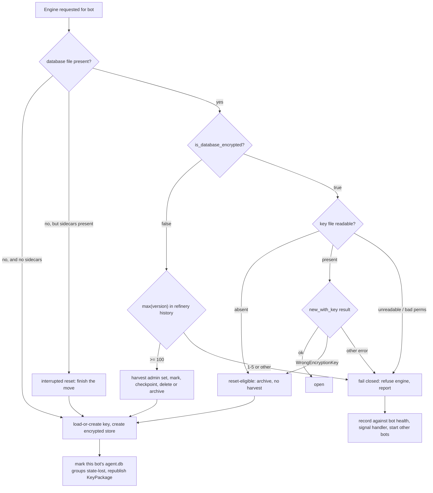
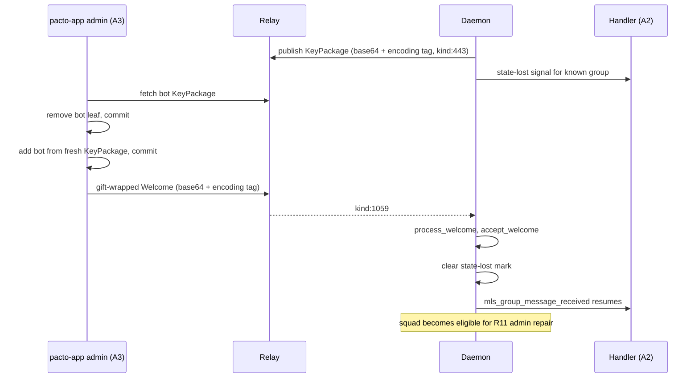
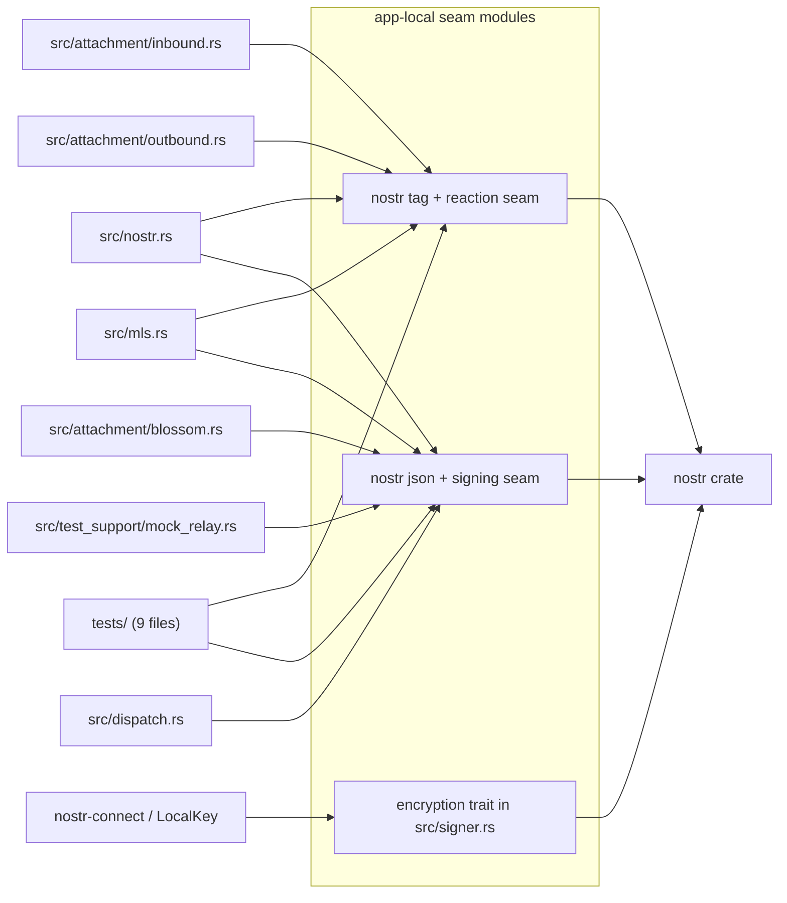
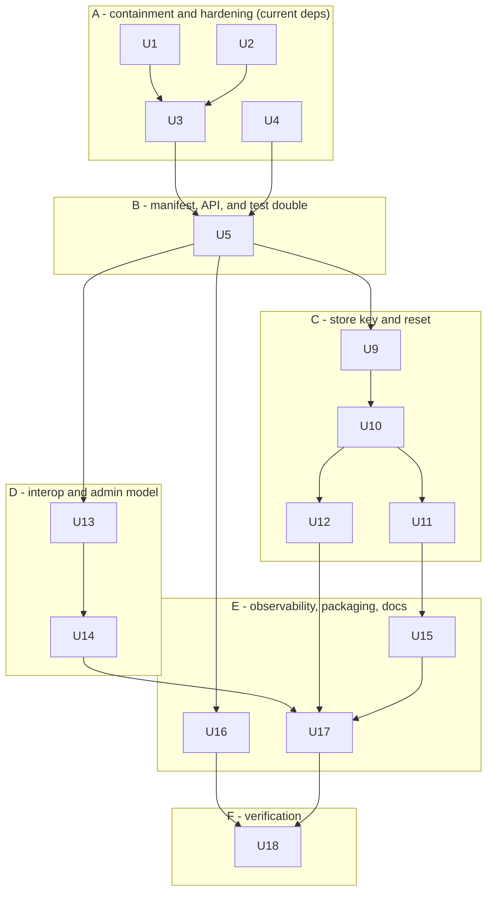

# Nostr 0.44 / MDK 0.8.0 Parity with Pacto-app - Plan

## Goal Capsule

- **Objective:** Move `pacto-bot-api` from `nostr` 0.43.1 + `mdk-*` 0.5.2 (git rev `f46875ec`) to `nostr` 0.44.7 + `mdk-*` 0.8.0 + `openmls` 0.8.1, restoring MLS wire interoperability with shipped `pacto-app` builds, and absorb the MLS store reset that MDK 0.8.0's mandatory store encryption forces.
- **Product authority:** This document. `pacto-app` is the authority on wire format only; its solution shape is precedent, not a constraint — the daemon never reads message history out of its MLS store and has no user to gate at launch.
- **Implementation authority:** The Planning Contract below. Where a Key Technical Decision and an implementation unit disagree, the KTD wins on mechanism and the governing R-ID wins on behavior.
- **Execution profile:** Fifteen dependency-ordered units in six phases. The A/B phase boundary is load-bearing: containment and intake hardening must be provable green against the *current* dependency set before the manifest moves, because the 0.44 compile sweep would otherwise refill the files the containment pass drains. Within phase B, the manifest move, the API migration, and the test-double migration are one unit — `scripts/pre-commit.sh` runs `make validate`, whose clippy target compiles every integration-test binary, so nothing in that set is separately landable.
- **Stop conditions:** Stop and surface rather than guess if U5's lock resolution produces two `rusqlite`, two `libsqlite3-sys`, or two `refinery` versions; if `is_database_encrypted` misclassifies a real pre-upgrade store during U10's rehearsal; if the U18 interop check fails in either direction; or if a new JSON-RPC error code would collide with an allocated one.
- **Tail ownership:** The executor owns the tail — `make validate`, the Python suite inside the venv, `cargo xtask codegen` / `cargo xtask docs` regeneration, and `CHANGELOG.md`.
- **Open blockers:** None. Q6 in the origin is a product question that does not gate implementation; it is carried below as a deferred open question.

---

## Product Contract

### Summary

Take `mdk-*` 0.8.0 from crates.io and the `nostr` 0.44 line, contain the `nostr` 0.45 removals behind app-local seams before the version bump, replace every bot's MLS store with a fresh SQLCipher-encrypted one keyed by a per-bot key file, and make the daemon speak the base64 + `encoding`-tag KeyPackage and Welcome format that shipped `pacto-app` builds already require.

### Problem Frame

`pacto-app` shipped its move to `nostr` 0.44.7 and `mdk-*` 0.8.0 (PR #198, `4603d75`; hardening in PR #199, `ea02eb4`). Issue #28 framed the work as "a coordinated release of both repos"; that framing is stale, and only the daemon has to move.

The break is live, not prospective. A bot on 0.5.2 publishes a hex-encoded KeyPackage with no `encoding` tag, which an upgraded app rejects, so the bot cannot be invited to a new or re-created Squad. An upgraded app publishes base64 Welcomes with a mandatory `encoding` tag, which a 0.5.2 bot's `process_welcome` cannot parse, so the bot cannot accept an invitation. Existing shared groups are not a refuge: `pacto-app`'s rollout archives and recreates the MLS store on first launch after update (`src-tauri/src/mls_store_reset.rs`), and recovery is remove-then-re-add by an admin who still holds group state (`src-tauri/src/mls.rs`, `MembershipAction::Restore`). Both halves of that recovery run through the KeyPackage/Welcome path the bot cannot speak. Every daemon-hosted bot is already cut off from any Squad whose members have taken the app update.

The second half is that `nostr` 0.43 is a dead branch. Only 0.43.0 and 0.43.1 were ever published, and the NIP-44 v2 fixes land on 0.44.5 and 0.44.7. The daemon's gift-wrap intake (`src/nostr.rs::process_gift_wrap`) sits directly on that decrypt path.

Two problems issue #28 never mentions dominate the cost. MDK 0.8.0 makes the store encryption key mandatory in a production build — `new_unencrypted` is `#[cfg(any(test, feature = "test-utils"))]` — which forces a key-management design the app never needed because it has a session key and the daemon does not. And `admin.create_mls_group` currently makes the bot the sole admin of every squad it creates.

### Key Decisions

Carried from the origin document with stable IDs. KD2 and KD7 are amended where research refuted their premises; every other decision is preserved in meaning.

- KD1. **Take `mdk-*` 0.8.0 from crates.io. Do not fork, do not chase 0.9.x.** 0.8.0 is the final release of this API; the eventual `cgka-engine` port costs the same whether or not 0.8.0 lands first, and 0.9.x is `publish = false` against a forked OpenMLS with its own wire break. Forking 0.5.x to patch its `nostr` pin strands the daemon on `openmls` 0.7.4 with no security path. Governs R1, R3.
- KD2. **Reset the MLS store; write no migration.** The daemon never reads message history out of the MLS store — it dispatches each decrypted rumor on receipt and persists nothing handler-visible from the store — and the epoch state a reset destroys is unrecoverable by any migration. *(Amended against the origin: the store is **not** "only cryptographic group state." Its `messages` table declares `content TEXT NOT NULL` and `event JSONB NOT NULL` and is written from the decrypted rumor, in both the 0.5.2 pin and 0.8.0 — `mdk-sqlite-storage-0.8.0/migrations/V001__initial_schema.sql:129-142`, `mdk-sqlite-storage-0.8.0/src/messages.rs:44-70`. The conclusion survives; the premise does not, and KTD4 and R43 inherit the correction.)* Governs R21-R23.
- KD3. **Source the SQLCipher key from a per-bot key file in `$DATA_DIR`, not a platform keyring and not the bot's nsec.** `MdkSqliteStorage::new(path, service_id, db_key_id)` needs `keyring_core` with a platform store, absent on a headless Linux host or in a TEE. Deriving from the nsec is impossible for `bunker_remote` bots, which hold no local secret. A random 32-byte file at `0o600` beside the store mirrors the existing `$DATA_DIR/bot_secret_token` pattern, needs no new dependency, and works identically for both signing backends. Governs R24-R26.
- KD4. **Detect a legacy store by file presence first, encryption state second, refinery version third.** `encryption::is_database_encrypted(path) == false` is a one-call, MDK-supported classification, but it also returns `false` for a file that does not exist, so presence must be tested first. On the unencrypted branch, read `max(version)` from `_refinery_schema_history_nostr_mls` by direct SQL to separate a legacy 0.5.2 store (>= 100) from an unrecognised or contradictory file; an already-0.8.0 store is caught by the encryption check and never reaches the fallback. Fail closed on anything else rather than archiving. Governs R19, R20.
- KD5. **Contain the `nostr` 0.45 removals in this work, not as a follow-up.** 0.45 shipped 2026-08-05 and removes `NostrSigner`, the trait `src/signer.rs` and `nostr-connect` are built on. Containment is cheap now and expensive after the 0.44 compile sweep has spread the symbols further. Governs R31, R32.
- KD6. **Declare `rusqlite` with `bundled-sqlcipher-vendored-openssl`.** Cargo unifies the crate's `bundled` with MDK's `bundled-sqlcipher` to the SQLCipher variant, which links system OpenSSL and needs Perl on Windows; the vendored superset removes both. Unkeyed databases open as stock SQLite, so `agent.db` is unaffected in format. Governs R4, R38.
- KD7. **Stop creating sole-admin squads.** `src/mls.rs:434` passes `vec![creator]`, so every squad the daemon creates has an admin set of exactly the bot. *(Amended against the origin: MDK 0.8.0 exposes `update_group_data`, which an existing admin may use to change the admin set after creation — `mdk-core-0.8.0/src/groups.rs:1385-1439`. The origin's premise that "no code path updates it" is false. But repair needs live MLS state the reset destroys, and a sole-admin squad's only admin is the bot itself, so no third party can restore it — the pre-upgrade population is permanently unrepairable and must be re-created. Repair applies to squads the bot still holds state for.)* Governs R11, R12.
- KD8. **Do not invent a bot-side update gate.** `pacto-app`'s mandatory update gate is a desktop mechanism — a `minimumCompatibleVersion` in the GitHub-Releases `latest.json`, checked at cold launch and unlock. A daemon has no launch screen and no user to block. The equivalent is diagnostic, not obstructive. Governs R41, R42.
- KD9. **Order the work: containment and intake hardening first, then versions, then reset.** The seams and the intake bound are changes against the current dependency set and can each be proven green with nothing else in flight.

### Actors

- A1. **Bot operator** — runs the daemon, owns `$DATA_DIR` and `pacto-bot-api.toml`, performs the upgrade.
- A2. **Bot handler process** — a Python or other SDK client. Sees the outage as "no more `mls_group_message_received` events," with no signal explaining why.
- A3. **Squad admin on pacto-app** — the only party who can restore a reset member's access, and only while they still hold group state.
- A4. **Squad members on pacto-app** — already through their own reset; see the bot as silently absent.
- A5. **The daemon itself as MLS group creator** — `admin.create_mls_group` makes the bot the sole admin of the groups it creates.

### Requirements

R49 and R50 are plan-added, not carried from the origin: the origin has no requirement for per-bot startup-failure isolation and none for a pre-upgrade backup, and review found the plan unsound without both.

**Dependency versions**

- R1. `mdk-core`, `mdk-sqlite-storage`, and `mdk-storage-traits` resolve to `0.8.0` from crates.io, with no `git =` dependency on any MDK repository remaining in `Cargo.toml`.
- R2. `nostr` resolves to 0.44.7 or later and `nostr-sdk` to 0.44.1; `nostr-connect` and `nostr-relay-pool` to 0.44; `nostr-blossom` to 0.44.0.
- R3. `openmls` resolves to 0.8.1 and the dev-dependency `openmls_traits` moves off 0.4.1 to the matching 0.5 line.
- R4. `rusqlite` resolves to 0.37, declared with `bundled-sqlcipher-vendored-openssl`; the lock resolves exactly one `rusqlite` and one `libsqlite3-sys`.
- R5. `refinery` resolves to a single version across the graph, collapsing the daemon's 0.8.16 against MDK's 0.9 requirement. The daemon's own `agent.db` migrations continue to apply unchanged under 0.9, and a new migration appends cleanly to a history table written by 0.8.16.
- R6. `cargo deny` passes on the regenerated lock and runs in CI rather than only on demand. The shipped vendored OpenSSL and SQLCipher versions are reported at runtime through the diagnostics surface, so a future advisory can be matched against a running deployment rather than against git history.

**Wire format and interop**

- R7. The daemon publishes KeyPackages whose content is base64 and whose tags include the mandatory `encoding` tag, by using the tag set MDK returns rather than reconstructing tags by hand.
- R8. The published KeyPackage event kind is decided explicitly and documented. Default: continue publishing `kind:443` using `KeyPackageEventData::tags_443`, because `pacto-app` fetches with a `Kind::MlsKeyPackage` filter and 0.8.0 accepts both kinds. Dual-publishing `kind:30443` is optional and gated on R46's interop result.
- R9. The daemon accepts an inbound KeyPackage of either `kind:443` or `kind:30443` at every layer that filters on kind — the relay subscription in `src/nostr.rs::fetch_key_package`, its per-event guard, and `src/mls.rs::validate_key_package` — and rejects one that carries no `encoding` tag with a distinct, named error rather than a generic parse failure.
- R10. The daemon accepts a base64 Welcome carrying an `encoding` tag and records a distinct peer-version-mismatch signal for a Welcome that does not, so an operator can tell "peer is on the old build" apart from "decryption failed." Because an inbound Welcome is unsolicited and its author unauthenticated, that signal is a single aggregated counter per rejection category with no per-peer keying — one diagnostic record per event, or a map keyed on attacker-mintable identity, is the resource-exhaustion class R33 bounds on the same intake path.
- R11. `admin.create_mls_group` no longer creates a group whose admin set holds only the bot: the invited recipient is added as a co-admin, or the method accepts an explicit admin list. An operator-triggered command expands the admin set of a group the bot currently holds state for, publishing the returned evolution event, and refuses a group the bot has no state for. Squads the daemon created before the upgrade with a sole-admin set are enumerated in diagnostics as unrestorable — their only admin was the bot, whose state the reset destroyed, so no third party can restore them and they must be re-created.
- R12. The daemon implements remove-then-re-add when adding a member who already holds a leaf in the group, so a restoration advances the epoch past the archived credential. Both commits' evolution events reach group relays, in order. A first-time invite is unchanged. A restoration is refused unless the bot is a group admin, and a failure between the remove and the add surfaces as a distinct error naming that the member is now outside the group.
- R13. When the daemon restores a member it resolves that member's KeyPackage freshly from relays rather than from any cached reference, because a reset member republishes against a new store.

**MDK 0.8.0 API migration**

- R14. Every `MlsCommand` arm in `src/mls.rs` compiles and behaves against the 0.8.0 signatures, with the `catch_unwind` boundary preserved on each.
- R15. The `MessageProcessingResult` match is exhaustive against the 0.8.0 enum, and every arm carrying a publish obligation discharges it. `Proposal` carries an auto-committed `UpdateGroupResult` whose evolution event must reach group relays or the bot's epoch advances past every peer's; the worker returns it to a caller that can publish. `PendingProposal` and `IgnoredProposal` yield no handler-visible event. `PreviouslyFailed` is logged and skipped without advancing anything that would suppress a legitimate retry.
- R16. `mdk_error_category` classifies the new typed error variants into stable, non-leaky category strings, and storage-construction errors are classified the same way before they can become a `DaemonError`. No group ID, key material, raw engine message, or raw SQL reaches a log line or a JSON-RPC error.
- R17. `MdkConfig` is chosen explicitly rather than inherited by default, and the chosen epoch-retention and out-of-order-tolerance values are documented against the daemon's dispatch and cursor model. MDK's rollback callback is registered for observability so a rollback that invalidates already-dispatched messages is countable rather than silent.
- R18. `tests/support/mock_mls_peer.rs` is migrated to the 0.8.0 API and evaluated against MDK's `test-utils` feature; if `test-utils` replaces hand-rolled scaffolding, the hand-rolled version is removed rather than left beside it.

**MLS store reset**

- R19. The daemon classifies every existing store before MDK 0.8.0 opens it, by presence, then encryption state, then `max(version)` in `_refinery_schema_history_nostr_mls`. An unencrypted store whose `max(version)` is anything other than the legacy range (>= 100) fails closed — including the current 1-5 range, which cannot legitimately appear on an unencrypted file: no archive, no engine, a diagnostic entry. A path whose database is absent but whose sidecars are present is an interrupted reset: it completes the move before the fresh store is created, rather than creating a store beside the leftover sidecars.
- R20. Detection reads the legacy file as plain SQLite by direct query, never hands it to MDK 0.8.0, and never opens a path it has not first confirmed exists — `rusqlite` creates a database as a side effect of opening one.
- R21. A detected legacy store is checkpointed out of WAL so its log folds into the main file, then removed from the live path as a single rename: deleted when `mls_archive_retention_days` is `0`, or moved into a timestamped child of one stable archive root when it is not. An encrypted store rejected under R26 is always archived regardless of that setting. Sidecars are enumerated by literal filename suffix (`<db_file_name>-wal`, `-shm`, `-journal`), set to `0o600` before the move, and none may remain at the live path when the fresh store is created. The archive root and its children are created `0o700` at creation time.
- R22. A legacy archive set is removed on the first daemon start after its retention window elapses. An R26 archive is exempt: it is ciphertext an operator can still open by restoring the right key, and it is the only recovery for a key restored wrong. The window bounds disk exposure and does not revoke anything; the revocation is R12.
- R23. Reset runs once per bot identity, is serialised so concurrent callers cannot run it twice, and is re-enterable at every crash point in its sequence. A durable reset-in-progress marker is committed **before** the destructive step, so recovery does not depend on an archive that the default configuration never creates.
- R24. The MLS store is opened with `MdkSqliteStorage::new_with_key`. The key is 32 random bytes persisted per bot identity in `$DATA_DIR`, created with owner-only permissions at creation time per `docs/solutions/best-practices/secure-file-creation.md`, and durably flushed — file and containing directory — before any store is created against it.
- R25. The key is represented in memory with `zeroize` and never appears in logs, diagnostics, shutdown reports, config dumps, `pacto-bot-admin export`, or JSON-RPC errors. The redaction suite covers the key, the key file path, the store path for any configured filename, and the archive root.
- R26. Deleting the key file, or a key a store rejects as wrong, is a store reset. Every other key-file condition — truncated, unreadable, wrong permissions, absent mount — fails closed exactly as R19 does: refuse the engine, report, touch nothing on disk.
- R27. After a reset the daemon republishes its KeyPackage before any restoration is attempted, so an admin's re-add targets a KeyPackage whose private init key lives in the new store.
- R28. `agent.db`'s `mls_groups` and `mls_group_members` rows survive a reset. Groups whose engine state was lost *because this bot was reset* are marked; a group the bot was legitimately evicted from is not. The daemon declines to send into a marked group until a Welcome restores state rather than failing per-message with a generic engine error.
- R29. `pacto-bot-admin export` / `import` account for the new store shape and the key file. Export writes the key with owner-only permissions at creation time into a destination directory created `0o700`, never by copying the source mode. Import refuses the store artifact when its key is missing or does not open it, imports the `agent.db` half regardless, and marks every group it imports without engine state as state-lost. Silently importing an unreadable store is prohibited, and no imported artifact may be written outside the bot's data directory.

**Nostr 0.44 migration and 0.45 containment**

- R30. `process_gift_wrap` explicitly verifies that the rumor author matches the seal author and rejects a mismatch, rather than relying on the daemon's incidental use of `seal_event.pubkey` for attribution.
- R31. No `nostr` `Timestamp::as_u64` call site remains; `as_u64` on non-nostr types is untouched. This requirement is ratcheted by 0.44.7's deprecation under `make clippy`'s `-D warnings`, not by the R32 lint, which cannot resolve a method receiver's type.
- R32. The symbols `nostr` 0.45 removes — `NostrSigner`, `TagKind`, `TagStandard`, `JsonUtil`/`as_json`/`from_json` on nostr types, `sign_with_keys`, `EventBuilder::pow`, `EventBuilder::reaction_extended` — reach the crate through a bounded set of app-local seam modules rather than being referenced across it, in `tests/` as well as `src/`. A ratchet that resolves syntax rather than text asserts zero occurrences outside the seams and runs in CI, because the 0.44 compile-error sweep will otherwise refill files the containment pass drained.
- R33. A failure handling one inbound gift wrap costs one event, whether it unwinds or stalls. The per-event `tokio::spawn` already contains an unwind; a per-event deadline bounds the resource-exhaustion class, and the spawn is bounded so a burst cannot exhaust memory or file descriptors. *(Overlaps beads `pacto-bot-api-v7z9` and `pacto-bot-api-f9nc`.)*
- R34. NIP-46 bunker connections continue to work against `nostr-connect` 0.44, including bunker signers that return the secret in the connect response.

**Handler and SDK contract**

- R35. No JSON-RPC method name, parameter, or response field is removed or renamed. `agent.publish_key_package`, `agent.send_group_message`, `agent.send_group_reaction`, `agent.send_group_attachment`, `admin.create_mls_group`, `admin.invite_to_mls_group`, and `admin.exit_mls_group` keep their shapes, except where R11 adds an optional admin list.
- R36. `schemas/jsonrpc.json` descriptions state that the daemon publishes `kind:443` — unchanged under R8 — and that inbound KeyPackages of either `kind:443` or `kind:30443` are accepted per R9. The generated Python SDK is regenerated and its test suite run inside the venv, not inferred from `make validate`.
- R37. A bot the handler cannot use receives an explanatory, bot-scoped signal rather than silence, carrying which of two reasons applies: group state lost to a reset and awaiting re-invitation, or engine unavailable because store classification failed closed under R49. The SDK surfaces both. Because `agent.status` broadcasts to every registered handler, per-bot and per-group detail travels on this signal and on `pacto-bot-admin diagnose`, not on the broadcast.

**Packaging and cross-compilation**

- R38. `make cross-compile-macos` and `make cross-compile-linux` succeed with the SQLCipher-linked `libsqlite3-sys`. A target dropped from the *release* matrix is not dropped from the *build* matrix while the crate still carries code compiled only for it.
- R39. `scripts/package-release.sh` and the Docker image build against the new native dependency set, and the release artifacts still produce SHA-256 sums.
- R40. CI exercises the link path that ships, not only the native host build: at least one `cargo-zigbuild` cross-target compiles on every pull request, so a SQLCipher link failure cannot first appear at tag time.

**Observability and documentation**

- R41. `pacto-bot-admin diagnose` reports the MDK version, the MLS wire generation, the vendored OpenSSL and SQLCipher versions, whether the bot's store was reset and when, whether the bot holds state for each group in `agent.db`, and which sole-admin squads are repairable versus unrestorable. The daemon's periodic tick emits a warning naming bots and groups still state-lost, and sole-admin squads still unrepaired, past a minimum age — the pull surface is invisible to an operator who is not polling. `agent.status` carries the daemon-wide version and wire generation only.
- R42. A KeyPackage or Welcome rejected for a missing `encoding` tag produces a log line and diagnostic entry naming the cause as a peer-version mismatch, distinguishable from a decryption failure, without letting an unauthenticated peer evict genuine records from the diagnostics ring.
- R43. `CHANGELOG.md`, `AGENTS.md`, `README.md`, `docs/GETTING_STARTED.md`, `BUILDING.md`, and `docs/pacto-bot-admin-llms.txt` describe the post-upgrade dependency and storage reality: the key file and that keeping it beside the store buys no confidentiality against anyone who can read `$DATA_DIR`; that the MLS store and any archive of it hold the plaintext content of every group message the bot decrypted, not only key material, and that a backup agent will capture both; the retention setting and the delete-by-default; that bots need re-invitation; that a rollback can invalidate messages a handler already acted on; and the changed release matrix.
- R44. Issue #28 is updated with the corrections below or closed in favour of this plan.

**Operational safety** *(plan-added)*

- R49. A per-bot engine-construction failure is isolated: the daemon records it against that bot's health, signals its handler per R37, starts every other bot, and stays up. One unrecognised store must not abort a daemon hosting several bots, because that also takes down the diagnostics an operator needs to understand why.
- R50. The upgrade has a numbered operator runbook whose first step is a pre-upgrade `$DATA_DIR` backup, and which covers the fail-closed recovery path — that backup, and nothing else — and the response to a suspected key or archive compromise.

**Verification**

- R45. `make validate` and the full test suite pass; the Python suite passes inside the venv.
- R46. An upgraded daemon and a current `pacto-app` build share one Squad, both directions verified: the app invites the bot and the bot decrypts group traffic; the bot invites a member and that member joins. This is the acceptance criterion the whole document exists for.
- R47. The reset path is exercised against a copy of a real pre-upgrade `$DATA_DIR`, including a leftover `-wal`, a bot whose `mls_db_path` does not end in `.db`, and a mixed-state multi-bot directory holding one legacy, one already-migrated, and one unrecognised store.
- R48. A hostile inbound gift wrap — malformed NIP-44 payload — is fed through intake; the intake loop survives, the next well-formed event is processed, and the offending wrapper is not retried every launch.

### Key Flows

- F1. **Operator upgrades the daemon**
  - **Trigger:** A1 backs up `$DATA_DIR` per R50, then installs a build carrying MDK 0.8.0 over it.
  - **Actors:** A1, A2
  - **Steps:** For each bot identity the daemon classifies the store, finds it unencrypted, harvests the admin set, commits a reset-in-progress marker, checkpoints the file set and either deletes it or — when archiving is enabled — moves it to a timestamped archive, generates and persists a store key, creates a fresh encrypted store, marks that bot's `agent.db` groups as state-lost, republishes the bot's KeyPackage, and starts. A bot whose store fails closed is recorded and signalled to its handler; the others still start. Archives past the retention window are pruned on the same path.
  - **Covers:** R19-R28, R37, R49, R50.
- F2. **Bot is restored into an existing Squad**
  - **Trigger:** F1 completed; the bot holds no state for a Squad it is recorded as belonging to.
  - **Actors:** A2, A3, A4
  - **Steps:** A3, still holding group state, restores the bot. Because A3 is on the upgraded app, the restore is remove-then-re-add and the epoch advances past the bot's archived leaf. The bot receives the Welcome as a `kind:1059` gift wrap, `process_welcome` accepts the base64 payload, the state-lost mark clears, and group traffic decrypts.
  - **Covers:** R10, R27, R28, R37.
  - **Constraint:** A Squad with two or more admins can hand restoration between them; a Squad with one admin cannot be restored at all and must be re-created. The bot is a member, not the arbiter, so it must tolerate never being restored — and a squad whose sole admin *is* the bot is in that state by construction after the reset.
- F3. **Bot creates a Squad**
  - **Trigger:** `admin.create_mls_group`.
  - **Actors:** A2, A5
  - **Steps:** The daemon creates the group with an admin set that is not just the bot, fetches the recipient's KeyPackage accepting either kind and requiring the `encoding` tag, and gift-wraps the base64 Welcome.
  - **Covers:** R7-R9, R11.
- F4. **Peer is still on the old build**
  - **Trigger:** The daemon fetches a KeyPackage published by a client on `mdk-core` 0.5.2, or receives a hex Welcome.
  - **Actors:** A1, A2
  - **Steps:** Parsing fails on the missing `encoding` tag. A caller-initiated fetch returns a named peer-version-mismatch error; an unsolicited inbound Welcome increments an aggregated diagnostic instead.
  - **Covers:** R9, R10, R42.

### Scope Boundaries

- The port to `cgka-engine` / `marmot-app` is out of scope and is not a deferral of this work — it is a separate MLS-subsystem rewrite whose cost is unchanged by landing 0.8.0 first.
- Moving to the `nostr` 0.45 line is out of scope; only reducing its future cost is, per R32.
- Forking MDK to patch its `nostr` pin is rejected, not deferred.
- Writing an on-disk migration for the existing MLS store is rejected, not deferred.
- No handler-facing protocol redesign. R37's signal is additive.
- No new admin CLI surface beyond what R11, R29, and R41 require.
- Sourcing the MLS store key from an environment variable or an external command (for TEE deployments where writing a key to disk is the thing being avoided) is deferred. KTD3 puts the key behind an internal provider, but a non-file source also needs R26's "key absent means reset" rule re-scoped to file-backed sources — for an env var a typo would otherwise destroy the store — and KTD3's load-or-create operation has no meaning for a source that cannot persist. Recording that now is what keeps the deferral honest.
- No metrics or alerting stack. R41 and R42 extend the diagnostics and `tracing` surfaces the daemon already has.

#### Deferred to Follow-Up Work

- Dual-publishing `kind:30443` alongside `kind:443`. Held until R46 shows whether any peer needs it; the plan ships 443-only.
- Restoring Windows and FreeBSD to the *release* matrix. Both are dropped from release under KTD7 and are re-addressable when the upstream blockers close; Windows stays in the build matrix as a compile-only gate.

### Open Questions

- **Q6 (deferred, product).** Is a bot ever an admin worth restoring? R12 gives the daemon the ability to restore a member. Whether an operator should run a Squad whose restoration authority is a bot is a product question. It does not gate this work: the capability is built, the policy is the operator's.

---

## Planning Contract

### Origin corrections from research

Six claims in the origin document are wrong or imprecise. Each was verified against vendored crate sources or the RustSec advisory database on 2026-08-05.

| Origin claim | Reality | Consequence |
|---|---|---|
| KD2 / "The daemon stores no message history" | MDK's `messages` table declares `content TEXT NOT NULL` and `event JSONB NOT NULL`, written from the decrypted rumor, in both the 0.5.2 pin and 0.8.0 (`mdk-sqlite-storage-0.8.0/migrations/V001__initial_schema.sql:129-142`, `src/messages.rs:44-70`). The daemon never *reads* it, which is why KD2's conclusion survives | KD2's premise, KTD4's archive characterization, R43's operator documentation, and System-Wide Impact all corrected: the store and any archive hold plaintext message bodies |
| KD7: "the admin set is fixed at `create_group` and no code path updates it" | `update_group_data(&GroupId, NostrGroupDataUpdate) -> Result<UpdateGroupResult>` changes admins post-creation; caller must be an admin; the returned `evolution_event` must be published (`mdk-core-0.8.0/src/groups.rs:1385-1439`). But it opens with `load_mls_group(group_id)?.ok_or(Error::GroupNotFound)?` (`:1390`), so it needs live state | Repair is real for held groups. A pre-upgrade sole-admin squad has no other admin to restore it, so its population is permanently unrepairable — R11 says so and U15 labels it that way |
| R32/KD5: exposure is "concentrated in `src/signer.rs`, `src/nostr.rs`, and `src/nip46.rs`" | `src/nip46.rs` carries none of these symbols. Eight source files do: `src/signer.rs`, `src/nostr.rs`, `src/mls.rs`, `src/attachment/inbound.rs`, `src/attachment/outbound.rs`, `src/attachment/blossom.rs`, `src/test_support/mock_relay.rs`, `src/dispatch.rs` — plus nine files under `tests/`. `TagStandard` and `EventBuilder::pow` have zero occurrences | U1-U3 size the containment against eight source files and the `tests/` tree. `TagStandard` and `pow` need no work; the ratchet still asserts them at zero |
| The 0.44 break list includes `EventBuilder::reaction_extended` removal | `reaction_extended` exists unchanged in `nostr` 0.44.7 with an identical signature; its removal is a 0.45 change. `src/nostr.rs::extract_reaction` needs no change for the 0.44 move | The reaction path leaves the 0.44 migration and joins R32's containment set, where U3's ratchet asserts it |
| `create_message(&gid, rumor)` in 0.5.2 gains a third parameter | Confirmed: `create_message(&self, mls_group_id: &GroupId, mut rumor: UnsignedEvent, tags: Option<Vec<EventTag>>)` (`mdk-core-0.8.0/src/messages/create.rs:110-115`). The origin's delta table is right | No change; recorded because an earlier verification pass disputed it |
| C3's advisory IDs, taken from `pacto-app` and never re-derived (origin Q4) | RUSTSEC-2026-0216 is real: `nostr::nips::nip44::decrypt` panic, affected `>= 0.26.0, < 0.44.5`, patched `>= 0.44.5`. RUSTSEC-2026-0227 is real, dated 2026-08-01: NIP-44 v2 resource exhaustion, patched `>= 0.44.7`. Issue #28's `hpke-rs` claim is wrong on both the IDs and the exposure: the advisories are RUSTSEC-2026-0069/0070/0071, all patched `>= 0.6.0`, and the crate already resolves `hpke-rs` 0.6.1 — so there is no `hpke-rs` exposure before or after the upgrade. `openmls` 0.7.4 and 0.8.1 carry no advisories | C3 stands as written for the `nostr` side. Origin Q4 is closed. R6's advisory gate is the live control, which is why it must run in CI |

Four further facts shape the plan and were not in the origin.

- `Timestamp::as_u64`'s 0.44.7 deprecation is a hard blocker, not a warning: `make clippy` runs `-D warnings`.
- `mdk-sqlite-storage` 0.8.0 declares `rusqlite` with plain `bundled-sqlcipher`, not the vendored-openssl variant — KD6 is a daemon-side choice, not something MDK forces.
- `apply_encryption` runs `validate_sqlcipher_available`, which requires a non-empty `PRAGMA cipher_version` and otherwise returns `Error::SqlCipherUnavailable` (`mdk-sqlite-storage-0.8.0/src/encryption.rs:161-165`). A wrong `rusqlite` feature resolution therefore fails loudly at first store open rather than silently writing plaintext. That is the runtime proof of KD6.
- MDK 0.8.0 never sets `journal_mode`. A store it creates uses the default rollback journal, so its sidecar is `-journal`, not `-wal`.

### Key Technical Decisions

- KTD1. **Three seam modules, each with nothing else in it.** `src/nostr_tags.rs` owns `TagKind`/`TagStandard` and the reaction builder; a sibling module owns nostr JSON round-tripping and `sign_with_keys`; `src/signer.rs` keeps `NostrSigner` behind a local encryption trait. The JSON and signing helpers get their own module rather than living inside `src/nostr.rs`: that file is 2,400+ lines and is itself the largest source of the symbols being drained, so a ratchet scoped to it would assert almost nothing. The import direction is already bidirectional between `src/nostr.rs` and `src/attachment/` today, so a new leaf module does not create coupling that is not there. The local `TagKind` enum in `src/scaffold/template.rs` is unrelated to `nostr::TagKind` and must not be touched. Governs R32.
- KTD2. **The containment ratchet extends `cargo xtask secret-lint`'s machinery, not a grep test.** `xtask/src/secret_lint.rs` already walks the tree, skips `_generated.rs`, parses with `syn`, and self-tests against fixture directories. A text scan cannot separate the scaffold's local `TagKind` from nostr's and cannot see `#[cfg(test)]`; a `syn` visitor sees both. It cannot resolve a method receiver's *type*, so `Timestamp::as_u64` is out of the lint's reach — R31 is ratcheted by clippy's deprecation gate instead, and the lint covers the type-and-path symbols only. Since `cargo xtask full-check` runs in neither the `Makefile` nor CI today, the new lint must be wired into a CI step explicitly — the one thing a `tests/` placement would have given for free. Governs R32.
- KTD3. **The store key comes from a provider with two distinct operations and one implementation.** A side-effect-free *load* used during classification, and a *load-or-create* used only after classification has decided a fresh store is required — a provider that creates on read makes "key file absent" permanently unobservable and defeats R26. The implementation is 32 random bytes at a path formed by appending `.key` to the store's file name (concatenation, not `set_extension`, so `squad.db` and `squad.sqlite` do not collide on `squad.key`), created `0o600` at creation time, `sync_all`'d with its directory fsync'd before any store opens against it, and held as `Zeroizing<[u8; 32]>`. Placing the key beside the store rather than deriving per-bot keys from one daemon key means export/import moves one directory and `src/mls_path.rs`'s existing hardening already covers it. Governs R24, R25, R26, R29.
- KTD4. **Delete the legacy file set by default; archiving is opt-in.** `mls_archive_retention_days` defaults to `0`. KTD6 harvests the only data the plan reads from a legacy store before the move, and the residual archive is not merely epoch and exporter secrets — per the KD2 correction it is also the plaintext content of every group message the bot decrypted, for groups the bot has not been evicted from, and F2 records that eviction may never happen. `pacto-app`'s seven-day window is a desktop app's trade on a user's own machine; a headless daemon's `$DATA_DIR` is routinely bind-mounted and swept by backup agents. An operator who sets a non-zero window is retaining message history, not just key material, and R43 says so. The one exemption is R26's encrypted store: it is ciphertext, it is the only recovery for a key restored wrong, and it is always kept. Governs R21, R22.
- KTD5. **Repair is gated on held state; the pre-upgrade population is unrepairable, not queued.** `update_group_data` needs live MLS state, which the reset destroys. For a squad the bot co-admins with someone else, restoration can return that state and repair follows. For a pre-upgrade sole-admin squad the bot *is* the only admin, so there is no one to restore it — the squad is permanently unrepairable and must be re-created. Diagnostics must label those two populations differently, or an operator waits for a restoration that cannot happen. Within the reachable population repair stays operator-triggered: auto-repairing would publish an evolution event per group as a side effect of installing a binary. Governs R11.
- KTD6. **Harvest the legacy store's admin set before the move.** `agent.db` records `creator_npub` and `invited_bots` but not the MLS admin set (`migrations/V1__baseline.sql:28-43`, `src/db.rs:558-561`), so R11's diagnostic would otherwise be a guess. Two encoding boundaries are crossed: the 0.5.2 store holds `admin_pubkeys` as a JSON array of 64-char hex while `agent.db` stores bech32 npub throughout, and `nostr_group_id` is declared `TEXT` but bound as a 32-byte array, so it reads back as a blob that must be hex-encoded to become a `wire_id`. The harvest is historical: once the bot holds live state again, the engine's admin set supersedes it. The R26 branch cannot harvest — an encrypted store is not readable as plain SQLite — and records "admin set unknown" rather than an empty set. Governs R11, R19.
- KTD7. **Windows and FreeBSD leave the release matrix; Windows stays a compile-only build gate.** Both have open upstream blockers against SQLCipher plus vendored OpenSSL — `x86_64-pc-windows-gnu` fails to *link* `crypto` (rusqlite#1025) and `x86_64-unknown-freebsd` cannot resolve `kvm` through the zig linker (cargo-zigbuild#356) — and both are already commented out of `.github/workflows/release.yml`. KTD3 requires a `cfg(windows)` owner-only-DACL branch for the key file, and dropping Windows from the build matrix would leave security-critical code that nothing compiles. `cargo check` does not link, so the gate should survive rusqlite#1025 — but `libsqlite3-sys` with `bundled-sqlcipher` compiles native C in its build script, so if the failure originates there the gate does not hold and Windows leaves the build matrix too, with U9's Windows scenario deleted rather than left unrunnable. Either way the gate proves compilation only: the DACL branch's runtime behaviour is unverified, and restoring Windows to the release matrix requires verifying it rather than inheriting the compile gate as assurance. macOS x86_64/arm64 and Linux musl x86_64/arm64 stay a hard release gate. Governs R38.
- KTD8. **`MdkConfig` is set explicitly at MDK's defaults, and the rollback callback is registered for observability only.** Taking `MDK::new(storage)` would inherit the same numbers silently; naming them makes the next epoch-retention question a diff instead of an investigation. The daemon adopts `max_past_epochs: 5`, `out_of_order_tolerance: 100`, `maximum_forward_distance: 1000`, `max_event_age_secs: 3_888_000`, `max_future_skew_secs: 300`, `epoch_snapshot_retention: 5`, `snapshot_ttl_seconds: 604_800`. `MdkCallback::on_rollback` is synchronous and `Send + Sync`, invoked from inside `process_message` on the worker thread, so an implementation may neither await nor re-enter `MlsEngineHandle`; `RollbackInfo` also carries a raw `GroupId` that R16 forbids logging. Both constraints are satisfied by a callback that only increments an aggregated diagnostic counter, which is what the daemon registers. The rollback happens whether or not a callback exists — declining one entirely would leave handlers holding invalidated messages with no trace anywhere. Governs R17.
- KTD9. **New JSON-RPC error codes allocated from `-32025`, split by trust surface.** `-32025` peer version mismatch on a caller-initiated fetch (R9), `-32026` group state lost / awaiting re-invitation (R28), `-32027` restoration incomplete / member outside group (R12), `-32028` bot engine unavailable after a fail-closed classification (R49). An unsolicited inbound Welcome has no caller and gets an aggregated per-category counter, never a per-event `record_error` and never a per-peer map: the diagnostics ring holds 32 entries and evicts from the front, and peer identity on an unsolicited event is attacker-mintable. `-32024` is the highest allocated today (`src/errors.rs:79-110`). Each code routes through `DaemonError`, gains a row in the error-code table in `docs/plans/2026-06-24-001-feat-pacto-bot-api-daemon-plan.md`, and extends the existing `*_error_codes_match_plan` assertions. Governs R9, R10, R12, R28, R42, R49.

### High-Level Technical Design

Sketches below are authoritative on shape; the prose and the cited R-IDs remain authoritative on behavior.

**Store classification, per bot identity at startup**

**Restoration into an existing Squad (F2)**

**Containment seams and the files that route through them**

### Assumptions

- The archived legacy store can be opened by plain `rusqlite` after the manifest move. `rusqlite` with `bundled-sqlcipher-vendored-openssl` opens an unkeyed database as stock SQLite, so KD4's direct-SQL classification keeps working post-upgrade. U10 proves this against a real file rather than asserting it.
- `nostr-connect` 0.44's fix for bunker signers that return the secret in the connect response does not change the daemon's call shape. `src/nip46.rs` only calls `fetch_bunker_public_key` and never implements the signer side, so the change should be invisible. U5 verifies against the mock bunker rather than assuming.
- The daemon's existing `AddMember` arm merges the pending commit immediately after `add_members` (`src/mls.rs:479`), ahead of MDK's documented merge-after-publish contract. That is pre-existing and out of scope, but U14's back-to-back remove-then-re-add depends on it, so a future correction of that ordering must revisit U14.

### System-Wide Impact

- **`$DATA_DIR`'s secret inventory changes shape, and the encryption buys less than it looks like.** The directory gains a per-bot 32-byte key sitting beside the ciphertext it decrypts. Against anyone who can read `$DATA_DIR` — the threat the daemon's `0o600` files already address — SQLCipher adds nothing. What it does add is real but narrower: `apply_encryption` sets `PRAGMA temp_store = MEMORY`, and encrypted sidecars mean the WAL and any temp spill stop being plaintext on disk. R43 must say both halves, because an operator told only "back the key up with the store" will reasonably assume the store is protected in transit to a backup, and it is not.
- **The store's contents are broader than "key material."** MDK persists each decrypted rumor's `content` and full `event` JSON. Anything that captures the store or an archive of it captures group message history in plaintext, which is why KTD4 deletes by default and why R43 names it explicitly.
- **The MLS store's data lifecycle becomes non-monotonic.** Before this change MLS state only grew. After it, state is destroyed at startup by a version check, and `agent.db` rows outlive the engine state they describe (R28). `agent.db` becomes the durable record and the MLS store becomes disposable derived state — a property of the daemon that survives this release and governs every future MLS change.
- **The daemon's memory now holds key material it did not before.** KTD3 zeroizes the daemon's copy, but MDK renders the key into a `String` to build its `PRAGMA key` statement and neither that string nor its `format!` product is zeroized. Core-dump and memory-scan assertions must be scoped to the 32 bytes the daemon owns, with the upstream rendering named as a known residue rather than silently failing the sweep.
- **The cross-repo wire contract gains a second consumer with no negotiation channel.** The daemon and `pacto-app` now share a wire generation with no version handshake. R42 is detection after failure and KD8 declines a gate deliberately. Any future MDK wire change repeats this outage, and the only control this release leaves behind is a diagnostic.
- **What this does not touch.** `agent.db` gains one migration and no destructive change. The JSON-RPC method set is unchanged (R35), so nothing SDK-breaking reaches Python beyond additive fields and one new event type. The frame-size cap, rate limiter, handler reaper, spool, DM path, and attachment paths are untouched. That bound is what lets a reviewer scope a release that resets every deployment's crypto state.

### Risks & Dependencies

| Risk | Mitigation |
|---|---|
| One bot's fail-closed classification aborts the whole daemon, taking down healthy bots and the diagnostics needed to diagnose it | R49 isolates per-bot engine failure and R37 tells that bot's handler why; R47's rehearsal uses a mixed-state multi-bot `$DATA_DIR` so the isolation is proven, not assumed |
| An operator upgrades, hits a fail-closed store, and has nothing to restore | R50 makes a pre-upgrade `$DATA_DIR` backup step one of the runbook. There is no other recovery path and the plan does not pretend otherwise |
| Vendored OpenSSL plus SQLCipher breaks `cargo-zigbuild` for musl aarch64 | R38 makes macOS and Linux musl a pre-tag gate; R40 moves the first cross-link signal to every PR. Windows and FreeBSD leave the release matrix under KTD7 |
| The store key becomes an operational footgun: lost on restore, excluded from backups, or copied without the store | R26 narrows reset-eligible key states to two and fails closed on the rest; R22 always keeps the encrypted archive so a key restored wrong is recoverable; R29 scopes import refusal to the store artifact; R43 documents the backup unit and R50 the compromise response |
| Bots stay silently cut off because no admin ever restores them | R37 pushes a bot-scoped signal to the handler, R41 surfaces it to the operator and warns on the periodic tick, and R11 stops the daemon manufacturing more unrestorable groups |
| Operators wait indefinitely for a restoration that cannot happen | KTD5 and R11 label pre-upgrade sole-admin squads unrestorable rather than blocked, so the diagnostic points at re-creation |
| The 0.44 compile sweep refills the seams the containment pass drained | KTD2's syntax-resolving lint lands before U5 and runs as a CI gate over `src/` and `tests/` |
| MDK 0.8.0 is terminal, so a future defect has no upstream fix | Accepted under KD1; the alternative is a fork, which is worse. Recorded so it is not re-litigated |
| A future advisory lands against the vendored OpenSSL or SQLCipher already in a released binary | R6 puts `cargo deny` in CI and the shipped crypto versions in the diagnostics surface, so the match is against a running deployment rather than a changelog line |
| `refinery` 0.9 changes behaviour for the daemon's own `agent.db` migrations | R5 requires the existing set to apply unchanged *and* a new migration to append cleanly to a 0.8.16-written history table. The two history tables live in separate files and do not interact |
| The change is irreversible per deployment: a downgraded build cannot read a 0.8.0 store | No rollback is pretended. The controls are R50's backup, the pre-tag gates, and R49's blast-radius bound |

### Sequencing

Six phases. The A/B boundary is load-bearing: everything in A is provable green against the current dependency set and nothing in A depends on the version move. U6, U7, and U8 are retired IDs — the manifest move, the API migration, and the test-double migration merged into U5 and the numbers are not reused.

---

## Implementation Units

### Unit Index

| U-ID | Unit | Key files | Depends on |
|---|---|---|---|
| U1 | Tag and reaction seam | `src/nostr_tags.rs`, `src/nostr.rs`, `src/mls.rs`, `src/attachment/*`, `tests/*` | — |
| U2 | JSON, signing, and `NostrSigner` seams | new seam module, `src/signer.rs`, `src/attachment/blossom.rs`, `src/test_support/mock_relay.rs`, `tests/*` | — |
| U3 | Containment ratchet in xtask | `xtask/src/`, `.github/workflows/ci.yml` | U1, U2 |
| U4 | Gift-wrap intake hardening | `src/nostr.rs`, `tests/nostr_client.rs` | — |
| U5 | Manifest move, API migration, test double | `Cargo.toml`, `Cargo.lock`, `src/mls.rs`, `src/nostr.rs`, `tests/support/mock_mls_peer.rs` | U3, U4 |
| U9 | Store key provider | `src/mls_key.rs`, `src/diagnostics.rs`, `tests/secret_redaction.rs`, `.github/workflows/ci.yml` | U5 |
| U10 | Classification, reset, and store construction | `src/mls_reset.rs`, `src/client_manager.rs`, `src/bot_state.rs`, `src/mls.rs`, `migrations/V3__*.sql` | U9 |
| U11 | Post-reset recovery, failure isolation, handler signal | `src/client_manager.rs`, `src/db.rs`, `src/events.rs`, `src/handlers.rs`, `src/errors.rs` | U10 |
| U12 | Export / import for store and key | `src/admin.rs` | U10 |
| U13 | KeyPackage and Welcome encoding | `src/mls.rs`, `src/nostr.rs`, `src/errors.rs`, `schemas/jsonrpc.json` | U5 |
| U14 | Admin-set model and restoration | `src/mls.rs`, `src/admin.rs`, `src/dispatch.rs`, `src/errors.rs`, `schemas/jsonrpc.json` | U13 |
| U15 | Diagnostics, status, and the stuck-bot log | `src/diagnostics.rs`, `src/admin.rs`, `src/main.rs` | U11 |
| U16 | Packaging, Docker, CI matrix | `Makefile`, `scripts/package-release.sh`, `Dockerfile`, `.github/workflows/*` | U5 |
| U17 | Runbook, docs, schemas, SDK, issue #28 | `README.md`, `CHANGELOG.md`, `BUILDING.md`, `docs/`, `python/` | U12, U14, U15 |
| U18 | Interop and reset-rehearsal verification | manual gate | U16, U17 |

---

### Phase A - containment and hardening

#### U1. Tag and reaction seam

- **Goal:** Route every `nostr::TagKind` and `EventBuilder::reaction_extended` reference through one app-local module so the 0.45 removals are a single edit site.
- **Requirements:** R32. Governed by KTD1.
- **Dependencies:** none.
- **Files:**
  - `src/nostr_tags.rs` (new), `src/lib.rs` (module declaration)
  - `src/nostr.rs` (14 `TagKind` occurrences plus the `reaction_extended` call at line 286), `src/mls.rs` (1, the `TagKind::h()` lookup at line 539)
  - `src/attachment/inbound.rs` (2), `src/attachment/outbound.rs` (2)
  - `tests/nostr_client.rs`, `tests/outbound_attachment.rs`, `tests/support/mock_mls_peer.rs`, `tests/inbound_taxonomy.rs` (3 `reaction_extended` sites)
- **Approach:**
  1. Define the seam as thin constructor and predicate functions over the tag kinds the daemon actually uses (`e`, `p`, `h`, `k`, and the custom attachment kinds) plus one reaction-event constructor, re-exporting `nostr::Tag` itself rather than wrapping it. Nothing else lives in this module — KTD2's lint scopes to it.
  2. Replace call sites file by file, keeping each file's behavior byte-identical. `src/nostr.rs::extract_reaction` decodes the layout the builder writes, so it moves behind the same seam.
  3. Leave `src/scaffold/template.rs` alone — its `TagKind` is a local enum in the scaffold generator.
- **Patterns to follow:** `src/mls_path.rs` — a small focused module centralizing one concern used by several callers.
- **Test scenarios:**
  - Every existing MLS, attachment, and reaction test passes unchanged; the seam is behavior-preserving.
  - Round-trip: a tag built through the seam and read back through the seam's predicate yields the original content.
  - A reaction event built through the seam decodes through `extract_reaction` to the same target and emoji as before.
  - A tag written by the pre-seam code path (fixture event from `tests/support/`) is still matched by the seam's predicate.
- **Verification:** `make test-fast` green; `nostr::TagKind` and `reaction_extended` resolve only inside the seam module across `src/` and `tests/`.

#### U2. JSON, signing, and `NostrSigner` seams

- **Goal:** Bound `JsonUtil`/`as_json`/`from_json`, `sign_with_keys`, and `NostrSigner` to owning modules, across `src/` and `tests/`.
- **Requirements:** R32. Governed by KTD1.
- **Dependencies:** none.
- **Files:**
  - a new nostr-json-and-signing seam module beside `src/nostr_tags.rs`, plus `src/lib.rs`
  - `src/nostr.rs` (2 `as_json`, 2 `from_json`, 4 `sign_with_keys`)
  - `src/signer.rs` (local encryption trait replacing the two `&dyn nostr::NostrSigner` casts)
  - `src/attachment/blossom.rs` (1 `as_json`), `src/test_support/mock_relay.rs` (2 `from_json`)
  - `src/mls.rs` and `src/dispatch.rs` `sign_with_keys` call sites, **including the nine inside `#[cfg(test)] mod tests` blocks** — 0.45 removes the symbol from test code exactly as hard as from production
  - the `tests/` files carrying these symbols: `tests/admin_cli_bunker.rs`, `tests/blossom_upload.rs`, `tests/inbound_taxonomy.rs`, `tests/mls_inbound.rs`, `tests/multi_bot.rs`, `tests/nostr_client.rs`, `tests/common/mod.rs`, `tests/support/mock_relay.rs`, `tests/support/mock_mls_peer.rs`
- **Approach:**
  1. Add event/filter JSON round-trip helpers and a `sign_unsigned(rumor, &Keys)` helper to the new module; route every call site through them, in `src/` and `tests/` alike.
  2. In `src/signer.rs`, define a local trait carrying only the NIP-44 encrypt/decrypt methods `LocalKey` needs, implement it for `Keys`, and replace the `&dyn nostr::NostrSigner` casts. The daemon's own `Signer` trait, `BunkerConnection`, and `src/nip46.rs` are unchanged — `nostr-connect` 0.43's public API does not carry `NostrSigner` across the boundary. Re-check that after U5 moves to 0.44; if 0.44's API does leak the type, the seam reopens there.
- **Patterns to follow:** the existing `Signer` trait in `src/signer.rs:25-46` — a daemon-local abstraction with backend implementations, the shape the new encryption trait slots into.
- **Test scenarios:**
  - `LocalKey` NIP-44 encrypt-then-decrypt round-trip against a known peer key produces the original plaintext.
  - A gift wrap built through `sign_unsigned` verifies with the same signature check the pre-seam path produced.
  - `src/test_support/mock_relay.rs` still parses the same `REQ`/`EVENT` frames after the JSON helper swap.
  - `BunkerConnection` signing is unaffected: the mock-bunker suite passes unchanged.
  - The migrated `#[cfg(test)]` signing sites still produce signatures their assertions accept.
- **Verification:** `make test-fast` green; the three symbol families resolve only inside their owning modules across `src/` and `tests/`.

#### U3. Containment ratchet in xtask

- **Goal:** Make seam erosion a CI failure, before the 0.44 sweep can cause it.
- **Requirements:** R32. Governed by KTD2.
- **Dependencies:** U1, U2.
- **Files:** `xtask/src/` (a sibling to `secret_lint.rs`, registered in `xtask/src/main.rs` and in `full-check`), `.github/workflows/ci.yml`
- **Approach:**
  1. Reuse `secret_lint.rs`'s shape: walk `src/` **and** `tests/`, skip `_generated.rs`, parse with `syn`, and visit paths rather than matching text. Assert zero resolved references to `NostrSigner`, `TagKind`, `TagStandard`, `JsonUtil`, `as_json`, `from_json`, `sign_with_keys`, `EventBuilder::pow`, and `EventBuilder::reaction_extended` outside each symbol's declared owner module. `TagStandard` and `pow` are already at zero and stay that way.
  2. `Timestamp::as_u64` is deliberately **not** in the list. `syn` parses without type resolution, so `value.as_u64()` on a `serde_json::Value` and `timestamp.as_u64()` on a nostr `Timestamp` are indistinguishable. R31 is ratcheted by 0.44.7's deprecation under `make clippy`'s `-D warnings`, which is stronger than anything this lint could assert.
  3. Wire it into CI explicitly — `cargo xtask full-check` appears in neither the `Makefile` nor `.github/workflows/ci.yml` today, so registering the lint there is not enough to make it a gate.
- **Execution note:** Write the lint and its fixture self-test first and watch it fail against the pre-U1 tree, so the assertion is proven to bite before it is satisfied. `secret_lint.rs`'s existing fixture-directory tests are the pattern.
- **Test scenarios:**
  - The lint passes on the tree after U1 and U2.
  - The lint fails against a fixture directory containing each banned symbol outside its owner — one fixture per symbol family, including `reaction_extended`.
  - A fixture containing a locally-declared `TagKind` enum does not trip the `nostr::TagKind` assertion.
  - A fixture containing a banned symbol inside `#[cfg(test)] mod tests` does trip it.
  - A fixture under `tests/` trips the same assertions as one under `src/`.
- **Verification:** the lint runs as a named CI step and fails the build on a seeded violation.

#### U4. Gift-wrap intake hardening

- **Goal:** Bound the cost of one hostile or malformed inbound gift wrap to one event, in tasks and in diagnostics alike.
- **Requirements:** R30, R33, R48. Overlaps beads `pacto-bot-api-v7z9` and `pacto-bot-api-f9nc`.
- **Dependencies:** none.
- **Files:** `src/nostr.rs` (the intake loop and per-event spawn around lines 930-990; `process_gift_wrap` around lines 1000-1180), `tests/nostr_client.rs`
- **Approach:**
  1. In `process_gift_wrap`, after the rumor is decoded from the decrypted seal, reject the event when `rumor.pubkey != seal_event.pubkey`. The daemon already attributes `author` from the seal, so this closes a mismatch it currently ignores rather than changing attribution.
  2. Bound the per-event fan-out with a semaphore sized by a named module-level constant in `src/nostr.rs`. There is no dispatch-concurrency setting in the daemon's configuration — `src/config_generated.rs` carries only `http_max_connections`, for HTTP transport — and this unit deliberately adds no config key, which is why its file list excludes `schemas/config.json`.
  3. Wrap the decrypt-and-parse critical path in a per-event `tokio::time::timeout` whose duration is a second named constant. On elapse, drop the event and increment an aggregated diagnostic category; the loop continues.
  4. Route the existing per-event `record_error` calls at `src/nostr.rs:1012` and `:1047` through that same aggregated category. They sit on the same unauthenticated path, and a peer spraying malformed wraps would otherwise clear the 32-entry diagnostics ring of every genuine record — the surface R41 and R49 both assume is trustworthy.
- **Execution note:** This unit is the one place a regression is silent — add the hostile-payload test before the bound, confirm it currently hangs or over-allocates, then land the bound.
- **Test scenarios:**
  - A gift wrap whose inner rumor carries a different pubkey than its seal is rejected, and no `dm_received` event reaches a handler.
  - A gift wrap with a truncated NIP-44 v2 payload is rejected; the next well-formed event in the same subscription is processed normally.
  - A burst exceeding the concurrency constant completes without the live task count exceeding it.
  - An event whose processing exceeds the deadline constant is abandoned; the loop processes the following event.
  - Fifty malformed gift wraps do not evict a prior genuine error from `diagnose --format json`.
  - A permanently-failing wrapper does not advance the cursor in a way that suppresses later events, and is not re-fetched on the next launch from the daemon's own state.
- **Verification:** `cargo test --test nostr_client` green including the new cases; the daemon stays up under the burst test.

---

### Phase B - manifest, API, and test double

#### U5. Manifest move, API migration, and test double

- **Goal:** Move to the target dependency set and land every edit it forces, as one landable change.
- **Requirements:** R1, R2, R3, R4, R5, R6, R14, R15, R16, R17, R18, R31, R34. Governed by KTD8.
- **Dependencies:** U3, U4.
- **Files:** `Cargo.toml`, `Cargo.lock`, `src/mls.rs`, `src/nostr.rs`, `src/nip46.rs`, `src/signer.rs`, `tests/support/mock_mls_peer.rs`, and the test files carrying `Timestamp::as_u64`
- **Approach:** This is one unit for three repo-local reasons. `scripts/pre-commit.sh` runs `make validate`, whose clippy target is `--all-targets --all-features -- -D warnings` and therefore compiles every integration-test binary — eight of which import `support::mock_mls_peer`, so the test double cannot lag the API migration. The MDK exhaustiveness rewrite and the `Timestamp` sweep collide on the same lines: `src/mls.rs:554` sits inside the `DecryptGroupMessage` arm both would edit. And `git bisect run cargo build` must work across the highest-risk boundary in the change.
  1. **Manifest.** Replace the three `git =` MDK dependencies with `= "0.8.0"`. Move `nostr`/`nostr-sdk` to 0.44, `nostr-connect`/`nostr-relay-pool` to 0.44, `nostr-blossom` to 0.44, the `openmls_traits` dev-dependency to 0.5, and add `mdk-sqlite-storage`'s `test-utils` feature as a dev-dependency so the mock can keep using `new_unencrypted` on `:memory:`. Change `rusqlite` to `{ version = "0.37", features = ["bundled-sqlcipher-vendored-openssl"] }` and `refinery` to 0.9. Regenerate the lock and confirm one `rusqlite`, one `libsqlite3-sys`, one `refinery` — two of any is a stop condition.
  2. **MDK call sites.** `create_key_package_for_event` returns `KeyPackageEventData { content, tags_30443, tags_443, hash_ref, d_tag }`; destructure it and leave the published-kind decision to U13. `get_pending_welcomes(Option<Pagination>)` takes `None` at its three call sites. `create_message(&GroupId, UnsignedEvent, Option<Vec<EventTag>>)` takes `None`.
  3. **`MessageProcessingResult` exhaustiveness.** All eight variants. `ApplicationMessage` unchanged. `PendingProposal`, `IgnoredProposal`, `ExternalJoinProposal`, `Commit`, and `Unprocessable` yield no handler event. `PreviouslyFailed` logs at debug with the group id omitted. `Proposal` is the one that is **not** informational: MDK auto-commits a self-remove proposal when the receiver is an admin and hands back an `UpdateGroupResult` whose `evolution_event` must reach group relays. Dropping it advances the bot's epoch locally while no peer sees the commit, and the bot then fails to decrypt every later message in that group with no attributable error. R11 makes the bot a co-admin of every squad it creates, so this path becomes common. Widen `MlsCommand::DecryptGroupMessage`'s reply to carry an outbound publish obligation back across the mpsc boundary — the worker thread holds no relay client — and have the async caller in `src/nostr.rs` publish before treating the message as processed.
  4. **Error classification.** Extend `mdk_error_category` over the fifteen new typed variants — `NotAdmin`, `CommitFromNonAdmin`, `ProcessMessageWrongEpoch`, `ProcessMessageWrongGroupId`, `ProcessMessageUseAfterEviction`, `ProcessMessageOther`, `WelcomePreviouslyFailed`, `CannotDecryptOwnMessage`, `KeyPackageIdentityMismatch`, `IdentityChangeNotAllowed`, `InviteeMissingRequiredProposal`, `EmptyUpgradeSet`, `ProposalNotInSupportedSet`, `ProposalAlreadyRequired`, `ProposalNotAvailableForUpgrade`. Several carry identity or group data in their payloads; the category string must not.
  5. **Engine construction.** `MDK::builder(storage).with_config(config).with_callback(..).build()` with KTD8's values in a module-level comment naming the dispatch and cursor interaction. The callback is observability-only: it increments an aggregated rollback counter, awaits nothing, re-enters no `MlsEngineHandle`, and records no `GroupId`.
  6. **Nostr 0.44.** Replace nostr `Timestamp::as_u64()` with `as_secs()` at the nine in-crate sites (`src/nostr.rs:512, 564, 1171, 2054, 2088, 2112, 2152, 2291`; `src/mls.rs:554`) and every nostr-typed site under `tests/`; leave `.as_u64()` on `serde_json::Value` receivers alone. Per research, `reaction_extended`, `Filter::match_event`, `Client::handle_notifications`, and the `nostr-blossom` upload path are unchanged between 0.43.1 and 0.44.7 — treat a break in any of those as a signal that something else moved.
  7. **Test double.** Migrate `tests/support/mock_mls_peer.rs`'s nine MDK call sites to 0.8.0, and evaluate `mdk-core`'s `test_util` module against what the mock hand-rolls, deleting the hand-rolled version where it is covered rather than leaving both. Give the mock the ability to act as a second admin, so the `Proposal` scenario below and U14's repair scenarios have a counterparty.
  8. Preserve the `catch_unwind` boundary on all fourteen `MlsCommand` arms.
- **Test scenarios:**
  - `cargo metadata` shows exactly one version each of `rusqlite`, `libsqlite3-sys`, and `refinery`.
  - `cargo deny check` passes with no advisory against the resolved graph — specifically none against `nostr` (both NIP-44 advisories patched at 0.44.7) or `hpke-rs` (already 0.6.1).
  - The daemon's `agent.db` migrations apply cleanly under refinery 0.9 against a populated pre-upgrade copy: V1 and V2 report already-applied and do not re-run, **and a newly-added migration appends cleanly to that 0.8.16-written history table** — the case U10's migration depends on.
  - An inbound self-remove proposal to an admin bot yields a publish obligation the caller publishes and the mock accepts.
  - After that publish, the bot's epoch matches its peers' and a subsequent peer message still decrypts — the negative case that catches a dropped evolution event.
  - A `PreviouslyFailed` result yields no handler event and leaves the group's cursor and state untouched.
  - An `IgnoredProposal` carrying a reason string produces a log line whose category contains no group id and no reason text.
  - `mdk_error_category` returns a stable non-empty category for every variant, asserted exhaustively so a future MDK variant fails the test rather than falling into a catch-all.
  - A panic inside an engine call is still caught and returned as `MlsError::Engine`, for at least `CreateGroup` and `DecryptGroupMessage`.
  - The mock creates a group, adds the daemon, and the daemon decrypts a message the mock sent; the mock's KeyPackage is accepted by the daemon and vice versa; `gift_wrap_welcome` produces a Welcome `process_welcome` accepts.
  - Reaction send and inbound extraction still produce and decode the same tag layout.
  - Bunker connection, npub match, and signing succeed against the mock bunker, including one returning the secret in its connect response.
- **Verification:** `make validate` green — the same gate the pre-commit hook runs; `cargo metadata` shows single versions; all eight MLS-touching test files pass (`mls_group`, `mls_inbound`, `mls_send_only`, `mls_startup_reconciliation`, `mls_welcome_dispatch`, `admin_cli_migration`, `dispatch_integration`, `inbound_taxonomy`).

---

### Phase C - store key and reset

#### U9. Store key provider

- **Goal:** Create, load, and persist a 32-byte SQLCipher key per bot identity, with no path by which it reaches a log, an error, or the wire.
- **Requirements:** R24, R25, R16 (storage-error classification), R38 (Windows build gate). Governed by KTD3, KTD7.
- **Dependencies:** U5.
- **Files:** `src/mls_key.rs` (new), `src/lib.rs`, `src/diagnostics.rs` (`redact_mls_paths`), `tests/secret_redaction.rs`, `.github/workflows/ci.yml`
- **Approach:**
  1. Two operations with different side-effect contracts: a **load** that reads an existing key and never creates one, used by U10's classification; and a **load-or-create** used only after classification decides a fresh store is needed. A provider that creates on read makes "key absent" permanently unobservable and defeats R26.
  2. Build the key path by appending `.key` to the store's *file name*, not via `set_extension` — `squad.db` and `squad.sqlite` in one directory must not collide on `squad.key`.
  3. Create with `OpenOptions::mode(0o600)` on Unix and a `SECURITY_ATTRIBUTES` owner-only DACL on Windows per `docs/solutions/best-practices/secure-file-creation.md`, remove the temp file on any failure, and — where the convention and `load_or_create_token` disagree — follow the convention: re-assert `0o600` on the final path after the rename. `src/transport/http.rs:660-700` does not do this, and R24 says "at creation time" to forbid *relying* on the post-rename chmod, not to forbid the belt-and-braces re-assert.
  4. `sync_all` the key file and fsync its directory before returning. R26 turns a lost write into a store reset, so a torn key write is self-inflicting destruction.
  5. Reject an existing key file whose permissions are not owner-only, mirroring `load_token` at `src/transport/http.rs:708-740`. This is a fail-closed condition under R26, not a reset trigger.
  6. Hold the key as `Zeroizing<[u8; 32]>` and never place it, or an `EncryptionConfig`, inside a serde-derived struct — `EncryptionConfig`'s `Debug` is already redacted but its inner `Secret<T>` derives `Serialize`.
  7. Classify every `mdk_sqlite_storage::Error` from a store open into a fixed category — key-missing, key-wrong, store-unreadable, sqlcipher-unavailable, unencrypted-store-with-key — before it can become a `DaemonError`. MDK renders the key into `PRAGMA key = "x'<hex>'"`, and `rusqlite` 0.37's `SqlInputError` Display includes the offending SQL; JSON-RPC error messages do not pass through `redact_secrets`, which only runs in `Diagnostics::record_error`.
  8. Widen `redact_mls_paths`: it currently keys on a hardcoded `const FILENAME = "vector-mls.db"` (`src/diagnostics.rs:806`), so it misses the key file, the archive root, and any operator-chosen store filename. Take the configured store filename and derive its `-wal`, `-shm`, `-journal`, `.key`, and archive-root siblings.
  9. Add the `cargo check --target x86_64-pc-windows-gnu` CI step here, not in U16 — the Windows branch written in this unit is otherwise uncompiled for two phases. If that check fails because `libsqlite3-sys`'s build script compiles native C even under `cargo check`, KTD7's fallback applies: drop Windows from the build matrix and delete the Windows test scenario below rather than leave it unrunnable.
- **Patterns to follow:** `src/transport/http.rs:634-740` for the lifecycle and permission check; `src/diagnostics.rs`'s `LazyLock` regex caching for any new redaction pattern.
- **Test scenarios:**
  - Load-or-create on a fresh data dir produces a key file at `0o600`; load on the same path returns the same bytes and creates nothing.
  - Load on a path with no key file returns "absent" and does **not** create one.
  - A key file at `0o644` is rejected with a named error, and no key is created or overwritten.
  - A key file truncated to 16 bytes is rejected with a named error distinct from "absent".
  - A store-open failure's JSON-RPC message is the fixed category string, with no SQL, no hex, and no path.
  - The key never appears in `pacto-bot-admin diagnose --format json`, a shutdown report, a config dump, an export, or any JSON-RPC error. Scope the memory and release-binary assertions to the raw 32 bytes the daemon holds; MDK's hex rendering is a named residue, not a test failure.
  - `redact_mls_paths` redacts the key path, the archive root, and a store named something other than `vector-mls.db`.
  - On Windows, the created key file's DACL is owner-only at creation — compiled under this unit's `cargo check` gate; runtime DACL behaviour is unverified and stays that way while Windows is unreleasable.
- **Verification:** `cargo test --test secret_redaction` green with the key in the synthetic set; the provider's load and load-or-create paths separately covered; the Windows `cargo check` step passes in CI or KTD7's fallback is recorded.

#### U10. Classification, reset, and store construction

- **Goal:** Classify every store before MDK opens it and reset the ones that need it recoverably, from the one place in the daemon that can write to `agent.db`.
- **Requirements:** R19, R20, R21, R22, R23, R26. Governed by KD4, KTD3, KTD4, KTD6.
- **Dependencies:** U9.
- **Files:** `src/mls_reset.rs` (new), `src/client_manager.rs`, `src/bot_state.rs`, `src/mls.rs` (`new_persistent`, lines 242-280), `migrations/V3__mls_store_reset_and_admins.sql` (new), `src/db.rs`, `src/config.rs`, `src/config_generated.rs`, `schemas/config.json`
- **Approach:**
  1. **Run the sequence in `ClientManager::new`, not in `new_persistent`.** `MlsEngineHandle::new_persistent` is synchronous and takes only a path (`src/mls.rs:242`), called from the synchronous `BotState::new_with_mls`, while every `Db` method is async over `spawn_blocking` (`src/db.rs:589-614`) — so the harvest upsert and the reset marker cannot be written there at all. `ClientManager::new` is async, already holds `&Db`, and is where U11 lands its per-bot isolation. Classify, harvest, mark, and move there; pass the resolved store-key decision into `new_persistent`, which keeps only the `new_with_key` construction edit.
  2. **Delete the WAL-priming dance.** `src/mls.rs:259-275` opens a plain unkeyed `rusqlite::Connection`, sets `journal_mode=WAL`, and creates a trigger table before the storage constructor runs. Under SQLCipher that writes a plaintext `SQLite format 3\0` header, and `new_with_key` rejects any existing file that is not already encrypted — so it breaks every fresh store creation. Remove the priming connection and the trigger-table hack; `new_with_key` must be the first thing that touches the path. MDK pre-creates the file securely and hardens it plus its sidecars itself.
  3. **Decide journal mode explicitly.** MDK never sets `journal_mode`, so a store it creates uses the default rollback journal. If WAL is still wanted, set it after `new_with_key` returns on a keyed daemon connection reproducing MDK's full prologue — `PRAGMA key`, `PRAGMA cipher_compatibility = 4`, and `PRAGMA temp_store = MEMORY`. The first two fail loudly when omitted; the third does not, and silently loses the temp-spill protection System-Wide Impact counts as the encryption's real benefit, so it has to be asserted rather than discovered. Whichever mode is chosen, R21's sidecar enumeration and R47's rehearsal must match it.
  4. **Classify** in KD4's order and never open an unconfirmed path: presence, then `is_database_encrypted`, then `max(version)` from `_refinery_schema_history_nostr_mls` by direct SQL. `rusqlite::Connection::open` creates a database as a side effect of probing one. Route per the classification diagram: absent-with-sidecars is an interrupted reset; unencrypted with `>= 100` is legacy; unencrypted with anything else fails closed; encrypted routes on the key provider's *load* result and on `new_with_key` returning `Error::WrongEncryptionKey` specifically — every other key or store error fails closed and touches nothing.
  5. **Harvest** the legacy store's `admin_pubkeys` per group before the move, crossing both encoding boundaries KTD6 names: read `nostr_group_id` as a blob and hex-encode it to obtain the `wire_id`, and convert hex pubkeys to bech32 to match the rest of `agent.db`. The R26 branch archives an encrypted store and cannot harvest — that path is move-only, and records "admin set unknown" rather than an empty set U14 would act on.
  6. **Commit the reset-in-progress marker before the destructive step.** Recovery must not depend on an archive, because the default configuration creates none. With the marker written first, "marker present and no store" is the recoverable interrupted state at every crash point.
  7. **Remove the legacy file set as a single rename.** Checkpoint out of WAL on the plain connection already open for classification so the log folds into the main file and the sidecars disappear, then close and either delete the file or move it into a timestamped child of one stable archive root, per `mls_archive_retention_days`. An R26 encrypted store is always archived, never deleted. Enumerate any surviving sidecar by literal filename suffix — `set_db_permissions`'s `with_extension` idiom silently misses them for any store not named `*.db` — chmod each `0o600` before moving, and assert no sidecar remains at the live path. Create the archive root and its children `0o700` at creation time.
  8. **Prune.** Delete legacy archive sets past `mls_archive_retention_days`; R26 archives are exempt.
  9. **Own the migration.** `V3` creates an `mls_store_resets` table keyed by `bot_id` carrying the marker state, the reset timestamp, and the archive path; the harvested admin set keyed by `(bot_id, wire_id)` so the harvest write is a natural upsert; and the `state_lost_at` column U11 consumes. `Db::open` runs the full refinery pass at daemon startup well before `ClientManager::new`, so the tables exist by the time this code runs.
  10. Serialise per bot identity so two concurrent constructions cannot both reset.
- **Execution note:** R47 makes this the unit that must be rehearsed against a copy of a real pre-upgrade `$DATA_DIR` with a live `-wal`. Do that rehearsal here, not deferred to U18.
- **Test scenarios:**
  - An unencrypted store with `V100`-`V104` history is classified legacy, its admin set is harvested with correct hex-to-npub and blob-to-wire-id conversion, and the file set leaves the live path.
  - An encrypted store with `V001`-`V005` history and a matching key opens directly, with no reset and no marker.
  - An unencrypted store with `V001`-`V005` history fails closed: no delete, no archive, no engine, a diagnostic entry.
  - A version outside both ranges fails closed the same way.
  - A path with no database but a leftover `-wal` completes the move and then creates the fresh store, rather than creating one beside plaintext sidecars.
  - Classification against an absent path creates no database file as a side effect.
  - An encrypted store whose key file was deleted is reset **and archived even at `retention_days = 0`**; the archive survives a subsequent start.
  - An encrypted store whose key file is truncated, `0o644`, or unreadable is **not** reset — no delete, no archive, no fresh store, a fail-closed diagnostic. Assert each separately, and assert the truncated case does not mint a new archive on each restart.
  - Crash points, each at the shipped default of `retention_days = 0`: after harvest before marker, after marker before delete, after delete before store creation, after store creation before completion. Each next boot reaches a correct state with no lost harvest and no double reset.
  - Two concurrent constructions for the same bot produce one reset.
  - With `retention_days = 0` no legacy archive is created; with a non-zero window one older than it is pruned on start and one inside it is not.
  - A bot whose `mls_db_path` does not end in `.db` has its sidecars found, chmodded, and removed.
  - The store's effective `journal_mode` after construction matches the decision in step 3, and a keyed daemon connection built with the full three-pragma prologue opens the store.
  - Real-data rehearsal: a copy of a pre-upgrade `$DATA_DIR` including a non-empty `-wal` classifies, resets, and yields a working fresh store that reopens on the next start.
- **Verification:** `cargo test --test mls_reset` (new) green; `cargo xtask codegen` clean after the config-schema addition; the real-`$DATA_DIR` rehearsal recorded in the PR description with the file set before and after.

#### U11. Post-reset recovery, failure isolation, and handler signal

- **Goal:** Make a reset or failed bot visibly recoverable rather than silently absent, and stop one bad store from taking down the daemon.
- **Requirements:** R27, R28, R37, R49. Uses `-32026` and `-32028` from KTD9.
- **Dependencies:** U10.
- **Files:** `src/client_manager.rs` (`reconcile_mls_groups` at 44-78; the per-bot loop at 82-110), `src/db.rs`, `src/events.rs`, `src/handlers.rs`, `src/dispatch.rs`, `src/errors.rs`, `schemas/jsonrpc.json`, `docs/plans/2026-06-24-001-feat-pacto-bot-api-daemon-plan.md` (error-code table), `src/mls.rs`
- **Approach:**
  1. **Isolate per-bot failure.** `ClientManager::new`'s loop propagates every fallible step with `?`, and `main` turns that into `process::exit(1)`. R19's fail-closed branch plugs straight into it, so one unrecognised store aborts a daemon hosting several bots — and takes down the pull-based diagnostics needed to see why. Record the failure against that bot's `BotHealth.error`, continue the loop, and start.
  2. **Invert reconciliation.** Today it iterates engine groups and upserts into `agent.db`, never reading `agent.db` first, so it cannot see the complement. Load this bot's `mls_groups` rows, diff against the engine's wire-id set, and act on both directions.
  3. **Gate the mark on U10's reset marker, not the bare diff.** A bot legitimately evicted by a remote admin also has an `agent.db` row and no engine group; a bare diff marks it awaiting-re-invitation and starts refusing sends, on every startup thereafter. Mark only groups that predate a completed reset for this bot. A fresh install is safe by construction — no rows, empty complement.
  4. **Match on `wire_id` first.** `upsert_mls_group_from_reconciliation` keys on `(bot_id, group_name)` and returns a hard error on a wire-id collision, which propagates out of `ClientManager::new` and aborts startup. A Squad renamed while the bot was out of it produces exactly that on restoration, which F2 newly makes reachable. Match on `wire_id` and update `group_name` in place.
  5. Republish the bot's KeyPackage after a reset, before any restoration can be attempted.
  6. Reject sends into a marked group with `-32026` naming re-invitation; reject any call against a fail-closed bot with `-32028`. Clear the mark in the Welcome dispatch path.
  7. Emit a bot-scoped signal to registered handlers carrying which reason applies — state-lost, or engine-unavailable. Add the new event type to the `EventType` enum **and to the hand-written `parse_event_type` match at `src/handlers.rs:352-361`**, whose catch-all returns `-32002`; `cargo xtask codegen` does not touch that function, so registration would otherwise be rejected before dispatch is ever reached.
- **Test scenarios:**
  - One bot with an unrecognised store does not prevent two healthy bots from starting; the failure appears in that bot's health and the daemon stays up.
  - A handler can register for the new event type — the registration path accepts it rather than returning `-32002`.
  - A handler attached to a fail-closed bot receives the engine-unavailable signal, and a call against that bot returns `-32028`.
  - After a reset, every `agent.db` group for that bot carries `state_lost_at`; `mls_group_members` rows are untouched.
  - A bot evicted from a group with **no** reset marker is not marked and its sends are not refused.
  - A send into a marked group returns `-32026`, not a generic MLS engine error.
  - Processing a Welcome for a marked group clears the mark and the next send succeeds.
  - A group renamed while the bot was out of it reconciles as an update on `wire_id` and does not abort startup.
  - A fresh install marks nothing.
  - A fresh store publishes a KeyPackage before the first restoration attempt — assert ordering, not just occurrence.
  - A registered handler receives the signal for the bot it registered for and not for other bots.
  - Both new codes appear in the daemon plan's error-code table and the `*_error_codes_match_plan` assertion covers them.
- **Verification:** `cargo test --test mls_startup_reconciliation --test dispatch_integration` green including the new cases; `cargo xtask codegen` clean.

#### U12. Export and import for store and key

- **Goal:** Keep `pacto-bot-admin export` / `import` honest about the new on-disk shape without stranding an operator.
- **Requirements:** R29.
- **Dependencies:** U10.
- **Files:** `src/admin.rs` (`cmd_export` 1484-1535, `cmd_import` 1537-1583, the export structs 3465-3507)
- **Approach:**
  1. Export today writes a JSON blob to stdout and copies no files. The store and key become manifest entries alongside the existing `mls_groups` metadata; the key bytes never enter the JSON. Because this is new file-creation code, write the bundle into a caller-named destination directory created `0o700` at creation time, with the copied key created `0o600` through U9's provider rather than by copying the source mode.
  2. Scope refusal to the store artifact. Refusing the whole import strands an operator whose key is genuinely lost worse than the design's own recovery position: import the `agent.db` half, skip the store, mark every imported group state-lost, and say so. That lands them in F2 rather than nowhere.
  3. Constrain manifest paths. Entries must be bare filenames with no separators, no `..`, and no absolute component; the destination resolves under the bot data dir and re-validates through `mls_path::secure_ensure_mls_parent_dir`, the same hardening `validate_mls_db_path` already applies. Without this a crafted bundle writes attacker-chosen key material outside `$DATA_DIR`.
- **Test scenarios:**
  - Export then import into a clean data dir yields a daemon that opens the imported store and decrypts an existing group.
  - The exported key file is `0o600` and its containing bundle directory is `0o700`, under a permissive umask.
  - Import of a bundle whose key is missing imports the group metadata, skips the store, marks the groups state-lost, and reports which artifacts it skipped.
  - Import of a bundle whose key does not open its store behaves the same way and does not archive.
  - A manifest entry containing `..`, a path separator, or an absolute path is rejected before anything is written.
  - A manifest entry whose destination resolves through a symlink out of the bot data dir is rejected.
  - The exported JSON contains no key material and no absolute store or key path — `cmd_export` already emits `source_data_dir` verbatim at line 1522, so the redaction sweep covers the export artifact.
  - `tests/admin_cli_migration.rs::export_import_roundtrips_mls_groups` still passes.
- **Verification:** `cargo test --test admin_cli_migration --test secret_redaction` green.

---

### Phase D - interop and admin model

#### U13. KeyPackage and Welcome encoding

- **Goal:** Speak the base64 + `encoding`-tag format in both directions and name a peer-version mismatch when the other side does not.
- **Requirements:** R7, R8, R9, R10, R42. Uses `-32025` and the aggregated diagnostic category from KTD9.
- **Dependencies:** U5.
- **Files:** `src/mls.rs` (`validate_key_package` 112-130, the `CreateKeyPackage` arm), `src/nostr.rs` (`fetch_key_package` — the filter at 517 and the per-event guard at 552 — and the Welcome intake), `src/errors.rs`, `src/diagnostics.rs`, `schemas/jsonrpc.json`, `docs/plans/2026-06-24-001-feat-pacto-bot-api-daemon-plan.md` (error-code table)
- **Approach:**
  1. Publish using `KeyPackageEventData::tags_443` verbatim — never reconstruct tags by hand. Both tag sets already carry `["encoding", "base64"]`; `tags_30443` differs only by the `d` tag. Ship `kind:443` only, per R8.
  2. Widen all three kind guards, not just the last one: the relay subscription filter at `src/nostr.rs:517`, the per-event kind check at `:552`, and `validate_key_package`'s check. Widening only the validator leaves `kind:30443` never fetched while the validation test still passes. Keep the signature, freshness, non-empty-content, and authorship checks unchanged.
  3. Map MDK's missing-`encoding`-tag rejections. Both are string matches on `String`-carrying variants: `Error::KeyPackage("Missing required encoding tag")` for KeyPackages (`mdk-core-0.8.0/src/key_packages.rs:359`) and `Error::Welcome("Missing required encoding tag")` for Welcomes (`mdk-core-0.8.0/src/welcomes.rs:449-472`). **Not** `Error::InvalidWelcomeMessage` — that variant is returned from twelve unrelated structural checks in the same file, so matching it would silently misreport every malformed Welcome as a peer-version mismatch and never fire for a hex one. Isolate both matches in one helper with a comment naming the MDK source lines, so an upstream message change fails visibly in one place.
  4. Split by trust surface. A caller-initiated fetch returns `-32025`. An unsolicited inbound Welcome has no caller: increment a single aggregated counter per rejection category, with no per-peer keying — peer identity on an unsolicited event is attacker-mintable, so a per-peer map is the unbounded-growth class R33 bounds on the same path. If per-peer detail is ever wanted, it must use `src/dispatch.rs`'s `BucketMap` with its existing max-bucket and stale-sweep bounds.
  5. Add the error-code row to the daemon plan's table and extend the existing `*_error_codes_match_plan` assertions, per `docs/solutions/best-practices/json-rpc-error-codes.md`.
- **Test scenarios:**
  - A KeyPackage the daemon publishes carries base64 content and an `encoding` tag, and the mock parses it.
  - A `kind:30443` KeyPackage published by the mock is **fetched** by `fetch_key_package` and accepted — the filter widening, not just the validator.
  - An inbound `kind:443` KeyPackage with a valid `encoding` tag is accepted.
  - A hex-content KeyPackage with no `encoding` tag returns `-32025` with a diagnostic naming peer-version mismatch, not a generic parse error.
  - A hex Welcome with no `encoding` tag is recorded as a peer-version mismatch; a structurally invalid Welcome that *does* carry the tag is recorded as a decryption/structure failure, not a version mismatch.
  - Fifty malformed inbound Welcomes from fifty distinct peer keys do not evict a prior genuine error from `diagnose --format json` and do not grow per-peer state.
  - A KeyPackage authored by someone other than the expected recipient is still rejected — widening the kind guards must not weaken the authorship check.
  - The new code appears in the daemon plan's error-code table and the `*_error_codes_match_plan` assertion covers it.
- **Verification:** `cargo test --test mls_group --test mls_welcome_dispatch` green; `cargo xtask codegen` clean.

#### U14. Admin-set model and restoration

- **Goal:** Stop creating unrestorable squads, repair the ones the bot still holds, and make re-adding an existing member advance the epoch for every peer.
- **Requirements:** R11, R12, R13, R35. Governed by KD7, KTD5. Uses `-32027` from KTD9.
- **Dependencies:** U13.
- **Files:** `src/mls.rs` (`CreateGroup` 410-453, `AddMember` 454-491), `src/admin.rs`, `src/dispatch.rs`, `src/errors.rs`, `schemas/jsonrpc.json`, `docs/plans/2026-06-24-001-feat-pacto-bot-api-daemon-plan.md` (error-code table)
- **Approach:**
  1. `admin.create_mls_group` gains an optional `admins` list. When absent, the admin set is the creator plus the invited recipient — `src/mls.rs:434`'s `vec![creator]` becomes the union. Additive, so R35 holds. MDK rejects an admin set omitting the creator, so an explicit list cannot strand the bot outside its own group.
  2. `AddMember` detects that the recipient already holds a leaf and, in that case, removes then re-adds within one command. **Both commits produce publish obligations**: `remove_members` returns its own `UpdateGroupResult` whose `evolution_event` must reach group relays, and the current reply shape is one welcome rumor plus one evolution event (`src/mls.rs:463`). Widen it to carry both events in order — remove first, then add — alongside the welcome rumor, and have the async caller publish them in that order before treating the restoration as complete. Without this the bot's epoch advances by two commits while peers see one, and every peer stops decrypting — the same divergence U5 step 3 prevents for `Proposal`. A first-time invite keeps its single-add path.
  3. Refuse the restoration when the bot is not in `Group.admin_pubkeys`. A failure between remove and add returns `-32027` naming that the member is now outside the group.
  4. Resolve the member's KeyPackage freshly from relays for a restoration; never reuse a cached reference.
  5. Add the repair command: `update_group_data` with an expanded admin set, publishing the returned `evolution_event`. It applies only to groups the bot currently holds state for. A group still marked state-lost must be refused with a message naming restoration as the prerequisite — and, for a squad whose only admin was the bot, naming re-creation instead, because no one can restore it. Surfacing MDK's bare `GroupNotFound` there would send the operator looking for a bug.
- **Execution note:** The remove-then-re-add path is where a partial failure strands a real member outside a real squad. Write the mid-failure test before the happy path.
- **Test scenarios:**
  - A group created without an explicit `admins` list has both the bot and the recipient in `Group.admin_pubkeys`; one created with an explicit list honours it.
  - Re-adding a member who already holds a leaf produces a group whose epoch advanced and whose old leaf no longer decrypts.
  - Both evolution events from a restoration are returned in remove-then-add order, and after the caller publishes both, a third-party peer still decrypts the next message — the case that catches a dropped remove commit.
  - A first-time invite still takes the single-add path — assert the epoch delta differs from the restoration case.
  - A restoration attempted by a non-admin bot is refused before any commit is created.
  - A failure injected between the remove commit and the add returns `-32027` and reports the member as outside the group.
  - The repair command on a **held** sole-admin group produces an admin set of two and an evolution event the mock accepts.
  - The repair command on a **state-lost** group is refused with a message naming restoration, or re-creation for a bot-only admin set — not `GroupNotFound`. This covers the entire pre-upgrade population.
  - The repair command on a group where the bot is not an admin refuses.
  - Existing `admin.invite_to_mls_group` and `admin.exit_mls_group` shapes are unchanged.
  - `-32027` appears in the daemon plan's error-code table and the `*_error_codes_match_plan` assertion covers it.
- **Verification:** `cargo test --test mls_group --test mls_inbound` green; `cargo xtask codegen` clean.

---

### Phase E - observability, packaging, docs

#### U15. Diagnostics, status, and the stuck-bot log

- **Goal:** Let an operator answer "is this bot on the new wire, was it reset, which groups does it still hold, and what is stuck" without reading the whole log.
- **Requirements:** R6 (runtime crypto versions), R41.
- **Dependencies:** U11.
- **Files:** `src/diagnostics.rs` (`HealthSnapshot` 52-200, `BotHealth` 23-50), `src/admin.rs` (`DiagnoseReport` 3508-3534), `src/main.rs` (the periodic tick around 465-483), `schemas/jsonrpc.json`
- **Approach:**
  1. Put the MDK version, MLS wire generation, and the vendored OpenSSL and SQLCipher versions in the service-version block. Runtime reporting is what lets a future advisory be matched against a running deployment; a changelog line is a one-time snapshot.
  2. Put per-bot reset state, per-group state-held/state-lost, and the sole-admin squad list on `pacto-bot-admin diagnose`, not `agent.status`. `agent.status` fans out to every registered handler, so per-bot detail there hands each handler the group map of bots it never registered for. `agent.status` carries the daemon-wide version and wire generation only.
  3. Split the sole-admin list into three buckets, per KTD5 and KTD6: repairable now (state held), unrestorable (bot was the only admin — re-create), and admin set unknown (harvest was impossible on an R26 archive).
  4. On the daemon's existing periodic tick — the only established push channel, already doing the spool sweep and diagnostics flush — emit a `warn!` naming bots and groups still state-lost, bots still engine-unavailable, and sole-admin squads still unrepaired, past a minimum age.
- **Test scenarios:**
  - `pacto-bot-admin diagnose --format json` reports the MDK version, wire generation, and both vendored crypto versions.
  - A bot whose store was reset reports the reset timestamp; one that was not reports absence, not a zero value.
  - A group marked state-lost appears as such and flips after a Welcome restores it.
  - A held sole-admin squad appears as repairable; a pre-upgrade one appears as unrestorable with re-creation named; an R26-archived one appears as admin-set-unknown; a two-admin squad appears in none of the three.
  - `agent.status` carries no per-bot group map — assert its shape explicitly, since this is the leak being closed.
  - The periodic tick emits a warning for a bot state-lost past the threshold and does not for one inside it.
  - No key material, store path, or archive path leaks into `diagnose --format json`.
- **Verification:** `cargo test --test admin_cli_status --test secret_redaction` green; `cargo xtask codegen` clean.

#### U16. Packaging, Docker, and CI matrix

- **Goal:** Prove the SQLCipher link on the paths that ship and on every PR, and drop from *release* without dropping from *build*.
- **Requirements:** R6, R38, R39, R40. Governed by KTD7.
- **Dependencies:** U5.
- **Files:** `Makefile` (`CROSS_*_TARGETS`, `cross-compile`, `package`), `scripts/package-release.sh`, `Dockerfile`, `.github/workflows/release.yml`, `.github/workflows/ci.yml`
- **Approach:**
  1. Build `make cross-compile-macos` and `make cross-compile-linux` against the new dependency set. These four targets are the release gate.
  2. Remove `x86_64-pc-windows-gnu` and `x86_64-unknown-freebsd` from `CROSS_ALL_TARGETS` so `make package` does not depend on them, drop the two artifact entries from `scripts/package-release.sh`, and record the blockers — rusqlite#1025 for Windows crypto linking, cargo-zigbuild#356 for FreeBSD `kvm` resolution — in a Makefile comment, in `BUILDING.md`, and in `CHANGELOG.md`. Make the `release.yml` removal explicit rather than leaving dead commented lines. The Windows `cargo check` gate lands in U9, not here.
  3. Add a PR-triggered CI job running `cargo zigbuild` against `aarch64-unknown-linux-musl` — KTD7's named riskiest path. `--all-features` on native ubuntu-gnu compiles the vendored C sources but through a different toolchain and libc than the four shipped targets, so the existing jobs do not satisfy R40.
  4. Re-enable the `cargo deny` job in `ci.yml`, replacing the stale "not critical for CI" comment with a reason naming the newly vendored crypto. That judgment predates the daemon linking any vendored C crypto.
  5. Verify the Docker build: `rust:1.96-bookworm` has what vendored OpenSSL needs, and `debian:bookworm-slim` needs no new native library because the link is static.
- **Test scenarios:** `Test expectation: none -- packaging and CI configuration with no behavioral change; correctness is the successful build of each gated target and a runnable binary.`
- **Verification:** `make cross-compile-macos` and `make cross-compile-linux` succeed; `make package` produces four artifacts with SHA-256 sums; the new zigbuild and `cargo deny` CI steps run and pass on a PR; `docker build` succeeds and the image runs `pacto-bot-api --version`.

#### U17. Runbook, docs, schemas, SDK, and issue #28

- **Goal:** Give the operator a sequence, not a set of facts, and make the post-upgrade reality discoverable without reading this plan.
- **Requirements:** R36, R43, R44, R50.
- **Dependencies:** U12, U14, U15.
- **Files:** `README.md`, `CHANGELOG.md`, `AGENTS.md`, `BUILDING.md`, `docs/GETTING_STARTED.md`, `docs/pacto-bot-admin-llms.txt`, `schemas/jsonrpc.json`, `python/src/pacto_bot_sdk/_generated/`, `python/tests/`
- **Approach:**
  1. **Write the runbook** as a numbered procedure in `README.md`'s operator-facing section, cross-linked from the `CHANGELOG.md` entry. `docs/GETTING_STARTED.md` is ecosystem dev setup, not an operator guide; README already carries a numbered manual procedure for the `pacto-app` interoperability check, which is the shape to follow. Steps: back up `$DATA_DIR`; install and start; run `pacto-bot-admin diagnose` and read the reset, state-lost, engine-unavailable, and sole-admin fields; identify and contact the squad admin per restorable group and re-create the unrestorable ones; what a successful restoration looks like; what to do if a bot fails closed (restore the backup — there is nothing else); and what to do on suspected key or archive compromise (delete that bot's key file so R26 forces a reset, let R27 republish, then have a squad admin remove-then-re-add per R12 — deleting the key alone revokes nothing, because the exposed archive still decrypts the epochs the bot held).
  2. **Extend README's interop checklist** with the MLS wire generation, KeyPackage/Welcome encoding, and restoration steps, so U18's evidence lives in a durable repo-resident procedure rather than only in this migration's PR description.
  3. Update `schemas/jsonrpc.json`: the published-kind wording stays at `kind:443` — R8 did not change it, so the two existing descriptions are already accurate — and the new content is R9's inbound acceptance of both kinds, plus the new event type from U11. Run `cargo xtask codegen` and regenerate the Python SDK. Verify the generated `__all__` exports include the new event and any new response fields, and run the Python suite inside the venv.
  4. Document the operator-facing changes: bots need re-invitation; `$DATA_DIR` now holds a per-bot store key that must be backed up with the store or not at all, **and keeping it beside the store means the encryption buys nothing against anyone who can read the directory**; the MLS store and any archive of it hold the plaintext content of every group message the bot decrypted, so enabling a retention window retains message history and a backup agent will capture it; `mls_archive_retention_days` defaults to 0; a rollback can invalidate messages a handler already acted on; Windows and FreeBSD are no longer released and why.
  5. Regenerate `docs/pacto-bot-admin-llms.txt` with `cargo xtask docs` after U14's repair command lands, giving that command an `after_help` example per the repo convention.
  6. Update issue #28 with the six corrections in the Origin corrections table, or close it in favour of this plan.
- **Test scenarios:**
  - `tests/schema_sync.rs` passes — generated Rust types match `schemas/`.
  - The Python contract tests pass inside the venv, including `python/tests/test_generator.py`'s snapshot if a capabilities description changed.
  - `cargo xtask docs` produces no uncommitted drift.
- **Verification:** `make validate` green; `cd python && source .venv/bin/activate && pytest tests/` green; `git status` clean after both codegen commands; the runbook exists in `README.md` as a numbered procedure whose first step is the backup and which includes the compromise response.

---

### Phase F - verification

#### U18. Interop and reset-rehearsal verification

- **Goal:** Prove the thing the whole plan exists for.
- **Requirements:** R45, R46, R47, R48.
- **Dependencies:** U16, U17.
- **Files:** none — a manual gate whose evidence lands in the PR description and whose procedure lands in `README.md` under U17.
- **Approach:** The check stays manual and that is correct: the `dev-setup` Docker stack starts only a relay and an Anvil node, `pacto-app` is a Tauri GUI that is containerized nowhere in this ecosystem, and the existing `#[ignore]` + `PACTO_DEV_ENV=1` tests never touch it. The immediately preceding parity release used the same manual pattern. Stand up the upgraded daemon against a current `pacto-app` build and a live relay, verify both directions, re-run U10's real-`$DATA_DIR` rehearsal on the release binary rather than a debug build, and confirm U4's hostile-payload behavior against the shipped binary.
- **Execution note:** R46 is the gate that decides whether any of this worked. A green test suite without it is not done.
- **Test scenarios:**
  - App-to-bot: the app invites the bot to a new Squad, the bot accepts the Welcome, and the bot decrypts a message the app sent.
  - Bot-to-app: the bot creates a Squad and invites an app user, who joins and reads a message the bot sent.
  - Restoration: an app admin removes and re-adds the bot after a reset, the bot resumes, and the squad then accepts U14's admin repair.
  - A mixed-state multi-bot pre-upgrade `$DATA_DIR` copy — one legacy, one already-migrated, one unrecognised — upgrades on the release binary with the healthy bots running and the bad one recorded and signalled.
  - A malformed gift wrap fed to the running daemon does not stop intake.
- **Verification:** all five exercised against a real `pacto-app` build; results recorded in the PR description with the app version and commit.

---

## Verification Contract

| Gate | Command | Applies to | Done signal |
|---|---|---|---|
| Format and lint | `make validate` | every unit; also the pre-commit hook | `cargo fmt --check` and `cargo clippy -- -D warnings` clean, including 0.44.7's `Timestamp` deprecation |
| Full suite | `make test` (or `make test-fast`) | U1-U15 | all suites pass, no ignored test newly skipped |
| Containment ratchet | the new xtask lint, as a named CI step | U3 onward | zero resolved references to each 0.45-removed symbol outside its seam, across `src/` and `tests/` |
| Dependency graph | `cargo metadata` | U5 | one `rusqlite`, one `libsqlite3-sys`, one `refinery` |
| Advisories | `cargo deny check`, re-enabled in `ci.yml` | U5, U16 | green on every PR, not on demand |
| CI cross-link | `cargo zigbuild --target aarch64-unknown-linux-musl` in CI | U16 | the shipped SQLCipher link path compiles on every PR |
| Windows compile gate | `cargo check --target x86_64-pc-windows-gnu` in CI | U9 | KTD3's `cfg(windows)` key path stays compiled, or KTD7's fallback is recorded |
| Schema sync | `cargo xtask codegen` then `git status` | U10, U11, U13, U14, U15, U17 | no drift in `src/*_generated.rs` |
| Operator guide | `cargo xtask docs` then `git status` | U17 | no drift in `docs/pacto-bot-admin-llms.txt` |
| Python contract | `cd python && source .venv/bin/activate && pytest tests/` | U17 | green; not inferred from `make validate` |
| Secret redaction | `cargo test --test secret_redaction` | U9, U12, U15 | key, key path, store path, and archive root absent from every sink |
| Reset rehearsal | manual, against a copy of a real pre-upgrade `$DATA_DIR` | U10, U18 | classified, reset, fresh store working, sidecars handled, mixed-state multi-bot dir starts healthy bots |
| Release cross-compilation | `make cross-compile-macos`, `make cross-compile-linux` | U16 | four binaries built |
| Packaging | `make package`, `docker build` | U16 | four artifacts with SHA-256 sums; image runs `pacto-bot-api --version` |
| Interop | manual, per README's checklist | U18 | both directions verified and recorded in the PR description |

---

## Definition of Done

**Global**

- Every requirement R1-R50 is satisfied, or is explicitly deferred in Scope Boundaries with a reason.
- `make validate`, `make test`, and the Python suite inside the venv are green.
- `cargo xtask codegen` and `cargo xtask docs` leave the tree clean.
- Every gate in the Verification Contract passes, including the four new CI steps — the containment ratchet, cross-link, Windows check, and `cargo deny`.
- R46's interop check passed in both directions against a real `pacto-app` build, with the app version recorded.
- R47's rehearsal ran against a copy of a real pre-upgrade `$DATA_DIR`, including the mixed-state multi-bot case that proves R49.
- The operator runbook exists in `README.md` as a numbered procedure whose first step is the pre-upgrade backup and which covers the compromise response.
- No dead-end or experimental code from abandoned approaches remains in the diff — in particular, no partially-drained seam, no second store-key path beside the shipped one, and no remnant of the WAL-priming trigger table.
- `CHANGELOG.md` describes the operator-visible reality: re-invitation required, the per-bot store key and what its placement does and does not buy, that the store and its archives hold plaintext message content, the archive default of delete-immediately, and the dropped release targets.
- Issue #28 is updated or closed.

**Per unit**

- The unit's `Verification` line holds.
- The unit's test scenarios exist as real tests, except U16 and U18, whose gates are builds and manual interop.
- No requirement the unit cites is left partially implemented and unmarked.
