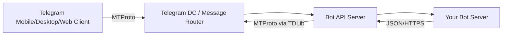
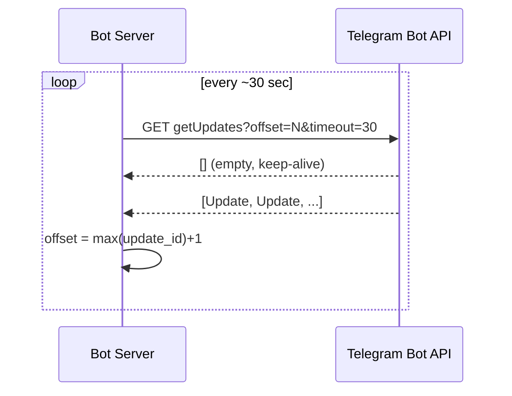
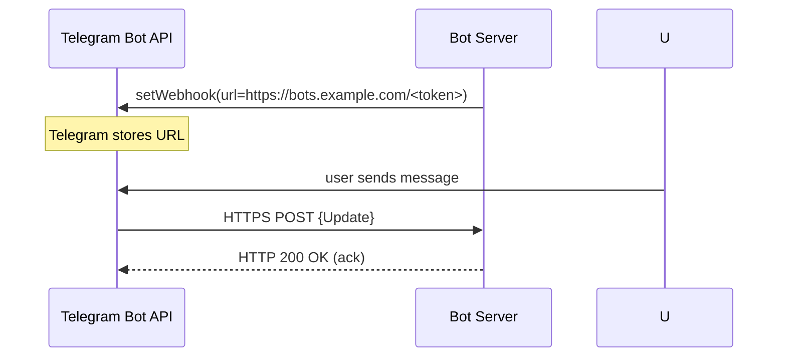
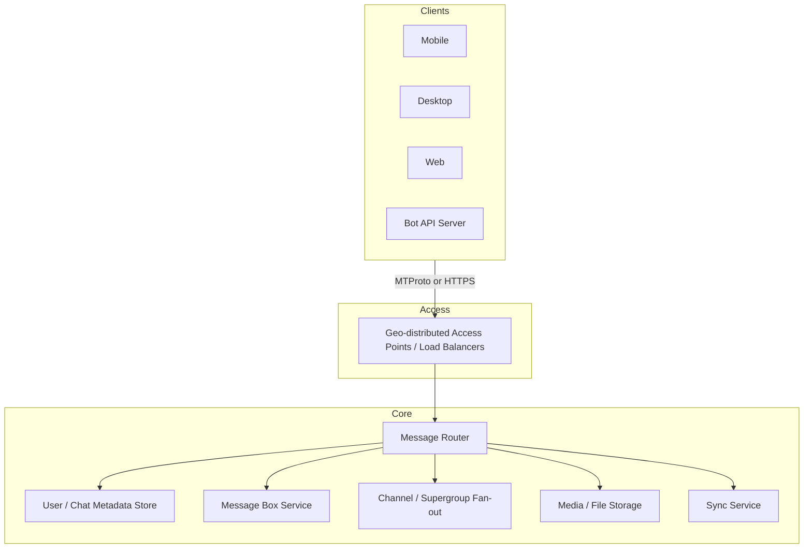
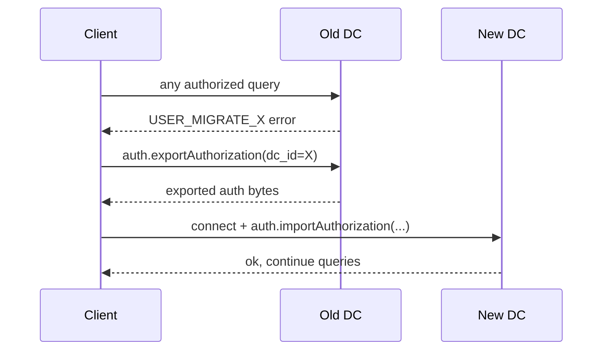
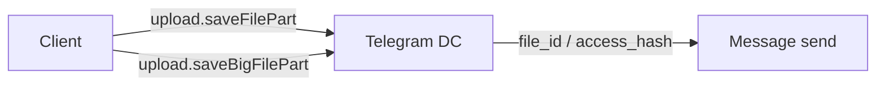
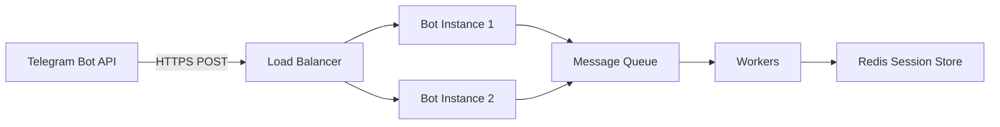
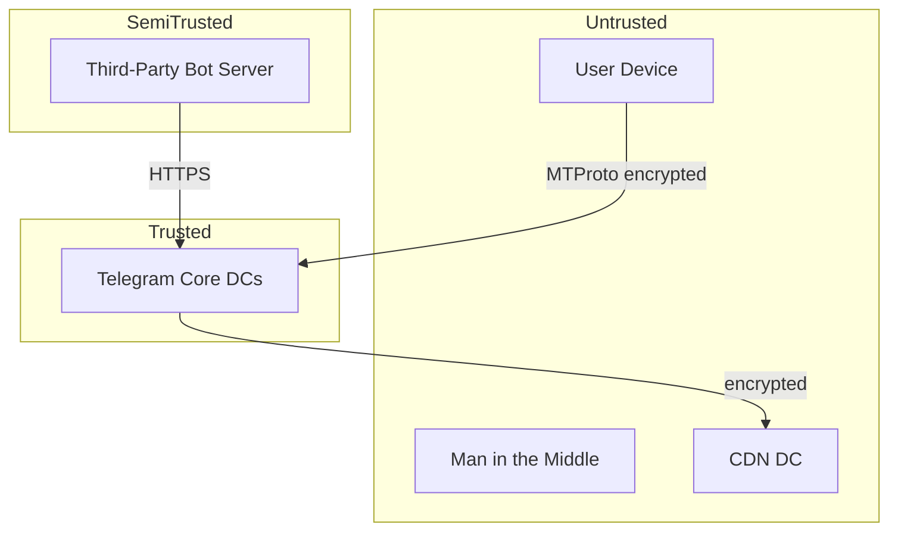

# Telegram Bot Architecture: A Deep, Practical Field Guide

> **Audience:** Developer / SRE / DevOps with a ADHD-friendly layout: short sections, callouts, diagrams, and a fat reference list.  
> **Goal:** Understand how Telegram bots actually work under the hood so you can copy, adapt, or avoid their design for another messaging app.  
> **LLM feed note:** Each section is self-contained and heavily cross-linked. Feed the doc in chunks or query by heading.

---

## Table of Contents

1. [TL;DR: The Big Picture](#1-tldr-the-big-picture)
2. [Why Telegram Is Relevant to Your Messaging App](#2-why-telegram-is-relevant-to-your-messaging-app)
3. [Telegram’s Two APIs](#3-telegrams-two-apis)
4. [MTProto: The Secret Sauce](#4-mtproto-the-secret-sauce)
5. [How the Bot API Translates to MTProto](#5-how-the-bot-api-translates-to-mtproto)
6. [Receiving Updates: Polling vs Webhooks](#6-receiving-updates-polling-vs-webhooks)
7. [High-Level Telegram Server Architecture](#7-high-level-telegram-server-architecture)
8. [Data Centers, Home DCs, and Routing](#8-data-centers-home-dcs-and-routing)
9. [Chat Types: Basic Groups, Supergroups, Channels](#9-chat-types-basic-groups-supergroups-channels)
10. [Updates, Sync, and Message Sequences](#10-updates-sync-and-message-sequences)
11. [Files, Media, and CDN](#11-files-media-and-cdn)
12. [Push Notifications](#12-push-notifications)
13. [Secret Chats vs Cloud Chats](#13-secret-chats-vs-cloud-chats)
14. [Bot Frameworks and Client Libraries](#14-bot-frameworks-and-client-libraries)
15. [Bot Features List](#15-bot-features-list)
16. [Scaling, Reliability, and SRE Patterns](#16-scaling-reliability-and-sre-patterns)
17. [Security Architecture and Threat Model](#17-security-architecture-and-threat-model)
18. [Known Bugs, Design Flaws, Failed Features, and What Not to Do](#18-known-bugs-design-flaws-failed-features-and-what-not-to-do)
19. [Decision Matrix: What to Borrow for Your App](#19-decision-matrix-what-to-borrow-for-your-app)
20. [Reference Library: Repos, Whitepapers, Links](#20-reference-library-repos-whitepapers-links)

---

## 1. TL;DR: The Big Picture

Telegram bots sit at the end of a **translation chain**:



- **End users** talk to Telegram over **MTProto**, a custom binary protocol.
- **Bots** talk to Telegram over **HTTPS+JSON** via the **Bot API**.
- The **Bot API server** (open source, C++, `telegram-bot-api`) is itself a Telegram client built on **TDLib**; it converts REST calls into MTProto calls and converts incoming MTProto events into `Update` JSON payloads pushed over webhooks or returned by long-polling.

> **Key takeaway:** The Bot API is not a first-class citizen inside Telegram’s core. It is a **translator** running in front of the real MTProto network. For your own app, this is a valid pattern: expose a simplified REST API to third-party bots while keeping your core protocol private/efficient.

---

## 2. Why Telegram Is Relevant to Your Messaging App

Telegram is one of the few large messengers whose **protocol** and **Bot API server** are documented and partially open-source. The design decisions directly apply if you are building:

- A WhatsApp/Signal/Discord-style messaging backend.
- A multi-tenant notification platform.
- A bot marketplace.
- A cloud-first messenger with multi-device sync.

### Scale anchors (publicly stated, treat as orientation, not gospel)

| Metric | Approx. value |
|--------|---------------|
| MAU | 800M – 1B+ |
| Messages/day | ~15B |
| Concurrent connections | Millions |
| Max group size | 200,000 |
| Max channel subscribers | Unlimited |
| Max file size (normal) | 2 GB |

> **Evidence grade:** Public blog posts, third-party case studies, and Telegram’s own FAQ. The exact production topology is private.

---

## 3. Telegram’s Two APIs

Telegram exposes **three** developer surfaces. Bot builders usually only need the first one.

| API | Protocol | Use case | Power level |
|-----|----------|----------|-------------|
| **Bot API** | HTTPS + JSON | Build bots quickly | Limited to bot abilities |
| **Telegram API (MTProto)** | Binary MTProto | Build custom clients / user automation | Full user power |
| **TDLib** | C++ / JSON client library | Build custom clients in any language | Full user power, easier than raw MTProto |

### Bot API design

- **Endpoint format:** `https://api.telegram.org/bot<token>/METHOD_NAME`
- **Auth:** token embedded in URL path.
- **Payloads:** JSON, form-encoded, or multipart.
- **File handling:** bots can upload/download via multipart or by `file_id` reuse.
- **Modes:** `getUpdates` (long-polling) or `setWebhook` (HTTPS POST push).
- **Updates are not kept > 24 hours.** If your bot is down longer than that, updates are lost.

> **Reference:** Official Bot API docs — [core.telegram.org/bots/api](https://core.telegram.org/bots/api)

---

## 4. MTProto: The Secret Sauce

MTProto is Telegram’s custom protocol stack. Bots rarely touch it directly, but every Bot API call is ultimately converted to it.

### Layer cake (ISO/OSI comparison from Telegram)

| Layer | Component |
|-------|-----------|
| 7 App | RPC query language / API methods |
| 6 Presentation | TL (Type Language) serialization |
| 5 Session | MTProto session + auth key |
| 4.3 | MTProto transport protocol (abridged/intermediate/full/padded) |
| 4.2 | Optional obfuscation |
| 4.1 | TCP / HTTP / HTTPS / WebSocket / UDP |
| 3 | IP |

### Core primitives

| Term | Meaning |
|------|---------|
| **auth_key** | 2048-bit DH-generated key per device, never sent over network |
| **auth_key_id** | 64-bit SHA1 fingerprint of auth_key |
| **session_id** | Random 64-bit per app instance |
| **server_salt** | 64-bit rotating every 30 min, replay protection |
| **msg_id** | Time-linked 64-bit unique ID |
| **msg_seqno** | Sequence number; content-related bit triggers ACK |
| **msg_key** | 128-bit middle SHA256 of plaintext + auth_key fragment |

### Encryption (MTProto 2.0 cloud chats)

```
aes_key, aes_iv = KDF(auth_key, msg_key)
ciphertext = AES-256-IGE(salt || session_id || msg_id || seq_no || len || body || padding)
payload = auth_key_id || msg_key || ciphertext
```

- **Padding:** 12–1024 bytes (random), included in `msg_key` hash.
- **Integrity check:** receiver recomputes `msg_key` from decrypted plaintext and rejects if mismatch.
- **Replay protection:** rejects msg_id older than 300 sec / 30 sec future, and stores recent IDs.

### What this means for your design

- A custom binary protocol is **not crazy** if you control both client and server and need mobile-network efficiency.
- But: rolling your own crypto is **high-risk**. MTProto has been attacked repeatedly. Prefer **Noise**, **TLS 1.3**, or **Signal/Double Ratchet** unless you have a dedicated cryptographer and formal verification budget.

> **Reference:** MTProto detailed description — [core.telegram.org/mtproto/description](https://core.telegram.org/mtproto/description)

---

## 5. How the Bot API Translates to MTProto

### The Bot API server is a TDLib client

Telegram open-sourced the server: [`tdlib/telegram-bot-api`](https://github.com/tdlib/telegram-bot-api).

```text
telegram-bot-api/
├── telegram-bot-api.cpp      # main entry point
├── Client.cpp / Client.h     # per-bot state machine
├── ClientManager.cpp         # multiplexes many bots onto one TDLib
├── HttpConnection.cpp        # HTTP front-end
├── WebhookActor.cpp          # outbound webhook delivery
└── Query.cpp                 # maps Bot API method → TDLib request
```

### Key behavior

- One **TDLib instance** can handle **24,000+ bots simultaneously**.
- Each bot token maps to a **bot user** in MTProto; the server acts as that bot’s client.
- `ClientManager` keeps per-bot state: webhook URL, pending updates, file downloads, auth state.
- `WebhookActor` POSTs `Update` JSON to your URL and retries on non-2xx.

### Why this matters

If you run a **local Bot API server** (`--local`), you get:

- Upload up to 2000 MB.
- Download files without 20 MB Bot API limit.
- HTTP webhook URLs (no TLS).
- Local IP/port webhooks.
- `file_path` returned as absolute local path after `getFile`.

> **Reference:** Local Bot API server docs — [core.telegram.org/bots/api#using-a-local-bot-api-server](https://core.telegram.org/bots/api#using-a-local-bot-api-server)

---

## 6. Receiving Updates: Polling vs Webhooks

Two mutually exclusive ways. Choose once per bot.

### `getUpdates` (long-polling)



**Pros:** no public URL, no TLS cert, simple dev loop.  
**Cons:** one active poller per token (409 Conflict if concurrent), latency up to timeout, consumes CPU on empty polls.

### `setWebhook` (push)



**Webhook requirements:**

- IPv4 only (no IPv6 as of current docs).
- HTTPS TLS 1.2+ on port **443, 80, 88, or 8443**.
- Accept POSTs from `149.154.160.0/20` and `91.108.4.0/22`.
- Valid cert chain (Let’s Encrypt works).
- Optional `secret_token` in `X-Telegram-Bot-Api-Secret-Token` header.

**Important webhook semantics:**

- Telegram expects a **fast 2xx response** to acknowledge delivery.
- If your handler is slow (> ~60 s), Telegram will **retry**, possibly causing duplicate processing.
- Best practice: **ack immediately**, do work asynchronously.

### Comparison table

| Concern | Polling | Webhook |
|---------|---------|---------|
| Setup | Easy | Needs public HTTPS URL |
| Latency | Up to timeout | Near real-time |
| Concurrent instances | One poller only | Many behind LB |
| Server load | Constant | Event-driven |
| Behind NAT/firewall | Fine | Must be reachable |
| Stateless horizontal scaling | Hard | Easy with shared queue |

> **Reference:** Webhook guide — [core.telegram.org/bots/webhooks](https://core.telegram.org/bots/webhooks)

---

## 7. High-Level Telegram Server Architecture

This is the **inferred** public architecture (not confirmed internal blueprints).



### Major services

| Service | Job |
|---------|-----|
| **Access Points** | TLS/MTProto termination, closest DC selection |
| **Message Router** | Decides destination DC, fan-out strategy, and delivery channel |
| **Message Box** | Per-user / per-channel ordered message history (the `pts` sequence lives here) |
| **Channel Service** | Stores channel posts once; subscribers pull on demand |
| **Sync Service** | Tracks per-device sync points; sends gaps/diffs |
| **Media Service** | Upload/download, chunking, CDN encryption, thumbnails |
| **Bot API Service** | REST facade over MTProto |

---

## 8. Data Centers, Home DCs, and Routing

### User-DC assignment

- Every account is assigned a **home data center** at registration (based on phone/IP/geo).
- Each DC is largely autonomous with its own storage.
- Most user operations stay inside the home DC for latency and data-sovereignty.

### Cross-DC scenarios

| Scenario | What happens |
|----------|--------------|
| User A (DC1) messages User B (DC3) | DC1 routes through inter-DC backbone to DC3; B reads from DC3. |
| File uploaded in DC2 | File is stored in DC2; `document.dc_id` tells clients where to download. |
| User moves/travels a lot | Server may issue `USER_MIGRATE_X`; client re-connects to new DC and imports auth. |

### Migration flow



### Lessons for your app

- Home-DC assignment reduces cross-region traffic and helps compliance.
- Cross-DC fan-out is the expensive part. Keep it off the hot path when possible.
- Migration is hard. Plan data ownership and sharding key (user_id? tenant_id?) before you need it.

> **Reference:** Working with DCs — [core.telegram.org/api/datacenter](https://core.telegram.org/api/datacenter)

---

## 9. Chat Types: Basic Groups, Supergroups, Channels

Telegram has **four** chat shapes. They affect storage, fan-out, and bot behavior.

| Type | Members | Message history | Use case | Bot notes |
|------|---------|-----------------|----------|-----------|
| **Private chat** | 2 | Full cloud sync | DMs | Simple. |
| **Basic group** | ≤ 200 | Each member has own copy | Friends | Share `pts` sequence with private chats. |
| **Supergroup** | ≤ 200,000 | Shared history | Communities | Uses channel-style `pts`; can become forum. |
| **Channel** | Unlimited | Shared history | Broadcasts | Write-optimized; subscribers pull. |

### Channel fan-out strategy

- **Store once, read many.** A post is written to one message box, not copied per subscriber.
- **Notifications only are fanned out**, and batched.
- **Muted channels skip notification fan-out entirely.**
- **Read pointer:** `last_read_msg_id` per subscriber; unread count = `latest - last_read` (O(1)).

### Lessons

- For broadcast/notification systems, **never copy the payload per recipient**. Fan out metadata only.
- Use separate per-channel event sequences so a hot channel doesn’t drown private-chat sync.

> **Reference:** Channels API — [core.telegram.org/api/channel](https://core.telegram.org/api/channel)

---

## 10. Updates, Sync, and Message Sequences

Telegram uses **multiple independent ordered sequences**. Clients must track each one.

### Sequence types

| Sequence | Name | Tracks |
|----------|------|--------|
| `seq` | Updates sequence | Top-level update bundles |
| `pts` | Common message box | Private chats + basic groups |
| `pts` (per channel) | Channel message box | Each channel/supergroup |
| `qts` | Secondary event sequence | Secret chats, some bot events |

### Applying an update safely

```python
if local_pts + pts_count == pts:
    apply(update)
    local_pts = pts
elif local_pts + pts_count > pts:
    # already applied; ignore duplicate
    pass
else:
    # gap detected
    call updates.getDifference(...) or updates.getChannelDifference(...)
```

### Gap recovery

- `updates.getDifference` for common/secret state.
- `updates.getChannelDifference` per channel.
- If gap too large, server returns `*TooLong`; client re-fetches state and re-syncs.

### Implications for bot builders

- Bot API `update_id` is sequential but **not guaranteed unique forever** if no updates for a week.
- Webhook updates may arrive **out of order** or **duplicated**. Always handle idempotently.
- Polling bots must persist `offset` correctly or they will replay updates.

> **Reference:** Working with Updates — [core.telegram.org/api/updates](https://core.telegram.org/api/updates)

---

## 11. Files, Media, and CDN

### Upload flow



- Files are split into **≤ 512 KB parts**.
- Part size must divide 512 KB evenly.
- Big files use `upload.saveBigFilePart`; supports parallel upload queues across connections.
- Bot API abstracts this with multipart `sendDocument/sendVideo`.

### Download flow

- `getFile` returns metadata; bot must then download from `https://api.telegram.org/file/bot<token>/<file_path>`.
- Direct Bot API downloads are limited to ~20 MB unless using a local server.

### Encrypted CDN

- Viral public-channel files (> 100k subscribers) may be pushed to **CDN DCs**.
- CDN gets **AES-256-CTR encrypted blobs** and **SHA-256 hashes** only.
- Client fetches key/IV from master DC, downloads encrypted chunk from CDN, decrypts, verifies hash.
- CDN has **no private user data**, no decryption keys, no write path back to master.

### Lessons

- For media-heavy apps: separate metadata and blob storage; use signed URLs/CDNs; verify integrity.
- Do **not** let untrusted edge caches see plaintext. Telegram’s encrypted-CDN pattern is a clean reference.

> **Reference:** CDN docs — [core.telegram.org/cdn](https://core.telegram.org/cdn)

---

## 12. Push Notifications

Telegram uses platform push (APNS, FCM, WNS, Web Push, Huawei, etc.) as a **wake-up signal**, not a full message carrier.

### Typical payload

```json
{
  "data": {
    "loc_key": "CHAT_MESSAGE_TEXT",
    "loc_args": ["Alice", "Hello!"],
    "user_id": 14124122,
    "custom": { "chat_id": 241233, "msg_id": 123 },
    "sound": "sound1.mp3"
  }
}
```

### Design pattern

1. Push arrives.
2. Client wakes up.
3. Client connects to MTProto and fetches actual messages via `updates.getDifference`.
4. Local notification is rendered from local cache.

### Encrypted push (FCM / APNS VoIP)

- Client registers an `auth_key` for push payloads.
- Telegram encrypts the MTProto payload and base64url-encodes it in `p` field.
- Client decrypts with the registered key.

### Lessons

- Keep push payloads **minimal** (event type + IDs). Full content in-band via your real protocol.
- Silent/data-only pushes are not guaranteed on iOS. Plan for pull-on-launch.

> **Reference:** Push notifications — [core.telegram.org/api/push-updates](https://core.telegram.org/api/push-updates)

---

## 13. Secret Chats vs Cloud Chats

| Aspect | Cloud Chat | Secret Chat |
|--------|------------|-------------|
| Encryption | Server-client (MTProto 2.0) | End-to-end (additional layer) |
| Multi-device | Yes | Tied to one device pair |
| Server can read | Yes, in principle | No (key only on devices) |
| Forwarding | Allowed | Disabled |
| Screenshot | Allowed | Can be blocked |
| Sync | Cloud history | Local only |

### E2E key exchange

- Diffie-Hellman over server-relayed messages.
- Shared 256-byte key = `pow(g_a, b) mod p`.
- Perfect Forward Secrecy: re-key after 100 messages or 1 week.

### What this means for bots

- **Bots cannot participate in Secret Chats.** They only see cloud-chat messages.
- If your app needs bot automation + true E2E, you have an architectural conflict: bots need server-side plaintext, E2E denies it. Solutions: only allow bots in cloud chats, or build client-side automation.

---

## 14. Bot Frameworks and Client Libraries

| Language | Framework | Notes |
|----------|-----------|-------|
| Python | [python-telegram-bot](https://github.com/python-telegram-bot/python-telegram-bot) | Async, persistence, handlers, jobs. |
| Python | [aiogram](https://github.com/aiogram/aiogram) | Async, typed, autogenerated API. |
| Node.js | [Telegraf](https://github.com/telegraf/telegraf) | Mature, middleware-based, TS. |
| Node.js | [grammY](https://github.com/grammyjs/grammy) | Modern, type-safe, plugin ecosystem. |
| Node.js | [GramIO](https://gramio.dev/) | Type-safe, autogenerated. |
| Go | [tgb](https://github.com/mymmrac/telego) / [gotd](https://github.com/gotd/td) for MTProto | Bot API wrapper vs full MTProto client. |
| Rust | [teloxide](https://github.com/teloxide/teloxide) | Async, typed. |
| Java | [TelegramBots](https://github.com/rubenlagus/TelegramBots) | Long-running polling/webhook abstractions. |
| C++ | [TDLib](https://github.com/tdlib/td) | Core client library used by Bot API server. |
| PHP | [telegram-bot-sdk](https://github.com/irazasyed/telegram-bot-sdk) | Popular Laravel-friendly wrapper. |

### Choosing a stack

- **HTTP Bot API:** any language with HTTP client.
- **High-scale bot hosting:** consider local Bot API server + async framework + Redis persistence.
- **User automation / client behavior:** use TDLib or raw MTProto libraries.

---

## 15. Bot Features List

### Core messaging

- Send text, photos, videos, documents, voice, stickers, locations, contacts, polls, dice.
- Edit text/caption/media/location/reply markup (`editMessage*`).
- Delete messages (`deleteMessage`).
- Reply keyboards, inline keyboards, remove keyboard.
- Message formatting: MarkdownV2, HTML, entities.
- Reactions (`setMessageReaction`, receive `message_reaction` updates).

### Conversations and UI

- Commands with scopes (`setMyCommands`, `deleteMyCommands`).
- Menu button (open Mini App or show commands).
- Inline mode: answer `@bot query` with inline query results.
- Callback queries from inline keyboards (64-byte `callback_data`).
- Custom reply keyboards, one-time keyboards, request-contact/location buttons.
- Web App / Mini Apps launch from keyboard or menu button.

### Groups and channels

- Add bots to groups/channels as members or admins.
- Admin rights model (restrict users, pin, delete, invite, etc.).
- `chat_member`, `chat_join_request`, `message_reaction_count` updates (must opt-in via `allowed_updates`).
- Channel posts delivered as `channel_post` updates.

### Payments

- **Physical goods/services:** Bot Payments API with provider tokens (Stripe, etc.).
- **Digital goods/services:** Telegram Stars (in-app currency) — Apple/Google compliant.
- Refunds via `refundStarPayment`.

### Identity and integration

- Deep links with `start` parameter (max 64 chars, `A-Za-z0-9_-`).
- Login URL / Login widget.
- Telegram Passport (identity docs, see security caveats below).
- Business Mode: bot acts on behalf of a Telegram Business account.
- Guest Mode: bot can receive/send in chats it is not a member of.
- Managed Bots (API 9.6+): a parent bot can create child bots for users.

### Media and files

- `getFile` / file downloads.
- Upload limits: 50 MB via public Bot API, 2000 MB via local server.
- Voice notes, video messages (round), live locations, albums/media groups (≤10 items).

### Updates control

- `allowed_updates` filters what your bot receives.
- `drop_pending_updates` to clear backlog.
- Webhook `max_connections` (1–100 default 40, up to 100000 local).
- `secret_token` to authenticate webhook origin.

---

## 16. Scaling, Reliability, and SRE Patterns

### Horizontal scaling with webhooks



- Put a queue (SQS, RabbitMQ, Redis Streams) between the webhook receiver and workers.
- Ack Telegram fast; process asynchronously.
- Store conversation state in Redis/Postgres, not in memory.

### Polling scaling

- Only **one** active `getUpdates` per token. If you need multiple consumers, switch to webhook or shard by bot token.
- TDLib / MTProto clients can scale more independently but are more complex.

### Reliability checklist

| Concern | Practice |
|---------|----------|
| Idempotency | Use `update_id` deduplication. |
| State persistence | Redis/Postgres, not process memory. |
| Secrets | Vault / AWS Secrets Manager / 1Password; never commit tokens. |
| TLS | Use valid certs; rotate. |
| Retries | Exponential backoff, respect `retry_after`. |
| Observability | Track update lag, webhook failures, 429 rate. |
| Circuit breakers | Back off if Telegram returns 502/429. |

### Serverless gotchas

- Cold start latency matters for webhook ack.
- Long handlers must return 200 quickly; defer work.
- API Gateway / Lambda timeout defaults (29 s) can conflict with slow LLM calls.

---

## 17. Security Architecture and Threat Model

### Trust boundaries



### Threats and mitigations

| Threat | Telegram approach | What to copy |
|--------|-------------------|--------------|
| Sniffing transport | MTProto encryption + TLS for webhooks | Use TLS 1.3 everywhere; encrypt internal traffic. |
| Replay attacks | msg_id windows + server_salt rotation | Use unique sequence IDs and short replay windows. |
| Server compromise | CDN never sees plaintext; cloud chats server-readable | Consider E2E default vs cloud-search tradeoff. |
| Bot token leak | Token revocable in @BotFather | Store tokens in secrets manager; rotate. |
| Malicious bot | Privacy mode, admin-rights model, report/spam flows | Least-privilege by default; scoped permissions. |
| Phishing via deep links | Deep links are just URLs; user education | Sign deep-link params; warn users. |

### What Telegram does **not** guarantee

- Cloud chats are **not** end-to-end encrypted. Telegram can technically decrypt them.
- Secret chats are E2E but bots cannot join them.
- Bot API tokens in URL path are logged by some HTTP proxies/load balancers. Prefer header-based auth for your own API.

---

## 18. Known Bugs, Design Flaws, Failed Features, and What Not to Do

> **This section is the “lessons learned” part.** Use it to avoid the same scars.

### 18.1 Telegram-level bugs and security issues

| Issue | What happened | Lesson |
|-------|---------------|--------|
| **MTProto 1.0 → 2.0 upgrade** | v1.0 used SHA-1 and weak padding; researchers showed it was not IND-CCA secure. Telegram upgraded to SHA-256 + larger padding. | Plan crypto agility from day one. |
| **MTProto symmetric attacks (2021)** | Royal Holloway / ETH found 4 vulnerabilities allowing theoretical plaintext leakage / reordering in MTProto 2.0 clients. Fixed in clients. | Formal verification helps; custom crypto invites scrutiny. |
| **Phone-number enumeration (2020 breach)** | Attackers uploaded millions of phone numbers via API to map them to Telegram accounts. Public data (username, phone, user ID) leaked. | Rate-limit contact discovery; require proof-of-work or rate limiting on identity lookup. |
| **Telegram Passport brute force (2018)** | Passport data encrypted with user password; SHA-512-based KDF made offline brute force feasible. | Use Argon2id/scrypt for password KDF; don’t rely on user-chosen passwords alone. |
| **Self-destructing photo bypass (Android 7.5–7.8)** | CVE allowed screenshots/recovery of “self-destruct” images. | Client-enforced deletion is not enough; treat as best-effort. |
| **TON / Gram cancellation (2020)** | SEC sued Telegram for unregistered securities sale; $1.7B project shut down. | Regulatory review before token/financial features. |

### 18.2 Bot API design flaws and limitations

| Flaw | Impact | Workaround |
|------|--------|------------|
| **Token in URL path** | Leaked to logs/proxies. | N/A for Telegram; for your API use `Authorization: Bearer` header. |
| **409 Conflict: polling vs webhook** | Two processes with same token fight. | Use one mode; coordinate via Redis lock. |
| **Updates > 24h dropped** | Downtime longer than 24h = data loss. | Add out-of-band state recovery or queue. |
| **Bots can’t see other bots’ messages** | Breaks bot-to-bot workflows. | Use a human relay or external bridge. |
| **No bot-to-bot messaging until recently** | Limited automation chains. | Newer API allows it if both opt-in. |
| **File size limits (50 MB public API)** | Large media bots need local server. | Run local `telegram-bot-api` or use MTProto. |
| **Callback data 64 bytes** | Stateful inline buttons need external mapping. | Store UUID → payload in Redis. |
| **Deep-link start param 64 chars, limited charset** | Can’t pass rich JSON. | Base64url + short refs; fetch rest server-side. |
| **Message text 4096 chars; MarkdownV2 escaping is finicky** | Long messages / dynamic content break. | Split messages; use HTML parse mode; escape helper library. |
| **editMessageText within 48h only** | Edits not possible after 2 days. | Design UI around immutability. |
| **Webhook timeout ~60s; retries can duplicate** | Slow handlers cause redelivery. | Ack fast + async queue. |
| **chat_member updates not always delivered** | Reported missing ~15–20% in some setups. | Poll membership explicitly for critical flows. |
| **Command menu cached ~5 min on clients** | Changes don’t appear instantly. | Document refresh behavior; use fallback `/help`. |

### 18.3 Failed, deprecated, or problematic features

| Feature | Status | Notes |
|---------|--------|-------|
| **Telegram Passport** | Still exists, but trust is low due to brute-force history and centralized storage of ID docs. | Avoid storing sensitive identity docs in cloud unless legally required and hardened. |
| **TON / Gram** | Cancelled by SEC; TON blockchain later revived independently by community. | Don’t tie core messaging infra to speculative tokens. |
| **Markdown (legacy parse mode)** | Kept for backward compatibility; MarkdownV2/HTML preferred. | Avoid legacy modes in new bots. |
| **MTProto 1.0** | Deprecated. | Never implement v1.0. |
| **Old Secret Chat layers** | Deprecated; clients must negotiate layer ≥ 46. | Always support protocol versioning. |
| **Contains_masks field / old payments API** | Removed/deprecated in favor of Stars and current payments. | Stay on current API; deprecate old paths cleanly. |

### 18.4 Common developer mistakes

| Mistake | Why it hurts | Fix |
|---------|--------------|-----|
| **Hardcoded bot token in repo** | Full account takeover. | Secrets manager + CI injection. |
| **No rate-limit handling** | Bot gets 429s, queues explode, IP-wide blocks. | Use framework `flood_wait` handling / retry after. |
| **Processing webhooks synchronously** | Timeouts → retries → duplicate work. | 202 ack + background job. |
| **In-memory conversation state** | Restart = lost sessions; horizontal scaling impossible. | Redis/Postgres persistence. |
| **Trusting `callback_data` content** | Users can craft callbacks; validate. | Treat as opaque ID; authorize action server-side. |
| **Ignoring `allowed_updates`** | Flooded with irrelevant updates. | Filter to needed types. |
| **Not deduplicating `update_id`** | Duplicate commands / double charges. | Idempotency key per update. |
| **Using self-signed cert on public webhook** | Telegram may reject; debugging pain. | Use Let’s Encrypt or local mode. |
| **No webhook IP allowlist** | Anyone can POST fake updates unless you check secret_token. | Verify `X-Telegram-Bot-Api-Secret-Token`. |
| **Letting bots become group admins by default** | Takeover/spam risk. | Prompt user explicitly; default to minimal rights. |
| **Concatenating user input into MarkdownV2** | Formatting errors or injection. | Escape with library; prefer HTML for dynamic content. |

### 18.5 Scams and abuse patterns enabled by the bot platform

- **Fake support/verification bots** — impersonate Telegram Support, steal login codes.
- **Phishing via `t.me/<bot>?start=<ref>`** — official-looking short links.
- **Crypto wallet drainers** — bots ask users to sign malicious transactions.
- **Pump-and-dump / investment scam bots** — fabricated balances, blocked withdrawals.
- **Malware C2 via Telegram bots** — infostealers exfiltrate to a private bot.

### What to **not** do when copying Telegram

1. **Do not roll your own crypto.** MTProto’s history proves this is expensive and risky. Use TLS 1.3 + a vetted E2E library if needed.
2. **Do not put auth tokens in URL paths.** Use headers.
3. **Do not fan out the full message body to millions of subscribers.** Fan out notifications; store the body once.
4. **Do not let bots read all group messages by default.** Privacy mode is a good default.
5. **Do not drop updates after a fixed TTL without an out-of-band recovery path.** 24h is surprisingly short in incident response.
6. **Do not skip idempotency on webhook delivery.** Retries are not edge cases; they are normal.
7. **Do not store sensitive identity docs encrypted only with user passwords.** Add server-side rate-limiting and strong KDF.
8. **Do not couple core messaging to financial tokens or securities.** See TON.
9. **Do not ignore client-side caching of bot commands/menus.** Your API may update instantly; the UI won’t.
10. **Do not assume silent push notifications are reliable.** They are hints, not guarantees.

---

## 19. Decision Matrix: What to Borrow for Your App

| Telegram pattern | Borrow? | Notes |
|------------------|---------|-------|
| REST Bot API facade over internal protocol | **Yes** | Lowers barrier for third-party devs. |
| Long-polling + webhooks dual update model | **Yes** | Covers dev/prod/scale needs. |
| Home-DC sharding | **Yes, if multi-region** | Simplifies data ownership. |
| Encrypted CDN edge caches | **Yes, for public viral media** | Keep plaintext away from edge. |
| Custom binary protocol (MTProto) | **Maybe** | Only if you need mobile efficiency and can fund crypto review. |
| Server-readable cloud chats by default | **Maybe** | Trade off: multi-device sync vs privacy marketing. |
| Secret-chat E2E model | **No for bots** | Bots can’t use it; prefer Signal/MLS for E2E. |
| Token-in-URL auth | **No** | Use Bearer tokens. |
| 24-hour update retention | **No** | Longer retention helps incident recovery. |
| 64-byte callback_data | **No** | Give richer IDs or signed blobs. |
| Default admin rights for bots | **No** | Least privilege by default. |

---

## 20. Reference Library: Repos, Whitepapers, Links

### Official Telegram documentation

- Bot API: [core.telegram.org/bots/api](https://core.telegram.org/bots/api)
- Bot FAQ / limits: [core.telegram.org/bots/faq](https://core.telegram.org/bots/faq)
- Webhooks guide: [core.telegram.org/bots/webhooks](https://core.telegram.org/bots/webhooks)
- Bot features overview: [core.telegram.org/bots/features](https://core.telegram.org/bots/features)
- Payments: [core.telegram.org/bots/payments](https://core.telegram.org/bots/payments)
- Stars payments: [core.telegram.org/bots/payments-stars](https://core.telegram.org/bots/payments-stars)
- MTProto: [core.telegram.org/mtproto](https://core.telegram.org/mtproto)
- MTProto detailed description: [core.telegram.org/mtproto/description](https://core.telegram.org/mtproto/description)
- TL Language: [core.telegram.org/mtproto/TL](https://core.telegram.org/mtproto/TL)
- Service messages: [core.telegram.org/mtproto/service_messages](https://core.telegram.org/mtproto/service_messages)
- Updates handling: [core.telegram.org/api/updates](https://core.telegram.org/api/updates)
- Data centers: [core.telegram.org/api/datacenter](https://core.telegram.org/api/datacenter)
- Channels/groups: [core.telegram.org/api/channel](https://core.telegram.org/api/channel)
- Files: [core.telegram.org/api/files](https://core.telegram.org/api/files)
- CDN: [core.telegram.org/cdn](https://core.telegram.org/cdn)
- Push notifications: [core.telegram.org/api/push-updates](https://core.telegram.org/api/push-updates)
- Secret chats / E2E: [core.telegram.org/api/end-to-end](https://core.telegram.org/api/end-to-end)
- Reactions: [core.telegram.org/api/reactions](https://core.telegram.org/api/reactions)
- Stories: [core.telegram.org/api/stories](https://core.telegram.org/api/stories)
- TDLib getting started: [core.telegram.org/tdlib/getting-started](https://core.telegram.org/tdlib/getting-started)

### Open-source repositories

- Telegram Bot API server (C++): [github.com/tdlib/telegram-bot-api](https://github.com/tdlib/telegram-bot-api)
- TDLib (cross-platform client library): [github.com/tdlib/td](https://github.com/tdlib/td)
- MTProto proxy reference: [github.com/TelegramMessenger/MTProxy](https://github.com/TelegramMessenger/MTProxy)
- python-telegram-bot: [github.com/python-telegram-bot/python-telegram-bot](https://github.com/python-telegram-bot/python-telegram-bot)
- aiogram: [github.com/aiogram/aiogram](https://github.com/aiogram/aiogram)
- Telegraf: [github.com/telegraf/telegraf](https://github.com/telegraf/telegraf)
- grammY: [github.com/grammyjs/grammy](https://github.com/grammyjs/grammy)
- GramIO: [github.com/gramiojs/gramio](https://github.com/gramiojs/gramio)
- teloxide (Rust): [github.com/teloxide/teloxide](https://github.com/teloxide/teloxide)
- gotd / td (Go MTProto): [github.com/gotd/td](https://github.com/gotd/td)
- Teamgram (unofficial Go MTProto server): [github.com/teamgram/teamgram-server](https://github.com/teamgram/teamgram-server)

### Academic / whitepaper resources

- MTProto 2.0 symbolic verification (ProVerif): [ScienceDirect / Journal of Computer Security](https://www.sciencedirect.com/science/article/abs/pii/S0167404822004643)
- “Four Attacks and a Proof for Telegram”: [mtpsym.github.io/paper.pdf](https://mtpsym.github.io/paper.pdf)
- “On the CCA (in)security of MTProto” (2015): [eprint.iacr.org/2015/1177.pdf](https://eprint.iacr.org/2015/1177.pdf)
- MIT 6.857 project security analysis: [courses.csail.mit.edu/6.857/2017/project/19.pdf](https://courses.csail.mit.edu/6.857/2017/project/19.pdf)
- System Design Case Study (SysDesign Wiki): [sysdesign.wiki/systems/telegram](https://sysdesign.wiki/systems/telegram/)

### Security / incident chronicles

- Wikipedia security issue list: [en.wikipedia.org/wiki/List_of_security_issues_associated_with_Telegram](https://en.wikipedia.org/wiki/List_of_security_issues_associated_with_Telegram)
- Telegram CVE list: [cvedetails.com/vulnerability-list/vendor_id-16210/Telegram.html](https://www.cvedetails.com/vulnerability-list/vendor_id-16210/Telegram.html)
- Telegram bug tracker: [bugs.telegram.org](https://bugs.telegram.org)
- Telegram bug bounty: [core.telegram.org/bug-bounty](https://core.telegram.org/bug-bounty)

### SRE / scaling reading

- grammY flood limits guide: [grammy.dev/advanced/flood](https://grammy.dev/advanced/flood)
- python-telegram-bot avoiding flood limits: [github.com/python-telegram-bot/python-telegram-bot/wiki/Avoiding-flood-limits](https://github.com/python-telegram-bot/python-telegram-bot/wiki/Avoiding-flood-limits)
- Bot API library examples: [core.telegram.org/bots/samples](https://core.telegram.org/bots/samples)

---

## Final Takeaways for Builders

1. **The Bot API is a translator, not the core.** This is a deliberate layering decision that lets Telegram keep MTProto efficient while giving developers an easy HTTPS interface.
2. **Scale comes from store-once / fan-out-metadata patterns.** Channels are the canonical example.
3. **Updates are hard.** Multiple sequences, gaps, deduplication, and TTLs are non-negotiable.
4. **Security is a sequence of tradeoffs.** Cloud sync vs E2E; bot plaintext vs user privacy; custom protocol vs standard crypto.
5. **Operate defensively.** Fast webhook acks, async workers, shared state, idempotency, and rate-limit handling are table stakes.
6. **Copy the patterns, not the mistakes.** Avoid token-in-URL, weak KDFs, 24h-only retention, and over-privileged bots.

---

*Document version: 2026-06-16. Built for quick scanning, deep linking, and LLM chunking.*
